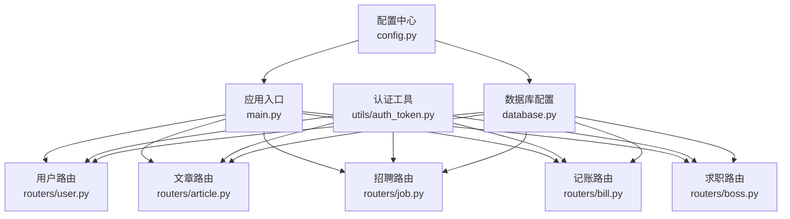
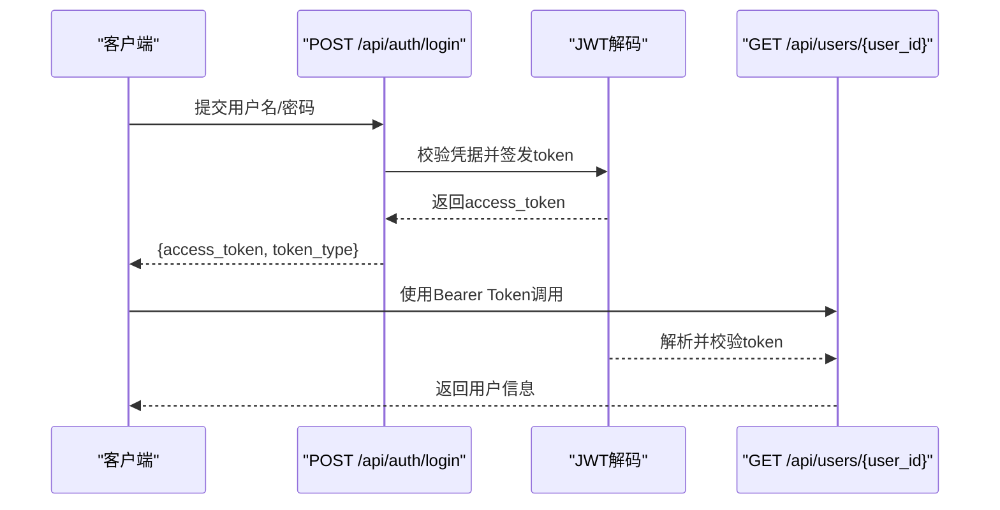
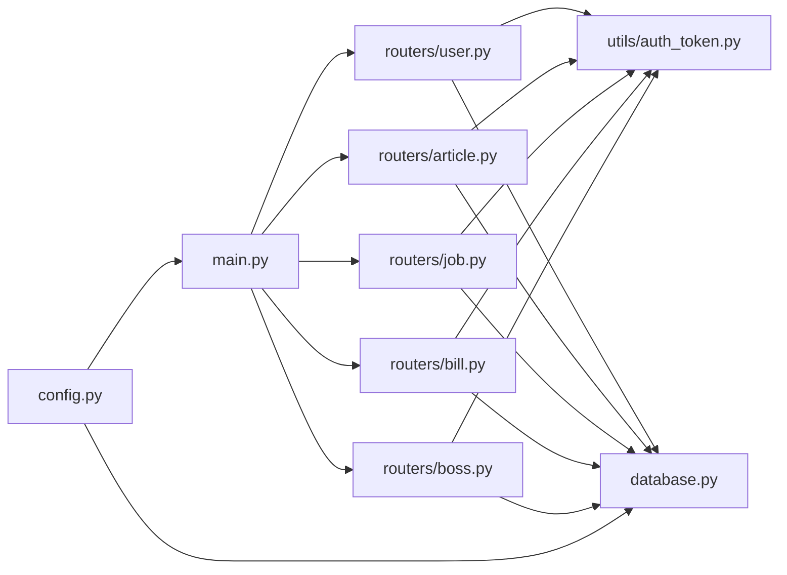
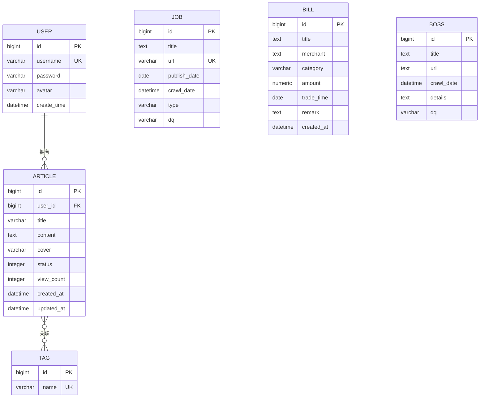

# API接口文档

<cite>
**本文引用的文件**
- [main.py](file://blog_backend/main.py)
- [config.py](file://blog_backend/config.py)
- [database.py](file://blog_backend/database.py)
- [auth_token.py](file://blog_backend/utils/auth_token.py)
- [user.py](file://blog_backend/routers/user.py)
- [article.py](file://blog_backend/routers/article.py)
- [job.py](file://blog_backend/routers/job.py)
- [bill.py](file://blog_backend/routers/bill.py)
- [boss.py](file://blog_backend/routers/boss.py)
- [user.py](file://blog_backend/models/user.py)
- [article.py](file://blog_backend/models/article.py)
- [job.py](file://blog_backend/models/job.py)
- [bill.py](file://blog_backend/models/bill.py)
- [boss.py](file://blog_backend/models/boss.py)
</cite>

## 目录
1. [简介](#简介)
2. [项目结构](#项目结构)
3. [核心组件](#核心组件)
4. [架构总览](#架构总览)
5. [详细组件分析](#详细组件分析)
6. [依赖分析](#依赖分析)
7. [性能考虑](#性能考虑)
8. [故障排查指南](#故障排查指南)
9. [结论](#结论)
10. [附录](#附录)

## 简介
本接口文档面向博客系统的RESTful API，覆盖用户管理、文章管理、招聘信息、记账管理和求职管理五大模块。文档提供每个端点的HTTP方法、URL模式、请求参数与响应格式，并说明认证机制、权限控制、错误码与示例、测试与调试建议，以及API版本管理与向后兼容策略。

## 项目结构
后端基于FastAPI构建，采用模块化路由组织方式，各功能域通过独立的router模块暴露API；数据库使用SQLAlchemy进行ORM映射；认证采用JWT方案；部分功能包含后台爬虫任务。

图表来源
- [main.py:1-13](file://blog_backend/main.py#L1-L13)
- [user.py:1-101](file://blog_backend/routers/user.py#L1-L101)
- [article.py:1-85](file://blog_backend/routers/article.py#L1-L85)
- [job.py:1-76](file://blog_backend/routers/job.py#L1-L76)
- [bill.py:1-173](file://blog_backend/routers/bill.py#L1-L173)
- [boss.py:1-134](file://blog_backend/routers/boss.py#L1-L134)
- [auth_token.py:1-38](file://blog_backend/utils/auth_token.py#L1-L38)
- [database.py:1-18](file://blog_backend/database.py#L1-L18)
- [config.py:1-32](file://blog_backend/config.py#L1-L32)

章节来源
- [main.py:1-13](file://blog_backend/main.py#L1-L13)
- [config.py:1-32](file://blog_backend/config.py#L1-L32)
- [database.py:1-18](file://blog_backend/database.py#L1-L18)

## 核心组件
- 应用入口与路由挂载：在应用启动时将各模块路由挂载至统一前缀，便于版本化管理与分组展示。
- 认证与权限：通过OAuth2 Bearer Token方案，结合JWT解析当前用户身份，用于文章增删改查等需要授权的操作。
- 数据库会话：提供统一的数据库会话依赖，确保每个请求生命周期内数据库连接的正确打开与关闭。
- 配置中心：集中管理数据库连接串、密钥算法、爬虫基础地址与目标文件路径等全局配置。

章节来源
- [main.py:6-10](file://blog_backend/main.py#L6-L10)
- [auth_token.py:20-38](file://blog_backend/utils/auth_token.py#L20-L38)
- [database.py:13-18](file://blog_backend/database.py#L13-L18)
- [config.py:3-31](file://blog_backend/config.py#L3-L31)

## 架构总览
以下序列图展示了用户登录与文章发布流程中的关键交互：

图表来源
- [user.py:37-51](file://blog_backend/routers/user.py#L37-L51)
- [auth_token.py:22-38](file://blog_backend/utils/auth_token.py#L22-L38)

## 详细组件分析

### 用户管理API
- 前缀：/api
- 认证：无需
- 权限：无需

1) 注册
- 方法：POST
- 路径：/users
- 请求体字段
  - username: 字符串，必填，唯一
  - password: 字符串，必填
  - avatar: 字符串，可选
- 成功响应：返回创建的用户对象
- 错误码
  - 400：用户名已存在

2) 登录
- 方法：POST
- 路径：/auth/login
- 请求体字段
  - username: 字符串，必填
  - password: 字符串，必填
- 成功响应：{access_token, token_type}
- 错误码
  - 400：用户名不存在或密码错误

3) 分页模糊查询用户
- 方法：GET
- 路径：/users
- 查询参数
  - searchname: 字符串，必填，用于模糊匹配用户名
  - page: 整数，>=1，默认1
  - size: 整数，1~100，默认10
- 成功响应字段
  - users: 数组，元素包含id、username、create_time
  - page、size、has_more
- 错误码
  - 400：searchname为空

4) 根据用户ID查询用户
- 方法：GET
- 路径：/users/{user_id}
- 成功响应：{username, avatar, id, create_time}
- 错误码
  - 404：用户不存在

章节来源
- [user.py:16-33](file://blog_backend/routers/user.py#L16-L33)
- [user.py:37-51](file://blog_backend/routers/user.py#L37-L51)
- [user.py:55-92](file://blog_backend/routers/user.py#L55-L92)
- [user.py:95-101](file://blog_backend/routers/user.py#L95-L101)

### 文章管理API
- 前缀：/api
- 认证：需要（Bearer Token）
- 权限：仅文章作者可编辑/删除

1) 发布文章
- 方法：POST
- 路径：/articles
- 请求头
  - Authorization: Bearer {access_token}
- 请求体字段
  - title: 字符串，必填
  - content: 文本，必填
  - cover: 字符串，可选
- 成功响应：返回新建文章对象
- 错误码
  - 401：未提供有效token或用户不存在

2) 获取用户文章列表（分页）
- 方法：GET
- 路径：/users/{username}/articles
- 路径参数
  - username: 字符串，必填
- 查询参数
  - page: 整数，>=1，默认1
  - size: 整数，>=1，默认10
- 成功响应字段
  - articles: 文章数组
  - total: 总数
  - total_page: 总页数
- 错误码
  - 200：用户不存在（注意：此处返回状态码为200但携带错误描述）

3) 查看文章详情
- 方法：GET
- 路径：/articles/{article_id}
- 成功响应字段
  - article: 文章对象
  - author: 作者用户名
- 错误码
  - 404：文章不存在

4) 删除文章
- 方法：DELETE
- 路径：/articles/{article_id}
- 请求头
  - Authorization: Bearer {access_token}
- 成功响应：{"message": "文章删除成功"}
- 错误码
  - 404：文章不存在
  - 403：无权限删除该文章

5) 编辑文章
- 方法：PUT
- 路径：/articles/{article_id}
- 请求头
  - Authorization: Bearer {access_token}
- 请求体字段
  - title: 字符串，必填
  - content: 文本，必填
  - cover: 字符串，可选
- 成功响应：{"message": "文章编辑成功"}
- 错误码
  - 404：文章不存在
  - 403：无权限编辑该文章

章节来源
- [article.py:12-25](file://blog_backend/routers/article.py#L12-L25)
- [article.py:29-43](file://blog_backend/routers/article.py#L29-L43)
- [article.py:46-53](file://blog_backend/routers/article.py#L46-L53)
- [article.py:56-68](file://blog_backend/routers/article.py#L56-L68)
- [article.py:71-85](file://blog_backend/routers/article.py#L71-L85)

### 招聘信息API
- 前缀：/api
- 认证：无需
- 权限：无需

1) 查询招聘信息（按日期范围）
- 方法：GET
- 路径：/jobs
- 查询参数
  - query_date: 日期，必填
  - range: 字符串，weekly 或 monthly，默认weekly
- 成功响应字段
  - jobs: 数组，元素包含id、title、url、publish_date、crawl_date、type、dq
- 错误码
  - 无显式错误码定义，异常由框架默认处理

2) 触发爬虫任务（后台）
- 方法：POST
- 路径：/actions/crawl
- 成功响应：{"message": "爬虫任务已在后台启动"}

章节来源
- [job.py:17-60](file://blog_backend/routers/job.py#L17-L60)
- [job.py:71-76](file://blog_backend/routers/job.py#L71-L76)

### 记账管理API
- 前缀：/api
- 认证：无需
- 权限：无需

1) 图片批量上传并识别账单
- 方法：POST
- 路径：/actions/bill
- 请求体
  - files: 文件数组（multipart/form-data），必填
- 成功响应：数组，元素为识别结果或错误信息
- 错误码
  - 无显式错误码定义，异常由框架默认处理

2) 创建账单（单个或批量）
- 方法：POST
- 路径：/bills
- 请求体
  - 单个：BillCreate 对象
  - 批量：BillCreate 对象数组
- 成功响应
  - 单个：{"success": true, "message": "...", "data": Bill}
  - 批量：{"success": true, "message": "...", "count": N, "data": Bill数组}
- 错误码
  - 500：创建失败

3) 查询账单（按日期范围）
- 方法：GET
- 路径：/bills
- 查询参数
  - range: weekly 或 monthly，可选
  - query_date: 日期，可选（默认当天）
  - start_date: 日期，可选
  - end_date: 日期，可选
- 成功响应字段
  - bills: 数组，元素包含id、amount、category、merchant、title、trade_time、remark
- 错误码
  - 无显式错误码定义，异常由框架默认处理

章节来源
- [bill.py:24-51](file://blog_backend/routers/bill.py#L24-L51)
- [bill.py:55-116](file://blog_backend/routers/bill.py#L55-L116)
- [bill.py:117-173](file://blog_backend/routers/bill.py#L117-L173)

### 求职管理API
- 前缀：/api
- 认证：无需
- 权限：无需

1) HTML抓取（批量）
- 方法：POST
- 路径：/boss/crawl
- 请求体
  - urls: 字符串数组，必填
- 成功响应：{"success": true, "message": "...", "data": 结果数组}
- 错误码
  - 500：抓取失败

2) 保存投递记录（单个或批量）
- 方法：POST
- 路径：/boss
- 请求体
  - 单个：BossCreate 对象
  - 批量：BossCreate 对象数组
- 成功响应
  - 单个：{"success": true, "message": "...", "data": Boss}
  - 批量：{"success": true, "message": "...", "count": N, "data": Boss数组}
- 错误码
  - 409：存在重复的职位链接（url）
  - 500：创建失败

3) 查询投递记录（按日期范围）
- 方法：GET
- 路径：/boss
- 查询参数
  - query_date: 日期，必填
  - range: weekly 或 monthly，默认weekly
- 成功响应字段
  - bosses: 数组，元素包含id、title、url、details、dq、crawl_date
- 错误码
  - 无显式错误码定义，异常由框架默认处理

章节来源
- [boss.py:16-31](file://blog_backend/routers/boss.py#L16-L31)
- [boss.py:33-84](file://blog_backend/routers/boss.py#L33-L84)
- [boss.py:86-127](file://blog_backend/routers/boss.py#L86-L127)

## 依赖分析
- 路由与应用：主应用将各模块路由挂载到统一前缀，便于后续版本化与扩展。
- 认证依赖：用户路由与文章路由依赖认证工具解析当前用户，实现基于token的身份校验。
- 数据库依赖：各路由通过依赖注入获取数据库会话，保证事务一致性与资源释放。
- 配置依赖：数据库连接串、JWT密钥与算法、爬虫基础地址等集中于配置模块。

图表来源
- [main.py:6-10](file://blog_backend/main.py#L6-L10)
- [auth_token.py:1-38](file://blog_backend/utils/auth_token.py#L1-L38)
- [database.py:1-18](file://blog_backend/database.py#L1-L18)
- [config.py:1-32](file://blog_backend/config.py#L1-L32)

章节来源
- [main.py:6-10](file://blog_backend/main.py#L6-L10)
- [auth_token.py:1-38](file://blog_backend/utils/auth_token.py#L1-L38)
- [database.py:1-18](file://blog_backend/database.py#L1-L18)
- [config.py:1-32](file://blog_backend/config.py#L1-L32)

## 性能考虑
- 分页查询：用户与文章列表均支持分页，避免一次性加载过多数据；建议前端合理设置size上限。
- 数据库连接：通过依赖注入确保每个请求结束后关闭会话，降低连接泄漏风险。
- 异步上传：记账图片识别采用线程池异步执行，提升并发吞吐。
- 爬虫任务：招聘信息与求职信息的抓取通过后台任务执行，避免阻塞主线程。

## 故障排查指南
- 认证相关
  - 401 token无效或用户不存在：检查Authorization头格式与签名密钥、算法配置。
  - 403 无权限：确认当前用户是否为目标资源的拥有者。
- 用户相关
  - 400 用户名已存在：注册时检查用户名唯一性。
  - 400 searchname为空：查询用户时确保传入非空字符串。
- 文章相关
  - 200 用户不存在：注意该端点返回状态码为200但携带错误描述，需按约定处理。
  - 404 文章不存在：确认文章ID与所属用户。
- 记账相关
  - 500 创建账单失败：检查请求体字段与数据库约束。
- 求职相关
  - 409 存在重复的职位链接（url）：去重后再提交。

章节来源
- [auth_token.py:22-38](file://blog_backend/utils/auth_token.py#L22-L38)
- [user.py:19-21](file://blog_backend/routers/user.py#L19-L21)
- [user.py:63-64](file://blog_backend/routers/user.py#L63-L64)
- [article.py:34](file://blog_backend/routers/article.py#L34)
- [article.py:50-51](file://blog_backend/routers/article.py#L50-L51)
- [bill.py:112-115](file://blog_backend/routers/bill.py#L112-L115)
- [boss.py:73-84](file://blog_backend/routers/boss.py#L73-L84)

## 结论
本接口文档梳理了博客系统的核心RESTful API，明确了各模块的端点、参数、响应与错误处理策略。通过统一的路由前缀与认证机制，系统具备良好的可维护性与扩展性。建议在生产环境中补充速率限制、输入校验与审计日志，并持续完善错误码与响应结构的一致性。

## 附录

### 认证机制与权限控制
- 认证方式：OAuth2 Bearer Token（JWT）
- token生成：基于用户名与过期时间编码
- token校验：解析payload并查询用户是否存在
- 授权场景：文章的编辑/删除需要与作者身份一致

章节来源
- [auth_token.py:12-17](file://blog_backend/utils/auth_token.py#L12-L17)
- [auth_token.py:22-38](file://blog_backend/utils/auth_token.py#L22-L38)
- [article.py:62-64](file://blog_backend/routers/article.py#L62-L64)

### 速率限制
- 当前代码未实现速率限制。建议在网关层或中间件中引入基于IP/Key的限流策略，防止滥用。

### API版本管理与向后兼容
- 版本策略：当前所有端点均位于/api前缀下，便于未来迁移到/api/v1等版本路径。
- 兼容性：新增字段建议保持默认值，避免破坏现有客户端行为；删除字段应先标记废弃再移除。

### 数据模型概览

图表来源
- [user.py:5-14](file://blog_backend/models/user.py#L5-L14)
- [article.py:16-41](file://blog_backend/models/article.py#L16-L41)
- [job.py:5-15](file://blog_backend/models/job.py#L5-L15)
- [bill.py:7-24](file://blog_backend/models/bill.py#L7-L24)
- [boss.py:5-15](file://blog_backend/models/boss.py#L5-L15)