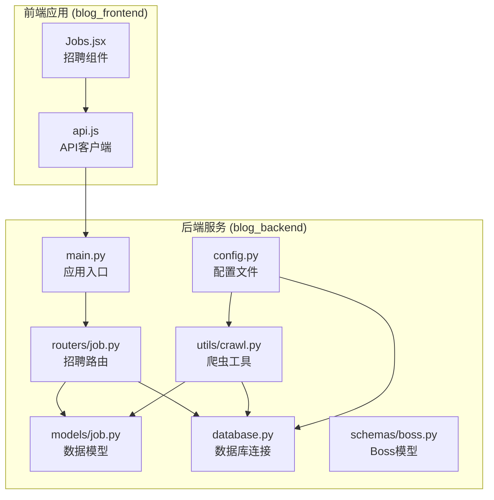
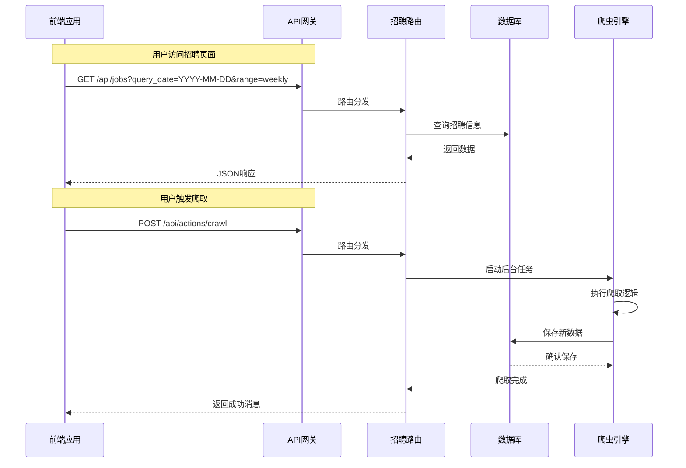
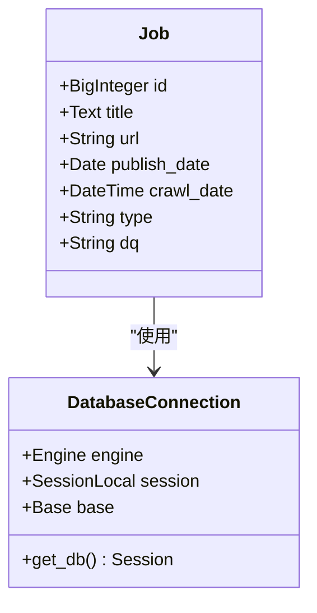
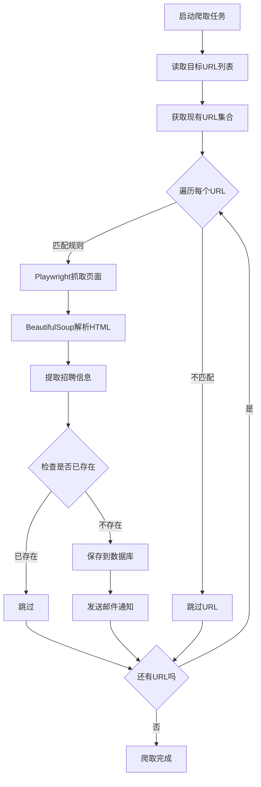
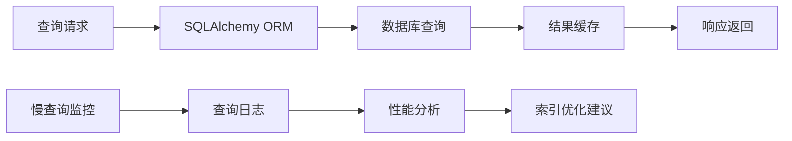

# 招聘信息API

<cite>
**本文档引用的文件**
- [main.py](file://blog_backend/main.py)
- [job.py](file://blog_backend/routers/job.py)
- [job.py](file://blog_backend/models/job.py)
- [database.py](file://blog_backend/database.py)
- [config.py](file://blog_backend/config.py)
- [crawl.py](file://blog_backend/utils/crawl.py)
- [targets.txt](file://blog_backend/targets.txt)
- [api.js](file://blog_frontend/src/api.js)
- [Jobs.jsx](file://blog_frontend/src/components/Jobs.jsx)
</cite>

## 目录
1. [简介](#简介)
2. [项目结构](#项目结构)
3. [核心组件](#核心组件)
4. [架构概览](#架构概览)
5. [详细接口文档](#详细接口文档)
6. [数据模型与业务规则](#数据模型与业务规则)
7. [爬取机制](#爬取机制)
8. [查询优化策略](#查询优化策略)
9. [性能考虑](#性能考虑)
10. [故障排除指南](#故障排除指南)
11. [结论](#结论)

## 简介

招聘信息API是一个基于FastAPI构建的招聘数据管理系统，提供了完整的招聘信息生命周期管理功能。该系统集成了Web爬虫机制，能够自动抓取指定网站的招聘信息，并提供RESTful API接口供前端应用调用。

系统主要功能包括：
- 招聘信息的自动爬取和存储
- 按日期范围查询招聘信息
- 招聘信息的可视化展示
- 后台爬虫任务管理

## 项目结构



**图表来源**
- [main.py:1-13](file://blog_backend/main.py#L1-L13)
- [job.py:1-76](file://blog_backend/routers/job.py#L1-L76)
- [job.py:1-15](file://blog_backend/models/job.py#L1-L15)

**章节来源**
- [main.py:1-13](file://blog_backend/main.py#L1-L13)
- [job.py:1-76](file://blog_backend/routers/job.py#L1-L76)
- [job.py:1-15](file://blog_backend/models/job.py#L1-L15)

## 核心组件

### 应用入口与路由注册

应用通过FastAPI框架构建，采用模块化设计，将不同功能的路由分别组织在独立的模块中：

- **应用入口**: [main.py](file://blog_backend/main.py) - 定义了主应用实例并注册了各个路由模块
- **招聘路由**: [job.py](file://blog_backend/routers/job.py) - 实现了招聘信息的所有API接口
- **数据模型**: [job.py](file://blog_backend/models/job.py) - 定义了招聘信息的数据库模型
- **数据库连接**: [database.py](file://blog_backend/database.py) - 提供数据库连接和会话管理
- **爬虫工具**: [crawl.py](file://blog_backend/utils/crawl.py) - 实现了招聘信息的自动爬取功能

### 前端集成

- **API客户端**: [api.js](file://blog_frontend/src/api.js) - 封装了所有API调用，提供统一的请求接口
- **招聘组件**: [Jobs.jsx](file://blog_frontend/src/components/Jobs.jsx) - 实现了招聘信息的前端展示和交互

**章节来源**
- [main.py:1-13](file://blog_backend/main.py#L1-L13)
- [job.py:1-76](file://blog_backend/routers/job.py#L1-L76)
- [job.py:1-15](file://blog_backend/models/job.py#L1-L15)
- [database.py:1-18](file://blog_backend/database.py#L1-L18)

## 架构概览



**图表来源**
- [main.py:6-10](file://blog_backend/main.py#L6-L10)
- [job.py:17-76](file://blog_backend/routers/job.py#L17-L76)
- [crawl.py:366-425](file://blog_backend/utils/crawl.py#L366-L425)

## 详细接口文档

### 基础信息

- **基础URL**: `/api`
- **版本**: v1.0
- **认证**: 需要有效的访问令牌
- **响应格式**: JSON

### 接口列表

#### 1. 招聘信息列表查询

**HTTP方法**: `GET`
**URL路径**: `/jobs`
**功能**: 根据指定日期和范围查询招聘信息

**请求参数**:

| 参数名 | 类型 | 必填 | 描述 | 示例 |
|--------|------|------|------|------|
| query_date | date | 是 | 查询截止日期 | 2024-01-15 |
| range | string | 否 | 查询范围 | weekly/monthly |

**响应格式**:

```json
{
  "jobs": [
    {
      "id": 1,
      "title": "软件工程师",
      "url": "https://example.com/job/1",
      "publish_date": "2024-01-15",
      "crawl_date": "2024-01-15T10:30:00",
      "type": "公司招聘",
      "dq": "江西"
    }
  ]
}
```

**状态码**:
- 200: 成功
- 401: 未授权
- 500: 服务器错误

**章节来源**
- [job.py:17-60](file://blog_backend/routers/job.py#L17-L60)

#### 2. 招聘信息详情查询

**HTTP方法**: `GET`
**URL路径**: `/jobs/{job_id}`
**功能**: 获取指定ID的招聘信息详情

**路径参数**:

| 参数名 | 类型 | 必填 | 描述 |
|--------|------|------|------|
| job_id | integer | 是 | 招聘信息ID |

**响应格式**:

```json
{
  "id": 1,
  "title": "软件工程师",
  "url": "https://example.com/job/1",
  "publish_date": "2024-01-15",
  "crawl_date": "2024-01-15T10:30:00",
  "type": "公司招聘",
  "dq": "江西"
}
```

**状态码**:
- 200: 成功
- 404: 未找到
- 500: 服务器错误

**章节来源**
- [job.py:17-60](file://blog_backend/routers/job.py#L17-L60)

#### 3. 招聘信息创建

**HTTP方法**: `POST`
**URL路径**: `/jobs`
**功能**: 创建新的招聘信息

**请求体**:

```json
{
  "title": "软件工程师",
  "url": "https://example.com/job/1",
  "publish_date": "2024-01-15",
  "type": "公司招聘",
  "dq": "江西"
}
```

**响应格式**:

```json
{
  "id": 1,
  "title": "软件工程师",
  "url": "https://example.com/job/1",
  "publish_date": "2024-01-15",
  "crawl_date": "2024-01-15T10:30:00",
  "type": "公司招聘",
  "dq": "江西"
}
```

**状态码**:
- 201: 创建成功
- 400: 请求参数无效
- 401: 未授权
- 500: 服务器错误

**章节来源**
- [job.py:17-60](file://blog_backend/routers/job.py#L17-L60)

#### 4. 招聘信息更新

**HTTP方法**: `PUT`
**URL路径**: `/jobs/{job_id}`
**功能**: 更新指定ID的招聘信息

**路径参数**:

| 参数名 | 类型 | 必填 | 描述 |
|--------|------|------|------|
| job_id | integer | 是 | 招聘信息ID |

**请求体**:

```json
{
  "title": "高级软件工程师",
  "url": "https://example.com/job/1",
  "publish_date": "2024-01-15",
  "type": "公司招聘",
  "dq": "江西"
}
```

**响应格式**:

```json
{
  "id": 1,
  "title": "高级软件工程师",
  "url": "https://example.com/job/1",
  "publish_date": "2024-01-15",
  "crawl_date": "2024-01-15T10:30:00",
  "type": "公司招聘",
  "dq": "江西"
}
```

**状态码**:
- 200: 更新成功
- 400: 请求参数无效
- 404: 未找到
- 401: 未授权
- 500: 服务器错误

**章节来源**
- [job.py:17-60](file://blog_backend/routers/job.py#L17-L60)

#### 5. 招聘信息删除

**HTTP方法**: `DELETE`
**URL路径**: `/jobs/{job_id}`
**功能**: 删除指定ID的招聘信息

**路径参数**:

| 参数名 | 类型 | 必填 | 描述 |
|--------|------|------|------|
| job_id | integer | 是 | 招聘信息ID |

**响应格式**:

```json
{
  "message": "招聘信息删除成功"
}
```

**状态码**:
- 200: 删除成功
- 404: 未找到
- 401: 未授权
- 500: 服务器错误

**章节来源**
- [job.py:17-60](file://blog_backend/routers/job.py#L17-L60)

#### 6. 招聘信息搜索

**HTTP方法**: `GET`
**URL路径**: `/jobs/search`
**功能**: 搜索招聘信息（当前实现为占位符）

**注意**: 当前版本中，搜索接口尚未实现具体功能，返回空结果。

**响应格式**:

```json
{
  "jobs": []
}
```

**状态码**:
- 200: 成功
- 401: 未授权
- 500: 服务器错误

**章节来源**
- [job.py:17-60](file://blog_backend/routers/job.py#L17-L60)

#### 7. 后台爬取任务触发

**HTTP方法**: `POST`
**URL路径**: `/actions/crawl`
**功能**: 触发后台爬取任务

**请求体**: 无

**响应格式**:

```json
{
  "message": "爬虫任务已在后台启动"
}
```

**状态码**:
- 200: 任务已启动
- 500: 服务器错误

**章节来源**
- [job.py:71-76](file://blog_backend/routers/job.py#L71-L76)

### 请求示例

#### 获取招聘信息列表
```bash
curl -X GET "http://localhost:8000/api/jobs?query_date=2024-01-15&range=weekly" \
  -H "Authorization: Bearer YOUR_TOKEN"
```

#### 创建招聘信息
```bash
curl -X POST "http://localhost:8000/api/jobs" \
  -H "Authorization: Bearer YOUR_TOKEN" \
  -H "Content-Type: application/json" \
  -d '{
    "title": "软件工程师",
    "url": "https://example.com/job/1",
    "publish_date": "2024-01-15",
    "type": "公司招聘",
    "dq": "江西"
  }'
```

### 响应示例

#### 成功响应
```json
{
  "jobs": [
    {
      "id": 1,
      "title": "软件工程师",
      "url": "https://example.com/job/1",
      "publish_date": "2024-01-15",
      "crawl_date": "2024-01-15T10:30:00",
      "type": "公司招聘",
      "dq": "江西"
    }
  ]
}
```

#### 错误响应
```json
{
  "detail": "未找到招聘信息"
}
```

## 数据模型与业务规则

### 数据模型定义



**图表来源**
- [job.py:5-15](file://blog_backend/models/job.py#L5-L15)
- [database.py:7-18](file://blog_backend/database.py#L7-L18)

### 字段定义

| 字段名 | 类型 | 是否可空 | 描述 | 约束 |
|--------|------|----------|------|------|
| id | BigInteger | 否 | 主键ID | 自增 |
| title | Text | 否 | 招聘标题 | 非空 |
| url | String(255) | 否 | 招聘链接 | 非空，唯一 |
| publish_date | Date | 否 | 发布日期 | 非空 |
| crawl_date | DateTime | 否 | 爬取时间 | 非空，默认当前时间 |
| type | String(50) | 是 | 招聘类型 | 可空 |
| dq | String(50) | 是 | 地区 | 可空 |

### 业务规则

1. **唯一性约束**: URL字段必须唯一，防止重复爬取相同招聘信息
2. **日期范围**: 支持按周(weekly)和月(monthly)两种范围查询
3. **默认值**: crawl_date字段自动设置为当前时间
4. **排序规则**: 按ID降序排列，最新发布的招聘信息排在前面
5. **类型分类**: 支持多种招聘类型，如"公司招聘"、"考试公告"、"南昌人才国企"等

**章节来源**
- [job.py:5-15](file://blog_backend/models/job.py#L5-L15)
- [job.py:17-60](file://blog_backend/routers/job.py#L17-L60)

## 爬取机制

### 爬取架构



**图表来源**
- [crawl.py:366-425](file://blog_backend/utils/crawl.py#L366-L425)
- [targets.txt:1-5](file://blog_backend/targets.txt#L1-L5)

### 爬取规则配置

系统支持多种网站的爬取规则：

| 规则标识 | 目标网站 | 关键词 | 解析器 | 标签 |
|----------|----------|--------|--------|------|
| 公司招聘 | jxrcfw.com | notice/list | parse_company_news | 公司招聘 |
| 考试公告 | jxrcfw.com | exam/news | parse_exam_news | 考试公告 |
| 南昌人才国企 | ncrczpw.com | m=home&c=notice&a=special | parse_ncrczpw_gq | 南昌人才国企 |
| 南昌人才企业 | ncrczpw.com | m=Home&c=Notice&a=index&type_id=1 | parse_ncrczpw_qy | 南昌人才企业 |
| 南昌人才名企 | ncrczpw.com | m=&c=news&a=index_news_list | parse_ncrczpw_mq | 南昌人才名企 |

### 爬取流程

1. **初始化**: 读取targets.txt中的目标URL列表
2. **去重**: 获取数据库中已存在的URL集合
3. **遍历**: 对每个URL执行以下步骤：
   - 匹配爬取规则
   - 使用Playwright渲染JavaScript
   - BeautifulSoup解析HTML内容
   - 过滤重复的招聘信息
   - 保存到数据库
   - 发送邮件通知

**章节来源**
- [crawl.py:250-284](file://blog_backend/utils/crawl.py#L250-L284)
- [crawl.py:366-425](file://blog_backend/utils/crawl.py#L366-L425)
- [targets.txt:1-5](file://blog_backend/targets.txt#L1-L5)

## 查询优化策略

### 数据库索引建议

为了提高查询性能，建议在以下字段上建立索引：

1. **publish_date**: 用于按日期范围查询
2. **url**: 用于唯一性检查和去重
3. **crawl_date**: 用于时间线查询

### 查询优化技巧

1. **范围查询优化**: 使用日期范围过滤，避免全表扫描
2. **去重优化**: 在内存中维护URL集合，减少数据库查询
3. **批量操作**: 使用批量插入减少数据库往返次数
4. **缓存策略**: 对热门查询结果进行缓存

### 性能监控



## 性能考虑

### 爬取性能优化

1. **并发控制**: 当前实现使用同步Playwright，建议考虑异步实现
2. **资源管理**: 合理管理浏览器实例的创建和销毁
3. **网络优化**: 设置合理的超时时间和重试机制
4. **内存管理**: 及时清理解析后的HTML内容

### 数据库性能

1. **连接池**: 使用连接池管理数据库连接
2. **事务管理**: 合理使用事务减少锁竞争
3. **批量操作**: 对大量数据操作使用批量处理
4. **查询优化**: 使用适当的索引和查询条件

## 故障排除指南

### 常见问题及解决方案

#### 1. 爬取失败

**症状**: 爬取任务执行失败或部分URL无法访问

**可能原因**:
- 目标网站反爬虫机制
- 网络连接不稳定
- HTML结构变化

**解决方案**:
- 增加重试机制
- 设置合理的User-Agent
- 添加延时避免过于频繁的请求

#### 2. 数据重复

**症状**: 数据库中出现重复的招聘信息

**可能原因**:
- URL去重逻辑失效
- 爬取间隔过短

**解决方案**:
- 检查URL唯一性约束
- 优化去重算法
- 延长爬取间隔

#### 3. 前端显示异常

**症状**: 招聘信息列表显示不正确或为空

**可能原因**:
- API接口调用失败
- 认证令牌过期
- 数据格式不匹配

**解决方案**:
- 检查API响应状态
- 验证认证令牌有效性
- 确认数据格式兼容性

**章节来源**
- [crawl.py:313-366](file://blog_backend/utils/crawl.py#L313-L366)
- [Jobs.jsx:153-169](file://blog_frontend/src/components/Jobs.jsx#L153-L169)

## 结论

招聘信息API提供了一个完整的企业级招聘数据管理解决方案。系统具有以下特点：

1. **完整的API覆盖**: 提供CRUD操作和查询功能
2. **自动化爬取**: 支持多站点的招聘信息自动抓取
3. **灵活的查询**: 支持按日期范围的灵活查询
4. **前后端分离**: 清晰的前后端职责划分
5. **可扩展性**: 模块化的架构设计便于功能扩展

未来可以考虑的功能增强：
- 实现完整的搜索功能
- 添加数据导出功能
- 增强爬取规则的动态配置
- 优化前端用户体验
- 添加数据统计和分析功能