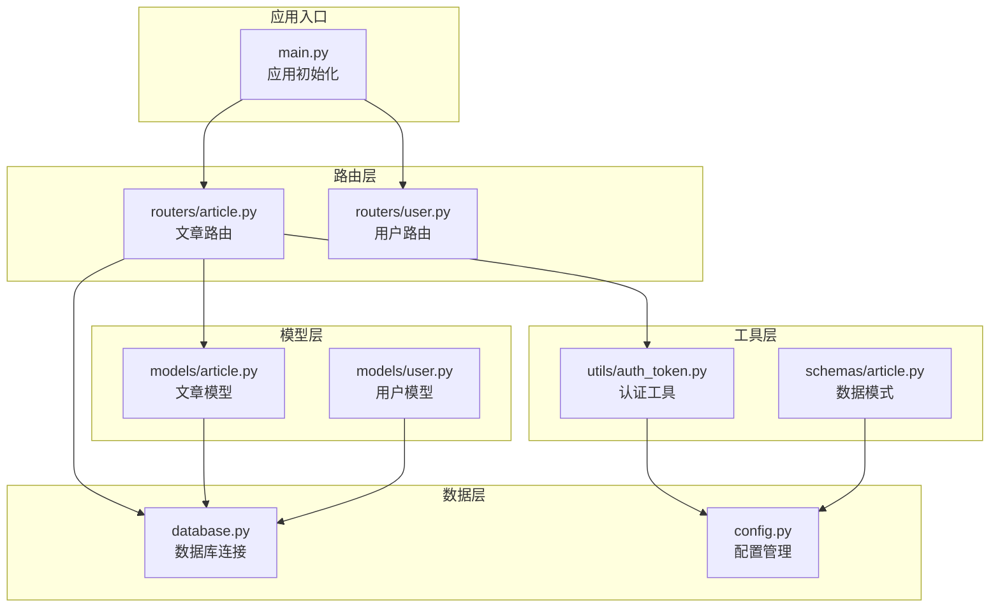
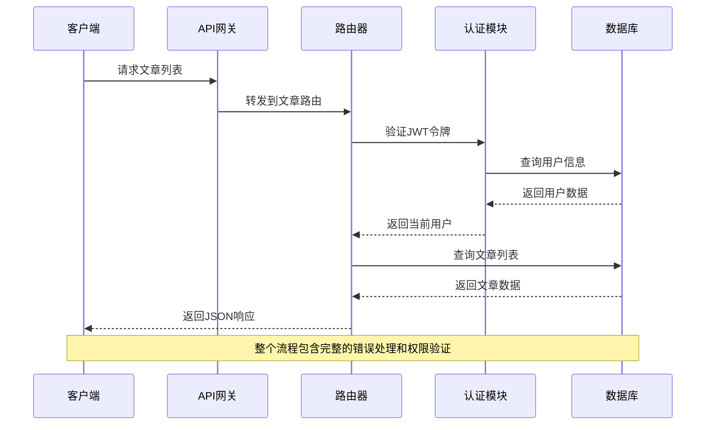
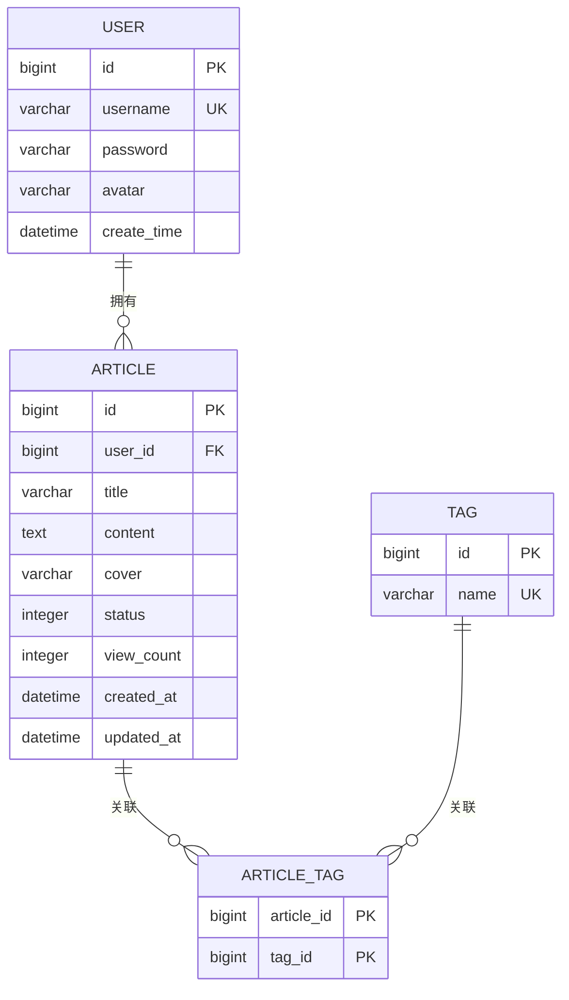
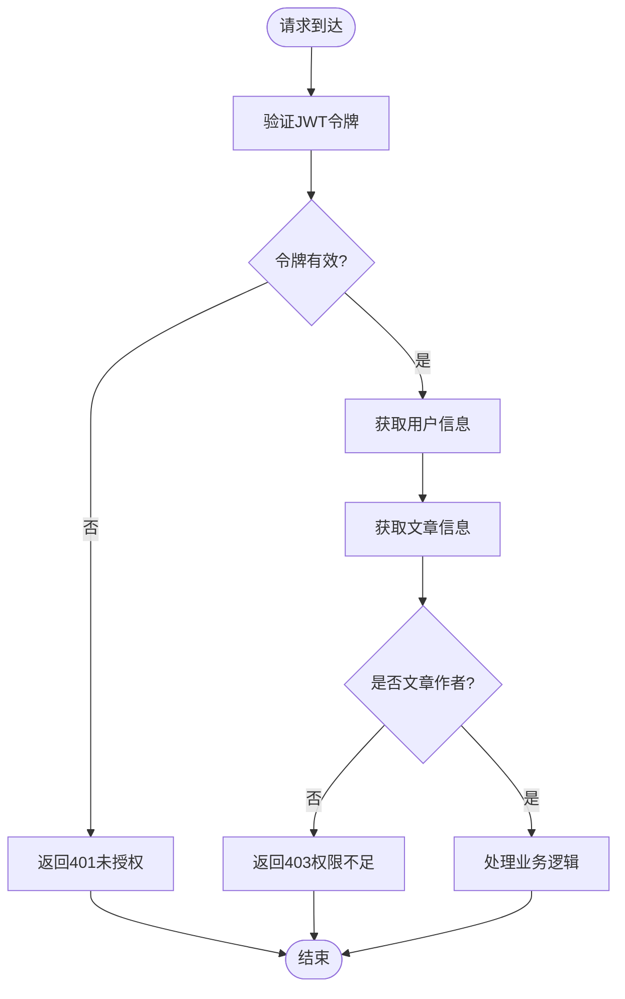

# 文章管理API

<cite>
**本文档引用的文件**
- [main.py](file://blog_backend/main.py)
- [routers/article.py](file://blog_backend/routers/article.py)
- [models/article.py](file://blog_backend/models/article.py)
- [schemas/article.py](file://blog_backend/schemas/article.py)
- [utils/auth_token.py](file://blog_backend/utils/auth_token.py)
- [models/user.py](file://blog_backend/models/user.py)
- [database.py](file://blog_backend/database.py)
- [config.py](file://blog_backend/config.py)
- [routers/user.py](file://blog_backend/routers/user.py)
- [api.js](file://blog_frontend/src/api.js)
</cite>

## 目录
1. [简介](#简介)
2. [项目结构](#项目结构)
3. [核心组件](#核心组件)
4. [架构概览](#架构概览)
5. [详细接口文档](#详细接口文档)
6. [依赖分析](#依赖分析)
7. [性能考虑](#性能考虑)
8. [故障排除指南](#故障排除指南)
9. [结论](#结论)

## 简介

本文档为博客系统的文章管理API提供了完整的技术文档。该系统基于FastAPI框架构建，采用RESTful API设计原则，实现了完整的文章CRUD操作、用户认证授权、文章分页查询等功能。系统支持文章的创建、读取、更新、删除操作，以及基于用户名的文章列表查询和文章详情展示。

## 项目结构

博客后端采用模块化架构设计，主要包含以下核心模块：



**图表来源**
- [main.py:1-13](file://blog_backend/main.py#L1-L13)
- [routers/article.py:1-85](file://blog_backend/routers/article.py#L1-L85)
- [models/article.py:1-41](file://blog_backend/models/article.py#L1-L41)

**章节来源**
- [main.py:1-13](file://blog_backend/main.py#L1-L13)
- [database.py:1-18](file://blog_backend/database.py#L1-L18)

## 核心组件

### 应用入口与路由配置

应用通过主文件进行初始化，使用FastAPI框架创建Web服务，并注册各个功能模块的路由。所有路由都以"/api"作为前缀，便于统一管理和版本控制。

### 数据模型设计

系统采用SQLAlchemy ORM进行数据持久化，核心数据模型包括：

- **Article模型**：文章实体，包含标题、内容、封面图、状态、浏览量等字段
- **User模型**：用户实体，包含用户名、密码、头像等信息
- **Tag模型**：标签实体，支持多对多关系映射
- **关联表(article_tag)**：文章与标签的中间表

### 认证授权机制

系统使用JWT(JSON Web Token)进行用户身份验证，通过OAuth2密码流实现安全的用户登录和令牌管理。

**章节来源**
- [models/article.py:15-41](file://blog_backend/models/article.py#L15-L41)
- [utils/auth_token.py:12-38](file://blog_backend/utils/auth_token.py#L12-L38)

## 架构概览



**图表来源**
- [routers/article.py:29-43](file://blog_backend/routers/article.py#L29-L43)
- [utils/auth_token.py:22-37](file://blog_backend/utils/auth_token.py#L22-L37)

## 详细接口文档

### 1. 文章列表查询接口

#### 接口定义
- **方法**: GET
- **路径**: `/api/users/{username}/articles`
- **权限**: 需要有效的JWT令牌

#### 请求参数
| 参数名 | 类型 | 必填 | 默认值 | 描述 |
|--------|------|------|--------|------|
| username | string | 是 | - | 用户名，用于查询该用户的所有文章 |
| page | integer | 否 | 1 | 页码，最小值为1 |
| size | integer | 否 | 10 | 每页大小，范围1-100 |

#### 响应格式
```json
{
  "articles": [
    {
      "id": 1,
      "user_id": 1,
      "title": "示例文章",
      "content": "文章内容",
      "cover": "https://example.com/image.jpg",
      "status": 1,
      "view_count": 0,
      "created_at": "2023-01-01T00:00:00",
      "updated_at": "2023-01-01T00:00:00"
    }
  ],
  "total": 5,
  "total_page": 1
}
```

#### 错误处理
- **404**: 用户不存在
- **401**: 未提供有效令牌或令牌无效
- **400**: 请求参数无效

**章节来源**
- [routers/article.py:29-43](file://blog_backend/routers/article.py#L29-L43)

### 2. 文章详情查询接口

#### 接口定义
- **方法**: GET
- **路径**: `/api/articles/{article_id}`
- **权限**: 公开访问

#### 请求参数
| 参数名 | 类型 | 必填 | 描述 |
|--------|------|------|------|
| article_id | integer | 是 | 文章唯一标识符 |

#### 响应格式
```json
{
  "article": {
    "id": 1,
    "user_id": 1,
    "title": "示例文章",
    "content": "文章内容",
    "cover": "https://example.com/image.jpg",
    "status": 1,
    "view_count": 0,
    "created_at": "2023-01-01T00:00:00",
    "updated_at": "2023-01-01T00:00:00"
  },
  "author": "john_doe"
}
```

#### 错误处理
- **404**: 文章不存在
- **400**: 请求参数无效

**章节来源**
- [routers/article.py:46-53](file://blog_backend/routers/article.py#L46-L53)

### 3. 文章创建接口

#### 接口定义
- **方法**: POST
- **路径**: `/api/articles`
- **权限**: 需要有效的JWT令牌

#### 请求体参数
| 参数名 | 类型 | 必填 | 默认值 | 描述 |
|--------|------|------|--------|------|
| title | string | 是 | - | 文章标题，最大长度200字符 |
| content | text | 是 | - | 文章内容 |
| cover | string | 否 | 默认头像URL | 文章封面图片URL |

#### 响应格式
```json
{
  "id": 1,
  "user_id": 1,
  "title": "示例文章",
  "content": "文章内容",
  "cover": "https://example.com/image.jpg",
  "status": 1,
  "view_count": 0,
  "created_at": "2023-01-01T00:00:00",
  "updated_at": "2023-01-01T00:00:00"
}
```

#### 错误处理
- **401**: 未提供有效令牌或令牌无效
- **400**: 请求参数无效

**章节来源**
- [routers/article.py:12-25](file://blog_backend/routers/article.py#L12-L25)
- [schemas/article.py:5-9](file://blog_backend/schemas/article.py#L5-L9)

### 4. 文章更新接口

#### 接口定义
- **方法**: PUT
- **路径**: `/api/articles/{article_id}`
- **权限**: 需要有效的JWT令牌

#### 请求参数
| 参数名 | 类型 | 必填 | 描述 |
|--------|------|------|------|
| article_id | integer | 是 | 文章唯一标识符 |

#### 请求体参数
| 参数名 | 类型 | 必填 | 默认值 | 描述 |
|--------|------|------|--------|------|
| title | string | 是 | - | 文章标题，最大长度200字符 |
| content | text | 是 | - | 文章内容 |
| cover | string | 否 | 默认头像URL | 文章封面图片URL |

#### 响应格式
```json
{
  "message": "文章编辑成功"
}
```

#### 错误处理
- **404**: 文章不存在
- **403**: 没有权限编辑该文章
- **401**: 未提供有效令牌或令牌无效

**章节来源**
- [routers/article.py:71-85](file://blog_backend/routers/article.py#L71-L85)

### 5. 文章删除接口

#### 接口定义
- **方法**: DELETE
- **路径**: `/api/articles/{article_id}`
- **权限**: 需要有效的JWT令牌

#### 请求参数
| 参数名 | 类型 | 必填 | 描述 |
|--------|------|------|------|
| article_id | integer | 是 | 文章唯一标识符 |

#### 响应格式
```json
{
  "message": "文章删除成功"
}
```

#### 错误处理
- **404**: 文章不存在
- **403**: 没有权限删除该文章
- **401**: 未提供有效令牌或令牌无效

**章节来源**
- [routers/article.py:56-68](file://blog_backend/routers/article.py#L56-L68)

### 6. 文章搜索接口

**注意**: 经过代码分析，在当前版本中并未实现专门的"文章搜索接口"。系统提供了基于用户名的用户搜索功能，但未提供针对文章内容的搜索接口。

**章节来源**
- [routers/user.py:54-92](file://blog_backend/routers/user.py#L54-L92)

## 依赖分析

### 数据模型关系



**图表来源**
- [models/article.py:16-41](file://blog_backend/models/article.py#L16-L41)
- [models/user.py:5-14](file://blog_backend/models/user.py#L5-L14)

### 权限控制流程



**图表来源**
- [utils/auth_token.py:22-37](file://blog_backend/utils/auth_token.py#L22-L37)
- [routers/article.py:57-79](file://blog_backend/routers/article.py#L57-L79)

**章节来源**
- [models/article.py:16-41](file://blog_backend/models/article.py#L16-L41)
- [utils/auth_token.py:12-38](file://blog_backend/utils/auth_token.py#L12-L38)

## 性能考虑

### 数据库优化建议

1. **索引策略**
   - 在`article.user_id`上建立索引以加速用户文章查询
   - 在`article.created_at`上建立索引以支持时间排序查询

2. **查询优化**
   - 使用`LIMIT`和`OFFSET`实现高效的分页查询
   - 避免N+1查询问题，合理使用`joinedload`或`selectinload`

3. **缓存策略**
   - 对热门文章内容考虑使用Redis缓存
   - 缓存用户基本信息减少数据库查询

### API性能优化

1. **批量操作**
   - 考虑实现批量文章查询接口
   - 支持条件过滤和排序参数

2. **响应压缩**
   - 启用Gzip压缩减少传输体积
   - 实现ETag缓存机制

## 故障排除指南

### 常见错误及解决方案

| 错误代码 | 错误原因 | 解决方案 |
|----------|----------|----------|
| 401 | 令牌无效或过期 | 重新登录获取新令牌 |
| 403 | 权限不足 | 确认当前用户是否为文章作者 |
| 404 | 资源不存在 | 检查URL中的ID是否正确 |
| 400 | 请求参数错误 | 验证请求体格式和必填字段 |

### 调试建议

1. **开发环境配置**
   - 设置适当的日志级别
   - 使用数据库连接池监控

2. **性能监控**
   - 监控慢查询和高延迟请求
   - 分析API响应时间分布

**章节来源**
- [routers/article.py:33-34](file://blog_backend/routers/article.py#L33-L34)
- [routers/article.py:50-51](file://blog_backend/routers/article.py#L50-L51)
- [routers/article.py:63-64](file://blog_backend/routers/article.py#L63-L64)

## 结论

本文档详细介绍了博客系统文章管理API的设计和实现。系统采用现代化的FastAPI框架，实现了完整的RESTful API规范，具备良好的安全性、可扩展性和维护性。

### 主要特性

1. **完整的CRUD操作**：支持文章的创建、读取、更新、删除
2. **用户认证授权**：基于JWT的令牌认证机制
3. **分页查询**：高效的文章列表分页功能
4. **权限控制**：严格的作者权限验证
5. **数据模型设计**：合理的数据库关系设计

### 扩展建议

1. **添加文章搜索功能**：实现基于标题和内容的全文搜索
2. **增强错误处理**：提供更详细的错误信息和日志记录
3. **API版本管理**：实现API版本控制以便向后兼容
4. **测试覆盖**：增加单元测试和集成测试覆盖率

该API设计遵循了现代Web服务的最佳实践，为后续的功能扩展奠定了坚实的基础。