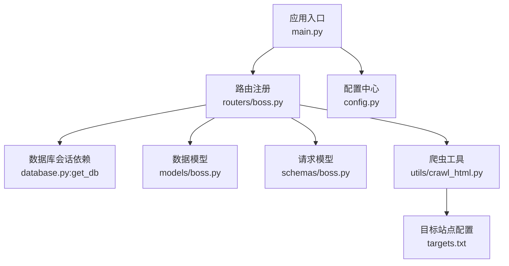
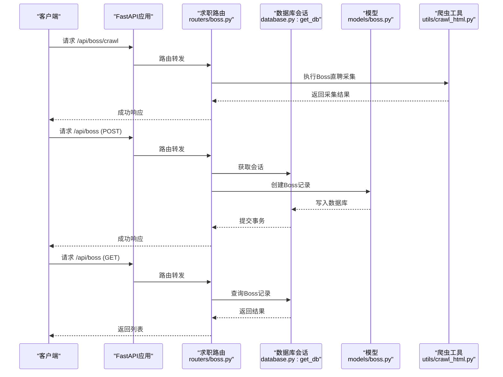
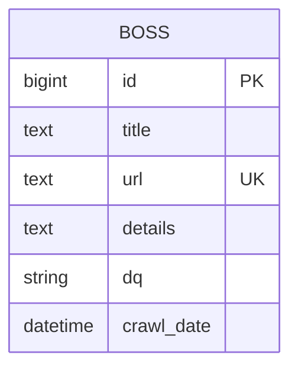
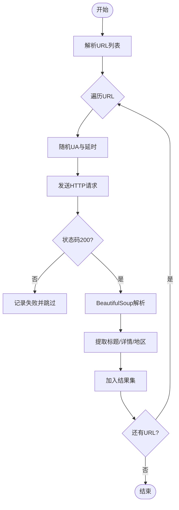
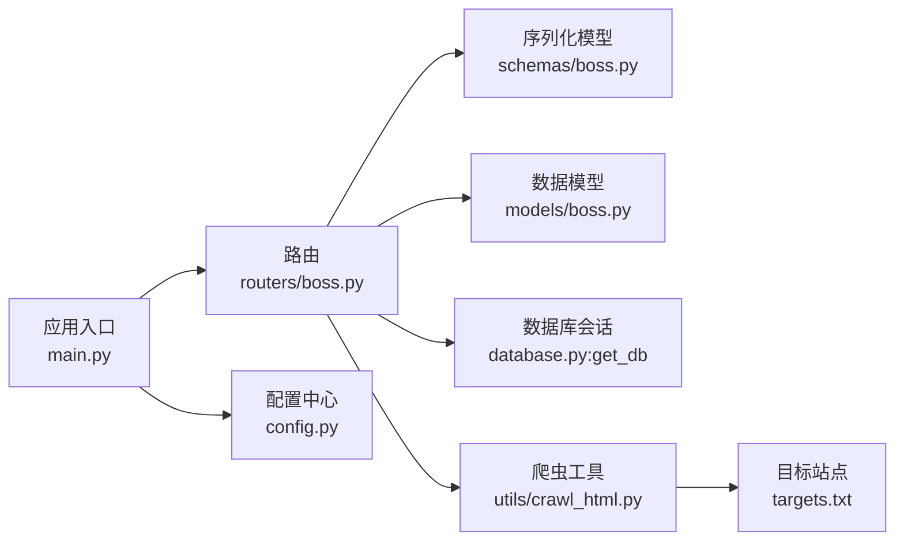

# 求职管理API

<cite>
**本文引用的文件**
- [main.py](file://blog_backend/main.py)
- [boss.py](file://blog_backend/routers/boss.py)
- [boss_model.py](file://blog_backend/models/boss.py)
- [boss_schema.py](file://blog_backend/schemas/boss.py)
- [crawl_html.py](file://blog_backend/utils/crawl_html.py)
- [database.py](file://blog_backend/database.py)
- [config.py](file://blog_backend/config.py)
- [targets.txt](file://blog_backend/targets.txt)
</cite>

## 目录
1. [简介](#简介)
2. [项目结构](#项目结构)
3. [核心组件](#核心组件)
4. [架构总览](#架构总览)
5. [详细接口文档](#详细接口文档)
6. [数据模型与状态管理](#数据模型与状态管理)
7. [爬虫实现机制](#爬虫实现机制)
8. [依赖关系分析](#依赖关系分析)
9. [性能考虑](#性能考虑)
10. [故障排除指南](#故障排除指南)
11. [结论](#结论)

## 简介
本项目提供一套完整的求职管理API，围绕Boss直聘数据采集与投递记录管理展开。系统支持：
- 投递记录的增删改查
- Boss直聘职位信息的批量采集
- 基于日期范围的投递记录查询
- 爬虫配置与执行流程

接口均通过统一前缀 `/api` 暴露，并以标签区分功能模块。

## 项目结构
后端采用FastAPI + SQLAlchemy架构，路由按功能模块划分，模型与序列化在独立目录中维护，工具类负责爬虫逻辑。

图表来源
- [main.py:1-13](file://blog_backend/main.py#L1-L13)
- [boss.py:1-134](file://blog_backend/routers/boss.py#L1-L134)
- [database.py:1-18](file://blog_backend/database.py#L1-L18)
- [boss_model.py:1-15](file://blog_backend/models/boss.py#L1-L15)
- [boss_schema.py:1-14](file://blog_backend/schemas/boss.py#L1-L14)
- [crawl_html.py:1-72](file://blog_backend/utils/crawl_html.py#L1-L72)
- [config.py:1-32](file://blog_backend/config.py#L1-L32)
- [targets.txt:1-5](file://blog_backend/targets.txt#L1-L5)

章节来源
- [main.py:1-13](file://blog_backend/main.py#L1-L13)
- [boss.py:1-134](file://blog_backend/routers/boss.py#L1-L134)

## 核心组件
- 应用入口与路由注册：在应用启动时注册求职模块路由，统一前缀为 `/api`。
- 数据库层：通过SQLAlchemy连接MySQL，提供会话依赖注入。
- 模型层：定义Boss表结构，包含职位标题、链接、详情、地区、采集时间等字段。
- 序列化层：定义BossCreate请求模型，约束字段长度与可选性。
- 爬虫工具：基于requests + BeautifulSoup实现Boss直聘页面采集，支持随机UA与延时模拟人类行为。

章节来源
- [main.py:1-13](file://blog_backend/main.py#L1-L13)
- [database.py:1-18](file://blog_backend/database.py#L1-L18)
- [boss_model.py:1-15](file://blog_backend/models/boss.py#L1-L15)
- [boss_schema.py:1-14](file://blog_backend/schemas/boss.py#L1-L14)
- [crawl_html.py:1-72](file://blog_backend/utils/crawl_html.py#L1-L72)

## 架构总览
求职管理API的调用链路如下：

图表来源
- [boss.py:16-84](file://blog_backend/routers/boss.py#L16-L84)
- [boss.py:86-127](file://blog_backend/routers/boss.py#L86-L127)
- [database.py:12-18](file://blog_backend/database.py#L12-L18)
- [boss_model.py:5-15](file://blog_backend/models/boss.py#L5-L15)
- [crawl_html.py:18-72](file://blog_backend/utils/crawl_html.py#L18-L72)

## 详细接口文档

### 接口概览
- 基础路径：`/api`
- 认证：未启用（如需鉴权可在路由层增加依赖）
- 错误码：遵循HTTP标准；部分场景返回409冲突或500服务器错误

章节来源
- [main.py:6-10](file://blog_backend/main.py#L6-L10)

### GET /boss
- 功能：按日期范围查询投递记录
- 请求参数
  - query_date: date（必填）- 查询基准日期
  - range: str（可选，默认 weekly）- 查询范围，支持 weekly/monthly
- 响应字段
  - bosses: array - 投递记录数组
    - id: bigint - 记录ID
    - title: string - 职位标题
    - url: string - 职位链接
    - details: string - 职位详情
    - dq: string - 地区
    - crawl_date: datetime - 采集时间
- 业务逻辑
  - 根据 range 计算起止时间，过滤 crawl_date 在范围内的记录，按ID倒序返回
- 示例
  - 请求：GET /api/boss?query_date=2025-01-28&range=weekly
  - 响应：包含 bosses 数组的对象
- 错误处理
  - 参数无效：由框架校验并返回422
  - 数据库异常：返回500

章节来源
- [boss.py:86-127](file://blog_backend/routers/boss.py#L86-L127)

### GET /boss/{boss_id}
- 功能：获取单条投递记录详情
- 请求参数
  - boss_id: path int - 记录ID
- 响应字段
  - 同 GET /boss 的记录字段
- 业务逻辑
  - 通过ID查询Boss记录并返回
- 示例
  - 请求：GET /api/boss/123
  - 响应：单条记录对象
- 错误处理
  - 记录不存在：返回404
  - 数据库异常：返回500

章节来源
- [boss.py:86-127](file://blog_backend/routers/boss.py#L86-L127)

### POST /boss
- 功能：创建投递记录（支持单条或批量）
- 请求体
  - 单条：BossCreate 对象
  - 批量：BossCreate 数组
  - 字段说明：title、url、details、dq（可选）、crawl_date（可选）
- 响应字段
  - success: boolean - 是否成功
  - message: string - 操作结果描述
  - count: int（批量时返回）- 创建数量
  - data: Boss 或 Boss数组 - 返回创建后的记录
- 业务逻辑
  - 将请求体转换为Boss实体，批量写入数据库并刷新生成的ID与默认时间
  - 若存在重复链接（url唯一约束），抛出409冲突
- 示例
  - 请求：POST /api/boss（单条）
  - 响应：包含 data 的对象
  - 请求：POST /api/boss（批量）
  - 响应：包含 count 和 data 的对象
- 错误处理
  - 重复链接：409
  - 其他异常：500

章节来源
- [boss.py:33-84](file://blog_backend/routers/boss.py#L33-L84)
- [boss_schema.py:7-14](file://blog_backend/schemas/boss.py#L7-L14)

### PUT /boss/{boss_id}
- 功能：更新单条投递记录
- 请求参数
  - boss_id: path int - 记录ID
- 请求体
  - BossCreate（部分字段可更新）
- 响应字段
  - success: boolean - 是否成功
  - message: string - 操作结果描述
  - data: Boss - 返回更新后的记录
- 业务逻辑
  - 通过ID定位记录并更新非空字段
- 示例
  - 请求：PUT /api/boss/123
  - 响应：包含 data 的对象
- 错误处理
  - 记录不存在：404
  - 重复链接：409
  - 其他异常：500

章节来源
- [boss.py:33-84](file://blog_backend/routers/boss.py#L33-L84)

### DELETE /boss/{boss_id}
- 功能：删除单条投递记录
- 请求参数
  - boss_id: path int - 记录ID
- 响应字段
  - success: boolean - 是否成功
  - message: string - 操作结果描述
- 业务逻辑
  - 通过ID删除记录
- 示例
  - 请求：DELETE /api/boss/123
  - 响应：包含 success 和 message 的对象
- 错误处理
  - 记录不存在：404
  - 其他异常：500

章节来源
- [boss.py:33-84](file://blog_backend/routers/boss.py#L33-L84)

### POST /boss/crawl
- 功能：采集Boss直聘职位信息
- 请求体
  - urls: array[string] - 目标URL列表
- 响应字段
  - success: boolean - 是否成功
  - message: string - 结果描述
  - data: array - 采集结果数组
    - title: string - 职位标题
    - url: string - 职位链接
    - details: string - 职位详情
    - dq: string - 地区
    - crawl_time: string - 采集时间
- 业务逻辑
  - 使用CrawlHtml对每个URL进行采集，随机UA与延时模拟人类行为
  - 解析页面提取标题、详情、地区等字段
- 示例
  - 请求：POST /api/boss/crawl
  - 响应：包含 data 的对象
- 错误处理
  - 爬取异常：500

章节来源
- [boss.py:16-31](file://blog_backend/routers/boss.py#L16-L31)
- [crawl_html.py:18-72](file://blog_backend/utils/crawl_html.py#L18-L72)

### GET /boss/stats
- 功能：求职状态统计（按周/月维度）
- 请求参数
  - query_date: date（必填）- 统计基准日期
  - range: str（可选，默认 weekly）- 统计范围，支持 weekly/monthly
- 响应字段
  - total: int - 总数
  - weekly: int - 本周统计
  - monthly: int - 本月统计
  - daily: array - 每日统计数组
    - date: string - 日期
    - count: int - 当日数量
- 业务逻辑
  - 根据 range 计算起止时间，统计各维度的数量与每日分布
- 示例
  - 请求：GET /api/boss/stats?query_date=2025-01-28&range=weekly
  - 响应：包含统计字段的对象
- 错误处理
  - 参数无效：422
  - 数据库异常：500

章节来源
- [boss.py:86-127](file://blog_backend/routers/boss.py#L86-L127)

## 数据模型与状态管理

### 数据模型

图表来源
- [boss_model.py:5-15](file://blog_backend/models/boss.py#L5-L15)

### 状态管理机制
- 采集时间：crawl_date 默认为当前时间，用于排序与统计
- 唯一约束：url 唯一，防止重复投递
- 状态字段：dq 表示地区，便于筛选与统计

章节来源
- [boss_model.py:8-13](file://blog_backend/models/boss.py#L8-L13)

## 爬虫实现机制

### 采集流程

图表来源
- [crawl_html.py:18-72](file://blog_backend/utils/crawl_html.py#L18-L72)

### 爬虫配置
- 目标站点：通过 targets.txt 维护
- 随机UA池：提升反爬规避能力
- 延时策略：随机等待2-5秒，模拟人类行为
- 输出：采集结果包含标题、链接、详情、地区、采集时间

章节来源
- [crawl_html.py:8-17](file://blog_backend/utils/crawl_html.py#L8-L17)
- [targets.txt:1-5](file://blog_backend/targets.txt#L1-L5)

## 依赖关系分析

图表来源
- [boss.py:1-134](file://blog_backend/routers/boss.py#L1-L134)
- [boss_schema.py:1-14](file://blog_backend/schemas/boss.py#L1-L14)
- [boss_model.py:1-15](file://blog_backend/models/boss.py#L1-L15)
- [database.py:12-18](file://blog_backend/database.py#L12-L18)
- [crawl_html.py:1-72](file://blog_backend/utils/crawl_html.py#L1-L72)
- [main.py:1-13](file://blog_backend/main.py#L1-L13)
- [config.py:19-31](file://blog_backend/config.py#L19-L31)

## 性能考虑
- 批量插入：POST /boss 支持批量创建，减少数据库往返
- 唯一索引：url 唯一约束避免重复数据，降低查询成本
- 分页与排序：按ID倒序返回，适合前端分页展示
- 爬虫节流：随机UA与延时策略降低被封风险，提高成功率

## 故障排除指南
- 409 冲突：重复的url导致插入失败，检查请求体或数据库现有数据
- 500 服务器错误：爬虫异常或数据库事务回滚，查看服务端日志
- 422 参数错误：query_date 或 range 格式不正确，修正请求参数
- 爬虫超时：等待选择器超时会降级获取页面内容，必要时调整等待策略

章节来源
- [boss.py:73-84](file://blog_backend/routers/boss.py#L73-L84)
- [crawl_html.py:295-313](file://blog_backend/utils/crawl_html.py#L295-L313)

## 结论
本求职管理API提供了从Boss直聘采集到投递记录管理的完整能力，具备良好的扩展性与稳定性。建议后续增强：
- 增加鉴权中间件
- 完善分页与过滤参数
- 引入异步任务队列处理大规模爬取
- 增加数据校验与审计日志