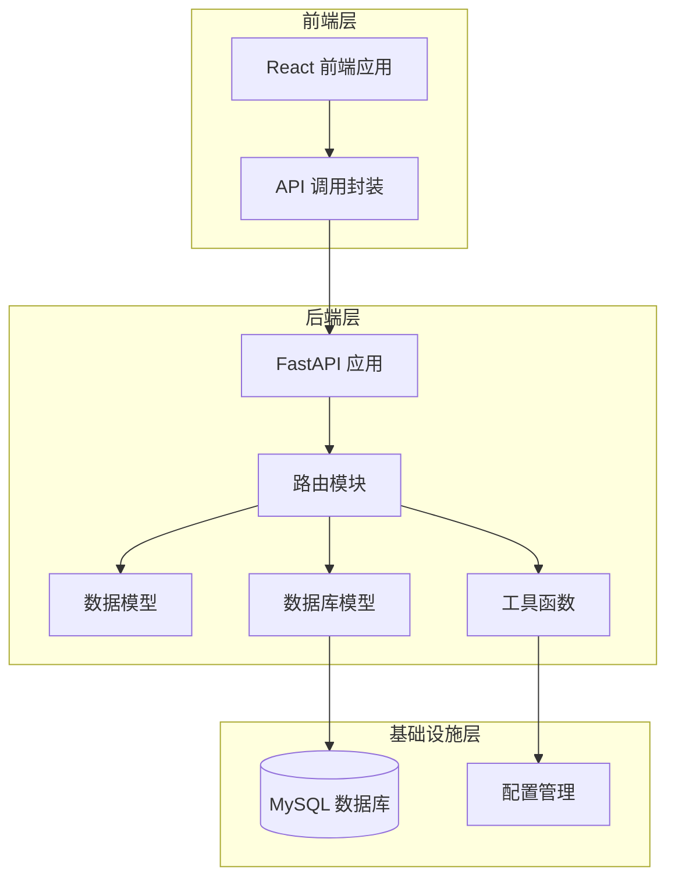
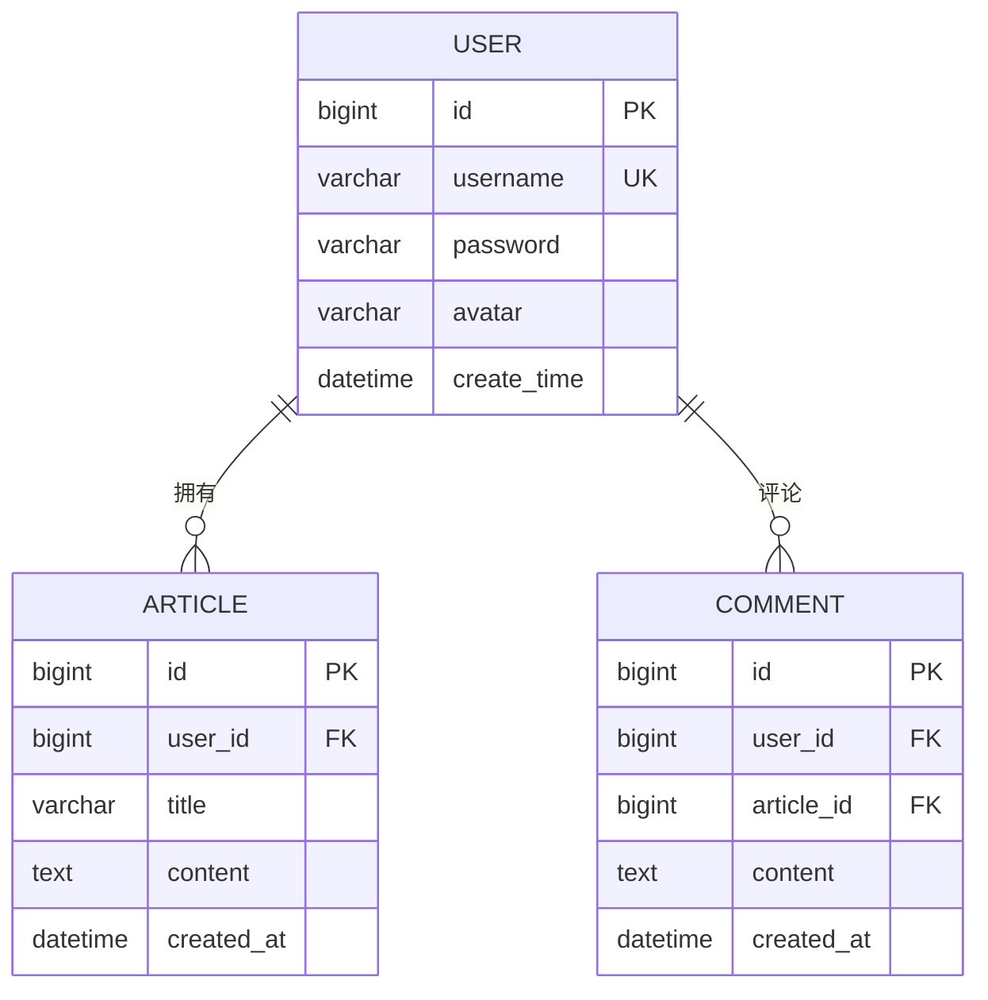
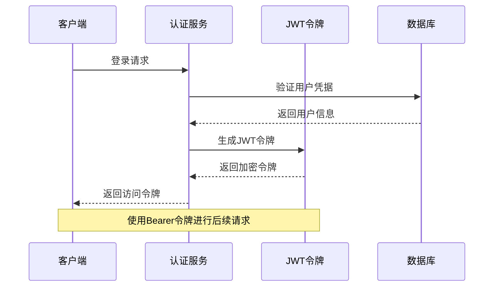
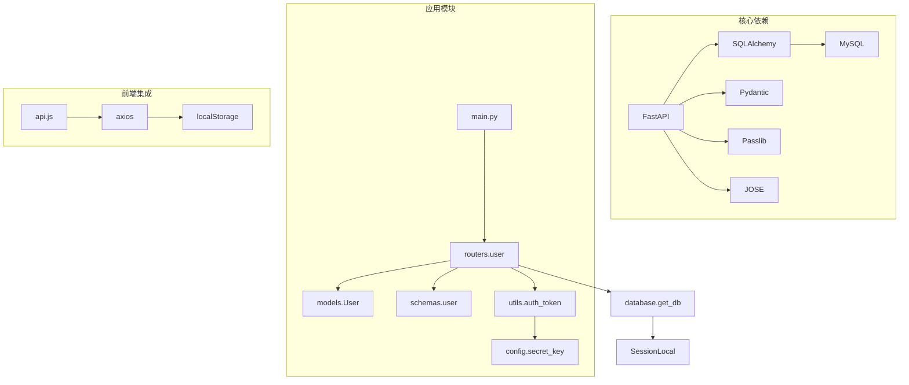

# 用户管理API

<cite>
**本文档引用的文件**
- [main.py](file://blog_backend/main.py)
- [user.py](file://blog_backend/routers/user.py)
- [user_model.py](file://blog_backend/models/user.py)
- [user_schema.py](file://blog_backend/schemas/user.py)
- [auth_token.py](file://blog_backend/utils/auth_token.py)
- [config.py](file://blog_backend/config.py)
- [database.py](file://blog_backend/database.py)
- [api.js](file://blog_frontend/src/api.js)
- [Register.jsx](file://blog_frontend/src/components/Register.jsx)
- [Login.jsx](file://blog_frontend/src/components/Login.jsx)
</cite>

## 目录
1. [简介](#简介)
2. [项目结构](#项目结构)
3. [核心组件](#核心组件)
4. [架构概览](#架构概览)
5. [详细接口文档](#详细接口文档)
6. [依赖关系分析](#依赖关系分析)
7. [性能考虑](#性能考虑)
8. [故障排除指南](#故障排除指南)
9. [结论](#结论)

## 简介

本项目是一个基于FastAPI构建的博客系统后端，提供了完整的用户管理API功能。系统采用现代化的Web开发技术栈，包括Python 3.10、FastAPI框架、SQLAlchemy ORM、MySQL数据库等。用户管理模块包含了用户注册、登录、搜索和详情查询等核心功能，支持JWT令牌认证机制和基本的安全防护措施。

## 项目结构

项目采用典型的分层架构设计，主要分为以下几个层次：



**图表来源**
- [main.py:1-13](file://blog_backend/main.py#L1-L13)
- [user.py:1-101](file://blog_backend/routers/user.py#L1-L101)
- [database.py:1-18](file://blog_backend/database.py#L1-L18)

**章节来源**
- [main.py:1-13](file://blog_backend/main.py#L1-L13)
- [database.py:1-18](file://blog_backend/database.py#L1-L18)

## 核心组件

### 数据模型设计

系统采用SQLAlchemy ORM进行数据库操作，用户模型定义了完整的字段结构：



**图表来源**
- [user_model.py:5-14](file://blog_backend/models/user.py#L5-L14)

### 认证机制

系统实现了基于JWT的认证机制，支持用户身份验证和授权：



**图表来源**
- [auth_token.py:12-17](file://blog_backend/utils/auth_token.py#L12-L17)
- [user.py:37-51](file://blog_backend/routers/user.py#L37-L51)

**章节来源**
- [user_model.py:5-14](file://blog_backend/models/user.py#L5-L14)
- [auth_token.py:12-38](file://blog_backend/utils/auth_token.py#L12-L38)

## 架构概览

系统采用RESTful API设计原则，所有用户相关操作都通过统一的路由前缀 `/api` 进行访问：

```mermaid
graph LR
subgraph "API 路由"
A[/api/users - 用户注册]
B[/api/auth/login - 用户登录]
C[/api/users - 用户搜索]
D[/api/users/{user_id} - 用户详情]
end
subgraph "数据流"
E[请求验证]
F[业务逻辑处理]
G[数据库操作]
H[响应返回]
end
A --> E
B --> E
C --> E
D --> E
E --> F
F --> G
G --> H
```

**图表来源**
- [main.py:6-10](file://blog_backend/main.py#L6-L10)
- [user.py:15-101](file://blog_backend/routers/user.py#L15-L101)

## 详细接口文档

### 用户注册接口

#### 接口概述
- **HTTP方法**: POST
- **URL路径**: `/api/users`
- **功能描述**: 创建新用户账户
- **认证要求**: 无需认证

#### 请求参数

| 参数名 | 类型 | 必填 | 描述 | 默认值 |
|--------|------|------|------|--------|
| username | string | 是 | 用户名 | - |
| password | string | 是 | 密码 | - |
| avatar | string | 否 | 头像URL | 默认头像 |

#### 响应格式

成功响应：
```json
{
  "id": 1,
  "username": "string",
  "avatar": "string",
  "create_time": "2023-01-01T00:00:00Z"
}
```

错误响应：
```json
{
  "detail": "用户名已存在"
}
```

#### 错误码

| 状态码 | 错误描述 | 触发条件 |
|--------|----------|----------|
| 400 | 用户名已存在 | 注册时用户名重复 |
| 500 | 服务器内部错误 | 数据库操作失败 |

#### 请求示例

```bash
curl -X POST "/api/users" \
  -H "Content-Type: application/json" \
  -d '{
    "username": "john_doe",
    "password": "secure_password",
    "avatar": "https://example.com/avatar.jpg"
  }'
```

#### 响应示例

成功响应：
```json
{
  "id": 1,
  "username": "john_doe",
  "avatar": "https://example.com/avatar.jpg",
  "create_time": "2023-01-01T10:30:00Z"
}
```

**章节来源**
- [user.py:15-34](file://blog_backend/routers/user.py#L15-L34)
- [user_schema.py:6-9](file://blog_backend/schemas/user.py#L6-L9)

### 用户登录接口

#### 接口概述
- **HTTP方法**: POST
- **URL路径**: `/api/auth/login`
- **功能描述**: 用户身份验证并获取访问令牌
- **认证要求**: 无需认证

#### 请求参数

| 参数名 | 类型 | 必填 | 描述 |
|--------|------|------|------|
| username | string | 是 | 用户名 |
| password | string | 是 | 密码 |

#### 响应格式

成功响应：
```json
{
  "access_token": "eyJhbGciOiJIUzI1NiIsInR5cCI6IkpXVCJ9...",
  "token_type": "bearer"
}
```

错误响应：
```json
{
  "detail": "用户名不存在"
}
```

#### 错误码

| 状态码 | 错误描述 | 触发条件 |
|--------|----------|----------|
| 400 | 用户名不存在 | 用户名不存在 |
| 400 | 密码错误 | 密码验证失败 |
| 500 | 服务器内部错误 | 数据库查询失败 |

#### 请求示例

```bash
curl -X POST "/api/auth/login" \
  -H "Content-Type: application/json" \
  -d '{
    "username": "john_doe",
    "password": "secure_password"
  }'
```

#### 响应示例

成功响应：
```json
{
  "access_token": "eyJhbGciOiJIUzI1NiIsInR5cCI6IkpXVCJ9...",
  "token_type": "bearer"
}
```

**章节来源**
- [user.py:36-51](file://blog_backend/routers/user.py#L36-L51)

### 用户搜索接口

#### 接口概述
- **HTTP方法**: GET
- **URL路径**: `/api/users`
- **功能描述**: 根据用户名模糊搜索用户
- **认证要求**: 无需认证

#### 查询参数

| 参数名 | 类型 | 必填 | 描述 | 默认值 | 限制 |
|--------|------|------|------|--------|------|
| searchname | string | 是 | 搜索关键词 | - | 不能为空 |
| page | integer | 否 | 页码 | 1 | >= 1 |
| size | integer | 否 | 每页数量 | 10 | 1-100 |

#### 响应格式

成功响应：
```json
{
  "users": [
    {
      "id": 1,
      "username": "john_doe",
      "create_time": "2023-01-01T00:00:00Z"
    }
  ],
  "page": 1,
  "size": 10,
  "has_more": false
}
```

错误响应：
```json
{
  "detail": "searchname不能为空"
}
```

#### 错误码

| 状态码 | 错误描述 | 触发条件 |
|--------|----------|----------|
| 400 | searchname不能为空 | 搜索关键词为空 |
| 500 | 服务器内部错误 | 数据库查询失败 |

#### 请求示例

```bash
curl -X GET "/api/users?searchname=john&page=1&size=10"
```

#### 响应示例

成功响应：
```json
{
  "users": [
    {
      "id": 1,
      "username": "john_doe",
      "create_time": "2023-01-01T10:30:00Z"
    }
  ],
  "page": 1,
  "size": 10,
  "has_more": false
}
```

**章节来源**
- [user.py:54-92](file://blog_backend/routers/user.py#L54-L92)

### 用户详情查询接口

#### 接口概述
- **HTTP方法**: GET
- **URL路径**: `/api/users/{user_id}`
- **功能描述**: 获取指定用户的详细信息
- **认证要求**: 无需认证

#### 路径参数

| 参数名 | 类型 | 必填 | 描述 |
|--------|------|------|------|
| user_id | integer | 是 | 用户ID |

#### 响应格式

成功响应：
```json
{
  "username": "john_doe",
  "avatar": "https://example.com/avatar.jpg",
  "id": 1,
  "create_time": "2023-01-01T00:00:00Z"
}
```

错误响应：
```json
{
  "detail": "用户不存在"
}
```

#### 错误码

| 状态码 | 错误描述 | 触发条件 |
|--------|----------|----------|
| 404 | 用户不存在 | 用户ID不存在 |
| 500 | 服务器内部错误 | 数据库查询失败 |

#### 请求示例

```bash
curl -X GET "/api/users/1"
```

#### 响应示例

成功响应：
```json
{
  "username": "john_doe",
  "avatar": "https://example.com/avatar.jpg",
  "id": 1,
  "create_time": "2023-01-01T10:30:00Z"
}
```

**章节来源**
- [user.py:94-101](file://blog_backend/routers/user.py#L94-L101)

## 依赖关系分析

系统各组件之间的依赖关系如下：



**图表来源**
- [main.py:1-13](file://blog_backend/main.py#L1-L13)
- [user.py:3-11](file://blog_backend/routers/user.py#L3-L11)
- [auth_token.py:1-8](file://blog_backend/utils/auth_token.py#L1-L8)

**章节来源**
- [main.py:1-13](file://blog_backend/main.py#L1-L13)
- [user.py:1-101](file://blog_backend/routers/user.py#L1-L101)

## 性能考虑

### 数据库优化

1. **索引策略**: 用户名字段设置了唯一索引，确保查询效率
2. **分页查询**: 搜索接口支持分页，避免大量数据一次性传输
3. **查询优化**: 使用LIMIT和OFFSET实现高效的分页机制

### 缓存策略

当前实现未包含缓存层，建议在生产环境中考虑：
- Redis缓存热门用户数据
- JWT令牌缓存减少数据库查询
- API响应缓存静态内容

### 安全加固

1. **密码存储**: 当前实现直接存储明文密码，建议使用哈希算法
2. **输入验证**: 所有接口都进行了基础的数据验证
3. **错误处理**: 统一的异常处理机制，避免敏感信息泄露

## 故障排除指南

### 常见问题及解决方案

#### 用户名重复错误
**问题**: 注册时提示用户名已存在
**原因**: 用户名已被其他用户使用
**解决**: 更换唯一的用户名重新注册

#### 登录失败
**问题**: 登录时提示用户名不存在或密码错误
**原因**: 用户名拼写错误或密码不匹配
**解决**: 检查用户名和密码的正确性

#### 搜索结果为空
**问题**: 用户搜索没有返回任何结果
**原因**: 搜索关键词不匹配或用户不存在
**解决**: 调整搜索关键词或确认用户存在

#### 数据库连接问题
**问题**: API调用时报数据库连接错误
**原因**: 数据库配置不正确或服务未启动
**解决**: 检查数据库连接字符串和服务器状态

### 调试技巧

1. **启用调试模式**: 在开发环境中启用FastAPI的调试模式
2. **日志记录**: 添加详细的日志记录便于问题追踪
3. **单元测试**: 编写完整的单元测试覆盖关键业务逻辑

**章节来源**
- [user.py:18-21](file://blog_backend/routers/user.py#L18-L21)
- [user.py:40-46](file://blog_backend/routers/user.py#L40-L46)
- [user.py:62-64](file://blog_backend/routers/user.py#L62-L64)

## 结论

本用户管理API提供了完整的基础用户功能，包括用户注册、登录、搜索和详情查询。系统采用现代化的技术栈，具有良好的扩展性和维护性。主要优势包括：

1. **清晰的架构设计**: 分层架构便于理解和维护
2. **完整的错误处理**: 统一的异常处理机制
3. **RESTful设计**: 符合REST规范的API设计
4. **安全考虑**: 基础的认证和授权机制

**改进建议**:
1. 实现密码哈希存储
2. 添加用户权限控制
3. 增加API版本管理
4. 实现更完善的错误日志
5. 添加缓存层提升性能