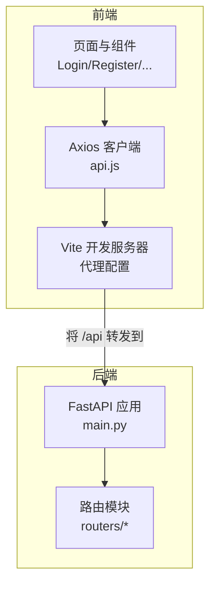
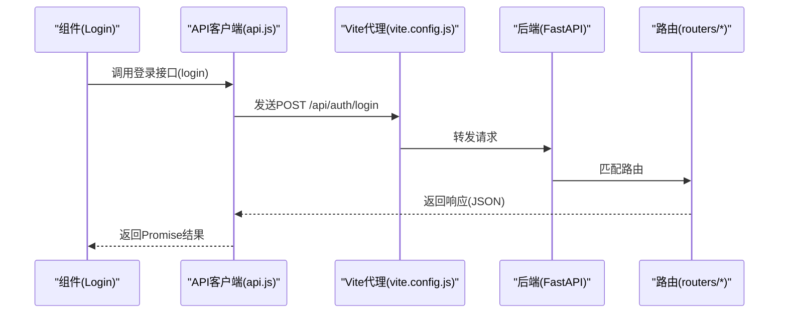
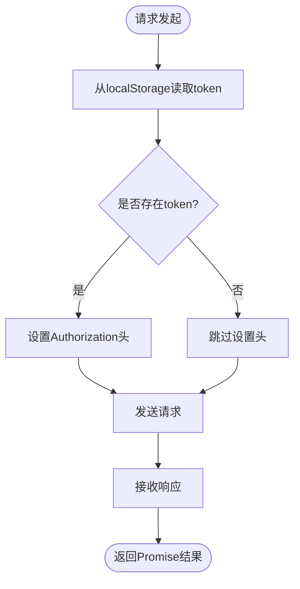
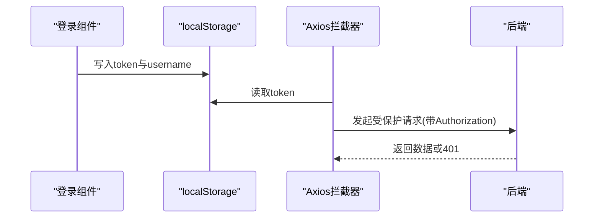
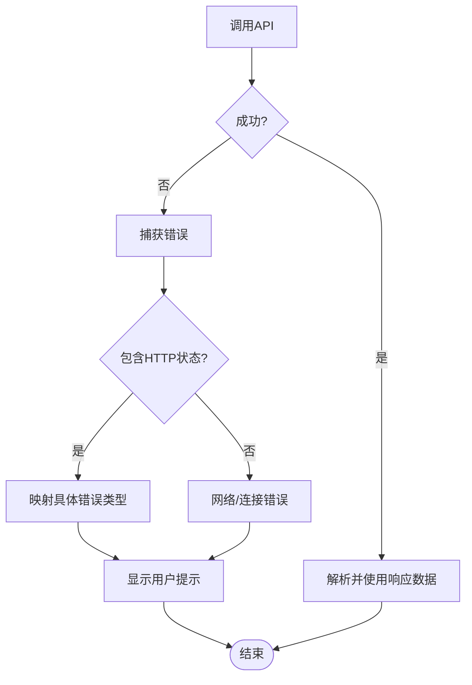
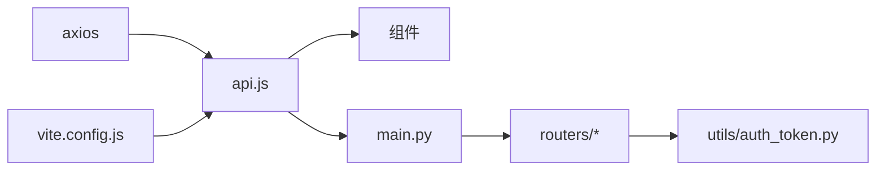

# API客户端设计

<cite>
**本文引用的文件**
- [blog_frontend/src/api.js](file://blog_frontend/src/api.js)
- [blog_frontend/src/components/Login.jsx](file://blog_frontend/src/components/Login.jsx)
- [blog_frontend/src/components/Register.jsx](file://blog_frontend/src/components/Register.jsx)
- [blog_frontend/src/components/UserHome.jsx](file://blog_frontend/src/components/UserHome.jsx)
- [blog_frontend/src/components/ArticleList.jsx](file://blog_frontend/src/components/ArticleList.jsx)
- [blog_frontend/src/components/Publish.jsx](file://blog_frontend/src/components/Publish.jsx)
- [blog_frontend/src/components/ArticleDetail.jsx](file://blog_frontend/src/components/ArticleDetail.jsx)
- [blog_frontend/src/App.jsx](file://blog_frontend/src/App.jsx)
- [blog_frontend/vite.config.js](file://blog_frontend/vite.config.js)
- [blog_frontend/package.json](file://blog_frontend/package.json)
- [blog_backend/main.py](file://blog_backend/main.py)
- [blog_backend/routers/article.py](file://blog_backend/routers/article.py)
- [blog_backend/utils/auth_token.py](file://blog_backend/utils/auth_token.py)
</cite>

## 目录
1. [简介](#简介)
2. [项目结构](#项目结构)
3. [核心组件](#核心组件)
4. [架构总览](#架构总览)
5. [详细组件分析](#详细组件分析)
6. [依赖关系分析](#依赖关系分析)
7. [性能考虑](#性能考虑)
8. [故障排查指南](#故障排查指南)
9. [结论](#结论)
10. [附录](#附录)

## 简介
本文件系统性梳理前端API客户端的设计与实现，围绕以下主题展开：Axios客户端封装、基础URL与代理配置、请求/响应拦截器、认证令牌的存储与携带、错误处理策略、请求配置选项（超时、重试、并发）、数据序列化与反序列化、最佳实践、性能优化与调试技巧，以及扩展与自定义配置建议。文中所有分析均基于仓库中的实际代码文件。

## 项目结构
前端采用Vite + React + Axios构建，API客户端集中于单文件模块，通过命名导出函数封装各类REST接口；后端为FastAPI应用，统一前缀为/api，并在开发环境通过Vite代理将/api转发至后端服务。

图表来源
- [blog_frontend/vite.config.js:1-17](file://blog_frontend/vite.config.js#L1-L17)
- [blog_frontend/src/api.js:1-39](file://blog_frontend/src/api.js#L1-L39)
- [blog_backend/main.py:1-13](file://blog_backend/main.py#L1-L13)

章节来源
- [blog_frontend/vite.config.js:1-17](file://blog_frontend/vite.config.js#L1-L17)
- [blog_frontend/src/api.js:1-39](file://blog_frontend/src/api.js#L1-L39)
- [blog_backend/main.py:1-13](file://blog_backend/main.py#L1-L13)

## 核心组件
- Axios客户端实例：创建基础URL为/api的实例，并注入请求拦截器自动附加Authorization头。
- 命名导出的API函数：对各业务接口进行薄封装，便于组件直接调用。
- 组件层：登录/注册写入token，导航栏读取token控制UI状态，各页面通过API函数拉取数据或提交请求。
- 开发代理：Vite将/api前缀请求转发到本地后端服务，便于前后端联调。

章节来源
- [blog_frontend/src/api.js:1-39](file://blog_frontend/src/api.js#L1-L39)
- [blog_frontend/src/components/Login.jsx:1-47](file://blog_frontend/src/components/Login.jsx#L1-L47)
- [blog_frontend/src/components/Register.jsx:1-52](file://blog_frontend/src/components/Register.jsx#L1-L52)
- [blog_frontend/src/App.jsx:15-53](file://blog_frontend/src/App.jsx#L15-L53)
- [blog_frontend/vite.config.js:7-15](file://blog_frontend/vite.config.js#L7-L15)

## 架构总览
下图展示从前端组件到Axios客户端、开发代理再到后端路由的整体调用链路与职责边界。

图表来源
- [blog_frontend/src/components/Login.jsx:11-21](file://blog_frontend/src/components/Login.jsx#L11-L21)
- [blog_frontend/src/api.js:16](file://blog_frontend/src/api.js#L16)
- [blog_frontend/vite.config.js:9-14](file://blog_frontend/vite.config.js#L9-L14)
- [blog_backend/main.py:6-10](file://blog_backend/main.py#L6-L10)

## 详细组件分析

### Axios客户端封装与拦截器
- 基础URL与实例化：客户端以/api作为基础路径，确保所有相对路径均相对于后端统一前缀。
- 请求拦截器：在每次请求前从localStorage读取token，若存在则在请求头中添加Authorization: Bearer <token>。
- 响应拦截器：当前未实现，可在后续扩展中统一处理HTTP状态码、错误提示与全局登出逻辑。
- 并发与超时：当前未设置超时与并发限制，可在axios.create配置中增加timeout与adapter等参数以增强鲁棒性。

图表来源
- [blog_frontend/src/api.js:3-14](file://blog_frontend/src/api.js#L3-L14)

章节来源
- [blog_frontend/src/api.js:1-39](file://blog_frontend/src/api.js#L1-L39)

### 认证令牌处理机制
- 存储位置：登录成功后将access_token存入localStorage，并同时保存username用于界面显示。
- 自动添加Authorization头：请求拦截器在每个请求上附加Bearer token，避免重复手动设置。
- 过期处理：当前未实现token过期检测与刷新逻辑。建议在响应拦截器中识别401状态，触发token刷新或强制登出。

图表来源
- [blog_frontend/src/components/Login.jsx:14-17](file://blog_frontend/src/components/Login.jsx#L14-L17)
- [blog_frontend/src/api.js:8-14](file://blog_frontend/src/api.js#L8-L14)

章节来源
- [blog_frontend/src/components/Login.jsx:1-47](file://blog_frontend/src/components/Login.jsx#L1-L47)
- [blog_frontend/src/App.jsx:17-24](file://blog_frontend/src/App.jsx#L17-L24)
- [blog_frontend/src/api.js:1-39](file://blog_frontend/src/api.js#L1-L39)

### 错误处理策略
- 登录/注册错误：组件内捕获异常并显示用户友好提示，避免抛出未处理异常。
- 用户信息获取错误：根据HTTP状态码区分“用户不存在”与“其他错误”，并在UI上给出明确提示。
- 文章详情/删除：组件内打印错误日志并弹窗提示，便于快速定位问题。
- 建议：在响应拦截器中统一处理4xx/5xx错误，结合业务场景执行登出或重定向。

图表来源
- [blog_frontend/src/components/UserHome.jsx:42-47](file://blog_frontend/src/components/UserHome.jsx#L42-L47)
- [blog_frontend/src/components/Login.jsx:18-20](file://blog_frontend/src/components/Login.jsx#L18-L20)
- [blog_frontend/src/components/ArticleDetail.jsx:26-29](file://blog_frontend/src/components/ArticleDetail.jsx#L26-L29)

章节来源
- [blog_frontend/src/components/UserHome.jsx:1-129](file://blog_frontend/src/components/UserHome.jsx#L1-L129)
- [blog_frontend/src/components/Login.jsx:1-47](file://blog_frontend/src/components/Login.jsx#L1-L47)
- [blog_frontend/src/components/ArticleDetail.jsx:1-60](file://blog_frontend/src/components/ArticleDetail.jsx#L1-L60)

### 请求配置选项
- 超时设置：当前未配置，建议在axios.create中增加timeout以提升健壮性。
- 重试机制：当前未实现，可在响应拦截器中针对特定错误码或网络异常进行有限重试。
- 并发控制：当前未限制并发，建议引入队列或信号量控制同时请求数量，避免资源争用。
- Content-Type：对于multipart/form-data场景，已在调用侧显式设置，确保后端正确解析。

章节来源
- [blog_frontend/src/api.js:28-32](file://blog_frontend/src/api.js#L28-L32)

### 数据序列化与反序列化
- 请求体：JSON对象直接传入，由Axios默认序列化为application/json。
- 表单上传：multipart/form-data通过FormData对象传递，并在调用侧显式设置Content-Type。
- 响应数据：组件通常从response.data读取后端返回的JSON结构，再进行渲染。

章节来源
- [blog_frontend/src/api.js:16-32](file://blog_frontend/src/api.js#L16-L32)
- [blog_frontend/src/components/Login.jsx:14-17](file://blog_frontend/src/components/Login.jsx#L14-L17)

### API调用最佳实践
- 在组件中尽量使用封装好的API函数，避免分散的axios调用。
- 对受保护接口统一依赖Authorization头，减少重复逻辑。
- 对分页/列表类接口，明确page与size参数的默认值与边界。
- 对表单上传场景，确保Content-Type与FormData正确配置。
- 对错误进行分类处理，区分网络错误与业务错误，分别给出用户提示与日志记录。

章节来源
- [blog_frontend/src/components/ArticleList.jsx:14-25](file://blog_frontend/src/components/ArticleList.jsx#L14-L25)
- [blog_frontend/src/components/UserHome.jsx:15-26](file://blog_frontend/src/components/UserHome.jsx#L15-L26)
- [blog_frontend/src/api.js:18-32](file://blog_frontend/src/api.js#L18-L32)

### 性能优化与调试技巧
- 性能优化
  - 合理设置超时，避免长时间阻塞UI。
  - 控制并发请求数量，优先处理关键路径。
  - 对频繁调用的列表接口启用缓存策略（如按参数缓存）。
- 调试技巧
  - 使用浏览器开发者工具Network面板观察请求头与响应状态。
  - 在拦截器中打印关键请求信息（URL、方法、token存在性）。
  - 对后端返回的错误结构进行统一格式化，便于前端一致处理。

章节来源
- [blog_frontend/src/api.js:1-39](file://blog_frontend/src/api.js#L1-L39)
- [blog_frontend/vite.config.js:7-15](file://blog_frontend/vite.config.js#L7-L15)

### 扩展与自定义配置
- 响应拦截器：统一处理401/403/404/5xx，必要时触发登出或跳转登录页。
- 请求去重：基于URL与参数生成键值，避免重复请求。
- 重试策略：指数退避+上限次数，仅对幂等GET请求或可重试的网络错误生效。
- Token刷新：在拦截器中识别401并尝试刷新token，失败则清空本地存储并跳转登录。
- 并发限流：引入队列或信号量，限制同时活跃请求数。
- 日志与监控：在拦截器中收集请求耗时、成功率等指标，上报监控系统。

章节来源
- [blog_frontend/src/api.js:1-39](file://blog_frontend/src/api.js#L1-L39)

## 依赖关系分析
- 前端依赖
  - axios：HTTP客户端库，提供请求/响应拦截器能力。
  - vite：开发服务器与代理，将/api转发到后端。
- 后端依赖
  - fastapi：提供路由与中间件能力，统一前缀/api。
  - routers：按功能模块组织路由，如用户、文章、招聘、记账、求职等。
  - utils.auth_token：提供JWT编码/解码与当前用户解析。

图表来源
- [blog_frontend/package.json:11-20](file://blog_frontend/package.json#L11-L20)
- [blog_frontend/src/api.js:1-39](file://blog_frontend/src/api.js#L1-L39)
- [blog_frontend/vite.config.js:1-17](file://blog_frontend/vite.config.js#L1-L17)
- [blog_backend/main.py:1-13](file://blog_backend/main.py#L1-L13)
- [blog_backend/routers/article.py:1-85](file://blog_backend/routers/article.py#L1-L85)
- [blog_backend/utils/auth_token.py:1-38](file://blog_backend/utils/auth_token.py#L1-L38)

章节来源
- [blog_frontend/package.json:1-28](file://blog_frontend/package.json#L1-L28)
- [blog_frontend/src/api.js:1-39](file://blog_frontend/src/api.js#L1-L39)
- [blog_backend/main.py:1-13](file://blog_backend/main.py#L1-L13)
- [blog_backend/routers/article.py:1-85](file://blog_backend/routers/article.py#L1-L85)
- [blog_backend/utils/auth_token.py:1-38](file://blog_backend/utils/auth_token.py#L1-L38)

## 性能考虑
- 合理设置超时与重试，避免长时间挂起影响用户体验。
- 控制并发请求数量，优先保证关键路径的响应速度。
- 对高频列表接口启用缓存，减少不必要的网络往返。
- 在拦截器中记录请求耗时与状态，辅助性能分析。

## 故障排查指南
- 无法访问后端接口
  - 检查Vite代理配置是否正确转发/api。
  - 确认后端路由前缀为/api且已注册。
- 401未授权
  - 确认localStorage中存在token且未过期。
  - 检查请求拦截器是否正确设置Authorization头。
- 404/403业务错误
  - 根据后端返回的错误码与消息进行针对性处理。
  - 在组件中区分“用户不存在/文章不存在/权限不足”等场景。
- 网络错误
  - 检查网络连通性与跨域设置。
  - 在拦截器中捕获并提示用户稍后重试。

章节来源
- [blog_frontend/vite.config.js:9-14](file://blog_frontend/vite.config.js#L9-L14)
- [blog_backend/main.py:6-10](file://blog_backend/main.py#L6-L10)
- [blog_frontend/src/api.js:8-14](file://blog_frontend/src/api.js#L8-L14)
- [blog_frontend/src/components/UserHome.jsx:42-47](file://blog_frontend/src/components/UserHome.jsx#L42-L47)

## 结论
本项目前端API客户端以Axios为核心，通过单一实例与请求拦截器实现了统一的认证与请求封装，配合Vite代理完成前后端联调。当前实现简洁清晰，具备良好的可维护性；建议后续补充响应拦截器、重试与并发控制、token刷新等能力，以进一步提升稳定性与用户体验。

## 附录
- 关键实现位置参考
  - Axios客户端与拦截器：[blog_frontend/src/api.js:1-39](file://blog_frontend/src/api.js#L1-L39)
  - 登录流程与token写入：[blog_frontend/src/components/Login.jsx:11-21](file://blog_frontend/src/components/Login.jsx#L11-L21)
  - 注册流程：[blog_frontend/src/components/Register.jsx:12-20](file://blog_frontend/src/components/Register.jsx#L12-L20)
  - 用户主页与分页：[blog_frontend/src/components/UserHome.jsx:15-55](file://blog_frontend/src/components/UserHome.jsx#L15-L55)
  - 文章列表与分页：[blog_frontend/src/components/ArticleList.jsx:14-25](file://blog_frontend/src/components/ArticleList.jsx#L14-L25)
  - 发布文章：[blog_frontend/src/components/Publish.jsx:11-20](file://blog_frontend/src/components/Publish.jsx#L11-L20)
  - 文章详情与删除：[blog_frontend/src/components/ArticleDetail.jsx:14-31](file://blog_frontend/src/components/ArticleDetail.jsx#L14-L31)
  - 导航栏与登出：[blog_frontend/src/App.jsx:17-24](file://blog_frontend/src/App.jsx#L17-L24)
  - 开发代理配置：[blog_frontend/vite.config.js:7-15](file://blog_frontend/vite.config.js#L7-L15)
  - 后端路由前缀与注册：[blog_backend/main.py:6-10](file://blog_backend/main.py#L6-L10)
  - 文章路由示例：[blog_backend/routers/article.py:28-54](file://blog_backend/routers/article.py#L28-L54)
  - JWT工具与当前用户解析：[blog_backend/utils/auth_token.py:12-37](file://blog_backend/utils/auth_token.py#L12-L37)