# React应用架构

<cite>
**本文档引用的文件**
- [App.jsx](file://blog_frontend/src/App.jsx)
- [main.jsx](file://blog_frontend/src/main.jsx)
- [package.json](file://blog_frontend/package.json)
- [vite.config.js](file://blog_frontend/vite.config.js)
- [api.js](file://blog_frontend/src/api.js)
- [index.css](file://blog_frontend/src/index.css)
- [markdown.css](file://blog_frontend/src/markdown.css)
- [index.html](file://blog_frontend/index.html)
- [ArticleList.jsx](file://blog_frontend/src/components/ArticleList.jsx)
- [Login.jsx](file://blog_frontend/src/components/Login.jsx)
- [ArticleDetail.jsx](file://blog_frontend/src/components/ArticleDetail.jsx)
- [UserHome.jsx](file://blog_frontend/src/components/UserHome.jsx)
- [Publish.jsx](file://blog_frontend/src/components/Publish.jsx)
- [UserSearch.jsx](file://blog_frontend/src/components/UserSearch.jsx)
- [Jobs.jsx](file://blog_frontend/src/components/Jobs.jsx)
- [Bills.jsx](file://blog_frontend/src/components/Bills.jsx)
- [Boss.jsx](file://blog_frontend/src/components/Boss.jsx)
</cite>

## 目录
1. [简介](#简介)
2. [项目结构](#项目结构)
3. [核心组件](#核心组件)
4. [架构概览](#架构概览)
5. [详细组件分析](#详细组件分析)
6. [依赖关系分析](#依赖关系分析)
7. [性能考虑](#性能考虑)
8. [故障排除指南](#故障排除指南)
9. [结论](#结论)
10. [附录](#附录)

## 简介

这是一个基于React 18和React Router 6的全栈博客应用，集成了文章管理、用户搜索、招聘信息展示、智能记账和简历投递等功能模块。应用采用现代化的Vite构建工具，支持响应式设计和移动端优化。

## 项目结构

应用采用功能模块化的组织方式，主要分为前端应用和后端服务两大部分：

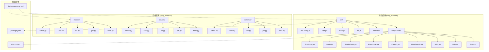

**图表来源**
- [package.json:1-28](file://blog_frontend/package.json#L1-L28)
- [vite.config.js:1-17](file://blog_frontend/vite.config.js#L1-L17)

**章节来源**
- [package.json:1-28](file://blog_frontend/package.json#L1-L28)
- [vite.config.js:1-17](file://blog_frontend/vite.config.js#L1-L17)
- [index.html:1-13](file://blog_frontend/index.html#L1-L13)

## 核心组件

### 应用入口和初始化

应用通过main.jsx作为入口点，使用ReactDOM.createRoot进行渲染：

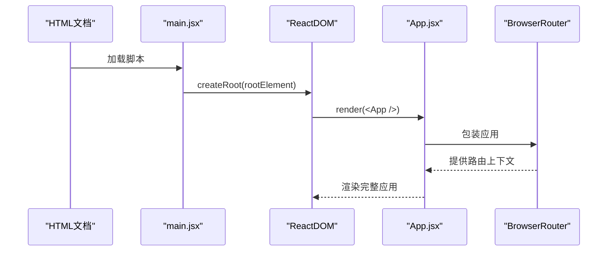

**图表来源**
- [main.jsx:1-9](file://blog_frontend/src/main.jsx#L1-L9)
- [App.jsx:55-76](file://blog_frontend/src/App.jsx#L55-L76)

### 导航栏组件设计

导航栏组件实现了响应式设计和用户状态管理：

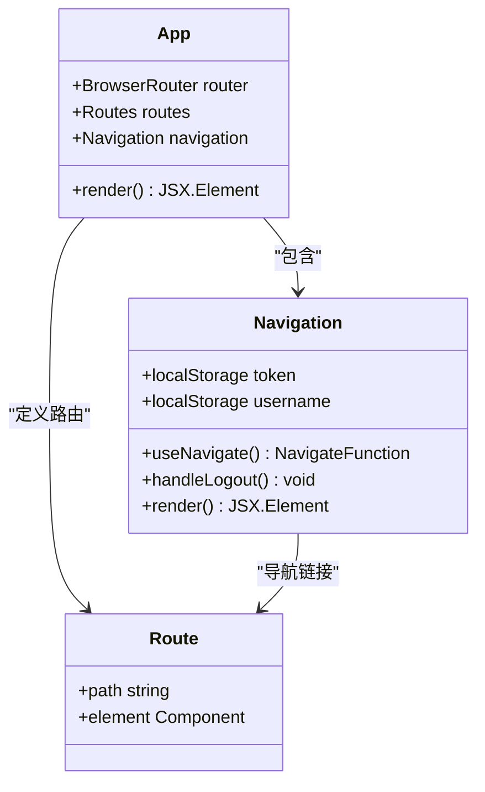

**图表来源**
- [App.jsx:15-53](file://blog_frontend/src/App.jsx#L15-L53)
- [App.jsx:55-76](file://blog_frontend/src/App.jsx#L55-L76)

**章节来源**
- [App.jsx:15-79](file://blog_frontend/src/App.jsx#L15-L79)
- [main.jsx:1-9](file://blog_frontend/src/main.jsx#L1-L9)

## 架构概览

应用采用分层架构设计，清晰分离了表现层、业务逻辑层和数据访问层：

```mermaid
graph TB
subgraph "表现层 (Presentation Layer)"
A[App.jsx] --> B[Navigation]
A --> C[Route Components]
C --> D[ArticleList]
C --> E[Login]
C --> F[ArticleDetail]
C --> G[UserHome]
C --> H[Publish]
C --> I[UserSearch]
C --> J[Jobs]
C --> K[Bills]
C --> L[Boss]
end
subgraph "业务逻辑层 (Business Logic Layer)"
M[api.js] --> N[HTTP请求封装]
N --> O[Axios拦截器]
O --> P[认证令牌管理]
end
subgraph "数据访问层 (Data Access Layer)"
Q[/api] --> R[后端REST API]
R --> S[数据库操作]
end
subgraph "样式层 (Style Layer)"
T[index.css] --> U[全局样式]
V[markdown.css] --> W[Markdown样式]
end
A --> M
M --> Q
D --> V
F --> V
```

**图表来源**
- [App.jsx:1-14](file://blog_frontend/src/App.jsx#L1-L14)
- [api.js:1-39](file://blog_frontend/src/api.js#L1-L39)
- [index.css:1-156](file://blog_frontend/src/index.css#L1-L156)

### 路由配置和导航系统

应用使用React Router 6的声明式路由配置，支持嵌套路由和参数传递：

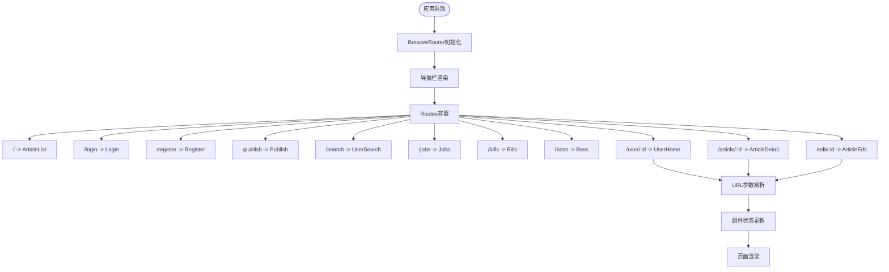

**图表来源**
- [App.jsx:60-72](file://blog_frontend/src/App.jsx#L60-L72)
- [ArticleDetail.jsx:8-18](file://blog_frontend/src/components/ArticleDetail.jsx#L8-L18)

**章节来源**
- [App.jsx:55-79](file://blog_frontend/src/App.jsx#L55-L79)

## 详细组件分析

### 文章管理系统

文章管理是应用的核心功能，包含文章列表、详情展示、发布和编辑功能：

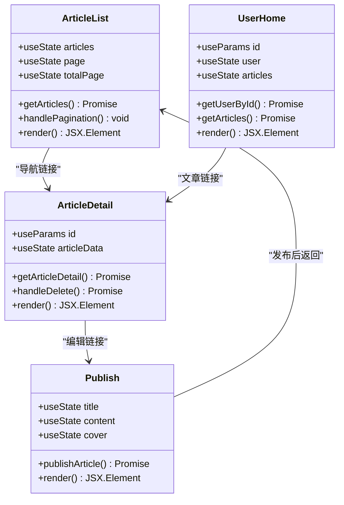

**图表来源**
- [ArticleList.jsx:7-77](file://blog_frontend/src/components/ArticleList.jsx#L7-L77)
- [ArticleDetail.jsx:8-60](file://blog_frontend/src/components/ArticleDetail.jsx#L8-L60)
- [Publish.jsx:5-53](file://blog_frontend/src/components/Publish.jsx#L5-L53)
- [UserHome.jsx:5-129](file://blog_frontend/src/components/UserHome.jsx#L5-L129)

#### 文章列表组件分析

文章列表组件实现了完整的分页功能和Markdown渲染：

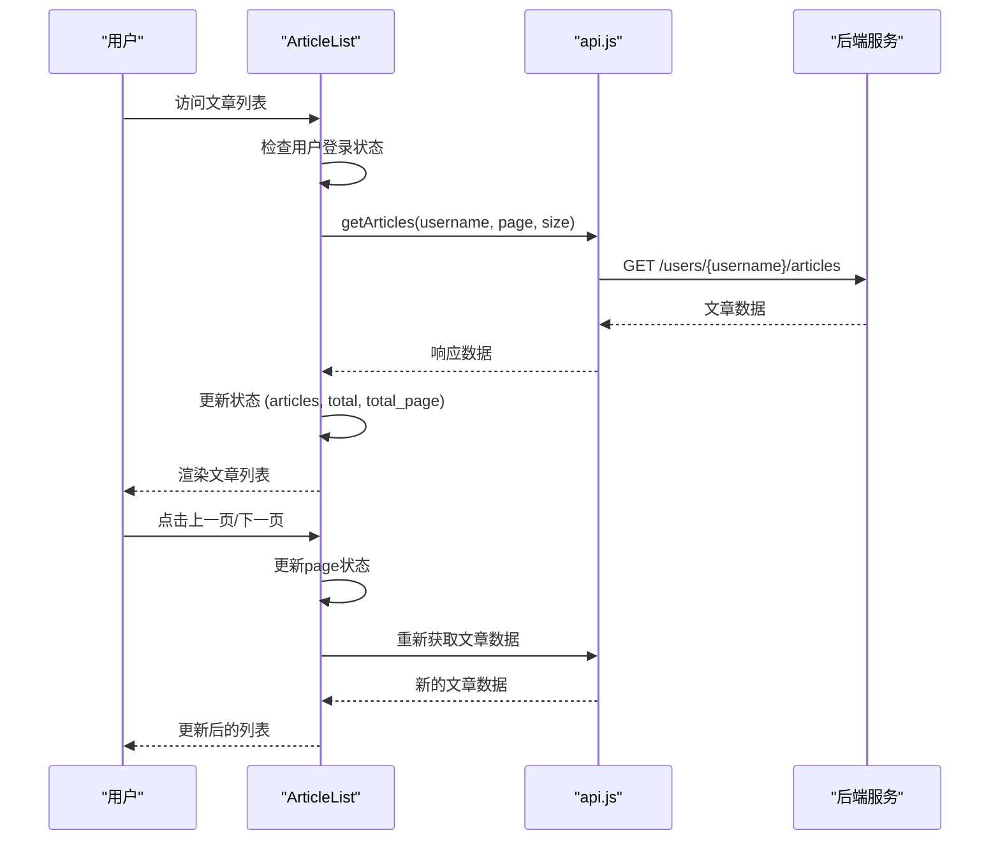

**图表来源**
- [ArticleList.jsx:14-25](file://blog_frontend/src/components/ArticleList.jsx#L14-L25)
- [api.js:18-19](file://blog_frontend/src/api.js#L18-L19)

**章节来源**
- [ArticleList.jsx:1-77](file://blog_frontend/src/components/ArticleList.jsx#L1-L77)

#### 登录组件分析

登录组件实现了用户认证流程和错误处理：

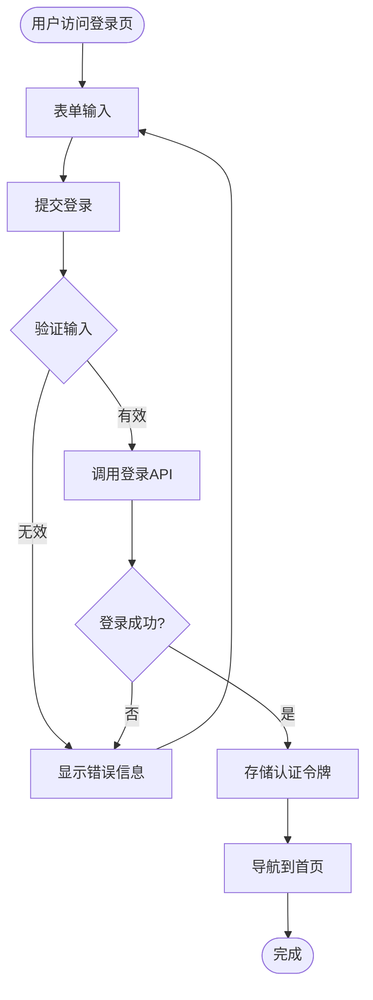

**图表来源**
- [Login.jsx:11-21](file://blog_frontend/src/components/Login.jsx#L11-L21)
- [api.js:16](file://blog_frontend/src/api.js#L16)

**章节来源**
- [Login.jsx:1-47](file://blog_frontend/src/components/Login.jsx#L1-L47)

### 用户搜索和主页

用户搜索功能提供了全文搜索和分页浏览能力：

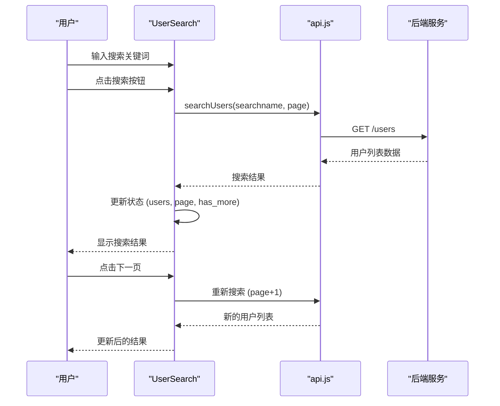

**图表来源**
- [UserSearch.jsx:14-38](file://blog_frontend/src/components/UserSearch.jsx#L14-L38)
- [api.js:22](file://blog_frontend/src/api.js#L22)

**章节来源**
- [UserSearch.jsx:1-140](file://blog_frontend/src/components/UserSearch.jsx#L1-L140)

### 招聘信息和智能记账

这两个功能模块展示了复杂的状态管理和图表可视化：

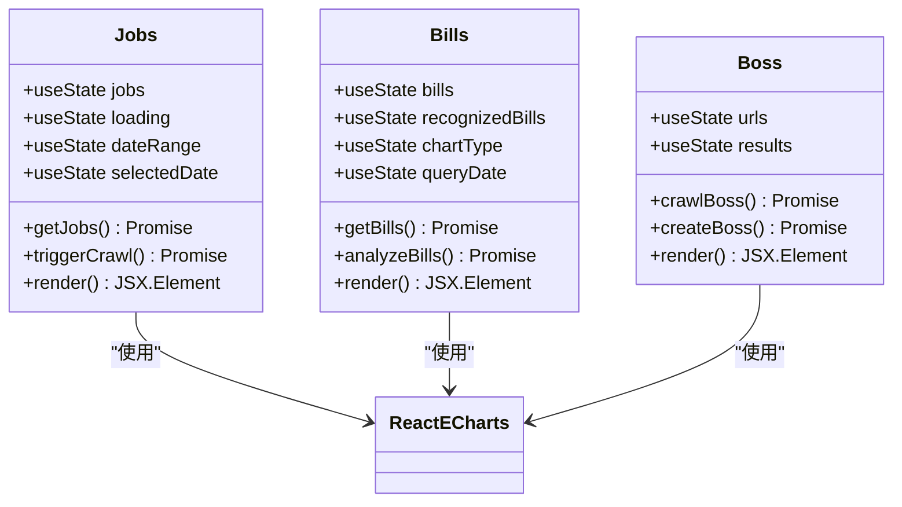

**图表来源**
- [Jobs.jsx:5-293](file://blog_frontend/src/components/Jobs.jsx#L5-L293)
- [Bills.jsx:5-539](file://blog_frontend/src/components/Bills.jsx#L5-L539)
- [Boss.jsx:5-145](file://blog_frontend/src/components/Boss.jsx#L5-L145)

**章节来源**
- [Jobs.jsx:1-293](file://blog_frontend/src/components/Jobs.jsx#L1-L293)
- [Bills.jsx:1-539](file://blog_frontend/src/components/Bills.jsx#L1-L539)
- [Boss.jsx:1-145](file://blog_frontend/src/components/Boss.jsx#L1-L145)

## 依赖关系分析

应用的依赖关系体现了清晰的模块化设计：

```mermaid
graph TB
subgraph "核心依赖"
A[react@^18.2.0]
B[react-dom@^18.2.0]
C[react-router-dom@^6.22.1]
D[axios@^1.6.7]
end
subgraph "开发依赖"
E[@vitejs/plugin-react@^4.2.1]
F[vite@^5.1.4]
G[@types/react@^18.2.56]
H[@types/react-dom@^18.2.19]
end
subgraph "第三方库"
I[react-markdown@^9.0.1]
J[remark-gfm@^4.0.0]
K[echarts@^6.0.0]
L[echarts-for-react@^3.0.6]
end
subgraph "应用模块"
M[App.jsx]
N[components/*]
O[api.js]
P[index.css]
end
M --> A
M --> C
N --> A
N --> C
O --> D
P --> I
P --> K
P --> L
```

**图表来源**
- [package.json:11-26](file://blog_frontend/package.json#L11-L26)

**章节来源**
- [package.json:1-28](file://blog_frontend/package.json#L1-L28)

### API通信层设计

应用的API层采用了统一的请求封装和拦截器机制：

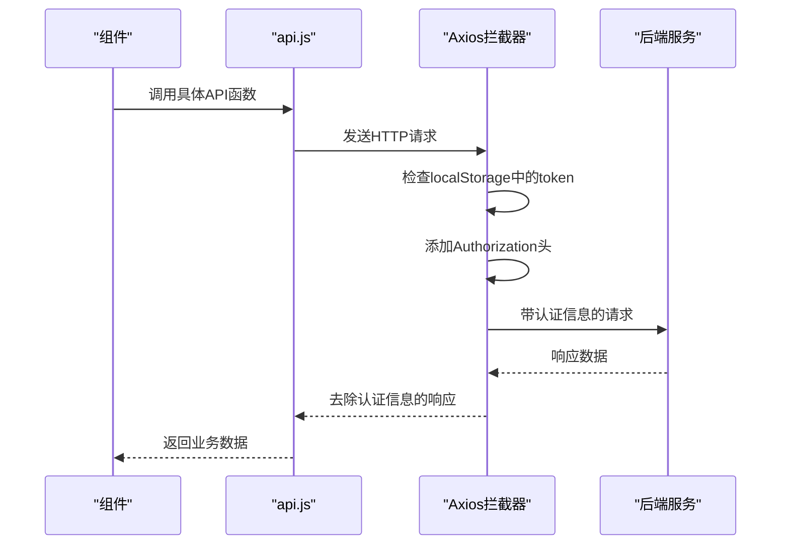

**图表来源**
- [api.js:7-14](file://blog_frontend/src/api.js#L7-L14)

**章节来源**
- [api.js:1-39](file://blog_frontend/src/api.js#L1-L39)

## 性能考虑

### 状态管理优化

应用采用了多种状态管理策略：

1. **局部状态管理**: 使用React Hooks管理组件内部状态
2. **状态提升**: 在需要共享的状态场景中进行状态提升
3. **记忆化优化**: 使用useMemo避免不必要的重渲染

### 组件渲染优化

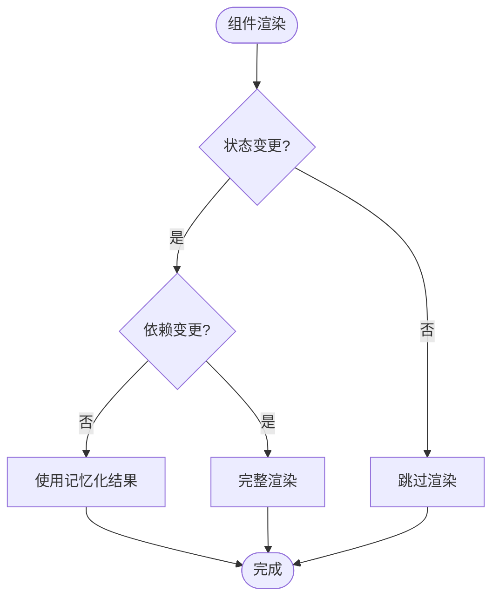

### 样式优化

应用采用了响应式设计和移动端优化：

- **CSS Grid和Flexbox**: 实现灵活的布局系统
- **媒体查询**: 支持不同屏幕尺寸的适配
- **性能友好的选择器**: 避免复杂的CSS选择器

**章节来源**
- [index.css:16-55](file://blog_frontend/src/index.css#L16-L55)
- [markdown.css:1-103](file://blog_frontend/src/markdown.css#L1-L103)

## 故障排除指南

### 常见问题诊断

1. **路由导航问题**
   - 检查BrowserRouter包装
   - 验证Route路径配置
   - 确认Link组件的to属性

2. **认证相关问题**
   - 检查localStorage中的token存储
   - 验证Axios拦截器配置
   - 确认后端认证接口响应

3. **API请求失败**
   - 检查代理配置
   - 验证CORS设置
   - 确认网络连接

### 开发环境配置

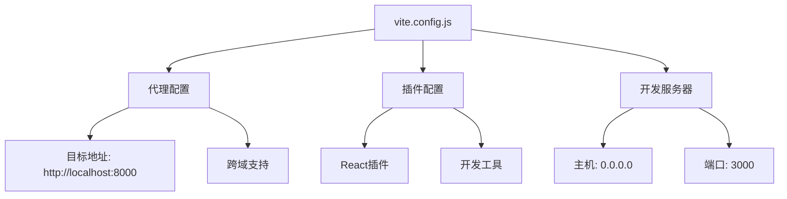

**图表来源**
- [vite.config.js:5-16](file://blog_frontend/vite.config.js#L5-L16)

**章节来源**
- [vite.config.js:1-17](file://blog_frontend/vite.config.js#L1-L17)

## 结论

这个React应用展现了现代前端开发的最佳实践，包括：

1. **清晰的架构设计**: 分层架构确保了代码的可维护性
2. **组件化开发**: 功能模块化提高了代码复用性
3. **响应式设计**: 优秀的移动端适配体验
4. **性能优化**: 合理的状态管理和渲染优化
5. **开发体验**: 完善的开发工具链和配置

应用为后续的功能扩展奠定了良好的基础，特别是在状态管理、性能优化和用户体验方面都有很大的提升空间。

## 附录

### 开发环境要求

- Node.js版本: 16.x或更高
- npm版本: 8.x或更高
- 推荐使用: VS Code + React DevTools

### 构建和部署

```bash
# 开发环境
npm run dev

# 生产构建
npm run build

# 预览生产构建
npm run preview
```

### 代码组织规范

1. **文件命名**: 使用PascalCase命名组件文件
2. **导入导出**: 统一使用ES6模块语法
3. **样式管理**: 每个组件独立样式文件
4. **API设计**: 统一的请求封装和错误处理