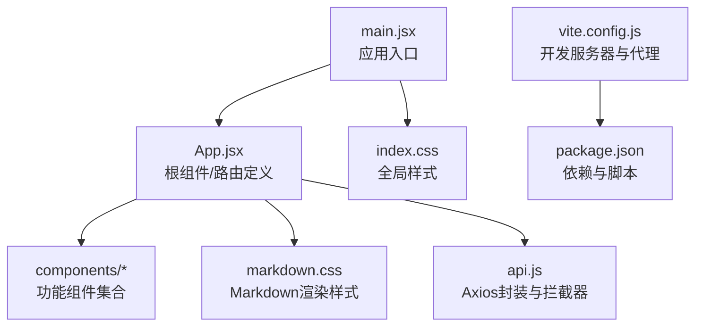
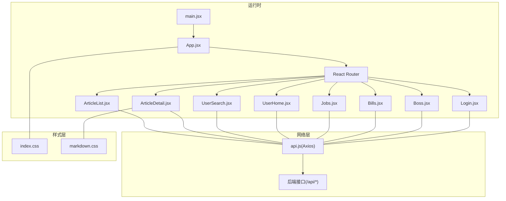
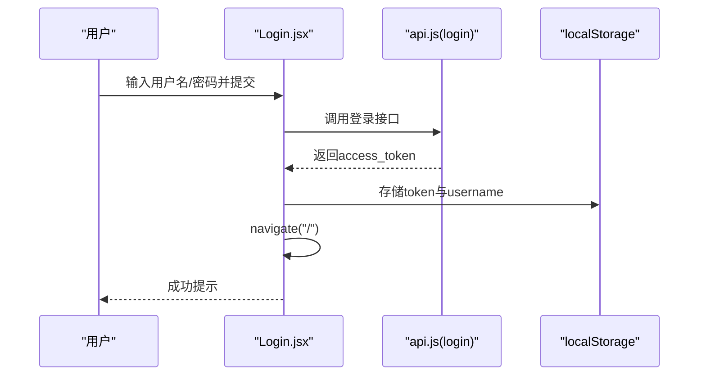
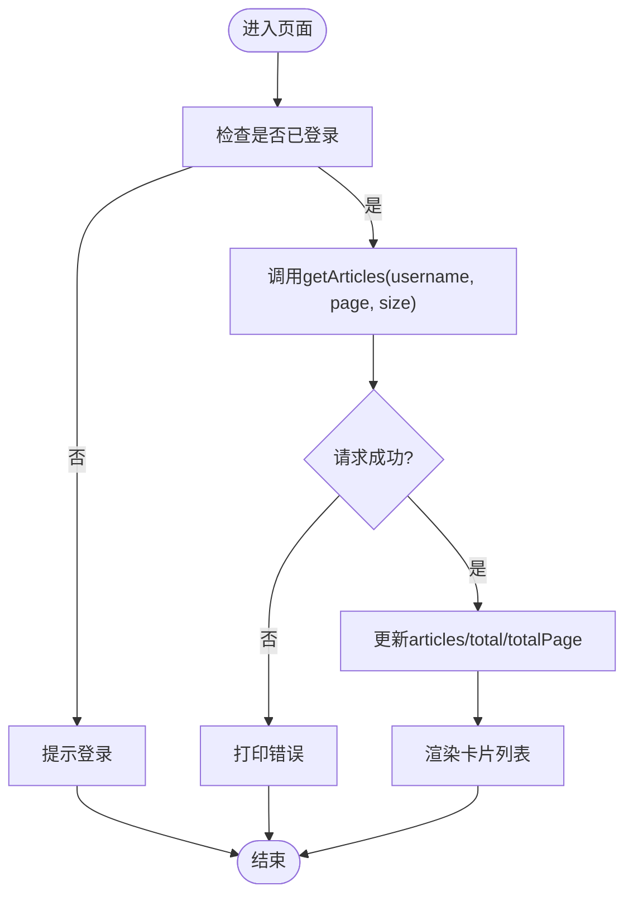
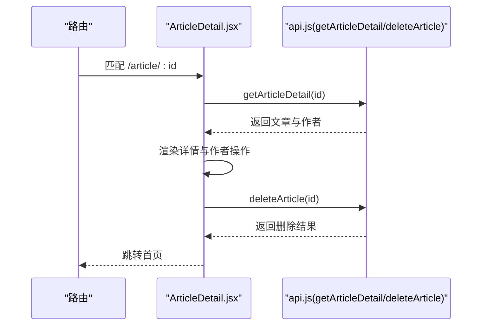
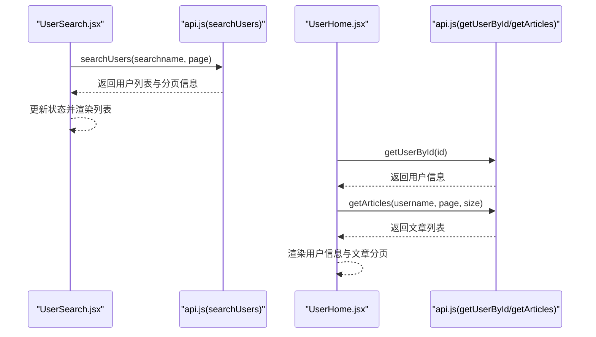
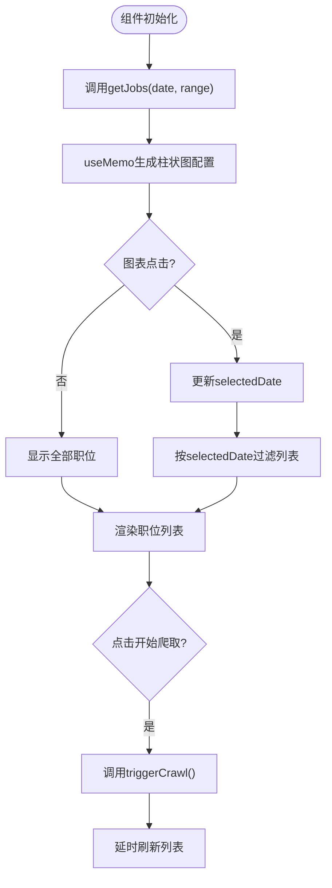
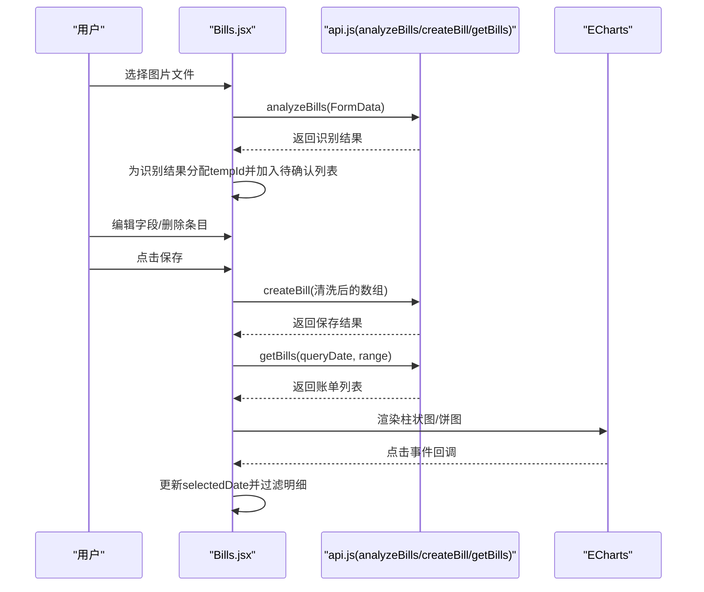
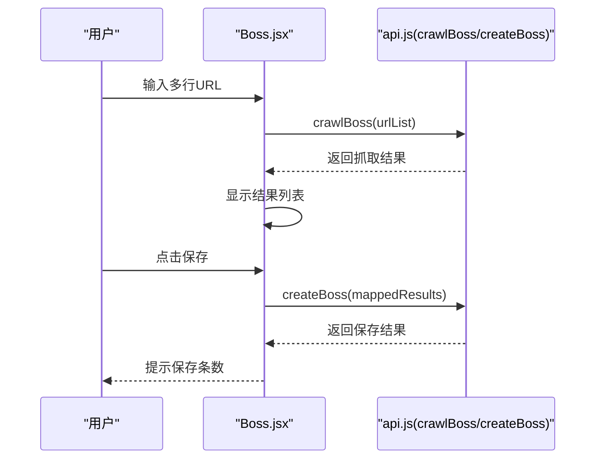
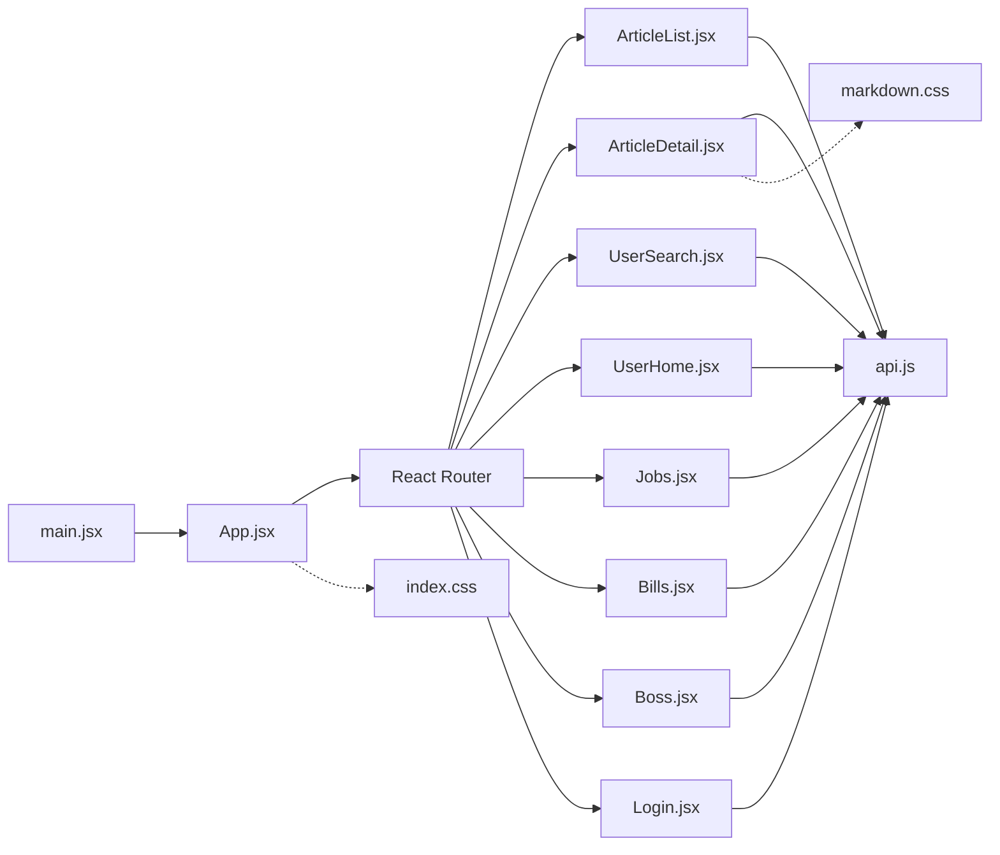

# 前端架构

<cite>
**本文引用的文件**
- [main.jsx](file://blog_frontend/src/main.jsx)
- [App.jsx](file://blog_frontend/src/App.jsx)
- [api.js](file://blog_frontend/src/api.js)
- [vite.config.js](file://blog_frontend/vite.config.js)
- [package.json](file://blog_frontend/package.json)
- [Login.jsx](file://blog_frontend/src/components/Login.jsx)
- [ArticleList.jsx](file://blog_frontend/src/components/ArticleList.jsx)
- [ArticleDetail.jsx](file://blog_frontend/src/components/ArticleDetail.jsx)
- [UserSearch.jsx](file://blog_frontend/src/components/UserSearch.jsx)
- [UserHome.jsx](file://blog_frontend/src/components/UserHome.jsx)
- [Jobs.jsx](file://blog_frontend/src/components/Jobs.jsx)
- [Bills.jsx](file://blog_frontend/src/components/Bills.jsx)
- [Boss.jsx](file://blog_frontend/src/components/Boss.jsx)
- [index.css](file://blog_frontend/src/index.css)
- [markdown.css](file://blog_frontend/src/markdown.css)
</cite>

## 目录
1. [简介](#简介)
2. [项目结构](#项目结构)
3. [核心组件](#核心组件)
4. [架构总览](#架构总览)
5. [组件详解](#组件详解)
6. [依赖关系分析](#依赖关系分析)
7. [性能与可维护性](#性能与可维护性)
8. [故障排查指南](#故障排查指南)
9. [结论](#结论)
10. [附录](#附录)

## 简介
本项目是一个基于 React 的前端应用，采用 Vite 构建工具，结合 React Router 实现多页面路由，通过 Axios 封装的 API 客户端与后端交互。应用围绕“文章管理、用户社交、招聘信息可视化、智能记账与简历投递”四大功能域展开，具备登录认证、分页加载、图表可视化、文件上传识别等能力。

## 项目结构
前端采用按功能域划分的组件组织方式，入口文件负责挂载根组件，根组件集中定义路由与全局导航，业务组件按模块拆分，样式文件独立管理，便于扩展与维护。

**图表来源**
- [main.jsx:1-9](file://blog_frontend/src/main.jsx#L1-L9)
- [App.jsx:1-79](file://blog_frontend/src/App.jsx#L1-L79)
- [api.js:1-39](file://blog_frontend/src/api.js#L1-L39)
- [vite.config.js:1-17](file://blog_frontend/vite.config.js#L1-L17)
- [package.json:1-28](file://blog_frontend/package.json#L1-L28)

**章节来源**
- [main.jsx:1-9](file://blog_frontend/src/main.jsx#L1-L9)
- [App.jsx:1-79](file://blog_frontend/src/App.jsx#L1-L79)
- [vite.config.js:1-17](file://blog_frontend/vite.config.js#L1-L17)
- [package.json:1-28](file://blog_frontend/package.json#L1-L28)

## 核心组件
- 应用入口与根组件：负责挂载 React 根节点、定义全局路由与导航栏，并在导航栏中读取本地存储的登录态进行条件渲染。
- API 客户端：统一创建 Axios 实例，注入请求拦截器携带 Token，导出常用业务 API 方法，支持文件上传场景。
- 功能组件：覆盖文章列表/详情、用户搜索/主页、招聘展示、智能记账、简历投递等模块，均通过 hooks 管理状态与副作用。

**章节来源**
- [main.jsx:1-9](file://blog_frontend/src/main.jsx#L1-L9)
- [App.jsx:15-76](file://blog_frontend/src/App.jsx#L15-L76)
- [api.js:1-39](file://blog_frontend/src/api.js#L1-L39)

## 架构总览
应用采用“入口 -> 根组件 -> 路由 -> 组件”的单页应用架构，组件间通过 props 与 React Router 参数传递数据；状态管理以 React Hooks 为主，少量共享状态通过本地存储实现；API 层统一处理认证与错误提示。

**图表来源**
- [main.jsx:1-9](file://blog_frontend/src/main.jsx#L1-L9)
- [App.jsx:1-79](file://blog_frontend/src/App.jsx#L1-L79)
- [api.js:1-39](file://blog_frontend/src/api.js#L1-L39)
- [index.css:1-156](file://blog_frontend/src/index.css#L1-L156)
- [markdown.css:1-103](file://blog_frontend/src/markdown.css#L1-L103)

## 组件详解

### 登录组件(Login)
- 职责：接收用户名/密码，调用登录 API，成功后写入 Token 与用户名到本地存储并跳转首页。
- 关键点：受控表单、异步提交、错误提示、路由跳转。

**图表来源**
- [Login.jsx:1-47](file://blog_frontend/src/components/Login.jsx#L1-L47)
- [api.js:16](file://blog_frontend/src/api.js#L16)

**章节来源**
- [Login.jsx:1-47](file://blog_frontend/src/components/Login.jsx#L1-L47)

### 文章列表(ArticleList)
- 职责：按页拉取当前用户的文章列表，支持上一页/下一页分页，Markdown 截断预览。
- 关键点：useEffect 依赖用户标识触发数据拉取；分页状态与总数来自后端返回；Markdown 渲染使用插件。

**图表来源**
- [ArticleList.jsx:1-77](file://blog_frontend/src/components/ArticleList.jsx#L1-L77)
- [api.js:18](file://blog_frontend/src/api.js#L18)

**章节来源**
- [ArticleList.jsx:1-77](file://blog_frontend/src/components/ArticleList.jsx#L1-L77)

### 文章详情(ArticleDetail)
- 职责：根据路由参数加载文章详情，支持作者删除与编辑跳转；Markdown 内容渲染。
- 关键点：useParams 获取 id；删除流程二次确认；作者鉴权控制编辑/删除按钮。

**图表来源**
- [ArticleDetail.jsx:1-60](file://blog_frontend/src/components/ArticleDetail.jsx#L1-L60)
- [api.js:20](file://blog_frontend/src/api.js#L20)
- [api.js:24](file://blog_frontend/src/api.js#L24)

**章节来源**
- [ArticleDetail.jsx:1-60](file://blog_frontend/src/components/ArticleDetail.jsx#L1-L60)

### 用户搜索(UserSearch)与用户主页(UserHome)
- 用户搜索：关键词分页查询用户列表，支持上一页/下一页。
- 用户主页：根据用户 ID 获取用户信息与该用户的公开文章列表，支持分页。

**图表来源**
- [UserSearch.jsx:1-140](file://blog_frontend/src/components/UserSearch.jsx#L1-L140)
- [UserHome.jsx:1-129](file://blog_frontend/src/components/UserHome.jsx#L1-L129)
- [api.js:22](file://blog_frontend/src/api.js#L22)
- [api.js:23](file://blog_frontend/src/api.js#L23)

**章节来源**
- [UserSearch.jsx:1-140](file://blog_frontend/src/components/UserSearch.jsx#L1-L140)
- [UserHome.jsx:1-129](file://blog_frontend/src/components/UserHome.jsx#L1-L129)

### 招聘展示(Jobs)
- 职责：按周/月维度统计职位数量，支持图表点击筛选某日职位明细；支持触发爬虫任务。
- 关键点：useMemo 计算图表数据；日期范围切换；图表交互选择；防重复触发爬虫。

**图表来源**
- [Jobs.jsx:1-293](file://blog_frontend/src/components/Jobs.jsx#L1-L293)
- [api.js:26](file://blog_frontend/src/api.js#L26)
- [api.js:27](file://blog_frontend/src/api.js#L27)

**章节来源**
- [Jobs.jsx:1-293](file://blog_frontend/src/components/Jobs.jsx#L1-L293)

### 智能记账(Bills)
- 职责：上传图片识别账单，人工校验后批量保存；按周/月统计每日支出与分类占比；支持图表切换与日期选择。
- 关键点：FormData 上传；识别结果临时 ID 管理；保存时剔除临时字段；图表交互点击联动明细。

**图表来源**
- [Bills.jsx:1-539](file://blog_frontend/src/components/Bills.jsx#L1-L539)
- [api.js:28](file://blog_frontend/src/api.js#L28)
- [api.js:33](file://blog_frontend/src/api.js#L33)
- [api.js:34](file://blog_frontend/src/api.js#L34)

**章节来源**
- [Bills.jsx:1-539](file://blog_frontend/src/components/Bills.jsx#L1-L539)

### 简历投递(Boss)
- 职责：批量抓取多个职位链接的信息，人工核对后批量保存至后端。
- 关键点：URL 列表解析；抓取结果映射兼容字段；保存按钮禁用状态管理。

**图表来源**
- [Boss.jsx:1-145](file://blog_frontend/src/components/Boss.jsx#L1-L145)
- [api.js:35](file://blog_frontend/src/api.js#L35)
- [api.js:36](file://blog_frontend/src/api.js#L36)

**章节来源**
- [Boss.jsx:1-145](file://blog_frontend/src/components/Boss.jsx#L1-L145)

## 依赖关系分析
- 组件依赖：所有页面组件均依赖 api.js 的方法；App.jsx 作为路由与导航中心，被 main.jsx 引用。
- 样式依赖：全局样式与 Markdown 渲染样式分别在入口与详情页引入。
- 构建与运行：Vite 提供开发服务器与代理，将 /api 请求转发至后端；package.json 定义了 React、React Router、Axios、ECharts 及其插件等依赖。

**图表来源**
- [main.jsx:1-9](file://blog_frontend/src/main.jsx#L1-L9)
- [App.jsx:1-79](file://blog_frontend/src/App.jsx#L1-L79)
- [api.js:1-39](file://blog_frontend/src/api.js#L1-L39)
- [index.css:1-156](file://blog_frontend/src/index.css#L1-L156)
- [markdown.css:1-103](file://blog_frontend/src/markdown.css#L1-L103)

**章节来源**
- [vite.config.js:1-17](file://blog_frontend/vite.config.js#L1-L17)
- [package.json:1-28](file://blog_frontend/package.json#L1-L28)

## 性能与可维护性
- 状态管理策略
  - 使用 React Hooks 管理组件内局部状态，如分页、图表日期、识别结果等，避免引入重型状态库。
  - 登录态通过 localStorage 管理，减少跨组件传递成本。
- 数据获取与缓存
  - 利用 React Router 参数与 useEffect 依赖控制请求时机，避免重复请求。
  - 对于计算型数据（如图表配置），使用 useMemo 缓存，降低渲染开销。
- 错误处理
  - 组件内捕获并提示错误，避免崩溃；对 404 场景给出明确文案。
- 样式与渲染
  - 使用 CSS-in-JS 风格的内联样式与统一类名，配合媒体查询适配移动端。
  - Markdown 内容使用插件渲染，确保代码块与表格可读性。
- 可维护性
  - API 方法集中在 api.js 中，统一拦截器与 baseURL，便于后续扩展与测试。
  - 组件职责单一，路由清晰，便于单元测试与重构。

[本节为通用指导，无需具体文件引用]

## 故障排查指南
- 登录失败
  - 现象：提交后弹出失败提示。
  - 排查：确认后端 /api/auth/login 是否可达；检查浏览器 Network 面板中的响应体；确认用户名/密码正确。
  - 参考路径：[Login.jsx:11-21](file://blog_frontend/src/components/Login.jsx#L11-L21)，[api.js:16](file://blog_frontend/src/api.js#L16)
- 文章列表为空
  - 现象：提示“请登录以查看您的文章”或空列表。
  - 排查：确认登录态存在；检查 getArticles 的参数与后端分页返回结构。
  - 参考路径：[ArticleList.jsx:14-25](file://blog_frontend/src/components/ArticleList.jsx#L14-L25)，[api.js:18](file://blog_frontend/src/api.js#L18)
- 图表无数据
  - 现象：招聘/记账图表空白。
  - 排查：确认 getJobs/getBills 的日期与范围参数；检查后端返回字段是否一致；查看控制台错误。
  - 参考路径：[Jobs.jsx:22-44](file://blog_frontend/src/components/Jobs.jsx#L22-L44)，[Bills.jsx:32-50](file://blog_frontend/src/components/Bills.jsx#L32-L50)
- 爬虫/识别失败
  - 现象：触发爬虫或识别后无结果或报错。
  - 排查：确认 triggerCrawl/analyzeBills 的接口连通性；检查后端服务状态；查看错误提示。
  - 参考路径：[Jobs.jsx:153-169](file://blog_frontend/src/components/Jobs.jsx#L153-L169)，[Bills.jsx:222-256](file://blog_frontend/src/components/Bills.jsx#L222-L256)
- 开发服务器无法访问
  - 现象：本地无法通过主机 IP 访问开发服务器。
  - 排查：确认 Vite server.host 设置为 0.0.0.0；代理 /api 至后端地址。
  - 参考路径：[vite.config.js:7-15](file://blog_frontend/vite.config.js#L7-L15)

**章节来源**
- [Login.jsx:11-21](file://blog_frontend/src/components/Login.jsx#L11-L21)
- [ArticleList.jsx:14-25](file://blog_frontend/src/components/ArticleList.jsx#L14-L25)
- [Jobs.jsx:22-44](file://blog_frontend/src/components/Jobs.jsx#L22-L44)
- [Bills.jsx:32-50](file://blog_frontend/src/components/Bills.jsx#L32-L50)
- [Jobs.jsx:153-169](file://blog_frontend/src/components/Jobs.jsx#L153-L169)
- [Bills.jsx:222-256](file://blog_frontend/src/components/Bills.jsx#L222-L256)
- [vite.config.js:7-15](file://blog_frontend/vite.config.js#L7-L15)

## 结论
本项目以 React + Vite 为基础，结合 React Router 实现清晰的页面导航，通过 Axios 封装统一处理认证与请求，组件职责明确、状态管理简洁。招聘与记账模块利用图表增强数据表达，简历投递模块实现从采集到入库的闭环。整体架构易于扩展与维护，适合在现有基础上继续完善状态管理与测试体系。

[本节为总结性内容，无需具体文件引用]

## 附录

### API 客户端设计要点
- Axios 实例：统一 baseURL 与拦截器，自动注入 Authorization 头。
- 方法导出：按业务域导出函数，如登录、注册、文章、用户、招聘、记账、Boss 等。
- 文件上传：识别接口使用 multipart/form-data，注意 headers 配置。

**章节来源**
- [api.js:1-39](file://blog_frontend/src/api.js#L1-L39)

### 构建与开发配置
- 开发服务器：host 允许局域网访问，/api 代理至后端。
- 依赖：React、React Router、Axios、ECharts 及其 React 插件、Markdown 渲染相关依赖。
- 脚本：dev/build/preview。

**章节来源**
- [vite.config.js:1-17](file://blog_frontend/vite.config.js#L1-L17)
- [package.json:1-28](file://blog_frontend/package.json#L1-L28)

### 样式与主题
- 全局样式：容器、卡片、按钮、错误提示、移动端适配。
- Markdown 渲染样式：代码块、表格、引用、图片自适应与响应式头部布局。

**章节来源**
- [index.css:1-156](file://blog_frontend/src/index.css#L1-L156)
- [markdown.css:1-103](file://blog_frontend/src/markdown.css#L1-L103)