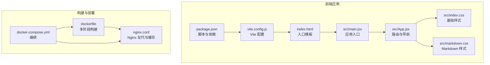
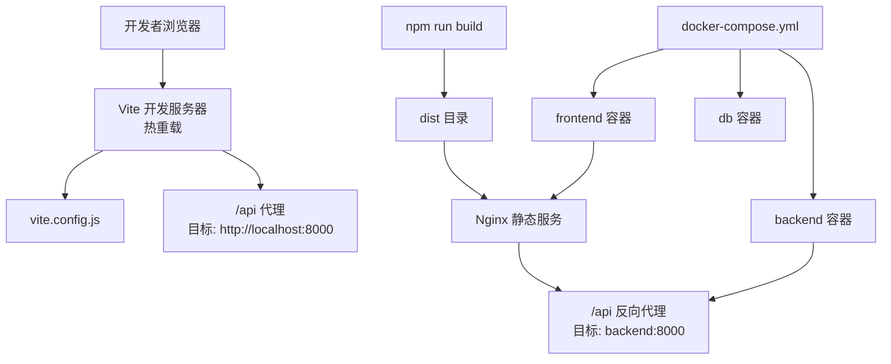
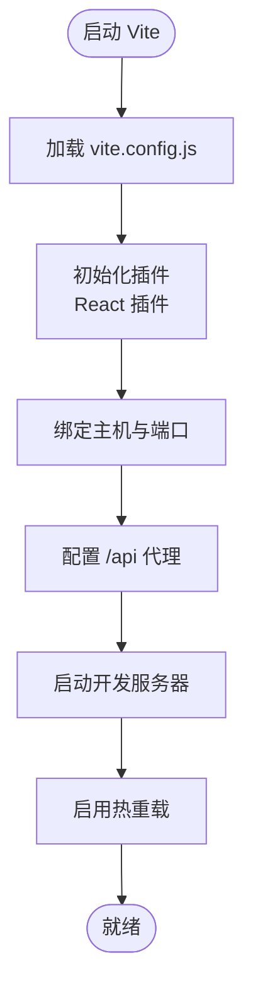
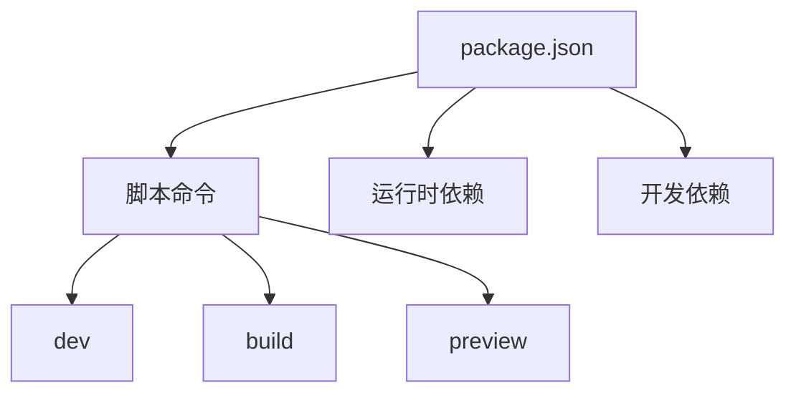
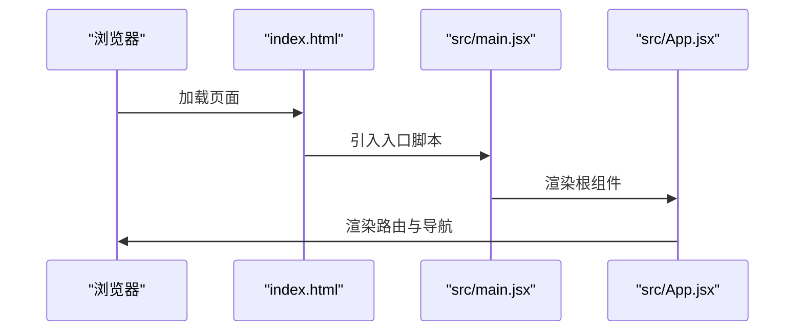
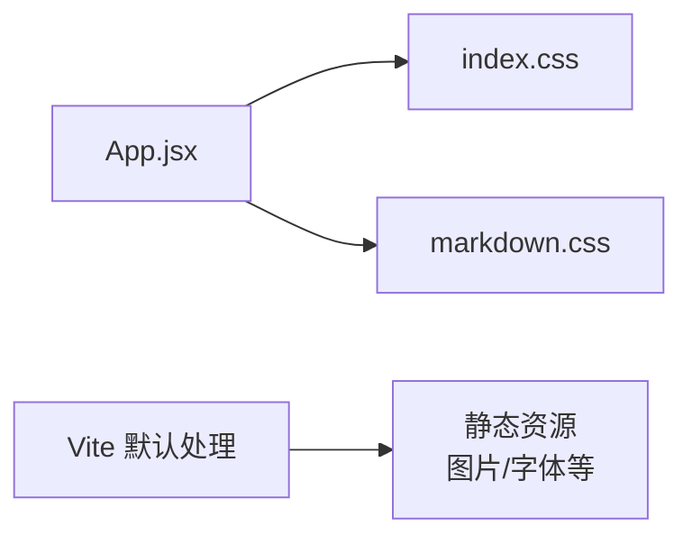
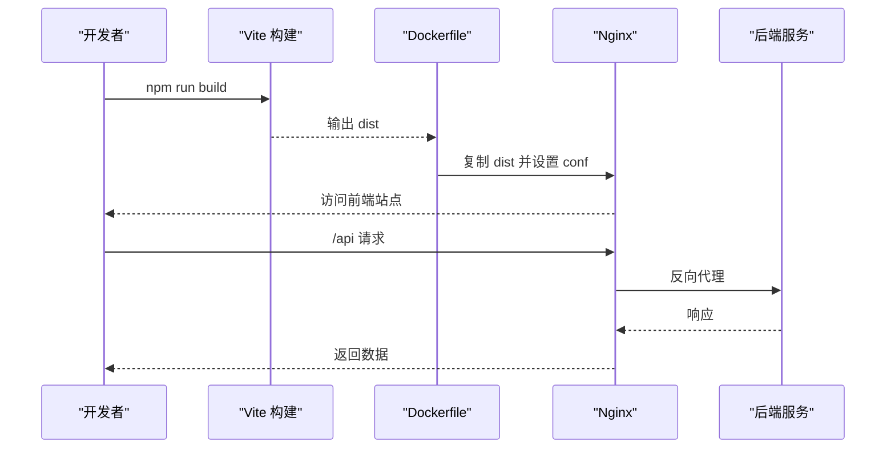
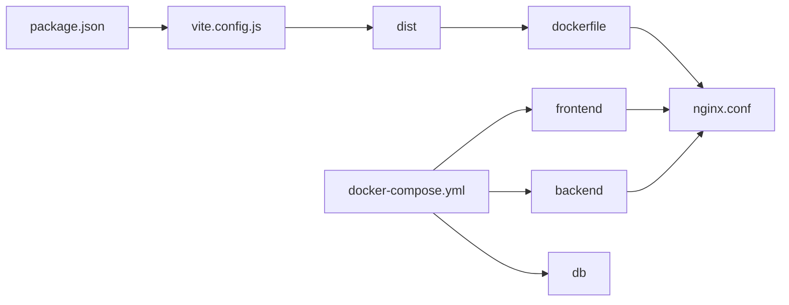

# 构建配置

<cite>
**本文引用的文件**
- [package.json](file://blog_frontend/package.json)
- [vite.config.js](file://blog_frontend/vite.config.js)
- [index.html](file://blog_frontend/index.html)
- [main.jsx](file://blog_frontend/src/main.jsx)
- [App.jsx](file://blog_frontend/src/App.jsx)
- [index.css](file://blog_frontend/src/index.css)
- [markdown.css](file://blog_frontend/src/markdown.css)
- [dockerfile](file://blog_frontend/dockerfile)
- [nginx.conf](file://blog_frontend/nginx.conf)
- [docker-compose.yml](file://docker-compose.yml)
</cite>

## 目录
1. [简介](#简介)
2. [项目结构](#项目结构)
3. [核心组件](#核心组件)
4. [架构总览](#架构总览)
5. [详细组件分析](#详细组件分析)
6. [依赖关系分析](#依赖关系分析)
7. [性能考量](#性能考量)
8. [故障排查指南](#故障排查指南)
9. [结论](#结论)
10. [附录](#附录)

## 简介
本文件系统化梳理前端构建配置，聚焦 Vite 的开发服务器、代理与热重载机制；解释 package.json 中的脚本命令与依赖管理策略；阐述静态资源处理、代码分割与打包优化现状；说明开发与生产环境差异；覆盖 CSS 处理、图片与字体资源管理；给出浏览器兼容性与 polyfill 策略建议；提供构建性能优化、缓存与 CDN 集成思路；最后包含部署配置与环境变量管理实践。

## 项目结构
前端工程位于 blog_frontend 目录，采用 React + Vite 技术栈，使用 Nginx 进行生产环境静态资源服务与反向代理。Docker Compose 将前端、后端与数据库组合为完整运行环境。

图表来源
- [package.json:1-28](file://blog_frontend/package.json#L1-L28)
- [vite.config.js:1-17](file://blog_frontend/vite.config.js#L1-L17)
- [index.html:1-13](file://blog_frontend/index.html#L1-L13)
- [main.jsx:1-9](file://blog_frontend/src/main.jsx#L1-L9)
- [App.jsx:1-79](file://blog_frontend/src/App.jsx#L1-L79)
- [index.css:1-156](file://blog_frontend/src/index.css#L1-L156)
- [markdown.css:1-103](file://blog_frontend/src/markdown.css#L1-L103)
- [dockerfile:1-25](file://blog_frontend/dockerfile#L1-L25)
- [nginx.conf:1-26](file://blog_frontend/nginx.conf#L1-L26)
- [docker-compose.yml:1-41](file://docker-compose.yml#L1-L41)

章节来源
- [package.json:1-28](file://blog_frontend/package.json#L1-L28)
- [vite.config.js:1-17](file://blog_frontend/vite.config.js#L1-L17)
- [index.html:1-13](file://blog_frontend/index.html#L1-L13)
- [main.jsx:1-9](file://blog_frontend/src/main.jsx#L1-L9)
- [App.jsx:1-79](file://blog_frontend/src/App.jsx#L1-L79)
- [index.css:1-156](file://blog_frontend/src/index.css#L1-L156)
- [markdown.css:1-103](file://blog_frontend/src/markdown.css#L1-L103)
- [dockerfile:1-25](file://blog_frontend/dockerfile#L1-L25)
- [nginx.conf:1-26](file://blog_frontend/nginx.conf#L1-L26)
- [docker-compose.yml:1-41](file://docker-compose.yml#L1-L41)

## 核心组件
- Vite 开发服务器与代理
  - 开放主机地址以允许局域网访问
  - 配置 /api 代理到本地后端服务
- React 插件与构建
  - 使用 @vitejs/plugin-react 提升开发体验
  - 生产构建输出至 dist 目录
- 应用入口与模板
  - index.html 指定挂载点与入口脚本
  - main.jsx 渲染根组件 App
- 样式体系
  - index.css 提供基础布局与响应式设计
  - markdown.css 用于渲染 Markdown 内容
- 生产部署
  - 多阶段 Docker 构建
  - Nginx 提供静态资源与 API 反向代理
  - docker-compose 统一编排

章节来源
- [vite.config.js:7-15](file://blog_frontend/vite.config.js#L7-L15)
- [package.json:6-10](file://blog_frontend/package.json#L6-L10)
- [index.html:8-10](file://blog_frontend/index.html#L8-L10)
- [main.jsx:6-8](file://blog_frontend/src/main.jsx#L6-L8)
- [index.css:1-156](file://blog_frontend/src/index.css#L1-L156)
- [markdown.css:1-103](file://blog_frontend/src/markdown.css#L1-L103)
- [dockerfile:1-25](file://blog_frontend/dockerfile#L1-L25)
- [nginx.conf:1-26](file://blog_frontend/nginx.conf#L1-L26)
- [docker-compose.yml:1-41](file://docker-compose.yml#L1-L41)

## 架构总览
前端通过 Vite 提供开发服务器与热重载；构建产物由 Nginx 提供静态服务，并将 /api 请求转发至后端；Docker Compose 将前端、后端与数据库整合为可一键启动的环境。

图表来源
- [vite.config.js:7-15](file://blog_frontend/vite.config.js#L7-L15)
- [dockerfile:12-24](file://blog_frontend/dockerfile#L12-L24)
- [nginx.conf:12-19](file://blog_frontend/nginx.conf#L12-L19)
- [docker-compose.yml:1-41](file://docker-compose.yml#L1-L41)

## 详细组件分析

### Vite 配置与开发服务器
- 主机与网络
  - 开放 host 地址，便于局域网联调
- 代理规则
  - 将 /api 前缀请求代理到后端地址，支持跨域场景
- 插件
  - 启用 React 插件，提升 JSX 与 HMR 性能
- 热重载机制
  - 基于 ES 模块的原生 HMR，无需额外配置

图表来源
- [vite.config.js:5-16](file://blog_frontend/vite.config.js#L5-L16)

章节来源
- [vite.config.js:5-16](file://blog_frontend/vite.config.js#L5-L16)

### 包管理与脚本命令
- 脚本命令
  - dev: 启动开发服务器
  - build: 执行生产构建
  - preview: 预览构建产物
- 依赖与开发依赖
  - 运行时依赖包含 React、React Router、Axios、ECharts 等
  - 开发依赖包含 Vite 与 React 插件

图表来源
- [package.json:6-26](file://blog_frontend/package.json#L6-L26)

章节来源
- [package.json:6-26](file://blog_frontend/package.json#L6-L26)

### 应用入口与模板
- 入口模板
  - 指定挂载节点与入口脚本模块路径
- 应用入口
  - 渲染根组件 App，并引入全局样式
- 路由与导航
  - App.jsx 定义路由与导航栏逻辑，使用 React Router

图表来源
- [index.html:8-10](file://blog_frontend/index.html#L8-L10)
- [main.jsx:6-8](file://blog_frontend/src/main.jsx#L6-L8)
- [App.jsx:55-76](file://blog_frontend/src/App.jsx#L55-L76)

章节来源
- [index.html:1-13](file://blog_frontend/index.html#L1-L13)
- [main.jsx:1-9](file://blog_frontend/src/main.jsx#L1-L9)
- [App.jsx:1-79](file://blog_frontend/src/App.jsx#L1-L79)

### 样式与资源处理
- 基础样式
  - index.css 提供响应式布局、导航样式与移动端优化
- Markdown 样式
  - markdown.css 提供代码块、表格、引用等渲染样式
- 静态资源
  - 当前未见显式资源处理配置（如图片、字体），默认由 Vite 处理

图表来源
- [index.css:1-156](file://blog_frontend/src/index.css#L1-L156)
- [markdown.css:1-103](file://blog_frontend/src/markdown.css#L1-L103)
- [vite.config.js:5-16](file://blog_frontend/vite.config.js#L5-L16)

章节来源
- [index.css:1-156](file://blog_frontend/src/index.css#L1-L156)
- [markdown.css:1-103](file://blog_frontend/src/markdown.css#L1-L103)
- [vite.config.js:5-16](file://blog_frontend/vite.config.js#L5-L16)

### 生产构建与部署
- 多阶段构建
  - 第一阶段：安装依赖并执行构建
  - 第二阶段：使用 Nginx 提供静态服务
- Nginx 配置
  - 提供单页应用回退（try_files）
  - /api 反向代理到后端服务
- 编排
  - docker-compose 启动前端、后端与数据库

图表来源
- [dockerfile:12-24](file://blog_frontend/dockerfile#L12-L24)
- [nginx.conf:8-19](file://blog_frontend/nginx.conf#L8-L19)
- [docker-compose.yml:28-36](file://docker-compose.yml#L28-L36)

章节来源
- [dockerfile:1-25](file://blog_frontend/dockerfile#L1-L25)
- [nginx.conf:1-26](file://blog_frontend/nginx.conf#L1-L26)
- [docker-compose.yml:1-41](file://docker-compose.yml#L1-L41)

### 浏览器兼容性与 Polyfill 策略
- 当前配置未显式声明目标浏览器范围
- 建议策略
  - 在 Vite 中通过构建目标与插件实现按需 polyfill
  - 对现代浏览器优先，对旧版本浏览器补充必要垫片
  - 结合打包分析与测试矩阵验证兼容性

[本节为通用指导，不直接分析具体文件]

### 开发与生产差异化配置
- 开发环境
  - host 开放、代理 /api、启用 HMR
- 生产环境
  - 构建产物由 Nginx 提供，/api 反代至后端
  - 单页应用回退确保路由正常

章节来源
- [vite.config.js:7-15](file://blog_frontend/vite.config.js#L7-L15)
- [nginx.conf:8-19](file://blog_frontend/nginx.conf#L8-L19)

### 代码分割与打包优化现状
- 当前未发现明确的代码分割与优化配置
- 建议方向
  - 使用动态导入进行路由级懒加载
  - 启用压缩与资源内联策略
  - 分析包体积并拆分第三方库

[本节为通用指导，不直接分析具体文件]

### 缓存策略与 CDN 集成
- 缓存策略
  - 静态资源设置长期缓存，带内容指纹
  - HTML 设置较短缓存或禁用缓存
- CDN 集成
  - 将静态资源指向 CDN 域名
  - 保持 API 仍走自有域名或内网代理

[本节为通用指导，不直接分析具体文件]

## 依赖关系分析
- 构建链路
  - package.json 定义脚本与依赖
  - Vite 配置驱动开发与构建
  - Dockerfile 将构建产物交付给 Nginx
- 服务链路
  - 前端通过 /api 代理访问后端
  - docker-compose 统一编排三类服务

图表来源
- [package.json:6-26](file://blog_frontend/package.json#L6-L26)
- [vite.config.js:5-16](file://blog_frontend/vite.config.js#L5-L16)
- [dockerfile:12-24](file://blog_frontend/dockerfile#L12-L24)
- [nginx.conf:12-19](file://blog_frontend/nginx.conf#L12-L19)
- [docker-compose.yml:1-41](file://docker-compose.yml#L1-L41)

章节来源
- [package.json:1-28](file://blog_frontend/package.json#L1-L28)
- [vite.config.js:1-17](file://blog_frontend/vite.config.js#L1-L17)
- [dockerfile:1-25](file://blog_frontend/dockerfile#L1-L25)
- [nginx.conf:1-26](file://blog_frontend/nginx.conf#L1-L26)
- [docker-compose.yml:1-41](file://docker-compose.yml#L1-L41)

## 性能考量
- 开发期
  - 合理使用代理避免不必要的跨域问题
  - 控制插件数量，仅保留必要插件
- 构建期
  - 启用压缩与资源内联
  - 分析包体，拆分 vendor 与业务代码
- 运行期
  - 静态资源长期缓存
  - 服务端 gzip/br 压缩
  - CDN 加速静态资源

[本节为通用指导，不直接分析具体文件]

## 故障排查指南
- 代理 404 或跨域
  - 检查 vite.config.js 中 /api 代理目标是否可达
  - 确认后端 CORS 配置
- 预览失败
  - 确认已先执行构建再 preview
- Nginx 404 或路由异常
  - 检查 nginx.conf 的 try_files 回退
  - 确认 /api 反代目标正确
- Docker 启动异常
  - 查看容器日志与端口占用
  - 确认 docker-compose 服务依赖顺序

章节来源
- [vite.config.js:9-14](file://blog_frontend/vite.config.js#L9-L14)
- [nginx.conf:8-19](file://blog_frontend/nginx.conf#L8-L19)
- [docker-compose.yml:28-36](file://docker-compose.yml#L28-L36)

## 结论
当前前端构建配置简洁清晰：Vite 提供良好开发体验与代理能力；Nginx 负责生产静态服务与 API 反代；Docker Compose 实现一键编排。建议后续完善浏览器兼容性策略、代码分割与打包优化、缓存与 CDN 方案，以进一步提升开发效率与用户体验。

## 附录
- 关键文件清单
  - 构建与配置：vite.config.js、package.json
  - 应用入口：index.html、src/main.jsx、src/App.jsx
  - 样式：src/index.css、src/markdown.css
  - 部署：dockerfile、nginx.conf、docker-compose.yml