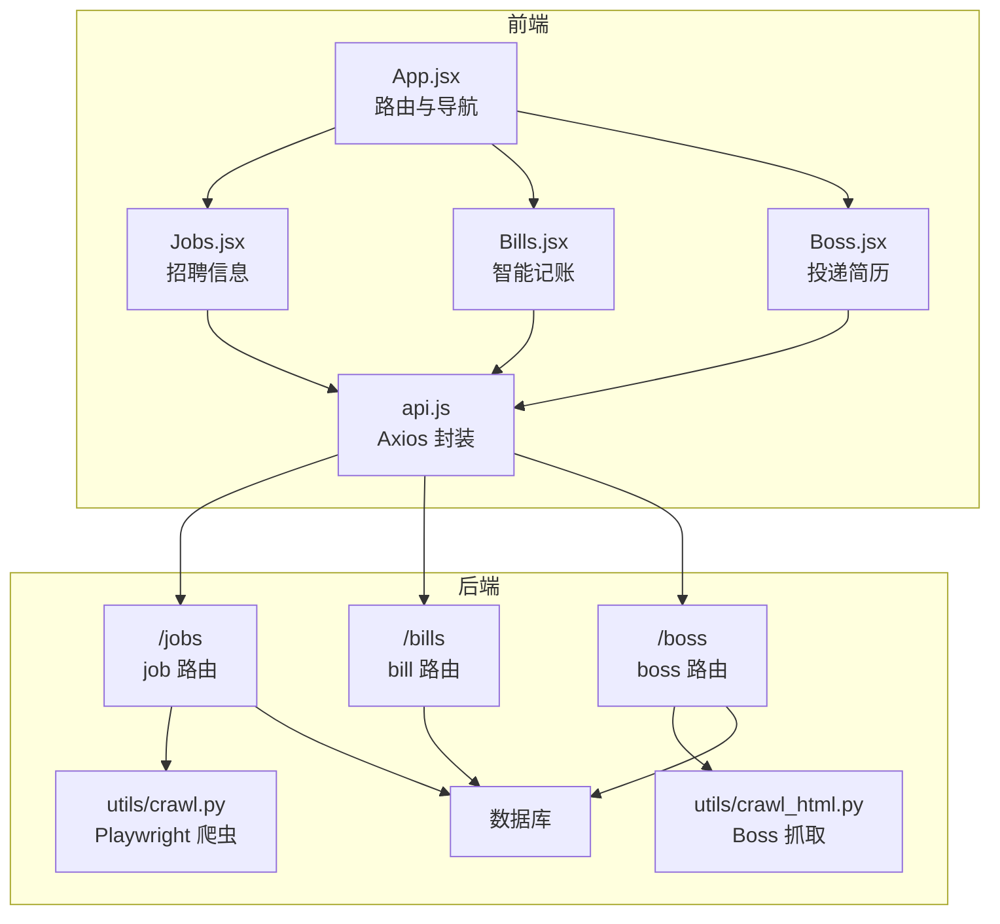
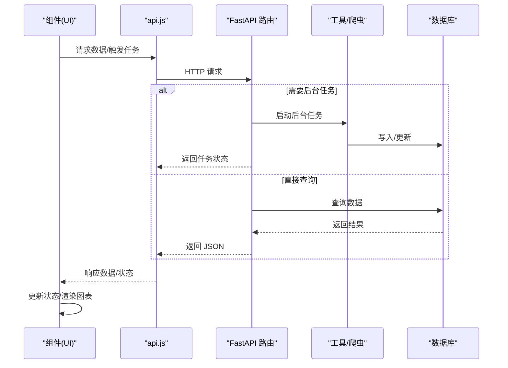
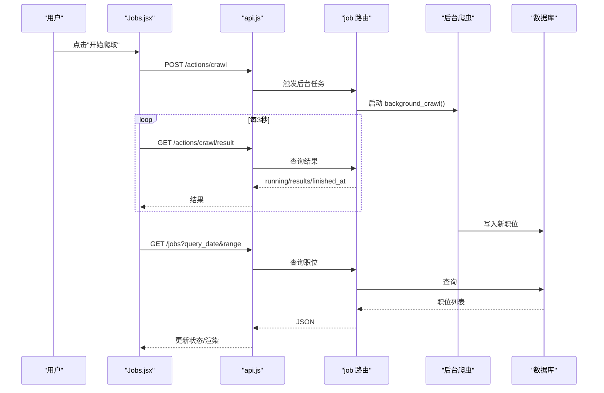
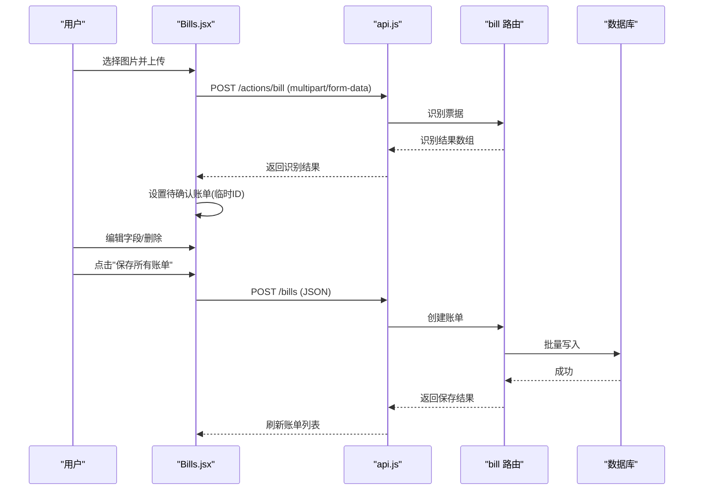
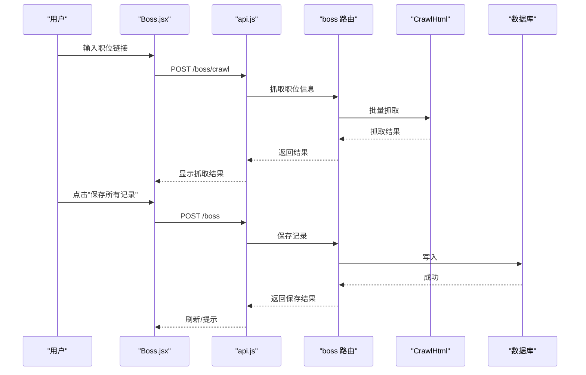
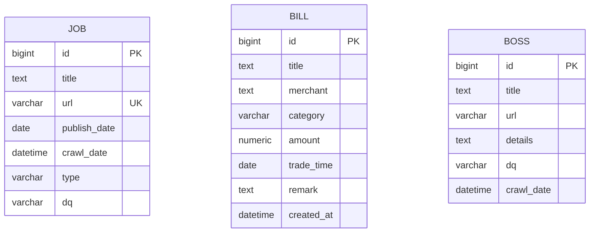
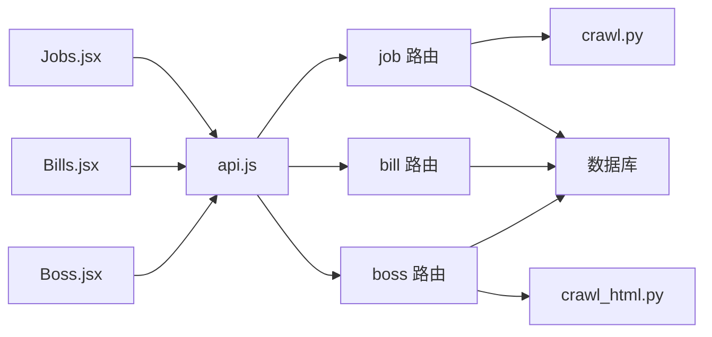

# 功能特性组件

<cite>
**本文引用的文件**
- [Jobs.jsx](file://blog_frontend/src/components/Jobs.jsx)
- [Bills.jsx](file://blog_frontend/src/components/Bills.jsx)
- [Boss.jsx](file://blog_frontend/src/components/Boss.jsx)
- [App.jsx](file://blog_frontend/src/App.jsx)
- [api.js](file://blog_frontend/src/api.js)
- [crawl.py](file://blog_backend/utils/crawl.py)
- [crawl_html.py](file://blog_backend/utils/crawl_html.py)
- [job.py](file://blog_backend/models/job.py)
- [bill.py](file://blog_backend/models/bill.py)
- [job 路由](file://blog_backend/routers/job.py)
- [bill 路由](file://blog_backend/routers/bill.py)
- [boss 路由](file://blog_backend/routers/boss.py)
- [targets.txt](file://blog_backend/targets.txt)
</cite>

## 更新摘要
**变更内容**
- 新增了异步爬取结果轮询功能，包括轮询定时器管理和状态反馈机制
- 增加了详细的爬取结果展示面板，提供来源、状态、新增数量等信息
- 改进了用户交互体验，增强了状态反馈和错误处理
- 优化了组件的实时更新策略和性能表现

## 目录
1. [简介](#简介)
2. [项目结构](#项目结构)
3. [核心组件](#核心组件)
4. [架构总览](#架构总览)
5. [组件详解](#组件详解)
6. [依赖关系分析](#依赖关系分析)
7. [性能考量](#性能考量)
8. [故障排查指南](#故障排查指南)
9. [结论](#结论)
10. [附录](#附录)

## 简介
本文件聚焦于三个功能特性组件：招聘信息、智能记账与投递简历（Boss）。文档从系统架构、组件职责、数据流与处理逻辑、事件与状态管理、图表可视化、数据筛选与分页、爬虫与数据处理机制、性能优化与用户体验建议等方面进行深入说明，并提供可视化图示帮助理解。

**更新** 本次更新重点反映了前端组件新增的异步爬取结果轮询功能和详细的爬取结果展示面板，显著改进了用户交互体验和状态反馈机制。

## 项目结构
前端采用 React + Vite，通过 axios 封装统一 API；后端基于 FastAPI，提供招聘信息、账单与投递记录的接口，并内置两类爬虫工具：用于招聘信息的 Playwright + BeautifulSoup 解析器，以及用于 Boss 抓取的 HTML 解析器。组件通过 API 层与后端交互，完成数据获取、筛选、图表渲染与持久化。

**图示来源**
- [App.jsx:55-76](file://blog_frontend/src/App.jsx#L55-L76)
- [Jobs.jsx:1-362](file://blog_frontend/src/components/Jobs.jsx#L1-L362)
- [Bills.jsx:1-539](file://blog_frontend/src/components/Bills.jsx#L1-L539)
- [Boss.jsx:1-145](file://blog_frontend/src/components/Boss.jsx#L1-L145)
- [api.js:1-40](file://blog_frontend/src/api.js#L1-L40)
- [job 路由:17-97](file://blog_backend/routers/job.py#L17-L97)
- [bill 路由:24-173](file://blog_backend/routers/bill.py#L24-L173)
- [boss 路由:16-134](file://blog_backend/routers/boss.py#L16-L134)
- [crawl.py:368-445](file://blog_backend/utils/crawl.py#L368-L445)
- [crawl_html.py:8-72](file://blog_backend/utils/crawl_html.py#L8-L72)

**章节来源**
- [App.jsx:15-76](file://blog_frontend/src/App.jsx#L15-L76)
- [api.js:1-40](file://blog_frontend/src/api.js#L1-L40)

## 核心组件
- 招聘信息组件（Jobs.jsx）：负责拉取并展示招聘信息，提供周/月维度筛选、图表可视化（ECharts）、爬虫触发与轮询结果展示、按日期筛选列表。**新增** 异步爬取结果轮询功能和详细的爬取结果展示面板。
- 智能记账组件（Bills.jsx）：负责账单查询与展示，提供周/月筛选、每日趋势柱状图与分类占比饼图切换、票据上传识别、待确认账单编辑与批量保存。
- 投递简历组件（Boss.jsx）：负责输入职位链接，抓取职位详情，展示抓取结果，支持删除单项与批量保存至数据库。

**章节来源**
- [Jobs.jsx:1-362](file://blog_frontend/src/components/Jobs.jsx#L1-L362)
- [Bills.jsx:1-539](file://blog_frontend/src/components/Bills.jsx#L1-L539)
- [Boss.jsx:1-145](file://blog_frontend/src/components/Boss.jsx#L1-L145)

## 架构总览
前端组件通过 api.js 封装的 axios 实例调用后端接口，后端路由根据参数（如查询日期、范围）对数据库进行筛选，部分路由支持后台任务或异步处理（如爬虫、票据识别）。ECharts 图表在前端渲染，组件内部通过 useMemo 计算图表配置，减少不必要的重绘。

**图示来源**
- [api.js:26-37](file://blog_frontend/src/api.js#L26-L37)
- [job 路由:81-97](file://blog_backend/routers/job.py#L81-L97)
- [bill 路由:24-51](file://blog_backend/routers/bill.py#L24-L51)
- [boss 路由:16-31](file://blog_backend/routers/boss.py#L16-L31)
- [crawl.py:368-445](file://blog_backend/utils/crawl.py#L368-L445)
- [crawl_html.py:18-72](file://blog_backend/utils/crawl_html.py#L18-L72)

## 组件详解

### 招聘信息组件（Jobs.jsx）
- 数据绑定与状态管理
  - 使用 useState 管理职位列表、加载状态、爬取状态、轮询定时器、日期范围、选中日期、错误信息与分页标志。
  - 使用 useEffect 在日期或范围变化时触发数据拉取。
  - **新增** 使用 useRef 管理轮询定时器实例，确保组件卸载时正确清理定时器。
- 数据获取与筛选
  - 通过 API 获取指定日期与范围内的职位列表，后端根据 query_date 与 range 计算起止日期并排序返回。
- 图表可视化
  - 使用 ECharts 渲染柱状图，按周/月生成日期轴与数值标签；支持点击图表选择具体日期并筛选列表。
  - 图表配置通过 useMemo 计算，避免每次渲染都重建配置。
- 爬虫触发与轮询
  - 触发后台爬虫任务，若任务已在运行则提示；否则启动轮询，每 3 秒查询一次结果，完成后刷新列表。
  - **新增** 详细的爬取结果展示面板，包含来源、状态、新增数量等信息，支持状态颜色标识和详细消息展示。
- 事件处理与实时更新
  - 图表点击事件设置选中日期；点击按钮切换周/月范围；错误信息集中展示。
  - **新增** 轮询定时器的生命周期管理，在组件卸载时自动清理定时器，防止内存泄漏。
- 性能与体验
  - 使用 useMemo 优化图表配置；列表过滤在内存中进行；图表缩放与标签在月度模式下适当调整以提升可读性。
  - **新增** 轮询状态的视觉反馈，包括按钮禁用状态和加载文本提示。

**图示来源**
- [Jobs.jsx:155-194](file://blog_frontend/src/components/Jobs.jsx#L155-L194)
- [api.js:27-28](file://blog_frontend/src/api.js#L27-L28)
- [job 路由:81-97](file://blog_backend/routers/job.py#L81-L97)
- [crawl.py:368-445](file://blog_backend/utils/crawl.py#L368-L445)

**章节来源**
- [Jobs.jsx:1-362](file://blog_frontend/src/components/Jobs.jsx#L1-L362)
- [job 路由:17-61](file://blog_backend/routers/job.py#L17-L61)
- [job 路由:81-97](file://blog_backend/routers/job.py#L81-L97)
- [crawl.py:368-445](file://blog_backend/utils/crawl.py#L368-L445)
- [targets.txt:1-5](file://blog_backend/targets.txt#L1-L5)

### 智能记账组件（Bills.jsx）
- 数据绑定与状态管理
  - 管理账单列表、加载状态、上传状态、错误信息、查询日期范围、选中日期、图表类型（柱状/饼图）、识别结果（待确认账单）。
  - 通过 useEffect 在查询日期或范围变化时拉取账单。
- 图表可视化
  - 柱状图：按周/月生成日期轴，统计每日总支出；支持点击选择日期并筛选列表。
  - 饼图：按周/月统计分类总支出，支持图例与高亮。
  - 图表配置同样通过 useMemo 计算。
- 票据上传与识别
  - 支持多图上传，使用 FormData 提交至 /actions/bill，后端在独立线程池中调用识别函数，返回识别结果。
  - 识别结果以临时 ID 存储在前端，允许编辑字段（标题、商户、分类、金额、备注）与删除。
- 保存与同步
  - 批量保存识别结果，移除临时字段后提交至 /bills，成功后清空待确认列表并刷新账单列表。
- 事件处理与实时更新
  - 编辑输入框即时更新；图表点击切换日期；日期范围与基准日期联动。

**图示来源**
- [Bills.jsx:222-284](file://blog_frontend/src/components/Bills.jsx#L222-L284)
- [api.js:29-37](file://blog_frontend/src/api.js#L29-L37)
- [bill 路由:24-51](file://blog_backend/routers/bill.py#L24-L51)
- [bill 路由:55-115](file://blog_backend/routers/bill.py#L55-L115)

**章节来源**
- [Bills.jsx:1-539](file://blog_frontend/src/components/Bills.jsx#L1-L539)
- [bill 路由:117-173](file://blog_backend/routers/bill.py#L117-L173)

### 投递简历组件（Boss.jsx）
- 数据绑定与状态管理
  - 管理链接输入、抓取结果列表、加载状态与错误信息。
- 抓取流程
  - 输入多行链接，调用 /boss/crawl，后端使用 CrawlHtml 对每个链接抓取标题、详情、地区与抓取时间。
- 保存与同步
  - 将抓取结果映射为后端模型，调用 /boss 保存，支持单条或多条保存。
- 事件处理
  - 删除单项、保存全部、禁用态控制与错误提示。

**图示来源**
- [Boss.jsx:11-56](file://blog_frontend/src/components/Boss.jsx#L11-L56)
- [api.js:36-37](file://blog_frontend/src/api.js#L36-L37)
- [boss 路由:16-31](file://blog_backend/routers/boss.py#L16-L31)
- [boss 路由:33-84](file://blog_backend/routers/boss.py#L33-L84)
- [crawl_html.py:18-72](file://blog_backend/utils/crawl_html.py#L18-L72)

**章节来源**
- [Boss.jsx:1-145](file://blog_frontend/src/components/Boss.jsx#L1-L145)
- [boss 路由:86-127](file://blog_backend/routers/boss.py#L86-L127)

### 数据模型与后端路由概览
- 招聘信息模型（Job）：包含标题、链接、发布日期、抓取日期、类型与地区。
- 账单模型（Bill）：包含标题、商户、分类、金额、交易时间与备注。
- 路由要点
  - /jobs：按日期范围查询职位列表，支持周/月区间。
  - /actions/crawl：触发后台爬虫任务，轮询结果接口返回运行状态与完成时间。
  - /actions/bill：上传图片识别票据，返回识别结果。
  - /bills：按日期范围查询账单，支持周/月区间。
  - /boss/crawl：抓取职位详情。
  - /boss：保存投递记录，支持单条/批量。

**图示来源**
- [job.py:5-15](file://blog_backend/models/job.py#L5-L15)
- [bill.py:7-17](file://blog_backend/models/bill.py#L7-L17)
- [job 路由:17-61](file://blog_backend/routers/job.py#L17-L61)
- [bill 路由:117-173](file://blog_backend/routers/bill.py#L117-L173)
- [boss 路由:86-127](file://blog_backend/routers/boss.py#L86-L127)

**章节来源**
- [job.py:1-15](file://blog_backend/models/job.py#L1-L15)
- [bill.py:1-24](file://blog_backend/models/bill.py#L1-L24)
- [job 路由:17-61](file://blog_backend/routers/job.py#L17-L61)
- [bill 路由:117-173](file://blog_backend/routers/bill.py#L117-L173)
- [boss 路由:86-127](file://blog_backend/routers/boss.py#L86-L127)

## 依赖关系分析
- 前端组件依赖 api.js 封装的 HTTP 客户端，统一注入鉴权头。
- 招聘信息与账单组件分别依赖各自路由的 GET/POST 接口；Boss 组件依赖抓取与保存接口。
- 后端路由依赖数据库会话与工具模块（爬虫与识别）。
- 招聘爬虫依赖 targets.txt 中的目标站点列表，按规则匹配解析器。

**图示来源**
- [Jobs.jsx:1-3](file://blog_frontend/src/components/Jobs.jsx#L1-L3)
- [Bills.jsx:1-3](file://blog_frontend/src/components/Bills.jsx#L1-L3)
- [Boss.jsx:1-3](file://blog_frontend/src/components/Boss.jsx#L1-L3)
- [api.js:1-40](file://blog_frontend/src/api.js#L1-L40)
- [job 路由:1-14](file://blog_backend/routers/job.py#L1-L14)
- [bill 路由:1-22](file://blog_backend/routers/bill.py#L1-L22)
- [boss 路由:1-13](file://blog_backend/routers/boss.py#L1-L13)
- [crawl.py:1-16](file://blog_backend/utils/crawl.py#L1-L16)
- [crawl_html.py:1-8](file://blog_backend/utils/crawl_html.py#L1-L8)

**章节来源**
- [api.js:1-40](file://blog_frontend/src/api.js#L1-L40)
- [job 路由:1-14](file://blog_backend/routers/job.py#L1-L14)
- [bill 路由:1-22](file://blog_backend/routers/bill.py#L1-L22)
- [boss 路由:1-13](file://blog_backend/routers/boss.py#L1-L13)

## 性能考量
- 图表渲染优化
  - 使用 useMemo 缓存图表配置，避免每次渲染都重新计算；在月度模式下减少标签显示以降低渲染压力。
- 数据筛选与渲染
  - 列表过滤在内存中进行，建议在数据量大时考虑服务端分页或虚拟滚动。
- 爬虫与识别
  - 爬虫与票据识别为耗时任务，采用后台任务与轮询；注意控制并发与超时，避免阻塞主线程。
  - **新增** 轮询定时器的生命周期管理，确保组件卸载时正确清理，防止内存泄漏。
- 网络与缓存
  - 统一鉴权头由 axios 拦截器注入，减少重复代码；建议在高频查询场景增加本地缓存与防抖。
- 用户体验
  - 加载态与错误态明确反馈；图表缩放与交互增强可读性；上传识别支持多图与批量保存。
  - **新增** 轮询状态的视觉反馈，包括按钮禁用状态和加载文本提示，提升用户体验。

## 故障排查指南
- 招聘信息
  - 若提示"爬虫任务正在运行"，等待轮询结束后再试；检查后端日志与 targets.txt 是否正确。
  - **新增** 如果轮询面板不显示结果，检查轮询定时器是否正确创建和清理。
- 智能记账
  - 票据识别失败时检查图片格式与清晰度；确认后端识别函数可用；查看返回的错误项以便前端提示。
- 投递简历
  - 抓取失败时检查链接有效性与网络；保存冲突时检查是否存在重复链接。
- 通用
  - 检查鉴权头是否正确注入；确认路由路径与参数（query_date、range）是否符合后端要求。

**章节来源**
- [Jobs.jsx:155-194](file://blog_frontend/src/components/Jobs.jsx#L155-L194)
- [Bills.jsx:222-284](file://blog_frontend/src/components/Bills.jsx#L222-L284)
- [Boss.jsx:11-56](file://blog_frontend/src/components/Boss.jsx#L11-L56)
- [job 路由:81-97](file://blog_backend/routers/job.py#L81-L97)
- [bill 路由:24-51](file://blog_backend/routers/bill.py#L24-L51)
- [boss 路由:16-31](file://blog_backend/routers/boss.py#L16-L31)

## 结论
本文档梳理了招聘信息、智能记账与投递简历三大功能组件的实现思路与交互流程，明确了前端状态管理、图表渲染、事件处理与后端爬虫/识别机制的关系。通过合理的数据绑定、筛选与轮询策略，组件实现了良好的实时性与可维护性。

**更新** 本次更新重点反映了新增的异步爬取结果轮询功能和详细的爬取结果展示面板，显著提升了用户交互体验和状态反馈机制。建议在后续迭代中引入服务端分页、本地缓存与更细粒度的错误处理，持续优化性能与用户体验。

## 附录
- 组件入口与导航
  - 应用通过路由挂载各组件，提供统一导航与登录状态管理。
- 关键 API
  - 招聘：GET /jobs、POST /actions/crawl、GET /actions/crawl/result
  - 记账：POST /actions/bill、POST /bills、GET /bills
  - Boss：POST /boss/crawl、POST /boss、GET /boss

**章节来源**
- [App.jsx:55-76](file://blog_frontend/src/App.jsx#L55-L76)
- [api.js:26-37](file://blog_frontend/src/api.js#L26-L37)