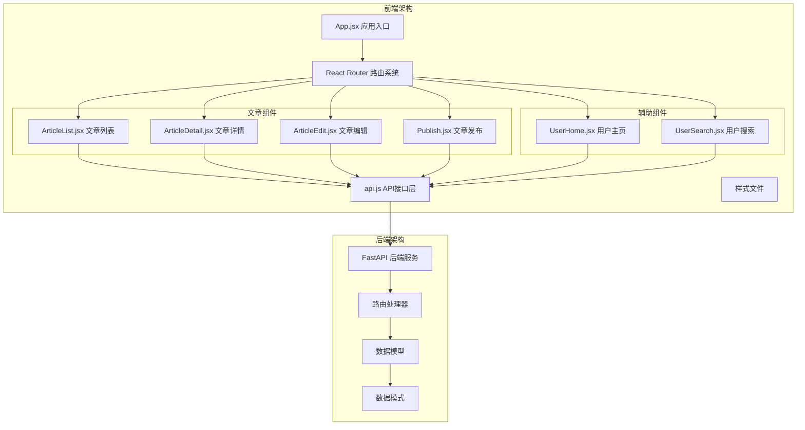
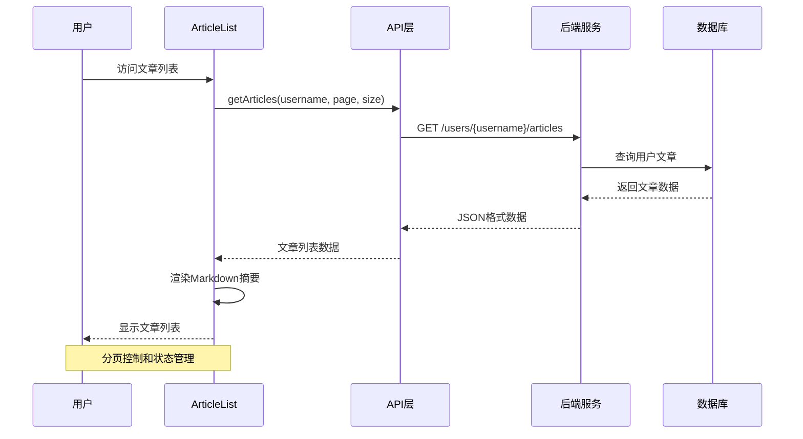
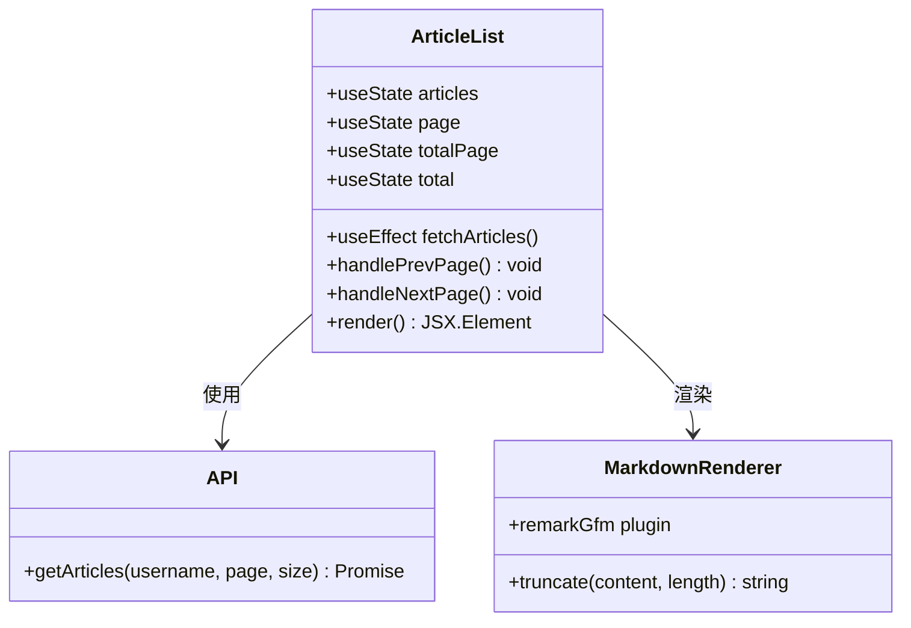
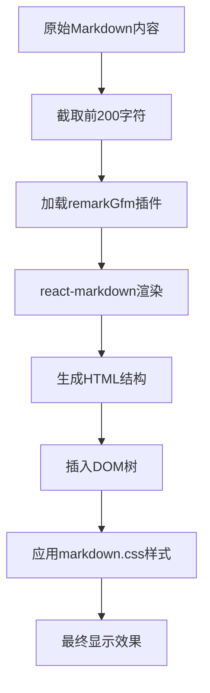
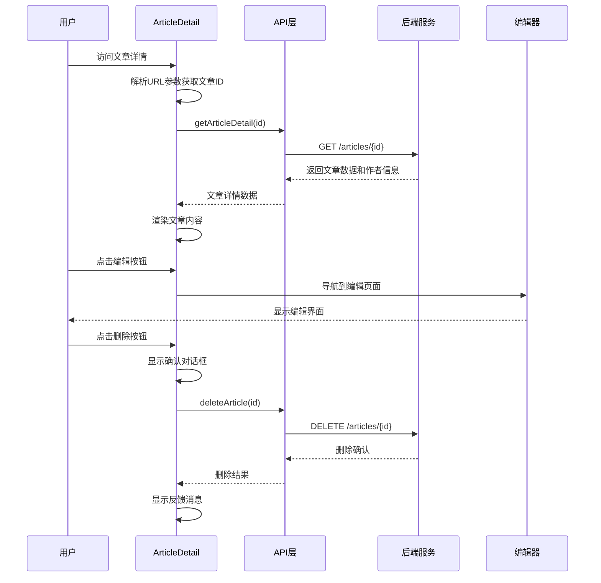
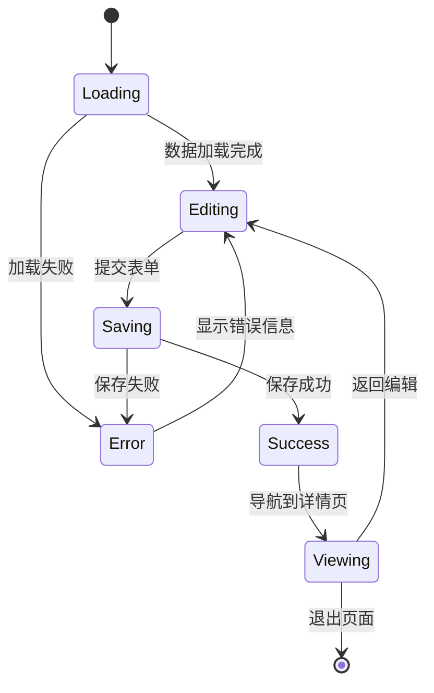
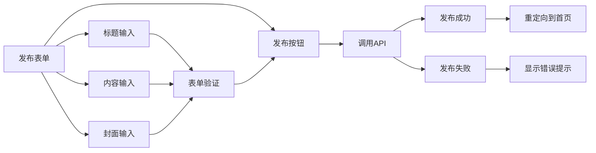
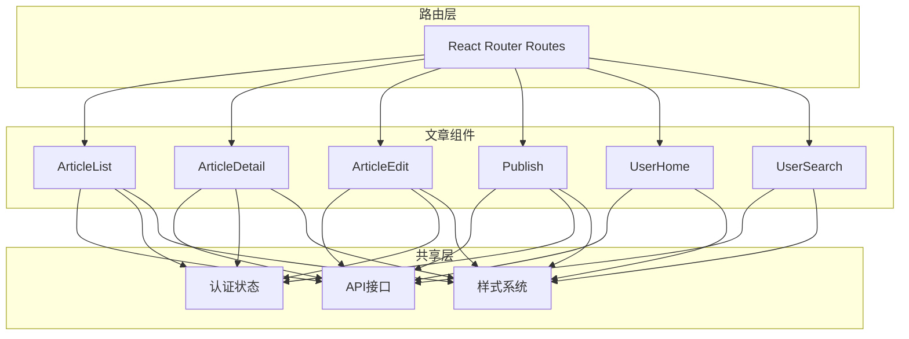

# 文章组件

<cite>
**本文档引用的文件**
- [ArticleList.jsx](file://blog_frontend/src/components/ArticleList.jsx)
- [ArticleDetail.jsx](file://blog_frontend/src/components/ArticleDetail.jsx)
- [ArticleEdit.jsx](file://blog_frontend/src/components/ArticleEdit.jsx)
- [Publish.jsx](file://blog_frontend/src/components/Publish.jsx)
- [UserHome.jsx](file://blog_frontend/src/components/UserHome.jsx)
- [UserSearch.jsx](file://blog_frontend/src/components/UserSearch.jsx)
- [App.jsx](file://blog_frontend/src/App.jsx)
- [api.js](file://blog_frontend/src/api.js)
- [markdown.css](file://blog_frontend/src/markdown.css)
- [index.css](file://blog_frontend/src/index.css)
- [package.json](file://blog_frontend/package.json)
- [article.py](file://blog_backend/routers/article.py)
- [models/article.py](file://blog_backend/models/article.py)
- [schemas/article.py](file://blog_backend/schemas/article.py)
</cite>

## 目录
1. [简介](#简介)
2. [项目结构](#项目结构)
3. [核心组件](#核心组件)
4. [架构概览](#架构概览)
5. [详细组件分析](#详细组件分析)
6. [依赖关系分析](#依赖关系分析)
7. [性能考虑](#性能考虑)
8. [故障排除指南](#故障排除指南)
9. [结论](#结论)
10. [附录](#附录)

## 简介

本文档详细介绍了博客系统中的文章相关UI组件，包括文章列表、文章详情、文章编辑和文章发布等核心功能模块。文档深入分析了组件的分页实现机制、Markdown渲染技术、文章摘要显示逻辑、内容展示策略、阅读量统计、路由参数处理以及表单验证机制。同时涵盖了组件状态管理策略、API数据交互模式、错误处理方案，并提供了样式定制、响应式设计和用户体验优化建议。

## 项目结构

博客前端采用React + Vite构建，后端使用FastAPI框架，整体架构遵循前后端分离的设计原则。文章组件位于前端src/components目录下，通过统一的API接口与后端进行数据交互。



**图表来源**
- [App.jsx:55-79](file://blog_frontend/src/App.jsx#L55-L79)
- [api.js:1-40](file://blog_frontend/src/api.js#L1-L40)

**章节来源**
- [App.jsx:1-79](file://blog_frontend/src/App.jsx#L1-L79)
- [package.json:1-28](file://blog_frontend/package.json#L1-L28)

## 核心组件

### 组件概览

系统包含四个主要的文章相关组件，每个组件都有明确的功能职责和状态管理策略：

1. **ArticleList**: 用户个人文章列表展示，支持分页和Markdown摘要渲染
2. **ArticleDetail**: 文章详情展示，包含编辑和删除功能
3. **ArticleEdit**: 文章编辑界面，支持实时内容更新
4. **Publish**: 新文章发布功能，提供基础表单输入

### 技术栈分析

前端使用现代React技术栈，包括：
- **React 18.2.0**: 核心框架，支持函数组件和Hooks
- **React Router DOM 6.22.1**: 客户端路由管理
- **Axios 1.6.7**: HTTP客户端库
- **React Markdown 9.0.1**: Markdown渲染引擎
- **Remark GFM 4.0.0**: GitHub Flavored Markdown插件

**章节来源**
- [package.json:11-20](file://blog_frontend/package.json#L11-L20)

## 架构概览

文章组件采用分层架构设计，从上到下分为表现层、业务逻辑层、数据访问层和API接口层。



**图表来源**
- [ArticleList.jsx:14-25](file://blog_frontend/src/components/ArticleList.jsx#L14-L25)
- [api.js:18-19](file://blog_frontend/src/api.js#L18-L19)
- [article.py:29-43](file://blog_backend/routers/article.py#L29-L43)

## 详细组件分析

### 文章列表组件 (ArticleList)

#### 功能特性

ArticleList组件实现了完整的用户个人文章管理功能，包括分页浏览、Markdown内容摘要渲染和阅读量统计。



**图表来源**
- [ArticleList.jsx:7-77](file://blog_frontend/src/components/ArticleList.jsx#L7-L77)
- [api.js:18-19](file://blog_frontend/src/api.js#L18-L19)

#### 分页实现机制

组件采用客户端分页策略，通过URL参数控制当前页码：

```mermaid
flowchart TD
Start([组件初始化]) --> CheckUser{检查用户登录}
CheckUser --> |未登录| ShowLogin[显示登录提示]
CheckUser --> |已登录| FetchData[获取文章数据]
FetchData --> SetParams[设置请求参数<br/>username, page, size]
SetParams --> APICall[调用API.getArticles]
APICall --> ParseResponse{解析响应数据}
ParseResponse --> |成功| UpdateState[更新状态<br/>articles, total, totalPage]
ParseResponse --> |失败| LogError[记录错误日志]
UpdateState --> RenderList[渲染文章列表]
RenderList --> CheckPagination{检查分页状态}
CheckPagination --> |有更多页面| EnablePagination[启用分页控件]
CheckPagination --> |无更多页面| DisablePagination[禁用分页控件]
EnablePagination --> WaitAction[等待用户操作]
DisablePagination --> WaitAction
WaitAction --> PrevPage{点击上一页?}
WaitAction --> NextPage{点击下一页?}
WaitAction --> NoAction{无操作}
PrevPage --> UpdatePage1[page = max(1, page-1)]
NextPage --> UpdatePage2[page = min(totalPage, page+1)]
NoAction --> WaitAction
UpdatePage1 --> FetchData
UpdatePage2 --> FetchData
LogError --> WaitAction
```

**图表来源**
- [ArticleList.jsx:14-25](file://blog_frontend/src/components/ArticleList.jsx#L14-L25)
- [ArticleList.jsx:38-51](file://blog_frontend/src/components/ArticleList.jsx#L38-L51)

#### Markdown渲染机制

组件使用react-markdown库实现Markdown内容渲染，支持GitHub Flavored Markdown语法：



**图表来源**
- [ArticleList.jsx:65-67](file://blog_frontend/src/components/ArticleList.jsx#L65-L67)
- [markdown.css:1-103](file://blog_frontend/src/markdown.css#L1-L103)

#### 文章摘要显示逻辑

摘要显示采用截断策略，确保列表展示的简洁性和性能：

1. **内容截断**: 将原始内容截取前200个字符
2. **Markdown解析**: 对截断后的Markdown进行解析
3. **溢出控制**: 设置最大高度100px并隐藏溢出内容
4. **性能优化**: 避免渲染完整文章内容

**章节来源**
- [ArticleList.jsx:14-25](file://blog_frontend/src/components/ArticleList.jsx#L14-L25)
- [ArticleList.jsx:65-67](file://blog_frontend/src/components/ArticleList.jsx#L65-L67)

### 文章详情组件 (ArticleDetail)

#### 内容展示架构

ArticleDetail组件提供完整的文章详情展示功能，包括作者信息、发布时间、阅读量统计和富文本内容渲染。



**图表来源**
- [ArticleDetail.jsx:9-18](file://blog_frontend/src/components/ArticleDetail.jsx#L9-L18)
- [ArticleDetail.jsx:20-31](file://blog_frontend/src/components/ArticleDetail.jsx#L20-L31)
- [api.js:20-24](file://blog_frontend/src/api.js#L20-L24)

#### 内容展示策略

详情页采用响应式布局设计，适配不同屏幕尺寸：

1. **头部布局**: 采用flexbox布局，支持响应式换行
2. **内容渲染**: 使用完整的Markdown渲染，不进行内容截断
3. **媒体支持**: 支持图片展示和代码块高亮
4. **元数据展示**: 显示作者、阅读量、发布时间等信息

#### 阅读量统计

组件通过后端API获取文章的view_count字段，实现阅读量的实时显示。后端模型中定义了view_count字段，默认值为0。

**章节来源**
- [ArticleDetail.jsx:37-56](file://blog_frontend/src/components/ArticleDetail.jsx#L37-L56)
- [models/article.py:25](file://blog_backend/models/article.py#L25)

### 文章编辑组件 (ArticleEdit)

#### 富文本编辑器集成

ArticleEdit组件提供基础的富文本编辑功能，支持标题、内容和封面图片的编辑。



**图表来源**
- [ArticleEdit.jsx:13-27](file://blog_frontend/src/components/ArticleEdit.jsx#L13-L27)
- [ArticleEdit.jsx:29-39](file://blog_frontend/src/components/ArticleEdit.jsx#L29-L39)

#### 表单验证机制

组件采用HTML5原生表单验证和JavaScript双重验证：

1. **必填字段**: 标题和内容字段标记为required
2. **异步验证**: 提交时进行网络请求验证
3. **错误处理**: 统一的错误捕获和用户反馈

#### 内容预览

编辑组件支持实时内容预览，用户可以在编辑过程中查看Markdown渲染效果。

**章节来源**
- [ArticleEdit.jsx:29-39](file://blog_frontend/src/components/ArticleEdit.jsx#L29-L39)
- [ArticleEdit.jsx:46-69](file://blog_frontend/src/components/ArticleEdit.jsx#L46-L69)

### 文章发布组件 (Publish)

#### 表单设计

Publish组件提供简洁的文章发布界面，专注于核心功能：



**图表来源**
- [Publish.jsx:25-49](file://blog_frontend/src/components/Publish.jsx#L25-L49)

#### API数据交互

组件通过publishArticle API实现文章发布功能，支持封面图片的可选上传。

**章节来源**
- [Publish.jsx:11-20](file://blog_frontend/src/components/Publish.jsx#L11-L20)
- [api.js:21](file://blog_frontend/src/api.js#L21)

## 依赖关系分析

### 组件间依赖关系



**图表来源**
- [App.jsx:60-72](file://blog_frontend/src/App.jsx#L60-L72)
- [api.js:1-40](file://blog_frontend/src/api.js#L1-L40)

### 外部依赖分析

组件依赖的关键外部库：

1. **React Ecosystem**: 函数组件、Hooks、Context API
2. **HTTP Client**: Axios用于API通信
3. **Markdown Rendering**: react-markdown + remark-gfm
4. **Routing**: React Router DOM用于客户端路由
5. **Styling**: CSS Modules和全局样式

**章节来源**
- [package.json:11-20](file://blog_frontend/package.json#L11-L20)

## 性能考虑

### 渲染优化策略

1. **虚拟化列表**: 对于大量文章的场景，可以考虑实现虚拟化列表
2. **懒加载**: 图片和内容的懒加载机制
3. **缓存策略**: API响应缓存和本地存储
4. **防抖节流**: 搜索和分页操作的防抖处理

### 网络优化

1. **请求合并**: 批量获取相关数据
2. **CDN加速**: 静态资源和图片的CDN部署
3. **压缩传输**: Gzip压缩和HTTP/2优化
4. **连接复用**: HTTP连接池管理

### 内存管理

1. **状态清理**: 组件卸载时清理定时器和事件监听器
2. **引用优化**: 避免不必要的对象创建
3. **垃圾回收**: 及时释放大对象引用

## 故障排除指南

### 常见问题及解决方案

#### 登录状态问题
- **症状**: 文章列表显示"请登录"
- **原因**: localStorage中缺少token或username
- **解决**: 检查登录流程和localStorage存储

#### API调用失败
- **症状**: 控制台出现Network Error
- **原因**: CORS配置或后端服务不可用
- **解决**: 检查代理配置和后端服务状态

#### Markdown渲染异常
- **症状**: 特殊符号显示异常
- **原因**: Markdown语法错误
- **解决**: 检查内容格式和插件配置

#### 分页数据不一致
- **症状**: 页面切换后数据不更新
- **原因**: useEffect依赖数组配置错误
- **解决**: 确保依赖数组包含所有相关变量

**章节来源**
- [ArticleList.jsx:27-29](file://blog_frontend/src/components/ArticleList.jsx#L27-L29)
- [ArticleDetail.jsx:14-18](file://blog_frontend/src/components/ArticleDetail.jsx#L14-L18)

## 结论

文章组件系统展现了现代React应用的最佳实践，包括：

1. **清晰的架构设计**: 分层架构确保了代码的可维护性
2. **完善的错误处理**: 全面的错误捕获和用户反馈机制
3. **优秀的用户体验**: 响应式设计和流畅的交互体验
4. **高效的性能表现**: 合理的状态管理和渲染优化

系统在Markdown渲染、分页处理、路由管理等方面都体现了专业的开发水准，为后续的功能扩展奠定了良好的基础。

## 附录

### 样式定制指南

#### 主题定制
- **颜色系统**: 修改CSS变量定义主题色
- **字体系统**: 调整字体族和字号规范
- **间距系统**: 统一的间距和边距规范

#### 响应式设计
- **断点设置**: 移动端优先的设计策略
- **弹性布局**: Flexbox和Grid的合理使用
- **触摸优化**: 触摸目标的大小和间距

#### 可访问性优化
- **语义化HTML**: 正确的HTML标签使用
- **键盘导航**: 完整的键盘操作支持
- **屏幕阅读器**: ARIA标签和语义化描述

### API接口规范

#### 请求格式
- **Content-Type**: application/json
- **Authorization**: Bearer token
- **参数传递**: URL参数和请求体结合

#### 响应格式
- **标准结构**: {status, message, data}
- **错误处理**: HTTP状态码和错误信息
- **分页格式**: {items, total, page, hasMore}

### 开发最佳实践

#### 代码组织
- **组件拆分**: 单一职责原则
- **状态管理**: 合理的状态提升和局部状态
- **副作用处理**: useEffect的正确使用

#### 测试策略
- **单元测试**: 组件功能和逻辑测试
- **集成测试**: API接口和数据流测试
- **端到端测试**: 用户流程和用户体验测试