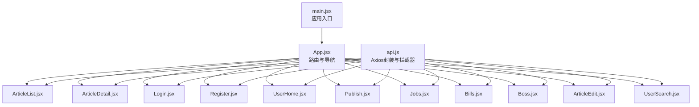
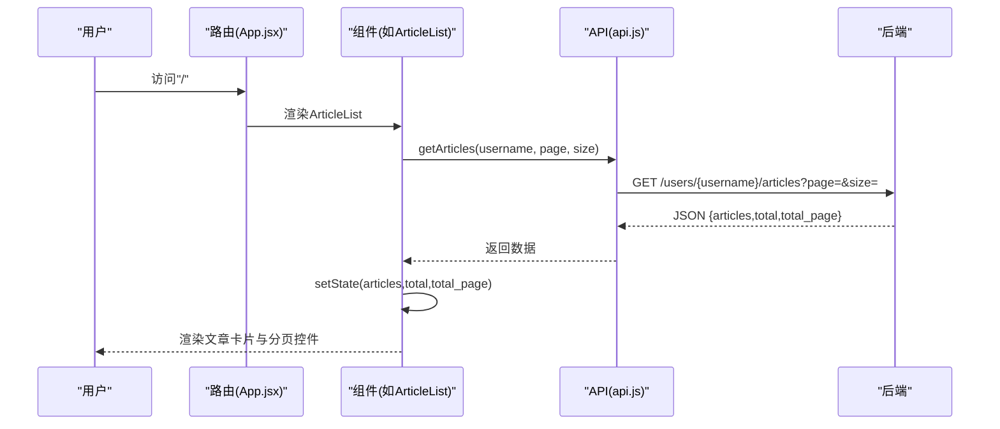
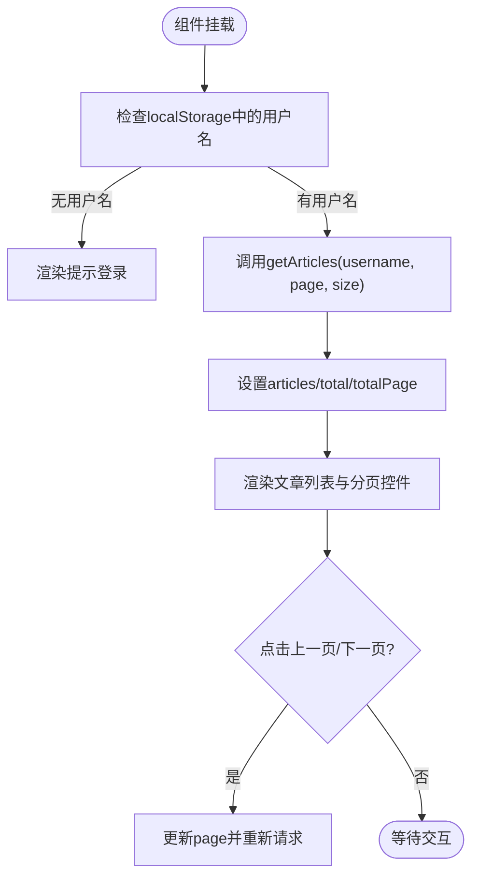
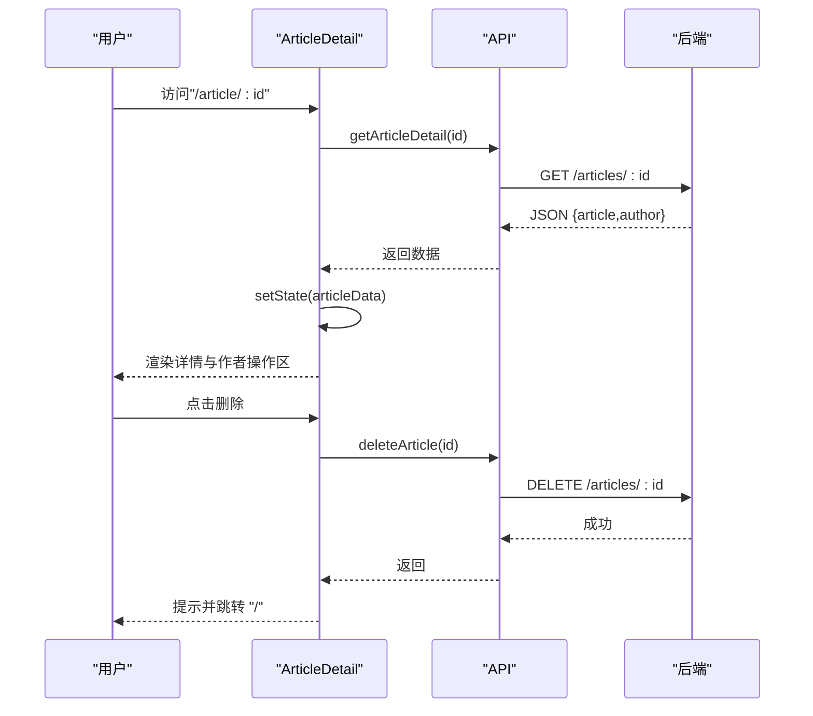
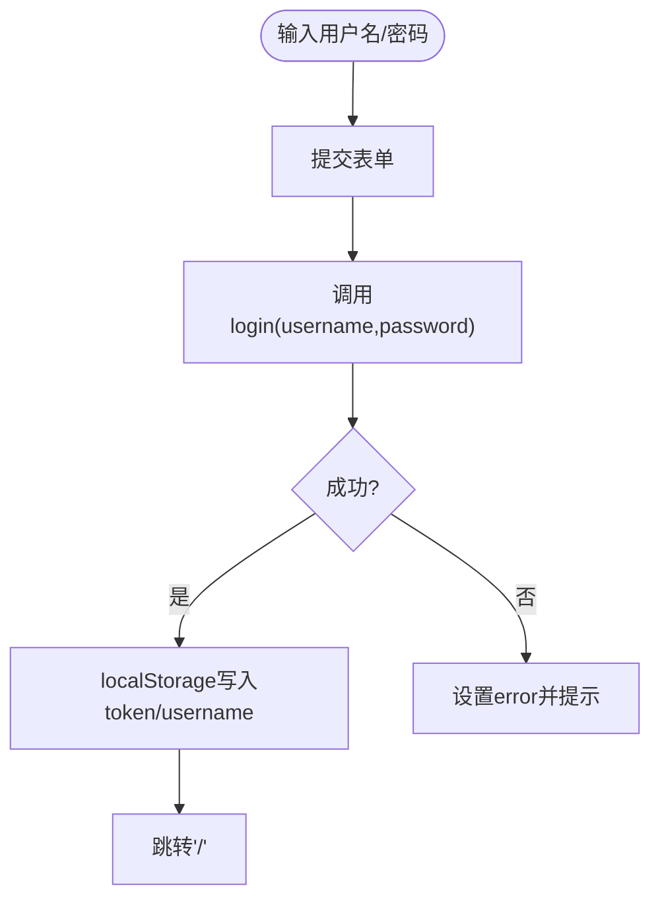
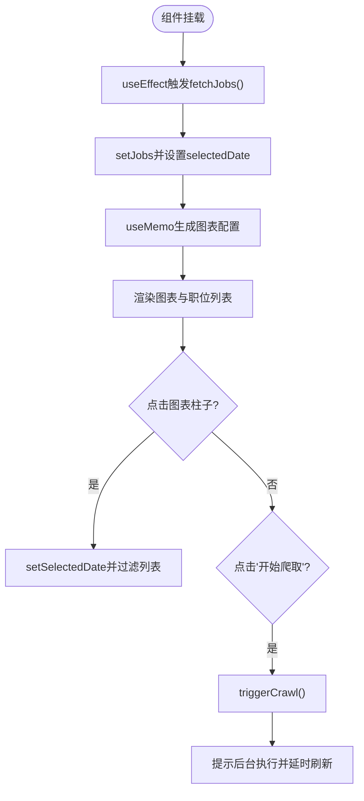
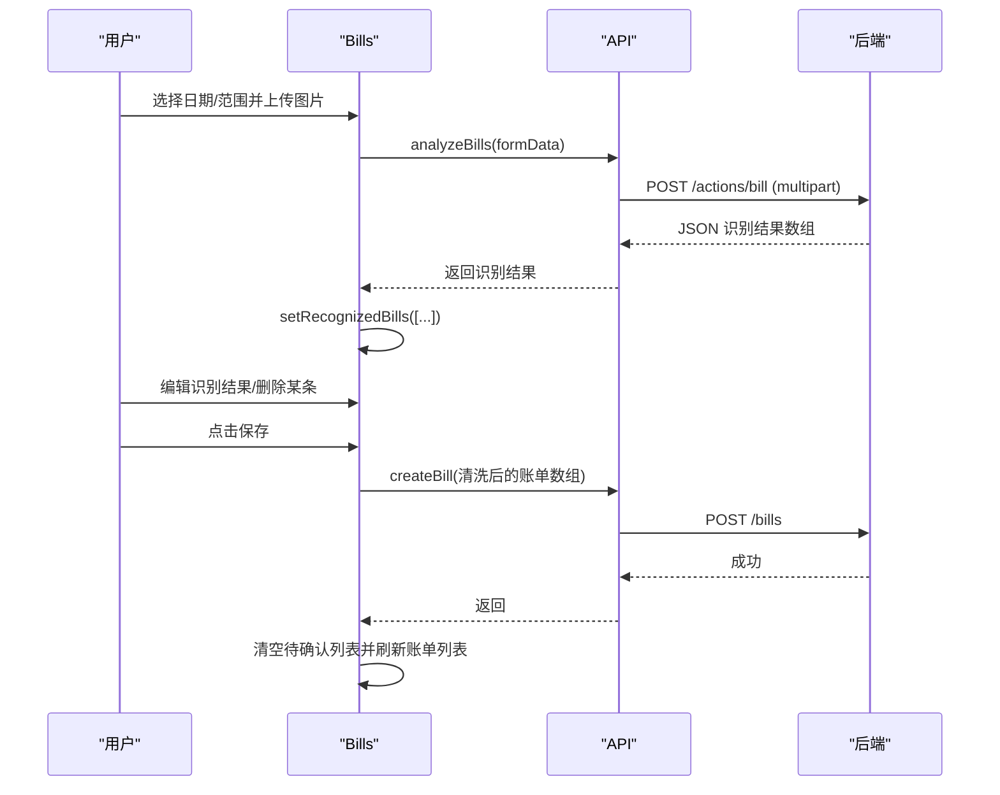
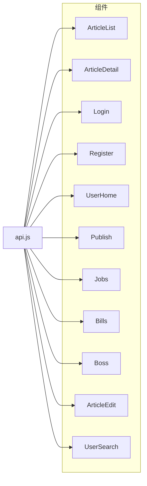

# 核心组件

<cite>
**本文引用的文件**
- [blog_frontend/src/App.jsx](file://blog_frontend/src/App.jsx)
- [blog_frontend/src/api.js](file://blog_frontend/src/api.js)
- [blog_frontend/src/main.jsx](file://blog_frontend/src/main.jsx)
- [blog_frontend/src/index.css](file://blog_frontend/src/index.css)
- [blog_frontend/src/markdown.css](file://blog_frontend/src/markdown.css)
- [blog_frontend/src/components/ArticleList.jsx](file://blog_frontend/src/components/ArticleList.jsx)
- [blog_frontend/src/components/ArticleDetail.jsx](file://blog_frontend/src/components/ArticleDetail.jsx)
- [blog_frontend/src/components/Login.jsx](file://blog_frontend/src/components/Login.jsx)
- [blog_frontend/src/components/Register.jsx](file://blog_frontend/src/components/Register.jsx)
- [blog_frontend/src/components/UserHome.jsx](file://blog_frontend/src/components/UserHome.jsx)
- [blog_frontend/src/components/Publish.jsx](file://blog_frontend/src/components/Publish.jsx)
- [blog_frontend/src/components/Jobs.jsx](file://blog_frontend/src/components/Jobs.jsx)
- [blog_frontend/src/components/Bills.jsx](file://blog_frontend/src/components/Bills.jsx)
- [blog_frontend/src/components/Boss.jsx](file://blog_frontend/src/components/Boss.jsx)
- [blog_frontend/src/components/ArticleEdit.jsx](file://blog_frontend/src/components/ArticleEdit.jsx)
- [blog_frontend/src/components/UserSearch.jsx](file://blog_frontend/src/components/UserSearch.jsx)
</cite>

## 目录
1. [简介](#简介)
2. [项目结构](#项目结构)
3. [核心组件](#核心组件)
4. [架构总览](#架构总览)
5. [组件详解](#组件详解)
6. [依赖关系分析](#依赖关系分析)
7. [性能与体验优化](#性能与体验优化)
8. [故障排查指南](#故障排查指南)
9. [结论](#结论)
10. [附录](#附录)

## 简介
本文件系统性梳理前端核心UI组件，覆盖文章列表、文章详情、用户登录、注册、用户主页、文章发布、招聘信息、智能记账与求职管理等模块。文档从架构、数据流、状态管理、生命周期、交互模式、样式与响应式设计、性能与可维护性等方面进行深入解析，并提供组件复用与扩展建议。

## 项目结构
前端采用Vite构建，路由基于React Router v6，组件集中在src/components目录，全局样式位于src/index.css，Markdown渲染样式位于src/markdown.css，API封装在src/api.js中，入口文件为src/main.jsx。

**图表来源**
- [blog_frontend/src/main.jsx:1-9](file://blog_frontend/src/main.jsx#L1-L9)
- [blog_frontend/src/App.jsx:1-79](file://blog_frontend/src/App.jsx#L1-L79)
- [blog_frontend/src/api.js:1-39](file://blog_frontend/src/api.js#L1-L39)

**章节来源**
- [blog_frontend/src/main.jsx:1-9](file://blog_frontend/src/main.jsx#L1-L9)
- [blog_frontend/src/App.jsx:1-79](file://blog_frontend/src/App.jsx#L1-L79)
- [blog_frontend/src/api.js:1-39](file://blog_frontend/src/api.js#L1-L39)

## 核心组件
- 文章列表组件：分页展示当前用户的已发布文章，支持上一页/下一页导航与Markdown摘要渲染。
- 文章详情组件：展示文章正文、封面、作者与阅读量；仅作者本人可见编辑与删除入口。
- 用户登录组件：表单提交用户名/密码，成功后写入本地token与用户名并跳转首页。
- 注册组件：表单提交用户名/密码/头像，注册成功后跳转登录页。
- 用户主页组件：按用户ID展示其头像、加入时间与文章列表，支持分页与日期范围筛选。
- 文章发布组件：表单提交标题/内容/封面，发布成功后返回列表页。
- 招聘信息组件：拉取职位数据，支持周/月维度统计图表与职位明细，支持触发爬虫。
- 智能记账组件：上传票据图片识别账单，支持编辑识别结果并批量保存，支持每日趋势与分类占比图表。
- 求职管理组件：批量抓取Boss直聘职位信息，支持预览与保存。

**章节来源**
- [blog_frontend/src/components/ArticleList.jsx:1-77](file://blog_frontend/src/components/ArticleList.jsx#L1-L77)
- [blog_frontend/src/components/ArticleDetail.jsx:1-60](file://blog_frontend/src/components/ArticleDetail.jsx#L1-L60)
- [blog_frontend/src/components/Login.jsx:1-47](file://blog_frontend/src/components/Login.jsx#L1-L47)
- [blog_frontend/src/components/Register.jsx:1-52](file://blog_frontend/src/components/Register.jsx#L1-L52)
- [blog_frontend/src/components/UserHome.jsx:1-129](file://blog_frontend/src/components/UserHome.jsx#L1-L129)
- [blog_frontend/src/components/Publish.jsx:1-53](file://blog_frontend/src/components/Publish.jsx#L1-L53)
- [blog_frontend/src/components/Jobs.jsx:1-293](file://blog_frontend/src/components/Jobs.jsx#L1-L293)
- [blog_frontend/src/components/Bills.jsx:1-539](file://blog_frontend/src/components/Bills.jsx#L1-L539)
- [blog_frontend/src/components/Boss.jsx:1-145](file://blog_frontend/src/components/Boss.jsx#L1-L145)

## 架构总览
- 路由层：App.jsx集中声明路由与导航，区分匿名与登录态用户可见区域。
- 组件层：各功能页面组件独立，共享通用样式与Markdown渲染能力。
- 数据层：api.js统一封装HTTP请求与鉴权拦截器，组件通过API函数发起网络请求。
- 状态层：组件内使用useState/useEffect管理本地状态与副作用，部分复杂组件使用useMemo缓存计算结果。

**图表来源**
- [blog_frontend/src/App.jsx:55-76](file://blog_frontend/src/App.jsx#L55-L76)
- [blog_frontend/src/components/ArticleList.jsx:14-25](file://blog_frontend/src/components/ArticleList.jsx#L14-L25)
- [blog_frontend/src/api.js:18-19](file://blog_frontend/src/api.js#L18-L19)

**章节来源**
- [blog_frontend/src/App.jsx:15-76](file://blog_frontend/src/App.jsx#L15-L76)
- [blog_frontend/src/api.js:7-14](file://blog_frontend/src/api.js#L7-L14)

## 组件详解

### 文章列表组件 ArticleList
- 功能要点
  - 读取localStorage中的用户名，作为查询参数调用后端获取文章列表。
  - 支持分页：上一页/下一页按钮与页码提示，禁用状态随当前页与总页数变化。
  - 使用Markdown渲染摘要内容，限制长度并隐藏溢出。
- 状态与生命周期
  - 状态：articles、page、totalPage、total、username。
  - 生命周期：useEffect在username与page变化时触发请求；若未登录则提示登录。
- 交互与数据流
  - 用户点击分页按钮更新page，组件重新请求并更新状态。
  - 文章卡片包含标题与阅读量，点击进入详情页。
- 样式与响应式
  - 使用flex布局与gap控制间距，适配小屏换行。
  - 卡片样式来自全局类名.card。
- 可扩展点
  - 支持排序字段、搜索关键词、标签筛选。
  - 引入虚拟列表优化长列表性能。

**图表来源**
- [blog_frontend/src/components/ArticleList.jsx:7-25](file://blog_frontend/src/components/ArticleList.jsx#L7-L25)
- [blog_frontend/src/components/ArticleList.jsx:38-51](file://blog_frontend/src/components/ArticleList.jsx#L38-L51)

**章节来源**
- [blog_frontend/src/components/ArticleList.jsx:1-77](file://blog_frontend/src/components/ArticleList.jsx#L1-L77)
- [blog_frontend/src/index.css:57-65](file://blog_frontend/src/index.css#L57-L65)

### 文章详情组件 ArticleDetail
- 功能要点
  - 通过URL参数获取文章ID，请求详情并渲染标题、作者、阅读量、发布时间与封面。
  - 仅作者可见编辑与删除入口；删除前确认并跳转首页。
  - 引入markdown.css，支持表格、代码块、引用等Markdown语法。
- 状态与生命周期
  - 状态：articleData、currentUser。
  - 生命周期：useEffect在id变化时请求详情；加载中状态与错误兜底。
- 交互与数据流
  - 编辑按钮跳转至编辑页；删除按钮调用删除接口并提示。
- 样式与响应式
  - 头部使用flex布局，按钮组在小屏下右对齐。
- 可扩展点
  - 支持点赞、评论、分享等扩展字段。
  - 引入骨架屏提升加载体验。

**图表来源**
- [blog_frontend/src/components/ArticleDetail.jsx:8-18](file://blog_frontend/src/components/ArticleDetail.jsx#L8-L18)
- [blog_frontend/src/components/ArticleDetail.jsx:20-31](file://blog_frontend/src/components/ArticleDetail.jsx#L20-L31)
- [blog_frontend/src/api.js:20-24](file://blog_frontend/src/api.js#L20-L24)

**章节来源**
- [blog_frontend/src/components/ArticleDetail.jsx:1-60](file://blog_frontend/src/components/ArticleDetail.jsx#L1-L60)
- [blog_frontend/src/markdown.css:1-103](file://blog_frontend/src/markdown.css#L1-L103)

### 用户登录组件 Login
- 功能要点
  - 表单收集用户名与密码，提交后写入token与username到localStorage并跳转首页。
  - 失败时显示错误提示。
- 状态与生命周期
  - 状态：username、password、error。
  - 无副作用hook，提交时异步调用API。
- 交互与数据流
  - 表单提交触发登录请求，成功后导航。
- 样式与响应式
  - 输入框、按钮继承全局样式，移动端友好。

**图表来源**
- [blog_frontend/src/components/Login.jsx:5-21](file://blog_frontend/src/components/Login.jsx#L5-L21)
- [blog_frontend/src/api.js:16](file://blog_frontend/src/api.js#L16)

**章节来源**
- [blog_frontend/src/components/Login.jsx:1-47](file://blog_frontend/src/components/Login.jsx#L1-L47)

### 注册组件 Register
- 功能要点
  - 表单收集用户名、密码与头像，提交后跳转登录页。
  - 失败时显示错误提示。
- 状态与生命周期
  - 状态：username、password、avatar、error。
- 交互与数据流
  - 表单提交触发注册请求，成功后导航。

**章节来源**
- [blog_frontend/src/components/Register.jsx:1-52](file://blog_frontend/src/components/Register.jsx#L1-L52)
- [blog_frontend/src/api.js:17](file://blog_frontend/src/api.js#L17)

### 用户主页组件 UserHome
- 功能要点
  - 通过URL参数获取用户ID，先获取用户信息，再按用户名获取其文章列表。
  - 支持分页与错误处理（用户不存在、获取失败）。
- 状态与生命周期
  - 状态：user、articles、articlePage、articleTotalPage、articleTotal、loading、error。
  - 生命周期：useEffect在id变化时并发获取用户与文章数据。
- 交互与数据流
  - 文章分页通过fetchUserArticles触发，更新文章列表与分页状态。
- 样式与响应式
  - 用户头像占位符与卡片布局，小屏适配。

**章节来源**
- [blog_frontend/src/components/UserHome.jsx:1-129](file://blog_frontend/src/components/UserHome.jsx#L1-L129)
- [blog_frontend/src/api.js:3-25](file://blog_frontend/src/api.js#L3-L25)

### 文章发布组件 Publish
- 功能要点
  - 表单提交标题、内容与封面，发布成功后返回首页。
- 状态与生命周期
  - 状态：title、content、cover。
- 交互与数据流
  - 提交后调用publishArticle，异常时弹窗提示。

**章节来源**
- [blog_frontend/src/components/Publish.jsx:1-53](file://blog_frontend/src/components/Publish.jsx#L1-L53)
- [blog_frontend/src/api.js:21](file://blog_frontend/src/api.js#L21)

### 招聘信息组件 Jobs
- 功能要点
  - 拉取职位数据，按周/月维度生成柱状图；支持点击图表选择日期过滤。
  - 支持触发爬虫任务，提示后台执行。
- 状态与生命周期
  - 状态：jobs、loading、crawling、dateRange、date、selectedDate、error、page、hasMore。
  - 生命周期：useEffect在date与dateRange变化时刷新数据。
- 交互与数据流
  - 切换dateRange与点击图表触发过滤；点击“开始爬取”调用triggerCrawl。
- 性能与复杂度
  - 使用useMemo缓存图表配置，避免重复计算。
- 样式与响应式
  - 图表与列表区域清晰分隔，按钮组响应式布局。

**图表来源**
- [blog_frontend/src/components/Jobs.jsx:22-44](file://blog_frontend/src/components/Jobs.jsx#L22-L44)
- [blog_frontend/src/components/Jobs.jsx:47-145](file://blog_frontend/src/components/Jobs.jsx#L47-L145)
- [blog_frontend/src/components/Jobs.jsx:153-169](file://blog_frontend/src/components/Jobs.jsx#L153-L169)

**章节来源**
- [blog_frontend/src/components/Jobs.jsx:1-293](file://blog_frontend/src/components/Jobs.jsx#L1-L293)
- [blog_frontend/src/api.js:26-27](file://blog_frontend/src/api.js#L26-L27)

### 智能记账组件 Bills
- 功能要点
  - 上传票据图片识别账单，支持编辑识别结果并批量保存。
  - 支持每日趋势与分类占比两种图表，支持周/月范围切换与日期选择。
- 状态与生命周期
  - 状态：bills、loading、uploading、error、dateRange、queryDate、selectedDate、chartType、recognizedBills。
  - 生命周期：useEffect在queryDate与dateRange变化时刷新账单列表。
- 交互与数据流
  - 文件上传触发analyzeBills，识别成功后进入待确认账单区域；点击保存调用createBill。
  - 图表点击事件用于选择具体日期，进而过滤账单明细。
- 性能与复杂度
  - 使用useMemo缓存柱状图与饼图配置，减少渲染成本。
- 样式与响应式
  - 表格横向滚动、按钮组与卡片布局，移动端适配良好。

**图表来源**
- [blog_frontend/src/components/Bills.jsx:222-284](file://blog_frontend/src/components/Bills.jsx#L222-L284)
- [blog_frontend/src/components/Bills.jsx:48-50](file://blog_frontend/src/components/Bills.jsx#L48-L50)
- [blog_frontend/src/api.js:28-36](file://blog_frontend/src/api.js#L28-L36)

**章节来源**
- [blog_frontend/src/components/Bills.jsx:1-539](file://blog_frontend/src/components/Bills.jsx#L1-L539)
- [blog_frontend/src/api.js:28-36](file://blog_frontend/src/api.js#L28-L36)

### 求职管理组件 Boss
- 功能要点
  - 批量抓取Boss直聘职位链接，展示抓取结果并支持逐条删除。
  - 将crawl_time映射为crawl_date后保存至后端。
- 状态与生命周期
  - 状态：urls、results、loading、error。
- 交互与数据流
  - 抓取按钮将多行URL拆分为数组并调用crawlBoss；保存按钮调用createBoss。

**章节来源**
- [blog_frontend/src/components/Boss.jsx:1-145](file://blog_frontend/src/components/Boss.jsx#L1-L145)
- [blog_frontend/src/api.js:35-36](file://blog_frontend/src/api.js#L35-L36)

### 文章编辑组件 ArticleEdit
- 功能要点
  - 根据文章ID初始化表单字段，提交后调用编辑接口并跳转详情页。
- 状态与生命周期
  - 状态：title、content、cover、loading。
  - 生命周期：useEffect在id变化时请求详情并填充表单。

**章节来源**
- [blog_frontend/src/components/ArticleEdit.jsx:1-74](file://blog_frontend/src/components/ArticleEdit.jsx#L1-L74)
- [blog_frontend/src/api.js:20-25](file://blog_frontend/src/api.js#L20-L25)

### 用户搜索组件 UserSearch
- 功能要点
  - 关键字搜索用户，支持分页与错误提示。
- 状态与生命周期
  - 状态：searchname、users、page、hasMore、loading、error、searched。
- 交互与数据流
  - 提交表单触发搜索，更新列表与分页状态；翻页时再次请求。

**章节来源**
- [blog_frontend/src/components/UserSearch.jsx:1-140](file://blog_frontend/src/components/UserSearch.jsx#L1-L140)
- [blog_frontend/src/api.js:22](file://blog_frontend/src/api.js#L22)

## 依赖关系分析
- 组件对API的依赖：所有组件通过api.js导出的方法发起请求，统一注入Authorization头。
- 组件间耦合：组件相对独立，主要通过路由与导航连接；少数组件共享样式类名。
- 外部依赖：react-markdown、echarts-for-react、axios等。

**图表来源**
- [blog_frontend/src/api.js:16-36](file://blog_frontend/src/api.js#L16-L36)
- [blog_frontend/src/components/*.jsx:1-77](file://blog_frontend/src/components/ArticleList.jsx#L1-L77)

**章节来源**
- [blog_frontend/src/api.js:1-39](file://blog_frontend/src/api.js#L1-L39)

## 性能与体验优化
- 渲染优化
  - 复杂图表使用useMemo缓存配置，避免重复计算。
  - 列表组件使用条件渲染与分页，减少DOM节点数量。
- 网络优化
  - Axios拦截器统一注入token，避免重复设置。
  - 错误提示与加载状态提升用户感知。
- 交互优化
  - 按钮禁用态与hover/active状态明确反馈。
  - 表单输入框与按钮尺寸适配移动端触摸。
- 可访问性
  - 合理的语义化标签与颜色对比度，确保可读性。

[本节为通用指导，无需列出具体文件来源]

## 故障排查指南
- 登录/注册失败
  - 检查网络请求是否返回401/422等错误；确认用户名与密码格式。
  - 查看组件中的error状态与API返回信息。
- 文章列表为空
  - 确认localStorage中存在username；检查getArticles接口参数与后端分页逻辑。
- 图表不显示
  - 确认bills/jobs数据非空；检查useMemo依赖数组与selectedDate状态。
- 票据识别失败
  - 确认上传文件类型与大小；查看analyzeBills返回的错误信息。
- 爬虫任务未生效
  - 确认triggerCrawl返回成功；等待后端处理完成并手动刷新。

**章节来源**
- [blog_frontend/src/components/Login.jsx:11-21](file://blog_frontend/src/components/Login.jsx#L11-L21)
- [blog_frontend/src/components/Register.jsx:12-20](file://blog_frontend/src/components/Register.jsx#L12-L20)
- [blog_frontend/src/components/ArticleList.jsx:14-25](file://blog_frontend/src/components/ArticleList.jsx#L14-L25)
- [blog_frontend/src/components/Bills.jsx:222-284](file://blog_frontend/src/components/Bills.jsx#L222-L284)
- [blog_frontend/src/components/Jobs.jsx:153-169](file://blog_frontend/src/components/Jobs.jsx#L153-L169)

## 结论
本项目前端组件围绕路由与API封装形成清晰的职责边界，组件内部通过状态与副作用管理实现数据驱动的视图更新。通过统一的样式体系与响应式设计，保证了良好的跨设备体验。后续可在复杂图表、长列表虚拟化、鉴权拦截器增强与国际化方面进一步完善。

[本节为总结性内容，无需列出具体文件来源]

## 附录
- 样式与主题
  - 全局样式定义了容器、卡片、按钮与错误提示的基础样式，配合媒体查询实现移动端适配。
  - Markdown渲染样式独立于主样式，确保详情页排版一致。
- 组件复用与扩展
  - 可抽取通用列表组件（含分页、加载、错误提示）与通用表单组件（含校验、保存）。
  - 可引入状态管理库（如Zustand）集中管理token、用户信息与全局主题。
  - 可增加权限守卫与路由级懒加载，进一步优化首屏性能。

**章节来源**
- [blog_frontend/src/index.css:1-156](file://blog_frontend/src/index.css#L1-L156)
- [blog_frontend/src/markdown.css:1-103](file://blog_frontend/src/markdown.css#L1-L103)