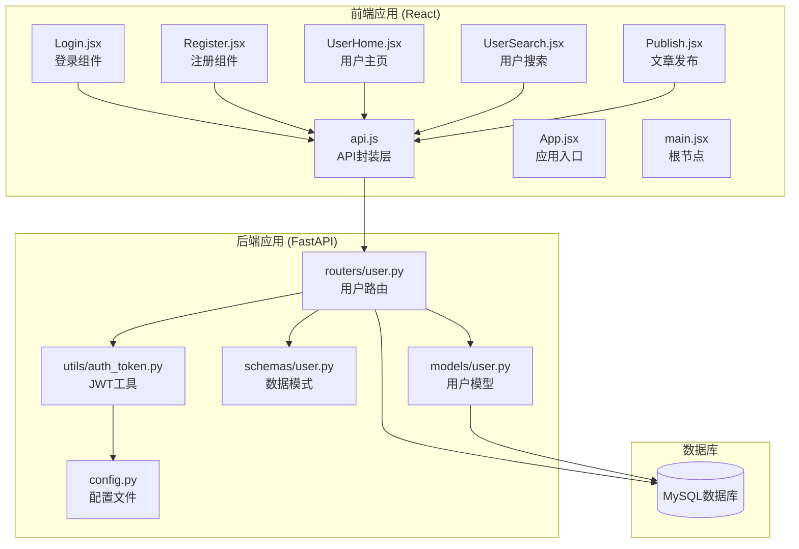
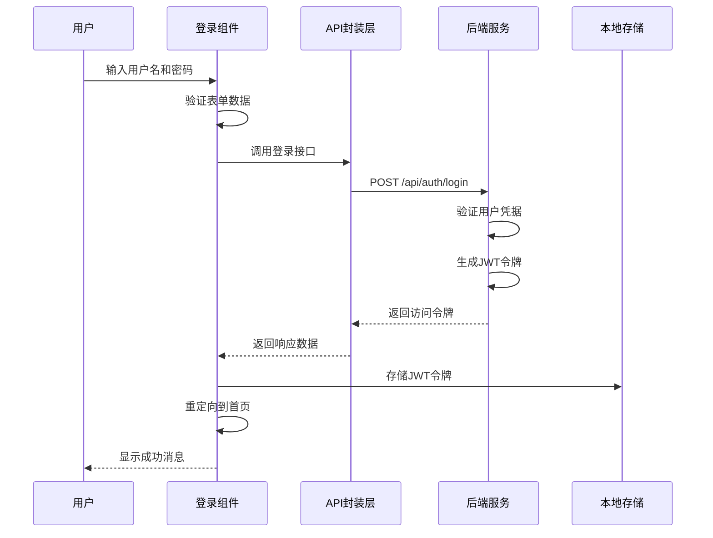
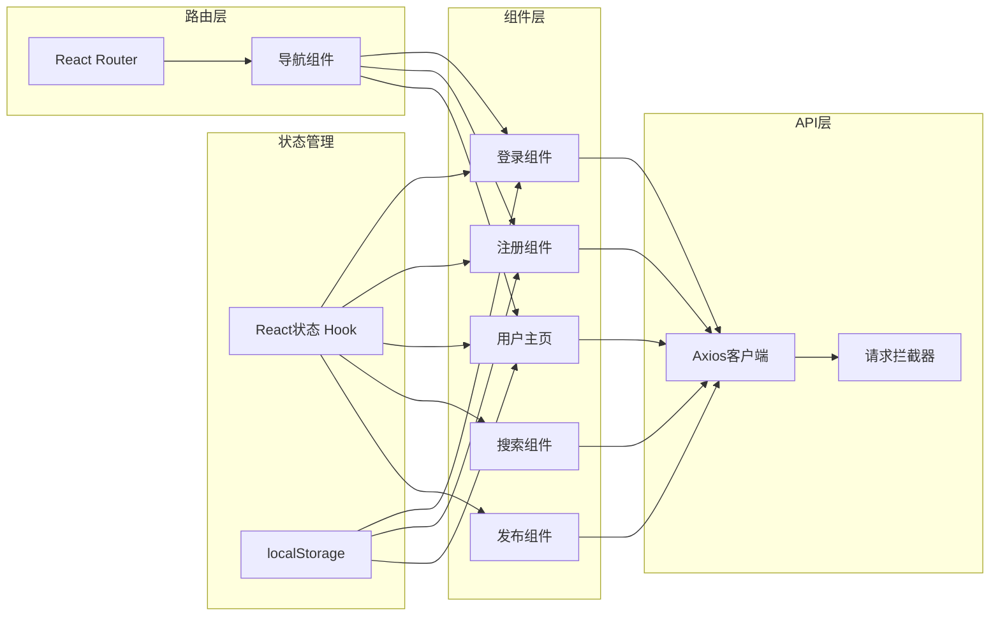
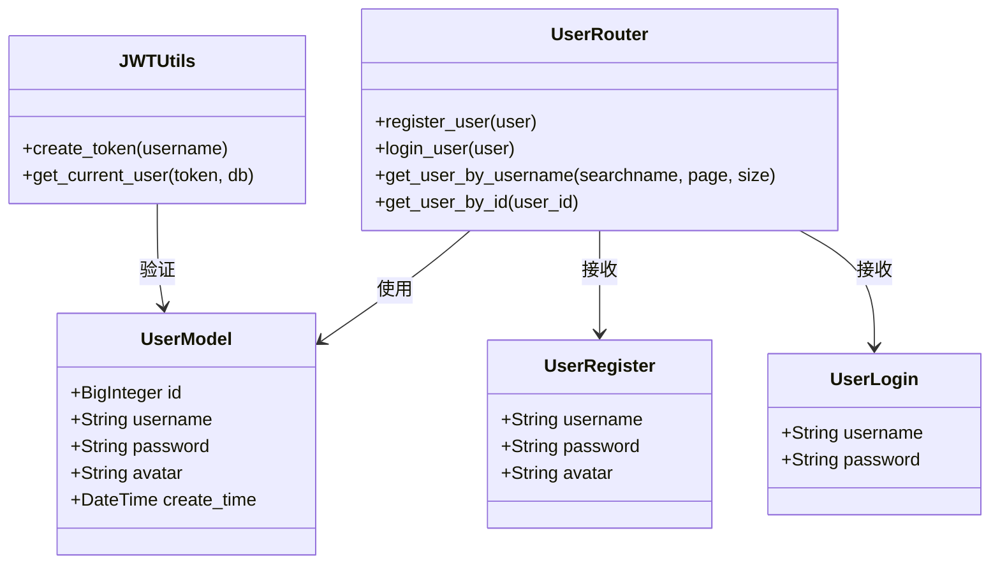
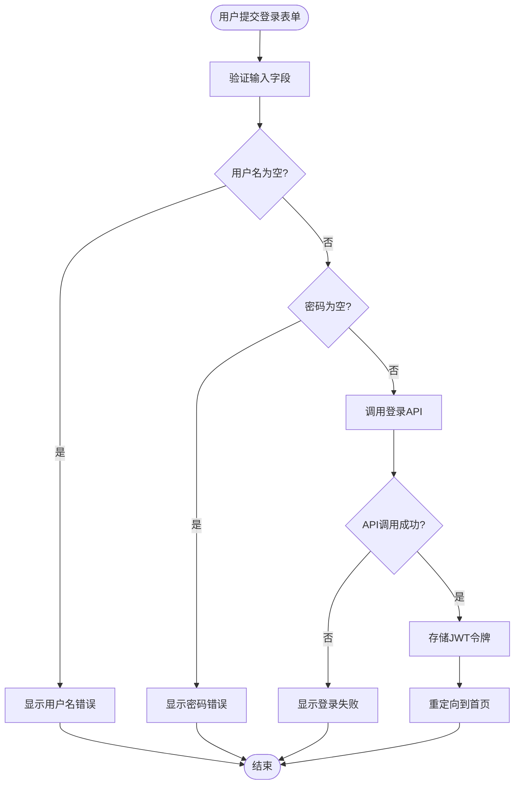
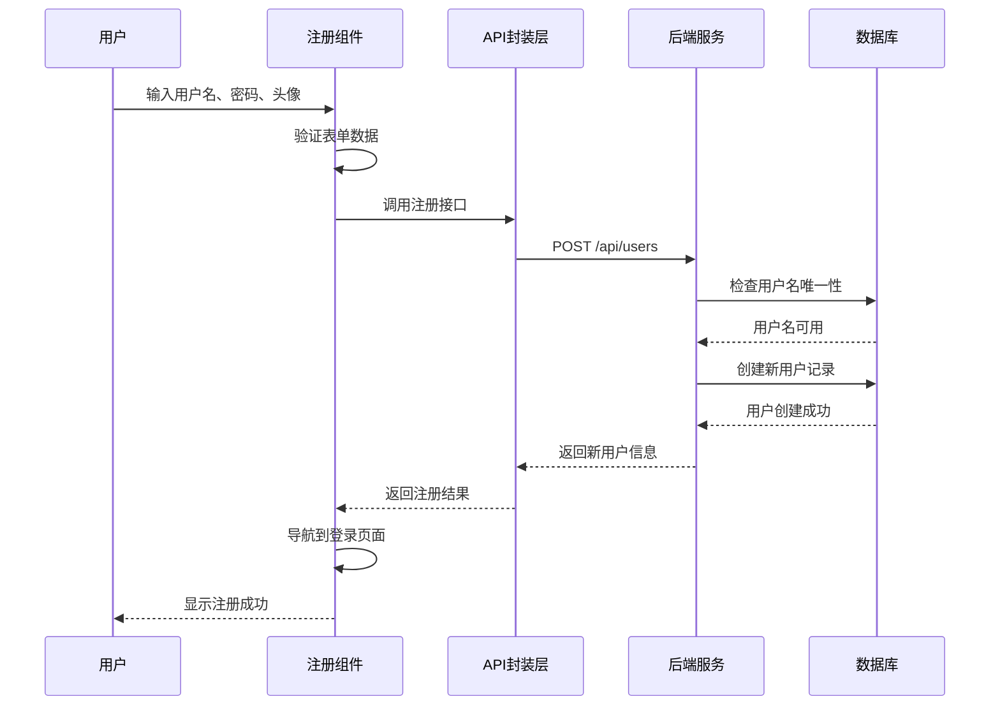
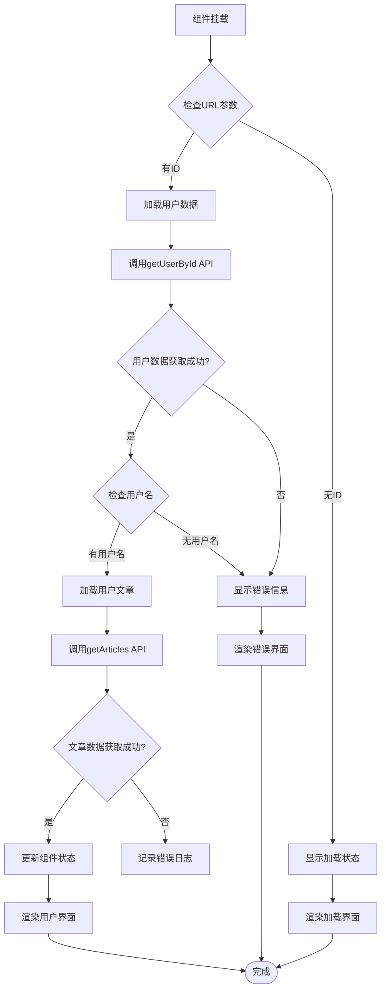
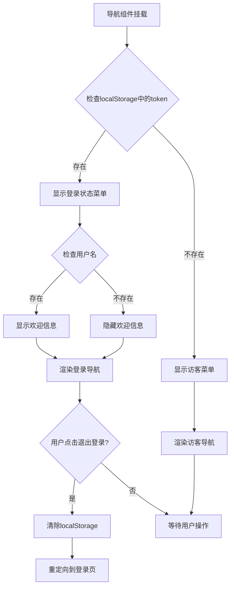

# 用户认证组件

<cite>
**本文档引用的文件**
- [Login.jsx](file://blog_frontend/src/components/Login.jsx)
- [Register.jsx](file://blog_frontend/src/components/Register.jsx)
- [UserHome.jsx](file://blog_frontend/src/components/UserHome.jsx)
- [App.jsx](file://blog_frontend/src/App.jsx)
- [api.js](file://blog_frontend/src/api.js)
- [main.jsx](file://blog_frontend/src/main.jsx)
- [package.json](file://blog_frontend/package.json)
- [user.py](file://blog_backend/routers/user.py)
- [auth_token.py](file://blog_backend/utils/auth_token.py)
- [user.py](file://blog_backend/models/user.py)
- [user.py](file://blog_backend/schemas/user.py)
- [config.py](file://blog_backend/config.py)
- [UserSearch.jsx](file://blog_frontend/src/components/UserSearch.jsx)
- [Publish.jsx](file://blog_frontend/src/components/Publish.jsx)
</cite>

## 目录
1. [简介](#简介)
2. [项目结构](#项目结构)
3. [核心组件](#核心组件)
4. [架构概览](#架构概览)
5. [详细组件分析](#详细组件分析)
6. [依赖分析](#依赖分析)
7. [性能考虑](#性能考虑)
8. [故障排除指南](#故障排除指南)
9. [结论](#结论)

## 简介

本项目是一个基于React和FastAPI构建的博客系统，包含完整的用户认证功能。本文档专注于用户认证相关UI组件的综合分析，涵盖登录组件的表单验证、JWT令牌处理和用户状态管理，注册组件的输入验证、密码强度检查和注册流程控制，以及用户主页组件的数据展示、个人信息管理和功能导航。

系统采用前后端分离架构，前端使用React构建用户界面，后端使用FastAPI提供RESTful API服务，通过JWT进行身份认证和授权。

## 项目结构

项目采用模块化组织方式，主要分为前端和后端两个部分：



**图表来源**
- [main.jsx:1-9](file://blog_frontend/src/main.jsx#L1-L9)
- [App.jsx:1-79](file://blog_frontend/src/App.jsx#L1-L79)
- [api.js:1-40](file://blog_frontend/src/api.js#L1-L40)
- [user.py:1-101](file://blog_backend/routers/user.py#L1-L101)

**章节来源**
- [main.jsx:1-9](file://blog_frontend/src/main.jsx#L1-L9)
- [App.jsx:1-79](file://blog_frontend/src/App.jsx#L1-L79)
- [package.json:1-28](file://blog_frontend/package.json#L1-L28)

## 核心组件

### 认证组件总览

系统的核心认证组件包括三个主要部分：

1. **登录组件** - 处理用户身份验证和JWT令牌存储
2. **注册组件** - 管理用户账户创建流程
3. **用户主页组件** - 展示用户信息和相关文章

### 组件间通信机制



**图表来源**
- [Login.jsx:11-21](file://blog_frontend/src/components/Login.jsx#L11-L21)
- [api.js:16](file://blog_frontend/src/api.js#L16)
- [user.py:36-51](file://blog_backend/routers/user.py#L36-L51)

**章节来源**
- [Login.jsx:1-47](file://blog_frontend/src/components/Login.jsx#L1-L47)
- [Register.jsx:1-52](file://blog_frontend/src/components/Register.jsx#L1-L52)
- [UserHome.jsx:1-129](file://blog_frontend/src/components/UserHome.jsx#L1-L129)

## 架构概览

### 前端架构设计

前端采用React函数式组件和Hooks模式，通过自定义Hook实现状态管理和业务逻辑封装：



**图表来源**
- [App.jsx:15-53](file://blog_frontend/src/App.jsx#L15-L53)
- [api.js:7-14](file://blog_frontend/src/api.js#L7-L14)

### 后端架构设计

后端使用FastAPI提供RESTful API，采用Pydantic进行数据验证，JWT进行身份认证：



**图表来源**
- [user.py:1-101](file://blog_backend/routers/user.py#L1-L101)
- [user.py:1-14](file://blog_backend/models/user.py#L1-L14)
- [user.py:6-13](file://blog_backend/schemas/user.py#L6-L13)
- [auth_token.py:12-38](file://blog_backend/utils/auth_token.py#L12-L38)

**章节来源**
- [user.py:1-101](file://blog_backend/routers/user.py#L1-L101)
- [auth_token.py:1-38](file://blog_backend/utils/auth_token.py#L1-L38)

## 详细组件分析

### 登录组件分析

登录组件是用户认证流程的入口点，负责处理用户凭据验证和JWT令牌管理。

#### 表单验证机制



**图表来源**
- [Login.jsx:11-21](file://blog_frontend/src/components/Login.jsx#L11-L21)

#### JWT令牌处理流程

登录成功后，系统执行以下令牌处理步骤：

1. **令牌存储**：将JWT访问令牌和用户名存储到localStorage
2. **状态更新**：导航到应用首页
3. **自动认证**：后续请求通过Axios拦截器自动添加Authorization头

#### 错误处理策略

登录组件采用渐进式错误处理：
- 表单级验证：确保必填字段不为空
- API级错误：捕获网络异常和服务器错误
- 用户友好提示：显示清晰的错误信息

**章节来源**
- [Login.jsx:1-47](file://blog_frontend/src/components/Login.jsx#L1-L47)
- [api.js:7-14](file://blog_frontend/src/api.js#L7-L14)

### 注册组件分析

注册组件负责用户账户创建流程，包含基础的输入验证和错误处理。

#### 注册流程控制



**图表来源**
- [Register.jsx:12-20](file://blog_frontend/src/components/Register.jsx#L12-L20)
- [user.py:16-33](file://blog_backend/routers/user.py#L16-L33)

#### 输入验证机制

注册组件实现基础的客户端验证：
- 必填字段验证：用户名、密码必须填写
- 格式验证：密码长度要求（建议增强）
- 可选字段：头像URL支持

#### 密码强度检查

当前实现缺少密码强度验证，建议增强如下：
- 最小长度检查（建议≥8位）
- 复杂度要求（大小写字母、数字、特殊字符）
- 常见弱密码检测
- 密码确认匹配验证

**章节来源**
- [Register.jsx:1-52](file://blog_frontend/src/components/Register.jsx#L1-L52)
- [user.py:16-33](file://blog_backend/routers/user.py#L16-L33)

### 用户主页组件分析

用户主页组件负责展示用户信息和相关文章，实现完整的数据加载和分页功能。

#### 数据加载流程



**图表来源**
- [UserHome.jsx:28-55](file://blog_frontend/src/components/UserHome.jsx#L28-L55)

#### 个人信息管理

用户主页支持以下信息展示：
- 用户头像：支持自定义头像或默认字母头像
- 基本信息：用户名、注册时间
- 文章统计：总文章数量、分页信息

#### 功能导航集成

主页组件与导航系统深度集成：
- 用户头像点击跳转到个人主页
- 文章列表支持分页浏览
- 内容链接到文章详情页面

**章节来源**
- [UserHome.jsx:1-129](file://blog_frontend/src/components/UserHome.jsx#L1-L129)

### 导航组件分析

导航组件实现了基于JWT令牌的用户状态管理，提供动态的菜单显示。

#### 用户状态检测



**图表来源**
- [App.jsx:15-53](file://blog_frontend/src/App.jsx#L15-L53)

**章节来源**
- [App.jsx:1-79](file://blog_frontend/src/App.jsx#L1-L79)

## 依赖分析

### 前端依赖关系

```mermaid
graph TD
subgraph "核心依赖"
React[react ^18.2.0]
Router[react-router-dom ^6.22.1]
Axios[axios ^1.6.7]
end
subgraph "开发依赖"
Vite[vite ^5.1.4]
Types[typescript类型定义]
Plugin[@vitejs/plugin-react]
end
subgraph "第三方库"
ECharts[echarts ^6.0.0]
Markdown[react-markdown ^9.0.1]
RemarkGFM[remark-gfm ^4.0.0]
end
React --> Router
React --> Axios
Router --> Axios
Axios --> React
Vite --> React
Vite --> Router
Vite --> Axios
```

**图表来源**
- [package.json:11-27](file://blog_frontend/package.json#L11-L27)

### 后端依赖关系

后端使用FastAPI生态系统，包含以下关键组件：

- **FastAPI**：主要Web框架
- **SQLAlchemy**：ORM对象关系映射
- **Passlib**：密码哈希处理
- **Pydantic**：数据验证和序列化
- **JWSSecurity**：JWT令牌处理

**章节来源**
- [package.json:11-27](file://blog_frontend/package.json#L11-L27)
- [user.py:7](file://blog_backend/routers/user.py#L7)
- [auth_token.py:1](file://blog_backend/utils/auth_token.py#L1)

## 性能考虑

### 前端性能优化

1. **状态管理优化**
   - 使用React.memo避免不必要的重新渲染
   - 合理拆分组件状态，减少全局状态更新
   - 实现虚拟滚动处理大量列表数据

2. **API调用优化**
   - 实现请求去重，避免重复API调用
   - 添加请求缓存机制
   - 优化分页加载策略

3. **资源加载优化**
   - 图片懒加载和预加载
   - 代码分割和按需加载
   - CDN加速静态资源

### 后端性能优化

1. **数据库优化**
   - 用户名字段建立唯一索引
   - 查询语句优化和索引使用
   - 连接池配置和连接复用

2. **JWT性能**
   - 令牌过期时间合理设置
   - 减少令牌验证开销
   - 实现令牌刷新机制

## 故障排除指南

### 常见问题诊断

#### 登录失败问题

**症状**：用户输入正确的凭据但仍无法登录

**可能原因**：
1. JWT令牌生成失败
2. 服务器时间不同步
3. 密钥配置错误

**解决方案**：
1. 检查后端JWT密钥配置
2. 验证服务器时钟同步
3. 查看后端日志获取详细错误信息

#### 注册冲突问题

**症状**：用户名重复但错误提示不明确

**可能原因**：
1. 前端错误处理缺失
2. 后端业务逻辑异常

**解决方案**：
1. 增强前端表单验证
2. 改善后端错误响应格式
3. 添加用户名唯一性检查

#### 数据加载失败

**症状**：用户主页无法显示文章列表

**可能原因**：
1. API接口调用失败
2. 用户名参数错误
3. 分页参数异常

**解决方案**：
1. 检查API接口连通性
2. 验证URL参数格式
3. 实现重试机制和错误边界

### 调试技巧

1. **浏览器开发者工具**
   - Network面板监控API调用
   - Console面板查看JavaScript错误
   - Application面板检查localStorage状态

2. **后端调试**
   - 启用详细日志记录
   - 使用Postman测试API接口
   - 监控数据库查询性能

**章节来源**
- [Login.jsx:18-20](file://blog_frontend/src/components/Login.jsx#L18-L20)
- [Register.jsx:17-19](file://blog_frontend/src/components/Register.jsx#L17-L19)
- [UserHome.jsx:42-47](file://blog_frontend/src/components/UserHome.jsx#L42-L47)

## 结论

本用户认证组件系统提供了完整的用户身份验证和授权功能，具有以下特点：

### 优势

1. **简洁高效**：采用最小必要功能设计，避免过度复杂化
2. **安全性**：使用JWT令牌进行身份验证，支持令牌过期和刷新
3. **可扩展性**：模块化设计便于功能扩展和维护
4. **用户体验**：提供清晰的错误提示和流畅的交互体验

### 改进建议

1. **增强验证**：为注册组件添加密码强度验证
2. **优化性能**：实现请求缓存和状态持久化
3. **提升安全**：增加CSRF保护和密码加密存储
4. **改善体验**：添加加载状态指示和错误恢复机制

### 技术债务

1. **密码处理**：当前实现直接存储明文密码，应使用哈希算法
2. **错误处理**：部分组件缺少完善的错误边界处理
3. **测试覆盖**：缺乏单元测试和集成测试
4. **文档完善**：需要更详细的API文档和使用说明

该系统为博客平台的用户认证提供了坚实的基础，通过持续改进可以满足更严格的安全性和性能要求。