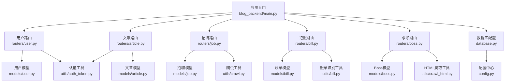
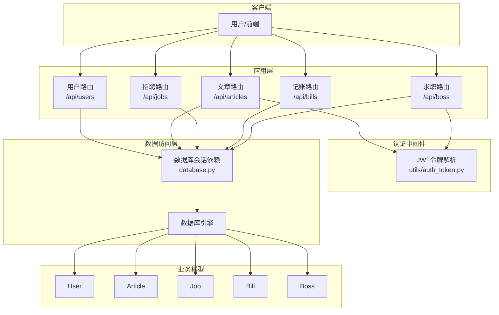
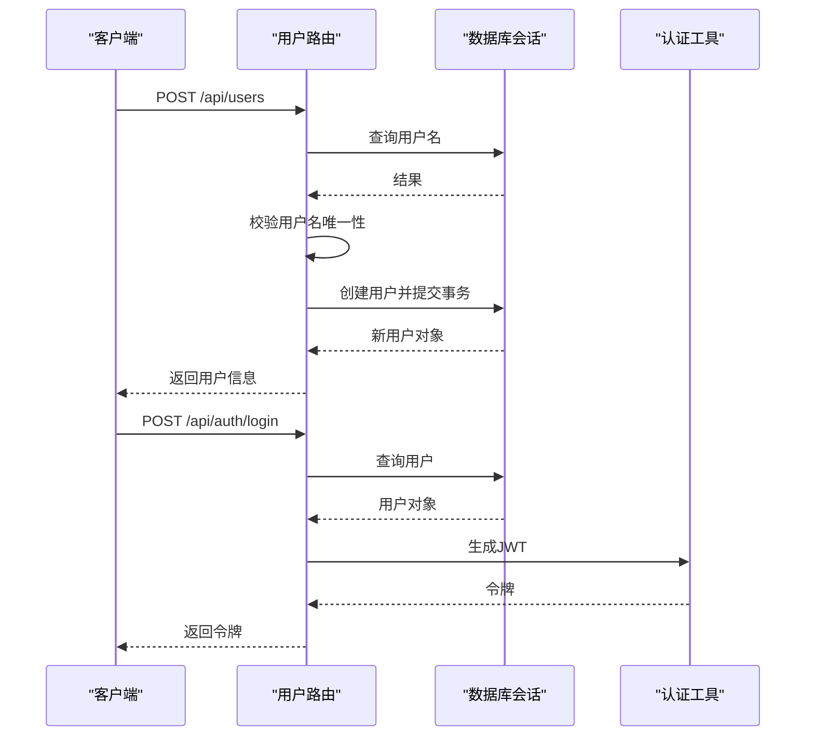
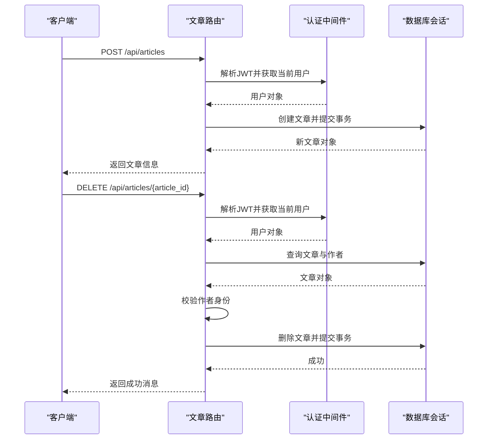
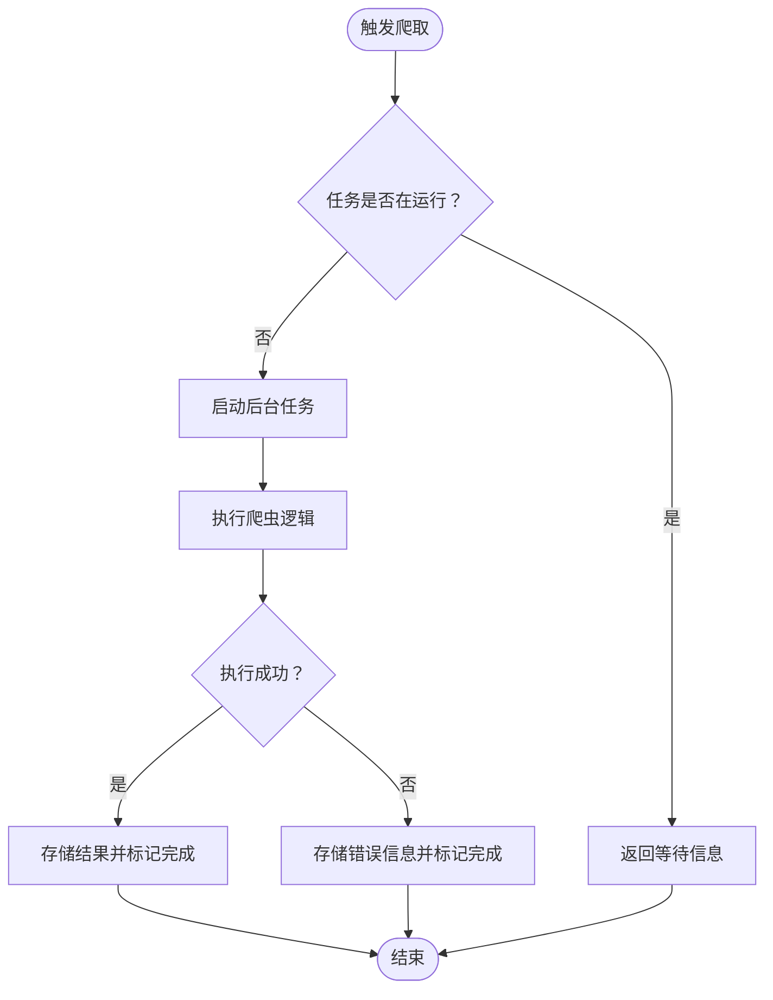
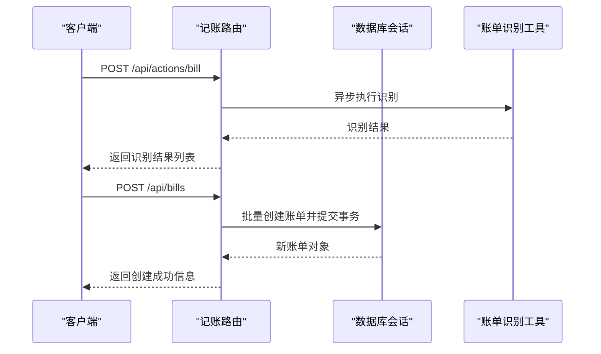
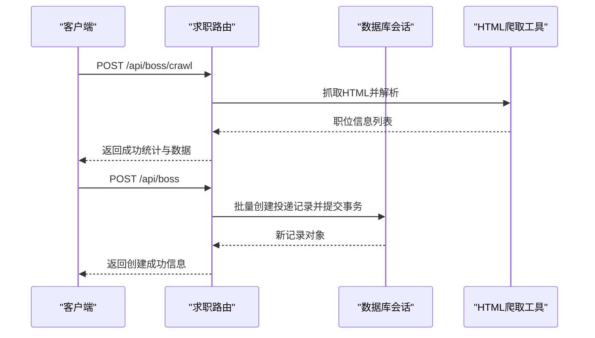
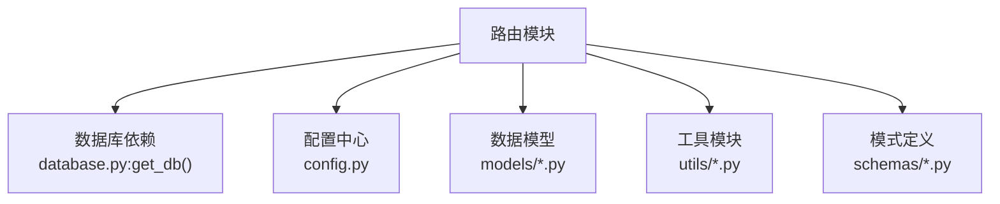

# API路由组织

<cite>
**本文档引用的文件**
- [main.py](file://blog_backend/main.py)
- [user.py](file://blog_backend/routers/user.py)
- [article.py](file://blog_backend/routers/article.py)
- [job.py](file://blog_backend/routers/job.py)
- [bill.py](file://blog_backend/routers/bill.py)
- [boss.py](file://blog_backend/routers/boss.py)
- [user.py](file://blog_backend/models/user.py)
- [article.py](file://blog_backend/models/article.py)
- [job.py](file://blog_backend/models/job.py)
- [bill.py](file://blog_backend/models/bill.py)
- [boss.py](file://blog_backend/models/boss.py)
- [auth_token.py](file://blog_backend/utils/auth_token.py)
- [user.py](file://blog_backend/schemas/user.py)
- [article.py](file://blog_backend/schemas/article.py)
- [bill.py](file://blog_backend/schemas/bill.py)
- [boss.py](file://blog_backend/schemas/boss.py)
- [config.py](file://blog_backend/config.py)
- [database.py](file://blog_backend/database.py)
</cite>

## 目录
1. [简介](#简介)
2. [项目结构](#项目结构)
3. [核心组件](#核心组件)
4. [架构概览](#架构概览)
5. [详细组件分析](#详细组件分析)
6. [依赖分析](#依赖分析)
7. [性能考虑](#性能考虑)
8. [故障排除指南](#故障排除指南)
9. [结论](#结论)
10. [附录](#附录)

## 简介
本文件系统性梳理博客系统的API路由组织与实现，重点覆盖以下功能模块的路由设计与实现细节：
- 用户管理：注册、登录、分页查询与详情查询
- 文章管理：发布、分页查询、详情查看、删除与编辑
- 招聘信息：按日期范围查询、触发爬虫与获取爬取结果
- 智能记账：图片批量识别、账单创建与按日期范围查询
- 求职投递：职位信息抓取、投递记录创建与按日期范围查询

文档将详细说明路由前缀配置、标签分类、端点组织策略、依赖注入、参数验证、响应模型定义、中间件与错误处理、状态码规范，并提供扩展开发指导。

## 项目结构
后端采用FastAPI框架，路由通过APIRouter进行模块化组织，主应用在入口文件中统一挂载各模块路由。数据库连接通过SQLAlchemy进行依赖注入，认证通过JWT中间件实现。

**图表来源**
- [main.py:1-13](file://blog_backend/main.py#L1-L13)
- [user.py:1-101](file://blog_backend/routers/user.py#L1-L101)
- [article.py:1-85](file://blog_backend/routers/article.py#L1-L85)
- [job.py:1-97](file://blog_backend/routers/job.py#L1-L97)
- [bill.py:1-173](file://blog_backend/routers/bill.py#L1-L173)
- [boss.py:1-134](file://blog_backend/routers/boss.py#L1-L134)

**章节来源**
- [main.py:1-13](file://blog_backend/main.py#L1-L13)

## 核心组件
- 应用入口与路由挂载：在应用入口中统一引入各模块路由，并设置统一前缀与标签，便于Swagger/OpenAPI文档分类展示。
- 依赖注入：数据库会话通过依赖函数提供；认证通过OAuth2PasswordBearer与自定义工具解析JWT。
- 参数验证与响应模型：使用Pydantic模型定义请求与响应结构，内置字段校验器与约束。
- 错误处理：统一抛出HTTP异常，明确状态码与错误信息；部分模块对数据库唯一约束冲突进行专门处理。

**章节来源**
- [main.py:6-10](file://blog_backend/main.py#L6-L10)
- [auth_token.py:20-37](file://blog_backend/utils/auth_token.py#L20-L37)
- [database.py:12-18](file://blog_backend/database.py#L12-L18)

## 架构概览
下图展示了API路由与业务模块之间的交互关系，以及认证中间件在文章与求职模块中的使用。

**图表来源**
- [main.py:6-10](file://blog_backend/main.py#L6-L10)
- [auth_token.py:20-37](file://blog_backend/utils/auth_token.py#L20-L37)
- [database.py:12-18](file://blog_backend/database.py#L12-L18)
- [user.py:1-101](file://blog_backend/routers/user.py#L1-L101)
- [article.py:1-85](file://blog_backend/routers/article.py#L1-L85)
- [job.py:1-97](file://blog_backend/routers/job.py#L1-L97)
- [bill.py:1-173](file://blog_backend/routers/bill.py#L1-L173)
- [boss.py:1-134](file://blog_backend/routers/boss.py#L1-L134)

## 详细组件分析

### 用户管理路由
- 路由前缀与标签：统一前缀/api，标签为“用户”。
- 主要端点：
  - POST /api/users：用户注册，基于请求模型进行参数校验，检查用户名唯一性后创建用户。
  - POST /api/auth/login：用户登录，校验用户名与密码后签发JWT。
  - GET /api/users：根据用户名模糊查询，支持分页参数校验与下一页判断。
  - GET /api/users/{user_id}：根据用户ID查询详情，不存在时返回404。
- 依赖注入：数据库会话通过依赖函数提供；登录接口使用自定义令牌工具生成JWT。
- 参数验证：请求模型定义字段与默认值；查询接口对分页参数进行范围校验。
- 响应模型：返回用户基本信息或令牌信息。
- 错误处理：用户名重复、用户名不存在、密码错误、用户不存在等场景返回相应状态码与错误信息。

**图表来源**
- [user.py:15-51](file://blog_backend/routers/user.py#L15-L51)
- [user.py:54-101](file://blog_backend/routers/user.py#L54-L101)
- [auth_token.py:12-17](file://blog_backend/utils/auth_token.py#L12-L17)

**章节来源**
- [user.py:15-101](file://blog_backend/routers/user.py#L15-L101)
- [schemas/user.py:6-13](file://blog_backend/schemas/user.py#L6-L13)
- [models/user.py:5-14](file://blog_backend/models/user.py#L5-L14)

### 文章管理路由
- 路由前缀与标签：统一前缀/api，标签为“文章”。
- 主要端点：
  - POST /api/articles：发布文章，需登录态，绑定当前用户ID。
  - GET /api/users/{username}/articles：按用户名分页查询用户文章。
  - GET /api/articles/{article_id}：查看文章详情，关联作者信息。
  - DELETE /api/articles/{article_id}：删除文章，需校验作者身份。
  - PUT /api/articles/{article_id}：编辑文章，需校验作者身份。
- 依赖注入：数据库会话与当前用户通过依赖函数提供；当前用户解析依赖OAuth2方案。
- 参数验证：请求模型定义字段；分页参数校验；权限校验通过当前用户ID与文章作者ID比对。
- 响应模型：返回文章对象、总数与总页数或操作成功消息。
- 错误处理：用户不存在、文章不存在、权限不足、未授权等场景返回相应状态码。

**图表来源**
- [article.py:11-68](file://blog_backend/routers/article.py#L11-L68)
- [auth_token.py:20-37](file://blog_backend/utils/auth_token.py#L20-L37)

**章节来源**
- [article.py:11-85](file://blog_backend/routers/article.py#L11-L85)
- [schemas/article.py:5-10](file://blog_backend/schemas/article.py#L5-L10)
- [models/article.py:16-41](file://blog_backend/models/article.py#L16-L41)

### 招聘信息路由
- 路由前缀与标签：统一前缀/api，标签为“招聘”。
- 主要端点：
  - GET /api/jobs：按日期范围查询招聘信息，支持weekly与monthly两种范围。
  - POST /api/actions/crawl：触发后台爬虫任务，避免重复执行。
  - GET /api/actions/crawl/result：获取上次爬取结果与完成时间。
- 依赖注入：数据库会话通过依赖函数提供；爬虫任务通过BackgroundTasks异步执行。
- 参数验证：日期参数与范围参数校验；爬取结果存储于内存字典。
- 响应模型：返回招聘信息列表或任务状态信息。
- 错误处理：爬取异常捕获并记录日志，返回错误信息；任务运行中提示等待。

**图表来源**
- [job.py:62-96](file://blog_backend/routers/job.py#L62-L96)

**章节来源**
- [job.py:17-97](file://blog_backend/routers/job.py#L17-L97)
- [models/job.py:5-15](file://blog_backend/models/job.py#L5-L15)

### 智能记账路由
- 路由前缀与标签：统一前缀/api，标签为“记账”。
- 主要端点：
  - POST /api/actions/bill：批量上传图片并识别账单信息，异步执行识别逻辑。
  - POST /api/bills：创建账单，支持单个或批量创建，自动刷新对象。
  - GET /api/bills：按日期范围查询账单，支持weekly与monthly自动计算。
- 依赖注入：数据库会话通过依赖函数提供；图片识别通过线程池执行同步函数。
- 参数验证：请求模型定义字段与数值范围；日期范围参数可混合使用。
- 响应模型：返回识别结果列表或创建成功信息。
- 错误处理：识别异常捕获并返回错误；数据库异常回滚并返回500。

**图表来源**
- [bill.py:24-51](file://blog_backend/routers/bill.py#L24-L51)
- [bill.py:55-116](file://blog_backend/routers/bill.py#L55-L116)

**章节来源**
- [bill.py:24-173](file://blog_backend/routers/bill.py#L24-L173)
- [schemas/bill.py:7-40](file://blog_backend/schemas/bill.py#L7-L40)
- [models/bill.py:7-24](file://blog_backend/models/bill.py#L7-L24)

### 求职投递路由
- 路由前缀与标签：统一前缀/api，标签为“求职”。
- 主要端点：
  - POST /api/boss/crawl：抓取职位信息，返回成功统计与数据。
  - POST /api/boss：创建投递记录，支持单个或批量创建，处理唯一约束冲突。
  - GET /api/boss：按日期范围查询投递记录，支持weekly与monthly。
- 依赖注入：数据库会话通过依赖函数提供；HTML抓取通过自定义工具类执行。
- 参数验证：请求模型定义字段；日期范围参数校验；URL唯一性约束处理。
- 响应模型：返回职位信息或创建成功信息。
- 错误处理：唯一约束冲突返回409；其他异常返回500并包含详细信息。

**图表来源**
- [boss.py:16-84](file://blog_backend/routers/boss.py#L16-L84)

**章节来源**
- [boss.py:16-134](file://blog_backend/routers/boss.py#L16-L134)
- [schemas/boss.py:7-14](file://blog_backend/schemas/boss.py#L7-L14)
- [models/boss.py:5-15](file://blog_backend/models/boss.py#L5-L15)

## 依赖分析
- 路由与模块耦合：各路由模块仅依赖数据库会话与必要的工具类，保持低耦合高内聚。
- 认证依赖：文章与求职模块通过OAuth2PasswordBearer与自定义工具解析JWT，确保受保护端点的安全性。
- 数据模型映射：每个路由模块对应一个数据模型，遵循ORM约定，字段与约束清晰。
- 配置集中：数据库连接、密钥算法、默认头像URL等集中于配置文件，便于维护与环境切换。

**图表来源**
- [database.py:12-18](file://blog_backend/database.py#L12-L18)
- [config.py:1-32](file://blog_backend/config.py#L1-L32)

**章节来源**
- [database.py:12-18](file://blog_backend/database.py#L12-L18)
- [config.py:1-32](file://blog_backend/config.py#L1-L32)

## 性能考虑
- 异步与并发：记账模块对图片识别采用线程池执行同步函数，避免阻塞事件循环；招聘与求职模块使用后台任务异步执行爬取，提升用户体验。
- 分页与查询优化：用户与文章模块采用偏移量分页，建议在大数据量场景下结合索引与游标分页优化；记账与求职模块按日期范围查询，建议在日期字段建立索引。
- 依赖注入开销：数据库会话依赖函数每次请求创建会话，注意连接池配置与超时设置，避免资源泄漏。
- 响应体积控制：返回列表时尽量精简字段，减少序列化开销。

## 故障排除指南
- 认证失败：检查JWT令牌是否有效、是否过期、用户是否存在；确认tokenUrl与OAuth2方案一致。
- 数据库异常：唯一约束冲突（如重复URL）返回409；其他异常返回500并包含详细信息；注意事务回滚。
- 爬虫任务：若任务长时间运行，检查日志输出与异常捕获；避免重复触发导致资源竞争。
- 图片识别：上传文件大小与格式限制，识别异常会返回错误信息；建议前端预检与后端严格校验。

**章节来源**
- [auth_token.py:20-37](file://blog_backend/utils/auth_token.py#L20-L37)
- [boss.py:73-84](file://blog_backend/routers/boss.py#L73-L84)
- [job.py:64-79](file://blog_backend/routers/job.py#L64-L79)
- [bill.py:110-115](file://blog_backend/routers/bill.py#L110-L115)

## 结论
本项目的API路由组织遵循模块化与标准化原则，统一前缀与标签便于文档与调试；依赖注入与Pydantic模型确保了代码的可维护性与安全性；认证中间件与严格的错误处理提升了系统的健壮性。建议在后续迭代中进一步完善分页策略、索引优化与监控告警体系。

## 附录
- 扩展开发指导：
  - 新增路由模块：在routers目录新增模块文件，定义APIRouter实例，编写端点函数，导入并挂载到主应用。
  - 数据模型扩展：在models目录新增ORM类，定义字段与关系，确保与数据库迁移脚本一致。
  - 工具类集成：在utils目录新增工具函数或类，通过依赖注入在路由中使用。
  - 配置管理：在config.py中新增配置项，确保环境变量覆盖与默认值合理。
  - 测试与文档：为新增端点补充单元测试与OpenAPI文档注释，保持一致性。