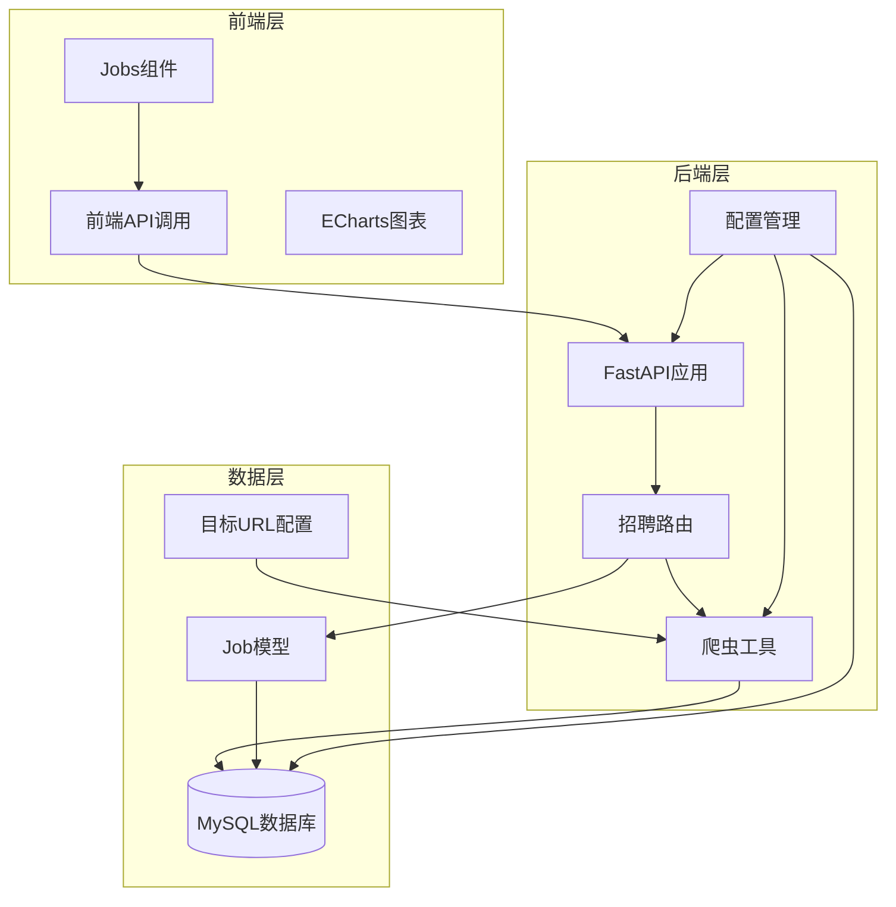
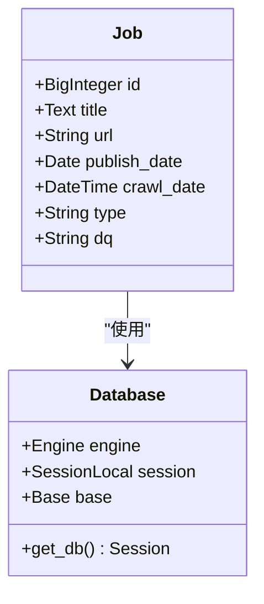
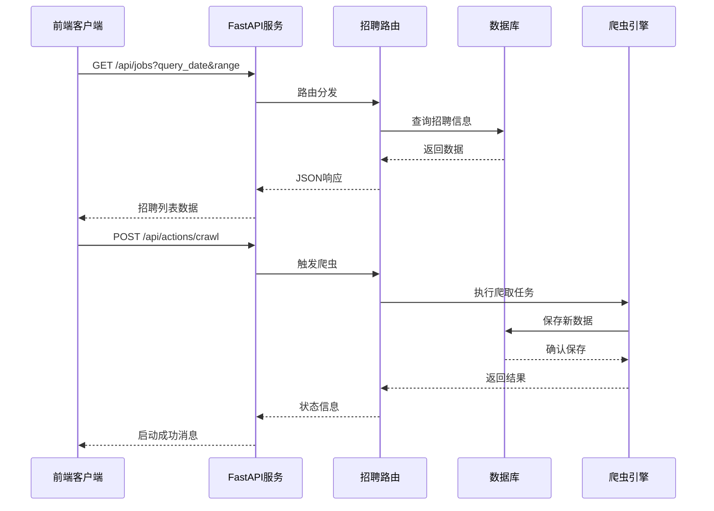
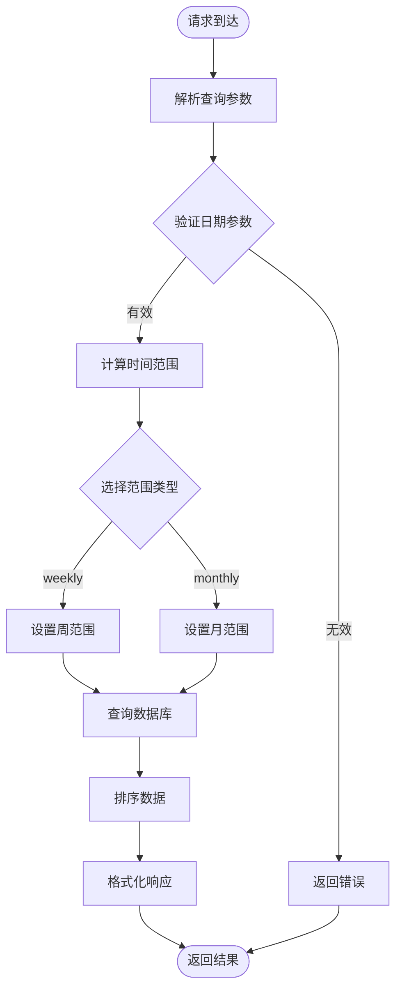
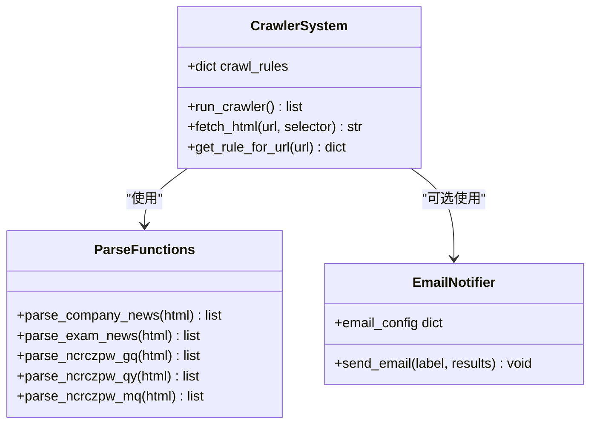
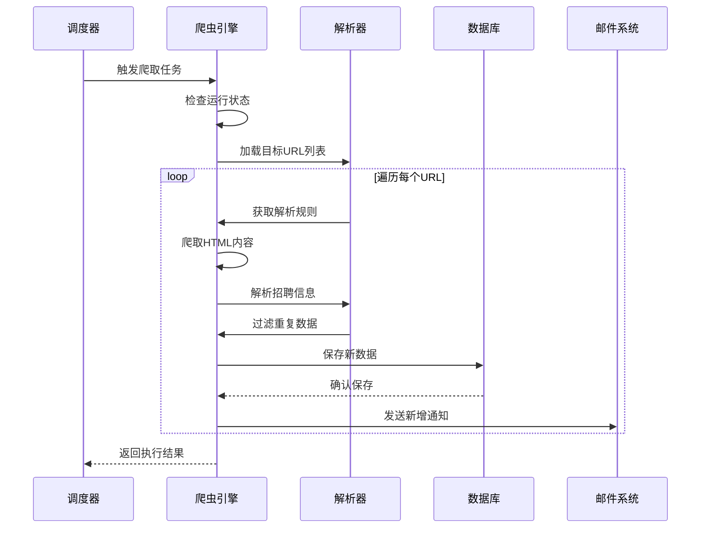
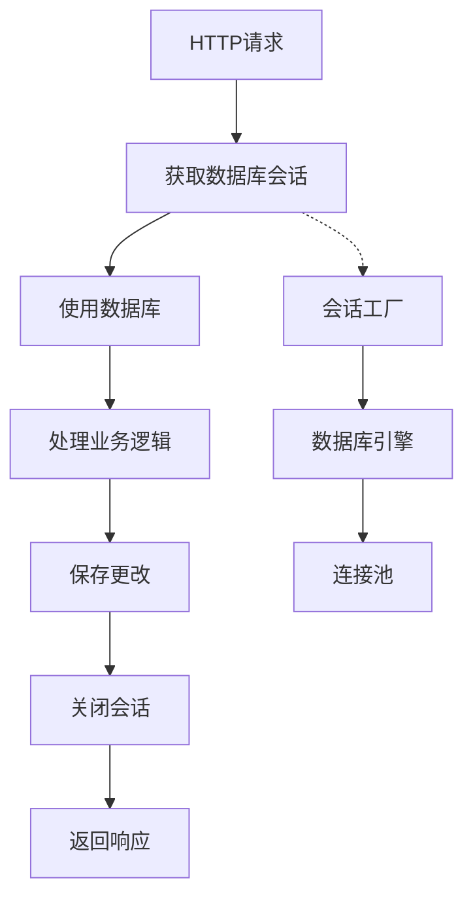
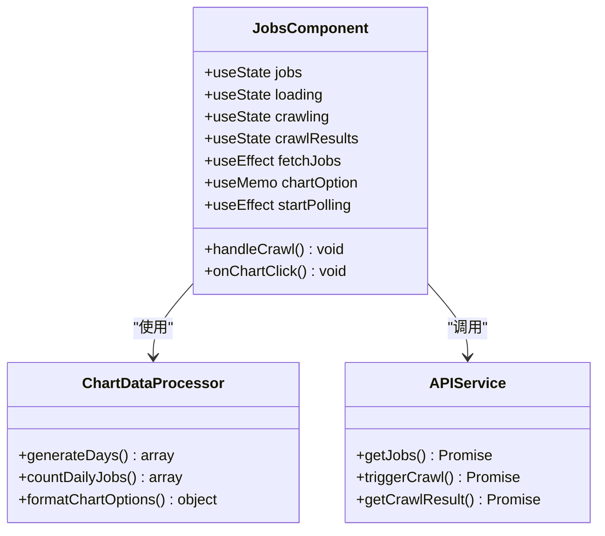
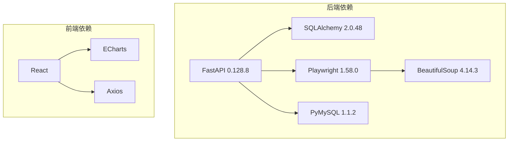

# 招聘信息路由

<cite>
**本文档引用的文件**
- [blog_backend/routers/job.py](file://blog_backend/routers/job.py)
- [blog_backend/models/job.py](file://blog_backend/models/job.py)
- [blog_backend/utils/crawl.py](file://blog_backend/utils/crawl.py)
- [blog_backend/main.py](file://blog_backend/main.py)
- [blog_backend/database.py](file://blog_backend/database.py)
- [blog_backend/config.py](file://blog_backend/config.py)
- [blog_backend/targets.txt](file://blog_backend/targets.txt)
- [blog_backend/init_db.py](file://blog_backend/init_db.py)
- [blog_frontend/src/components/Jobs.jsx](file://blog_frontend/src/components/Jobs.jsx)
- [blog_frontend/src/api.js](file://blog_frontend/src/api.js)
- [blog_backend/pyproject.toml](file://blog_backend/pyproject.toml)
- [blog_backend/requirements.txt](file://blog_backend/requirements.txt)
</cite>

## 目录
1. [简介](#简介)
2. [项目结构](#项目结构)
3. [核心组件](#核心组件)
4. [架构概览](#架构概览)
5. [详细组件分析](#详细组件分析)
6. [依赖分析](#依赖分析)
7. [性能考虑](#性能考虑)
8. [故障排除指南](#故障排除指南)
9. [结论](#结论)

## 简介

招聘信息路由模块是一个完整的招聘数据管理系统，集成了数据爬取、存储和展示功能。该模块通过FastAPI构建RESTful API，使用Playwright进行网页爬取，基于SQLAlchemy进行数据持久化，并通过前端React组件提供可视化界面。

系统支持多种招聘数据源的自动爬取，包括公司招聘、考试公告和南昌人才网等不同类型的招聘信息。用户可以通过Web界面查看招聘数据的统计图表和详细列表，同时管理员可以触发后台爬虫任务来更新数据。

## 项目结构

项目采用前后端分离的架构设计，后端使用Python FastAPI框架，前端使用React技术栈。招聘模块位于后端的routers目录下，数据模型定义在models目录中，爬虫逻辑集中在utils目录中。

**图表来源**
- [blog_backend/main.py:1-13](file://blog_backend/main.py#L1-L13)
- [blog_backend/routers/job.py:1-97](file://blog_backend/routers/job.py#L1-L97)
- [blog_backend/models/job.py:1-15](file://blog_backend/models/job.py#L1-L15)

**章节来源**
- [blog_backend/main.py:1-13](file://blog_backend/main.py#L1-L13)
- [blog_backend/pyproject.toml:1-22](file://blog_backend/pyproject.toml#L1-L22)
- [blog_backend/requirements.txt:1-14](file://blog_backend/requirements.txt#L1-L14)

## 核心组件

### 数据模型设计

招聘数据模型采用SQLAlchemy ORM映射，定义了完整的招聘信息字段结构：

**图表来源**
- [blog_backend/models/job.py:5-15](file://blog_backend/models/job.py#L5-L15)
- [blog_backend/database.py:1-18](file://blog_backend/database.py#L1-L18)

### 路由接口设计

招聘路由模块提供了三个主要的API接口：

1. **招聘数据查询接口** (`GET /api/jobs`)
2. **爬虫触发接口** (`POST /api/actions/crawl`)
3. **爬取结果查询接口** (`GET /api/actions/crawl/result`)

每个接口都经过精心设计，支持灵活的查询参数和响应格式。

**章节来源**
- [blog_backend/routers/job.py:17-97](file://blog_backend/routers/job.py#L17-L97)
- [blog_backend/models/job.py:1-15](file://blog_backend/models/job.py#L1-L15)

## 架构概览

系统采用分层架构设计，各层职责明确，耦合度低，便于维护和扩展。

**图表来源**
- [blog_backend/routers/job.py:17-97](file://blog_backend/routers/job.py#L17-L97)
- [blog_backend/utils/crawl.py:368-445](file://blog_backend/utils/crawl.py#L368-L445)

## 详细组件分析

### 招聘数据查询组件

#### 接口设计与参数

查询接口支持灵活的时间范围选择，包括周数据和月数据两种模式：

**图表来源**
- [blog_backend/routers/job.py:18-60](file://blog_backend/routers/job.py#L18-L60)

#### 数据查询逻辑

查询逻辑根据用户选择的时间范围自动计算开始和结束日期：
- **周范围**：从查询日期前6天到查询日期当天
- **月范围**：从查询日期所在月的第一天到当月最后一天

查询结果按ID降序排列，确保最新的招聘信息显示在前面。

**章节来源**
- [blog_backend/routers/job.py:18-60](file://blog_backend/routers/job.py#L18-L60)

### 爬虫系统组件

#### 爬取机制设计

爬虫系统采用多站点支持的设计，针对不同的招聘网站实现了专门的解析器：

**图表来源**
- [blog_backend/utils/crawl.py:250-284](file://blog_backend/utils/crawl.py#L250-L284)
- [blog_backend/utils/crawl.py:368-445](file://blog_backend/utils/crawl.py#L368-L445)

#### 爬取流程控制

爬虫执行流程包含完整的错误处理和状态跟踪机制：

**图表来源**
- [blog_backend/utils/crawl.py:389-440](file://blog_backend/utils/crawl.py#L389-L440)

**章节来源**
- [blog_backend/utils/crawl.py:19-52](file://blog_backend/utils/crawl.py#L19-L52)
- [blog_backend/utils/crawl.py:286-292](file://blog_backend/utils/crawl.py#L286-L292)
- [blog_backend/utils/crawl.py:368-445](file://blog_backend/utils/crawl.py#L368-L445)

### 数据存储组件

#### 数据库连接管理

数据库连接采用依赖注入模式，确保每个请求都有独立的数据库会话：

**图表来源**
- [blog_backend/database.py:13-18](file://blog_backend/database.py#L13-L18)

#### 数据去重机制

爬虫系统实现了智能的数据去重机制，避免重复存储相同的信息：

1. **URL集合缓存**：在每次爬取前获取数据库中已存在的URL集合
2. **增量检测**：只保存数据库中不存在的新URL
3. **批量处理**：逐条保存，单条失败不影响整体进度

**章节来源**
- [blog_backend/utils/crawl.py:19-27](file://blog_backend/utils/crawl.py#L19-L27)
- [blog_backend/utils/crawl.py:410-420](file://blog_backend/utils/crawl.py#L410-L420)

### 前端展示组件

#### React组件架构

前端Jobs组件采用函数式组件设计，集成了完整的数据获取、状态管理和用户交互功能：

**图表来源**
- [blog_frontend/src/components/Jobs.jsx:1-362](file://blog_frontend/src/components/Jobs.jsx#L1-L362)

#### 图表可视化设计

系统使用ECharts实现招聘数据的可视化展示，支持周视图和月视图两种模式：

1. **动态数据生成**：根据选择的时间范围自动生成日期轴
2. **交互式选择**：用户点击图表可以选择特定日期查看详细信息
3. **颜色编码**：当前选择的日期使用绿色高亮显示

**章节来源**
- [blog_frontend/src/components/Jobs.jsx:48-147](file://blog_frontend/src/components/Jobs.jsx#L48-L147)
- [blog_frontend/src/components/Jobs.jsx:149-198](file://blog_frontend/src/components/Jobs.jsx#L149-L198)

## 依赖分析

### 技术栈依赖

系统采用现代化的技术栈，各组件之间的依赖关系清晰明确：

**图表来源**
- [blog_backend/pyproject.toml:7-21](file://blog_backend/pyproject.toml#L7-L21)
- [blog_backend/requirements.txt:1-14](file://blog_backend/requirements.txt#L1-L14)

### 外部服务集成

系统集成了多个外部服务，包括数据库服务、邮件服务和招聘网站：

| 服务类型 | 服务名称 | 版本 | 用途 |
|---------|----------|------|------|
| 数据库 | MySQL | - | 持久化招聘数据 |
| 爬虫引擎 | Playwright | 1.58.0 | 动态网页爬取 |
| HTML解析 | BeautifulSoup | 4.14.3 | 结构化数据提取 |
| Web框架 | FastAPI | 0.128.8 | API服务构建 |
| 前端框架 | React | - | 用户界面开发 |

**章节来源**
- [blog_backend/pyproject.toml:1-22](file://blog_backend/pyproject.toml#L1-L22)
- [blog_backend/requirements.txt:1-14](file://blog_backend/requirements.txt#L1-L14)

## 性能考虑

### 爬取性能优化

爬虫系统采用了多项性能优化措施：

1. **异步爬取**：使用Playwright的异步特性提高爬取效率
2. **智能等待**：根据页面结构动态等待元素加载完成
3. **错误恢复**：单个URL失败不影响整体爬取进度
4. **内存管理**：及时释放浏览器资源和数据库连接

### 数据库性能优化

数据库访问采用了连接池和事务管理机制：

1. **连接复用**：使用连接池减少数据库连接开销
2. **批量操作**：批量保存数据减少数据库往返次数
3. **索引优化**：为常用查询字段建立适当的索引
4. **事务控制**：合理使用事务确保数据一致性

### 前端性能优化

前端组件实现了多项性能优化：

1. **状态缓存**：使用useMemo缓存计算结果
2. **条件渲染**：避免不必要的DOM更新
3. **事件节流**：限制高频事件的处理频率
4. **懒加载**：图表组件按需加载

## 故障排除指南

### 常见问题诊断

#### 爬取失败问题

**问题现象**：爬取任务执行失败或部分URL无法获取

**可能原因**：
1. 目标网站结构变化
2. 网络连接不稳定
3. 反爬虫机制干扰
4. 解析规则过期

**解决方案**：
1. 检查目标URL是否仍然有效
2. 更新解析规则以适应网站变化
3. 增加重试机制和超时设置
4. 使用代理IP池绕过反爬虫

#### 数据库连接问题

**问题现象**：API请求出现数据库连接错误

**可能原因**：
1. 数据库服务器宕机
2. 连接池耗尽
3. SQL语句执行超时
4. 权限配置错误

**解决方案**：
1. 检查数据库服务状态
2. 调整连接池大小配置
3. 优化慢查询语句
4. 验证数据库用户权限

#### 前端显示异常

**问题现象**：招聘数据显示异常或图表渲染失败

**可能原因**：
1. API响应格式变化
2. 缺少必要的CSS样式
3. JavaScript执行错误
4. 浏览器兼容性问题

**解决方案**：
1. 检查API响应结构
2. 确认样式文件正确加载
3. 查看浏览器控制台错误
4. 测试不同浏览器兼容性

**章节来源**
- [blog_backend/utils/crawl.py:73-79](file://blog_backend/utils/crawl.py#L73-L79)
- [blog_frontend/src/components/Jobs.jsx:155-198](file://blog_frontend/src/components/Jobs.jsx#L155-L198)

## 结论

招聘信息路由模块是一个功能完整、架构清晰的招聘数据管理系统。系统通过合理的分层设计、完善的错误处理机制和优秀的用户体验，为用户提供了一个可靠的招聘数据服务平台。

### 主要优势

1. **模块化设计**：各组件职责明确，便于维护和扩展
2. **自动化程度高**：支持定时爬取和增量更新
3. **用户友好**：提供直观的可视化界面和交互体验
4. **技术先进**：采用现代Web技术和最佳实践

### 改进建议

1. **增加缓存机制**：为频繁查询的数据添加缓存层
2. **增强监控能力**：添加详细的日志记录和性能监控
3. **扩展爬取范围**：支持更多招聘网站的数据源
4. **优化搜索功能**：添加全文搜索和高级筛选功能

该模块为后续的功能扩展奠定了良好的基础，可以根据实际需求进一步完善和优化。