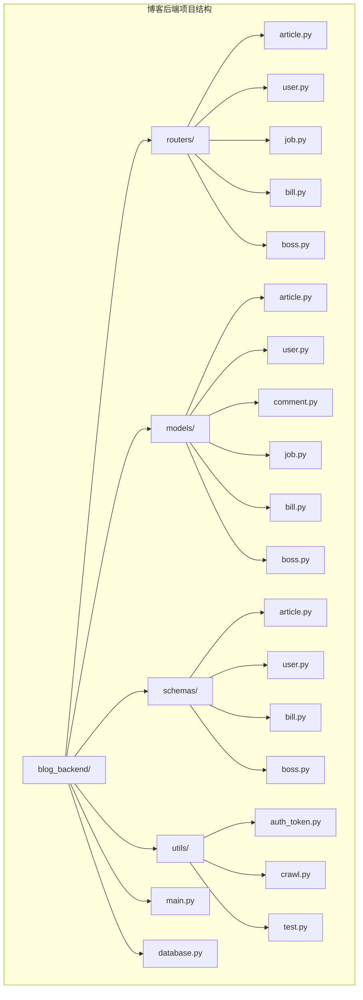
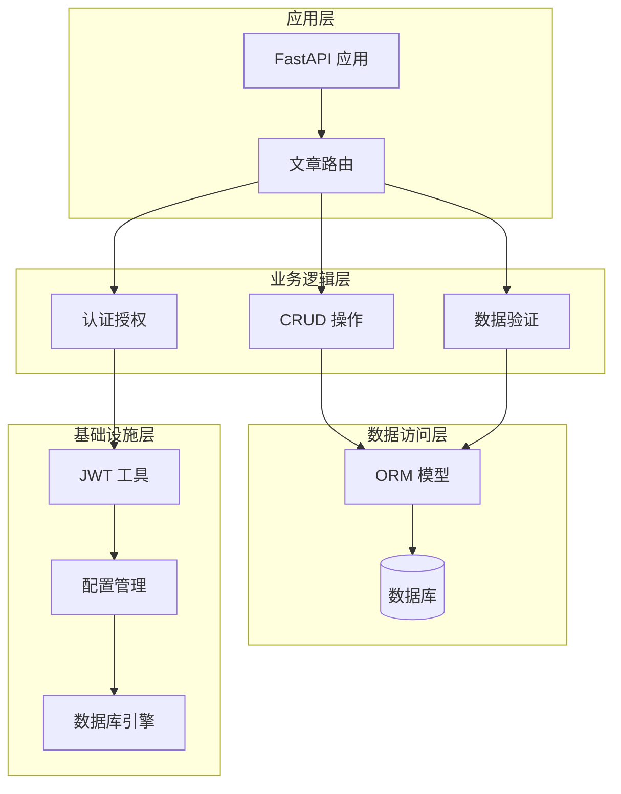
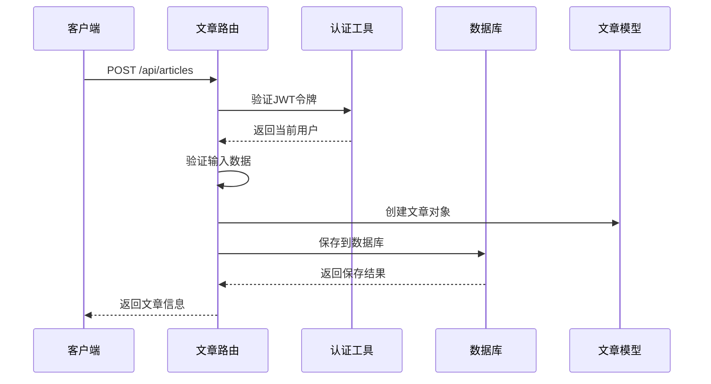
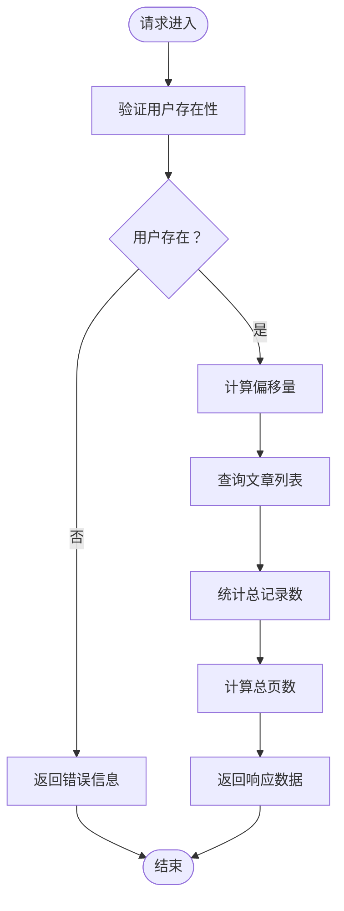
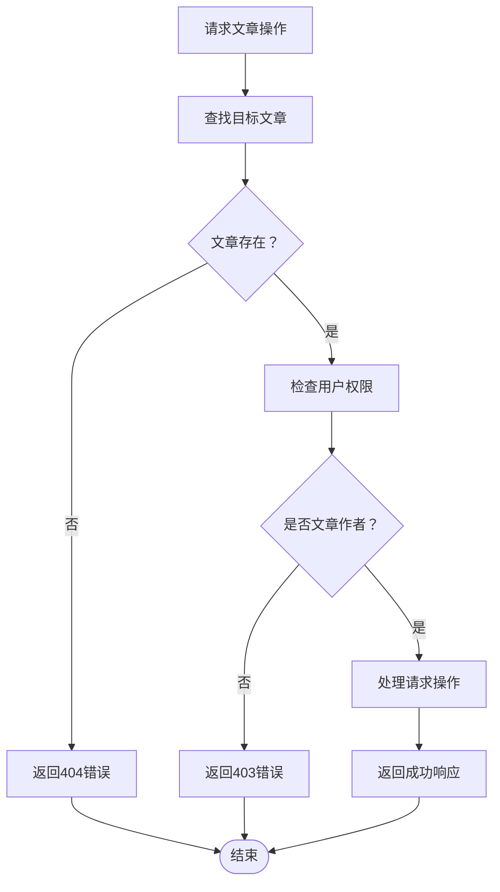
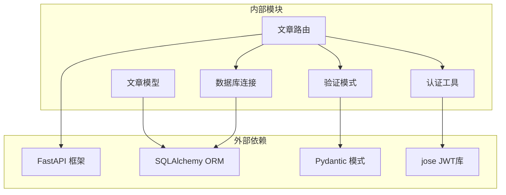
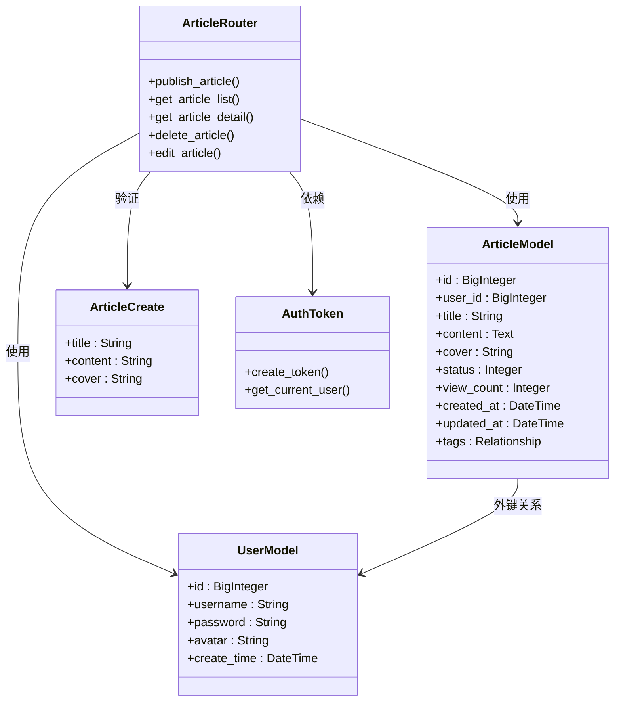

# 文章管理路由

<cite>
**本文档引用的文件**
- [article.py](file://blog_backend/routers/article.py)
- [article.py](file://blog_backend/models/article.py)
- [article.py](file://blog_backend/schemas/article.py)
- [main.py](file://blog_backend/main.py)
- [database.py](file://blog_backend/database.py)
- [auth_token.py](file://blog_backend/utils/auth_token.py)
- [user.py](file://blog_backend/models/user.py)
- [config.py](file://blog_backend/config.py)
</cite>

## 目录
1. [简介](#简介)
2. [项目结构](#项目结构)
3. [核心组件](#核心组件)
4. [架构概览](#架构概览)
5. [详细组件分析](#详细组件分析)
6. [依赖关系分析](#依赖关系分析)
7. [性能考虑](#性能考虑)
8. [故障排除指南](#故障排除指南)
9. [结论](#结论)

## 简介

本文档详细介绍了博客系统中文章管理路由模块的技术实现。该模块实现了完整的文章CRUD操作，包括文章创建、编辑、删除、查询和详情获取功能。同时涵盖了用户认证授权、数据验证、分页查询等核心功能特性。

文章管理路由模块基于FastAPI框架构建，使用SQLAlchemy进行数据库操作，采用JWT令牌进行用户身份验证，实现了RESTful API设计原则。

## 项目结构

文章管理路由模块位于博客后端项目的特定目录结构中，采用按功能模块组织的方式：

**图表来源**
- [main.py:1-13](file://blog_backend/main.py#L1-L13)
- [article.py:1-85](file://blog_backend/routers/article.py#L1-L85)

**章节来源**
- [main.py:1-13](file://blog_backend/main.py#L1-L13)
- [article.py:1-85](file://blog_backend/routers/article.py#L1-L85)

## 核心组件

### 路由器组件

文章管理路由器是整个模块的核心，负责处理所有与文章相关的HTTP请求。它继承自FastAPI的APIRouter类，提供了完整的RESTful接口。

### 数据模型组件

文章数据模型定义了数据库表结构和实体关系，包括文章表、标签表以及多对多关联表的设计。

### 验证模式组件

文章验证模式确保输入数据的完整性和正确性，通过Pydantic模型实现数据验证和序列化。

### 认证工具组件

JWT认证工具提供了用户身份验证和授权功能，确保只有合法用户才能访问受保护的资源。

**章节来源**
- [article.py:1-85](file://blog_backend/routers/article.py#L1-L85)
- [article.py:1-41](file://blog_backend/models/article.py#L1-L41)
- [article.py:1-10](file://blog_backend/schemas/article.py#L1-L10)
- [auth_token.py:1-38](file://blog_backend/utils/auth_token.py#L1-L38)

## 架构概览

文章管理路由模块采用分层架构设计，各层职责明确，耦合度低：

**图表来源**
- [main.py:1-13](file://blog_backend/main.py#L1-L13)
- [article.py:1-85](file://blog_backend/routers/article.py#L1-L85)
- [database.py:1-18](file://blog_backend/database.py#L1-L18)
- [auth_token.py:1-38](file://blog_backend/utils/auth_token.py#L1-L38)

## 详细组件分析

### 文章路由实现

文章路由模块提供了完整的CRUD操作接口，每个操作都经过精心设计以确保数据一致性和安全性。

#### 创建文章路由

创建文章路由处理POST请求，用于发布新文章。该路由实现了以下功能：

- 用户身份验证：通过JWT令牌验证用户身份
- 数据验证：使用ArticleCreate模式验证输入数据
- 数据持久化：将文章信息保存到数据库
- 响应格式：返回创建成功的文章信息

**图表来源**
- [article.py:12-25](file://blog_backend/routers/article.py#L12-L25)
- [auth_token.py:22-37](file://blog_backend/utils/auth_token.py#L22-L37)

#### 用户文章列表路由

用户文章列表路由支持分页查询功能，允许用户按页获取自己的文章列表。

主要特性：
- 用户存在性验证
- 分页参数处理（页码、页面大小）
- 总记录数计算
- 总页数计算

**图表来源**
- [article.py:29-43](file://blog_backend/routers/article.py#L29-L43)

#### 文章详情路由

文章详情路由提供单篇文章的详细信息，包括文章内容和作者信息。

关键功能：
- 文章存在性检查
- 作者信息关联查询
- 结构化响应格式

**章节来源**
- [article.py:12-25](file://blog_backend/routers/article.py#L12-L25)
- [article.py:29-43](file://blog_backend/routers/article.py#L29-L43)
- [article.py:46-53](file://blog_backend/routers/article.py#L46-L53)

### 权限控制机制

文章管理模块实现了严格的权限控制，确保用户只能操作自己的文章。

**图表来源**
- [article.py:56-68](file://blog_backend/routers/article.py#L56-L68)
- [article.py:70-85](file://blog_backend/routers/article.py#L70-L85)

**章节来源**
- [article.py:56-68](file://blog_backend/routers/article.py#L56-L68)
- [article.py:70-85](file://blog_backend/routers/article.py#L70-L85)

### 数据验证机制

数据验证在多个层面进行，确保数据的完整性和一致性：

#### 输入数据验证

使用Pydantic模型进行数据验证，确保：
- 必填字段验证
- 数据类型检查
- 默认值处理

#### 数据库约束验证

通过SQLAlchemy ORM进行额外的数据约束检查，包括：
- 外键关系验证
- 唯一性约束
- 长度限制

**章节来源**
- [article.py:1-10](file://blog_backend/schemas/article.py#L1-L10)
- [article.py:15-41](file://blog_backend/models/article.py#L15-L41)

### 错误处理机制

文章管理模块实现了完善的错误处理机制，提供清晰的错误信息：

| HTTP状态码 | 错误类型 | 描述 |
|------------|----------|------|
| 404 | 文章不存在 | 请求的文章ID不存在 |
| 403 | 权限不足 | 当前用户不是文章作者 |
| 401 | 未授权 | JWT令牌无效或用户不存在 |
| 200 | 用户不存在 | 指定用户名的用户不存在 |

**章节来源**
- [article.py:33-34](file://blog_backend/routers/article.py#L33-L34)
- [article.py:50-51](file://blog_backend/routers/article.py#L50-L51)
- [article.py:63-64](file://blog_backend/routers/article.py#L63-L64)
- [auth_token.py:28-31](file://blog_backend/utils/auth_token.py#L28-L31)

## 依赖关系分析

文章管理路由模块的依赖关系清晰明确，遵循依赖倒置原则：

**图表来源**
- [article.py:1-85](file://blog_backend/routers/article.py#L1-L85)
- [article.py:1-41](file://blog_backend/models/article.py#L1-L41)
- [article.py:1-10](file://blog_backend/schemas/article.py#L1-L10)
- [auth_token.py:1-38](file://blog_backend/utils/auth_token.py#L1-L38)
- [database.py:1-18](file://blog_backend/database.py#L1-L18)

### 组件间交互

文章路由模块内部组件之间的交互关系如下：

**图表来源**
- [article.py:1-85](file://blog_backend/routers/article.py#L1-L85)
- [article.py:15-41](file://blog_backend/models/article.py#L15-L41)
- [article.py:1-10](file://blog_backend/schemas/article.py#L1-L10)
- [auth_token.py:1-38](file://blog_backend/utils/auth_token.py#L1-L38)

**章节来源**
- [article.py:1-85](file://blog_backend/routers/article.py#L1-L85)
- [article.py:15-41](file://blog_backend/models/article.py#L15-L41)
- [article.py:1-10](file://blog_backend/schemas/article.py#L1-L10)
- [auth_token.py:1-38](file://blog_backend/utils/auth_token.py#L1-L38)

## 性能考虑

### 数据库查询优化

文章管理模块在数据库查询方面采用了多项优化策略：

1. **分页查询优化**：使用OFFSET和LIMIT实现高效分页
2. **索引利用**：合理使用外键索引提高查询性能
3. **批量操作**：减少数据库往返次数

### 缓存策略

虽然当前实现未包含缓存层，但建议在未来版本中考虑：
- 文章详情缓存
- 用户文章列表缓存
- 标签统计缓存

### 并发处理

JWT认证工具提供了线程安全的用户验证机制，确保在高并发场景下的稳定性。

## 故障排除指南

### 常见问题及解决方案

#### JWT认证失败
**症状**：返回401状态码
**原因**：
- 令牌过期
- 令牌格式不正确
- 用户不存在

**解决方案**：
1. 重新登录获取新令牌
2. 检查令牌格式和有效期
3. 确认用户账户状态

#### 文章操作权限错误
**症状**：返回403状态码
**原因**：
- 当前用户不是文章作者
- 文章ID不正确

**解决方案**：
1. 确认当前登录用户身份
2. 检查文章ID是否正确
3. 验证用户与文章的关联关系

#### 数据库连接问题
**症状**：操作超时或连接失败
**原因**：
- 数据库服务不可用
- 连接池耗尽
- SQL语法错误

**解决方案**：
1. 检查数据库服务状态
2. 调整连接池配置
3. 查看数据库日志

**章节来源**
- [auth_token.py:28-31](file://blog_backend/utils/auth_token.py#L28-L31)
- [article.py:63-64](file://blog_backend/routers/article.py#L63-L64)
- [article.py:50-51](file://blog_backend/routers/article.py#L50-L51)

## 结论

文章管理路由模块是一个设计良好、功能完整的RESTful API实现。它成功地实现了以下关键特性：

1. **完整的CRUD操作**：支持文章的创建、读取、更新和删除
2. **严格的身份验证**：通过JWT令牌确保用户身份验证
3. **细粒度的权限控制**：确保用户只能操作自己的文章
4. **优雅的错误处理**：提供清晰的错误信息和状态码
5. **可扩展的架构**：模块化设计便于功能扩展

该模块为博客系统的文章管理提供了坚实的基础，为后续的功能扩展和性能优化奠定了良好的基础。通过合理的架构设计和完善的错误处理机制，确保了系统的稳定性和可靠性。