# 智能记账路由

<cite>
**本文档引用的文件**
- [blog.py](file://blog_backend/routers/bill.py)
- [models/bill.py](file://blog_backend/models/bill.py)
- [schemas/bill.py](file://blog_backend/schemas/bill.py)
- [utils/bill.py](file://blog_backend/utils/bill.py)
- [main.py](file://blog_backend/main.py)
- [database.py](file://blog_backend/database.py)
</cite>

## 目录
1. [简介](#简介)
2. [项目结构](#项目结构)
3. [核心组件](#核心组件)
4. [架构概览](#架构概览)
5. [详细组件分析](#详细组件分析)
6. [数据模型与路由映射](#数据模型与路由映射)
7. [文件上传与图像识别流程](#文件上传与图像识别流程)
8. [数据验证与清洗机制](#数据验证与清洗机制)
9. [查询与统计功能](#查询与统计功能)
10. [异常处理机制](#异常处理机制)
11. [性能考虑](#性能考虑)
12. [故障排除指南](#故障排除指南)
13. [结论](#结论)

## 简介

智能记账路由模块是博客后端系统中的核心财务数据管理组件，提供了完整的账单数据上传、存储、查询和分析功能。该模块集成了先进的图像识别技术，能够自动从发票和收据图片中提取结构化财务数据，并通过RESTful API提供统一的数据访问接口。

该模块采用FastAPI框架构建，结合SQLAlchemy ORM进行数据持久化，利用OpenAI的通义千问视觉语言模型实现智能票据识别。系统支持批量文件上传、实时数据验证、灵活的时间范围查询和基础的统计分析功能。

## 项目结构

智能记账路由模块在项目中的组织结构如下：

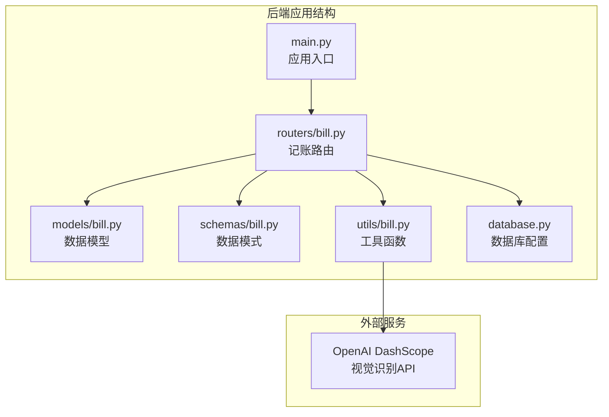

**图表来源**
- [main.py:1-13](file://blog_backend/main.py#L1-L13)
- [routers/bill.py:1-173](file://blog_backend/routers/bill.py#L1-L173)

**章节来源**
- [main.py:1-13](file://blog_backend/main.py#L1-L13)
- [routers/bill.py:1-173](file://blog_backend/routers/bill.py#L1-L173)

## 核心组件

智能记账路由模块由以下核心组件构成：

### 主要路由端点
- **POST /api/actions/bill** - 批量上传图片并识别账单信息
- **POST /api/bills** - 创建单个或批量账单记录
- **GET /api/bills** - 查询账单记录（支持多种时间范围）

### 数据模型层
- **Bill模型** - 定义账单表结构和字段约束
- **BillCreate模式** - 输入数据验证和格式化
- **BillResponse模式** - 输出数据标准化

### 工具层
- **图像识别工具** - 集成OpenAI视觉识别API
- **数据解析器** - 处理LLM返回的JSON数据

**章节来源**
- [routers/bill.py:24-173](file://blog_backend/routers/bill.py#L24-L173)
- [models/bill.py:7-17](file://blog_backend/models/bill.py#L7-L17)
- [schemas/bill.py:7-39](file://blog_backend/schemas/bill.py#L7-L39)

## 架构概览

系统采用分层架构设计，确保关注点分离和代码可维护性：

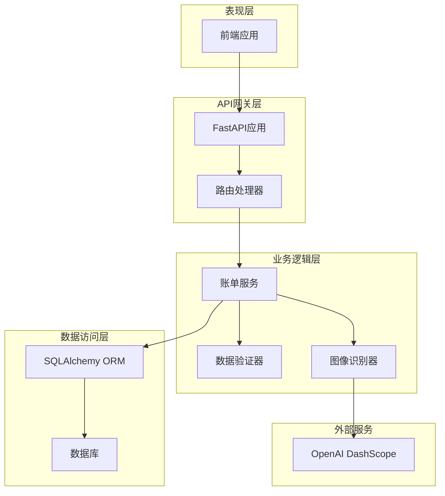

**图表来源**
- [main.py:6-10](file://blog_backend/main.py#L6-L10)
- [routers/bill.py:24-173](file://blog_backend/routers/bill.py#L24-L173)

## 详细组件分析

### 路由处理器组件

#### 图像识别路由 (POST /api/actions/bill)

该路由专门处理图片上传和智能识别任务：

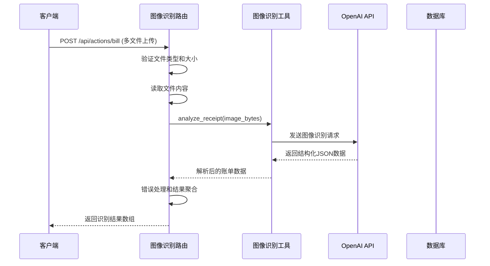

**图表来源**
- [routers/bill.py:24-51](file://blog_backend/routers/bill.py#L24-L51)
- [utils/bill.py:17-77](file://blog_backend/utils/bill.py#L17-L77)

#### 账单创建路由 (POST /api/bills)

支持单个和批量账单创建的统一接口：

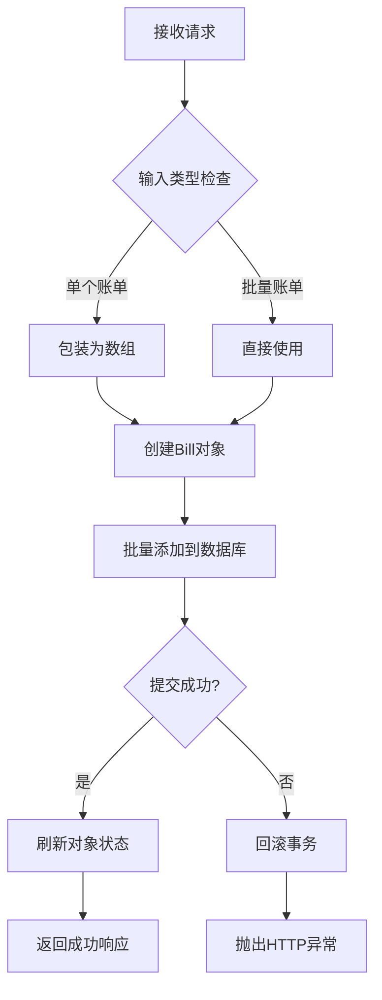

**图表来源**
- [routers/bill.py:55-116](file://blog_backend/routers/bill.py#L55-L116)

#### 账单查询路由 (GET /api/bills)

提供灵活的时间范围查询功能：

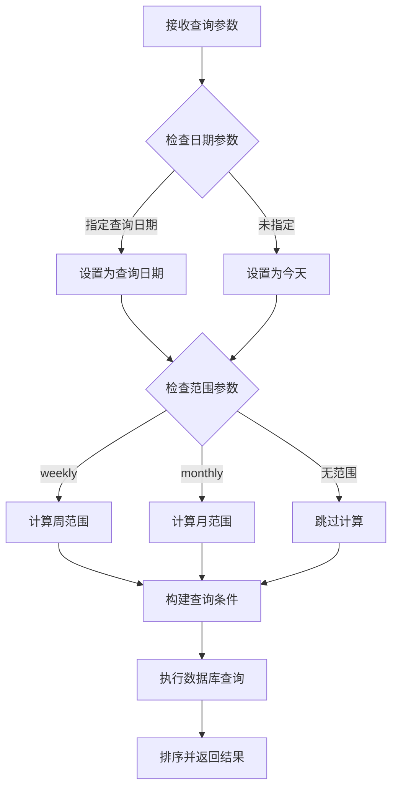

**图表来源**
- [routers/bill.py:117-173](file://blog_backend/routers/bill.py#L117-L173)

**章节来源**
- [routers/bill.py:24-173](file://blog_backend/routers/bill.py#L24-L173)

### 数据模型组件

#### Bill模型定义

账单数据模型采用SQLAlchemy ORM定义，确保数据完整性和一致性：

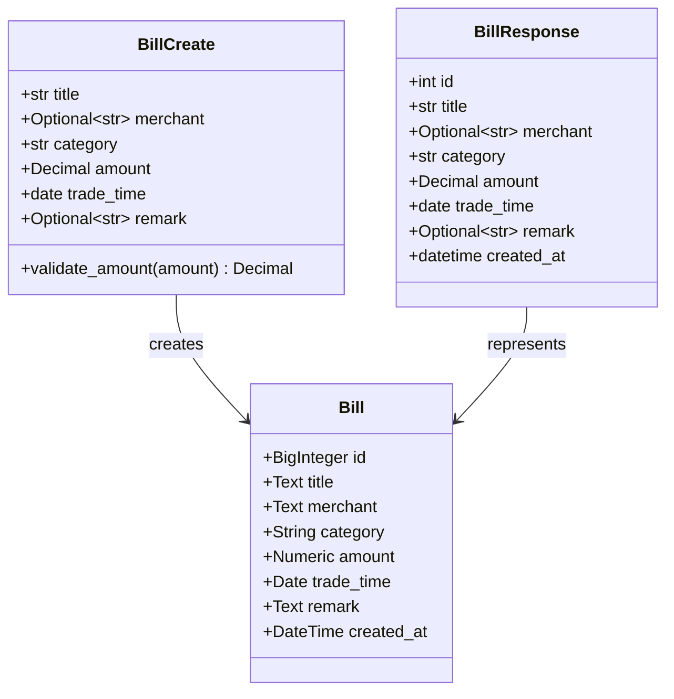

**图表来源**
- [models/bill.py:7-17](file://blog_backend/models/bill.py#L7-L17)
- [schemas/bill.py:7-39](file://blog_backend/schemas/bill.py#L7-L39)

**章节来源**
- [models/bill.py:7-17](file://blog_backend/models/bill.py#L7-L17)
- [schemas/bill.py:7-39](file://blog_backend/schemas/bill.py#L7-L39)

### 工具组件

#### 图像识别工具

集成OpenAI DashScope视觉识别API，实现智能票据分析：

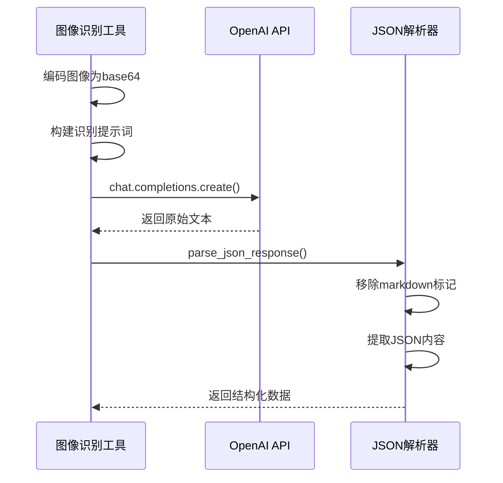

**图表来源**
- [utils/bill.py:17-107](file://blog_backend/utils/bill.py#L17-L107)

**章节来源**
- [utils/bill.py:17-107](file://blog_backend/utils/bill.py#L17-L107)

## 数据模型与路由映射

智能记账路由模块实现了完整的数据流映射，确保各层之间的清晰职责分离：

```mermaid
erDiagram
BILL {
bigint id PK
text title
text merchant
varchar category
numeric amount
date trade_time
text remark
datetime created_at
}
subgraph "路由层"
CREATE_BILL_ROUTE [POST /api/bills]
QUERY_BILL_ROUTE [GET /api/bills]
ANALYZE_BILL_ROUTE [POST /api/actions/bill]
end
subgraph "模式层"
BILL_CREATE [BillCreate]
BILL_RESPONSE [BillResponse]
end
subgraph "工具层"
IMAGE_ANALYZER [analyze_receipt]
end
CREATE_BILL_ROUTE ||--|| BILL_CREATE : validates
CREATE_BILL_ROUTE ||--o{ BILL : creates
QUERY_BILL_ROUTE ||--o{ BILL : queries
ANALYZE_BILL_ROUTE ||--|| IMAGE_ANALYZER : uses
IMAGE_ANALYZER ||--o{ BILL_CREATE : produces
```

**图表来源**
- [models/bill.py:7-17](file://blog_backend/models/bill.py#L7-L17)
- [schemas/bill.py:7-39](file://blog_backend/schemas/bill.py#L7-L39)
- [routers/bill.py:24-173](file://blog_backend/routers/bill.py#L24-L173)

**章节来源**
- [models/bill.py:7-17](file://blog_backend/models/bill.py#L7-L17)
- [schemas/bill.py:7-39](file://blog_backend/schemas/bill.py#L7-L39)
- [routers/bill.py:24-173](file://blog_backend/routers/bill.py#L24-L173)

## 文件上传与图像识别流程

### 文件上传处理机制

系统支持多文件批量上传，采用异步处理确保良好的用户体验：

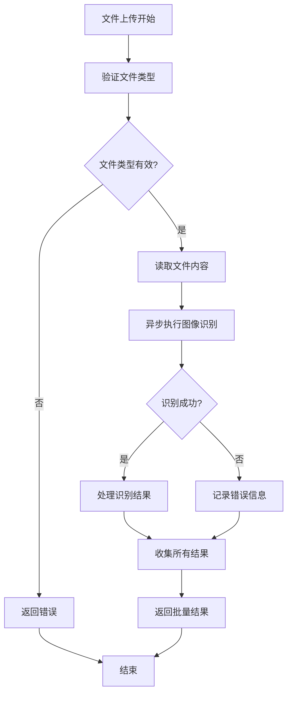

**图表来源**
- [routers/bill.py:24-51](file://blog_backend/routers/bill.py#L24-L51)

### 图像识别工作流程

集成OpenAI视觉语言模型的完整识别流程：

1. **图像预处理**：将二进制图像数据编码为base64格式
2. **提示工程**：构建详细的识别指令和JSON输出规范
3. **模型调用**：通过DashScope API发送识别请求
4. **结果解析**：提取并验证LLM返回的JSON数据
5. **错误处理**：优雅处理识别失败和格式错误

**章节来源**
- [routers/bill.py:24-51](file://blog_backend/routers/bill.py#L24-L51)
- [utils/bill.py:17-107](file://blog_backend/utils/bill.py#L17-L107)

## 数据验证与清洗机制

### 输入验证策略

系统在多个层面实施严格的数据验证：

#### Pydantic模型验证
- **字符串长度限制**：防止超长输入导致的数据库问题
- **数值范围验证**：确保金额为正数且精度正确
- **日期格式验证**：保证交易时间的有效性
- **枚举值验证**：限制分类字段的可选值范围

#### 数据清洗规则
- **金额格式化**：自动保留两位小数
- **字符串清理**：去除多余空白字符
- **类型转换**：确保数据类型的一致性

### 数据库约束

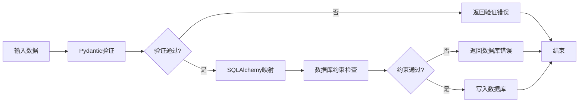

**图表来源**
- [schemas/bill.py:16-22](file://blog_backend/schemas/bill.py#L16-L22)
- [models/bill.py:10-17](file://blog_backend/models/bill.py#L10-L17)

**章节来源**
- [schemas/bill.py:7-39](file://blog_backend/schemas/bill.py#L7-L39)
- [models/bill.py:7-17](file://blog_backend/models/bill.py#L7-L17)

## 查询与统计功能

### 时间范围查询

系统提供灵活的时间范围查询选项：

#### 支持的查询模式
- **按天查询**：指定具体日期
- **按周查询**：自动计算最近7天范围
- **按月查询**：自动计算当月起止日期
- **自定义范围**：同时指定开始和结束日期

#### 查询优化
- **索引友好**：trade_time字段适合范围查询
- **排序策略**：按交易时间和ID降序排列
- **性能考虑**：合理使用数据库索引

### 结果集处理

查询结果经过标准化处理，确保前后端数据一致性：

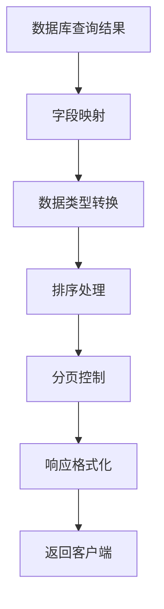

**图表来源**
- [routers/bill.py:117-173](file://blog_backend/routers/bill.py#L117-L173)

**章节来源**
- [routers/bill.py:117-173](file://blog_backend/routers/bill.py#L117-L173)

## 异常处理机制

### 错误分类与处理

系统采用分层异常处理策略：

#### 路由层异常
- **HTTP异常**：统一的HTTP状态码和错误消息
- **文件处理异常**：文件读取和格式错误
- **业务逻辑异常**：数据验证和业务规则检查

#### 数据库异常
- **事务回滚**：确保数据一致性
- **连接管理**：正确的数据库连接生命周期
- **并发控制**：避免并发访问冲突

#### 外部服务异常
- **API调用失败**：网络错误和超时处理
- **响应解析失败**：JSON格式和数据完整性检查
- **资源限制**：API配额和速率限制

### 错误恢复策略

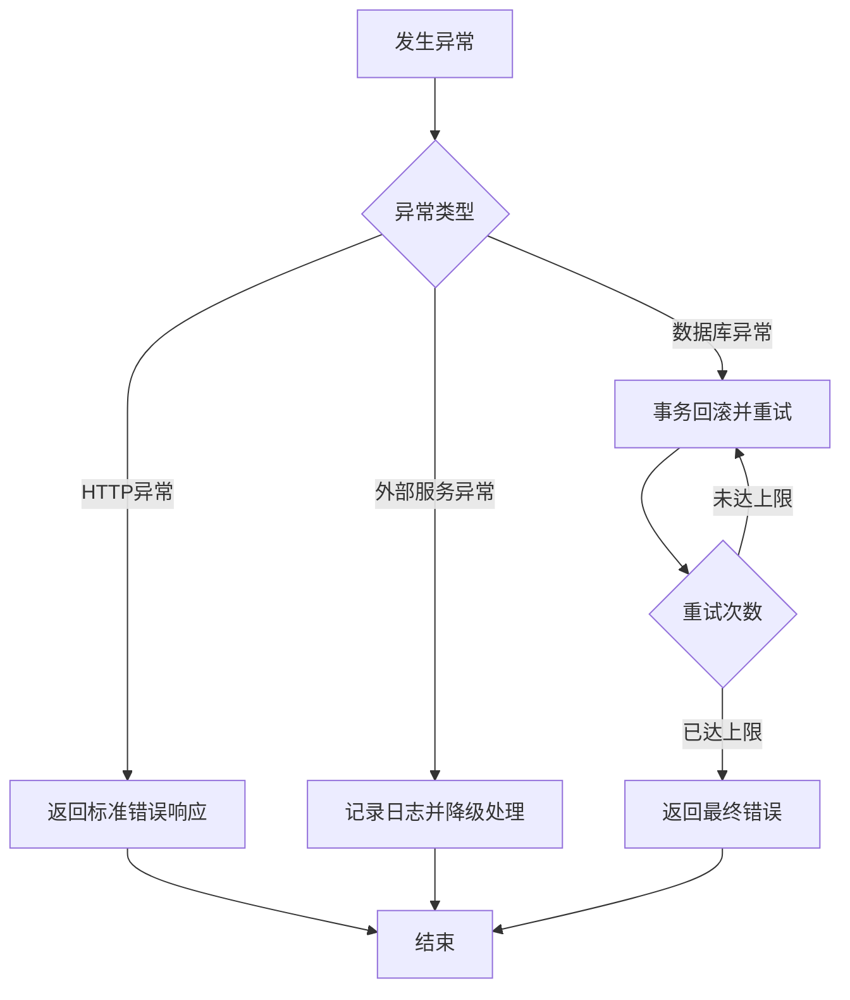

**图表来源**
- [routers/bill.py:110-115](file://blog_backend/routers/bill.py#L110-L115)
- [utils/bill.py:75-76](file://blog_backend/utils/bill.py#L75-L76)

**章节来源**
- [routers/bill.py:110-115](file://blog_backend/routers/bill.py#L110-L115)
- [utils/bill.py:75-76](file://blog_backend/utils/bill.py#L75-L76)

## 性能考虑

### 并发处理

系统采用异步编程模型优化性能：

#### 异步I/O操作
- **文件读取**：非阻塞的文件内容读取
- **数据库操作**：异步数据库连接池
- **外部API调用**：并发的图像识别请求

#### 线程池管理
- **CPU密集型任务**：在独立线程池中执行
- **I/O密集型任务**：使用异步事件循环
- **资源限制**：合理的并发数量控制

### 缓存策略

虽然当前版本未实现缓存，但系统设计支持后续扩展：

#### 可缓存的数据
- **静态配置**：分类字典和验证规则
- **查询结果**：常用查询的聚合结果
- **识别模板**：常用的识别提示词

#### 缓存层次
- **应用层缓存**：内存中的临时缓存
- **数据库缓存**：查询结果的持久化缓存
- **CDN缓存**：静态资源的分布式缓存

## 故障排除指南

### 常见问题诊断

#### 图像识别失败
1. **检查API密钥**：确认DashScope API密钥有效
2. **验证图像格式**：支持JPEG、PNG等常见格式
3. **检查网络连接**：确保能够访问DashScope服务
4. **查看日志输出**：分析具体的错误信息

#### 数据库连接问题
1. **检查连接字符串**：验证数据库URL格式
2. **确认数据库服务**：确保PostgreSQL服务正常运行
3. **检查权限设置**：验证数据库用户权限
4. **监控连接池**：避免连接数过多

#### 文件上传限制
1. **检查文件大小**：确认不超过服务器限制
2. **验证文件类型**：确保为允许的图像格式
3. **检查磁盘空间**：确保有足够的存储空间

### 调试技巧

#### 开发环境调试
- **启用详细日志**：使用DEBUG级别获取完整信息
- **单元测试**：编写针对关键功能的测试用例
- **API测试**：使用Postman或curl验证接口行为

#### 生产环境监控
- **性能指标**：监控响应时间和吞吐量
- **错误率统计**：跟踪各类错误的发生频率
- **资源使用**：监控CPU、内存和数据库负载

**章节来源**
- [utils/bill.py:9-15](file://blog_backend/utils/bill.py#L9-L15)
- [database.py:12-18](file://blog_backend/database.py#L12-L18)

## 结论

智能记账路由模块展现了现代Web应用的最佳实践，通过以下关键特性实现了高效的财务数据管理：

### 技术优势
- **模块化设计**：清晰的分层架构确保了代码的可维护性
- **异步处理**：充分利用异步编程提升系统性能
- **数据验证**：多层次的数据验证确保了数据质量
- **错误处理**：完善的异常处理机制提升了系统稳定性

### 功能特色
- **智能识别**：集成先进的视觉识别技术
- **灵活查询**：支持多种时间范围和过滤条件
- **批量处理**：高效处理大量账单数据
- **标准化输出**：统一的数据格式便于前端处理

### 扩展潜力
系统为未来的功能扩展预留了充足的空间，包括：
- 更丰富的统计分析功能
- 高级数据可视化
- 实时数据同步
- 更多的支付方式支持

该模块为整个博客系统的财务管理提供了坚实的技术基础，通过持续的优化和扩展，将为企业级应用提供可靠的支持。