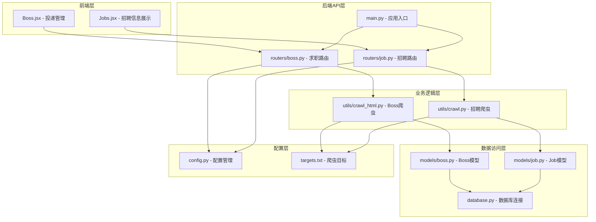
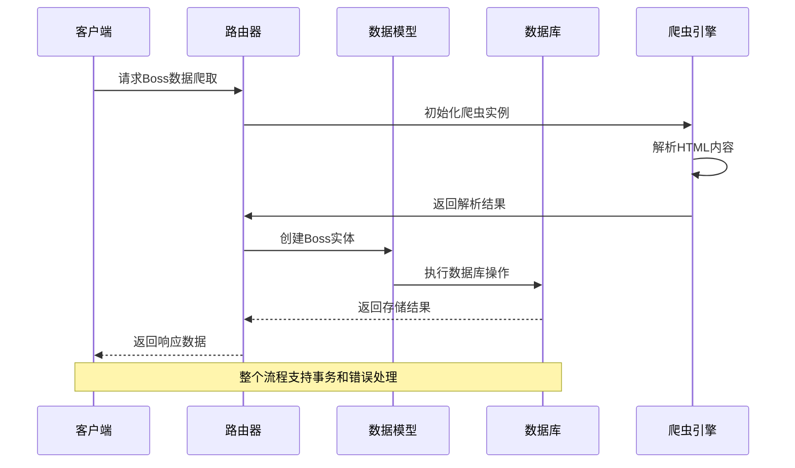
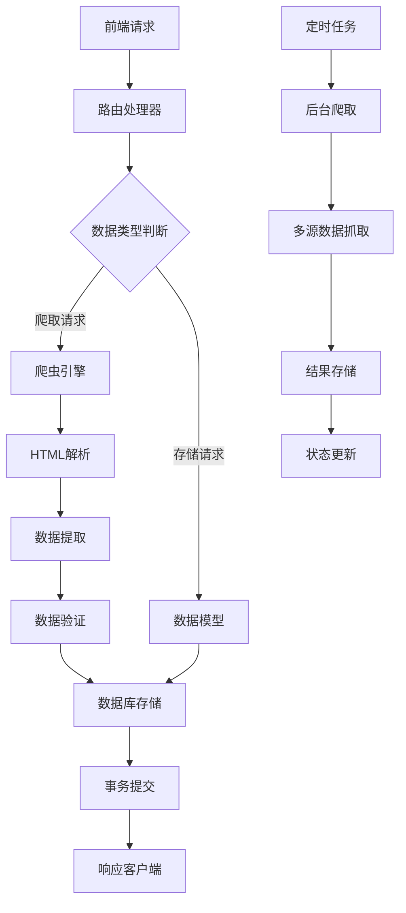
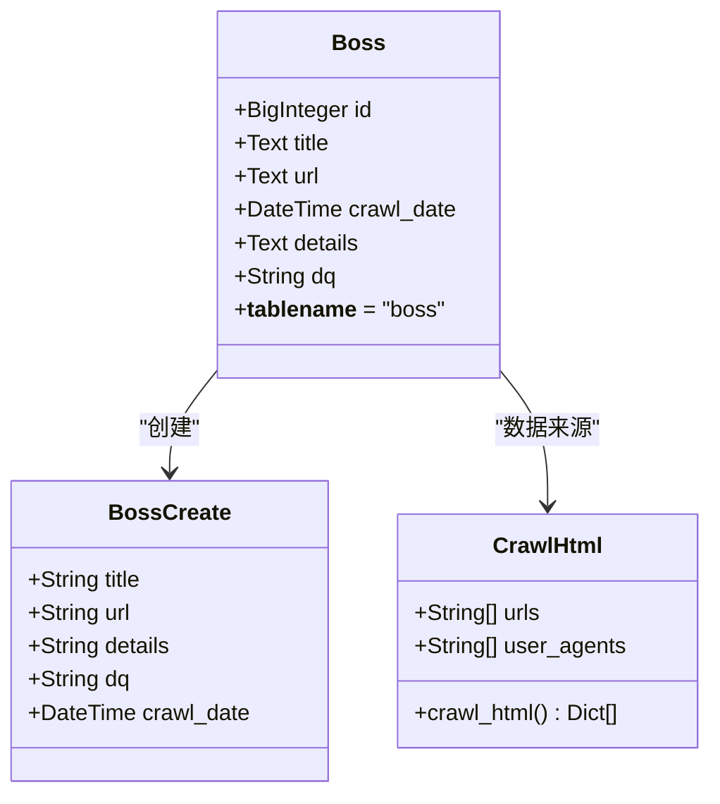
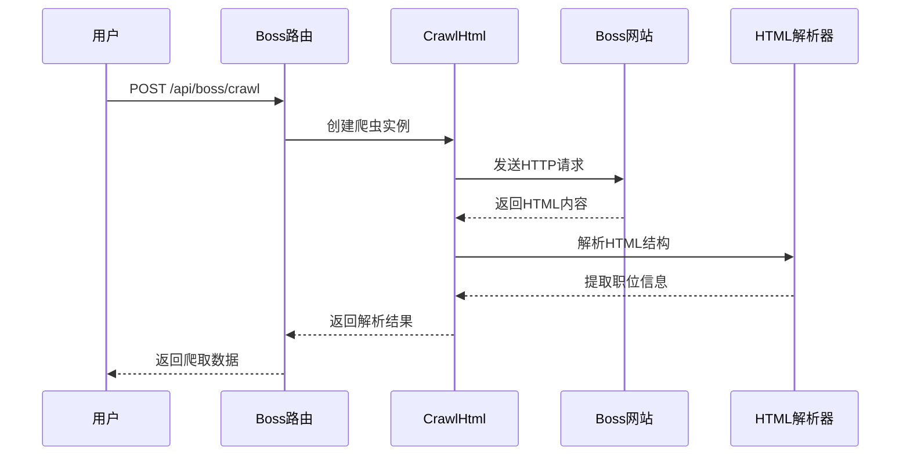
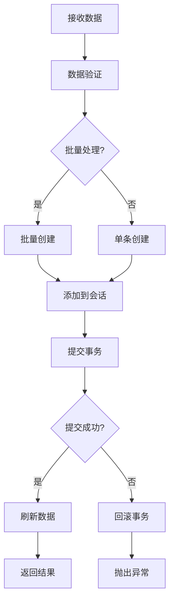
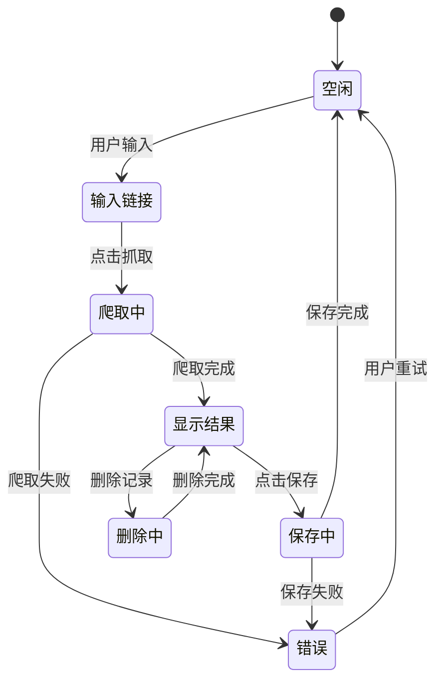
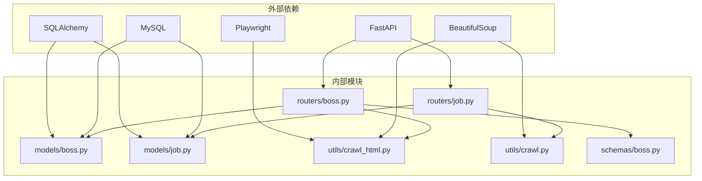
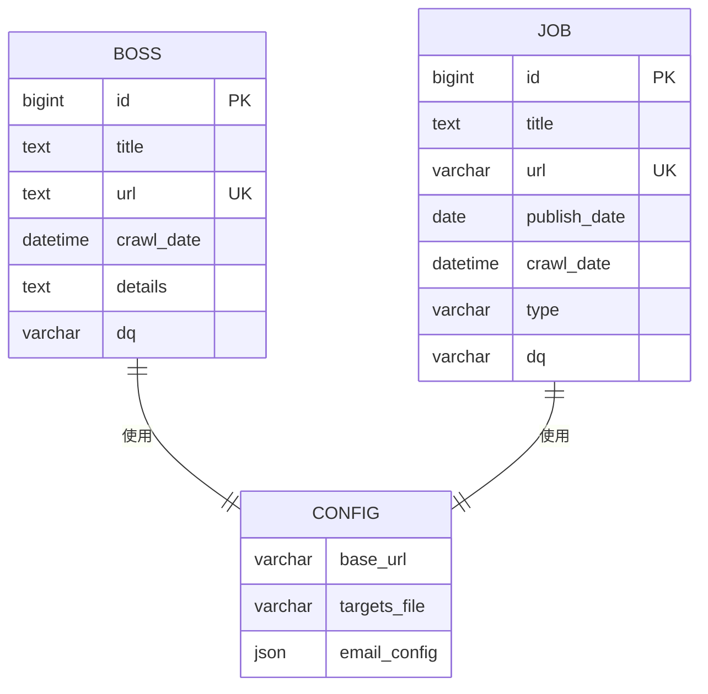

# 求职投递路由

<cite>
**本文档引用的文件**
- [blog_backend/routers/boss.py](file://blog_backend/routers/boss.py)
- [blog_backend/models/boss.py](file://blog_backend/models/boss.py)
- [blog_backend/schemas/boss.py](file://blog_backend/schemas/boss.py)
- [blog_backend/utils/crawl_html.py](file://blog_backend/utils/crawl_html.py)
- [blog_backend/main.py](file://blog_backend/main.py)
- [blog_backend/database.py](file://blog_backend/database.py)
- [blog_backend/config.py](file://blog_backend/config.py)
- [blog_backend/targets.txt](file://blog_backend/targets.txt)
- [blog_backend/routers/job.py](file://blog_backend/routers/job.py)
- [blog_backend/models/job.py](file://blog_backend/models/job.py)
- [blog_backend/utils/crawl.py](file://blog_backend/utils/crawl.py)
- [blog_frontend/src/components/Boss.jsx](file://blog_frontend/src/components/Boss.jsx)
- [blog_frontend/src/components/Jobs.jsx](file://blog_frontend/src/components/Jobs.jsx)
</cite>

## 目录
1. [简介](#简介)
2. [项目结构](#项目结构)
3. [核心组件](#核心组件)
4. [架构概览](#架构概览)
5. [详细组件分析](#详细组件分析)
6. [依赖关系分析](#依赖关系分析)
7. [性能考虑](#性能考虑)
8. [故障排除指南](#故障排除指南)
9. [结论](#结论)

## 简介

本文档详细介绍了博客后端项目中的求职投递路由模块，该模块实现了Boss直聘数据的爬取、存储和管理功能。系统提供了完整的求职投递记录创建、更新和查询功能，包括爬虫数据的解析、存储和同步机制，以及求职进度跟踪、状态管理和数据展示功能。

该系统采用FastAPI框架构建，使用SQLAlchemy进行数据库操作，集成了Playwright和BeautifulSoup进行网页爬取和解析，通过前后端分离的方式提供完整的求职数据管理解决方案。

## 项目结构

项目采用典型的三层架构设计，分为后端API服务、数据库层和前端界面：

**图表来源**
- [blog_backend/main.py:1-13](file://blog_backend/main.py#L1-L13)
- [blog_backend/routers/boss.py:1-134](file://blog_backend/routers/boss.py#L1-L134)
- [blog_backend/routers/job.py:1-97](file://blog_backend/routers/job.py#L1-L97)

**章节来源**
- [blog_backend/main.py:1-13](file://blog_backend/main.py#L1-L13)
- [blog_backend/routers/boss.py:1-134](file://blog_backend/routers/boss.py#L1-L134)
- [blog_backend/routers/job.py:1-97](file://blog_backend/routers/job.py#L1-L97)

## 核心组件

### Boss投递路由模块

Boss投递路由模块负责处理求职投递相关的所有操作，包括数据爬取、存储和查询功能。

#### 主要功能特性

1. **Boss数据爬取**: 支持从Boss直聘网站抓取职位信息
2. **批量数据存储**: 支持单条和批量的Boss记录创建
3. **灵活查询**: 支持按日期范围查询投递记录
4. **数据完整性**: 通过数据库约束确保URL唯一性

#### 关键接口

| 接口 | 方法 | 路径 | 功能描述 |
|------|------|------|----------|
| 爬取Boss数据 | POST | `/api/boss/crawl` | 从Boss直聘抓取职位信息 |
| 创建Boss记录 | POST | `/api/boss` | 创建单条或多条投递记录 |
| 查询Boss记录 | GET | `/api/boss` | 按日期范围查询投递记录 |

**章节来源**
- [blog_backend/routers/boss.py:16-127](file://blog_backend/routers/boss.py#L16-L127)

### 招聘信息路由模块

招聘信息路由模块负责处理招聘数据的爬取、存储和展示功能。

#### 主要功能特性

1. **多源数据爬取**: 支持多个招聘网站的数据抓取
2. **后台任务执行**: 使用异步方式执行爬虫任务
3. **实时状态监控**: 提供爬取任务的实时状态查询
4. **数据可视化**: 通过图表展示招聘数据趋势

#### 关键接口

| 接口 | 方法 | 路径 | 功能描述 |
|------|------|------|----------|
| 触发爬取任务 | POST | `/api/actions/crawl` | 启动后台爬虫任务 |
| 获取爬取结果 | GET | `/api/actions/crawl/result` | 查询爬取任务状态 |
| 查询招聘信息 | GET | `/api/jobs` | 按日期范围查询招聘信息 |

**章节来源**
- [blog_backend/routers/job.py:17-96](file://blog_backend/routers/job.py#L17-L96)

## 架构概览

系统采用分层架构设计，各层职责明确，耦合度低：

**图表来源**
- [blog_backend/routers/boss.py:16-84](file://blog_backend/routers/boss.py#L16-L84)
- [blog_backend/utils/crawl_html.py:18-72](file://blog_backend/utils/crawl_html.py#L18-L72)

### 数据流架构

**图表来源**
- [blog_backend/routers/boss.py:33-84](file://blog_backend/routers/boss.py#L33-L84)
- [blog_backend/routers/job.py:64-87](file://blog_backend/routers/job.py#L64-L87)

## 详细组件分析

### Boss数据模型

Boss数据模型定义了求职投递记录的结构和约束条件：

**图表来源**
- [blog_backend/models/boss.py:5-15](file://blog_backend/models/boss.py#L5-L15)
- [blog_backend/schemas/boss.py:7-14](file://blog_backend/schemas/boss.py#L7-L14)
- [blog_backend/utils/crawl_html.py:8-72](file://blog_backend/utils/crawl_html.py#L8-L72)

#### 数据模型特性

| 字段名 | 类型 | 约束 | 描述 |
|--------|------|------|------|
| id | BigInteger | 主键, 自增 | 数据唯一标识 |
| title | Text | 非空 | 职位标题 |
| url | Text | 非空, 唯一 | 职位链接 |
| crawl_date | DateTime | 非空, 默认当前时间 | 爬取时间 |
| details | Text | 非空 | 职位详情 |
| dq | String(50) | 可空 | 地区信息 |

**章节来源**
- [blog_backend/models/boss.py:1-15](file://blog_backend/models/boss.py#L1-L15)
- [blog_backend/schemas/boss.py:1-14](file://blog_backend/schemas/boss.py#L1-L14)

### Boss爬虫实现

Boss爬虫模块实现了从Boss直聘网站抓取职位信息的功能：

#### 爬取流程

**图表来源**
- [blog_backend/routers/boss.py:16-31](file://blog_backend/routers/boss.py#L16-L31)
- [blog_backend/utils/crawl_html.py:18-72](file://blog_backend/utils/crawl_html.py#L18-L72)

#### 爬取策略

1. **User-Agent轮换**: 使用随机User-Agent池避免反爬虫检测
2. **智能等待**: 模拟人类行为，随机延迟2-5秒
3. **异常处理**: 完善的错误捕获和处理机制
4. **数据提取**: 专门针对Boss直聘网站的HTML结构优化

**章节来源**
- [blog_backend/utils/crawl_html.py:18-72](file://blog_backend/utils/crawl_html.py#L18-L72)

### 数据存储机制

系统采用ORM模式进行数据持久化，支持事务处理和并发控制：

#### 存储流程

**图表来源**
- [blog_backend/routers/boss.py:33-84](file://blog_backend/routers/boss.py#L33-L84)

#### 错误处理机制

| 错误类型 | 处理方式 | 返回状态码 |
|----------|----------|------------|
| 数据库唯一约束冲突 | 回滚事务并返回409 | 409 Conflict |
| 系统内部错误 | 回滚事务并返回500 | 500 Internal Server Error |
| 参数验证失败 | 直接返回422 | 422 Unprocessable Entity |

**章节来源**
- [blog_backend/routers/boss.py:73-84](file://blog_backend/routers/boss.py#L73-L84)

### 前端集成组件

前端组件提供了完整的用户交互界面，支持数据的可视化展示和操作：

#### Boss管理组件

Boss.jsx组件实现了求职投递的完整工作流程：

**图表来源**
- [blog_frontend/src/components/Boss.jsx:11-56](file://blog_frontend/src/components/Boss.jsx#L11-L56)

#### 招聘信息展示组件

Jobs.jsx组件提供了招聘数据的可视化展示功能：

| 功能特性 | 实现方式 | 用户体验 |
|----------|----------|----------|
| 图表展示 | ECharts图表库 | 直观的数据趋势展示 |
| 日期筛选 | 日期选择器组件 | 灵活的时间范围查询 |
| 实时刷新 | 轮询机制 | 最新的数据状态 |
| 分页导航 | 无限滚动 | 流畅的浏览体验 |

**章节来源**
- [blog_frontend/src/components/Boss.jsx:1-145](file://blog_frontend/src/components/Boss.jsx#L1-L145)
- [blog_frontend/src/components/Jobs.jsx:1-362](file://blog_frontend/src/components/Jobs.jsx#L1-L362)

## 依赖关系分析

系统各组件之间的依赖关系清晰，遵循单一职责原则：

**图表来源**
- [blog_backend/routers/boss.py:1-134](file://blog_backend/routers/boss.py#L1-L134)
- [blog_backend/routers/job.py:1-97](file://blog_backend/routers/job.py#L1-L97)

### 数据库依赖关系

**图表来源**
- [blog_backend/models/boss.py:5-15](file://blog_backend/models/boss.py#L5-L15)
- [blog_backend/models/job.py:5-15](file://blog_backend/models/job.py#L5-L15)
- [blog_backend/config.py:19-31](file://blog_backend/config.py#L19-L31)

**章节来源**
- [blog_backend/database.py:1-18](file://blog_backend/database.py#L1-L18)
- [blog_backend/config.py:1-32](file://blog_backend/config.py#L1-L32)

## 性能考虑

### 爬取性能优化

1. **并发控制**: 使用异步方式处理多个爬取请求
2. **资源复用**: 复用浏览器实例减少内存消耗
3. **缓存策略**: 缓存已爬取的URL避免重复请求
4. **超时设置**: 合理的网络超时和页面加载超时

### 数据库性能优化

1. **索引优化**: 为常用查询字段建立索引
2. **批量操作**: 使用批量插入提升写入性能
3. **连接池**: 配置合适的数据库连接池大小
4. **事务管理**: 合理使用事务减少锁竞争

### 前端性能优化

1. **虚拟滚动**: 大数据量时使用虚拟滚动技术
2. **懒加载**: 图片和组件的懒加载机制
3. **缓存策略**: API响应数据的本地缓存
4. **防抖节流**: 用户操作的防抖节流处理

## 故障排除指南

### 常见问题及解决方案

#### 爬取失败问题

| 问题症状 | 可能原因 | 解决方案 |
|----------|----------|----------|
| 页面加载超时 | 网络不稳定或服务器响应慢 | 增加超时时间，重试机制 |
| HTML解析错误 | 网站结构调整 | 更新解析规则，增加容错处理 |
| 反爬虫检测 | User-Agent被识别 | 使用代理IP，轮换User-Agent |
| 数据重复 | URL去重逻辑失效 | 检查数据库唯一约束，优化去重算法 |

#### 数据库连接问题

| 问题症状 | 可能原因 | 解决方案 |
|----------|----------|----------|
| 连接超时 | 数据库负载过高 | 优化查询语句，增加连接池 |
| 连接拒绝 | 认证信息错误 | 检查环境变量配置 |
| 事务死锁 | 并发操作冲突 | 优化事务顺序，减少锁持有时间 |

#### 前端显示问题

| 问题症状 | 可能原因 | 解决方案 |
|----------|----------|----------|
| 图表不显示 | ECharts库加载失败 | 检查CDN链接，本地备份资源 |
| 数据不更新 | 轮询机制异常 | 检查定时器状态，重新启动轮询 |
| 表单验证错误 | 校验规则变更 | 更新前端校验逻辑 |

**章节来源**
- [blog_backend/routers/boss.py:26-30](file://blog_backend/routers/boss.py#L26-L30)
- [blog_backend/utils/crawl_html.py:69-71](file://blog_backend/utils/crawl_html.py#L69-L71)

### 调试工具和方法

1. **日志记录**: 完善的错误日志和调试信息
2. **状态监控**: 实时监控爬取任务状态
3. **性能分析**: 数据库查询性能分析工具
4. **网络调试**: 网络请求和响应的详细记录

## 结论

求职投递路由模块是一个功能完整、架构清晰的求职数据管理系统。系统通过合理的分层设计和模块化实现，提供了从数据爬取、存储到展示的完整解决方案。

### 主要优势

1. **功能完整性**: 覆盖求职数据管理的全流程需求
2. **架构合理性**: 清晰的分层设计和职责分离
3. **扩展性强**: 模块化设计便于功能扩展和维护
4. **用户体验好**: 前后端分离提供良好的交互体验

### 改进建议

1. **监控告警**: 增加更完善的监控和告警机制
2. **缓存优化**: 引入Redis等缓存层提升性能
3. **安全加固**: 增强API安全和数据保护措施
4. **测试覆盖**: 提升单元测试和集成测试覆盖率

该系统为求职者提供了便捷的职位信息管理工具，通过自动化爬取和智能分析帮助用户更好地跟踪求职进度和管理求职数据。