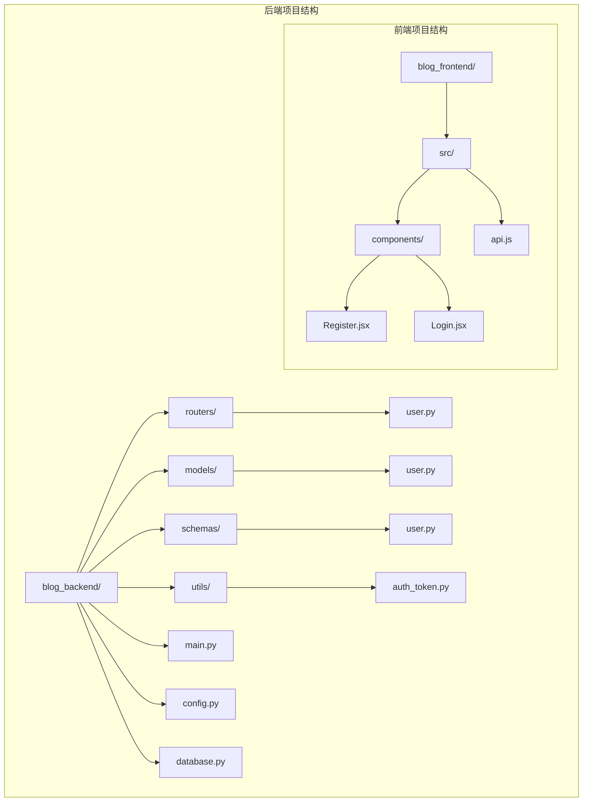
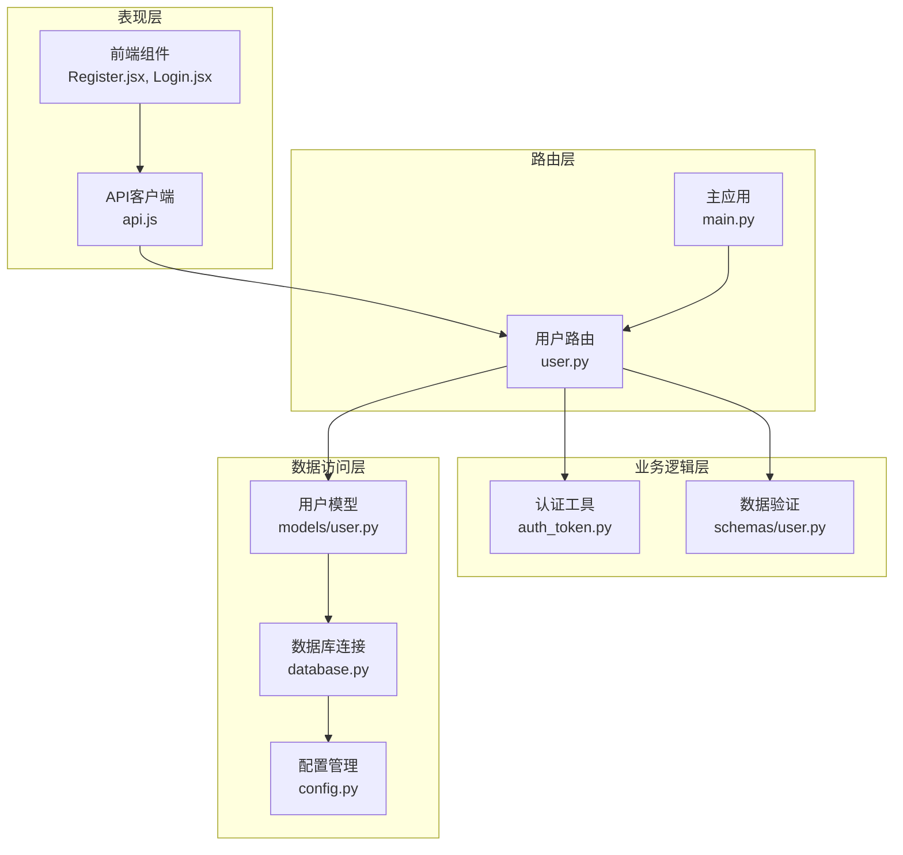
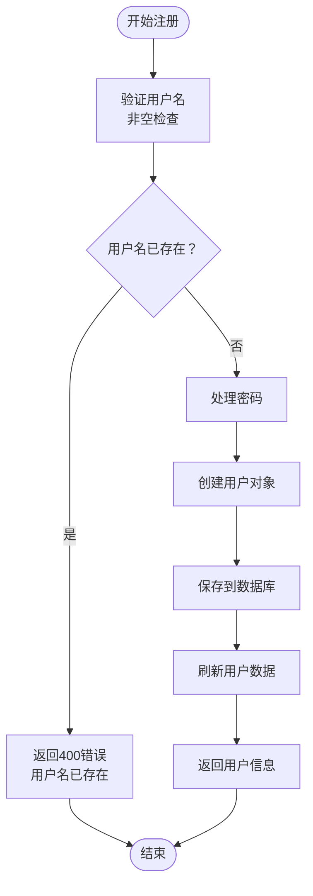
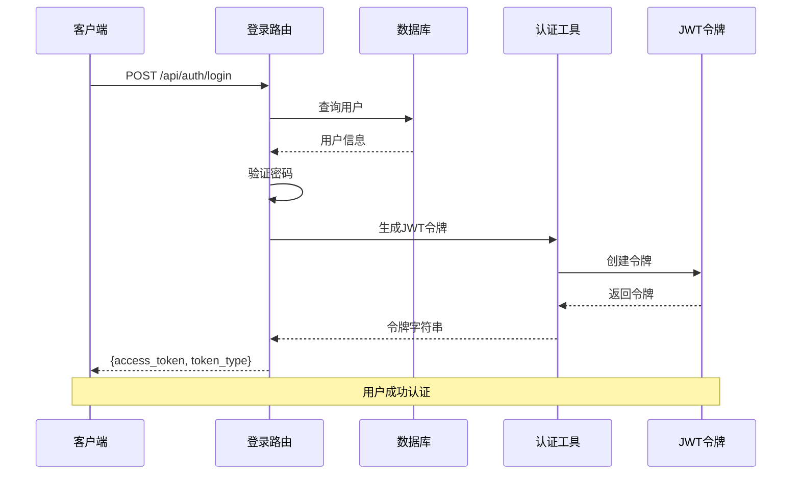
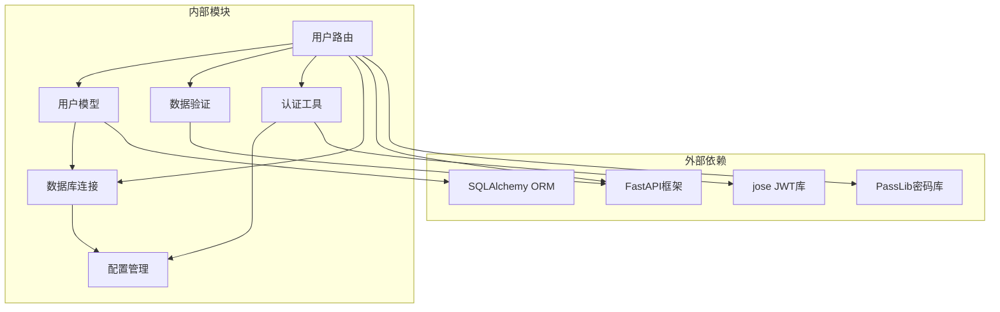

# 用户管理路由

<cite>
**本文档引用的文件**
- [blog_backend/routers/user.py](file://blog_backend/routers/user.py)
- [blog_backend/models/user.py](file://blog_backend/models/user.py)
- [blog_backend/schemas/user.py](file://blog_backend/schemas/user.py)
- [blog_backend/utils/auth_token.py](file://blog_backend/utils/auth_token.py)
- [blog_backend/main.py](file://blog_backend/main.py)
- [blog_backend/config.py](file://blog_backend/config.py)
- [blog_backend/database.py](file://blog_backend/database.py)
- [blog_backend/schemas/__init__.py](file://blog_backend/schemas/__init__.py)
- [blog_backend/models/__init__.py](file://blog_backend/models/__init__.py)
- [blog_frontend/src/components/Register.jsx](file://blog_frontend/src/components/Register.jsx)
- [blog_frontend/src/components/Login.jsx](file://blog_frontend/src/components/Login.jsx)
- [blog_frontend/src/api.js](file://blog_frontend/src/api.js)
</cite>

## 目录
1. [简介](#简介)
2. [项目结构](#项目结构)
3. [核心组件](#核心组件)
4. [架构概览](#架构概览)
5. [详细组件分析](#详细组件分析)
6. [依赖关系分析](#依赖关系分析)
7. [性能考虑](#性能考虑)
8. [故障排除指南](#故障排除指南)
9. [结论](#结论)

## 简介

用户管理路由模块是博客后端系统的核心功能模块之一，负责处理用户相关的所有HTTP请求。该模块实现了完整的用户生命周期管理，包括用户注册、登录认证、用户信息查询等功能。基于FastAPI框架构建，采用现代化的异步编程模式和类型安全的Pydantic模型进行数据验证。

本模块采用分层架构设计，将路由处理、数据模型、业务逻辑和数据访问层清晰分离，确保了代码的可维护性和可扩展性。通过JWT（JSON Web Token）实现无状态认证，支持跨域访问和移动端集成。

## 项目结构

用户管理路由模块位于`blog_backend/routers/`目录下，采用按功能模块划分的组织方式：

**图表来源**
- [blog_backend/routers/user.py:1-101](file://blog_backend/routers/user.py#L1-L101)
- [blog_backend/models/user.py:1-14](file://blog_backend/models/user.py#L1-L14)
- [blog_backend/schemas/user.py:1-13](file://blog_backend/schemas/user.py#L1-L13)

**章节来源**
- [blog_backend/routers/user.py:1-101](file://blog_backend/routers/user.py#L1-L101)
- [blog_backend/main.py:1-13](file://blog_backend/main.py#L1-L13)

## 核心组件

### 路由器定义

用户管理路由器在`routers/user.py`中定义，使用FastAPI的APIRouter类创建独立的路由模块。路由器实例化后通过主应用的`include_router`方法注册到全局应用中。

### 数据模型

用户数据模型定义在`models/user.py`中，使用SQLAlchemy ORM映射到数据库表。模型包含以下关键字段：
- `id`: 主键，自增整数
- `username`: 用户名，唯一约束
- `password`: 密码字段
- `avatar`: 头像URL
- `create_time`: 创建时间，默认当前时间

### 数据验证模型

用户注册和登录的数据验证模型定义在`schemas/user.py`中，使用Pydantic BaseModel进行输入验证：
- `UserRegister`: 注册时使用的模型，包含用户名、密码和头像
- `UserLogin`: 登录时使用的模型，包含用户名和密码

### 认证工具

认证相关的工具函数定义在`utils/auth_token.py`中，提供JWT令牌的生成和解析功能：
- `create_token()`: 生成JWT访问令牌
- `get_current_user()`: 验证令牌并获取当前用户

**章节来源**
- [blog_backend/routers/user.py:13-13](file://blog_backend/routers/user.py#L13-L13)
- [blog_backend/models/user.py:5-14](file://blog_backend/models/user.py#L5-L14)
- [blog_backend/schemas/user.py:6-13](file://blog_backend/schemas/user.py#L6-L13)
- [blog_backend/utils/auth_token.py:12-38](file://blog_backend/utils/auth_token.py#L12-L38)

## 架构概览

用户管理路由模块采用分层架构设计，各层职责明确，耦合度低：

**图表来源**
- [blog_backend/main.py:6-6](file://blog_backend/main.py#L6-L6)
- [blog_backend/routers/user.py:1-12](file://blog_backend/routers/user.py#L1-L12)
- [blog_backend/utils/auth_token.py:1-38](file://blog_backend/utils/auth_token.py#L1-L38)
- [blog_backend/models/user.py:1-14](file://blog_backend/models/user.py#L1-L14)

## 详细组件分析

### 用户注册功能

用户注册功能实现了完整的用户创建流程，包含输入验证、重复检查和数据库持久化。

#### 路由端点设计

注册路由使用POST方法，端点为`/api/users`，返回新创建的用户对象。

#### 参数验证流程

**图表来源**
- [blog_backend/routers/user.py:16-33](file://blog_backend/routers/user.py#L16-L33)
- [blog_backend/schemas/user.py:6-9](file://blog_backend/schemas/user.py#L6-L9)

#### 数据库操作

注册流程中的数据库操作遵循标准的ORM模式：
1. 查询用户名是否已存在
2. 创建新的User对象
3. 添加到会话并提交事务
4. 刷新对象以获取完整数据

**章节来源**
- [blog_backend/routers/user.py:16-33](file://blog_backend/routers/user.py#L16-L33)
- [blog_backend/schemas/user.py:6-9](file://blog_backend/schemas/user.py#L6-L9)

### 用户登录功能

用户登录功能实现了基于用户名密码的认证流程，并生成JWT访问令牌。

#### 路由端点设计

登录路由使用POST方法，端点为`/api/auth/login`，返回包含访问令牌的对象。

#### 认证流程

**图表来源**
- [blog_backend/routers/user.py:37-51](file://blog_backend/routers/user.py#L37-L51)
- [blog_backend/utils/auth_token.py:12-17](file://blog_backend/utils/auth_token.py#L12-L17)

#### 权限验证机制

登录成功后，系统使用OAuth2密码流进行后续请求的身份验证。`get_current_user`函数作为依赖注入，在每个受保护的路由中自动验证令牌的有效性。

**章节来源**
- [blog_backend/routers/user.py:37-51](file://blog_backend/routers/user.py#L37-L51)
- [blog_backend/utils/auth_token.py:20-38](file://blog_backend/utils/auth_token.py#L20-L38)

### 用户查询功能

用户查询功能提供了两种查询方式：按用户名模糊搜索和按ID精确查询。

#### 分页模糊查询

用户搜索路由支持分页查询，端点为`/api/users`，包含以下参数：
- `searchname`: 搜索关键词（必填）
- `page`: 页码，默认1，最小值1
- `size`: 页面大小，默认10，范围1-100

查询逻辑：
1. 验证搜索关键词非空
2. 计算偏移量：`offset = (page - 1) * size`
3. 执行模糊匹配查询：`username.contains(searchname)`
4. 按ID降序排列
5. 获取比请求大小多一个的结果用于判断是否有下一页
6. 返回标准化的响应格式

#### ID查询

用户ID查询路由端点为`/api/users/{user_id}`，支持路径参数形式的精确查询。

**章节来源**
- [blog_backend/routers/user.py:54-92](file://blog_backend/routers/user.py#L54-L92)
- [blog_backend/routers/user.py:94-101](file://blog_backend/routers/user.py#L94-L101)

### 响应格式设计

所有路由都遵循统一的响应格式设计：

#### 成功响应
- 注册：返回完整的User对象
- 登录：返回包含`access_token`和`token_type`的对象
- 搜索：返回包含用户列表、分页信息的对象
- ID查询：返回用户基本信息对象

#### 错误响应
- HTTP状态码：400（参数错误）、404（资源不存在）、401（未授权）
- 错误详情：详细的错误描述信息

**章节来源**
- [blog_backend/routers/user.py:20-21](file://blog_backend/routers/user.py#L20-L21)
- [blog_backend/routers/user.py:41-46](file://blog_backend/routers/user.py#L41-L46)
- [blog_backend/routers/user.py:63-64](file://blog_backend/routers/user.py#L63-L64)
- [blog_backend/routers/user.py:99-100](file://blog_backend/routers/user.py#L99-L100)

## 依赖关系分析

用户管理路由模块的依赖关系清晰明确，遵循依赖倒置原则：

**图表来源**
- [blog_backend/routers/user.py:3-11](file://blog_backend/routers/user.py#L3-L11)
- [blog_backend/models/user.py:1-3](file://blog_backend/models/user.py#L1-L3)
- [blog_backend/utils/auth_token.py:1-8](file://blog_backend/utils/auth_token.py#L1-L8)

### 关键依赖说明

1. **FastAPI**: 提供Web框架功能和路由装饰器
2. **SQLAlchemy**: 提供ORM数据访问能力
3. **PassLib**: 提供密码哈希功能（虽然当前版本未使用）
4. **jose**: 提供JWT令牌的编码和解码功能
5. **Pydantic**: 提供数据验证和序列化功能

**章节来源**
- [blog_backend/routers/user.py:3-11](file://blog_backend/routers/user.py#L3-L11)
- [blog_backend/utils/auth_token.py:1-8](file://blog_backend/utils/auth_token.py#L1-L8)

## 性能考虑

### 数据库优化

1. **索引优化**: 用户名字段设置了唯一索引，提高查询性能
2. **分页查询**: 使用LIMIT和OFFSET实现高效分页
3. **批量查询**: 搜索功能一次性获取比请求数量多一个的结果，避免额外查询

### 缓存策略

当前实现未包含缓存层，建议在生产环境中考虑：
- Redis缓存热门用户信息
- JWT令牌缓存验证结果
- 查询结果缓存

### 并发处理

FastAPI基于Starlette异步框架，天然支持高并发请求处理。建议：
- 使用连接池管理数据库连接
- 实施适当的超时设置
- 监控数据库连接使用情况

## 故障排除指南

### 常见错误及解决方案

#### 用户名重复错误
- **症状**: 注册时返回400错误，提示用户名已存在
- **原因**: 用户名在数据库中已存在
- **解决方案**: 提示用户选择其他用户名或执行登录操作

#### 用户名不存在错误
- **症状**: 登录时返回400错误，提示用户名不存在
- **原因**: 输入的用户名在数据库中找不到
- **解决方案**: 提示用户检查用户名或先进行注册

#### 密码错误
- **症状**: 登录时返回400错误，提示密码错误
- **原因**: 输入的密码与数据库存储不匹配
- **解决方案**: 提示用户检查密码输入

#### 令牌无效
- **症状**: 访问受保护路由时返回401错误
- **原因**: JWT令牌过期或格式不正确
- **解决方案**: 引导用户重新登录获取新令牌

### 调试技巧

1. **启用调试模式**: 在开发环境中启用FastAPI的调试模式
2. **日志记录**: 添加详细的请求和响应日志
3. **数据库查询日志**: 启用SQLAlchemy的查询日志功能
4. **令牌验证**: 使用在线JWT解码工具验证令牌内容

**章节来源**
- [blog_backend/routers/user.py:20-21](file://blog_backend/routers/user.py#L20-L21)
- [blog_backend/routers/user.py:41-46](file://blog_backend/routers/user.py#L41-L46)
- [blog_backend/utils/auth_token.py:28-31](file://blog_backend/utils/auth_token.py#L28-L31)

## 结论

用户管理路由模块是一个设计良好、功能完整的用户管理系统。它采用了现代的Web开发最佳实践，包括：

1. **清晰的架构分层**: 路由层、业务逻辑层、数据访问层职责明确
2. **强类型安全**: 使用Pydantic进行数据验证，确保输入输出的一致性
3. **标准的RESTful设计**: 符合HTTP协议规范的路由设计
4. **JWT认证**: 实现了安全的无状态认证机制
5. **分页查询**: 支持大数据量的高效查询

该模块为博客系统的用户管理提供了坚实的基础，可以轻松扩展更多功能，如用户权限管理、密码重置、头像上传等。建议在未来版本中加入密码哈希功能、更完善的错误处理机制和性能监控功能。