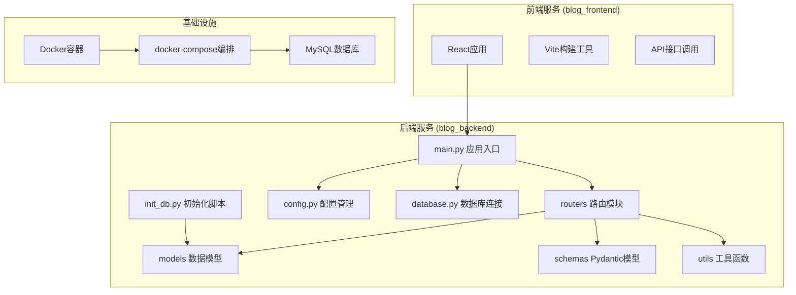
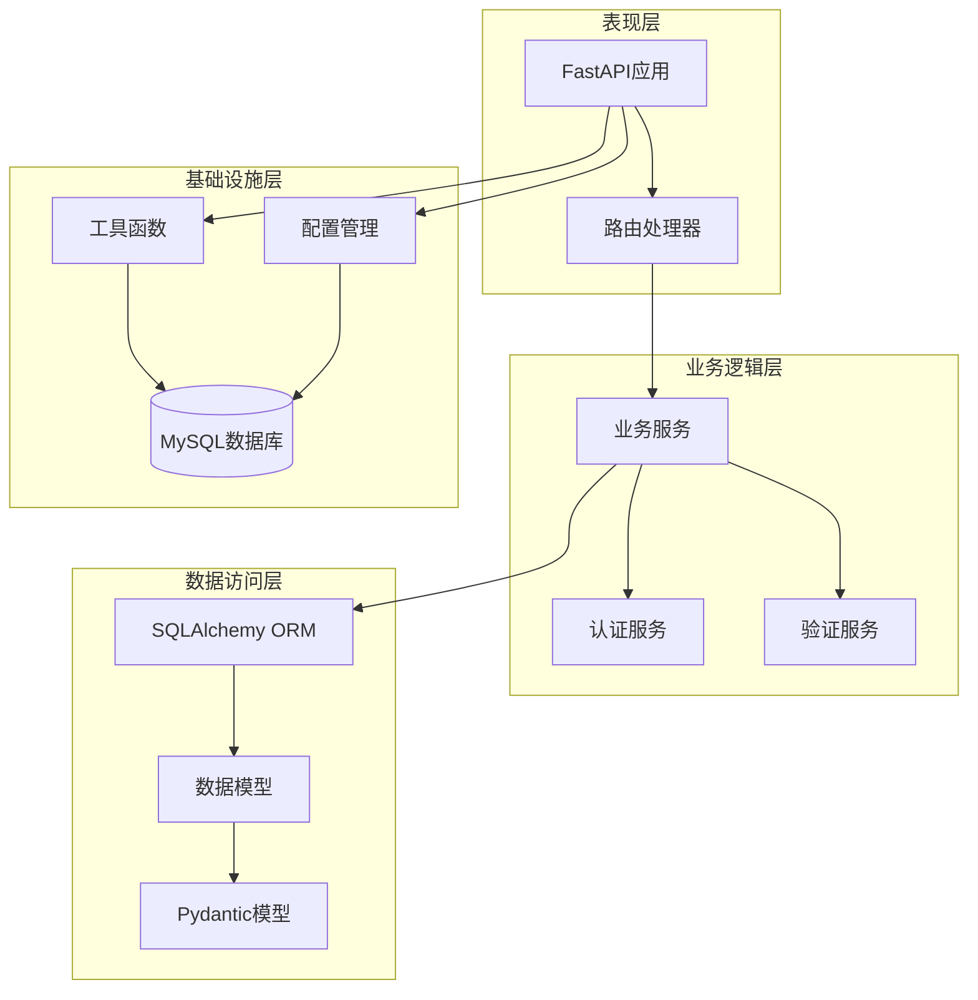
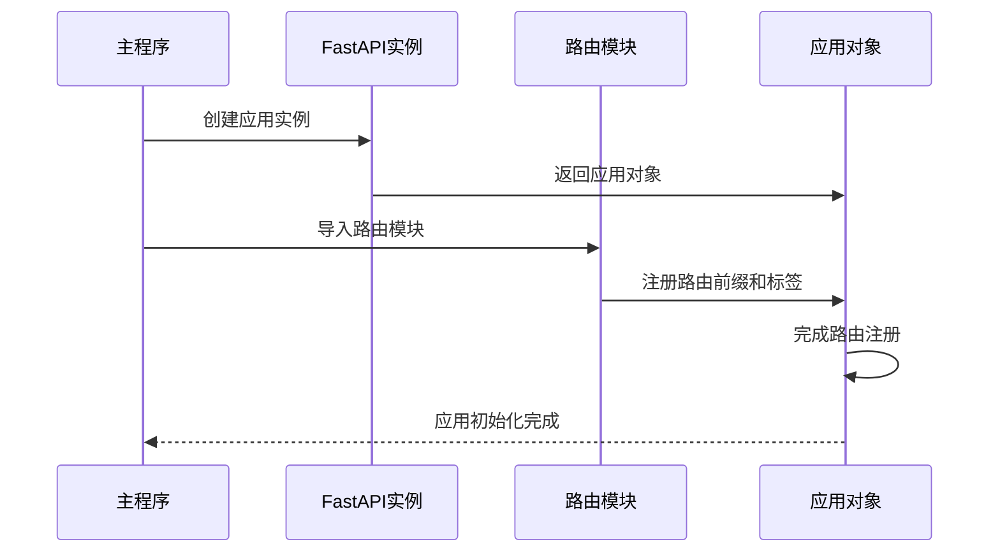
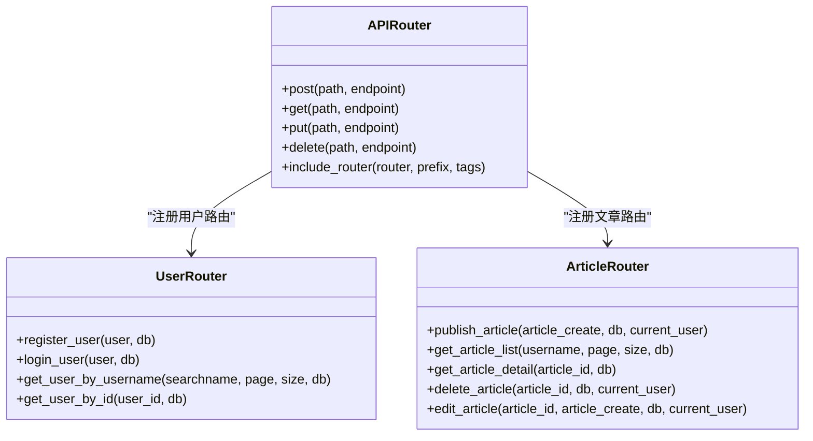
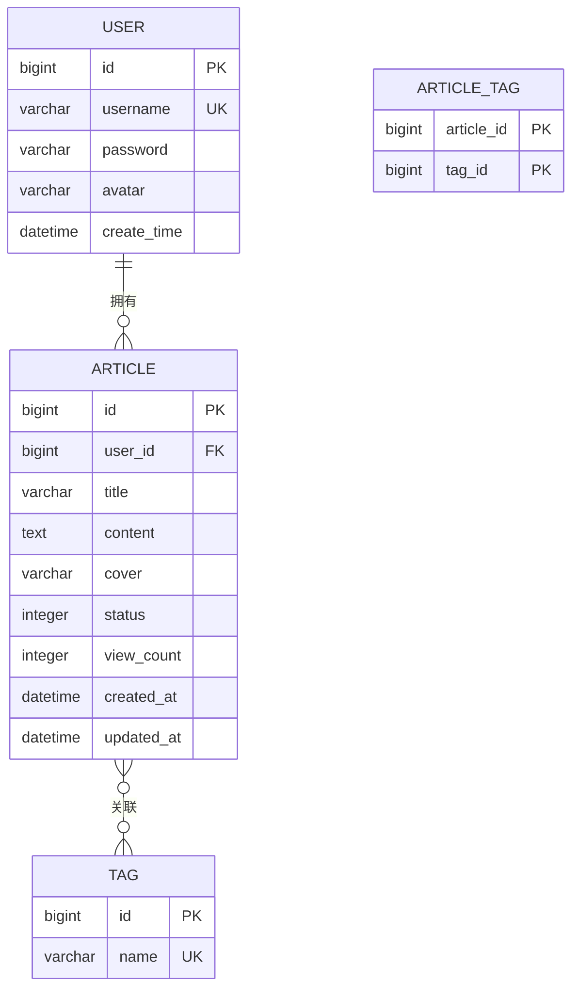
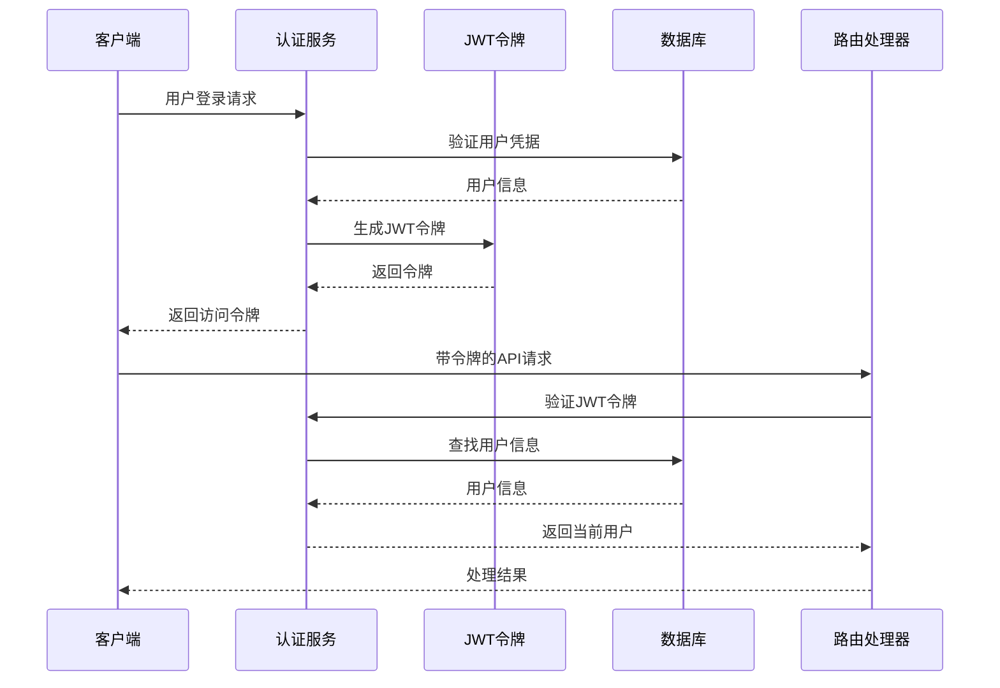
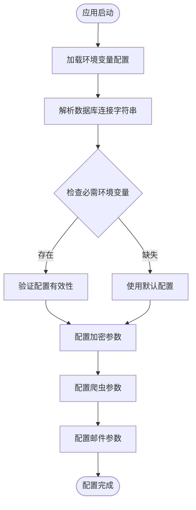
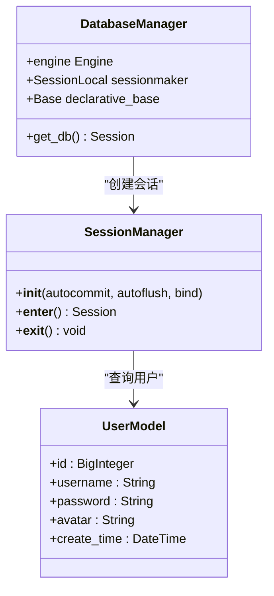
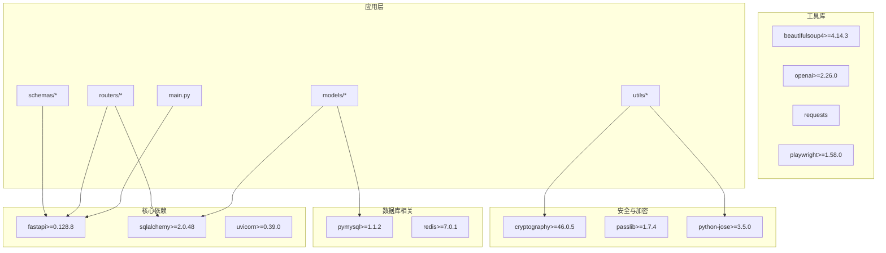

# FastAPI应用架构

<cite>
**本文档引用的文件**
- [main.py](file://blog_backend/main.py)
- [config.py](file://blog_backend/config.py)
- [database.py](file://blog_backend/database.py)
- [pyproject.toml](file://blog_backend/pyproject.toml)
- [requirements.txt](file://blog_backend/requirements.txt)
- [dockerfile](file://blog_backend/dockerfile)
- [docker-compose.yml](file://docker-compose.yml)
- [init_db.py](file://blog_backend/init_db.py)
- [routers/user.py](file://blog_backend/routers/user.py)
- [routers/article.py](file://blog_backend/routers/article.py)
- [models/user.py](file://blog_backend/models/user.py)
- [models/article.py](file://blog_backend/models/article.py)
- [schemas/user.py](file://blog_backend/schemas/user.py)
- [schemas/article.py](file://blog_backend/schemas/article.py)
- [utils/auth_token.py](file://blog_backend/utils/auth_token.py)
</cite>

## 目录
1. [简介](#简介)
2. [项目结构](#项目结构)
3. [核心组件](#核心组件)
4. [架构概览](#架构概览)
5. [详细组件分析](#详细组件分析)
6. [依赖分析](#依赖分析)
7. [性能考虑](#性能考虑)
8. [故障排除指南](#故障排除指南)
9. [结论](#结论)
10. [附录](#附录)

## 简介
本项目是一个基于FastAPI构建的博客应用后端服务，采用现代化的Python Web开发技术栈。应用实现了用户管理、文章发布与管理、权限认证等核心功能，并通过Docker容器化部署。项目展示了FastAPI在实际生产环境中的应用模式，包括路由组织、依赖注入、数据库连接管理、JWT认证等关键特性。

## 项目结构
项目采用前后端分离的架构设计，后端使用FastAPI框架，前端使用React技术栈。后端项目结构清晰，遵循模块化设计原则：

**图表来源**
- [main.py:1-13](file://blog_backend/main.py#L1-L13)
- [docker-compose.yml:1-41](file://docker-compose.yml#L1-L41)

**章节来源**
- [main.py:1-13](file://blog_backend/main.py#L1-L13)
- [docker-compose.yml:1-41](file://docker-compose.yml#L1-L41)

## 核心组件
应用的核心组件围绕FastAPI框架构建，实现了完整的Web服务功能：

### 应用初始化
应用通过FastAPI实例创建和路由注册实现初始化过程。主应用文件简洁明了地定义了应用实例，并注册了所有业务路由。

### 路由系统
应用采用模块化的路由设计，每个业务模块都有独立的路由文件，支持RESTful API规范。

### 数据层架构
使用SQLAlchemy ORM进行数据库操作，实现了数据模型与业务逻辑的分离。

### 认证授权
基于JWT的认证机制，支持用户登录、权限验证和访问控制。

**章节来源**
- [main.py:4-10](file://blog_backend/main.py#L4-L10)
- [config.py:1-32](file://blog_backend/config.py#L1-L32)
- [database.py:1-18](file://blog_backend/database.py#L1-L18)

## 架构概览
应用采用分层架构设计，各层职责明确，便于维护和扩展：

**图表来源**
- [main.py:1-13](file://blog_backend/main.py#L1-L13)
- [routers/user.py:1-101](file://blog_backend/routers/user.py#L1-L101)
- [utils/auth_token.py:1-38](file://blog_backend/utils/auth_token.py#L1-L38)

## 详细组件分析

### 应用入口与初始化
应用入口文件负责创建FastAPI实例并注册所有路由模块。这种设计确保了应用的模块化和可维护性。

**图表来源**
- [main.py:4-10](file://blog_backend/main.py#L4-L10)

**章节来源**
- [main.py:1-13](file://blog_backend/main.py#L1-L13)

### 路由注册机制
应用采用统一的路由前缀和标签管理策略，所有路由都使用"/api"作为前缀，便于API版本管理和文档生成。

**图表来源**
- [routers/user.py:13-101](file://blog_backend/routers/user.py#L13-L101)
- [routers/article.py:9-85](file://blog_backend/routers/article.py#L9-L85)

**章节来源**
- [routers/user.py:1-101](file://blog_backend/routers/user.py#L1-L101)
- [routers/article.py:1-85](file://blog_backend/routers/article.py#L1-L85)

### 数据模型设计
应用使用SQLAlchemy ORM定义数据模型，实现了用户、文章、标签等核心实体的数据结构。

**图表来源**
- [models/user.py:5-14](file://blog_backend/models/user.py#L5-L14)
- [models/article.py:16-41](file://blog_backend/models/article.py#L16-L41)

**章节来源**
- [models/user.py:1-14](file://blog_backend/models/user.py#L1-L14)
- [models/article.py:1-41](file://blog_backend/models/article.py#L1-L41)

### 认证与授权系统
应用实现了基于JWT的认证机制，支持用户注册、登录和权限验证。

**图表来源**
- [utils/auth_token.py:12-38](file://blog_backend/utils/auth_token.py#L12-L38)
- [routers/article.py:12-25](file://blog_backend/routers/article.py#L12-L25)

**章节来源**
- [utils/auth_token.py:1-38](file://blog_backend/utils/auth_token.py#L1-L38)

### 配置管理系统
应用使用环境变量管理配置，支持数据库连接、密钥设置和爬虫配置等参数。

**图表来源**
- [config.py:1-32](file://blog_backend/config.py#L1-L32)

**章节来源**
- [config.py:1-32](file://blog_backend/config.py#L1-L32)

### 数据库连接管理
应用使用SQLAlchemy建立数据库连接，实现了依赖注入模式的数据访问层。

**图表来源**
- [database.py:7-18](file://blog_backend/database.py#L7-L18)

**章节来源**
- [database.py:1-18](file://blog_backend/database.py#L1-L18)

## 依赖分析
应用的依赖关系清晰明确，遵循单一职责原则：

**图表来源**
- [pyproject.toml:7-21](file://blog_backend/pyproject.toml#L7-L21)
- [requirements.txt:1-14](file://blog_backend/requirements.txt#L1-L14)

**章节来源**
- [pyproject.toml:1-22](file://blog_backend/pyproject.toml#L1-L22)
- [requirements.txt:1-14](file://blog_backend/requirements.txt#L1-L14)

## 性能考虑
应用在设计时充分考虑了性能优化：

### 数据库连接池
使用SQLAlchemy的连接池机制，避免频繁创建和销毁数据库连接。

### 异步处理
对于耗时操作（如爬虫、邮件发送）建议使用异步任务队列。

### 缓存策略
建议实现Redis缓存层，缓存热点数据和用户会话信息。

### API优化
- 使用分页查询避免大量数据传输
- 实现条件查询和索引优化
- 启用Gzip压缩减少响应体积

## 故障排除指南
常见问题及解决方案：

### 数据库连接问题
- 检查环境变量配置是否正确
- 验证数据库服务状态
- 确认网络连通性和防火墙设置

### 认证失败
- 验证JWT密钥配置
- 检查用户凭据是否正确
- 确认令牌格式和有效期

### 路由访问错误
- 检查路由前缀和路径配置
- 验证HTTP方法和参数类型
- 确认依赖注入是否正常工作

**章节来源**
- [config.py:1-32](file://blog_backend/config.py#L1-L32)
- [utils/auth_token.py:22-38](file://blog_backend/utils/auth_token.py#L22-L38)

## 结论
本FastAPI应用展现了现代Python Web开发的最佳实践，通过模块化设计、清晰的分层架构和完善的依赖管理，实现了高可维护性和可扩展性的后端服务。应用集成了认证授权、数据持久化、API文档生成等核心功能，为后续的功能扩展奠定了坚实基础。

## 附录

### 启动流程
应用通过以下步骤启动：

1. **环境准备**：加载配置文件和环境变量
2. **数据库初始化**：创建数据库连接和表结构
3. **应用创建**：初始化FastAPI实例
4. **路由注册**：注册所有业务路由
5. **服务启动**：启动Uvicorn服务器

### 部署配置
应用支持Docker容器化部署，通过docker-compose编排多个服务容器。

**章节来源**
- [dockerfile:1-17](file://blog_backend/dockerfile#L1-L17)
- [docker-compose.yml:1-41](file://docker-compose.yml#L1-L41)
- [init_db.py:1-10](file://blog_backend/init_db.py#L1-L10)