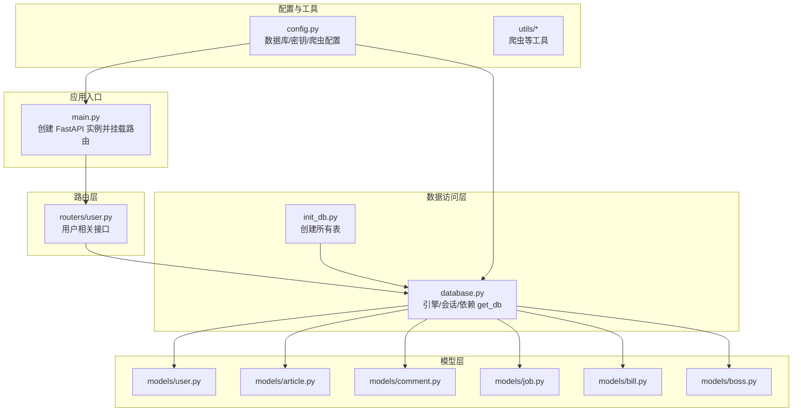
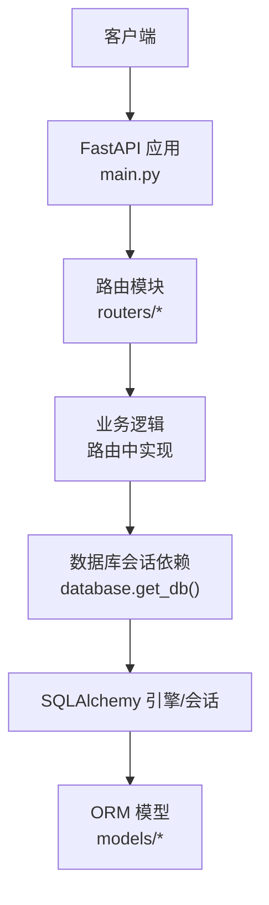
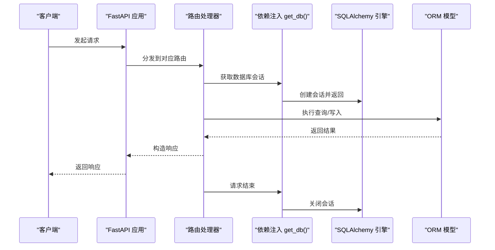
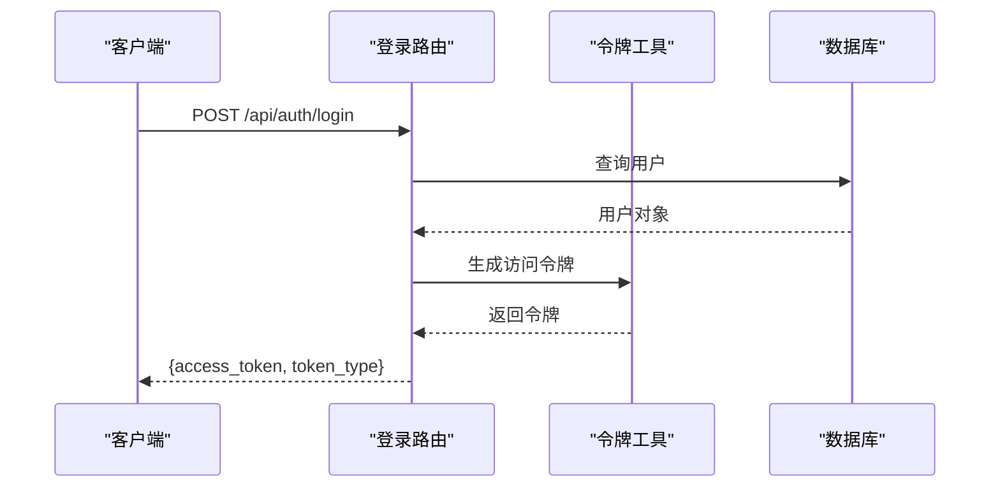
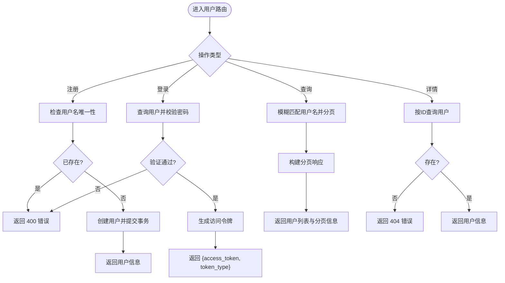
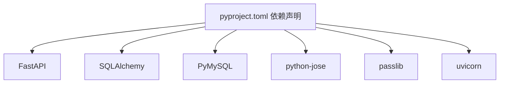

# 后端架构

<cite>
**本文引用的文件**
- [main.py](file://blog_backend/main.py)
- [config.py](file://blog_backend/config.py)
- [database.py](file://blog_backend/database.py)
- [init_db.py](file://blog_backend/init_db.py)
- [pyproject.toml](file://blog_backend/pyproject.toml)
- [models/user.py](file://blog_backend/models/user.py)
- [models/article.py](file://blog_backend/models/article.py)
- [models/comment.py](file://blog_backend/models/comment.py)
- [models/job.py](file://blog_backend/models/job.py)
- [models/bill.py](file://blog_backend/models/bill.py)
- [models/boss.py](file://blog_backend/models/boss.py)
- [routers/user.py](file://blog_backend/routers/user.py)
</cite>

## 目录
1. [简介](#简介)
2. [项目结构](#项目结构)
3. [核心组件](#核心组件)
4. [架构总览](#架构总览)
5. [详细组件分析](#详细组件分析)
6. [依赖分析](#依赖分析)
7. [性能考虑](#性能考虑)
8. [故障排查指南](#故障排查指南)
9. [结论](#结论)
10. [附录](#附录)

## 简介
本项目是一个基于 FastAPI 的博客后端系统，提供用户管理、文章管理、招聘信息抓取与存储、智能记账以及求职投递记录等模块。系统采用 SQLAlchemy 作为 ORM，通过依赖注入机制提供数据库会话；认证使用基于 HS256 的 JWT 令牌；爬虫功能用于采集外部招聘数据。本文档从架构视角梳理应用初始化、路由配置、中间件与依赖注入、数据库连接池与 ORM 设计、认证与安全策略、各 API 模块组织方式、数据模型设计原则与关系映射，并给出扩展开发指导与最佳实践。

## 项目结构
后端代码位于 blog_backend 目录，主要由以下层次组成：
- 应用入口与路由：main.py 定义 FastAPI 实例并挂载各模块路由；routers 下按功能划分 API 路由。
- 数据访问层：database.py 提供引擎、会话工厂与 get_db 依赖；init_db.py 初始化表结构。
- 模型层：models 下定义 SQLAlchemy 模型，涵盖用户、文章、评论、招聘、记账、Boss 投递等。
- 配置与工具：config.py 提供数据库连接串、JWT 密钥、算法、爬虫基础地址与邮箱配置；utils 提供爬虫等工具类。
- 依赖声明：pyproject.toml 声明运行时依赖。



图表来源
- [main.py:1-13](file://blog_backend/main.py#L1-L13)
- [routers/user.py:1-101](file://blog_backend/routers/user.py#L1-L101)
- [database.py:1-18](file://blog_backend/database.py#L1-L18)
- [init_db.py:1-10](file://blog_backend/init_db.py#L1-L10)
- [config.py:1-32](file://blog_backend/config.py#L1-L32)

章节来源
- [main.py:1-13](file://blog_backend/main.py#L1-L13)
- [pyproject.toml:1-22](file://blog_backend/pyproject.toml#L1-L22)

## 核心组件
- 应用初始化与路由挂载
  - 在应用入口中创建 FastAPI 实例，并将用户、文章、招聘、记账、Boss 投递等模块路由以 /api 前缀挂载，同时为每个路由组设置标签以便在文档中分类展示。
- 数据库连接与依赖注入
  - database.py 使用 SQLAlchemy 创建引擎与会话工厂，提供 get_db 依赖函数，确保每个请求生命周期内拥有独立的数据库会话，并在请求结束后自动关闭。
  - config.py 提供 DATABASE_URL 环境变量读取逻辑，支持默认值，便于本地与容器化部署。
- 认证与安全
  - config.py 定义 HS256 算法与密钥，rousers/user.py 中使用工具生成登录返回的访问令牌。
- 爬虫与外部集成
  - config.py 提供爬虫基础地址与目标文件路径；utils 提供爬虫工具类，用于采集外部招聘数据并入库。

章节来源
- [main.py:1-13](file://blog_backend/main.py#L1-L13)
- [database.py:1-18](file://blog_backend/database.py#L1-L18)
- [config.py:1-32](file://blog_backend/config.py#L1-L32)
- [routers/user.py:1-101](file://blog_backend/routers/user.py#L1-L101)

## 架构总览
系统采用分层架构：路由层负责请求处理与参数校验；服务层（在当前代码中直接在路由中调用）负责业务逻辑；数据访问层通过依赖注入提供数据库会话；模型层定义数据结构与关系；配置与工具层提供环境配置与辅助能力。



图表来源
- [main.py:1-13](file://blog_backend/main.py#L1-L13)
- [routers/user.py:1-101](file://blog_backend/routers/user.py#L1-L101)
- [database.py:1-18](file://blog_backend/database.py#L1-L18)
- [models/user.py:1-14](file://blog_backend/models/user.py#L1-L14)

## 详细组件分析

### 应用初始化与路由配置
- 入口文件创建应用实例并挂载多个模块路由，统一前缀与标签，便于 API 文档分类与后续扩展。
- 路由模块按功能拆分，如用户模块、文章模块、招聘模块、记账模块、Boss 投递模块，便于维护与测试。

章节来源
- [main.py:1-13](file://blog_backend/main.py#L1-L13)

### 数据库连接池与依赖注入
- 引擎与会话工厂
  - database.py 使用 SQLAlchemy 创建引擎与会话工厂，绑定到全局 Base，确保模型元数据一致。
- 依赖注入
  - get_db 依赖函数在每次请求开始时创建会话，在 finally 中关闭，避免会话泄漏。
- 初始化脚本
  - init_db.py 通过 Base.metadata.create_all 统一创建所有表，适合开发与迁移初期使用。



图表来源
- [database.py:1-18](file://blog_backend/database.py#L1-L18)
- [routers/user.py:1-101](file://blog_backend/routers/user.py#L1-L101)

章节来源
- [database.py:1-18](file://blog_backend/database.py#L1-L18)
- [init_db.py:1-10](file://blog_backend/init_db.py#L1-L10)

### 认证系统与安全策略
- JWT 令牌机制
  - config.py 定义 HS256 算法与密钥，routers/user.py 在登录成功后调用工具生成访问令牌并返回。
- 密码存储
  - 当前模型与路由中密码字段为明文存储，存在严重安全风险。建议迁移到安全哈希方案（例如 bcrypt），并在路由中进行哈希比对。
- 权限管理
  - 当前未实现细粒度权限控制或中间件鉴权，建议引入 FastAPI Security 依赖与中间件，结合用户角色字段实现 RBAC 或基于资源的授权。



图表来源
- [routers/user.py:36-51](file://blog_backend/routers/user.py#L36-L51)
- [config.py:15-17](file://blog_backend/config.py#L15-L17)

章节来源
- [config.py:15-17](file://blog_backend/config.py#L15-L17)
- [routers/user.py:36-51](file://blog_backend/routers/user.py#L36-L51)

### 数据模型设计与关系映射
- 用户模型
  - 包含自增主键、唯一用户名、密码、头像与创建时间等字段。
- 文章与标签多对多
  - 通过中间表 article_tag 建立文章与标签的多对多关系，模型中通过 relationship 声明双向回溯。
- 评论模型
  - 关联用户与文章，记录评论内容与创建时间。
- 招聘与 Boss 投递
  - 招聘信息包含标题、URL、发布时间、抓取时间、类型与地区等字段；Boss 投递记录包含职位标题、URL、抓取时间、详情与地区等字段。
- 记账模型
  - 记录商品/交易标题、商户、分类、金额、交易日期、备注与创建时间等字段。

```mermaid
erDiagram
USER {
bigint id PK
varchar username UK
varchar password
varchar avatar
datetime create_time
}
ARTICLE {
bigint id PK
bigint user_id FK
varchar title
text content
varchar cover
integer status
integer view_count
datetime created_at
datetime updated_at
}
TAG {
bigint id PK
varchar name UK
}
COMMENT {
bigint id PK
bigint user_id
bigint article_id
text content
datetime create_time
}
JOB {
bigint id PK
text title
varchar url UK
date publish_date
datetime crawl_date
varchar type
varchar dq
}
BOSS {
bigint id PK
text title
text url
datetime crawl_date
text details
varchar dq
}
BILL {
bigint id PK
text title
text merchant
varchar category
numeric amount
date trade_time
text remark
datetime created_at
}
USER ||--o{ ARTICLE : "拥有"
ARTICLE ||--o{ COMMENT : "被评论"
TAG ||--R article_tag : "关联"
USER ||--o{ COMMENT : "发表"
```

图表来源
- [models/user.py:1-14](file://blog_backend/models/user.py#L1-L14)
- [models/article.py:1-41](file://blog_backend/models/article.py#L1-L41)
- [models/comment.py:1-12](file://blog_backend/models/comment.py#L1-L12)
- [models/job.py:1-15](file://blog_backend/models/job.py#L1-L15)
- [models/boss.py:1-15](file://blog_backend/models/boss.py#L1-L15)
- [models/bill.py:1-24](file://blog_backend/models/bill.py#L1-L24)

章节来源
- [models/user.py:1-14](file://blog_backend/models/user.py#L1-L14)
- [models/article.py:1-41](file://blog_backend/models/article.py#L1-L41)
- [models/comment.py:1-12](file://blog_backend/models/comment.py#L1-L12)
- [models/job.py:1-15](file://blog_backend/models/job.py#L1-L15)
- [models/boss.py:1-15](file://blog_backend/models/boss.py#L1-L15)
- [models/bill.py:1-24](file://blog_backend/models/bill.py#L1-L24)

### API 模块组织与用户管理
- 用户注册
  - 校验用户名唯一性后创建用户并返回用户信息。
- 登录
  - 校验用户名与密码后生成访问令牌并返回。
- 用户查询
  - 支持按用户名模糊查询与分页，返回用户列表、页码、大小与是否还有更多数据。
- 用户详情
  - 根据用户 ID 查询并返回用户基本信息。



图表来源
- [routers/user.py:15-101](file://blog_backend/routers/user.py#L15-L101)

章节来源
- [routers/user.py:1-101](file://blog_backend/routers/user.py#L1-L101)

## 依赖分析
- 运行时依赖
  - FastAPI、SQLAlchemy、PyMySQL、python-jose、passlib、uvicorn 等，满足 Web 框架、ORM、加密、爬虫与异步服务器需求。
- 外部集成
  - 爬虫基础地址与目标文件路径来自配置；邮件配置可选启用。



图表来源
- [pyproject.toml:7-21](file://blog_backend/pyproject.toml#L7-L21)

章节来源
- [pyproject.toml:1-22](file://blog_backend/pyproject.toml#L1-L22)

## 性能考虑
- 数据库连接池
  - 当前使用 SQLAlchemy 默认会话工厂，未显式配置连接池参数。建议在生产环境中设置合适的 pool_size、max_overflow、pool_recycle 等参数以优化并发与连接复用。
- 查询优化
  - 分页查询应尽量使用索引列排序与过滤；对高频查询建立合适索引（如用户表的 username、文章表的 user_id 与 created_at）。
- 缓存策略
  - 对热点数据（如热门文章、用户基本信息）引入缓存（如 Redis），减少数据库压力。
- 异步与并发
  - 将耗时任务（如爬虫）异步化，避免阻塞主请求线程；使用队列或后台任务框架（如 Celery）调度。

## 故障排查指南
- 数据库连接失败
  - 检查 DATABASE_URL 环境变量与数据库可达性；确认 PyMySQL 驱动安装；核对 init_db 是否成功执行。
- 登录失败
  - 确认用户名存在且密码匹配；检查令牌生成与返回流程；关注路由中的异常抛出点。
- 密码安全问题
  - 当前密码为明文存储，存在高风险。建议迁移至安全哈希方案并更新路由中的校验逻辑。
- 爬虫相关问题
  - 检查爬虫基础地址与目标文件路径配置；确认网络连通性与目标站点可用性。

章节来源
- [config.py:1-32](file://blog_backend/config.py#L1-L32)
- [routers/user.py:36-51](file://blog_backend/routers/user.py#L36-L51)

## 结论
本项目以 FastAPI 为基础，结合 SQLAlchemy 实现了清晰的分层架构与模块化的路由组织。当前在认证安全、数据库连接池配置与权限控制方面尚有改进空间。建议优先完成密码安全迁移、引入鉴权中间件与连接池参数优化，再逐步完善缓存与异步任务体系，以支撑更高并发与更复杂业务场景。

## 附录
- 扩展开发指导
  - 新增模块：在 routers 下新增路由文件，定义路由与依赖；在 models 下新增模型并迁移；在 main.py 中挂载新路由。
  - 认证增强：引入 FastAPI Security 依赖与中间件，结合用户角色字段实现细粒度权限控制。
  - 数据库优化：根据业务量调整连接池参数，增加索引与查询优化。
  - 爬虫与定时任务：将爬虫逻辑异步化，配合定时任务定期抓取外部数据。
- 最佳实践
  - 明确分层职责，避免在路由中直接处理复杂业务逻辑。
  - 使用 Pydantic 模型进行请求/响应校验，提升接口健壮性。
  - 为每个模块编写单元测试与集成测试，覆盖关键路径与边界条件。