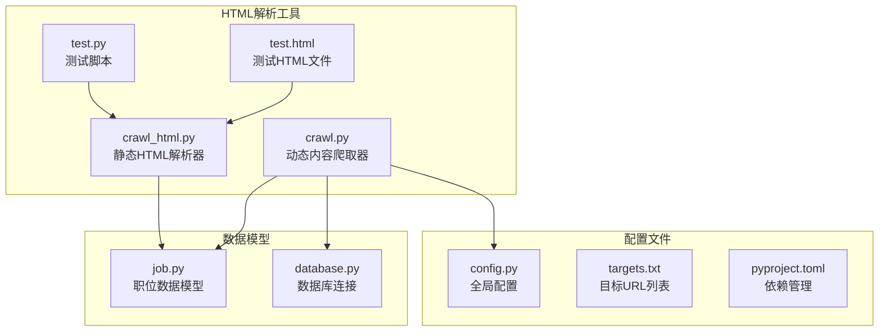
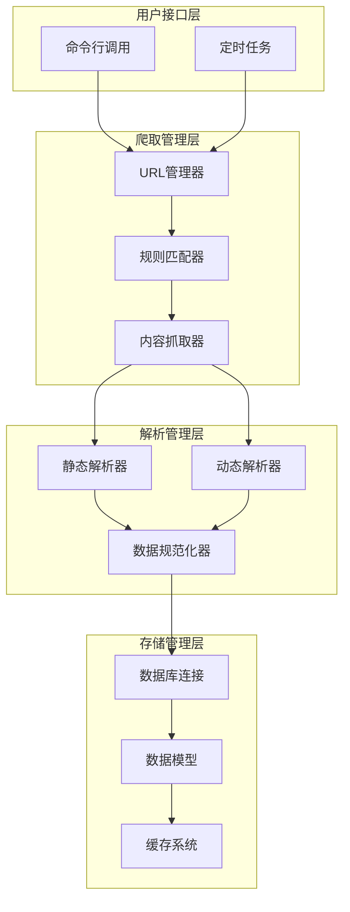
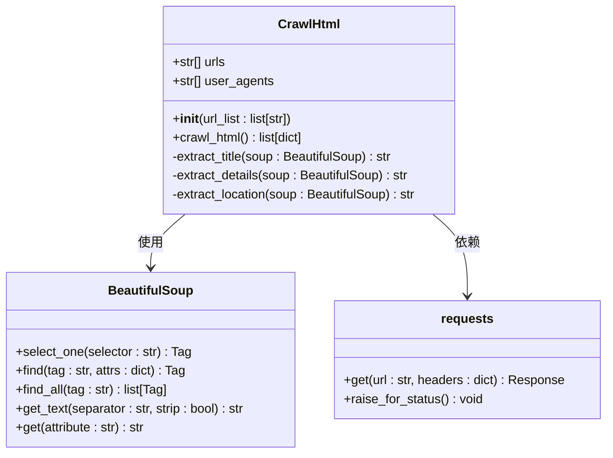
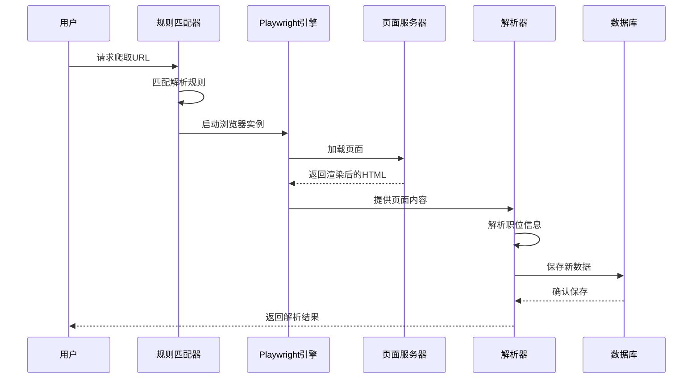
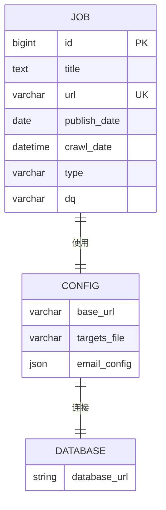
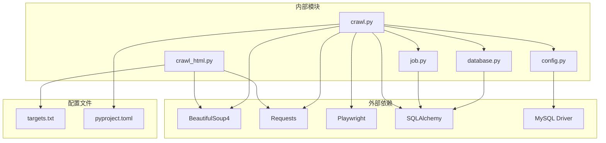

# HTML解析工具

<cite>
**本文档引用的文件**
- [crawl_html.py](file://blog_backend/utils/crawl_html.py)
- [crawl.py](file://blog_backend/utils/crawl.py)
- [job.py](file://blog_backend/models/job.py)
- [config.py](file://blog_backend/config.py)
- [database.py](file://blog_backend/database.py)
- [targets.txt](file://blog_backend/targets.txt)
- [test.html](file://blog_backend/utils/test.html)
- [test.py](file://blog_backend/utils/test.py)
- [pyproject.toml](file://blog_backend/pyproject.toml)
</cite>

## 目录
1. [简介](#简介)
2. [项目结构](#项目结构)
3. [核心组件](#核心组件)
4. [架构概览](#架构概览)
5. [详细组件分析](#详细组件分析)
6. [依赖关系分析](#依赖关系分析)
7. [性能考虑](#性能考虑)
8. [故障排除指南](#故障排除指南)
9. [最佳实践](#最佳实践)
10. [扩展开发指南](#扩展开发指南)
11. [结论](#结论)

## 简介

博客系统的HTML解析工具是一个专门用于从网页中提取结构化数据的系统，主要面向招聘网站的数据抓取和解析。该工具基于BeautifulSoup库实现了强大的HTML解析能力，结合Playwright实现了动态内容的渲染和抓取，为博客后端提供了完整的内容获取和数据处理解决方案。

该系统支持多种招聘网站的页面解析，包括猎聘网、南昌人才网等，能够自动识别和提取职位标题、详情描述、发布时间、地区信息等关键数据，并将其存储到数据库中供后续使用。

## 项目结构

博客系统的HTML解析工具位于`blog_backend/utils/`目录下，主要包含以下核心文件：



**图表来源**
- [crawl_html.py:1-72](file://blog_backend/utils/crawl_html.py#L1-L72)
- [crawl.py:1-445](file://blog_backend/utils/crawl.py#L1-L445)
- [config.py:1-32](file://blog_backend/config.py#L1-L32)

**章节来源**
- [crawl_html.py:1-72](file://blog_backend/utils/crawl_html.py#L1-L72)
- [crawl.py:1-445](file://blog_backend/utils/crawl.py#L1-L445)
- [config.py:1-32](file://blog_backend/config.py#L1-L32)

## 核心组件

### CrawlHtml类 - 静态HTML解析器

CrawlHtml类是专门用于处理静态HTML页面的解析器，采用BeautifulSoup库进行DOM树遍历和元素选择。

**主要功能特性：**
- 支持随机User-Agent池，模拟真实用户访问
- 实现智能等待机制，避免过早抓取
- 提供灵活的CSS选择器和元素查找方法
- 包含完整的异常处理和容错机制

### 动态爬取器 - 多站点支持

crawl.py文件实现了支持多个招聘网站的动态爬取系统，基于Playwright实现JavaScript渲染内容的抓取。

**核心解析函数：**
- `parse_company_news`: 解析公司招聘页面
- `parse_exam_news`: 解析考试公告页面  
- `parse_ncrczpw_gq`: 解析南昌人才国企招聘
- `parse_ncrczpw_qy`: 解析南昌人才企业招聘
- `parse_ncrczpw_mq`: 解析南昌人才名企招聘

**章节来源**
- [crawl_html.py:8-72](file://blog_backend/utils/crawl_html.py#L8-L72)
- [crawl.py:56-246](file://blog_backend/utils/crawl.py#L56-L246)

## 架构概览

HTML解析工具采用分层架构设计，实现了静态和动态内容的统一处理：



**图表来源**
- [crawl.py:286-440](file://blog_backend/utils/crawl.py#L286-L440)
- [crawl_html.py:18-72](file://blog_backend/utils/crawl_html.py#L18-L72)

## 详细组件分析

### CrawlHtml类详细分析

CrawlHtml类实现了完整的HTML解析流程，从页面抓取到数据提取的全过程：



**图表来源**
- [crawl_html.py:8-72](file://blog_backend/utils/crawl_html.py#L8-L72)

#### 解析流程详解

CrawlHtml类的解析流程包含以下关键步骤：

1. **页面抓取阶段**：使用requests库发送HTTP请求，设置随机User-Agent
2. **DOM树构建**：通过BeautifulSoup解析HTML内容，构建DOM树结构
3. **元素选择**：使用CSS选择器和find方法定位目标元素
4. **数据提取**：从选定元素中提取文本内容和属性值
5. **数据清洗**：去除多余空白字符，处理缺失数据

**章节来源**
- [crawl_html.py:18-72](file://blog_backend/utils/crawl_html.py#L18-L72)

### 动态爬取器架构

动态爬取器基于Playwright实现了复杂的页面交互处理：



**图表来源**
- [crawl.py:295-440](file://blog_backend/utils/crawl.py#L295-L440)

**章节来源**
- [crawl.py:295-440](file://blog_backend/utils/crawl.py#L295-L440)

### 数据模型设计

系统使用SQLAlchemy ORM定义了完整的数据模型：



**图表来源**
- [job.py:5-15](file://blog_backend/models/job.py#L5-L15)
- [config.py:3-31](file://blog_backend/config.py#L3-L31)

**章节来源**
- [job.py:5-15](file://blog_backend/models/job.py#L5-L15)
- [config.py:3-31](file://blog_backend/config.py#L3-L31)

## 依赖关系分析

HTML解析工具的依赖关系体现了清晰的分层架构：



**图表来源**
- [pyproject.toml:7-21](file://blog_backend/pyproject.toml#L7-L21)
- [crawl.py:13-15](file://blog_backend/utils/crawl.py#L13-L15)

**章节来源**
- [pyproject.toml:7-21](file://blog_backend/pyproject.toml#L7-L21)
- [crawl.py:13-15](file://blog_backend/utils/crawl.py#L13-L15)

## 性能考虑

### 并发处理优化

系统采用了多线程和异步处理策略来提高性能：

1. **并发URL处理**：支持同时处理多个URL，提高整体吞吐量
2. **智能等待机制**：根据页面复杂度调整等待时间
3. **缓存策略**：避免重复抓取相同内容
4. **连接池管理**：复用HTTP连接，减少建立连接的开销

### 内存管理

- **流式处理**：大文件采用流式读取，避免内存溢出
- **及时释放**：使用with语句确保资源正确释放
- **垃圾回收**：定期清理不再使用的对象引用

### 网络优化

- **User-Agent轮换**：避免被目标网站限制
- **请求头定制**：模拟真实浏览器行为
- **超时控制**：设置合理的超时时间，防止长时间阻塞

## 故障排除指南

### 常见问题及解决方案

#### 1. 网络请求失败

**问题症状**：HTTP请求超时或返回错误状态码

**解决方法**：
- 检查网络连接和代理设置
- 验证User-Agent是否被目标网站屏蔽
- 增加重试机制和退避策略

#### 2. 解析规则失效

**问题症状**：页面结构变更导致解析失败

**解决方法**：
- 定期检查和更新CSS选择器
- 实现向后兼容的解析逻辑
- 添加备用解析方案

#### 3. 数据库连接问题

**问题症状**：无法连接到数据库或事务失败

**解决方法**：
- 验证数据库连接字符串
- 检查数据库服务状态
- 实现连接池管理和重连机制

**章节来源**
- [crawl_html.py:69-71](file://blog_backend/utils/crawl_html.py#L69-L71)
- [crawl.py:432-436](file://blog_backend/utils/crawl.py#L432-L436)

### 调试技巧

1. **日志记录**：详细记录每个步骤的执行状态
2. **中间结果保存**：将解析过程中的HTML内容保存到文件
3. **异常捕获**：使用try-catch块捕获和处理异常
4. **单元测试**：为关键解析逻辑编写测试用例

## 最佳实践

### HTML解析最佳实践

#### 1. 选择器使用规范

- **优先使用语义化选择器**：基于类名和ID的选择器比层级选择器更稳定
- **组合选择器**：使用复合选择器提高精确度
- **属性选择器**：利用data-*属性进行精准定位

#### 2. DOM遍历策略

- **先全局后局部**：先定位容器元素，再在容器内查找具体元素
- **链式调用**：使用链式调用减少DOM访问次数
- **条件判断**：在每次查找后检查元素是否存在

#### 3. 数据提取规范

- **默认值处理**：为缺失数据提供合理的默认值
- **格式标准化**：统一日期、数字等数据格式
- **文本清理**：去除多余的空白字符和特殊符号

### 错误处理策略

#### 1. 异常分类处理

```python
try:
    # 主要逻辑
    pass
except requests.RequestException as e:
    # 网络请求异常
    handle_network_error(e)
except ValueError as e:
    # 数据解析异常
    handle_parse_error(e)
except Exception as e:
    # 其他异常
    handle_general_error(e)
```

#### 2. 容错机制

- **降级策略**：当某个功能失败时，使用替代方案
- **回退机制**：提供多个解析选项，按优先级尝试
- **数据验证**：对提取的数据进行完整性检查

### 性能优化建议

#### 1. 缓存策略

- **页面缓存**：缓存最近访问的页面内容
- **解析结果缓存**：缓存解析后的结构化数据
- **配置缓存**：缓存解析规则和配置信息

#### 2. 批处理优化

- **批量数据库操作**：使用批量插入减少数据库往返
- **并发处理**：合理设置并发数量，避免过度竞争
- **资源池管理**：复用浏览器实例和数据库连接

## 扩展开发指南

### 添加新的解析规则

#### 1. 解析函数开发

```python
def parse_new_site(html: str) -> list[Job]:
    """解析新网站的招聘页面"""
    soup = BeautifulSoup(html, "html.parser")
    items = soup.select("你的选择器")
    jobs = []
    
    for item in items:
        # 提取字段
        title = item.find('元素', class_='类名').get_text(strip=True)
        url = item['href']
        # 处理日期等其他字段
        
        jobs.append(Job(
            title=title,
            url=url,
            publish_date=publish_date,
            type="新网站类型",
            crawl_date=datetime.now(),
            dq="地区"
        ))
    return jobs
```

#### 2. 规则配置

在`CRAWL_RULES`列表中添加新的规则：

```python
{
    "keyword": "网站关键字",              # URL中的关键字
    "wait_selector": "等待元素选择器",    # 页面加载完成的标志
    "parser": parse_new_site,             # 解析函数
    "label": "显示标签"                   # 规则标签
}
```

#### 3. 测试验证

```python
# 测试新解析规则
def test_new_parser():
    with open("test.html", "r", encoding="utf-8") as f:
        html = f.read()
    
    jobs = parse_new_site(html)
    assert len(jobs) > 0
    print(f"成功解析 {len(jobs)} 个职位")
```

### 维护策略

#### 1. 版本管理

- **语义化版本控制**：按照语义化版本管理规则发布新版本
- **向后兼容性**：保持API的向后兼容性
- **废弃通知**：在废弃功能前提供迁移指南

#### 2. 监控和告警

- **健康检查**：定期检查爬取系统的运行状态
- **性能监控**：监控解析速度和成功率
- **异常告警**：设置异常情况的告警机制

#### 3. 文档维护

- **API文档**：保持API文档的实时更新
- **使用示例**：提供最新的使用示例和最佳实践
- **故障排除**：持续更新常见问题的解决方案

**章节来源**
- [crawl.py:249-284](file://blog_backend/utils/crawl.py#L249-L284)
- [crawl.py:56-246](file://blog_backend/utils/crawl.py#L56-L246)

## 结论

博客系统的HTML解析工具展现了现代Web数据抓取的完整解决方案。通过BeautifulSoup的强大解析能力和Playwright的动态内容处理，系统能够稳定地从各种类型的网页中提取结构化数据。

该工具的主要优势包括：

1. **灵活性**：支持多种网站和页面类型的解析
2. **稳定性**：完善的异常处理和容错机制
3. **可扩展性**：模块化的架构设计便于功能扩展
4. **性能**：优化的并发处理和缓存策略

未来的发展方向包括：
- 支持更多网站类型的解析规则
- 增强机器学习驱动的解析能力
- 优化移动端适配和响应式设计
- 加强数据质量保证和验证机制

通过遵循本文档的最佳实践和扩展指南，开发者可以有效地维护和扩展这个HTML解析工具，满足不断变化的数据抓取需求。