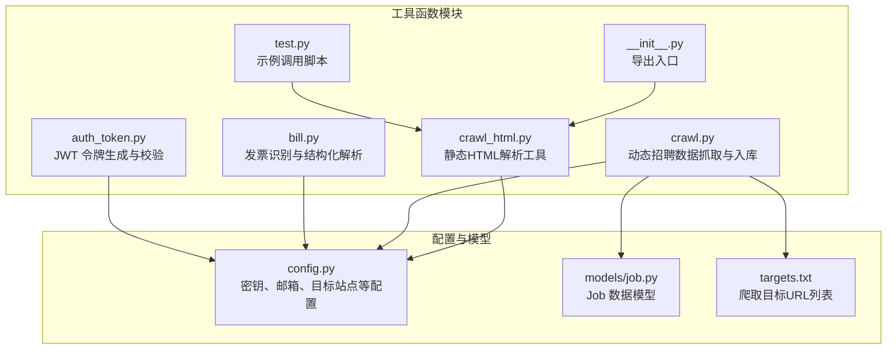
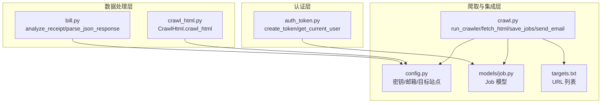
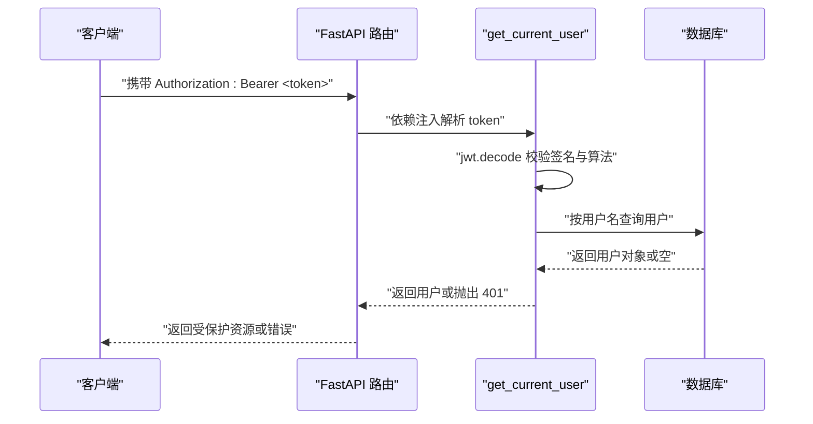
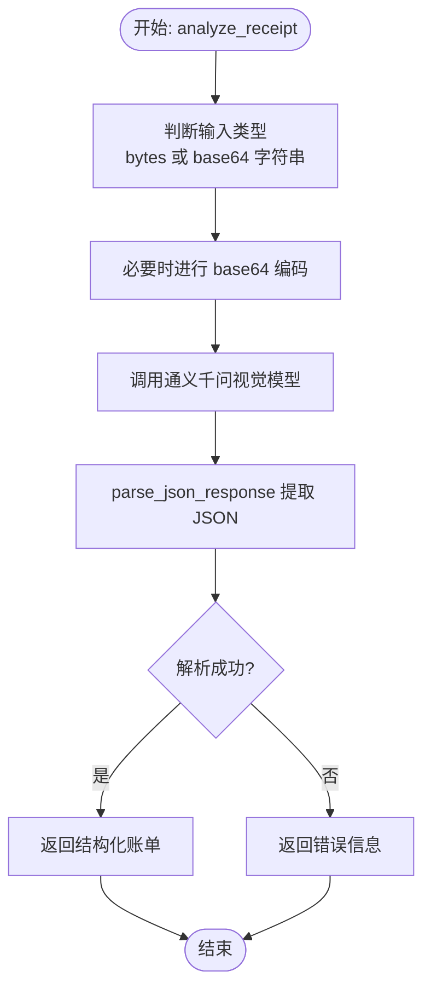
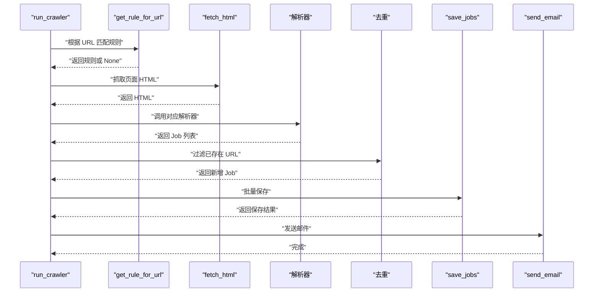
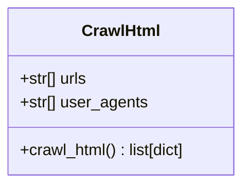
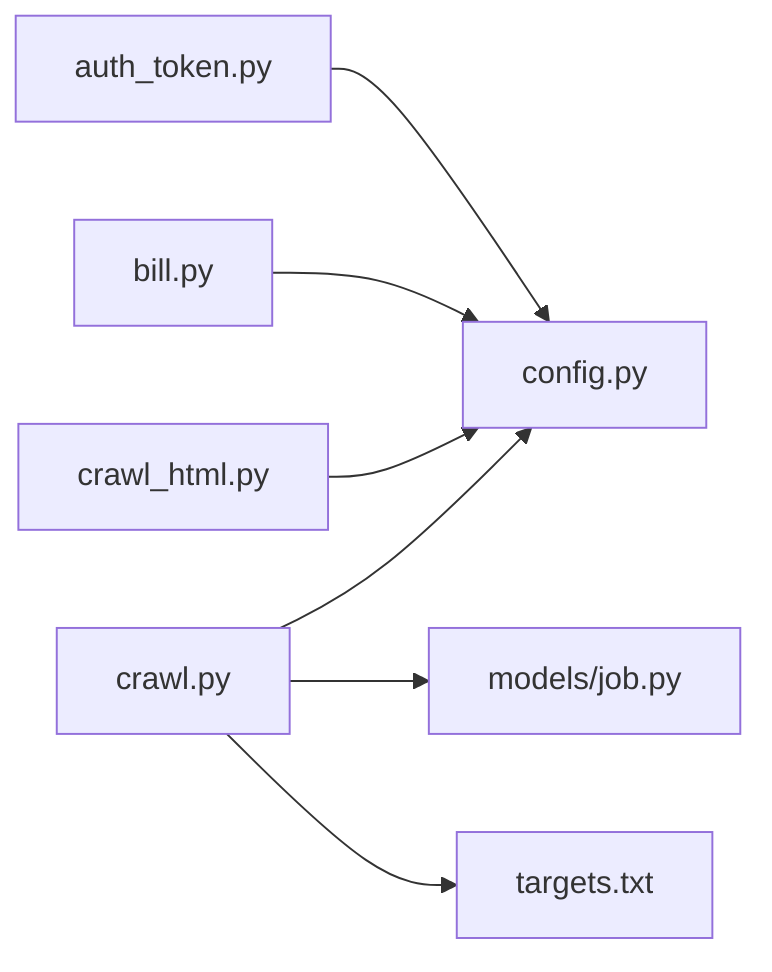

# 工具函数库

<cite>
**本文引用的文件**
- [auth_token.py](file://blog_backend/utils/auth_token.py)
- [bill.py](file://blog_backend/utils/bill.py)
- [crawl.py](file://blog_backend/utils/crawl.py)
- [crawl_html.py](file://blog_backend/utils/crawl_html.py)
- [test.py](file://blog_backend/utils/test.py)
- [__init__.py](file://blog_backend/utils/__init__.py)
- [config.py](file://blog_backend/config.py)
- [job.py](file://blog_backend/models/job.py)
- [targets.txt](file://blog_backend/targets.txt)
- [test.html](file://blog_backend/utils/test.html)
</cite>

## 目录
1. [简介](#简介)
2. [项目结构](#项目结构)
3. [核心组件](#核心组件)
4. [架构总览](#架构总览)
5. [详细组件分析](#详细组件分析)
6. [依赖分析](#依赖分析)
7. [性能考量](#性能考量)
8. [故障排查指南](#故障排查指南)
9. [结论](#结论)
10. [附录](#附录)

## 简介
本文件系统性梳理博客后端工具函数库，聚焦以下四类工具能力：
- 认证令牌处理：基于 JWT 的令牌生成与校验，结合 FastAPI 安全依赖实现用户身份解析。
- 记账数据处理：基于通义千问视觉模型对发票图片进行结构化解析，输出标准化账单数据。
- 招聘数据爬取：基于 Playwright 的动态页面抓取与解析，支持多站点规则配置与增量入库、邮件通知。
- HTML 解析工具：基于 requests + BeautifulSoup 的静态页面解析封装，提供统一的职位信息抽取接口。

文档将从设计原则、输入输出、参数验证、异常处理、性能与可扩展性等方面进行深入剖析，并给出使用示例、测试方法与最佳实践。

## 项目结构
工具函数位于 blog_backend/utils 下，按功能划分文件，形成高内聚低耦合的模块化布局。部分模块通过配置文件与数据库模型进行协作。

图表来源
- [auth_token.py:1-38](file://blog_backend/utils/auth_token.py#L1-L38)
- [bill.py:1-107](file://blog_backend/utils/bill.py#L1-L107)
- [crawl.py:1-445](file://blog_backend/utils/crawl.py#L1-L445)
- [crawl_html.py:1-72](file://blog_backend/utils/crawl_html.py#L1-L72)
- [test.py:1-9](file://blog_backend/utils/test.py#L1-L9)
- [__init__.py:1-2](file://blog_backend/utils/__init__.py#L1-L2)
- [config.py:1-32](file://blog_backend/config.py#L1-L32)
- [job.py:1-15](file://blog_backend/models/job.py#L1-L15)
- [targets.txt:1-5](file://blog_backend/targets.txt#L1-L5)

章节来源
- [auth_token.py:1-38](file://blog_backend/utils/auth_token.py#L1-L38)
- [bill.py:1-107](file://blog_backend/utils/bill.py#L1-L107)
- [crawl.py:1-445](file://blog_backend/utils/crawl.py#L1-L445)
- [crawl_html.py:1-72](file://blog_backend/utils/crawl_html.py#L1-L72)
- [test.py:1-9](file://blog_backend/utils/test.py#L1-L9)
- [__init__.py:1-2](file://blog_backend/utils/__init__.py#L1-L2)
- [config.py:1-32](file://blog_backend/config.py#L1-L32)
- [job.py:1-15](file://blog_backend/models/job.py#L1-L15)
- [targets.txt:1-5](file://blog_backend/targets.txt#L1-L5)

## 核心组件
- 认证令牌处理：提供 create_token 与 get_current_user 两个关键函数，前者生成含过期时间的 JWT，后者在 FastAPI 中作为依赖注入解析当前用户。
- 记账数据处理：analyze_receipt 接收图片字节或 base64，调用通义千问视觉模型进行结构化解析；parse_json_response 提供鲁棒的 JSON 提取与容错。
- 招聘数据爬取：run_crawler 为主流程，fetch_html 使用 Playwright 抓取动态页面，按规则解析不同站点，过滤重复、入库、发邮件通知。
- HTML 解析工具：CrawlHtml 类封装静态页面解析，随机 UA、随机延时、BeautifulSoup 解析，输出职位标题、详情、地区与抓取时间。

章节来源
- [auth_token.py:12-37](file://blog_backend/utils/auth_token.py#L12-L37)
- [bill.py:17-106](file://blog_backend/utils/bill.py#L17-L106)
- [crawl.py:295-440](file://blog_backend/utils/crawl.py#L295-L440)
- [crawl_html.py:8-72](file://blog_backend/utils/crawl_html.py#L8-L72)

## 架构总览
下图展示工具函数在系统中的交互关系与数据流。

图表来源
- [auth_token.py:12-37](file://blog_backend/utils/auth_token.py#L12-L37)
- [bill.py:17-106](file://blog_backend/utils/bill.py#L17-L106)
- [crawl_html.py:8-72](file://blog_backend/utils/crawl_html.py#L8-L72)
- [crawl.py:295-440](file://blog_backend/utils/crawl.py#L295-L440)
- [config.py:15-31](file://blog_backend/config.py#L15-L31)
- [job.py:5-15](file://blog_backend/models/job.py#L5-L15)
- [targets.txt:1-5](file://blog_backend/targets.txt#L1-L5)

## 详细组件分析

### 组件一：认证令牌处理（auth_token.py）
- 设计原则
  - 基于 JWT 的无状态认证，payload 内含用户名与过期时间，便于跨服务传递。
  - 结合 FastAPI OAuth2PasswordBearer，通过依赖注入自动解析请求中的令牌并查询用户。
- 输入输出
  - create_token(username: str) -> str：生成包含 sub 与 exp 的 JWT。
  - get_current_user(token: str, db: Session) -> User：解码 JWT，校验并返回数据库中的用户对象。
- 参数验证与异常处理
  - 使用 jwt.decode 并限定算法；若解码失败或 payload 缺失 sub，抛出 401 异常。
  - 用户不存在同样抛出 401 异常。
- 性能与安全性
  - 令牌有效期 24 小时，建议在生产环境使用更强的密钥与 HTTPS。
  - 依赖 FastAPI 安全中间件，减少重复校验逻辑。

图表来源
- [auth_token.py:22-37](file://blog_backend/utils/auth_token.py#L22-L37)

章节来源
- [auth_token.py:12-37](file://blog_backend/utils/auth_token.py#L12-L37)
- [config.py:15-17](file://blog_backend/config.py#L15-L17)

### 组件二：记账数据处理（bill.py）
- 设计原则
  - 通过通义千问视觉模型对发票图片进行结构化解析，输出标准化字段（标题、商户、分类、金额、交易时间、备注）。
  - 提供鲁棒的 JSON 提取与容错，兼容模型输出包裹在代码块或嵌套的情况。
- 输入输出
  - analyze_receipt(image_bytes, model_name) -> dict：接收图片字节或 base64，返回结构化账单或错误信息。
  - parse_json_response(text) -> dict：从文本中提取 JSON，处理 markdown 包裹与非标准格式。
- 参数验证与异常处理
  - 对 image_bytes 进行类型判断，必要时进行 base64 编码。
  - 捕获模型调用异常并返回错误信息，避免中断流程。
- 性能与可扩展性
  - 使用较低温度（temperature=0.1）提高输出确定性。
  - 可通过环境变量替换硬编码的 API Key 与 Base URL，便于多环境部署。

图表来源
- [bill.py:17-106](file://blog_backend/utils/bill.py#L17-L106)

章节来源
- [bill.py:17-106](file://blog_backend/utils/bill.py#L17-L106)
- [config.py:15-17](file://blog_backend/config.py#L15-L17)

### 组件三：招聘数据爬取（crawl.py）
- 设计原则
  - 基于 Playwright 的动态页面抓取，针对不同站点采用差异化解析器，统一入库并发送邮件通知。
  - 支持规则配置与增量检测，避免重复入库。
- 输入输出
  - run_crawler() -> list[dict]：遍历 targets.txt，按规则抓取、解析、去重、入库、发邮件，返回每条 URL 的执行结果。
  - fetch_html(url, wait_selector) -> str：打开浏览器、等待指定选择器、返回页面 HTML。
  - save_jobs(jobs: list[Job]) -> list[dict]：批量保存 Job 对象，返回保存成功的字段集合。
- 参数验证与异常处理
  - 规则匹配失败时跳过该 URL 并记录状态。
  - 抓取超时或解析异常时捕获并记录错误信息。
  - 数据库事务回滚，保证批处理稳定性。
- 性能与可扩展性
  - 使用 headless Chromium，减少资源消耗。
  - 解析器按站点拆分，便于扩展更多站点。
  - 邮件发送可开关，避免误发。

图表来源
- [crawl.py:368-440](file://blog_backend/utils/crawl.py#L368-L440)
- [crawl.py:286-291](file://blog_backend/utils/crawl.py#L286-L291)
- [crawl.py:295-313](file://blog_backend/utils/crawl.py#L295-L313)
- [crawl.py:28-52](file://blog_backend/utils/crawl.py#L28-L52)
- [crawl.py:315-367](file://blog_backend/utils/crawl.py#L315-L367)

章节来源
- [crawl.py:19-52](file://blog_backend/utils/crawl.py#L19-L52)
- [crawl.py:286-291](file://blog_backend/utils/crawl.py#L286-L291)
- [crawl.py:295-313](file://blog_backend/utils/crawl.py#L295-L313)
- [crawl.py:315-367](file://blog_backend/utils/crawl.py#L315-L367)
- [crawl.py:368-440](file://blog_backend/utils/crawl.py#L368-L440)
- [config.py:19-31](file://blog_backend/config.py#L19-L31)
- [job.py:5-15](file://blog_backend/models/job.py#L5-L15)
- [targets.txt:1-5](file://blog_backend/targets.txt#L1-L5)

### 组件四：HTML 解析工具（crawl_html.py）
- 设计原则
  - 封装静态页面解析，提供统一接口抽取职位标题、详情、地区与抓取时间。
  - 使用随机 UA 与随机延时，模拟人类访问，降低反爬风险。
- 输入输出
  - CrawlHtml.crawl_html() -> list[dict]：对传入 URL 列表逐一抓取并解析，返回包含标题、详情、地区、URL、抓取时间的字典列表。
- 参数验证与异常处理
  - 请求失败时捕获异常并打印错误信息，不影响其他 URL 的处理。
  - 解析失败时使用默认占位符，保证输出结构稳定。
- 性能与可扩展性
  - 随机延时与 UA 池提升稳定性与抗风控能力。
  - 可扩展更多字段抽取逻辑与站点适配。

图表来源
- [crawl_html.py:8-72](file://blog_backend/utils/crawl_html.py#L8-L72)

章节来源
- [crawl_html.py:8-72](file://blog_backend/utils/crawl_html.py#L8-L72)
- [test.py:1-9](file://blog_backend/utils/test.py#L1-L9)
- [test.html:1-800](file://blog_backend/utils/test.html#L1-L800)

## 依赖分析
- 模块内聚与耦合
  - auth_token 与 config 紧密耦合（密钥与算法），但职责单一，内聚度高。
  - bill 依赖通义千问 API，通过 config 注入密钥与基础 URL，便于替换。
  - crawl 依赖 Playwright、BeautifulSoup、smtplib、email 等，耦合度较高，但通过规则配置与解析器分离降低复杂度。
  - crawl_html 仅依赖 requests 与 BeautifulSoup，耦合度低，易于维护。
- 外部依赖与集成点
  - 数据库：crawl 通过 SQLAlchemy 操作 Job 表。
  - 配置：config 提供密钥、邮箱、目标站点等全局配置。
  - 邮件：send_email 使用 smtplib 与 MIME 文档发送 HTML 邮件。
- 循环依赖
  - 未发现循环依赖，模块间依赖方向清晰。

图表来源
- [auth_token.py:1-8](file://blog_backend/utils/auth_token.py#L1-L8)
- [bill.py:1-15](file://blog_backend/utils/bill.py#L1-L15)
- [crawl.py:1-16](file://blog_backend/utils/crawl.py#L1-L16)
- [config.py:1-32](file://blog_backend/config.py#L1-L32)
- [job.py:1-15](file://blog_backend/models/job.py#L1-L15)
- [targets.txt:1-5](file://blog_backend/targets.txt#L1-L5)

章节来源
- [auth_token.py:1-8](file://blog_backend/utils/auth_token.py#L1-L8)
- [bill.py:1-15](file://blog_backend/utils/bill.py#L1-L15)
- [crawl.py:1-16](file://blog_backend/utils/crawl.py#L1-L16)
- [config.py:1-32](file://blog_backend/config.py#L1-L32)
- [job.py:1-15](file://blog_backend/models/job.py#L1-L15)
- [targets.txt:1-5](file://blog_backend/targets.txt#L1-L5)

## 性能考量
- 认证令牌处理
  - JWT 解码为 O(n) 操作，n 为令牌长度；建议控制 payload 字段数量，避免过大载荷。
  - 令牌有效期 24 小时，建议在高频场景下引入刷新令牌机制。
- 记账数据处理
  - 模型调用为网络 IO，耗时取决于网络与模型响应；可通过并发与缓存优化。
  - parse_json_response 使用正则与 JSON 解析，时间复杂度近似 O(m)，m 为响应长度。
- 招聘数据爬取
  - Playwright 启动浏览器成本较高，建议在批处理中复用进程或限制并发。
  - fetch_html 设置了等待选择器与超时，避免长时间阻塞；可根据站点特性调整等待策略。
  - save_jobs 逐条提交，遇到唯一键冲突会回滚，建议在上游做去重以减少失败重试。
- HTML 解析工具
  - requests + BeautifulSoup 解析为 CPU 密集型与 IO 混合；随机延时降低风控概率，但增加总耗时。
  - UA 池与随机延时提升稳定性，建议结合代理池进一步增强。

[本节为通用性能讨论，无需特定文件来源]

## 故障排查指南
- 认证令牌处理
  - 现象：401 未授权
  - 排查：确认密钥与算法一致；检查令牌是否过期；确认用户是否存在。
  - 参考：[auth_token.py:22-37](file://blog_backend/utils/auth_token.py#L22-L37)
- 记账数据处理
  - 现象：parse_json_response 返回错误
  - 排查：检查模型输出是否被 markdown 包裹；确认 JSON 格式正确；查看 raw_output 以定位问题。
  - 参考：[bill.py:78-106](file://blog_backend/utils/bill.py#L78-L106)
- 招聘数据爬取
  - 现象：抓取超时或解析失败
  - 排查：调整 wait_selector 与超时时间；检查目标站点结构变化；确认数据库连接正常。
  - 参考：[crawl.py:295-313](file://blog_backend/utils/crawl.py#L295-L313)
  - 现象：邮件发送失败
  - 排查：检查 EMAIL_CONFIG 开关与凭据；确认 SMTP 主机与端口；查看异常堆栈。
  - 参考：[crawl.py:315-367](file://blog_backend/utils/crawl.py#L315-L367)
- HTML 解析工具
  - 现象：解析字段为空
  - 排查：确认目标页面结构；检查选择器是否正确；查看 test.html 以比对实际 DOM。
  - 参考：[crawl_html.py:18-72](file://blog_backend/utils/crawl_html.py#L18-L72)

章节来源
- [auth_token.py:22-37](file://blog_backend/utils/auth_token.py#L22-L37)
- [bill.py:78-106](file://blog_backend/utils/bill.py#L78-L106)
- [crawl.py:295-367](file://blog_backend/utils/crawl.py#L295-L367)
- [crawl_html.py:18-72](file://blog_backend/utils/crawl_html.py#L18-L72)

## 结论
工具函数库围绕认证、记账、招聘爬取与 HTML 解析四个核心场景构建，具备明确的职责边界与可扩展性。通过配置驱动与规则化设计，降低了站点变更带来的维护成本；通过鲁棒的异常处理与容错机制，提升了整体稳定性。建议在生产环境中进一步完善密钥管理、并发控制与监控告警，持续优化用户体验与系统可靠性。

[本节为总结性内容，无需特定文件来源]

## 附录

### 使用示例与测试方法
- 认证令牌处理
  - 生成令牌：调用 create_token(username) 获取 JWT。
  - 解析用户：在路由中使用 get_current_user 依赖注入，自动解析当前用户。
  - 参考：[auth_token.py:12-37](file://blog_backend/utils/auth_token.py#L12-L37)
- 记账数据处理
  - 图片识别：传入图片字节或 base64，调用 analyze_receipt，解析返回的 JSON。
  - 参考：[bill.py:17-106](file://blog_backend/utils/bill.py#L17-L106)
- 招聘数据爬取
  - 执行爬虫：运行 run_crawler，查看每条 URL 的执行结果与新增数量。
  - 配置目标：编辑 targets.txt，确保 URL 正确且可访问。
  - 参考：[crawl.py:368-440](file://blog_backend/utils/crawl.py#L368-L440)，[targets.txt:1-5](file://blog_backend/targets.txt#L1-L5)
- HTML 解析工具
  - 示例调用：使用 test.py 中的示例 URL，调用 CrawlHtml.crawl_html() 获取职位详情。
  - 参考：[test.py:1-9](file://blog_backend/utils/test.py#L1-L9)，[crawl_html.py:18-72](file://blog_backend/utils/crawl_html.py#L18-L72)

### 扩展开发指导
- 新增站点规则
  - 在 crawl.py 的 CRAWL_RULES 中添加新的规则项，包含关键词、等待选择器、解析器与标签。
  - 参考：[crawl.py:250-284](file://blog_backend/utils/crawl.py#L250-L284)
- 新增解析器
  - 实现新的解析函数，遵循现有解析器的返回规范（Job 列表），并在规则中绑定。
  - 参考：[crawl.py:56-246](file://blog_backend/utils/crawl.py#L56-L246)
- 新增 HTML 解析字段
  - 在 CrawlHtml.crawl_html 中扩展字段抽取逻辑，保持返回结构一致性。
  - 参考：[crawl_html.py:18-72](file://blog_backend/utils/crawl_html.py#L18-L72)
- 配置管理
  - 通过 config.py 管理密钥、邮箱与目标站点，避免硬编码。
  - 参考：[config.py:15-31](file://blog_backend/config.py#L15-L31)