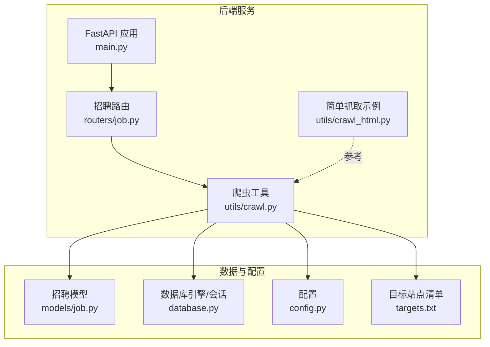
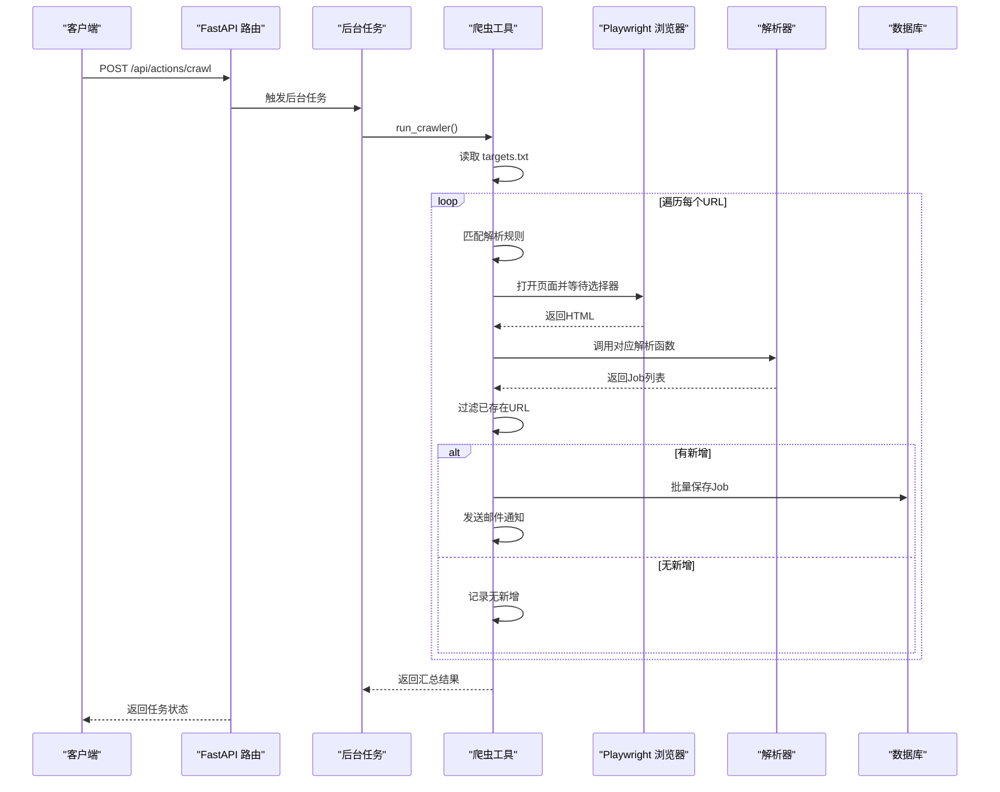
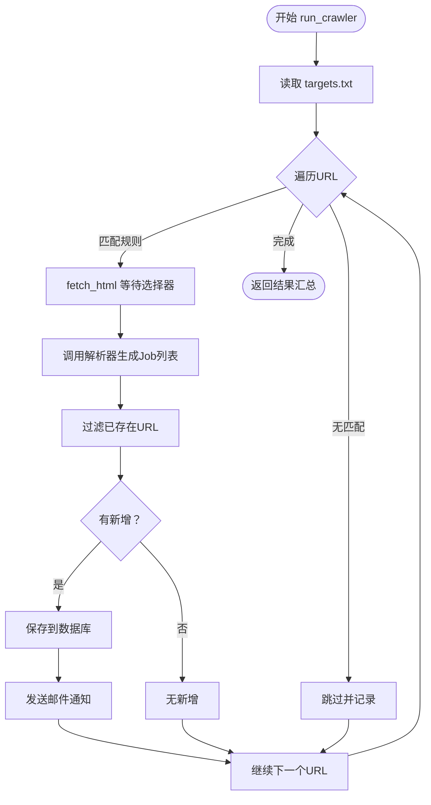
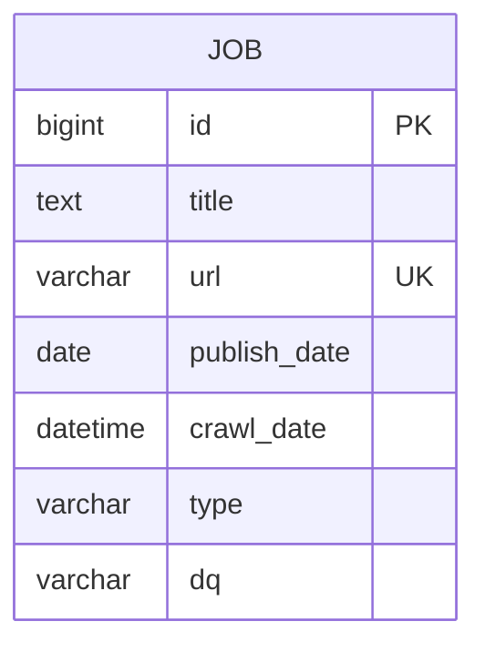
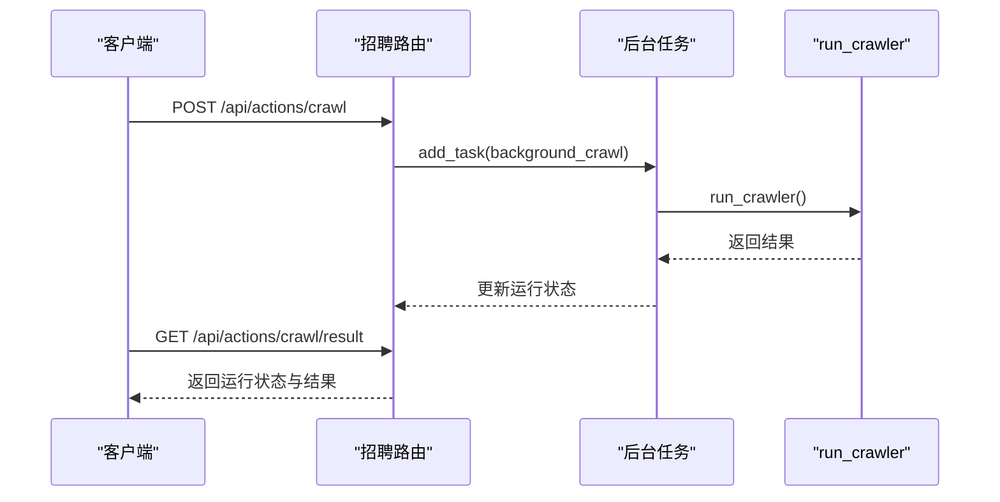
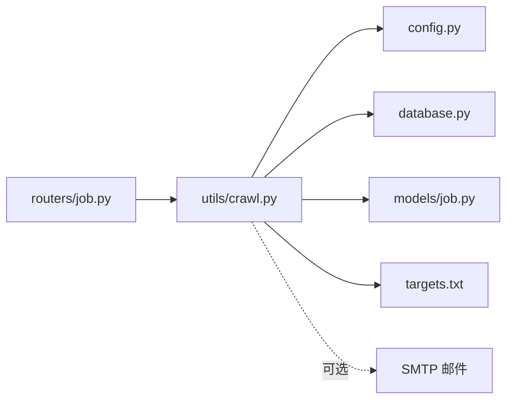

# 招聘数据爬取工具

<cite>
**本文引用的文件**
- [crawl.py](file://blog_backend/utils/crawl.py)
- [crawl_html.py](file://blog_backend/utils/crawl_html.py)
- [job.py](file://blog_backend/models/job.py)
- [job.py](file://blog_backend/routers/job.py)
- [config.py](file://blog_backend/config.py)
- [database.py](file://blog_backend/database.py)
- [targets.txt](file://blog_backend/targets.txt)
- [main.py](file://blog_backend/main.py)
- [pyproject.toml](file://blog_backend/pyproject.toml)
- [test.html](file://blog_backend/utils/test.html)
</cite>

## 目录
1. [引言](#引言)
2. [项目结构](#项目结构)
3. [核心组件](#核心组件)
4. [架构总览](#架构总览)
5. [详细组件分析](#详细组件分析)
6. [依赖分析](#依赖分析)
7. [性能考虑](#性能考虑)
8. [故障排查指南](#故障排查指南)
9. [结论](#结论)
10. [附录](#附录)

## 引言
本文件面向博客系统的招聘数据爬取工具，系统性阐述爬虫架构设计、数据提取算法、反爬虫应对机制、请求与响应处理、数据清洗与存储流程、异常处理与重试机制、性能优化与并发控制、数据质量保障、与招聘模型的数据交互以及定时任务集成方式。文档同时提供扩展开发指导与新网站适配方法，帮助读者快速理解并维护该爬虫系统。

## 项目结构
后端采用 FastAPI 提供 API，爬虫逻辑封装在工具模块中，数据库访问通过 SQLAlchemy 定义的模型与会话管理。核心文件分布如下：
- 工具层：crawl.py（主爬虫）、crawl_html.py（简单 HTML 抓取示例）
- 模型层：models/job.py（招聘数据表结构）
- 路由层：routers/job.py（提供触发爬取与查询接口）
- 配置层：config.py（数据库、目标站点、邮件配置）
- 数据库层：database.py（引擎与会话工厂）
- 启动入口：main.py（注册路由）
- 目标站点清单：targets.txt
- 依赖声明：pyproject.toml
- 示例页面：utils/test.html

图表来源
- [main.py:1-13](file://blog_backend/main.py#L1-L13)
- [job.py:1-97](file://blog_backend/routers/job.py#L1-L97)
- [crawl.py:1-445](file://blog_backend/utils/crawl.py#L1-L445)
- [crawl_html.py:1-72](file://blog_backend/utils/crawl_html.py#L1-L72)
- [job.py:1-15](file://blog_backend/models/job.py#L1-L15)
- [database.py:1-18](file://blog_backend/database.py#L1-L18)
- [config.py:1-32](file://blog_backend/config.py#L1-L32)
- [targets.txt:1-5](file://blog_backend/targets.txt#L1-L5)

章节来源
- [main.py:1-13](file://blog_backend/main.py#L1-L13)
- [pyproject.toml:1-22](file://blog_backend/pyproject.toml#L1-L22)

## 核心组件
- 爬虫主流程：基于 Playwright 的动态渲染页面抓取，按规则匹配解析器，过滤重复 URL，入库并可选发送邮件通知。
- 数据模型：统一的 Job 表，包含标题、URL、发布日期、抓取时间、类型、地区等字段。
- 路由接口：提供触发后台爬取、查询某日范围内的招聘信息、获取上次爬取结果。
- 配置中心：数据库连接、目标站点文件路径、邮件通知开关与凭据。
- 数据库层：SQLAlchemy 引擎与会话工厂，支持依赖注入。

章节来源
- [crawl.py:286-445](file://blog_backend/utils/crawl.py#L286-L445)
- [job.py:1-15](file://blog_backend/models/job.py#L1-L15)
- [job.py:17-97](file://blog_backend/routers/job.py#L17-L97)
- [config.py:19-32](file://blog_backend/config.py#L19-L32)
- [database.py:1-18](file://blog_backend/database.py#L1-L18)

## 架构总览
系统采用“API 触发 + 后台任务 + 动态渲染抓取 + 结构化解析 + 去重入库”的流水线架构。请求从 FastAPI 路由进入，后台任务调用爬虫工具，Playwright 渲染页面，BeautifulSoup 解析，再通过 SQLAlchemy 写入数据库。

图表来源
- [job.py:64-87](file://blog_backend/routers/job.py#L64-L87)
- [crawl.py:368-445](file://blog_backend/utils/crawl.py#L368-L445)
- [crawl.py:295-313](file://blog_backend/utils/crawl.py#L295-L313)
- [crawl.py:56-246](file://blog_backend/utils/crawl.py#L56-L246)
- [database.py:1-18](file://blog_backend/database.py#L1-L18)

## 详细组件分析

### 爬虫工具（crawl.py）
- 规则驱动：通过 CRAWL_RULES 将 URL 关键词映射到等待选择器与解析函数，支持多类页面（公司招聘、考试公告、南昌人才不同板块）。
- 动态渲染：使用 Playwright 启动 Chromium，打开页面并等待指定选择器，超时则直接获取内容，兼顾稳定性与性能。
- 解析器：针对不同页面结构实现解析函数，统一产出 Job 对象列表；日期解析具备容错，无法解析时回退为当前日期。
- 去重与入库：读取数据库现有 URL 集合，仅对新增 URL 保存；保存采用逐条提交+回滚策略，避免整批失败。
- 邮件通知：可选开启，按类别统计当日新增条目并发送 HTML 邮件。
- 主流程：读取 targets.txt → 匹配规则 → 抓取 → 解析 → 去重 → 保存 → 邮件 → 汇总结果。

图表来源
- [crawl.py:368-445](file://blog_backend/utils/crawl.py#L368-L445)
- [crawl.py:295-313](file://blog_backend/utils/crawl.py#L295-L313)
- [crawl.py:56-246](file://blog_backend/utils/crawl.py#L56-L246)
- [crawl.py:19-52](file://blog_backend/utils/crawl.py#L19-L52)

章节来源
- [crawl.py:19-52](file://blog_backend/utils/crawl.py#L19-L52)
- [crawl.py:56-246](file://blog_backend/utils/crawl.py#L56-L246)
- [crawl.py:249-292](file://blog_backend/utils/crawl.py#L249-L292)
- [crawl.py:295-313](file://blog_backend/utils/crawl.py#L295-L313)
- [crawl.py:315-368](file://blog_backend/utils/crawl.py#L315-L368)
- [crawl.py:368-445](file://blog_backend/utils/crawl.py#L368-L445)

### 数据模型（models/job.py）
- 字段设计：主键自增、标题文本、URL 唯一索引、发布日期、抓取时间默认值、类型与地区。
- 与爬虫的交互：爬虫解析器产出 Job 实例，经 SQLAlchemy 会话写入数据库。

图表来源
- [job.py:1-15](file://blog_backend/models/job.py#L1-L15)

章节来源
- [job.py:1-15](file://blog_backend/models/job.py#L1-L15)

### 路由与后台任务（routers/job.py）
- 接口能力：
  - GET /api/jobs：按日期与范围查询招聘信息。
  - POST /api/actions/crawl：触发后台爬取任务。
  - GET /api/actions/crawl/result：获取上次爬取结果与运行状态。
- 后台任务：使用 FastAPI 的 BackgroundTasks，避免阻塞请求；内部调用 run_crawler 并维护运行状态字典。

图表来源
- [job.py:64-97](file://blog_backend/routers/job.py#L64-L97)
- [job.py:17-61](file://blog_backend/routers/job.py#L17-L61)

章节来源
- [job.py:17-97](file://blog_backend/routers/job.py#L17-L97)

### 配置与数据库（config.py、database.py）
- 配置项：数据库连接串、基础 URL、目标文件路径、邮件开关与凭据。
- 数据库：创建引擎与会话工厂，提供依赖注入 get_db。

章节来源
- [config.py:19-32](file://blog_backend/config.py#L19-L32)
- [database.py:1-18](file://blog_backend/database.py#L1-L18)

### 目标站点清单（targets.txt）
- 维护待抓取的 URL 列表，爬虫按行读取并逐一处理。

章节来源
- [targets.txt:1-5](file://blog_backend/targets.txt#L1-L5)

### 简单 HTML 抓取示例（crawl_html.py）
- 使用 requests + BeautifulSoup 进行静态页面抓取，包含随机 UA 与随机延时，便于演示与对比。
- 用于理解页面结构与抽取字段，可作为新站点适配的参考。

章节来源
- [crawl_html.py:1-72](file://blog_backend/utils/crawl_html.py#L1-L72)

### 示例页面（test.html）
- 提供页面结构样例，便于解析器开发与调试。

章节来源
- [test.html:1-800](file://blog_backend/utils/test.html#L1-L800)

## 依赖分析
- 外部依赖：playwright、beautifulsoup4、sqlalchemy、pymysql、fastapi、uvicorn 等。
- 模块耦合：路由依赖爬虫工具；爬虫工具依赖配置、数据库会话与模型；解析器依赖 BeautifulSoup；邮件功能依赖 smtplib。

图表来源
- [job.py:1-97](file://blog_backend/routers/job.py#L1-L97)
- [crawl.py:13-16](file://blog_backend/utils/crawl.py#L13-L16)
- [config.py:19-32](file://blog_backend/config.py#L19-L32)
- [database.py:1-18](file://blog_backend/database.py#L1-L18)
- [job.py:1-15](file://blog_backend/models/job.py#L1-L15)
- [targets.txt:1-5](file://blog_backend/targets.txt#L1-L5)

章节来源
- [pyproject.toml:7-21](file://blog_backend/pyproject.toml#L7-L21)

## 性能考虑
- 动态渲染与等待策略：Playwright 在页面加载完成后等待指定选择器，超时则直接获取内容，平衡稳定性与耗时。
- 去重策略：数据库一次性读取现有 URL 集合，避免重复入库，减少无效写入。
- 逐条入库与回滚：逐条提交并在异常时回滚，降低整批失败概率。
- 并发控制：当前实现为顺序处理 URL 列表；若需并发，建议引入队列与限速，避免触发反爬虫检测。
- 请求间隔：可在解析器或抓取层增加随机等待，模拟人类行为。
- 缓存与增量：可引入 Redis 缓存热点页面或最近抓取结果，减少重复请求。

## 故障排查指南
- 目标文件缺失：当 targets.txt 不存在时，返回错误状态与提示信息。
- 规则不匹配：URL 未命中任一规则时跳过并记录原因。
- 页面等待超时：等待选择器超时会直接获取内容，避免长时间阻塞。
- 邮件发送失败：捕获异常并打印错误，不影响主流程。
- 数据库连接问题：检查 DATABASE_URL 环境变量与数据库可达性。
- 依赖缺失：确认 pyproject.toml 中依赖已安装。

章节来源
- [crawl.py:381-386](file://blog_backend/utils/crawl.py#L381-L386)
- [crawl.py:304-308](file://blog_backend/utils/crawl.py#L304-L308)
- [crawl.py:366-368](file://blog_backend/utils/crawl.py#L366-L368)
- [config.py:3-11](file://blog_backend/config.py#L3-L11)

## 结论
该招聘数据爬取工具以规则驱动与动态渲染为核心，结合去重与邮件通知机制，形成稳定的抓取-解析-入库-反馈闭环。通过 FastAPI 的后台任务与路由接口，系统具备良好的可运维性与扩展性。后续可在并发控制、缓存与增量策略、反爬虫对抗等方面进一步优化。

## 附录

### 爬取规则配置说明
- 关键词匹配：通过 URL 中的关键字定位规则。
- 等待选择器：确保页面关键内容加载完成后再解析。
- 解析函数：按页面结构定制解析逻辑，统一输出 Job 列表。
- 类别标签：用于邮件通知与结果分类。

章节来源
- [crawl.py:249-292](file://blog_backend/utils/crawl.py#L249-L292)

### 数据提取算法要点
- BeautifulSoup 选择器：针对不同页面结构选取容器与字段。
- 日期解析：统一转换为日期类型，异常时回退为当前日期。
- URL 规范化：处理相对路径与协议前缀，确保唯一性。

章节来源
- [crawl.py:56-246](file://blog_backend/utils/crawl.py#L56-L246)

### 反爬虫应对机制
- 动态渲染：Playwright 渲染 JavaScript，规避纯静态抓取。
- 等待策略：等待关键选择器出现，提高解析成功率。
- 邮件通知：可选开启，便于监控与告警。
- 建议增强：随机 UA、随机延时、代理池、验证码识别（如需）。

章节来源
- [crawl.py:295-313](file://blog_backend/utils/crawl.py#L295-L313)
- [crawl.py:315-368](file://blog_backend/utils/crawl.py#L315-L368)

### 请求发送与响应处理
- Playwright：打开页面、等待选择器、获取 HTML。
- BeautifulSoup：解析 HTML，抽取标题、链接、日期等字段。
- 错误处理：超时与异常捕获，保证流程继续。

章节来源
- [crawl.py:295-313](file://blog_backend/utils/crawl.py#L295-L313)
- [crawl.py:56-246](file://blog_backend/utils/crawl.py#L56-L246)

### 数据清洗与存储
- 去重：读取数据库现有 URL 集合，仅处理新增。
- 保存：逐条提交并回滚异常，避免整批失败。
- 字段清洗：去除空白、规范化日期与 URL。

章节来源
- [crawl.py:19-52](file://blog_backend/utils/crawl.py#L19-L52)
- [crawl.py:28-52](file://blog_backend/utils/crawl.py#L28-L52)

### 异常处理与重试机制
- 文件读取异常：targets.txt 不存在时返回错误状态。
- 页面等待超时：直接获取内容，继续解析。
- 保存异常：逐条回滚，记录失败条目。
- 建议：引入指数退避与最大重试次数，结合队列与限速。

章节来源
- [crawl.py:381-386](file://blog_backend/utils/crawl.py#L381-L386)
- [crawl.py:304-308](file://blog_backend/utils/crawl.py#L304-L308)
- [crawl.py:48-50](file://blog_backend/utils/crawl.py#L48-L50)

### 性能优化与并发控制
- 并发：使用队列与限速，避免触发反爬虫。
- 缓存：Redis 缓存热点页面或结果。
- 增量：仅抓取最新日期范围内的内容。
- 限速：随机延时与固定间隔，模拟人类行为。

章节来源
- [crawl_html.py:23-24](file://blog_backend/utils/crawl_html.py#L23-L24)

### 数据质量保证
- 唯一性：URL 设为唯一索引，入库前去重。
- 日期一致性：统一解析格式，异常回退。
- 字段完整性：缺失字段填充默认值，便于后续处理。

章节来源
- [job.py:8-14](file://blog_backend/models/job.py#L8-L14)
- [crawl.py:68-71](file://blog_backend/utils/crawl.py#L68-L71)

### 与招聘模型的数据交互
- ORM 映射：Job 模型与数据库表字段一一对应。
- 依赖注入：通过 get_db 提供会话，确保事务与连接管理。
- 写入策略：逐条提交，失败回滚，保证一致性。

章节来源
- [job.py:1-15](file://blog_backend/models/job.py#L1-L15)
- [database.py:12-18](file://blog_backend/database.py#L12-L18)

### 定时任务集成
- 当前实现：通过 API 触发后台任务，适合手动或 Web 集成。
- 建议：结合系统计划任务或调度系统（如 cron、Airflow、Celery）定时触发 /api/actions/crawl。

章节来源
- [job.py:64-87](file://blog_backend/routers/job.py#L64-L87)

### 扩展开发指导与新网站适配
- 新站点适配步骤：
  1) 在 targets.txt 中添加目标 URL。
  2) 在 CRAWL_RULES 中添加关键词、等待选择器与解析函数。
  3) 编写解析函数，使用 BeautifulSoup 选择器抽取字段，返回 Job 列表。
  4) 若页面为动态渲染，保持 Playwright 抓取；若为静态，可参考 crawl_html.py 的静态抓取模式。
  5) 验证去重与入库逻辑，确保 URL 唯一与日期正确。
  6) 开启邮件通知（可选），验证邮件发送。
- 参考文件：
  - [crawl.py:249-292](file://blog_backend/utils/crawl.py#L249-L292)
  - [crawl.py:56-246](file://blog_backend/utils/crawl.py#L56-L246)
  - [crawl_html.py:18-72](file://blog_backend/utils/crawl_html.py#L18-L72)
  - [test.html:1-800](file://blog_backend/utils/test.html#L1-L800)