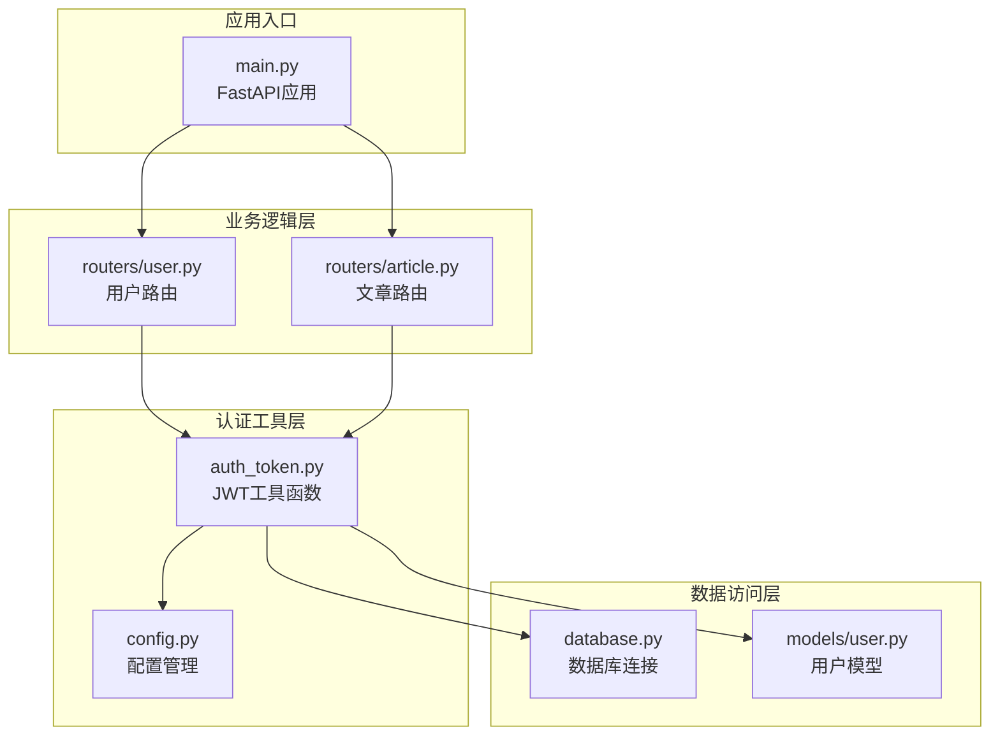
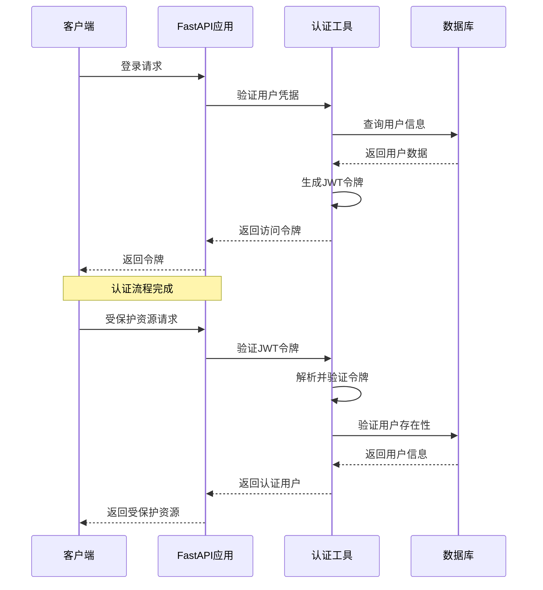
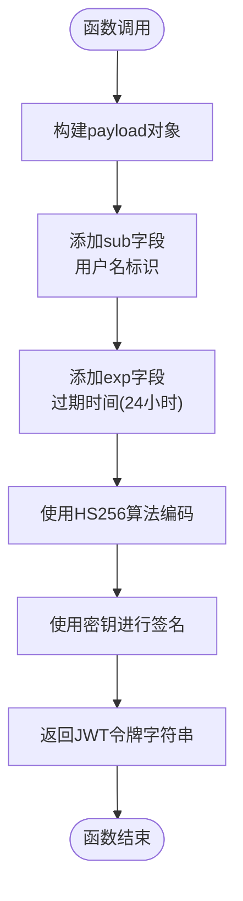
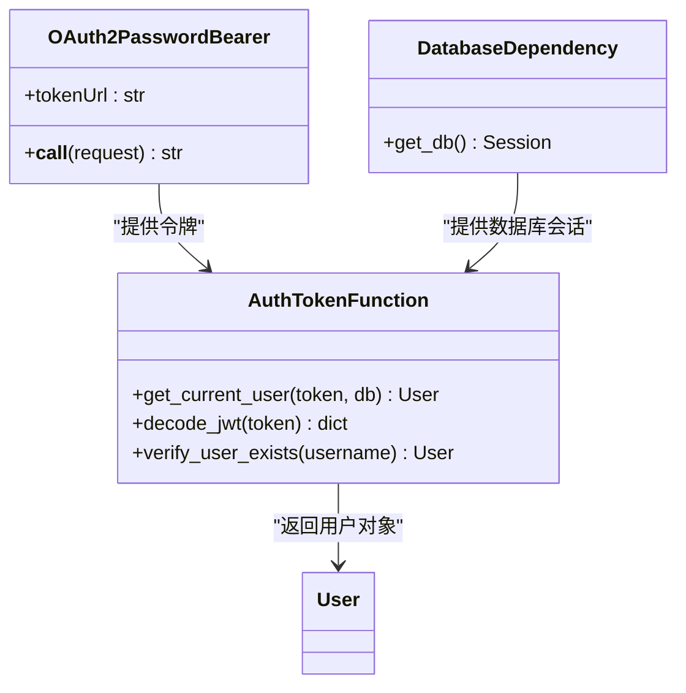
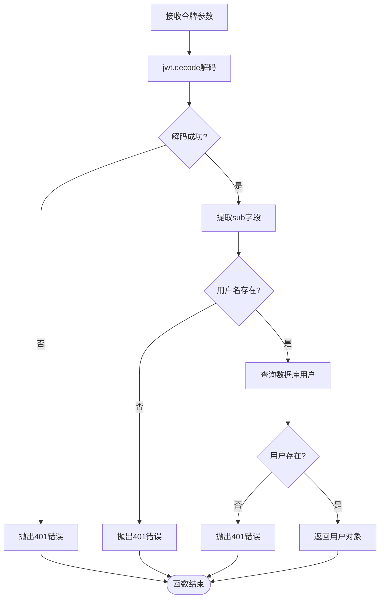
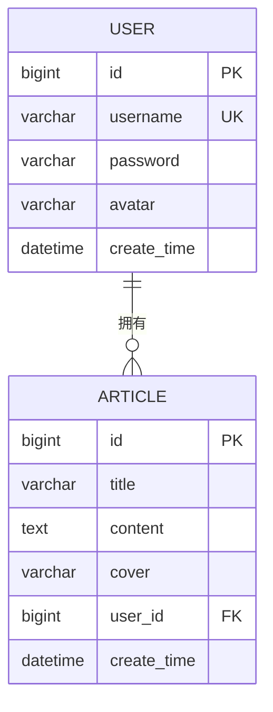
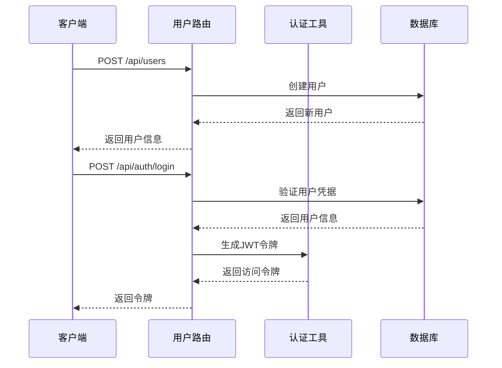
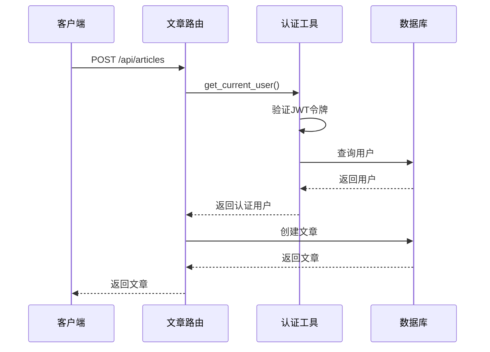
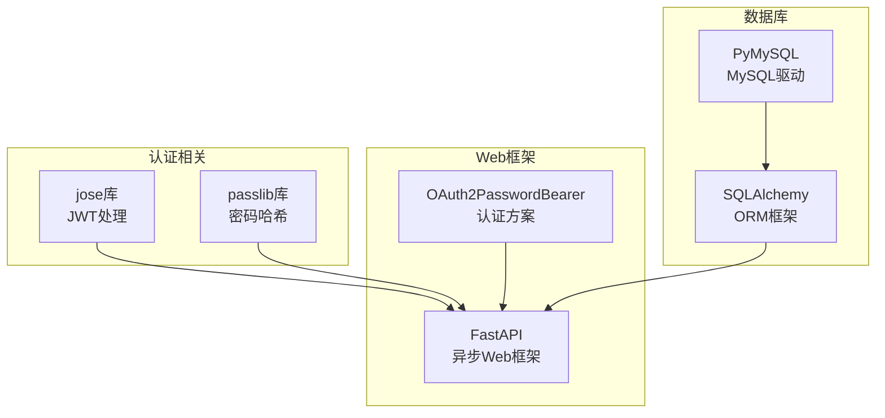
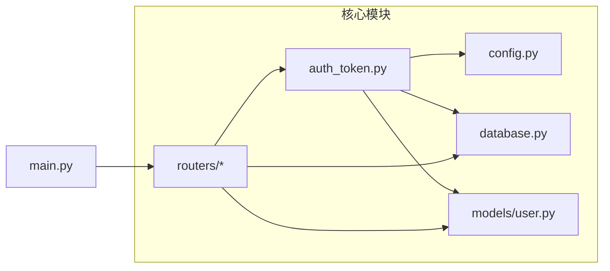

# 认证工具函数

<cite>
**本文档引用的文件**
- [auth_token.py](file://blog_backend/utils/auth_token.py)
- [config.py](file://blog_backend/config.py)
- [database.py](file://blog_backend/database.py)
- [user.py](file://blog_backend/models/user.py)
- [user.py](file://blog_backend/routers/user.py)
- [article.py](file://blog_backend/routers/article.py)
- [main.py](file://blog_backend/main.py)
- [schemas/user.py](file://blog_backend/schemas/user.py)
</cite>

## 目录
1. [简介](#简介)
2. [项目结构](#项目结构)
3. [核心组件](#核心组件)
4. [架构概览](#架构概览)
5. [详细组件分析](#详细组件分析)
6. [依赖关系分析](#依赖关系分析)
7. [性能考虑](#性能考虑)
8. [故障排除指南](#故障排除指南)
9. [结论](#结论)

## 简介

本文件详细介绍了博客系统中的认证工具函数，重点分析了JWT令牌生成、验证和用户认证的完整流程。文档涵盖了以下关键功能：

- `create_token` 函数的实现原理，包括payload构造、过期时间设置和加密算法
- `get_current_user` 函数的依赖注入机制、OAuth2密码流和数据库查询过程
- 令牌解析、异常处理和安全验证的实现细节
- 认证中间件的工作原理和在FastAPI中的集成方式
- 具体的使用示例、错误处理策略和安全最佳实践

## 项目结构

博客系统的认证功能主要分布在以下几个模块中：

**图表来源**
- [auth_token.py:1-38](file://blog_backend/utils/auth_token.py#L1-L38)
- [config.py:1-32](file://blog_backend/config.py#L1-L32)
- [database.py:1-18](file://blog_backend/database.py#L1-L18)
- [user.py:1-14](file://blog_backend/models/user.py#L1-L14)

**章节来源**
- [auth_token.py:1-38](file://blog_backend/utils/auth_token.py#L1-L38)
- [config.py:1-32](file://blog_backend/config.py#L1-L32)
- [database.py:1-18](file://blog_backend/database.py#L1-L18)

## 核心组件

### JWT工具函数模块

认证工具函数位于 `blog_backend/utils/auth_token.py` 文件中，包含两个核心函数：

1. **令牌生成函数** (`create_token`)
2. **用户认证函数** (`get_current_user`)

这两个函数共同构成了系统的JWT认证基础设施，支持用户身份验证和授权控制。

**章节来源**
- [auth_token.py:12-17](file://blog_backend/utils/auth_token.py#L12-L17)
- [auth_token.py:22-37](file://blog_backend/utils/auth_token.py#L22-L37)

## 架构概览

系统采用基于JWT的无状态认证架构，通过FastAPI的依赖注入机制实现自动化的用户身份验证。

**图表来源**
- [auth_token.py:12-17](file://blog_backend/utils/auth_token.py#L12-L17)
- [auth_token.py:22-37](file://blog_backend/utils/auth_token.py#L22-L37)
- [user.py:37-51](file://blog_backend/routers/user.py#L37-L51)

## 详细组件分析

### create_token 函数详解

`create_token` 函数负责生成JWT访问令牌，是整个认证系统的核心组件。

#### 实现原理

**图表来源**
- [auth_token.py:12-17](file://blog_backend/utils/auth_token.py#L12-L17)

#### Payload构造机制

函数采用标准的JWT payload格式：
- **sub (subject)**: 存储用户名作为令牌的主题标识
- **exp (expiration time)**: 设置24小时后过期的时间戳

#### 加密算法配置

系统使用HS256对称加密算法，密钥来源于配置文件中的 `secret_key` 变量。

**章节来源**
- [auth_token.py:12-17](file://blog_backend/utils/auth_token.py#L12-L17)
- [config.py:15-17](file://blog_backend/config.py#L15-L17)

### get_current_user 函数分析

`get_current_user` 函数实现了完整的用户认证流程，包括令牌验证和用户查询。

#### 依赖注入机制

**图表来源**
- [auth_token.py:20](file://blog_backend/utils/auth_token.py#L20)
- [auth_token.py:22-37](file://blog_backend/utils/auth_token.py#L22-L37)
- [database.py:12-18](file://blog_backend/database.py#L12-L18)

#### OAuth2密码流集成

函数通过FastAPI的 `OAuth2PasswordBearer` 类实现OAuth2密码流：
- **tokenUrl**: 设置为 `/api/user/login/`，用于令牌端点
- **自动提取**: 从HTTP Authorization头中提取Bearer令牌
- **依赖注入**: 自动传递令牌到函数参数

#### 令牌验证流程

**图表来源**
- [auth_token.py:22-37](file://blog_backend/utils/auth_token.py#L22-L37)

**章节来源**
- [auth_token.py:20-37](file://blog_backend/utils/auth_token.py#L20-L37)

### 数据库集成与用户模型

系统使用SQLAlchemy ORM进行数据库操作，用户模型定义如下：

**图表来源**
- [user.py:1-14](file://blog_backend/models/user.py#L1-L14)

**章节来源**
- [user.py:1-14](file://blog_backend/models/user.py#L1-L14)

### FastAPI路由集成

认证工具函数在多个路由中得到应用：

#### 用户认证路由

**图表来源**
- [user.py:37-51](file://blog_backend/routers/user.py#L37-L51)

#### 受保护资源路由

**图表来源**
- [article.py:12-25](file://blog_backend/routers/article.py#L12-L25)

**章节来源**
- [user.py:37-51](file://blog_backend/routers/user.py#L37-L51)
- [article.py:12-25](file://blog_backend/routers/article.py#L12-L25)

## 依赖关系分析

### 外部依赖

系统依赖以下关键外部库：

**图表来源**
- [auth_token.py:1-8](file://blog_backend/utils/auth_token.py#L1-L8)
- [user.py:7](file://blog_backend/routers/user.py#L7)

### 内部模块依赖

**图表来源**
- [auth_token.py:1-8](file://blog_backend/utils/auth_token.py#L1-L8)
- [main.py:1-13](file://blog_backend/main.py#L1-L13)

**章节来源**
- [auth_token.py:1-8](file://blog_backend/utils/auth_token.py#L1-L8)
- [main.py:1-13](file://blog_backend/main.py#L1-L13)

## 性能考虑

### JWT令牌性能特性

1. **无状态设计**: JWT令牌包含所有必要信息，无需服务器端存储
2. **快速验证**: 本地解码验证，避免数据库查询开销
3. **内存效率**: 令牌大小固定，适合高并发场景

### 数据库查询优化

1. **索引设计**: 用户名字段设置唯一索引，提高查询性能
2. **查询优化**: 使用 `first()` 方法避免不必要的结果集
3. **连接池**: SQLAlchemy连接池管理数据库连接

### 安全性能平衡

1. **令牌过期**: 24小时过期时间在安全性与用户体验间取得平衡
2. **密钥管理**: 使用环境变量存储密钥，避免硬编码
3. **算法选择**: HS256算法提供良好的性能和安全性

## 故障排除指南

### 常见认证错误

| 错误类型 | 错误代码 | 可能原因 | 解决方案 |
|---------|---------|---------|---------|
| 令牌无效 | 401 | JWT解码失败或签名不匹配 | 检查令牌格式和密钥配置 |
| 用户不存在 | 401 | 用户名在数据库中不存在 | 验证用户注册状态 |
| 密码错误 | 400 | 用户凭据验证失败 | 检查密码输入和哈希算法 |
| 权限不足 | 403 | 用户无权访问资源 | 验证用户权限和资源所有权 |

### 调试技巧

1. **令牌验证**: 使用在线JWT解码器验证令牌结构
2. **日志记录**: 启用FastAPI的详细日志输出
3. **数据库检查**: 验证用户表结构和数据完整性
4. **网络监控**: 检查Authorization头的传输

### 安全最佳实践

1. **密钥管理**: 使用强随机密钥，定期轮换
2. **HTTPS强制**: 在生产环境中启用HTTPS
3. **令牌刷新**: 考虑实现刷新令牌机制
4. **审计日志**: 记录重要的认证事件
5. **速率限制**: 实施登录尝试频率限制

**章节来源**
- [auth_token.py:25-31](file://blog_backend/utils/auth_token.py#L25-L31)
- [user.py:41-46](file://blog_backend/routers/user.py#L41-L46)

## 结论

博客系统的认证工具函数提供了完整的JWT认证解决方案，具有以下特点：

1. **简洁高效**: 基于JWT的无状态认证，减少服务器端状态管理
2. **易于集成**: 通过FastAPI依赖注入机制无缝集成到路由中
3. **安全可靠**: 采用标准的JWT规范和HS256加密算法
4. **可扩展性强**: 支持多种认证场景和自定义扩展

系统通过 `create_token` 和 `get_current_user` 两个核心函数，实现了从用户登录到资源访问的完整认证流程。配合FastAPI的依赖注入机制，开发者可以轻松地为任何路由添加认证保护。

建议在生产环境中进一步增强安全措施，如实现令牌刷新机制、加强密钥管理和实施更严格的访问控制策略。