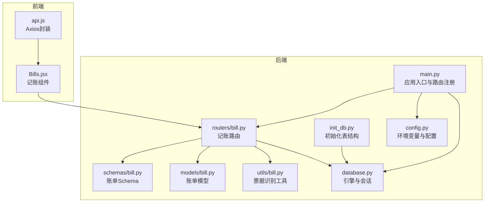
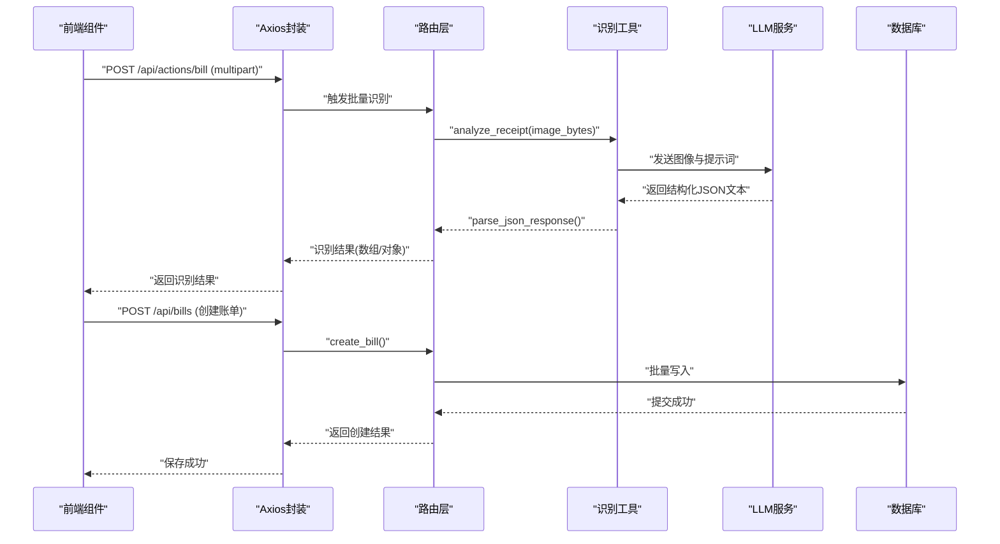
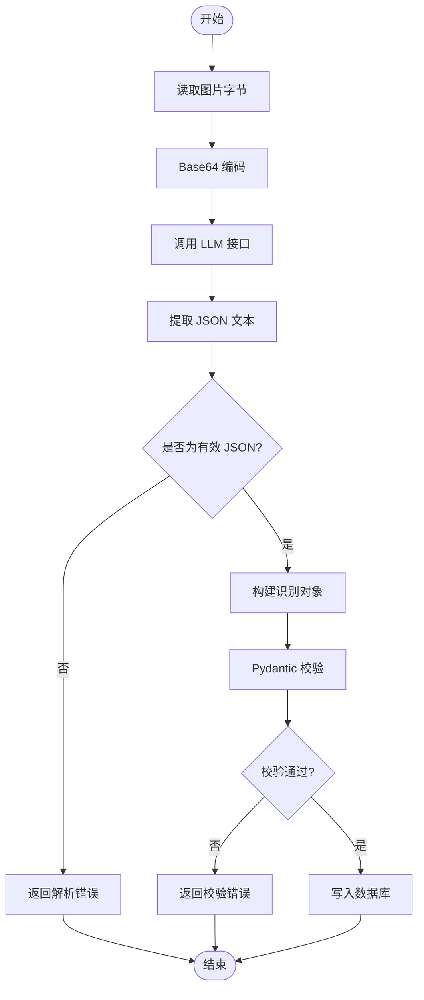
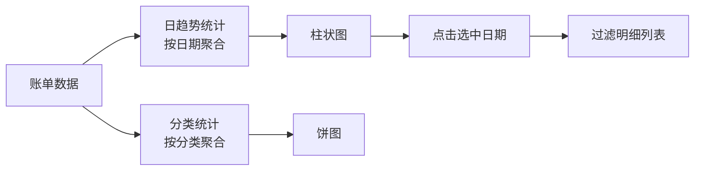
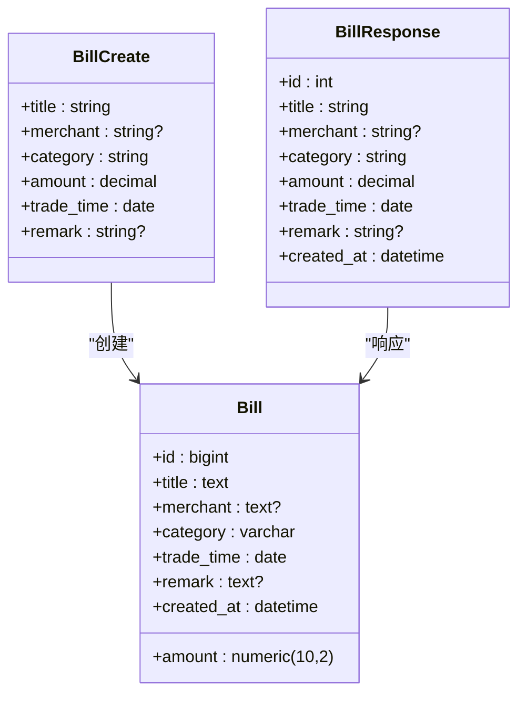
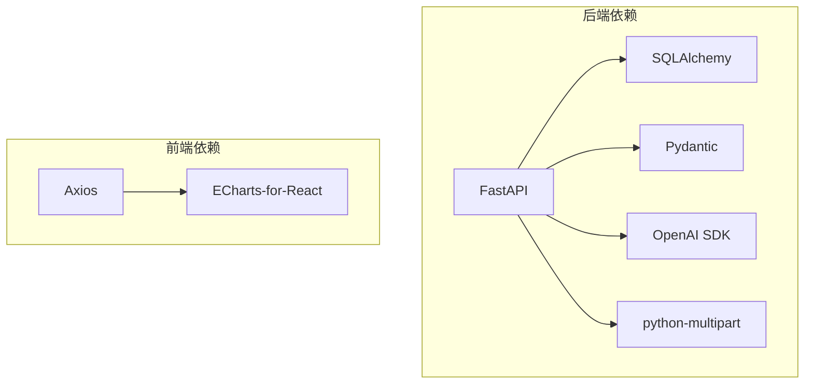

# 记账数据处理工具

<cite>
**本文引用的文件**
- [main.py](file://blog_backend/main.py)
- [config.py](file://blog_backend/config.py)
- [database.py](file://blog_backend/database.py)
- [init_db.py](file://blog_backend/init_db.py)
- [models/bill.py](file://blog_backend/models/bill.py)
- [schemas/bill.py](file://blog_backend/schemas/bill.py)
- [routers/bill.py](file://blog_backend/routers/bill.py)
- [utils/bill.py](file://blog_backend/utils/bill.py)
- [api.js](file://blog_frontend/src/api.js)
- [Bills.jsx](file://blog_frontend/src/components/Bills.jsx)
- [requirements.txt](file://blog_backend/requirements.txt)
- [pyproject.toml](file://blog_backend/pyproject.toml)
</cite>

## 目录
1. [简介](#简介)
2. [项目结构](#项目结构)
3. [核心组件](#核心组件)
4. [架构总览](#架构总览)
5. [详细组件分析](#详细组件分析)
6. [依赖分析](#依赖分析)
7. [性能考虑](#性能考虑)
8. [故障排查指南](#故障排查指南)
9. [结论](#结论)
10. [附录](#附录)

## 简介
本文件面向“博客系统中的记账数据处理工具”，系统性阐述财务数据的采集、解析、验证与入库流程；说明金额计算与分类统计的实现；明确数据验证规则、异常处理与数据完整性保障；给出使用示例、数据导入导出思路与报表生成方法；并提供最佳实践、性能优化建议与扩展开发指导。该系统由后端 FastAPI 应用、SQLAlchemy ORM 模型、Pydantic 数据校验、OpenAI 兼容接口的票据识别工具以及前端 ECharts 图表展示组成。

## 项目结构
后端采用分层设计：路由层负责 HTTP 接口与参数解析；模式层定义数据库表结构；模式层与路由层之间通过 Pydantic Schema 进行数据校验；工具层封装第三方服务调用；数据库层负责连接与会话管理；主程序注册路由并启动服务。前端通过 Axios 封装 API，提供票据上传、识别结果编辑与保存、图表展示与筛选。

**图表来源**
- [main.py:1-13](file://blog_backend/main.py#L1-L13)
- [config.py:1-32](file://blog_backend/config.py#L1-L32)
- [database.py:1-18](file://blog_backend/database.py#L1-L18)
- [init_db.py:1-10](file://blog_backend/init_db.py#L1-L10)
- [models/bill.py:1-24](file://blog_backend/models/bill.py#L1-L24)
- [schemas/bill.py:1-40](file://blog_backend/schemas/bill.py#L1-L40)
- [routers/bill.py:1-173](file://blog_backend/routers/bill.py#L1-L173)
- [utils/bill.py:1-107](file://blog_backend/utils/bill.py#L1-L107)
- [api.js:1-40](file://blog_frontend/src/api.js#L1-L40)
- [Bills.jsx:1-539](file://blog_frontend/src/components/Bills.jsx#L1-L539)

**章节来源**
- [main.py:1-13](file://blog_backend/main.py#L1-L13)
- [config.py:1-32](file://blog_backend/config.py#L1-L32)
- [database.py:1-18](file://blog_backend/database.py#L1-L18)
- [init_db.py:1-10](file://blog_backend/init_db.py#L1-L10)
- [models/bill.py:1-24](file://blog_backend/models/bill.py#L1-L24)
- [schemas/bill.py:1-40](file://blog_backend/schemas/bill.py#L1-L40)
- [routers/bill.py:1-173](file://blog_backend/routers/bill.py#L1-L173)
- [utils/bill.py:1-107](file://blog_backend/utils/bill.py#L1-L107)
- [api.js:1-40](file://blog_frontend/src/api.js#L1-L40)
- [Bills.jsx:1-539](file://blog_frontend/src/components/Bills.jsx#L1-L539)

## 核心组件
- 应用入口与路由注册：在应用启动时注册记账模块路由，统一前缀与标签。
- 配置中心：读取数据库连接串、密钥算法等运行时配置。
- 数据库层：创建引擎、会话工厂与基础模型基类，提供依赖注入。
- 模型层：定义账单表结构，包含标题、商户、分类、金额、交易时间、备注与创建时间。
- Schema 层：定义创建与响应模型，内置金额格式校验（保留两位小数且大于零）。
- 路由层：提供票据批量识别、账单创建（单个/批量）、账单查询（按日期范围）。
- 工具层：封装 OpenAI 兼容接口，进行图像识别并解析结构化 JSON。
- 前端组件：提供上传识别、编辑识别结果、保存入库、图表展示与筛选。

**章节来源**
- [main.py:1-13](file://blog_backend/main.py#L1-L13)
- [config.py:1-32](file://blog_backend/config.py#L1-L32)
- [database.py:1-18](file://blog_backend/database.py#L1-L18)
- [models/bill.py:1-24](file://blog_backend/models/bill.py#L1-L24)
- [schemas/bill.py:1-40](file://blog_backend/schemas/bill.py#L1-L40)
- [routers/bill.py:1-173](file://blog_backend/routers/bill.py#L1-L173)
- [utils/bill.py:1-107](file://blog_backend/utils/bill.py#L1-L107)
- [api.js:1-40](file://blog_frontend/src/api.js#L1-L40)
- [Bills.jsx:1-539](file://blog_frontend/src/components/Bills.jsx#L1-L539)

## 架构总览
系统采用前后端分离架构：前端负责用户交互与可视化，后端提供 REST API 与业务逻辑。识别流程通过 OpenAI 兼容接口完成图像到结构化 JSON 的转换；后端对识别结果进行二次校验与入库；前端负责展示与交互。

**图表来源**
- [routers/bill.py:24-51](file://blog_backend/routers/bill.py#L24-L51)
- [utils/bill.py:17-77](file://blog_backend/utils/bill.py#L17-L77)
- [api.js:29-35](file://blog_frontend/src/api.js#L29-L35)
- [Bills.jsx:222-284](file://blog_frontend/src/components/Bills.jsx#L222-L284)

## 详细组件分析

### 财务数据解析与验证
- 解析流程：前端上传图片，后端异步执行识别工具；识别工具将图像编码为 base64 并调用 LLM 接口，返回结构化 JSON 文本；工具层尝试去除代码块包裹并解析 JSON。
- 验证规则：
  - 金额必须为正数，保留两位小数。
  - 标题、分类、金额、交易时间必填；商户与备注可选。
  - 交易时间格式为日期类型。
- 异常处理：识别阶段捕获异常并返回错误信息；创建账单阶段捕获异常并回滚事务。

**图表来源**
- [utils/bill.py:17-107](file://blog_backend/utils/bill.py#L17-L107)
- [schemas/bill.py:7-23](file://blog_backend/schemas/bill.py#L7-L23)
- [routers/bill.py:55-116](file://blog_backend/routers/bill.py#L55-L116)

**章节来源**
- [utils/bill.py:17-107](file://blog_backend/utils/bill.py#L17-L107)
- [schemas/bill.py:7-23](file://blog_backend/schemas/bill.py#L7-L23)
- [routers/bill.py:55-116](file://blog_backend/routers/bill.py#L55-L116)

### 数据格式转换与金额计算
- 金额转换：识别结果中的金额字符串经工具层解析后，交由 Schema 校验器统一转换为保留两位小数的十进制数。
- 金额计算：前端图表按日/分类聚合金额，使用浮点累加并保留两位小数，确保展示一致性。

**章节来源**
- [schemas/bill.py:16-22](file://blog_backend/schemas/bill.py#L16-L22)
- [Bills.jsx:80-90](file://blog_frontend/src/components/Bills.jsx#L80-L90)
- [Bills.jsx:171-181](file://blog_frontend/src/components/Bills.jsx#L171-L181)

### 分类统计与报表生成
- 日趋势柱状图：按周/月维度统计每日总支出，支持点击切换选中日期并过滤明细。
- 分类占比饼图：按周/月维度统计各分类总支出占比。
- 交互逻辑：前端根据日期范围与查询日期动态生成图表数据，并支持缩放与点击联动。

**图表来源**
- [Bills.jsx:52-151](file://blog_frontend/src/components/Bills.jsx#L52-L151)
- [Bills.jsx:153-207](file://blog_frontend/src/components/Bills.jsx#L153-L207)
- [Bills.jsx:216-220](file://blog_frontend/src/components/Bills.jsx#L216-L220)

**章节来源**
- [Bills.jsx:52-151](file://blog_frontend/src/components/Bills.jsx#L52-L151)
- [Bills.jsx:153-207](file://blog_frontend/src/components/Bills.jsx#L153-L207)
- [Bills.jsx:216-220](file://blog_frontend/src/components/Bills.jsx#L216-L220)

### 数据验证规则与完整性保证
- 后端验证：Pydantic Schema 对必填字段、长度、数值范围与格式进行约束；数据库层通过 Numeric(10,2) 限制金额精度与范围。
- 事务与回滚：创建账单失败时回滚，避免脏数据。
- 前端校验：输入控件对必填字段与数值范围进行即时反馈。

**章节来源**
- [schemas/bill.py:7-23](file://blog_backend/schemas/bill.py#L7-L23)
- [models/bill.py:10-16](file://blog_backend/models/bill.py#L10-L16)
- [routers/bill.py:110-116](file://blog_backend/routers/bill.py#L110-L116)
- [Bills.jsx:324-401](file://blog_frontend/src/components/Bills.jsx#L324-L401)

### 使用示例
- 上传识别：前端选择图片文件，调用识别接口，得到结构化账单候选。
- 编辑确认：在前端表格中修改日期、标题、商户、分类、金额与备注。
- 保存入库：提交已确认的账单，后端批量创建并返回结果。
- 查看报表：切换周/月与查询日期，查看日趋势与分类占比图表。

**章节来源**
- [api.js:29-35](file://blog_frontend/src/api.js#L29-L35)
- [Bills.jsx:222-284](file://blog_frontend/src/components/Bills.jsx#L222-L284)
- [routers/bill.py:117-173](file://blog_backend/routers/bill.py#L117-L173)

### 数据导入导出与报表
- 导入：通过识别接口批量上传图片，识别后在前端确认并保存。
- 导出：当前未提供专门的导出接口；可在前端将账单列表复制或截图，或基于现有查询接口扩展导出功能。
- 报表：前端内置柱状图与饼图，支持缩放与点击联动。

**章节来源**
- [routers/bill.py:24-51](file://blog_backend/routers/bill.py#L24-L51)
- [routers/bill.py:117-173](file://blog_backend/routers/bill.py#L117-L173)
- [Bills.jsx:474-496](file://blog_frontend/src/components/Bills.jsx#L474-L496)

### 与记账模型的数据交互与 API 集成
- 模型交互：路由层接收 Schema 对象，映射为模型实例并批量写入数据库。
- API 集成：前端通过 Axios 封装的 API 调用后端接口，统一携带认证头。

**图表来源**
- [schemas/bill.py:7-39](file://blog_backend/schemas/bill.py#L7-L39)
- [models/bill.py:7-18](file://blog_backend/models/bill.py#L7-L18)
- [routers/bill.py:55-116](file://blog_backend/routers/bill.py#L55-L116)

**章节来源**
- [schemas/bill.py:7-39](file://blog_backend/schemas/bill.py#L7-L39)
- [models/bill.py:7-18](file://blog_backend/models/bill.py#L7-L18)
- [routers/bill.py:55-116](file://blog_backend/routers/bill.py#L55-L116)

## 依赖分析
- 后端依赖：FastAPI 提供 Web 框架与路由装饰器；SQLAlchemy 提供 ORM 与数据库连接；Pydantic 提供数据校验；OpenAI SDK 提供 LLM 调用；python-multipart 支持多部分表单上传。
- 前端依赖：Axios 提供 HTTP 客户端；ECharts-for-React 提供图表渲染。

**图表来源**
- [requirements.txt:1-14](file://blog_backend/requirements.txt#L1-L14)
- [pyproject.toml:1-22](file://blog_backend/pyproject.toml#L1-L22)
- [api.js:1-40](file://blog_frontend/src/api.js#L1-L40)

**章节来源**
- [requirements.txt:1-14](file://blog_backend/requirements.txt#L1-L14)
- [pyproject.toml:1-22](file://blog_backend/pyproject.toml#L1-L22)
- [api.js:1-40](file://blog_frontend/src/api.js#L1-L40)

## 性能考虑
- I/O 与并发：识别接口使用线程池执行同步分析函数，避免阻塞事件循环；建议在生产环境增加并发限制与超时控制。
- 数据库写入：批量插入减少往返次数；注意索引与事务大小，避免大事务导致锁竞争。
- 前端渲染：图表数据按需计算与缓存，避免重复计算；在大数据量场景下启用数据压缩与虚拟滚动。
- LLM 调用：合理设置温度与提示词，减少无效输出；对频繁调用场景考虑本地缓存或降级策略。

## 故障排查指南
- 识别失败：检查图像格式与大小；确认 LLM 接口可用与网络连通；查看返回的错误信息并定位问题。
- 校验失败：核对金额格式、必填字段与长度限制；修正前端输入或后端 Schema。
- 保存失败：查看数据库连接与权限；关注事务回滚日志；确认幂等性与重复提交。
- 前端异常：检查 Axios 请求拦截器与认证头；确认路由路径与参数传递。

**章节来源**
- [utils/bill.py:75-76](file://blog_backend/utils/bill.py#L75-L76)
- [routers/bill.py:110-116](file://blog_backend/routers/bill.py#L110-L116)
- [Bills.jsx:248-256](file://blog_frontend/src/components/Bills.jsx#L248-L256)

## 结论
该记账工具通过“图像识别 + 数据校验 + 批量入库 + 图表展示”的完整链路，实现了从票据到报表的闭环。系统具备清晰的分层与职责划分，验证与异常处理机制完备，前端交互友好。后续可在导出能力、识别准确性与性能优化方面持续增强。

## 附录
- 快速启动
  - 初始化数据库：执行数据库初始化脚本以创建表结构。
  - 启动后端：使用 Uvicorn 运行应用入口文件。
  - 启动前端：安装依赖后运行开发服务器。
- 环境变量
  - 数据库连接串通过环境变量配置；建议在生产环境使用安全的密钥与连接池参数。
- 扩展建议
  - 增加识别结果审核流程与审计日志。
  - 提供账单导出接口与模板下载。
  - 引入缓存与限流策略，提升高并发稳定性。
  - 增强分类体系与规则引擎，支持更细粒度的统计与预测。