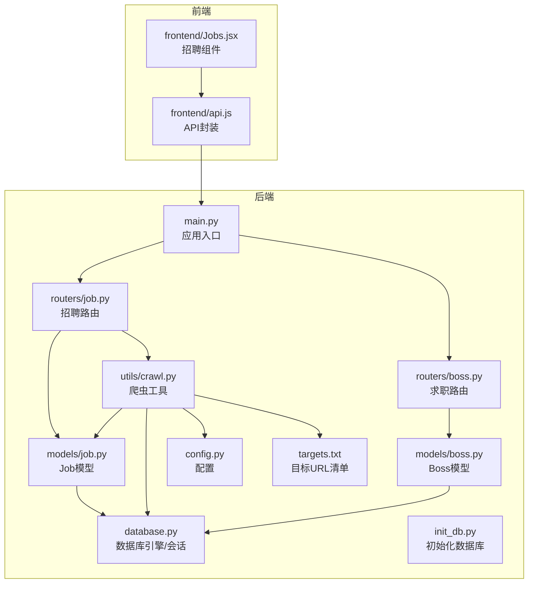
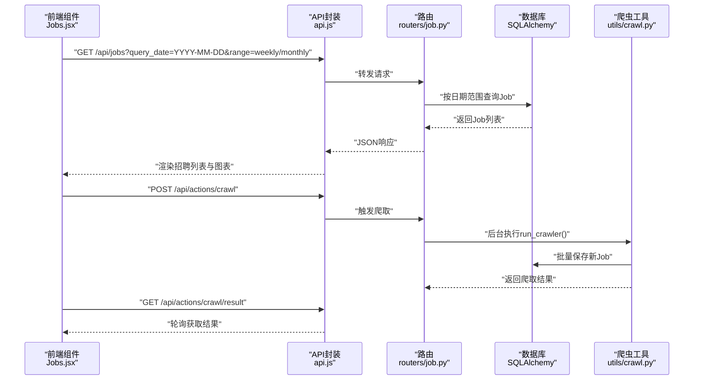
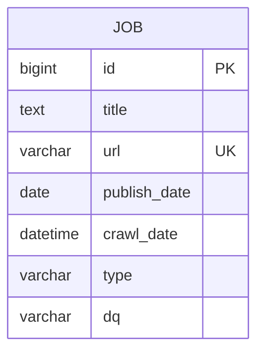
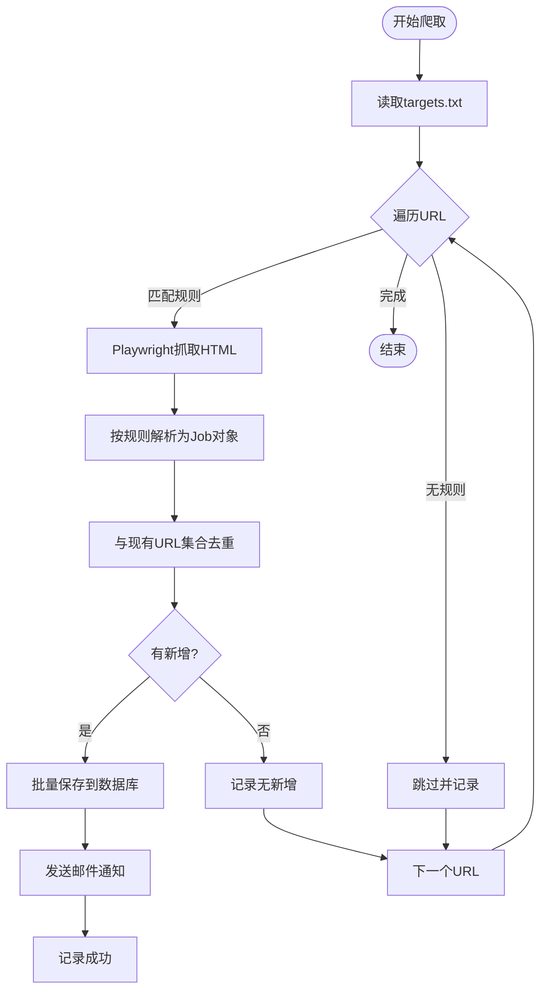
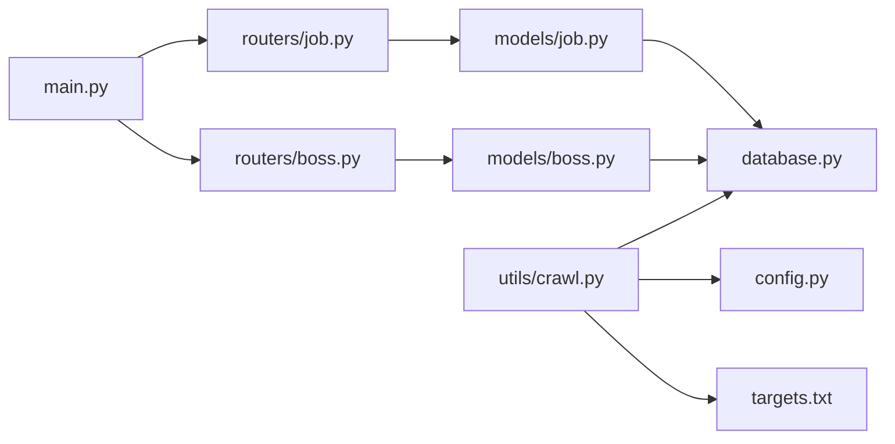

# 招聘数据模型

<cite>
**本文引用的文件**
- [models/job.py](file://blog_backend/models/job.py)
- [routers/job.py](file://blog_backend/routers/job.py)
- [utils/crawl.py](file://blog_backend/utils/crawl.py)
- [database.py](file://blog_backend/database.py)
- [config.py](file://blog_backend/config.py)
- [init_db.py](file://blog_backend/init_db.py)
- [targets.txt](file://blog_backend/targets.txt)
- [main.py](file://blog_backend/main.py)
- [schemas/boss.py](file://blog_backend/schemas/boss.py)
- [models/boss.py](file://blog_backend/models/boss.py)
- [routers/boss.py](file://blog_backend/routers/boss.py)
- [frontend/Jobs.jsx](file://blog_frontend/src/components/Jobs.jsx)
- [frontend/api.js](file://blog_frontend/src/api.js)
</cite>

## 目录
1. [简介](#简介)
2. [项目结构](#项目结构)
3. [核心组件](#核心组件)
4. [架构总览](#架构总览)
5. [详细组件分析](#详细组件分析)
6. [依赖分析](#依赖分析)
7. [性能考虑](#性能考虑)
8. [故障排查指南](#故障排查指南)
9. [结论](#结论)
10. [附录](#附录)

## 简介
本技术文档围绕招聘数据模型进行系统化梳理，重点覆盖以下方面：
- Job模型的表结构设计与字段含义
- 招聘数据字段设计原理（如薪资字段缺失、地理位置字段存储方式）
- 招聘数据的分类体系（行业分类、职位级别、工作性质等现状与扩展建议）
- 查询优化策略、搜索功能实现与数据更新机制
- 实际应用场景与扩展方案

本项目采用FastAPI + SQLAlchemy + MySQL的后端架构，结合Playwright爬虫与前端可视化展示，形成从数据采集、存储、查询到可视化的完整链路。

## 项目结构
后端采用分层结构：路由层(routers)、模型层(models)、工具层(utils)、配置(config)与数据库初始化(init_db)；前端通过React组件与API交互，实现招聘数据的展示与爬取控制。

**图表来源**
- [main.py:1-13](file://blog_backend/main.py#L1-L13)
- [routers/job.py:1-97](file://blog_backend/routers/job.py#L1-L97)
- [routers/boss.py:1-134](file://blog_backend/routers/boss.py#L1-L134)
- [models/job.py:1-15](file://blog_backend/models/job.py#L1-L15)
- [models/boss.py:1-15](file://blog_backend/models/boss.py#L1-L15)
- [utils/crawl.py:1-445](file://blog_backend/utils/crawl.py#L1-L445)
- [database.py:1-18](file://blog_backend/database.py#L1-L18)
- [config.py:1-32](file://blog_backend/config.py#L1-L32)
- [init_db.py:1-10](file://blog_backend/init_db.py#L1-L10)
- [targets.txt:1-5](file://blog_backend/targets.txt#L1-L5)
- [frontend/api.js:1-40](file://blog_frontend/src/api.js#L1-L40)
- [frontend/Jobs.jsx:1-362](file://blog_frontend/src/components/Jobs.jsx#L1-L362)

**章节来源**
- [main.py:1-13](file://blog_backend/main.py#L1-L13)
- [routers/job.py:1-97](file://blog_backend/routers/job.py#L1-L97)
- [routers/boss.py:1-134](file://blog_backend/routers/boss.py#L1-L134)
- [models/job.py:1-15](file://blog_backend/models/job.py#L1-L15)
- [models/boss.py:1-15](file://blog_backend/models/boss.py#L1-L15)
- [utils/crawl.py:1-445](file://blog_backend/utils/crawl.py#L1-L445)
- [database.py:1-18](file://blog_backend/database.py#L1-L18)
- [config.py:1-32](file://blog_backend/config.py#L1-L32)
- [init_db.py:1-10](file://blog_backend/init_db.py#L1-L10)
- [targets.txt:1-5](file://blog_backend/targets.txt#L1-L5)
- [frontend/api.js:1-40](file://blog_frontend/src/api.js#L1-L40)
- [frontend/Jobs.jsx:1-362](file://blog_frontend/src/components/Jobs.jsx#L1-L362)

## 核心组件
- Job模型：用于存储招聘数据，包含职位标题、唯一URL、发布日期、爬取时间、类型、地区等字段。
- Boss模型：用于存储求职投递记录，包含标题、URL、详情、爬取时间、地区等字段。
- 路由层：提供招聘数据查询接口与爬取触发接口；提供求职数据的爬取与查询接口。
- 爬虫工具：基于Playwright解析HTML，按规则提取招聘信息并入库。
- 数据库层：SQLAlchemy声明式模型与会话管理，支持MySQL连接。
- 前端组件：提供招聘数据展示、图表统计、爬取控制与结果查看。

**章节来源**
- [models/job.py:1-15](file://blog_backend/models/job.py#L1-L15)
- [models/boss.py:1-15](file://blog_backend/models/boss.py#L1-L15)
- [routers/job.py:1-97](file://blog_backend/routers/job.py#L1-L97)
- [routers/boss.py:1-134](file://blog_backend/routers/boss.py#L1-L134)
- [utils/crawl.py:1-445](file://blog_backend/utils/crawl.py#L1-L445)
- [database.py:1-18](file://blog_backend/database.py#L1-L18)

## 架构总览
系统采用前后端分离架构，后端通过FastAPI提供REST接口，前端通过Axios调用后端接口，实现招聘数据的展示与爬取控制。

**图表来源**
- [frontend/Jobs.jsx:1-362](file://blog_frontend/src/components/Jobs.jsx#L1-L362)
- [frontend/api.js:1-40](file://blog_frontend/src/api.js#L1-L40)
- [routers/job.py:17-97](file://blog_backend/routers/job.py#L17-L97)
- [utils/crawl.py:368-445](file://blog_backend/utils/crawl.py#L368-L445)
- [models/job.py:1-15](file://blog_backend/models/job.py#L1-L15)

## 详细组件分析

### Job模型与表结构设计
- 表名：job
- 主键：id（自增BigInteger）
- 关键字段：
  - title：文本字段，存储职位标题
  - url：字符串字段，唯一且非空，存储职位链接
  - publish_date：日期字段，存储发布日期
  - crawl_date：时间戳字段，默认当前时间
  - type：字符串字段，存储招聘类型（如公司招聘、考试公告、国企/企业/名企）
  - dq：字符串字段，存储地区（如江西）

字段设计原则与考量：
- 唯一性约束：url设置为唯一，避免重复存储相同职位
- 时间维度：publish_date用于展示与筛选，crawl_date用于记录入库时间
- 分类字段：type用于区分不同来源或类型的招聘信息，dq用于地理筛选
- 扩展建议：若需薪资字段，可增加最小/最大薪资字段，并在前端与爬虫解析中补充；若需更精细的分类，可引入枚举或外键关联的分类表

**图表来源**
- [models/job.py:5-15](file://blog_backend/models/job.py#L5-L15)

**章节来源**
- [models/job.py:1-15](file://blog_backend/models/job.py#L1-L15)

### 招聘数据分类体系
- 招聘类型(type)：来源于爬虫解析规则，包括公司招聘、考试公告、南昌人才国企、南昌人才企业、南昌人才名企等
- 地区(dq)：统一标注为“江西”，便于按地区筛选
- 扩展建议：
  - 引入独立的分类表（如job_category）与job表建立多对一关系，支持行业分类、职位级别、工作性质等多维标签
  - 使用枚举或字典表维护type值，保证一致性与可扩展性

**章节来源**
- [utils/crawl.py:250-284](file://blog_backend/utils/crawl.py#L250-L284)
- [utils/crawl.py:56-81](file://blog_backend/utils/crawl.py#L56-L81)
- [utils/crawl.py:83-107](file://blog_backend/utils/crawl.py#L83-L107)
- [utils/crawl.py:109-149](file://blog_backend/utils/crawl.py#L109-L149)
- [utils/crawl.py:152-198](file://blog_backend/utils/crawl.py#L152-L198)
- [utils/crawl.py:201-246](file://blog_backend/utils/crawl.py#L201-L246)

### 查询优化策略与搜索功能
- 日期范围查询：后端提供按周/月范围查询接口，前端根据选择切换
- 排序与过滤：按id倒序返回，便于展示最新数据
- 建议优化：
  - 为publish_date与crawl_date建立索引，提升范围查询性能
  - 为type与dq建立索引，支持多条件过滤
  - 前端可增加关键词搜索框，后端在title或details字段上做模糊匹配（如typeahead）
  - 支持分页与游标分页，避免一次性返回大量数据

**章节来源**
- [routers/job.py:17-61](file://blog_backend/routers/job.py#L17-L61)
- [frontend/Jobs.jsx:24-46](file://blog_frontend/src/components/Jobs.jsx#L24-L46)

### 数据更新机制
- 爬取触发：后端提供触发爬取接口，前端确认后启动后台任务
- 爬取流程：读取targets.txt中的URL，按规则解析HTML，去重后入库，发送邮件通知
- 结果轮询：前端定时轮询爬取结果，完成后刷新列表
- 去重策略：基于现有URL集合判断是否新增，避免重复入库

**图表来源**
- [utils/crawl.py:368-445](file://blog_backend/utils/crawl.py#L368-L445)
- [utils/crawl.py:19-53](file://blog_backend/utils/crawl.py#L19-L53)
- [utils/crawl.py:286-292](file://blog_backend/utils/crawl.py#L286-L292)
- [utils/crawl.py:295-313](file://blog_backend/utils/crawl.py#L295-L313)
- [utils/crawl.py:315-368](file://blog_backend/utils/crawl.py#L315-L368)
- [routers/job.py:81-97](file://blog_backend/routers/job.py#L81-L97)

**章节来源**
- [routers/job.py:62-97](file://blog_backend/routers/job.py#L62-L97)
- [utils/crawl.py:19-53](file://blog_backend/utils/crawl.py#L19-L53)
- [utils/crawl.py:368-445](file://blog_backend/utils/crawl.py#L368-L445)

### 前端展示与交互
- 图表统计：按周/月聚合每日职位数量，支持点击选择具体日期
- 列表展示：支持按日期过滤，展示标题、类型、地区、发布日期
- 爬取控制：提供“开始爬取”按钮，轮询获取结果并刷新列表

**章节来源**
- [frontend/Jobs.jsx:1-362](file://blog_frontend/src/components/Jobs.jsx#L1-L362)
- [frontend/api.js:26-28](file://blog_frontend/src/api.js#L26-L28)

## 依赖分析
- 应用入口：main.py注册路由模块
- 数据库：database.py提供引擎与会话，init_db.py初始化表结构
- 配置：config.py集中管理数据库URL、基础URL、目标文件路径与邮件配置
- 爬虫：utils/crawl.py依赖Playwright与BeautifulSoup，读取targets.txt，解析HTML并入库
- 路由：routers/job.py提供查询与爬取接口；routers/boss.py提供求职相关接口

**图表来源**
- [main.py:1-13](file://blog_backend/main.py#L1-L13)
- [routers/job.py:1-97](file://blog_backend/routers/job.py#L1-L97)
- [routers/boss.py:1-134](file://blog_backend/routers/boss.py#L1-L134)
- [models/job.py:1-15](file://blog_backend/models/job.py#L1-L15)
- [models/boss.py:1-15](file://blog_backend/models/boss.py#L1-L15)
- [database.py:1-18](file://blog_backend/database.py#L1-L18)
- [config.py:1-32](file://blog_backend/config.py#L1-L32)
- [utils/crawl.py:1-445](file://blog_backend/utils/crawl.py#L1-L445)
- [targets.txt:1-5](file://blog_backend/targets.txt#L1-L5)

**章节来源**
- [main.py:1-13](file://blog_backend/main.py#L1-L13)
- [database.py:1-18](file://blog_backend/database.py#L1-L18)
- [config.py:1-32](file://blog_backend/config.py#L1-L32)
- [utils/crawl.py:1-445](file://blog_backend/utils/crawl.py#L1-L445)
- [init_db.py:1-10](file://blog_backend/init_db.py#L1-L10)

## 性能考虑
- 索引优化：为publish_date、crawl_date、type、dq建立索引，提升查询效率
- 批量写入：save_jobs采用逐条提交，建议改为批量插入以减少事务开销
- 去重策略：get_existing_urls构建集合，查询URL集合时应使用IN子句或临时表，避免逐条判断
- 爬取并发：当前为同步爬取，可考虑异步或并发策略（注意反爬与服务器压力）
- 缓存：对热门查询结果进行短期缓存，降低数据库压力
- 分页：前端与后端均需支持分页，避免一次性传输大量数据

[本节为通用性能建议，无需特定文件引用]

## 故障排查指南
- 爬取失败：检查targets.txt路径与内容，确认URL是否匹配解析规则
- 数据库连接：核对DATABASE_URL环境变量，确认MySQL服务可用
- 邮件通知：启用EMAIL_CONFIG后，检查SMTP配置与网络连通性
- 重复数据：确认url唯一约束是否生效，检查去重逻辑
- 前端无法获取数据：确认后端路由前缀与API封装baseURL一致

**章节来源**
- [config.py:19-32](file://blog_backend/config.py#L19-L32)
- [utils/crawl.py:382-386](file://blog_backend/utils/crawl.py#L382-L386)
- [utils/crawl.py:432-437](file://blog_backend/utils/crawl.py#L432-L437)
- [frontend/api.js:3-5](file://blog_frontend/src/api.js#L3-L5)

## 结论
本项目提供了完整的招聘数据采集、存储与展示能力，Job模型简洁实用，爬虫与路由配合实现了自动化更新与可视化展示。建议后续在分类体系、索引优化、批量写入与搜索能力等方面进一步增强，以支撑更大规模的数据与更复杂的业务场景。

[本节为总结性内容，无需特定文件引用]

## 附录

### 字段设计原理与扩展建议
- 薪资字段：当前未包含薪资范围字段。建议新增最小/最大薪资字段，并在爬虫解析与前端展示中补充
- 地理位置：dq字段统一为“江西”。建议引入独立地区表，支持更细粒度的地理筛选
- 分类体系：type字段来源于爬虫规则。建议引入分类表与多对多标签，支持行业、职位级别、工作性质等多维分类
- 搜索功能：建议在title与details字段上支持模糊搜索，并提供关键词输入框

**章节来源**
- [models/job.py:8-15](file://blog_backend/models/job.py#L8-L15)
- [utils/crawl.py:250-284](file://blog_backend/utils/crawl.py#L250-L284)
- [schemas/boss.py:7-14](file://blog_backend/schemas/boss.py#L7-L14)
- [models/boss.py:8-14](file://blog_backend/models/boss.py#L8-L14)

### 实际应用场景
- 招聘监控：按周/月统计职位数量，辅助决策与趋势分析
- 爬取运维：通过触发爬取与结果轮询，实现自动化数据更新
- 地区筛选：基于地区字段进行地域化招聘分析
- 求职跟踪：Boss模型用于记录投递记录，便于求职者追踪进度

**章节来源**
- [frontend/Jobs.jsx:1-362](file://blog_frontend/src/components/Jobs.jsx#L1-L362)
- [routers/job.py:17-61](file://blog_backend/routers/job.py#L17-L61)
- [routers/boss.py:86-127](file://blog_backend/routers/boss.py#L86-L127)