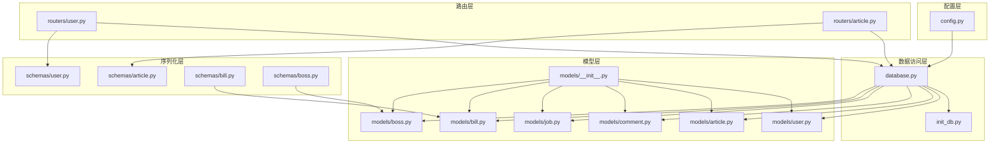
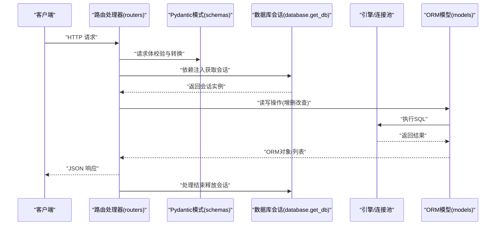
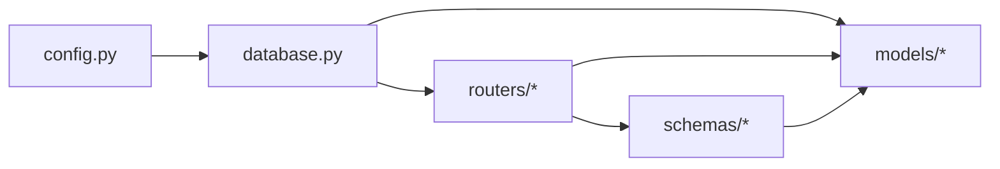
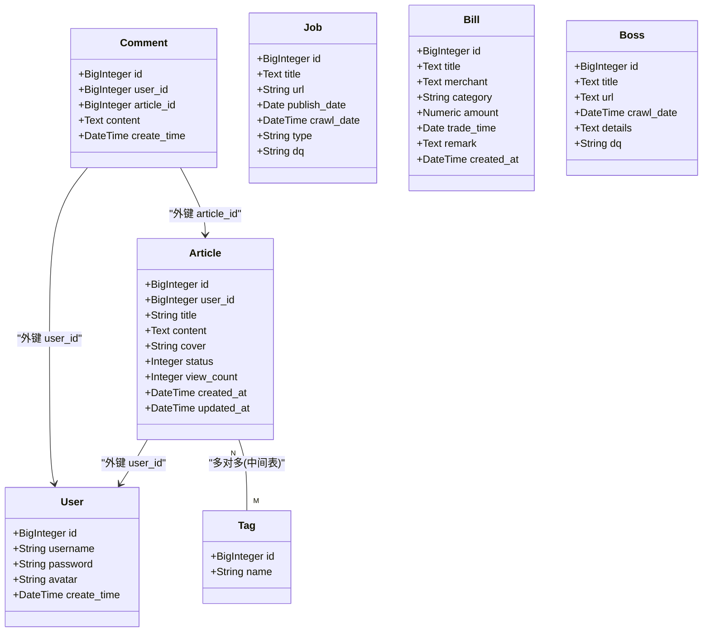

# 数据库设计

<cite>
**本文引用的文件**
- [blog_backend/database.py](file://blog_backend/database.py)
- [blog_backend/config.py](file://blog_backend/config.py)
- [blog_backend/init_db.py](file://blog_backend/init_db.py)
- [blog_backend/models/__init__.py](file://blog_backend/models/__init__.py)
- [blog_backend/models/user.py](file://blog_backend/models/user.py)
- [blog_backend/models/article.py](file://blog_backend/models/article.py)
- [blog_backend/models/comment.py](file://blog_backend/models/comment.py)
- [blog_backend/models/job.py](file://blog_backend/models/job.py)
- [blog_backend/models/bill.py](file://blog_backend/models/bill.py)
- [blog_backend/models/boss.py](file://blog_backend/models/boss.py)
- [blog_backend/schemas/user.py](file://blog_backend/schemas/user.py)
- [blog_backend/schemas/article.py](file://blog_backend/schemas/article.py)
- [blog_backend/schemas/bill.py](file://blog_backend/schemas/bill.py)
- [blog_backend/schemas/boss.py](file://blog_backend/schemas/boss.py)
- [blog_backend/routers/user.py](file://blog_backend/routers/user.py)
- [blog_backend/routers/article.py](file://blog_backend/routers/article.py)
</cite>

## 目录
1. [简介](#简介)
2. [项目结构](#项目结构)
3. [核心组件](#核心组件)
4. [架构总览](#架构总览)
5. [详细组件分析](#详细组件分析)
6. [依赖分析](#依赖分析)
7. [性能考虑](#性能考虑)
8. [故障排查指南](#故障排查指南)
9. [结论](#结论)
10. [附录](#附录)

## 简介
本文件面向博客系统后端的数据库设计与实现，围绕 SQLAlchemy ORM 配置、数据库连接池与会话管理、各数据模型的表结构与关系映射、索引与约束策略、数据迁移方案、性能优化与一致性保障进行系统化技术说明，并结合实际代码路径给出可操作的使用场景与最佳实践。

## 项目结构
后端采用 FastAPI + SQLAlchemy 的典型分层组织方式：
- 配置层：环境变量驱动的数据库连接字符串与密钥配置
- 数据访问层：引擎、会话工厂与基础模型基类
- 模型层：用户、文章、标签、评论、招聘、记账、Boss 等实体
- 路由层：用户、文章等业务接口，依赖注入会话
- 序列化层：Pydantic 模型用于请求/响应校验与转换
- 初始化脚本：一次性创建所有表结构

图表来源
- [blog_backend/config.py:1-32](file://blog_backend/config.py#L1-L32)
- [blog_backend/database.py:1-18](file://blog_backend/database.py#L1-L18)
- [blog_backend/init_db.py:1-10](file://blog_backend/init_db.py#L1-L10)
- [blog_backend/models/__init__.py:1-6](file://blog_backend/models/__init__.py#L1-L6)
- [blog_backend/models/user.py:1-14](file://blog_backend/models/user.py#L1-L14)
- [blog_backend/models/article.py:1-41](file://blog_backend/models/article.py#L1-L41)
- [blog_backend/models/comment.py:1-12](file://blog_backend/models/comment.py#L1-L12)
- [blog_backend/models/job.py:1-15](file://blog_backend/models/job.py#L1-L15)
- [blog_backend/models/bill.py:1-24](file://blog_backend/models/bill.py#L1-L24)
- [blog_backend/models/boss.py:1-15](file://blog_backend/models/boss.py#L1-L15)
- [blog_backend/schemas/user.py:1-13](file://blog_backend/schemas/user.py#L1-L13)
- [blog_backend/schemas/article.py:1-10](file://blog_backend/schemas/article.py#L1-L10)
- [blog_backend/schemas/bill.py:1-40](file://blog_backend/schemas/bill.py#L1-L40)
- [blog_backend/schemas/boss.py:1-14](file://blog_backend/schemas/boss.py#L1-L14)
- [blog_backend/routers/user.py:1-101](file://blog_backend/routers/user.py#L1-L101)
- [blog_backend/routers/article.py:1-85](file://blog_backend/routers/article.py#L1-L85)

章节来源
- [blog_backend/config.py:1-32](file://blog_backend/config.py#L1-L32)
- [blog_backend/database.py:1-18](file://blog_backend/database.py#L1-L18)
- [blog_backend/init_db.py:1-10](file://blog_backend/init_db.py#L1-L10)
- [blog_backend/models/__init__.py:1-6](file://blog_backend/models/__init__.py#L1-L6)

## 核心组件
- 数据库引擎与会话
  - 引擎通过配置模块提供的连接字符串创建，支持 MySQL（pymysql）方言
  - 会话工厂以非自动提交、非自动刷新的方式创建，确保事务边界可控
  - 提供依赖函数按请求粒度创建与关闭会话，避免连接泄漏
- 基类与初始化
  - 统一的声明式基类用于所有模型
  - 初始化脚本一次性创建所有模型对应的表结构
- 配置
  - DATABASE_URL 可通过环境变量覆盖；默认从 DB_* 环境变量拼接
  - 默认头像、JWT 密钥与算法等配置集中管理

章节来源
- [blog_backend/database.py:1-18](file://blog_backend/database.py#L1-L18)
- [blog_backend/config.py:1-32](file://blog_backend/config.py#L1-L32)
- [blog_backend/init_db.py:1-10](file://blog_backend/init_db.py#L1-L10)

## 架构总览
下图展示从路由到模型与数据库的调用链路，以及会话生命周期：

图表来源
- [blog_backend/routers/user.py:1-101](file://blog_backend/routers/user.py#L1-L101)
- [blog_backend/routers/article.py:1-85](file://blog_backend/routers/article.py#L1-L85)
- [blog_backend/database.py:12-18](file://blog_backend/database.py#L12-L18)
- [blog_backend/schemas/user.py:1-13](file://blog_backend/schemas/user.py#L1-L13)
- [blog_backend/schemas/article.py:1-10](file://blog_backend/schemas/article.py#L1-L10)

## 详细组件分析

### SQLAlchemy ORM 配置与会话管理
- 连接字符串来源与可配置性
  - 通过环境变量 DATABASE_URL 或 DB_USER/DB_PASSWORD/DB_HOST/DB_PORT/DB_NAME 组合
  - 便于在不同环境（开发/测试/生产）灵活切换
- 引擎与会话工厂
  - 非自动提交与非自动刷新，适合显式控制事务
  - 依赖注入 get_db 在每次请求中创建会话并在 finally 中关闭
- 初始化流程
  - 使用 Base.metadata.create_all 统一创建所有表
  - 可通过命令行直接运行初始化脚本

章节来源
- [blog_backend/config.py:1-32](file://blog_backend/config.py#L1-L32)
- [blog_backend/database.py:1-18](file://blog_backend/database.py#L1-L18)
- [blog_backend/init_db.py:1-10](file://blog_backend/init_db.py#L1-L10)

### 数据模型设计与关系映射

#### 用户模型 User
- 字段设计
  - 主键自增整型 ID
  - 唯一用户名、密码、头像 URL、创建时间
- 设计要点
  - 唯一性约束保证用户名不重复
  - 时间字段默认值与自动更新策略需在应用层或数据库层统一

章节来源
- [blog_backend/models/user.py:1-14](file://blog_backend/models/user.py#L1-L14)

#### 文章模型 Article 与标签模型 Tag（多对多）
- 多对多关联表
  - 使用中间表 article_tag，包含两个外键与联合主键
- 实体关系
  - Article 与 Tag 通过中间表建立多对多关系
  - 双向 back_populates，便于从任一侧导航
- 字段设计
  - 文章包含作者外键、标题、内容、封面、状态、浏览量、创建与更新时间
  - 标签唯一命名

章节来源
- [blog_backend/models/article.py:1-41](file://blog_backend/models/article.py#L1-L41)

#### 评论模型 Comment
- 字段设计
  - 作者 ID、文章 ID、评论内容、创建时间
- 设计要点
  - 当前未声明外键约束，建议在数据库层补充 user_id 与 article_id 的外键约束以保证参照完整性

章节来源
- [blog_backend/models/comment.py:1-12](file://blog_backend/models/comment.py#L1-L12)

#### 招聘模型 Job
- 字段设计
  - 标题、唯一链接、发布日期、爬取时间、类型、地区
- 设计要点
  - 唯一键约束保证链接唯一性，适于去重抓取

章节来源
- [blog_backend/models/job.py:1-15](file://blog_backend/models/job.py#L1-L15)

#### 记账模型 Bill
- 字段设计
  - 标题、商户、分类、金额（数值型）、交易日期、备注、创建时间
- 设计要点
  - 金额使用高精度数值类型，满足财务数据精度要求
  - 建议对分类、交易日期建立索引以提升查询性能

章节来源
- [blog_backend/models/bill.py:1-24](file://blog_backend/models/bill.py#L1-L24)

#### Boss 模型
- 字段设计
  - 标题、链接、爬取时间、详情、地区
- 设计要点
  - 爬取时间默认值可在数据库层设置，减少应用层逻辑

章节来源
- [blog_backend/models/boss.py:1-15](file://blog_backend/models/boss.py#L1-L15)

### 外键约束与索引策略
- 外键约束
  - 文章与用户之间存在外键关联（user_id -> user.id），建议在数据库层显式声明
  - 评论模型缺少外键定义，建议补充 user_id 与 article_id 的外键约束
- 索引策略
  - 用户名唯一索引（唯一约束）
  - 招聘链接唯一索引（唯一约束）
  - 建议为文章的 user_id、created_at、updated_at 建立索引
  - 建议为记账的 trade_time、category 建立索引
- 时间字段
  - 建议在数据库层设置默认值与更新触发器，避免仅依赖应用层默认值

章节来源
- [blog_backend/models/article.py:19-27](file://blog_backend/models/article.py#L19-L27)
- [blog_backend/models/comment.py:8-11](file://blog_backend/models/comment.py#L8-L11)
- [blog_backend/models/job.py:10](file://blog_backend/models/job.py#L10)
- [blog_backend/models/bill.py:10-17](file://blog_backend/models/bill.py#L10-L17)

### 数据迁移方案
- 基于 SQLAlchemy 的迁移策略
  - 使用 Alembic 进行版本化迁移，推荐在现有 create_all 基础上引入迁移工具
  - 迁移脚本中明确声明外键、索引与默认值
- 初始化与回滚
  - 初始化脚本仅适用于开发/测试环境
  - 生产环境建议通过迁移工具进行变更管理，避免直接使用 create_all

章节来源
- [blog_backend/init_db.py:1-10](file://blog_backend/init_db.py#L1-L10)

### 使用场景与示例（基于代码路径）
- 用户注册与登录
  - 注册：路由接收 Pydantic 模型，查询用户名是否已存在，不存在则创建用户并返回
  - 登录：校验用户名与密码，生成令牌
- 发布文章
  - 路由接收文章创建模型，绑定当前用户 ID，持久化后返回文章对象
- 记账与 Boss 数据
  - 通过 Pydantic 模型进行输入校验（金额精度、长度限制等），再映射到模型持久化

章节来源
- [blog_backend/routers/user.py:15-51](file://blog_backend/routers/user.py#L15-L51)
- [blog_backend/routers/article.py:11-25](file://blog_backend/routers/article.py#L11-L25)
- [blog_backend/schemas/bill.py:7-23](file://blog_backend/schemas/bill.py#L7-L23)
- [blog_backend/schemas/boss.py:7-14](file://blog_backend/schemas/boss.py#L7-L14)

## 依赖分析
- 模块耦合
  - 所有模型依赖统一的 Base，路由依赖数据库会话工厂
  - 路由与模式解耦，通过 Pydantic 模型进行输入输出转换
- 外部依赖
  - SQLAlchemy ORM 与 MySQL（pymysql）方言
  - FastAPI 依赖注入与 Pydantic 校验

图表来源
- [blog_backend/config.py:1-32](file://blog_backend/config.py#L1-L32)
- [blog_backend/database.py:1-18](file://blog_backend/database.py#L1-L18)
- [blog_backend/models/__init__.py:1-6](file://blog_backend/models/__init__.py#L1-L6)
- [blog_backend/routers/user.py:1-101](file://blog_backend/routers/user.py#L1-L101)
- [blog_backend/routers/article.py:1-85](file://blog_backend/routers/article.py#L1-L85)
- [blog_backend/schemas/user.py:1-13](file://blog_backend/schemas/user.py#L1-L13)
- [blog_backend/schemas/article.py:1-10](file://blog_backend/schemas/article.py#L1-L10)

## 性能考虑
- 连接池与会话
  - 使用非自动提交/刷新，减少不必要的数据库往返
  - 严格在依赖中关闭会话，避免连接泄漏
- 查询优化
  - 对高频过滤字段（如 user_id、trade_time、created_at）建立索引
  - 分页查询时尽量使用覆盖索引，避免 SELECT *
- 写入优化
  - 合理批量插入与更新，减少事务次数
  - 控制字段数量与长度，避免大字段频繁参与排序/JOIN
- 数值精度
  - 金额字段使用高精度数值类型，避免浮点误差

## 故障排查指南
- 连接失败
  - 检查 DATABASE_URL 与 DB_* 环境变量是否正确
  - 确认数据库服务可达与账号权限
- 唯一约束冲突
  - 用户名重复、招聘链接重复等，需在业务层捕获并提示
- 外键约束错误
  - 删除/更新父记录导致子记录悬挂，需在应用层检查或在数据库层设置级联策略
- 会话泄漏
  - 确保每个请求都通过依赖注入获取并最终关闭会话

章节来源
- [blog_backend/config.py:1-32](file://blog_backend/config.py#L1-L32)
- [blog_backend/routers/user.py:18-21](file://blog_backend/routers/user.py#L18-L21)
- [blog_backend/routers/user.py:39-46](file://blog_backend/routers/user.py#L39-L46)
- [blog_backend/database.py:12-18](file://blog_backend/database.py#L12-L18)

## 结论
本设计以 SQLAlchemy ORM 为核心，配合 FastAPI 的依赖注入与 Pydantic 校验，实现了清晰的数据访问与业务处理分层。模型层面体现了用户、文章、标签的多对多关系，以及招聘、记账、Boss 等扩展领域的数据抽象。建议后续引入 Alembic 进行版本化迁移，完善数据库层外键与索引约束，并在生产环境加强事务与连接池配置以提升稳定性与性能。

## 附录
- 快速初始化
  - 运行初始化脚本以创建所有表结构
- 常用查询
  - 用户按名称模糊分页查询、文章按作者分页查询、文章详情与权限校验
- 数据模型类图

图表来源
- [blog_backend/models/user.py:1-14](file://blog_backend/models/user.py#L1-L14)
- [blog_backend/models/article.py:16-41](file://blog_backend/models/article.py#L16-L41)
- [blog_backend/models/comment.py:1-12](file://blog_backend/models/comment.py#L1-L12)
- [blog_backend/models/job.py:1-15](file://blog_backend/models/job.py#L1-15)
- [blog_backend/models/bill.py:1-24](file://blog_backend/models/bill.py#L1-L24)
- [blog_backend/models/boss.py:1-15](file://blog_backend/models/boss.py#L1-L15)