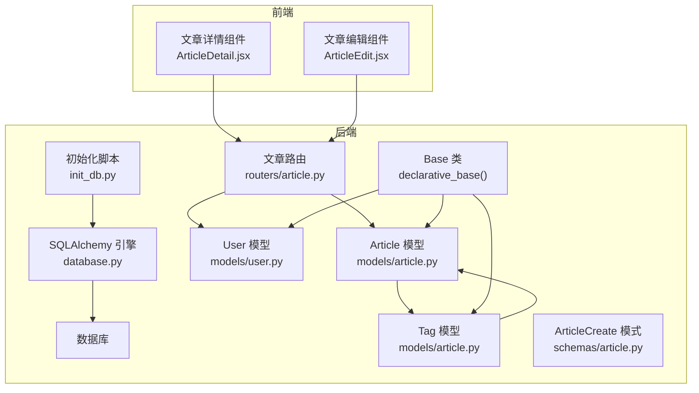
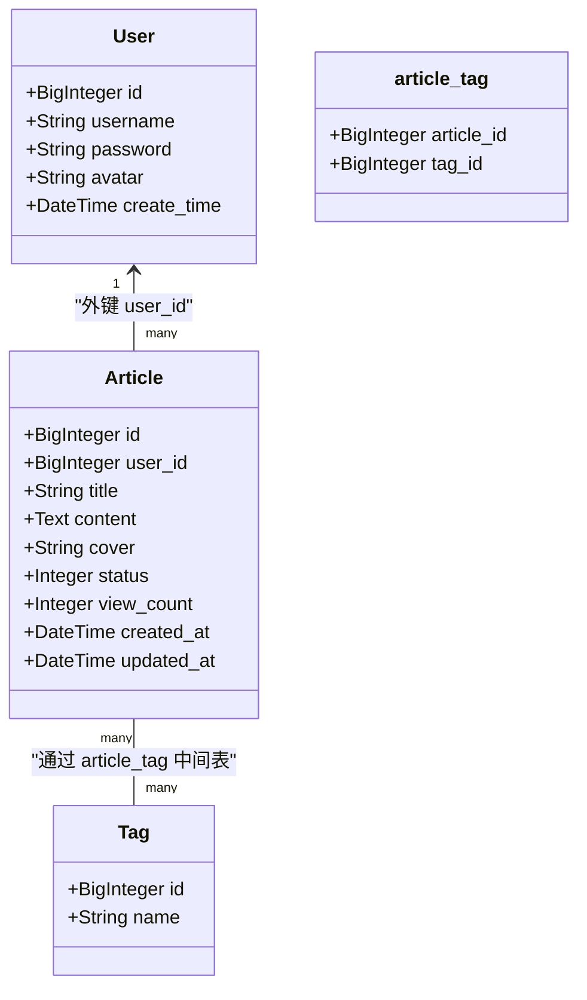
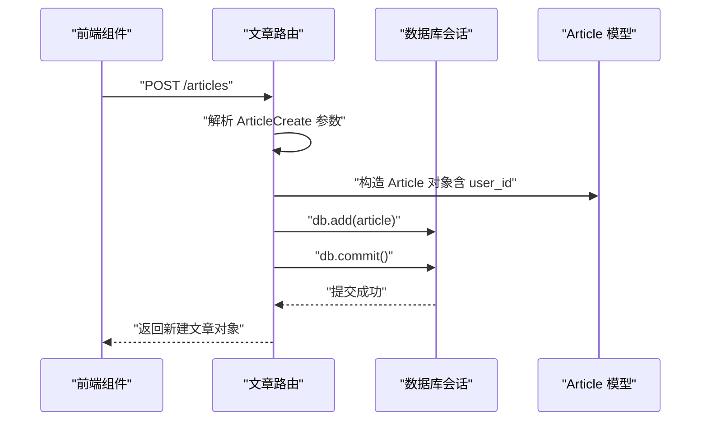
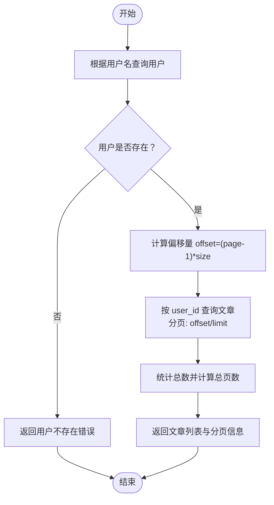
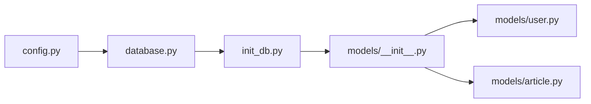

# 文章数据模型

<cite>
**本文引用的文件**
- [models/article.py](file://blog_backend/models/article.py)
- [models/user.py](file://blog_backend/models/user.py)
- [routers/article.py](file://blog_backend/routers/article.py)
- [schemas/article.py](file://blog_backend/schemas/article.py)
- [database.py](file://blog_backend/database.py)
- [init_db.py](file://blog_backend/init_db.py)
- [config.py](file://blog_backend/config.py)
- [models/__init__.py](file://blog_backend/models/__init__.py)
- [schemas/__init__.py](file://blog_backend/schemas/__init__.py)
- [ArticleDetail.jsx](file://blog_frontend/src/components/ArticleDetail.jsx)
- [ArticleEdit.jsx](file://blog_backend/src/components/ArticleEdit.jsx)
</cite>

## 目录
1. [简介](#简介)
2. [项目结构](#项目结构)
3. [核心组件](#核心组件)
4. [架构概览](#架构概览)
5. [详细组件分析](#详细组件分析)
6. [依赖分析](#依赖分析)
7. [性能考虑](#性能考虑)
8. [故障排查指南](#故障排查指南)
9. [结论](#结论)
10. [附录](#附录)

## 简介
本文件围绕博客系统的“文章数据模型”进行技术文档整理，重点覆盖以下方面：
- Article 模型的表结构设计与字段语义
- 文章与用户之间的关联关系及外键约束
- 标签系统的设计实现（多对多映射与中间表）
- 文章状态管理（草稿、已发布、已删除等）与当前实现现状
- 查询优化策略与全文搜索实现建议
- 数据完整性保证机制与现有约束

## 项目结构
后端采用 SQLAlchemy 声明式 ORM 映射，模型位于 models 目录；路由层在 routers 目录；数据库初始化通过 init_db 脚本完成；前端组件负责展示与交互。

图表来源
- [database.py:1-18](file://blog_backend/database.py#L1-L18)
- [models/user.py:1-14](file://blog_backend/models/user.py#L1-L14)
- [models/article.py:1-41](file://blog_backend/models/article.py#L1-L41)
- [routers/article.py:1-85](file://blog_backend/routers/article.py#L1-L85)
- [schemas/article.py:1-10](file://blog_backend/schemas/article.py#L1-L10)
- [init_db.py:1-10](file://blog_backend/init_db.py#L1-L10)

章节来源
- [database.py:1-18](file://blog_backend/database.py#L1-L18)
- [models/__init__.py:1-6](file://blog_backend/models/__init__.py#L1-L6)
- [schemas/__init__.py:1-4](file://blog_backend/schemas/__init__.py#L1-L4)

## 核心组件
- Article 模型：承载文章主信息，包含标题、内容、封面、状态、浏览量、创建与更新时间，并与 Tag 实现多对多关系。
- Tag 模型：独立标签实体，提供唯一性约束与与 Article 的多对多映射。
- User 模型：用户主体，Article 通过 user_id 外键关联到用户。
- 路由层：提供文章发布、列表查询、详情获取、删除与编辑接口。
- 初始化：通过 init_db 将所有模型的表结构创建到数据库。

章节来源
- [models/article.py:15-41](file://blog_backend/models/article.py#L15-L41)
- [models/user.py:5-14](file://blog_backend/models/user.py#L5-L14)
- [routers/article.py:11-85](file://blog_backend/routers/article.py#L11-L85)
- [init_db.py:1-10](file://blog_backend/init_db.py#L1-L10)

## 架构概览
下图展示了文章模型在系统中的位置与关键交互：

图表来源
- [models/article.py:15-41](file://blog_backend/models/article.py#L15-L41)
- [models/user.py:5-14](file://blog_backend/models/user.py#L5-L14)

## 详细组件分析

### Article 模型与表结构
- 主键与自增：id 字段为主键并自动递增。
- 作者关联：user_id 为外键，指向 User.id，且不允许为空，确保每篇文章必须归属一个有效用户。
- 标题与内容：title 限制长度，content 使用大文本类型存储。
- 封面图：cover 为字符串，用于存储封面图片 URL。
- 状态与浏览量：status 默认值为 1，view_count 默认 0；当前路由未暴露状态字段的变更接口，因此状态字段目前仅作为预留。
- 时间戳：created_at 默认当前时间，updated_at 在记录更新时自动刷新。
- 标签关系：通过中间表 article_tag 与 Tag 建立多对多关系。

章节来源
- [models/article.py:15-31](file://blog_backend/models/article.py#L15-L31)

### Tag 模型与多对多映射
- 唯一性：name 字段唯一，避免重复标签。
- 关系映射：与 Article 通过中间表 article_tag 建立多对多，双方均通过 relationship 声明反向关系。

章节来源
- [models/article.py:32-41](file://blog_backend/models/article.py#L32-L41)

### 用户与文章的关联关系
- 外键约束：Article.user_id -> User.id，非空约束保证数据一致性。
- 级联行为：当前模型未显式声明级联删除或更新策略，默认遵循数据库默认行为（通常不自动级联删除子记录）。
- 权限控制：路由层在删除与编辑接口中校验当前登录用户是否为文章作者，避免越权操作。

章节来源
- [models/article.py:20](file://blog_backend/models/article.py#L20)
- [routers/article.py:55-85](file://blog_backend/routers/article.py#L55-L85)

### 文章状态管理
- 当前实现：Article.status 字段默认 1，但路由层未提供状态变更接口，因此状态字段目前未被业务使用。
- 建议扩展：若需支持草稿、已发布、已删除等状态，可在路由层新增 PUT /articles/{article_id}/status 接口，并在模型层增加状态枚举或校验逻辑。

章节来源
- [models/article.py:24](file://blog_backend/models/article.py#L24)
- [routers/article.py:11-85](file://blog_backend/routers/article.py#L11-L85)

### 查询优化策略
- 索引建议：
  - Article.user_id：用于按用户筛选文章列表。
  - Article.created_at：用于按时间排序与分页。
  - Tag.name：用于按标签名称检索。
- 分页实现：路由层已实现基础分页（offset/limit），建议结合索引与 COUNT 查询优化性能。
- 关联查询：在需要同时返回作者信息时，可使用 join 或预先加载（selectinload）减少 N+1 查询。

章节来源
- [routers/article.py:28-44](file://blog_backend/routers/article.py#L28-L44)

### 全文搜索实现
- 当前实现：未见全文搜索功能。
- 建议方案：
  - MySQL 全文索引：在 content 字段上建立全文索引，配合 MATCH AGAINST 进行搜索。
  - 应用层分词：使用分词器对关键词进行拆分，再以 LIKE 或正则匹配辅助检索。
  - 第三方服务：集成 Elasticsearch 或 Whoosh 等搜索引擎。

[本节为概念性建议，不直接分析具体文件]

### 数据完整性保证机制
- 非空约束：Article.title、Article.content、Article.user_id 等字段设置非空，防止空值写入。
- 唯一性约束：Tag.name 唯一，避免重复标签。
- 外键约束：Article.user_id 指向 User.id，防止悬挂引用。
- 事务与提交：路由层在新增/更新/删除操作后执行 commit，确保原子性。
- 前端展示：前端组件从后端接口获取数据，渲染文章标题、作者、阅读量与内容。

章节来源
- [models/article.py:19-27](file://blog_backend/models/article.py#L19-L27)
- [models/article.py:36](file://blog_backend/models/article.py#L36)
- [routers/article.py:11-25](file://blog_backend/routers/article.py#L11-L25)
- [ArticleDetail.jsx:37-56](file://blog_frontend/src/components/ArticleDetail.jsx#L37-L56)

### API 工作流（序列图）
以下序列图展示“发布文章”的完整流程，从请求到数据库持久化与响应返回。

图表来源
- [routers/article.py:11-25](file://blog_backend/routers/article.py#L11-L25)
- [schemas/article.py:5-10](file://blog_backend/schemas/article.py#L5-L10)
- [models/article.py:15-31](file://blog_backend/models/article.py#L15-L31)

### 查询流程（流程图）
以下流程图展示“按用户获取文章列表”的处理步骤。

图表来源
- [routers/article.py:28-44](file://blog_backend/routers/article.py#L28-L44)

## 依赖分析
- 模块导入：models/__init__.py 统一导出 User、Article、Tag 等模型，便于 init_db 一次性创建表结构。
- 初始化：init_db.py 通过 Base.metadata.create_all 创建所有模型对应的表。
- 配置：config.py 提供数据库连接字符串与默认头像 URL 等配置项。

图表来源
- [init_db.py:1-10](file://blog_backend/init_db.py#L1-L10)
- [models/__init__.py:1-6](file://blog_backend/models/__init__.py#L1-L6)
- [config.py:1-32](file://blog_backend/config.py#L1-L32)
- [database.py:1-18](file://blog_backend/database.py#L1-L18)

章节来源
- [models/__init__.py:1-6](file://blog_backend/models/__init__.py#L1-L6)
- [init_db.py:1-10](file://blog_backend/init_db.py#L1-L10)
- [config.py:1-32](file://blog_backend/config.py#L1-L32)

## 性能考虑
- 索引优化：为高频查询字段（如 Article.user_id、Article.created_at、Tag.name）建立索引。
- 分页与排序：结合 LIMIT/OFFSET 与合适的排序字段，避免全表扫描。
- 关联查询：在需要作者信息时，优先使用 JOIN 或 selectinload 减少查询次数。
- 写入优化：批量插入与事务合并提交，降低锁竞争与日志开销。
- 缓存策略：对热门文章详情与列表结果进行缓存，降低数据库压力。

[本节提供通用指导，不直接分析具体文件]

## 故障排查指南
- 用户不存在：当按用户名查询用户失败时，接口返回相应错误提示。
- 文章不存在：查询文章或执行删除/编辑时，若未找到对应记录，返回 404 错误。
- 权限不足：删除/编辑接口会校验当前用户是否为文章作者，否则返回 403。
- 数据库连接：检查 DATABASE_URL 环境变量与数据库可达性。
- 初始化失败：确认 init_db 执行成功，且所有模型均已注册。

章节来源
- [routers/article.py:32-34](file://blog_backend/routers/article.py#L32-L34)
- [routers/article.py:49-53](file://blog_backend/routers/article.py#L49-L53)
- [routers/article.py:59-68](file://blog_backend/routers/article.py#L59-L68)
- [routers/article.py:74-85](file://blog_backend/routers/article.py#L74-L85)
- [config.py:3-11](file://blog_backend/config.py#L3-L11)
- [init_db.py:5-6](file://blog_backend/init_db.py#L5-L6)

## 结论
- Article 模型具备清晰的字段定义与外键约束，满足基本的文章存储需求。
- 标签系统通过中间表实现了灵活的多对多映射，便于后续扩展。
- 当前未实现文章状态变更接口，状态字段可作为未来功能扩展点。
- 查询与全文搜索尚未实现，建议结合索引与全文检索方案提升性能与体验。
- 数据完整性通过非空、唯一与外键约束得到保障，配合路由层权限校验形成闭环。

[本节为总结性内容，不直接分析具体文件]

## 附录
- 前端组件使用后端接口渲染文章详情与编辑页面，展示字段包括标题、作者、阅读量与内容等。

章节来源
- [ArticleDetail.jsx:37-56](file://blog_frontend/src/components/ArticleDetail.jsx#L37-L56)
- [ArticleEdit.jsx:13-39](file://blog_frontend/src/components/ArticleEdit.jsx#L13-L39)