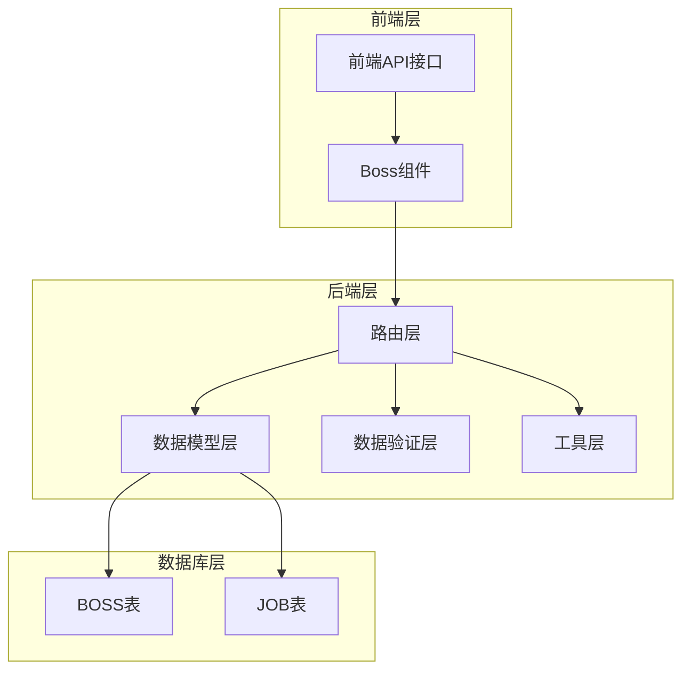
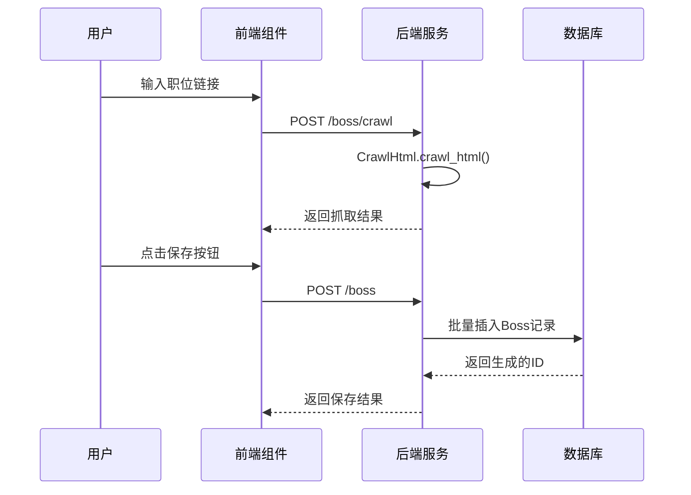
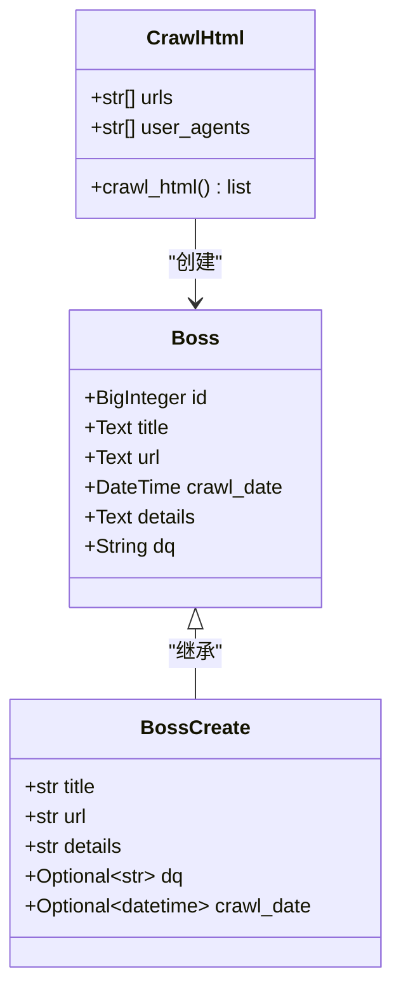
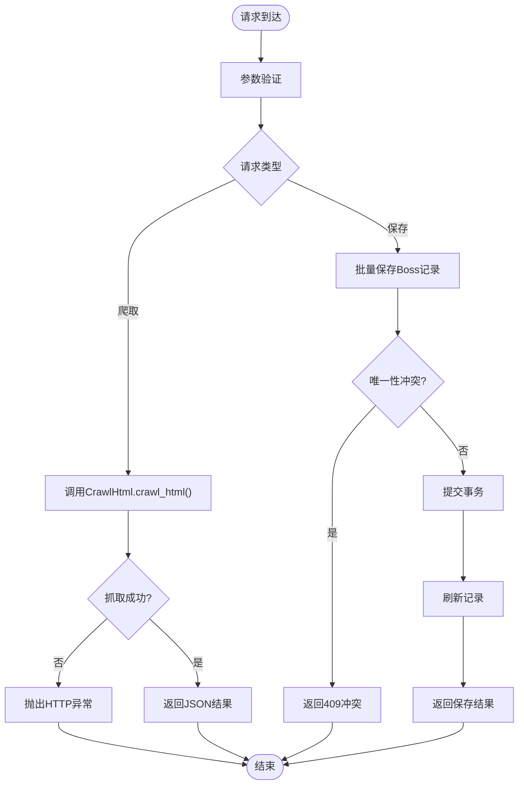
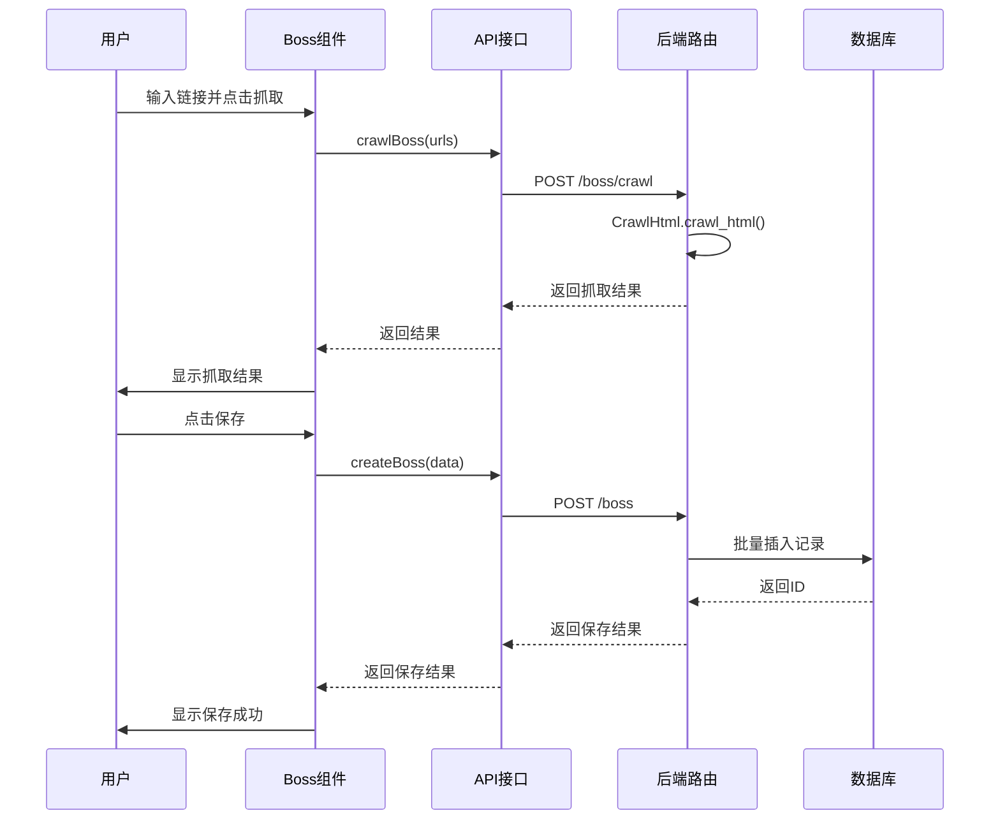
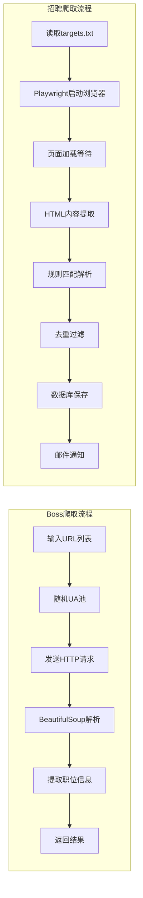
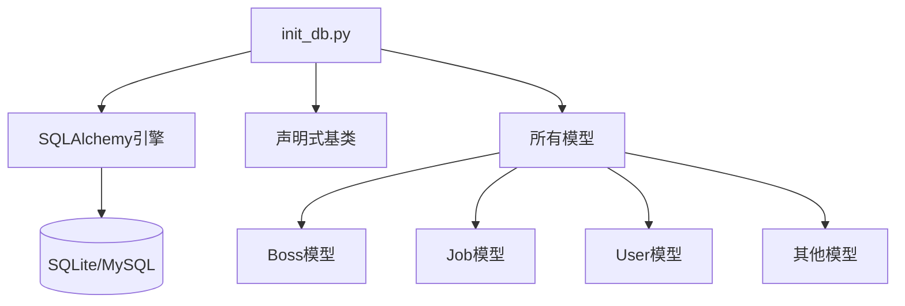

# 求职数据模型

<cite>
**本文档引用的文件**
- [models/boss.py](file://blog_backend/models/boss.py)
- [schemas/boss.py](file://blog_backend/schemas/boss.py)
- [routers/boss.py](file://blog_backend/routers/boss.py)
- [utils/crawl_html.py](file://blog_backend/utils/crawl_html.py)
- [models/job.py](file://blog_backend/models/job.py)
- [utils/crawl.py](file://blog_backend/utils/crawl.py)
- [database.py](file://blog_backend/database.py)
- [init_db.py](file://blog_backend/init_db.py)
- [components/Boss.jsx](file://blog_frontend/src/components/Boss.jsx)
- [api.js](file://blog_frontend/src/api.js)
</cite>

## 目录
1. [简介](#简介)
2. [项目结构](#项目结构)
3. [核心组件](#核心组件)
4. [架构概览](#架构概览)
5. [详细组件分析](#详细组件分析)
6. [依赖关系分析](#依赖关系分析)
7. [性能考虑](#性能考虑)
8. [故障排除指南](#故障排除指南)
9. [结论](#结论)

## 简介

本文档为求职数据模型提供全面的技术文档，重点分析Boss模型的表结构设计和求职数据管理机制。该系统实现了从职位信息抓取、存储到查询展示的完整求职数据生命周期管理，支持批量投递记录的创建、查询和状态跟踪。

## 项目结构

项目采用前后端分离架构，后端使用FastAPI + SQLAlchemy，前端使用React构建用户界面。

**图表来源**
- [routers/boss.py:1-134](file://blog_backend/routers/boss.py#L1-L134)
- [models/boss.py:1-15](file://blog_backend/models/boss.py#L1-L15)
- [models/job.py:1-15](file://blog_backend/models/job.py#L1-L15)

**章节来源**
- [routers/boss.py:1-134](file://blog_backend/routers/boss.py#L1-L134)
- [models/boss.py:1-15](file://blog_backend/models/boss.py#L1-L15)
- [models/job.py:1-15](file://blog_backend/models/job.py#L1-L15)

## 核心组件

### Boss数据模型

Boss模型是求职数据的核心实体，负责存储投递的职位信息。

| 字段名 | 数据类型 | 是否可空 | 描述 | 默认值 |
|--------|----------|----------|------|--------|
| id | BigInteger | 否 | 主键ID | 自增 |
| title | Text | 否 | 职位标题 | - |
| url | Text | 否 | 职位链接 | - |
| crawl_date | DateTime | 否 | 抓取/投递时间 | 当前时间 |
| details | Text | 否 | 职位详情 | - |
| dq | String(50) | 是 | 地区信息 | NULL |

### Job数据模型

Job模型用于存储招聘数据，与Boss模型形成数据关联。

| 字段名 | 数据类型 | 是否可空 | 描述 | 默认值 |
|--------|----------|----------|------|--------|
| id | BigInteger | 否 | 主键ID | 自增 |
| title | Text | 否 | 职位标题 | - |
| url | String(255) | 否 | 职位链接 | - |
| publish_date | Date | 否 | 发布日期 | - |
| crawl_date | DateTime | 否 | 抓取时间 | 当前时间 |
| type | String(50) | 是 | 招聘类型 | NULL |
| dq | String(50) | 是 | 地区信息 | NULL |

**章节来源**
- [models/boss.py:5-15](file://blog_backend/models/boss.py#L5-L15)
- [models/job.py:5-15](file://blog_backend/models/job.py#L5-L15)

## 架构概览

系统采用分层架构设计，实现了清晰的关注点分离。

**图表来源**
- [routers/boss.py:16-84](file://blog_backend/routers/boss.py#L16-L84)
- [utils/crawl_html.py:18-72](file://blog_backend/utils/crawl_html.py#L18-L72)

## 详细组件分析

### 数据模型设计

#### Boss模型类图

**图表来源**
- [models/boss.py:5-15](file://blog_backend/models/boss.py#L5-L15)
- [schemas/boss.py:7-14](file://blog_backend/schemas/boss.py#L7-L14)
- [utils/crawl_html.py:8-72](file://blog_backend/utils/crawl_html.py#L8-L72)

#### 字段设计原理

1. **主键设计**: 使用BigInteger类型确保足够的数据容量，支持自增主键
2. **链接唯一性**: Boss模型的url字段在数据库层面具有唯一约束，防止重复投递
3. **时间戳管理**: crawl_date字段使用DateTime类型，支持精确到秒的时间记录
4. **文本存储**: 使用Text类型存储长文本内容，如职位详情
5. **地区信息**: dq字段使用String(50)，满足地区名称存储需求

### API路由设计

#### 路由处理流程

**图表来源**
- [routers/boss.py:16-84](file://blog_backend/routers/boss.py#L16-L84)

#### 查询功能实现

系统提供了灵活的查询接口，支持按时间范围查询投递记录：

- **周查询**: 默认查询最近7天的投递记录
- **月查询**: 查询指定月份的所有投递记录
- **排序规则**: 按ID降序排列，确保最新记录在前

**章节来源**
- [routers/boss.py:86-127](file://blog_backend/routers/boss.py#L86-L127)

### 前端集成

#### 组件交互流程

**图表来源**
- [components/Boss.jsx:11-56](file://blog_frontend/src/components/Boss.jsx#L11-L56)
- [api.js:36-37](file://blog_frontend/src/api.js#L36-L37)

**章节来源**
- [components/Boss.jsx:1-145](file://blog_frontend/src/components/Boss.jsx#L1-L145)
- [api.js:1-40](file://blog_frontend/src/api.js#L1-L40)

### 数据爬取机制

#### 爬虫工作流程

系统集成了两种爬取模式：

1. **Boss职位抓取**: 使用requests库进行简单HTML抓取
2. **招聘数据爬取**: 使用Playwright进行JavaScript渲染页面抓取

**图表来源**
- [utils/crawl_html.py:18-72](file://blog_backend/utils/crawl_html.py#L18-L72)
- [utils/crawl.py:368-440](file://blog_backend/utils/crawl.py#L368-L440)

**章节来源**
- [utils/crawl_html.py:1-72](file://blog_backend/utils/crawl_html.py#L1-L72)
- [utils/crawl.py:1-445](file://blog_backend/utils/crawl.py#L1-L445)

## 依赖关系分析

### 数据库初始化

系统通过init_db.py文件统一初始化所有数据表：

**图表来源**
- [init_db.py:1-10](file://blog_backend/init_db.py#L1-L10)
- [database.py:1-18](file://blog_backend/database.py#L1-L18)

### 外部依赖

系统主要依赖以下外部库：

- **FastAPI**: Web框架，提供异步API服务
- **SQLAlchemy**: ORM框架，提供数据库抽象层
- **Pydantic**: 数据验证和序列化库
- **Requests**: HTTP客户端库
- **BeautifulSoup**: HTML解析库
- **Playwright**: 浏览器自动化测试框架

**章节来源**
- [init_db.py:1-10](file://blog_backend/init_db.py#L1-L10)
- [database.py:1-18](file://blog_backend/database.py#L1-L18)

## 性能考虑

### 查询优化策略

1. **索引设计**: crawl_date字段建议建立索引以优化时间范围查询
2. **批量操作**: 支持批量插入和批量查询，减少数据库往返次数
3. **分页查询**: 对于大量数据采用分页机制，避免一次性加载过多记录
4. **缓存策略**: 可考虑在应用层添加缓存机制，减少重复查询

### 存储优化

1. **字段类型选择**: 合理选择字段类型，避免过度占用存储空间
2. **文本压缩**: 对于长文本内容可考虑压缩存储
3. **数据归档**: 实施数据归档策略，定期清理历史数据

### 并发处理

1. **连接池**: 使用SQLAlchemy连接池管理数据库连接
2. **事务管理**: 正确处理事务边界，避免长时间持有锁
3. **异步处理**: 对于耗时操作采用异步处理模式

## 故障排除指南

### 常见问题及解决方案

#### 数据库连接问题
- **症状**: 应用启动时报数据库连接错误
- **原因**: 数据库配置不正确或数据库服务未启动
- **解决**: 检查数据库连接字符串配置，确认数据库服务正常运行

#### 爬取失败问题
- **症状**: 职位信息抓取失败或返回空结果
- **原因**: 网站结构变化或网络连接问题
- **解决**: 更新爬取规则，检查网络连接，增加重试机制

#### 数据重复问题
- **症状**: 保存职位信息时报唯一性约束错误
- **原因**: 重复提交相同的职位链接
- **解决**: 在前端进行去重检查，或在后端处理唯一性冲突

#### 性能问题
- **症状**: 查询响应时间过长
- **原因**: 缺少必要的数据库索引
- **解决**: 为常用查询字段添加索引，优化查询语句

**章节来源**
- [routers/boss.py:73-84](file://blog_backend/routers/boss.py#L73-L84)
- [utils/crawl.py:315-367](file://blog_backend/utils/crawl.py#L315-L367)

## 结论

该求职数据模型系统实现了完整的求职数据生命周期管理，具有以下特点：

1. **模块化设计**: 清晰的分层架构，职责分离明确
2. **数据完整性**: 通过ORM和数据验证确保数据质量
3. **扩展性强**: 支持多种爬取策略和数据源
4. **用户友好**: 提供直观的前端界面和良好的用户体验

系统目前主要关注Boss模型的实现，后续可以在此基础上扩展更多求职状态跟踪功能，如面试安排、结果反馈等高级特性。