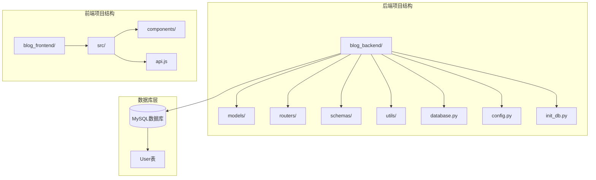
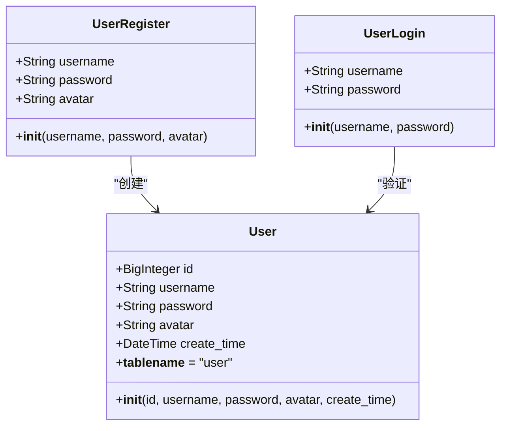
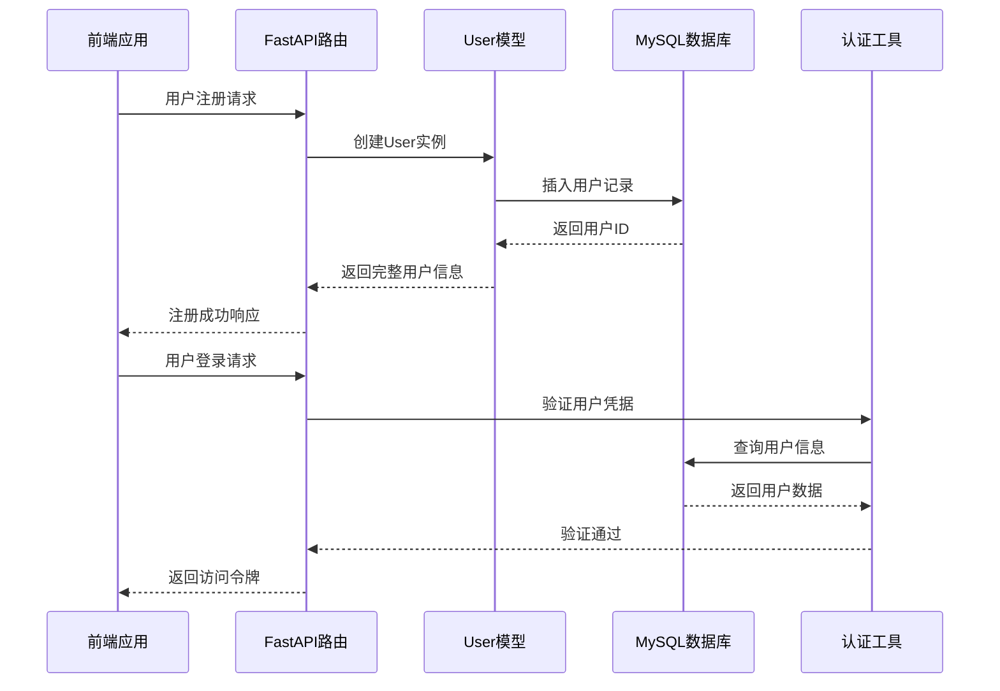
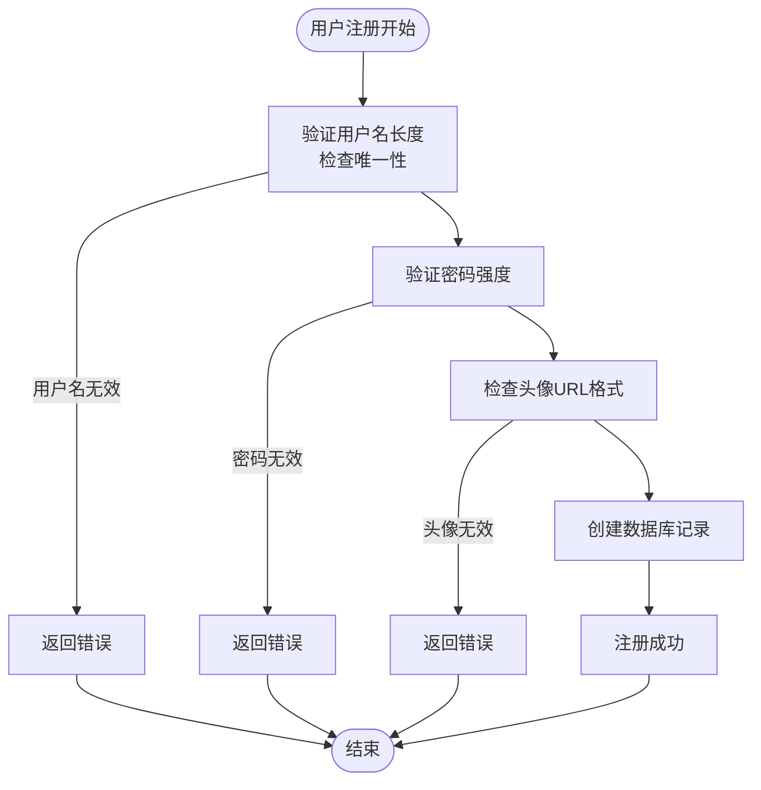
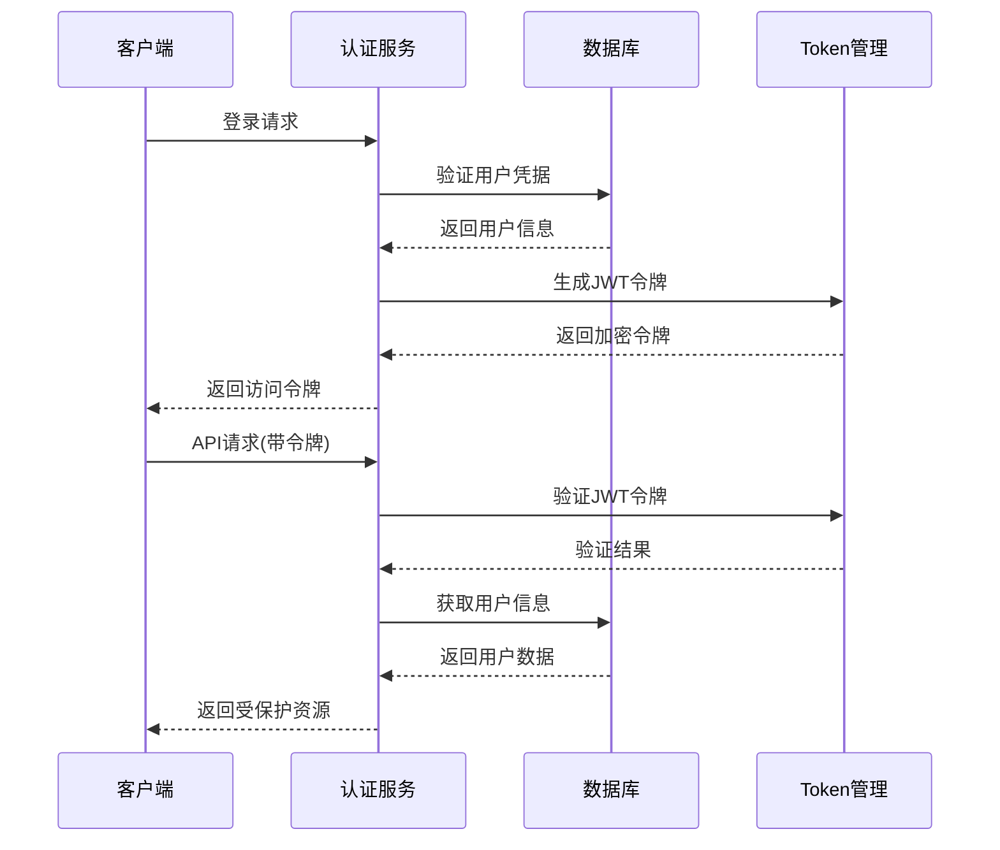
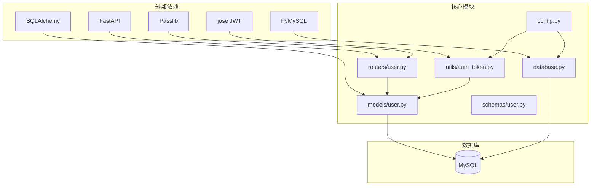

# 用户数据模型

<cite>
**本文档引用的文件**
- [models/user.py](file://blog_backend/models/user.py)
- [schemas/user.py](file://blog_backend/schemas/user.py)
- [routers/user.py](file://blog_backend/routers/user.py)
- [database.py](file://blog_backend/database.py)
- [init_db.py](file://blog_backend/init_db.py)
- [utils/auth_token.py](file://blog_backend/utils/auth_token.py)
- [config.py](file://blog_backend/config.py)
- [api.js](file://blog_frontend/src/api.js)
- [Login.jsx](file://blog_frontend/src/components/Login.jsx)
- [Register.jsx](file://blog_frontend/src/components/Register.jsx)
</cite>

## 目录
1. [简介](#简介)
2. [项目结构](#项目结构)
3. [核心组件](#核心组件)
4. [架构概览](#架构概览)
5. [详细组件分析](#详细组件分析)
6. [依赖关系分析](#依赖关系分析)
7. [性能考虑](#性能考虑)
8. [故障排除指南](#故障排除指南)
9. [结论](#结论)

## 简介

本文件为博客系统的用户数据模型技术文档，详细说明了User模型的表结构设计、认证机制、权限系统以及完整的CRUD操作实现。该系统采用FastAPI + SQLAlchemy + MySQL的技术栈，实现了完整的用户注册、登录、查询功能，并提供了基础的权限控制机制。

## 项目结构

博客项目采用前后端分离架构，用户模型位于后端Python项目中，主要包含以下关键目录：

**图表来源**
- [database.py:1-18](file://blog_backend/database.py#L1-L18)
- [init_db.py:1-10](file://blog_backend/init_db.py#L1-L10)

**章节来源**
- [database.py:1-18](file://blog_backend/database.py#L1-L18)
- [init_db.py:1-10](file://blog_backend/init_db.py#L1-L10)

## 核心组件

### 用户模型定义

User模型是整个用户系统的核心数据结构，基于SQLAlchemy ORM框架实现：

**图表来源**
- [models/user.py:5-14](file://blog_backend/models/user.py#L5-L14)
- [schemas/user.py:6-13](file://blog_backend/schemas/user.py#L6-L13)

### 数据库表结构

用户表采用标准的关系型数据库设计，包含以下字段：

| 字段名 | 类型 | 约束 | 描述 |
|--------|------|------|------|
| id | BigInteger | 主键, 自增 | 用户唯一标识符 |
| username | String(255) | 非空, 唯一 | 用户名，用于登录和识别 |
| password | String(255) | 非空 | 用户密码（明文存储） |
| avatar | String(255) | 可空 | 用户头像URL |
| create_time | DateTime | 非空, 默认当前时间 | 用户创建时间 |

**章节来源**
- [models/user.py:8-12](file://blog_backend/models/user.py#L8-L12)

## 架构概览

系统采用分层架构设计，从前端到后端的数据流如下：

**图表来源**
- [routers/user.py:15-51](file://blog_backend/routers/user.py#L15-L51)
- [utils/auth_token.py:12-17](file://blog_backend/utils/auth_token.py#L12-L17)

## 详细组件分析

### 用户模型实现

User模型基于SQLAlchemy声明式基类实现，具有以下特点：

#### 表结构设计
- **主键设计**: 使用BigInteger类型，支持更大的用户ID范围
- **唯一性约束**: 用户名字段设置唯一索引，确保用户名全局唯一
- **默认值**: 创建时间字段设置默认值为当前时间
- **可选字段**: 头像字段允许为空，提供灵活性

#### 字段约束分析

**图表来源**
- [routers/user.py:18-33](file://blog_backend/routers/user.py#L18-L33)

**章节来源**
- [models/user.py:5-14](file://blog_backend/models/user.py#L5-L14)

### 认证系统设计

系统实现了基于JWT的认证机制，包含以下组件：

#### Token生成与验证
- **Token结构**: 包含用户标识(sub)和过期时间(exp)
- **算法**: 使用HS256对称加密算法
- **有效期**: 24小时
- **密钥管理**: 从配置文件读取密钥

#### 认证流程

**图表来源**
- [utils/auth_token.py:12-37](file://blog_backend/utils/auth_token.py#L12-L37)
- [routers/user.py:37-51](file://blog_backend/routers/user.py#L37-L51)

**章节来源**
- [utils/auth_token.py:12-37](file://blog_backend/utils/auth_token.py#L12-L37)
- [config.py:15-17](file://blog_backend/config.py#L15-L17)

### CRUD操作实现

#### 用户注册功能
- **输入验证**: 检查用户名唯一性和密码有效性
- **数据持久化**: 使用ORM框架进行数据库操作
- **错误处理**: 提供详细的错误信息反馈

#### 用户登录功能
- **凭据验证**: 比较用户输入与数据库存储的密码
- **Token颁发**: 成功验证后生成访问令牌
- **安全措施**: 使用JWT进行状态管理

#### 用户查询功能
- **分页查询**: 支持按用户名模糊搜索和分页
- **结果优化**: 实现has_more标志判断下一页
- **字段选择**: 返回必要的用户信息字段

**章节来源**
- [routers/user.py:15-101](file://blog_backend/routers/user.py#L15-L101)

### 数据验证规则

系统实现了多层次的数据验证机制：

#### 后端验证规则
- **用户名验证**: 非空检查，唯一性约束
- **密码验证**: 长度和复杂度要求
- **头像验证**: URL格式验证
- **分页参数**: 范围限制(1-100)

#### 前端验证规则
- **必填字段**: 用户名和密码不能为空
- **输入格式**: 密码输入类型为password
- **错误提示**: 提供友好的错误信息

**章节来源**
- [schemas/user.py:6-13](file://blog_backend/schemas/user.py#L6-L13)
- [routers/user.py:54-92](file://blog_backend/routers/user.py#L54-L92)

## 依赖关系分析

系统各组件之间的依赖关系如下：

**图表来源**
- [models/user.py:1-3](file://blog_backend/models/user.py#L1-L3)
- [routers/user.py:3-11](file://blog_backend/routers/user.py#L3-L11)
- [utils/auth_token.py:1-8](file://blog_backend/utils/auth_token.py#L1-L8)

**章节来源**
- [models/user.py:1-3](file://blog_backend/models/user.py#L1-L3)
- [routers/user.py:3-11](file://blog_backend/routers/user.py#L3-L11)
- [utils/auth_token.py:1-8](file://blog_backend/utils/auth_token.py#L1-L8)

## 性能考虑

### 数据库优化策略

#### 索引设计
- **主键索引**: 自动为id字段创建
- **唯一索引**: 为username字段创建唯一索引
- **查询优化**: 建议为常用查询字段创建复合索引

#### 查询优化
- **分页查询**: 实现offset-limit分页，避免全表扫描
- **字段选择**: 只查询必要字段，减少网络传输
- **批量操作**: 对于大量数据操作建议使用批量插入

### 缓存策略

#### Token缓存
- **内存缓存**: JWT令牌在内存中验证，避免数据库查询
- **过期管理**: 自动处理令牌过期，无需额外缓存

#### 用户信息缓存
- **短期缓存**: 用户基本信息可以短期缓存
- **失效策略**: 基于用户更新事件的缓存失效

### 安全优化

#### 密码存储
- **明文存储**: 当前实现存在安全风险，建议使用哈希存储
- **盐值添加**: 增加随机盐值提高安全性
- **哈希算法**: 使用bcrypt或argon2等专用密码哈希算法

## 故障排除指南

### 常见问题及解决方案

#### 用户名重复错误
**问题描述**: 注册时返回用户名已存在错误
**解决方法**: 
- 检查用户名是否已被其他用户使用
- 确保用户名唯一性约束正常工作
- 查看数据库中是否存在重复记录

#### 登录失败
**问题描述**: 登录时返回用户名不存在或密码错误
**解决方法**:
- 验证用户名拼写是否正确
- 检查密码是否区分大小写
- 确认用户是否已成功注册

#### 数据库连接问题
**问题描述**: 应用启动时无法连接数据库
**解决方法**:
- 检查DATABASE_URL环境变量配置
- 验证数据库服务器是否运行
- 确认网络连接和防火墙设置

#### Token验证失败
**问题描述**: API请求返回token无效错误
**解决方法**:
- 检查本地存储的token是否过期
- 验证secret_key配置是否正确
- 确认算法设置与生成时一致

**章节来源**
- [routers/user.py:18-51](file://blog_backend/routers/user.py#L18-L51)
- [utils/auth_token.py:22-37](file://blog_backend/utils/auth_token.py#L22-L37)

## 结论

用户数据模型为博客系统提供了完整的基础功能，包括用户注册、登录、查询等核心操作。系统采用现代化的技术栈，具有良好的扩展性和维护性。

### 主要优势
- **清晰的架构设计**: 分层明确，职责分离
- **完整的认证机制**: 基于JWT的无状态认证
- **灵活的数据模型**: 支持扩展和定制
- **完善的错误处理**: 提供详细的错误信息

### 改进建议
- **增强安全性**: 实现密码哈希存储，增加安全防护
- **优化性能**: 添加数据库索引和查询优化
- **完善功能**: 扩展用户权限和角色管理
- **增强监控**: 添加日志记录和性能监控

该用户模型为后续的功能扩展奠定了坚实的基础，可以根据实际需求进行进一步的优化和完善。