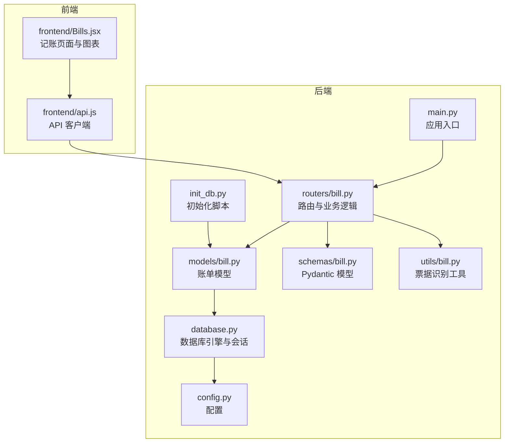
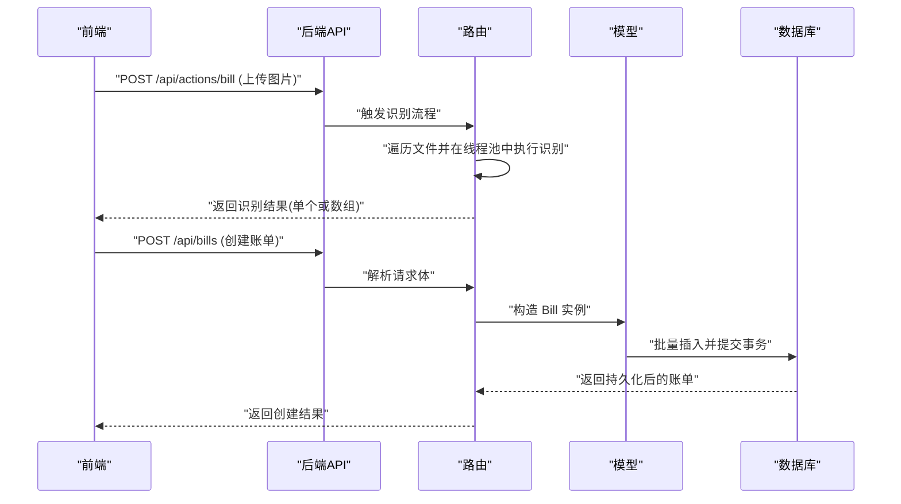
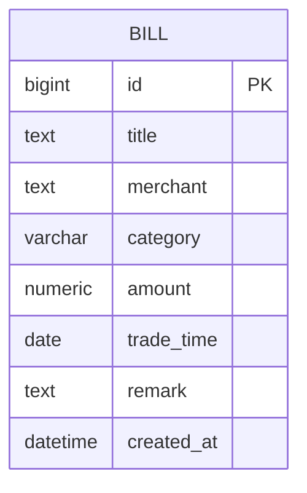
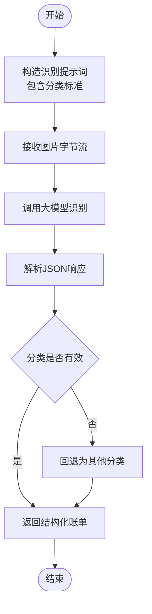
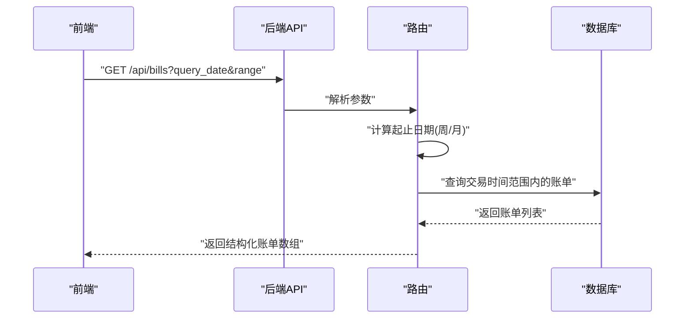
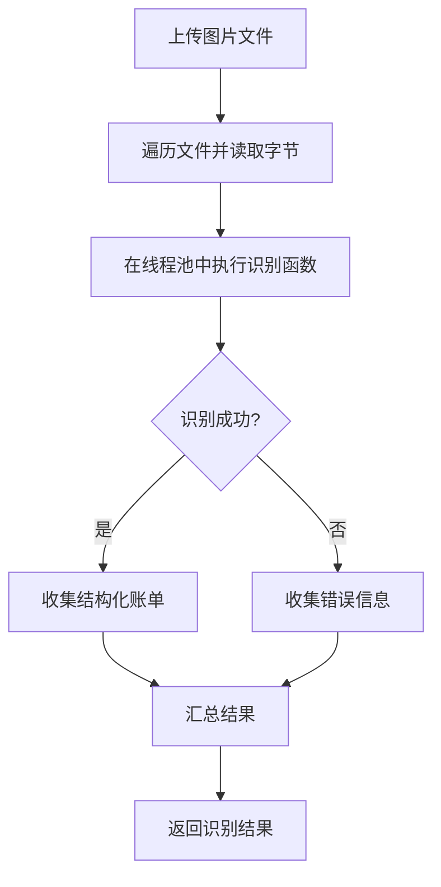
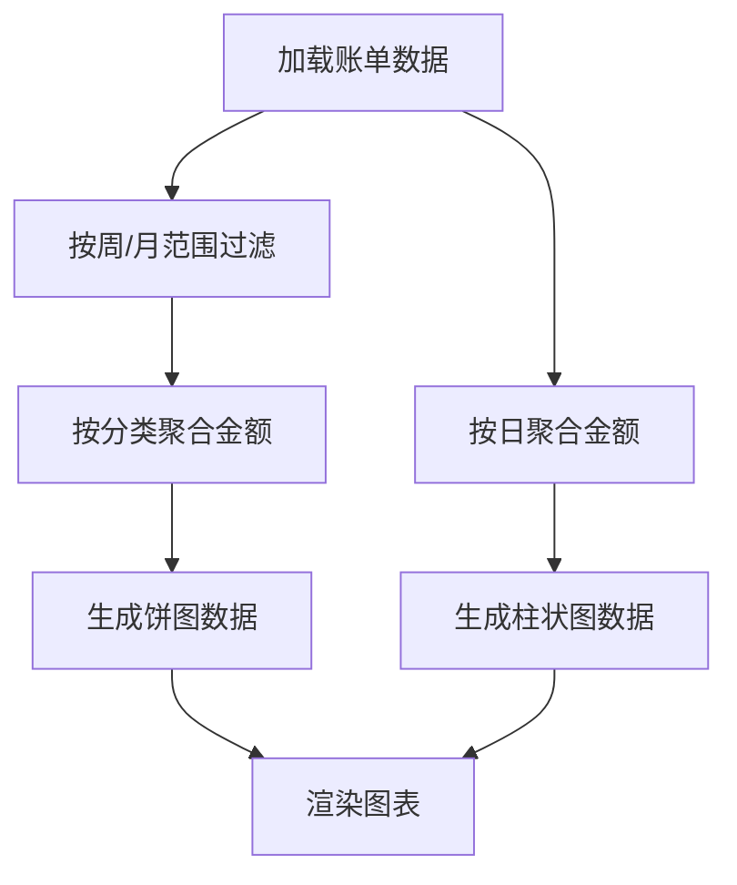
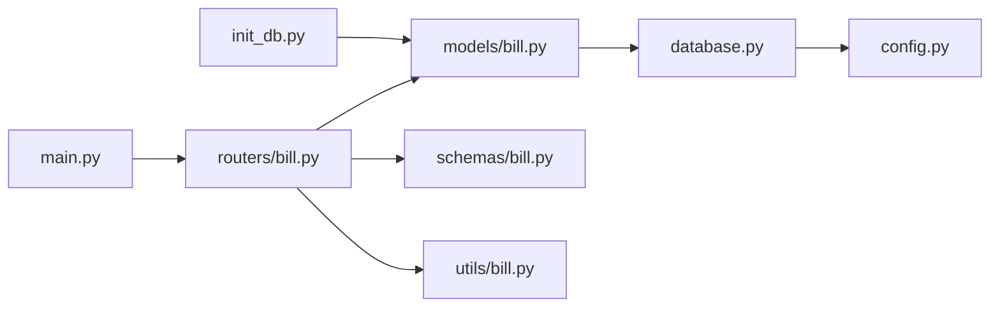

# 记账数据模型

<cite>
**本文引用的文件**
- [models/bill.py](file://blog_backend/models/bill.py)
- [schemas/bill.py](file://blog_backend/schemas/bill.py)
- [routers/bill.py](file://blog_backend/routers/bill.py)
- [utils/bill.py](file://blog_backend/utils/bill.py)
- [database.py](file://blog_backend/database.py)
- [config.py](file://blog_backend/config.py)
- [init_db.py](file://blog_backend/init_db.py)
- [main.py](file://blog_backend/main.py)
- [frontend/Bills.jsx](file://blog_frontend/src/components/Bills.jsx)
- [frontend/api.js](file://blog_frontend/src/api.js)
</cite>

## 目录
1. [引言](#引言)
2. [项目结构](#项目结构)
3. [核心组件](#核心组件)
4. [架构概览](#架构概览)
5. [详细组件分析](#详细组件分析)
6. [依赖分析](#依赖分析)
7. [性能考量](#性能考量)
8. [故障排查指南](#故障排查指南)
9. [结论](#结论)
10. [附录](#附录)

## 引言
本技术文档聚焦于记账数据模型的设计与实现，系统性阐述账单实体的表结构、字段设计考虑、财务数据精度与时间维度管理，以及记账类别的分类体系与聚合分析能力。文档同时结合后端模型与前端图表展示，给出从数据入库到可视化呈现的完整实现方案。

## 项目结构
后端采用 FastAPI + SQLAlchemy 的分层架构，前端使用 React + ECharts 进行可视化展示。记账模块位于后端的 models、schemas、routers、utils 四个目录下，配合数据库初始化脚本完成表结构创建与数据持久化。

**图表来源**
- [main.py:1-13](file://blog_backend/main.py#L1-L13)
- [routers/bill.py:1-173](file://blog_backend/routers/bill.py#L1-L173)
- [models/bill.py:1-24](file://blog_backend/models/bill.py#L1-L24)
- [schemas/bill.py:1-40](file://blog_backend/schemas/bill.py#L1-L40)
- [utils/bill.py:1-107](file://blog_backend/utils/bill.py#L1-L107)
- [database.py:1-18](file://blog_backend/database.py#L1-L18)
- [config.py:1-32](file://blog_backend/config.py#L1-L32)
- [init_db.py:1-10](file://blog_backend/init_db.py#L1-L10)
- [frontend/Bills.jsx:1-181](file://blog_frontend/src/components/Bills.jsx#L1-L181)
- [frontend/api.js:1-40](file://blog_frontend/src/api.js#L1-L40)

**章节来源**
- [main.py:1-13](file://blog_backend/main.py#L1-L13)
- [routers/bill.py:1-173](file://blog_backend/routers/bill.py#L1-L173)
- [models/bill.py:1-24](file://blog_backend/models/bill.py#L1-L24)
- [schemas/bill.py:1-40](file://blog_backend/schemas/bill.py#L1-L40)
- [utils/bill.py:1-107](file://blog_backend/utils/bill.py#L1-L107)
- [database.py:1-18](file://blog_backend/database.py#L1-L18)
- [config.py:1-32](file://blog_backend/config.py#L1-L32)
- [init_db.py:1-10](file://blog_backend/init_db.py#L1-L10)
- [frontend/Bills.jsx:1-181](file://blog_frontend/src/components/Bills.jsx#L1-L181)
- [frontend/api.js:1-40](file://blog_frontend/src/api.js#L1-L40)

## 核心组件
- 账单模型（SQLAlchemy）：定义账单表结构，包含主键、标题、商户、分类、金额、交易时间、备注与创建时间等字段。
- Pydantic 请求/响应模型：约束输入参数、校验金额精度与范围、统一响应结构。
- 路由器：提供创建账单、批量识别票据、按日期范围查询账单等接口。
- 票据识别工具：基于大模型进行图像识别，输出结构化账单数据。
- 数据库与配置：连接 MySQL，提供会话依赖，初始化表结构。
- 前端图表组件：按周/月维度统计每日支出与分类占比，支持交互式切换。

**章节来源**
- [models/bill.py:7-18](file://blog_backend/models/bill.py#L7-L18)
- [schemas/bill.py:7-39](file://blog_backend/schemas/bill.py#L7-L39)
- [routers/bill.py:24-173](file://blog_backend/routers/bill.py#L24-L173)
- [utils/bill.py:17-107](file://blog_backend/utils/bill.py#L17-L107)
- [database.py:1-18](file://blog_backend/database.py#L1-L18)
- [config.py:3-11](file://blog_backend/config.py#L3-L11)
- [init_db.py:1-10](file://blog_backend/init_db.py#L1-L10)
- [frontend/Bills.jsx:1-181](file://blog_frontend/src/components/Bills.jsx#L1-L181)

## 架构概览
后端通过 FastAPI 提供 REST 接口，SQLAlchemy 负责 ORM 映射与数据库操作；前端通过 axios 调用后端接口，使用 ECharts 渲染图表。票据识别功能通过异步线程池调用本地同步函数，避免阻塞事件循环。

**图表来源**
- [routers/bill.py:24-51](file://blog_backend/routers/bill.py#L24-L51)
- [routers/bill.py:55-116](file://blog_backend/routers/bill.py#L55-L116)
- [models/bill.py:7-18](file://blog_backend/models/bill.py#L7-L18)
- [database.py:12-18](file://blog_backend/database.py#L12-L18)

## 详细组件分析

### 表结构设计与字段定义
- 主键与自增：使用 BigInteger 类型的自增主键，确保大规模数据下的唯一性与扩展性。
- 标题与商户：文本类型，标题必填，商户可空，便于兼容不同票据格式。
- 分类：字符串类型，长度限制，用于后续前端分类统计与筛选。
- 金额：数值类型，固定精度（整数位与小数位），保证财务数据的精确性与一致性。
- 交易时间：日期类型，便于按日、周、月进行聚合统计。
- 备注：文本类型，可空，用于补充说明。
- 创建时间：日期时间类型，默认值为当前时间，便于审计与排序。

**图表来源**
- [models/bill.py:7-18](file://blog_backend/models/bill.py#L7-L18)

**章节来源**
- [models/bill.py:7-18](file://blog_backend/models/bill.py#L7-L18)

### 财务数据字段设计考虑
- 金额精度：采用数值类型并设置固定精度，避免浮点误差累积，满足财务对精确性的要求。
- 货币单位标准化：统一以“元”为单位存储，前端展示时可按需转换或标注。
- 时间字段管理：交易时间使用日期类型，便于按日统计；创建时间用于审计与排序。

**章节来源**
- [models/bill.py:14](file://blog_backend/models/bill.py#L14)
- [schemas/bill.py:16-22](file://blog_backend/schemas/bill.py#L16-L22)

### 记账类别分类体系
- 分类字段：字符串类型，前端定义标准分类集合，后端通过票据识别工具输出标准化分类。
- 分类层级：当前实现为一级分类（如餐饮、交通、购物等），未引入父子层级。若需扩展，可在后端增加父分类字段并在前端渲染树形结构。
- 票据识别分类：识别工具内置分类标准，确保输出与前端一致。

**图表来源**
- [utils/bill.py:17-77](file://blog_backend/utils/bill.py#L17-L77)
- [utils/bill.py:78-107](file://blog_backend/utils/bill.py#L78-L107)

**章节来源**
- [utils/bill.py:39-46](file://blog_backend/utils/bill.py#L39-L46)
- [frontend/Bills.jsx:28-30](file://blog_frontend/src/components/Bills.jsx#L28-L30)

### 时间维度设计与聚合查询
- 查询接口：支持按日期范围查询，自动计算周/月范围，或指定起止日期。
- 排序规则：按交易时间倒序，再按主键倒序，确保同日多条记录的稳定顺序。
- 前端聚合：
  - 按周：近七天每日总支出，支持选择某日高亮。
  - 按月：当月每日总支出，支持数据缩放。
  - 分类占比：按周/月范围内各分类总支出占比。

**图表来源**
- [routers/bill.py:117-173](file://blog_backend/routers/bill.py#L117-L173)
- [frontend/Bills.jsx:32-46](file://blog_frontend/src/components/Bills.jsx#L32-L46)

**章节来源**
- [routers/bill.py:117-173](file://blog_backend/routers/bill.py#L117-L173)
- [frontend/Bills.jsx:52-151](file://blog_frontend/src/components/Bills.jsx#L52-L151)
- [frontend/Bills.jsx:153-181](file://blog_frontend/src/components/Bills.jsx#L153-L181)

### 票据识别与数据准备
- 批量上传：支持多张图片并发识别，逐个处理并收集结果。
- 结果合并：将识别结果合并为数组，便于前端展示与二次确认。
- 错误处理：捕获异常并返回错误信息，便于前端提示。

**图表来源**
- [routers/bill.py:24-51](file://blog_backend/routers/bill.py#L24-L51)
- [utils/bill.py:17-77](file://blog_backend/utils/bill.py#L17-L77)

**章节来源**
- [routers/bill.py:24-51](file://blog_backend/routers/bill.py#L24-L51)
- [utils/bill.py:17-107](file://blog_backend/utils/bill.py#L17-L107)

### 图表数据准备与财务分析
- 日趋势图（柱状图）：按周/月维度统计每日总支出，支持选择某日高亮与数据缩放。
- 分类占比图（饼图）：按周/月范围内统计各分类总支出占比，支持切换图表类型。
- 数据清洗：前端对空分类统一归为“其他”，并对金额保留两位小数。

**图表来源**
- [frontend/Bills.jsx:153-181](file://blog_frontend/src/components/Bills.jsx#L153-L181)
- [frontend/Bills.jsx:52-151](file://blog_frontend/src/components/Bills.jsx#L52-L151)

**章节来源**
- [frontend/Bills.jsx:153-181](file://blog_frontend/src/components/Bills.jsx#L153-L181)
- [frontend/Bills.jsx:52-151](file://blog_frontend/src/components/Bills.jsx#L52-L151)

## 依赖分析
- 应用入口：注册记账路由，统一前缀与标签。
- 路由依赖：依赖数据库会话，确保每个请求有独立的数据库连接。
- 模型依赖：依赖数据库基类，实现表映射。
- 工具依赖：依赖 OpenAI SDK，调用大模型服务。
- 初始化：创建所有表结构，确保首次运行可用。

**图表来源**
- [main.py:1-13](file://blog_backend/main.py#L1-L13)
- [routers/bill.py:1-173](file://blog_backend/routers/bill.py#L1-L173)
- [models/bill.py:1-24](file://blog_backend/models/bill.py#L1-L24)
- [schemas/bill.py:1-40](file://blog_backend/schemas/bill.py#L1-L40)
- [utils/bill.py:1-107](file://blog_backend/utils/bill.py#L1-L107)
- [database.py:1-18](file://blog_backend/database.py#L1-L18)
- [config.py:1-32](file://blog_backend/config.py#L1-L32)
- [init_db.py:1-10](file://blog_backend/init_db.py#L1-L10)

**章节来源**
- [main.py:1-13](file://blog_backend/main.py#L1-L13)
- [routers/bill.py:1-173](file://blog_backend/routers/bill.py#L1-L173)
- [models/bill.py:1-24](file://blog_backend/models/bill.py#L1-L24)
- [schemas/bill.py:1-40](file://blog_backend/schemas/bill.py#L1-L40)
- [utils/bill.py:1-107](file://blog_backend/utils/bill.py#L1-L107)
- [database.py:1-18](file://blog_backend/database.py#L1-L18)
- [config.py:1-32](file://blog_backend/config.py#L1-L32)
- [init_db.py:1-10](file://blog_backend/init_db.py#L1-L10)

## 性能考量
- 数据库连接：使用会话工厂按请求创建连接，避免全局共享导致的并发问题。
- 批量写入：创建账单时使用批量插入，减少数据库往返次数。
- 异步识别：票据识别在独立线程池中执行，避免阻塞主线程。
- 前端聚合：在客户端进行轻量级聚合，降低后端压力；对于大数据集建议后端分页与缓存。

[本节为通用性能建议，无需特定文件来源]

## 故障排查指南
- 票据识别失败：检查识别工具的提示词与模型配置，确认图片格式与大小；查看返回的错误信息定位问题。
- 创建账单失败：检查金额是否大于零、分类是否在标准集合内、交易时间是否有效；查看后端异常堆栈。
- 查询无数据：确认查询日期与范围参数是否正确，检查数据库中是否存在对应记录。
- 图表不显示：确认前端已正确加载账单数据，检查分类字段是否为空或不在标准集合内。

**章节来源**
- [utils/bill.py:75-77](file://blog_backend/utils/bill.py#L75-L77)
- [routers/bill.py:110-115](file://blog_backend/routers/bill.py#L110-L115)
- [frontend/Bills.jsx:153-181](file://blog_frontend/src/components/Bills.jsx#L153-L181)

## 结论
该记账数据模型以清晰的表结构与严格的字段约束为基础，结合票据识别与前端可视化，实现了从数据采集、入库、查询到分析展示的完整闭环。通过固定精度的金额字段与标准化的分类体系，确保了财务数据的准确性与一致性；通过周/月维度的聚合与图表展示，提升了用户的财务洞察效率。未来可考虑引入分类层级、指标缓存与更丰富的分析维度，进一步增强系统的可扩展性与用户体验。

[本节为总结性内容，无需特定文件来源]

## 附录
- 数据库初始化：首次运行时执行初始化脚本，创建所有表结构。
- 配置说明：数据库连接字符串通过环境变量配置，便于在不同环境中部署。
- 前端集成：通过 API 客户端封装后端接口，简化前端调用。

**章节来源**
- [init_db.py:1-10](file://blog_backend/init_db.py#L1-L10)
- [config.py:3-11](file://blog_backend/config.py#L3-L11)
- [frontend/api.js:1-40](file://blog_frontend/src/api.js#L1-L40)