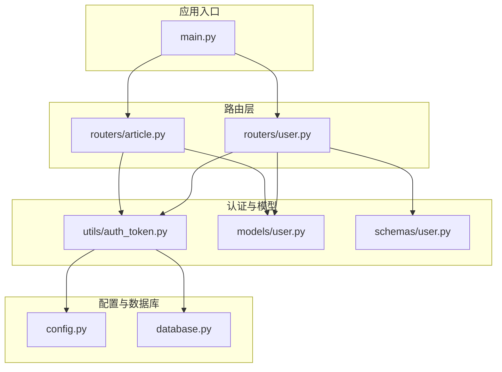
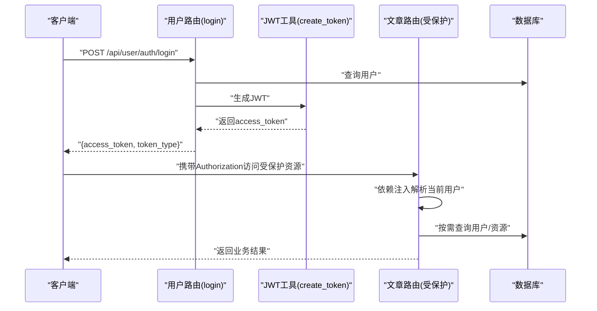
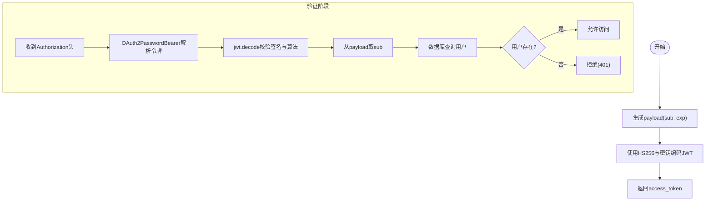
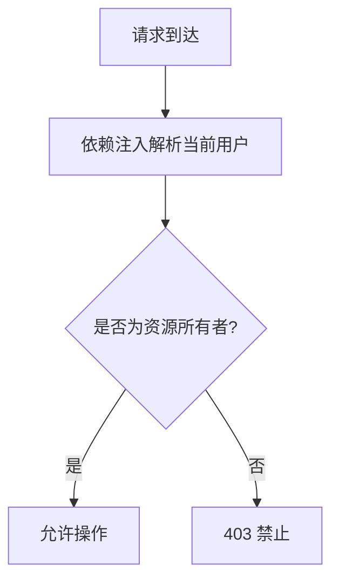
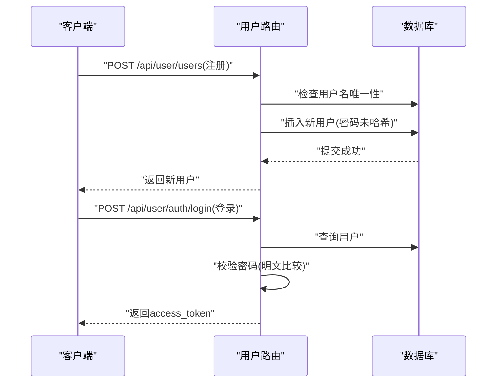
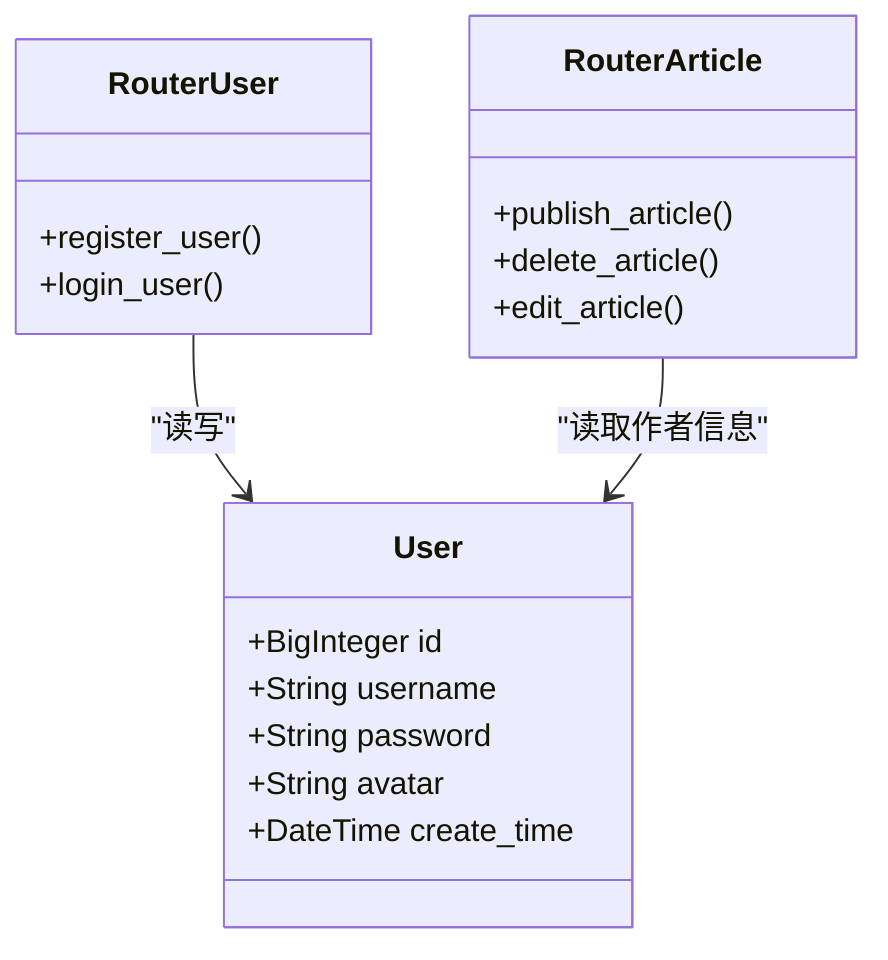
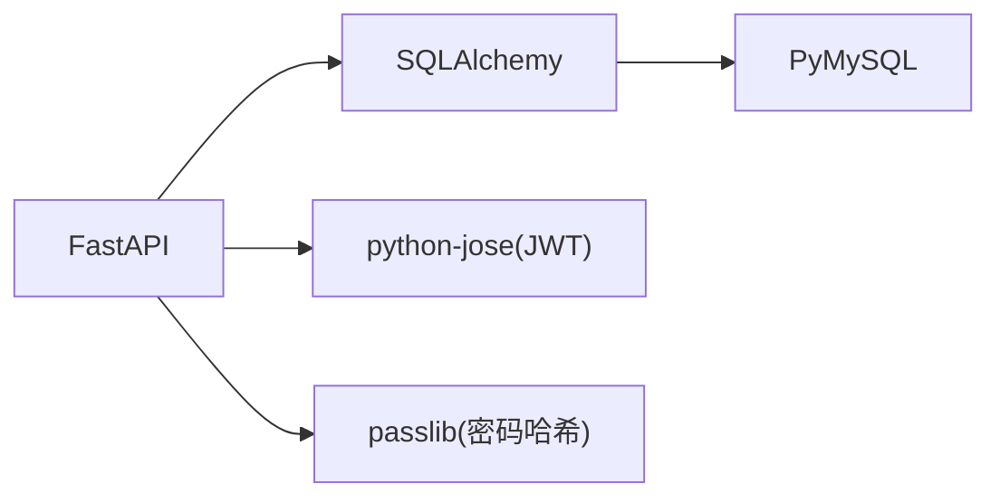

# 认证系统

<cite>
**本文引用的文件**
- [blog_backend/main.py](file://blog_backend/main.py)
- [blog_backend/config.py](file://blog_backend/config.py)
- [blog_backend/database.py](file://blog_backend/database.py)
- [blog_backend/models/user.py](file://blog_backend/models/user.py)
- [blog_backend/schemas/user.py](file://blog_backend/schemas/user.py)
- [blog_backend/routers/user.py](file://blog_backend/routers/user.py)
- [blog_backend/routers/article.py](file://blog_backend/routers/article.py)
- [blog_backend/utils/auth_token.py](file://blog_backend/utils/auth_token.py)
- [blog_backend/requirements.txt](file://blog_backend/requirements.txt)
</cite>

## 目录
1. [简介](#简介)
2. [项目结构](#项目结构)
3. [核心组件](#核心组件)
4. [架构总览](#架构总览)
5. [详细组件分析](#详细组件分析)
6. [依赖分析](#依赖分析)
7. [性能考虑](#性能考虑)
8. [故障排查指南](#故障排查指南)
9. [结论](#结论)
10. [附录](#附录)

## 简介
本文件面向博客系统的认证子系统，聚焦以下主题：
- JWT 令牌的生成、验证与过期处理
- 用户密码存储策略（当前实现与改进建议）
- 权限模型与访问控制（基于用户身份的简单授权）
- 认证中间件与请求拦截流程
- 安全最佳实践、常见攻击防护与修复建议
- 具体实现位置与使用示例路径

注意：当前仓库中未发现“刷新令牌”“角色/权限表/ACL”等高级能力的具体实现；本文在“详细组件分析”部分明确指出现状，并给出可落地的扩展建议。

## 项目结构
后端采用 FastAPI + SQLAlchemy 架构，认证相关代码集中在以下模块：
- 配置与密钥：config.py
- 数据库连接与会话：database.py
- 用户模型：models/user.py
- 用户接口：routers/user.py
- 文章接口（演示认证依赖）：routers/article.py
- 认证工具（JWT 与当前用户解析）：utils/auth_token.py
- 应用入口：main.py
- 依赖声明：requirements.txt

图表来源
- [blog_backend/main.py:1-13](file://blog_backend/main.py#L1-L13)
- [blog_backend/config.py:1-32](file://blog_backend/config.py#L1-L32)
- [blog_backend/database.py:1-18](file://blog_backend/database.py#L1-L18)
- [blog_backend/utils/auth_token.py:1-38](file://blog_backend/utils/auth_token.py#L1-L38)
- [blog_backend/models/user.py:1-14](file://blog_backend/models/user.py#L1-L14)
- [blog_backend/schemas/user.py:1-13](file://blog_backend/schemas/user.py#L1-L13)
- [blog_backend/routers/user.py:1-101](file://blog_backend/routers/user.py#L1-L101)
- [blog_backend/routers/article.py:1-85](file://blog_backend/routers/article.py#L1-L85)

章节来源
- [blog_backend/main.py:1-13](file://blog_backend/main.py#L1-L13)
- [blog_backend/config.py:1-32](file://blog_backend/config.py#L1-L32)
- [blog_backend/database.py:1-18](file://blog_backend/database.py#L1-L18)

## 核心组件
- JWT 工具与当前用户解析：负责生成、解码 JWT 并解析当前用户
- 用户路由：提供注册、登录接口
- 文章路由：通过依赖注入获取当前用户并进行简单授权校验
- 用户模型与数据访问：定义用户表结构与数据库会话依赖
- 应用入口与路由挂载：统一注册各模块路由

章节来源
- [blog_backend/utils/auth_token.py:12-38](file://blog_backend/utils/auth_token.py#L12-L38)
- [blog_backend/routers/user.py:16-51](file://blog_backend/routers/user.py#L16-L51)
- [blog_backend/routers/article.py:12-85](file://blog_backend/routers/article.py#L12-L85)
- [blog_backend/models/user.py:5-14](file://blog_backend/models/user.py#L5-L14)
- [blog_backend/main.py:6-11](file://blog_backend/main.py#L6-L11)

## 架构总览
认证流程由“登录接口生成 JWT → 客户端携带令牌 → 路由依赖解析当前用户 → 业务逻辑执行授权判断”构成。

图表来源
- [blog_backend/routers/user.py:37-51](file://blog_backend/routers/user.py#L37-L51)
- [blog_backend/utils/auth_token.py:12-38](file://blog_backend/utils/auth_token.py#L12-L38)
- [blog_backend/routers/article.py:12-85](file://blog_backend/routers/article.py#L12-L85)

## 详细组件分析

### JWT 令牌生成与验证
- 生成：使用 HS256 算法与对称密钥，payload 包含 subject（用户名）与过期时间（当前实现为 24 小时）
- 验证：OAuth2PasswordBearer 提供令牌提取，jwt.decode 进行签名与算法校验，解析出 subject 后回查用户
- 当前限制：未实现刷新令牌、令牌撤销、黑名单等机制

图表来源
- [blog_backend/utils/auth_token.py:12-38](file://blog_backend/utils/auth_token.py#L12-L38)
- [blog_backend/config.py:15-17](file://blog_backend/config.py#L15-L17)

章节来源
- [blog_backend/utils/auth_token.py:12-38](file://blog_backend/utils/auth_token.py#L12-L38)
- [blog_backend/config.py:15-17](file://blog_backend/config.py#L15-L17)

### 用户密码存储策略
- 当前实现：用户注册时直接保存明文密码字段
- 存在风险：若数据库泄露，用户密码将直接暴露
- 建议改进：
  - 使用强哈希（如 bcrypt、argon2 或 passlib 的安全默认方案）
  - 注册时对密码进行哈希，登录时比较哈希值
  - 不在数据库中保留明文密码

章节来源
- [blog_backend/routers/user.py:16-33](file://blog_backend/routers/user.py#L16-L33)
- [blog_backend/models/user.py:8-10](file://blog_backend/models/user.py#L8-L10)
- [blog_backend/requirements.txt:5](file://blog_backend/requirements.txt#L5)

### 权限管理与访问控制
- 角色/权限模型：当前未实现角色字段、权限表或 ACL
- 授权方式：通过“当前用户”依赖解析身份，业务层自行判断资源归属（如文章作者）
- 示例：删除/编辑文章时，比对 article.user_id 与 current_user.id

图表来源
- [blog_backend/routers/article.py:56-68](file://blog_backend/routers/article.py#L56-L68)
- [blog_backend/routers/article.py:71-85](file://blog_backend/routers/article.py#L71-L85)

章节来源
- [blog_backend/routers/article.py:56-68](file://blog_backend/routers/article.py#L56-L68)
- [blog_backend/routers/article.py:71-85](file://blog_backend/routers/article.py#L71-L85)

### 认证中间件与请求拦截
- 中间件模式：FastAPI 依赖注入替代传统中间件，通过依赖函数在进入路由处理前完成令牌解析与用户校验
- OAuth2 流程：使用 OAuth2PasswordBearer 指定 tokenUrl，客户端应将令牌放在 Authorization 头中（Bearer 方案）

章节来源
- [blog_backend/utils/auth_token.py:20-38](file://blog_backend/utils/auth_token.py#L20-L38)
- [blog_backend/routers/user.py:37-51](file://blog_backend/routers/user.py#L37-L51)

### 登录与注册流程
- 注册：校验用户名唯一性，保存用户信息（当前未对密码做哈希）
- 登录：校验用户名与密码（当前未对密码做哈希比对），成功后签发 JWT

图表来源
- [blog_backend/routers/user.py:16-33](file://blog_backend/routers/user.py#L16-L33)
- [blog_backend/routers/user.py:37-51](file://blog_backend/routers/user.py#L37-L51)

章节来源
- [blog_backend/routers/user.py:16-33](file://blog_backend/routers/user.py#L16-L33)
- [blog_backend/routers/user.py:37-51](file://blog_backend/routers/user.py#L37-L51)

### 数据模型与依赖
- 用户模型：包含 id、username、password、avatar、create_time 等字段
- 数据库会话：通过 get_db 依赖提供 SQLAlchemy 会话
- 路由依赖：各路由通过 Depends(get_db) 获取会话；受保护路由通过 Depends(get_current_user) 获取当前用户

图表来源
- [blog_backend/models/user.py:5-14](file://blog_backend/models/user.py#L5-L14)
- [blog_backend/routers/user.py:16-51](file://blog_backend/routers/user.py#L16-L51)
- [blog_backend/routers/article.py:12-85](file://blog_backend/routers/article.py#L12-L85)

章节来源
- [blog_backend/models/user.py:5-14](file://blog_backend/models/user.py#L5-L14)
- [blog_backend/database.py:12-18](file://blog_backend/database.py#L12-L18)
- [blog_backend/routers/user.py:16-51](file://blog_backend/routers/user.py#L16-L51)
- [blog_backend/routers/article.py:12-85](file://blog_backend/routers/article.py#L12-L85)

## 依赖分析
- 快速开发框架：FastAPI
- 数据库 ORM：SQLAlchemy
- 加解密与哈希：python-jose（JWT）、passlib（密码哈希）
- 数据库驱动：PyMySQL
- 其他：Redis、OpenAI、BeautifulSoup 等（与认证非直接相关）

图表来源
- [blog_backend/requirements.txt:1-14](file://blog_backend/requirements.txt#L1-L14)

章节来源
- [blog_backend/requirements.txt:1-14](file://blog_backend/requirements.txt#L1-L14)

## 性能考虑
- JWT 解析成本极低，主要开销在数据库查询与密码校验
- 建议：
  - 对用户查询加索引（username）
  - 登录时避免 N+1 查询
  - 将令牌有效期设置为合理值（当前为 24 小时），结合刷新令牌策略降低泄露风险
  - 在高并发场景下，考虑缓存活跃用户信息（谨慎处理一致性）

## 故障排查指南
- 401 未授权
  - 可能原因：令牌缺失、格式不正确、签名或算法不匹配、已过期
  - 排查步骤：确认 Authorization 头格式为 Bearer；核对密钥与算法；检查 exp 时间
- 403 禁止访问
  - 可能原因：资源归属校验失败（如非文章作者）
  - 排查步骤：确认当前用户与资源 owner 关系
- 400 错误（注册/登录）
  - 可能原因：用户名重复、密码错误
  - 排查步骤：检查用户名唯一性与密码校验逻辑（当前为明文比较，建议改为哈希比对）

章节来源
- [blog_backend/utils/auth_token.py:25-37](file://blog_backend/utils/auth_token.py#L25-L37)
- [blog_backend/routers/user.py:18-46](file://blog_backend/routers/user.py#L18-L46)
- [blog_backend/routers/article.py:62-64](file://blog_backend/routers/article.py#L62-L64)

## 结论
- 当前认证系统具备基本的 JWT 登录与基于身份的简单授权能力
- 存在的关键风险点：密码明文存储、缺少刷新令牌与撤销机制、未实现角色/权限模型
- 建议优先级：
  1) 引入强哈希（passlib/argon2）替换明文密码存储
  2) 实现刷新令牌与令牌撤销（黑名单/短期令牌+刷新令牌）
  3) 引入角色/权限模型与更细粒度的 ACL
  4) 增强日志与审计（异常登录、频繁失败尝试）

## 附录

### 安全最佳实践清单
- 密钥管理
  - 使用环境变量存放 secret_key，定期轮换
  - 严格控制密钥访问范围
- 令牌策略
  - 短期访问令牌 + 刷新令牌
  - 令牌撤销与黑名单（登出时加入黑名单）
  - HTTPS 传输，SameSite Cookie（如使用 Cookie）
- 输入与存储
  - 注册时对密码进行强哈希
  - 登录时使用恒定时序比较，防止时序分析
- 日志与监控
  - 记录认证事件（登录、失败、登出）
  - 监控异常行为（频繁失败、异地登录）

### 常见攻击与防护
- JWT 攻击
  - 防护：使用强密钥与 HS256；避免使用弱算法；限制令牌有效期；服务端校验 exp
- 破解与暴力枚举
  - 防护：速率限制、账户锁定、验证码、恒定时序比较
- 会话劫持
  - 防护：HTTPS、安全的 SameSite 属性、短生命周期令牌
- SQL 注入
  - 防护：使用 ORM/参数化查询；最小权限数据库账号

### 扩展建议（基于现有代码结构）
- 新增“刷新令牌”支持
  - 在登录成功后发放短期 access_token 与长期 refresh_token
  - 刷新接口：校验 refresh_token 并签发新的 access_token
- 引入角色/权限模型
  - 在 User 表新增 role 字段或独立 Role/Permission 表
  - 在 get_current_user 基础上增加权限校验装饰器
- 增强日志与审计
  - 记录每次认证事件与异常行为
  - 集成外部审计系统或日志平台