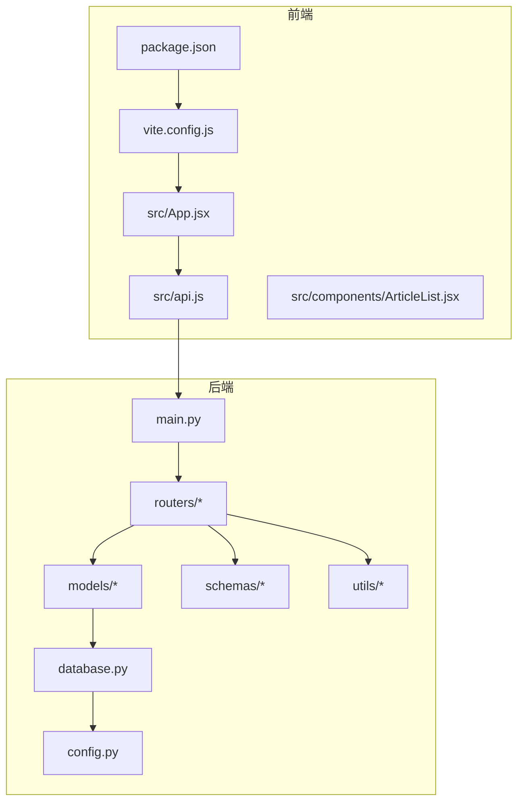
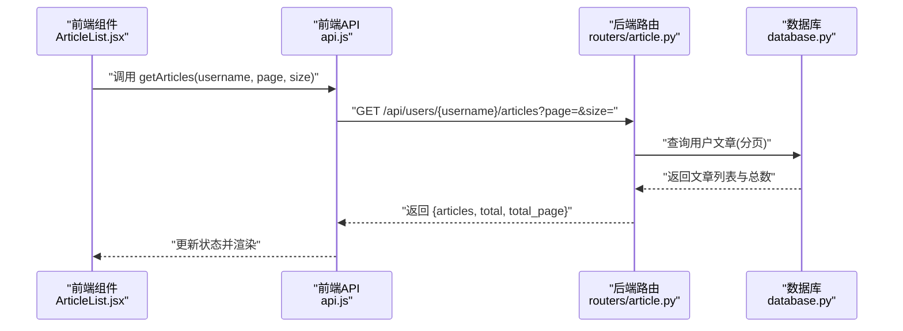
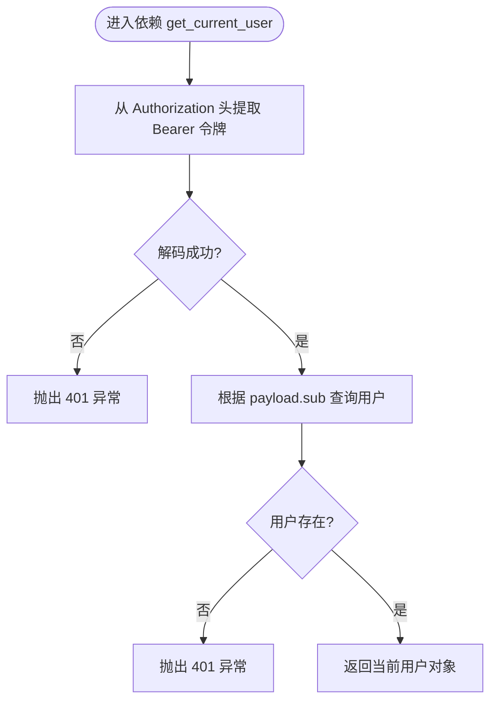
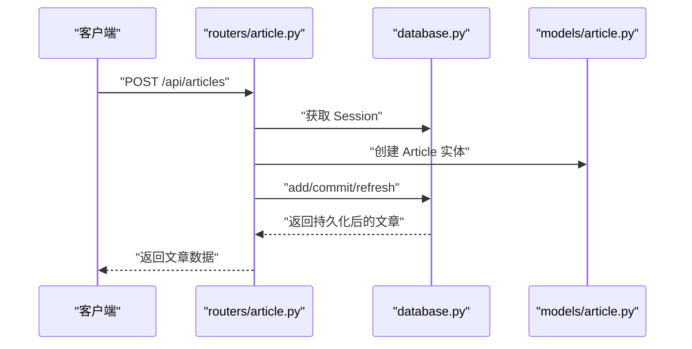
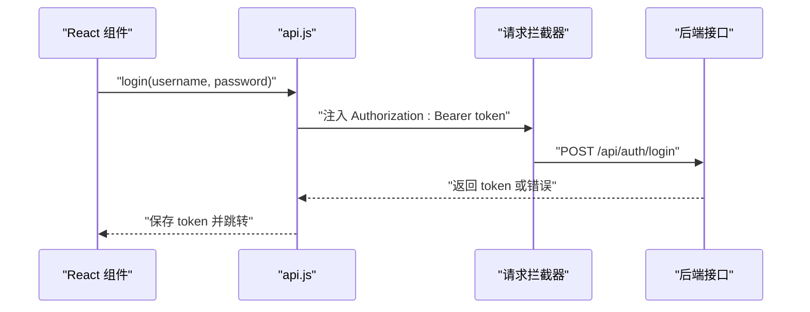

# 代码规范

<cite>
**本文引用的文件**
- [blog_backend/pyproject.toml](file://blog_backend/pyproject.toml)
- [blog_backend/requirements.txt](file://blog_backend/requirements.txt)
- [blog_backend/main.py](file://blog_backend/main.py)
- [blog_backend/config.py](file://blog_backend/config.py)
- [blog_backend/database.py](file://blog_backend/database.py)
- [blog_backend/models/article.py](file://blog_backend/models/article.py)
- [blog_backend/schemas/article.py](file://blog_backend/schemas/article.py)
- [blog_backend/routers/article.py](file://blog_backend/routers/article.py)
- [blog_backend/utils/auth_token.py](file://blog_backend/utils/auth_token.py)
- [blog_frontend/package.json](file://blog_frontend/package.json)
- [blog_frontend/vite.config.js](file://blog_frontend/vite.config.js)
- [blog_frontend/src/api.js](file://blog_frontend/src/api.js)
- [blog_frontend/src/App.jsx](file://blog_frontend/src/App.jsx)
- [blog_frontend/src/components/ArticleList.jsx](file://blog_frontend/src/components/ArticleList.jsx)
- [docker-compose.yml](file://docker-compose.yml)
</cite>

## 目录
1. [引言](#引言)
2. [项目结构](#项目结构)
3. [核心组件](#核心组件)
4. [架构总览](#架构总览)
5. [详细组件分析](#详细组件分析)
6. [依赖分析](#依赖分析)
7. [性能考虑](#性能考虑)
8. [故障排查指南](#故障排查指南)
9. [结论](#结论)
10. [附录](#附录)

## 引言
本文件为博客项目的代码规范文档，覆盖后端 Python 与前端 JavaScript/ES6+ 的编码标准、命名约定、文件组织、注释与文档字符串规范、格式化工具与自动检查流程，以及项目特定的命名与架构约束。目标是统一团队开发风格，提升可读性、可维护性与协作效率。

## 项目结构
项目采用前后端分离架构：
- 后端使用 FastAPI + SQLAlchemy，模块按职责划分为 models、routers、schemas、utils、tests 等目录。
- 前端使用 Vite + React，组件按功能拆分在 src/components 中，API 封装于 src/api.js，路由与页面在 src/App.jsx 中组织。
- 配置通过环境变量注入，数据库连接、密钥、爬虫目标等集中于 config.py；前端通过 Vite 开发服务器代理到后端。

图表来源
- [blog_backend/main.py:1-13](file://blog_backend/main.py#L1-L13)
- [blog_backend/database.py:1-18](file://blog_backend/database.py#L1-L18)
- [blog_backend/config.py:1-32](file://blog_backend/config.py#L1-L32)
- [blog_backend/routers/article.py:1-85](file://blog_backend/routers/article.py#L1-L85)
- [blog_backend/models/article.py:1-41](file://blog_backend/models/article.py#L1-L41)
- [blog_backend/schemas/article.py:1-10](file://blog_backend/schemas/article.py#L1-L10)
- [blog_backend/utils/auth_token.py:1-38](file://blog_backend/utils/auth_token.py#L1-L38)
- [blog_frontend/src/App.jsx:1-79](file://blog_frontend/src/App.jsx#L1-L79)
- [blog_frontend/src/api.js:1-39](file://blog_frontend/src/api.js#L1-L39)
- [blog_frontend/vite.config.js:1-17](file://blog_frontend/vite.config.js#L1-L17)
- [blog_frontend/package.json:1-28](file://blog_frontend/package.json#L1-L28)

章节来源
- [blog_backend/main.py:1-13](file://blog_backend/main.py#L1-L13)
- [blog_frontend/vite.config.js:1-17](file://blog_frontend/vite.config.js#L1-L17)

## 核心组件
- 后端应用入口：在应用入口中集中注册路由前缀与标签，便于 API 文档与调用路径统一管理。
- 数据模型：使用 SQLAlchemy ORM 定义实体与关联表，明确主外键关系与默认值。
- 路由层：基于 FastAPI 的装饰器定义接口，结合依赖注入获取数据库会话与当前用户。
- 工具层：封装 JWT 令牌生成与解析，实现基于 OAuth2 的认证依赖。
- 前端应用：React 组件按功能拆分，Axios 封装统一请求与拦截器，Vite 提供开发与构建支持。

章节来源
- [blog_backend/main.py:1-13](file://blog_backend/main.py#L1-L13)
- [blog_backend/models/article.py:1-41](file://blog_backend/models/article.py#L1-L41)
- [blog_backend/routers/article.py:1-85](file://blog_backend/routers/article.py#L1-L85)
- [blog_backend/utils/auth_token.py:1-38](file://blog_backend/utils/auth_token.py#L1-L38)
- [blog_frontend/src/App.jsx:1-79](file://blog_frontend/src/App.jsx#L1-L79)
- [blog_frontend/src/api.js:1-39](file://blog_frontend/src/api.js#L1-L39)

## 架构总览
后端通过 FastAPI 提供 REST 接口，前端通过 Axios 调用后端接口，开发时通过 Vite 代理将 /api 请求转发至后端服务。

图表来源
- [blog_frontend/src/components/ArticleList.jsx:1-77](file://blog_frontend/src/components/ArticleList.jsx#L1-L77)
- [blog_frontend/src/api.js:1-39](file://blog_frontend/src/api.js#L1-L39)
- [blog_backend/routers/article.py:28-44](file://blog_backend/routers/article.py#L28-L44)
- [blog_backend/database.py:1-18](file://blog_backend/database.py#L1-L18)

## 详细组件分析

### 后端：认证与令牌
- 功能要点
  - 使用 PyJWT 实现令牌编码与解码，设置过期时间。
  - 通过 OAuth2PasswordBearer 提供令牌校验依赖。
  - 结合数据库查询当前用户，缺失或无效令牌直接抛出 HTTP 异常。
- 规范建议
  - 令牌算法与密钥应来自安全的环境变量，避免硬编码。
  - 对异常进行分类处理，区分“无效令牌”和“用户不存在”。

图表来源
- [blog_backend/utils/auth_token.py:20-38](file://blog_backend/utils/auth_token.py#L20-L38)

章节来源
- [blog_backend/utils/auth_token.py:1-38](file://blog_backend/utils/auth_token.py#L1-L38)

### 后端：文章路由与业务逻辑
- 功能要点
  - 发布文章：接收创建数据，填充作者信息后入库。
  - 文章列表：按用户名查询用户，再分页查询其文章，计算总页数。
  - 文章详情：查询文章与作者信息，返回组合数据。
  - 删除与编辑：鉴权校验，仅作者可操作。
- 规范建议
  - 对 HTTP 状态码进行统一约定，如“资源不存在”使用 404，“权限不足”使用 403。
  - 分页参数与默认值应在接口文档中明确。

图表来源
- [blog_backend/routers/article.py:11-25](file://blog_backend/routers/article.py#L11-L25)
- [blog_backend/models/article.py:15-31](file://blog_backend/models/article.py#L15-L31)
- [blog_backend/database.py:12-18](file://blog_backend/database.py#L12-L18)

章节来源
- [blog_backend/routers/article.py:1-85](file://blog_backend/routers/article.py#L1-L85)
- [blog_backend/models/article.py:1-41](file://blog_backend/models/article.py#L1-L41)

### 前端：API 封装与拦截器
- 功能要点
  - Axios 创建实例，设置 baseURL 为 /api。
  - 请求拦截器自动注入本地存储中的 token。
  - 导出常用 API 方法，如登录、注册、文章 CRUD、记账与爬虫触发等。
- 规范建议
  - 对 multipart/form-data 的请求显式设置 Content-Type。
  - 对错误响应进行统一处理，提示用户或重定向登录。

图表来源
- [blog_frontend/src/api.js:1-39](file://blog_frontend/src/api.js#L1-L39)

章节来源
- [blog_frontend/src/api.js:1-39](file://blog_frontend/src/api.js#L1-L39)

### 前端：路由与页面组件
- 功能要点
  - 使用 React Router 进行路由配置，导航栏根据登录状态显示不同菜单。
  - 页面组件通过 API 获取数据并渲染，如文章列表组件使用 Markdown 渲染摘要。
- 规范建议
  - 路由路径与后端一致，避免拼写不一致导致的 404。
  - 组件内部状态管理清晰，避免重复请求。

章节来源
- [blog_frontend/src/App.jsx:1-79](file://blog_frontend/src/App.jsx#L1-L79)
- [blog_frontend/src/components/ArticleList.jsx:1-77](file://blog_frontend/src/components/ArticleList.jsx#L1-L77)

## 依赖分析
- 后端依赖
  - Web 框架：FastAPI
  - 数据库：SQLAlchemy
  - 加解密与令牌：cryptography、python-jose
  - HTTP 客户端：requests
  - 异步运行：uvicorn
  - 其他：beautifulsoup4、playwright、redis、openai、passlib、python-multipart
- 前端依赖
  - 框架：React、React DOM
  - 路由：react-router-dom
  - HTTP：axios
  - 可视化：echarts、echarts-for-react
  - Markdown：react-markdown、remark-gfm
  - 构建：Vite、@vitejs/plugin-react
  - 类型：@types/react、@types/react-dom

章节来源
- [blog_backend/pyproject.toml:1-22](file://blog_backend/pyproject.toml#L1-L22)
- [blog_backend/requirements.txt:1-14](file://blog_backend/requirements.txt#L1-L14)
- [blog_frontend/package.json:1-28](file://blog_frontend/package.json#L1-L28)

## 性能考虑
- 后端
  - 数据库连接池与会话生命周期：确保每个请求正确 yield/关闭 Session，避免连接泄漏。
  - 分页查询：合理设置分页大小与索引，避免大偏移量导致的慢查询。
  - 缓存策略：对热点数据使用 Redis 缓存，减少数据库压力。
- 前端
  - 组件懒加载与代码分割：按需加载大型可视化组件。
  - 请求去抖与节流：对频繁触发的搜索或分页请求进行优化。
  - 图片与内容裁剪：对长文本与图片进行预裁剪，降低渲染开销。

## 故障排查指南
- 认证失败
  - 检查本地存储中 token 是否存在且未过期。
  - 确认后端密钥与算法配置一致。
- 数据库连接失败
  - 检查 DATABASE_URL 环境变量与数据库可达性。
  - 确认 SQLAlchemy 连接参数与主机、端口、库名一致。
- 前端跨域与代理
  - 确认 Vite 代理配置指向正确的后端地址。
  - 检查 /api 前缀是否与后端路由一致。
- 文件组织与命名
  - 后端模块遵循 models、routers、schemas、utils 的职责划分。
  - 前端组件按功能命名，API 方法语义化，避免缩写不清。

章节来源
- [blog_backend/config.py:1-32](file://blog_backend/config.py#L1-L32)
- [blog_backend/database.py:1-18](file://blog_backend/database.py#L1-L18)
- [blog_frontend/vite.config.js:1-17](file://blog_frontend/vite.config.js#L1-L17)

## 结论
本规范以项目现有实现为基础，总结了 Python 与 JavaScript 的编码风格、命名约定、模块组织与交互流程，并给出了性能与故障排查建议。建议在后续迭代中补充自动化格式化与静态检查流程，以进一步提升一致性与质量。

## 附录

### Python 编码规范（基于项目现状）
- 代码风格与命名
  - 模块与包：小写、下划线分隔；包内 __init__.py 明确导出。
  - 类：驼峰命名；方法与属性：小写下划线；常量：全大写。
  - 变量：小写下划线；私有成员：单下划线前缀。
- 函数与类设计
  - 函数：短小单一职责；必要参数在前，可选参数在后；使用类型注解。
  - 类：构造函数简洁；使用 SQLAlchemy 的关系与默认值；避免魔法数字。
- 注释与文档字符串
  - 单行注释以 # 开头并留一空格；多行注释使用三引号。
  - 公共接口建议添加简要说明，复杂逻辑补充流程说明。
- 文件组织
  - models：数据模型与关联表；routers：接口路由；schemas：Pydantic 模型；utils：通用工具；tests：测试用例。
- 异步与并发
  - 使用 FastAPI 的异步能力；数据库操作保持同步，避免阻塞事件循环。
- 依赖与配置
  - 所有敏感信息通过环境变量注入；数据库 URL、密钥、算法集中于 config.py。
- 格式化与检查
  - 推荐使用 Black（Python）与 Prettier（JS/TS）统一格式。
  - 在 CI 中加入自动检查与格式化步骤，确保提交质量。
- 项目特定约束
  - 路由前缀统一为 /api；标签使用中文以便文档展示。
  - 数据模型字段默认值与非空约束明确；关系通过 secondary 表实现多对多。

章节来源
- [blog_backend/main.py:1-13](file://blog_backend/main.py#L1-L13)
- [blog_backend/config.py:1-32](file://blog_backend/config.py#L1-L32)
- [blog_backend/database.py:1-18](file://blog_backend/database.py#L1-L18)
- [blog_backend/models/article.py:1-41](file://blog_backend/models/article.py#L1-L41)
- [blog_backend/schemas/article.py:1-10](file://blog_backend/schemas/article.py#L1-L10)
- [blog_backend/routers/article.py:1-85](file://blog_backend/routers/article.py#L1-L85)
- [blog_backend/utils/auth_token.py:1-38](file://blog_backend/utils/auth_token.py#L1-L38)

### JavaScript/ES6+ 编码规范（基于项目现状）
- 变量命名与作用域
  - 常量：大写蛇形；变量：小写下划线或驼峰；函数：驼峰；类：帕斯卡。
  - 优先使用 const/let，避免 var。
- 函数声明与模块化
  - 工具函数与 API 方法独立导出；组件函数以 PascalCase 命名。
  - 使用 ES Modules（import/export），避免 require。
- 异步编程
  - Promise 与 async/await 优先；错误处理使用 try/catch 或 .catch。
- 模块导入与导出
  - 严格区分相对与绝对路径；第三方依赖与内部模块分组导入。
- React 组件
  - 函数组件为主；合理拆分子组件；状态与副作用集中在 hooks。
- 前端工程化
  - Vite 提供开发与构建；代理配置统一 /api 前缀；类型声明与插件按需引入。
- 格式化与检查
  - 使用 Prettier 统一格式；ESLint 规范 JS/TS；在 CI 中执行检查。
- 项目特定约束
  - baseURL 固定为 /api；拦截器自动注入 Authorization；API 方法语义化命名。

章节来源
- [blog_frontend/src/api.js:1-39](file://blog_frontend/src/api.js#L1-L39)
- [blog_frontend/src/App.jsx:1-79](file://blog_frontend/src/App.jsx#L1-L79)
- [blog_frontend/src/components/ArticleList.jsx:1-77](file://blog_frontend/src/components/ArticleList.jsx#L1-L77)
- [blog_frontend/vite.config.js:1-17](file://blog_frontend/vite.config.js#L1-L17)
- [blog_frontend/package.json:1-28](file://blog_frontend/package.json#L1-L28)

### 自动化与工具配置建议
- Python
  - 格式化：Black；类型检查：mypy；静态分析：flake8；导入排序：isort。
  - 在 CI 中执行：black --check、flake8、mypy、pytest。
- JavaScript/TypeScript
  - 格式化：Prettier；类型检查：tsc；ESLint；打包：Vite。
  - 在 CI 中执行：prettier --check、eslint --ext .js,.jsx .、tsc --noEmit、vite build。
- Docker 与编排
  - 使用 docker-compose 管理后端服务；前端构建产物由 Nginx 提供静态服务。

章节来源
- [docker-compose.yml](file://docker-compose.yml)