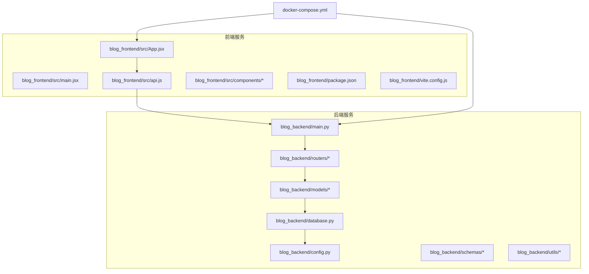
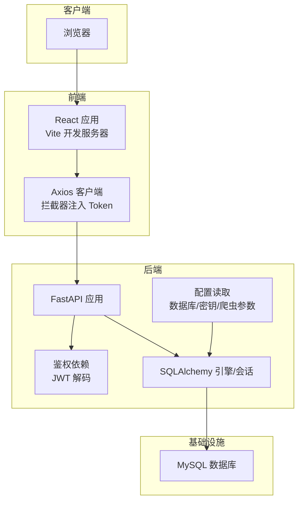
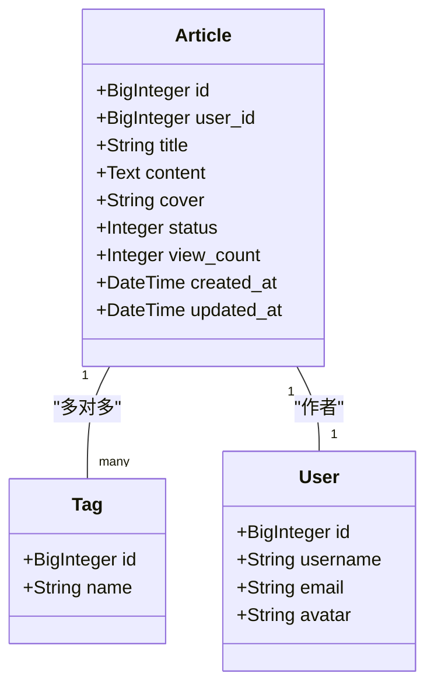
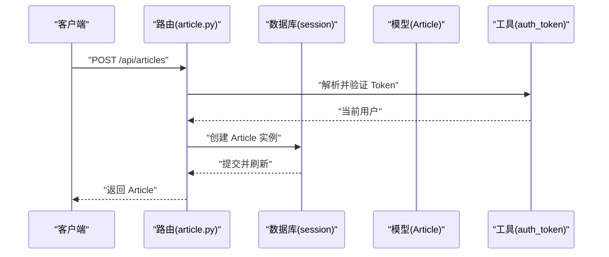
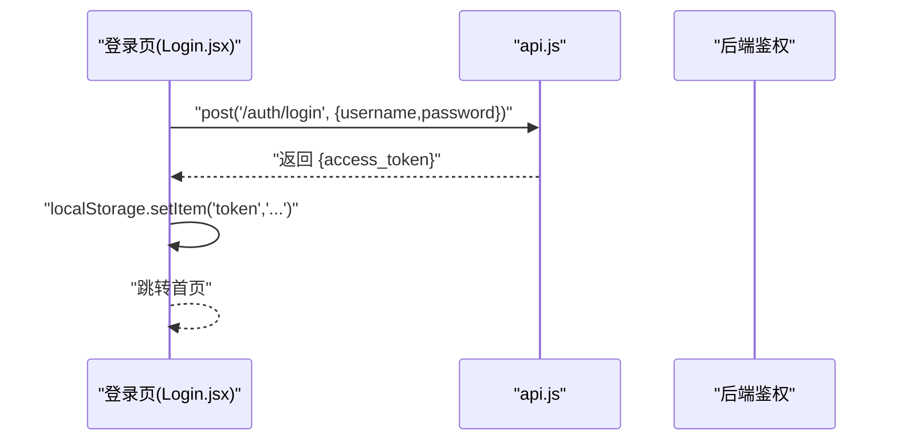
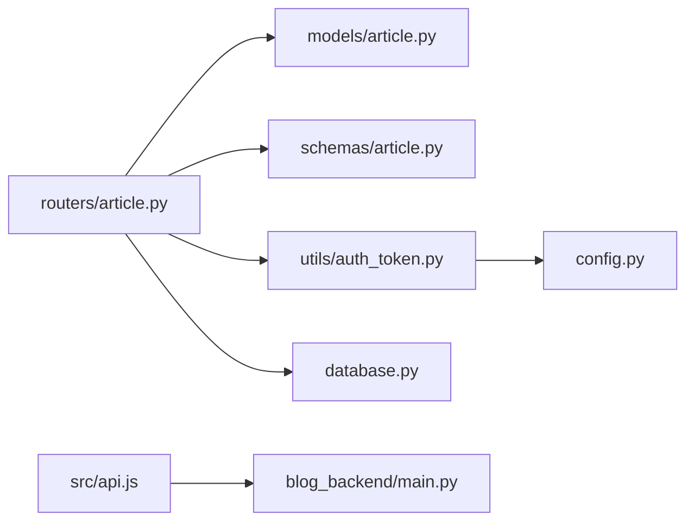

# 开发指南

<cite>
**本文引用的文件**
- [main.py](file://blog_backend/main.py)
- [config.py](file://blog_backend/config.py)
- [database.py](file://blog_backend/database.py)
- [models/article.py](file://blog_backend/models/article.py)
- [schemas/article.py](file://blog_backend/schemas/article.py)
- [routers/article.py](file://blog_backend/routers/article.py)
- [utils/auth_token.py](file://blog_backend/utils/auth_token.py)
- [pyproject.toml](file://blog_backend/pyproject.toml)
- [requirements.txt](file://blog_backend/requirements.txt)
- [.gitignore](file://blog_backend/.gitignore)
- [docker-compose.yml](file://docker-compose.yml)
- [package.json](file://blog_frontend/package.json)
- [vite.config.js](file://blog_frontend/vite.config.js)
- [src/api.js](file://blog_frontend/src/api.js)
- [src/App.jsx](file://blog_frontend/src/App.jsx)
- [src/main.jsx](file://blog_frontend/src/main.jsx)
- [src/components/Login.jsx](file://blog_frontend/src/components/Login.jsx)
- [src/components/Publish.jsx](file://blog_frontend/src/components/Publish.jsx)
- [src/components/ArticleDetail.jsx](file://blog_frontend/src/components/ArticleDetail.jsx)
</cite>

## 目录
1. [简介](#简介)
2. [项目结构](#项目结构)
3. [核心组件](#核心组件)
4. [架构总览](#架构总览)
5. [详细组件分析](#详细组件分析)
6. [依赖分析](#依赖分析)
7. [性能考虑](#性能考虑)
8. [故障排查指南](#故障排查指南)
9. [结论](#结论)
10. [附录](#附录)

## 简介
本开发指南面向希望参与博客项目的开发者，目标是帮助你快速理解并高效贡献代码。内容涵盖：
- 代码规范与最佳实践（Python、JavaScript/React）
- Git 工作流、分支策略与代码评审流程
- 开发环境配置、IDE 设置与调试技巧
- 新功能开发流程、测试策略与文档编写要求
- 项目结构、模块划分原则与依赖管理
- 常见问题与性能优化建议
- 第三方集成、插件与扩展点利用
- 贡献指南、问题报告与功能请求流程

## 项目结构
项目采用前后端分离架构，后端使用 FastAPI + SQLAlchemy，前端使用 React + Vite，通过 Docker Compose 统一编排。

**图表来源**
- [main.py:1-13](file://blog_backend/main.py#L1-L13)
- [database.py:1-18](file://blog_backend/database.py#L1-L18)
- [config.py:1-32](file://blog_backend/config.py#L1-L32)
- [models/article.py:1-41](file://blog_backend/models/article.py#L1-L41)
- [routers/article.py:1-85](file://blog_backend/routers/article.py#L1-L85)
- [utils/auth_token.py:1-38](file://blog_backend/utils/auth_token.py#L1-L38)
- [src/App.jsx:1-79](file://blog_frontend/src/App.jsx#L1-L79)
- [src/api.js:1-39](file://blog_frontend/src/api.js#L1-L39)
- [docker-compose.yml:1-41](file://docker-compose.yml#L1-L41)

**章节来源**
- [docker-compose.yml:1-41](file://docker-compose.yml#L1-L41)
- [main.py:1-13](file://blog_backend/main.py#L1-L13)
- [src/App.jsx:1-79](file://blog_frontend/src/App.jsx#L1-L79)

## 核心组件
- 后端应用入口与路由挂载：在应用入口集中注册各模块路由，统一前缀与标签，便于 API 聚合与文档化。
- 数据模型与关系：文章与标签多对多关联，文章与用户一对多，清晰表达业务实体与关系。
- 请求序列与鉴权：通过依赖注入获取数据库会话与当前用户，确保接口安全与数据一致性。
- 前端路由与拦截器：基于 React Router 的单页应用路由；Axios 拦截器自动注入认证头，简化调用。

**章节来源**
- [main.py:1-13](file://blog_backend/main.py#L1-L13)
- [models/article.py:1-41](file://blog_backend/models/article.py#L1-L41)
- [routers/article.py:1-85](file://blog_backend/routers/article.py#L1-L85)
- [utils/auth_token.py:1-38](file://blog_backend/utils/auth_token.py#L1-L38)
- [src/App.jsx:1-79](file://blog_frontend/src/App.jsx#L1-L79)
- [src/api.js:1-39](file://blog_frontend/src/api.js#L1-L39)

## 架构总览
后端以 FastAPI 提供 REST 接口，前端通过 Axios 调用后端 API；数据库由 MySQL 承载，连接信息通过环境变量注入；Docker Compose 将数据库、后端、前端串联为完整运行时。

**图表来源**
- [src/api.js:1-39](file://blog_frontend/src/api.js#L1-L39)
- [src/App.jsx:1-79](file://blog_frontend/src/App.jsx#L1-L79)
- [main.py:1-13](file://blog_backend/main.py#L1-L13)
- [utils/auth_token.py:1-38](file://blog_backend/utils/auth_token.py#L1-L38)
- [database.py:1-18](file://blog_backend/database.py#L1-L18)
- [config.py:1-32](file://blog_backend/config.py#L1-L32)

## 详细组件分析

### 后端：文章模块（路由、模型、模式）
- 路由职责：发布、分页查询、详情查看、删除与编辑。
- 权限控制：删除与编辑需校验当前用户是否为文章作者。
- 数据模型：文章与标签多对多，文章与用户一对多；时间戳自动维护。
- 数据模式：Pydantic 模型用于请求体校验与默认值处理。

**图表来源**
- [models/article.py:1-41](file://blog_backend/models/article.py#L1-L41)

**图表来源**
- [routers/article.py:1-85](file://blog_backend/routers/article.py#L1-L85)
- [utils/auth_token.py:1-38](file://blog_backend/utils/auth_token.py#L1-L38)
- [database.py:1-18](file://blog_backend/database.py#L1-L18)

**章节来源**
- [routers/article.py:1-85](file://blog_backend/routers/article.py#L1-L85)
- [models/article.py:1-41](file://blog_backend/models/article.py#L1-L41)
- [schemas/article.py:1-10](file://blog_backend/schemas/article.py#L1-L10)

### 前端：路由与 API 调用
- 路由组织：首页、登录、注册、发布、搜索、文章详情、编辑等页面。
- 登录状态：本地存储 token 与用户名；导航栏根据登录状态显示菜单。
- API 封装：统一 baseURL 与请求拦截器，自动附加 Authorization 头。
- 页面示例：登录页、发布页、文章详情页（含 Markdown 渲染与删除确认）。

**图表来源**
- [src/components/Login.jsx:1-47](file://blog_frontend/src/components/Login.jsx#L1-L47)
- [src/api.js:1-39](file://blog_frontend/src/api.js#L1-L39)

**章节来源**
- [src/App.jsx:1-79](file://blog_frontend/src/App.jsx#L1-L79)
- [src/main.jsx:1-9](file://blog_frontend/src/main.jsx#L1-L9)
- [src/api.js:1-39](file://blog_frontend/src/api.js#L1-L39)
- [src/components/Login.jsx:1-47](file://blog_frontend/src/components/Login.jsx#L1-L47)
- [src/components/Publish.jsx:1-53](file://blog_frontend/src/components/Publish.jsx#L1-L53)
- [src/components/ArticleDetail.jsx:1-60](file://blog_frontend/src/components/ArticleDetail.jsx#L1-L60)

### 配置与依赖
- 后端依赖：FastAPI、SQLAlchemy、PyMySQL、Redis、Requests、OpenAI、BeautifulSoup、Passlib、PyJWT、Uvicorn 等。
- 前端依赖：React、React Router、Axios、ECharts、React Markdown、Vite、@vitejs/plugin-react 等。
- 运行配置：数据库连接字符串通过环境变量拼接；JWT 密钥与算法在配置文件中定义；Vite 代理指向后端 8000 端口。

**章节来源**
- [pyproject.toml:1-22](file://blog_backend/pyproject.toml#L1-L22)
- [requirements.txt:1-14](file://blog_backend/requirements.txt#L1-L14)
- [config.py:1-32](file://blog_backend/config.py#L1-L32)
- [package.json:1-28](file://blog_frontend/package.json#L1-L28)
- [vite.config.js:1-17](file://blog_frontend/vite.config.js#L1-L17)

## 依赖分析
- 后端模块耦合：路由依赖模型与数据库会话；鉴权依赖配置中的密钥与算法；模型依赖数据库基类。
- 前后端耦合：前端通过 /api 前缀调用后端接口；Axios 拦截器统一注入 Token。
- 外部依赖：MySQL、Redis、第三方 HTTP 服务（如 OpenAI、BeautifulSoup 爬虫）。

**图表来源**
- [routers/article.py:1-85](file://blog_backend/routers/article.py#L1-L85)
- [models/article.py:1-41](file://blog_backend/models/article.py#L1-L41)
- [schemas/article.py:1-10](file://blog_backend/schemas/article.py#L1-L10)
- [utils/auth_token.py:1-38](file://blog_backend/utils/auth_token.py#L1-L38)
- [config.py:1-32](file://blog_backend/config.py#L1-L32)
- [database.py:1-18](file://blog_backend/database.py#L1-L18)
- [src/api.js:1-39](file://blog_frontend/src/api.js#L1-L39)
- [main.py:1-13](file://blog_backend/main.py#L1-L13)

**章节来源**
- [routers/article.py:1-85](file://blog_backend/routers/article.py#L1-L85)
- [utils/auth_token.py:1-38](file://blog_backend/utils/auth_token.py#L1-L38)
- [src/api.js:1-39](file://blog_frontend/src/api.js#L1-L39)

## 性能考虑
- 数据库层
  - 使用分页查询避免一次性加载大量记录；计算总数与总页数时尽量减少重复查询。
  - 对高频查询字段建立索引（如文章 user_id、标签唯一性）。
- 接口层
  - 控制响应体大小，避免返回冗余字段；对列表接口限制每页数量上限。
  - 对需要鉴权的接口，尽早进行权限校验，减少后续数据库操作。
- 前端层
  - 使用懒加载与虚拟滚动处理长列表；Markdown 渲染仅在详情页触发。
  - 合理缓存静态资源与图片，减少重复请求。
- 运行时
  - 生产环境使用 Gunicorn/Uvicorn 多进程部署；数据库连接池参数按并发调整。
  - 启用 Redis 缓存热点数据（如热门文章、用户信息）。

## 故障排查指南
- 登录失败
  - 检查后端 JWT 密钥与算法配置是否一致；确认前端是否正确存储与发送 token。
  - 参考路径：[utils/auth_token.py:1-38](file://blog_backend/utils/auth_token.py#L1-L38)，[src/api.js:1-39](file://blog_frontend/src/api.js#L1-L39)
- 文章查询无结果
  - 确认用户名存在且文章属于该用户；检查分页参数与数据库数据。
  - 参考路径：[routers/article.py:28-44](file://blog_backend/routers/article.py#L28-L44)
- 数据库连接异常
  - 检查环境变量 DATABASE_URL 或 DB_* 是否正确；确认容器网络与端口映射。
  - 参考路径：[config.py:1-32](file://blog_backend/config.py#L1-L32)，[docker-compose.yml:1-41](file://docker-compose.yml#L1-L41)
- 前端无法访问后端接口
  - 检查 Vite 代理配置是否指向后端地址与端口；确认跨域与 Origin 设置。
  - 参考路径：[vite.config.js:1-17](file://blog_frontend/vite.config.js#L1-L17)

**章节来源**
- [utils/auth_token.py:1-38](file://blog_backend/utils/auth_token.py#L1-L38)
- [src/api.js:1-39](file://blog_frontend/src/api.js#L1-L39)
- [routers/article.py:28-44](file://blog_backend/routers/article.py#L28-L44)
- [config.py:1-32](file://blog_backend/config.py#L1-L32)
- [docker-compose.yml:1-41](file://docker-compose.yml#L1-L41)
- [vite.config.js:1-17](file://blog_frontend/vite.config.js#L1-L17)

## 结论
本指南提供了从环境搭建到日常开发、测试与运维的全流程参考。建议团队在实践中持续完善文档与自动化流程，确保代码质量与交付效率。

## 附录

### 代码规范与最佳实践
- Python（后端）
  - 遵循 PEP 8；函数与类命名使用下划线或驼峰保持一致；模块内函数按“导入 → 常量 → 函数 → 主程序”顺序组织。
  - 路由函数中先做输入校验与权限校验，再执行数据库操作；错误使用 HTTPException 返回明确状态码与消息。
  - 模型字段与关系定义清晰，必要时添加注释说明业务含义。
- JavaScript/React（前端）
  - 组件拆分遵循单一职责；Hooks 使用合理，副作用集中在 useEffect 中；事件处理器与状态更新分离。
  - API 调用集中封装于 api.js，统一拦截器处理认证与错误；页面组件只负责渲染与交互。
  - CSS 与样式隔离，避免全局污染；Markdown 内容渲染开启表格等插件时注意安全性。

### Git 工作流、分支策略与代码评审
- 分支策略
  - 主分支保护：禁止直接推送主分支，所有改动通过 Pull Request 合并。
  - 功能分支：feature/xxx、fix/xxx、docs/xxx、chore/xxx 命名规范，与 Jira/Issue 编号关联。
- 提交规范
  - 类型限定：feat、fix、docs、style、refactor、perf、test、build、ci、chore、revert。
  - 标题简洁明确，正文说明动机与影响范围。
- 代码评审
  - 至少一名 reviewer 通过；关注安全性、可读性、性能与兼容性；CI 通过后再合并。

### 开发环境配置、IDE 设置与调试技巧
- 后端
  - 使用虚拟环境隔离依赖；安装依赖：[requirements.txt:1-14](file://blog_backend/requirements.txt#L1-L14) 或 [pyproject.toml:1-22](file://blog_backend/pyproject.toml#L1-L22)。
  - IDE 建议启用 Python Lint（如 ruff/flake8）、格式化（black/isort）与类型检查（mypy）。
  - 调试：使用 uvicorn 启动，或在 IDE 中设置断点；结合 Postman/Thunder Client 测试接口。
- 前端
  - 使用 Node.js LTS；安装依赖：[package.json:1-28](file://blog_frontend/package.json#L1-L28)。
  - IDE 建议启用 ESLint、Prettier 与 TypeScript 检查；Vite 提供热重载与源码映射。
  - 调试：浏览器 DevTools + React DevTools；网络面板观察拦截器与响应。

### 新功能开发流程
- 需求评审：明确功能边界、接口与数据模型变更。
- 设计阶段：绘制接口与数据流图；确定鉴权与权限点。
- 开发阶段：先写最小可用的路由与模型，再补充鉴权与校验；前端按路由对接。
- 测试阶段：单元测试覆盖关键逻辑；集成测试验证端到端流程。
- 文档与评审：更新接口文档与贡献指南；发起 PR 并完成评审。

### 测试策略
- 后端
  - 单元测试：针对路由处理函数与工具函数；使用 SQLAlchemy 的内存数据库或测试专用库。
  - 集成测试：启动最小化应用，调用真实接口，验证鉴权、权限与数据一致性。
- 前端
  - 单元测试：组件渲染与交互逻辑；使用 @testing-library/react。
  - E2E 测试：Playwright/Cypress 覆盖关键用户旅程（登录、发布、编辑、删除）。

### 文档编写要求
- 接口文档：使用 OpenAPI/Swagger 注解；描述请求参数、响应结构与错误码。
- 架构文档：模块职责、数据流与外部依赖；附带时序图与类图。
- 开发文档：环境搭建、运行命令、常见问题与迁移步骤。

### 第三方集成方法、插件与扩展点
- 爬虫与内容采集：基于 BeautifulSoup 与 Playwright，按配置文件 targets.txt 执行；注意反爬策略与速率限制。
- 邮件通知：通过配置开关与 SMTP 参数启用；生产环境建议使用云 SMTP 服务。
- 图表展示：ECharts 插件已引入，可在前端组件中按需渲染统计图表。
- 扩展点：新增模块时，遵循现有目录结构（models/schemas/routers/utils），并在应用入口注册路由。

### 贡献指南、问题报告与功能请求
- 提交 Issue
  - Bug 报告：复现步骤、期望结果、实际结果、日志与环境信息。
  - 功能请求：场景描述、收益评估、技术方案与风险。
- 提交 PR
  - 关联 Issue；提供测试用例与变更说明；确保 CI 通过与代码审查通过。