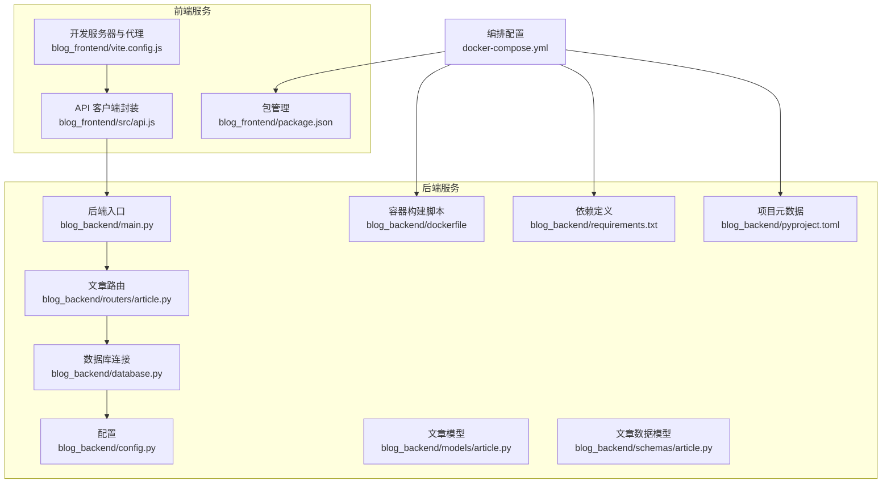
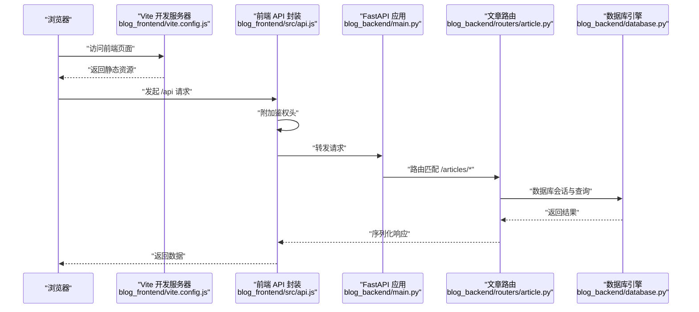
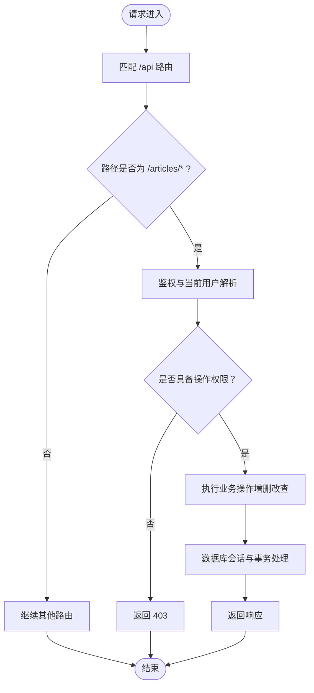
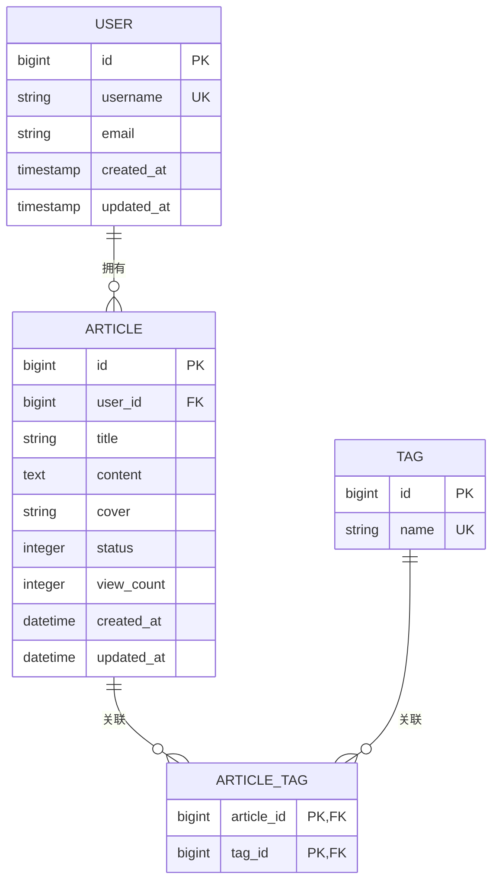
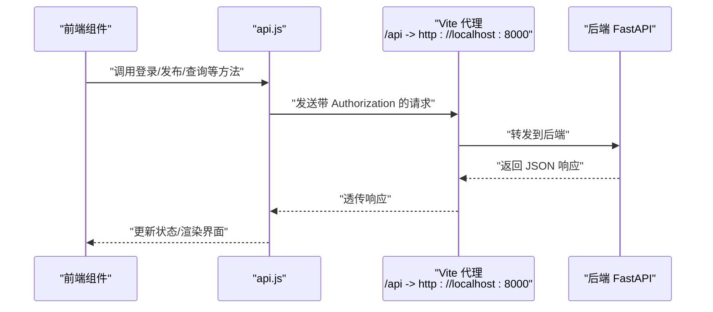
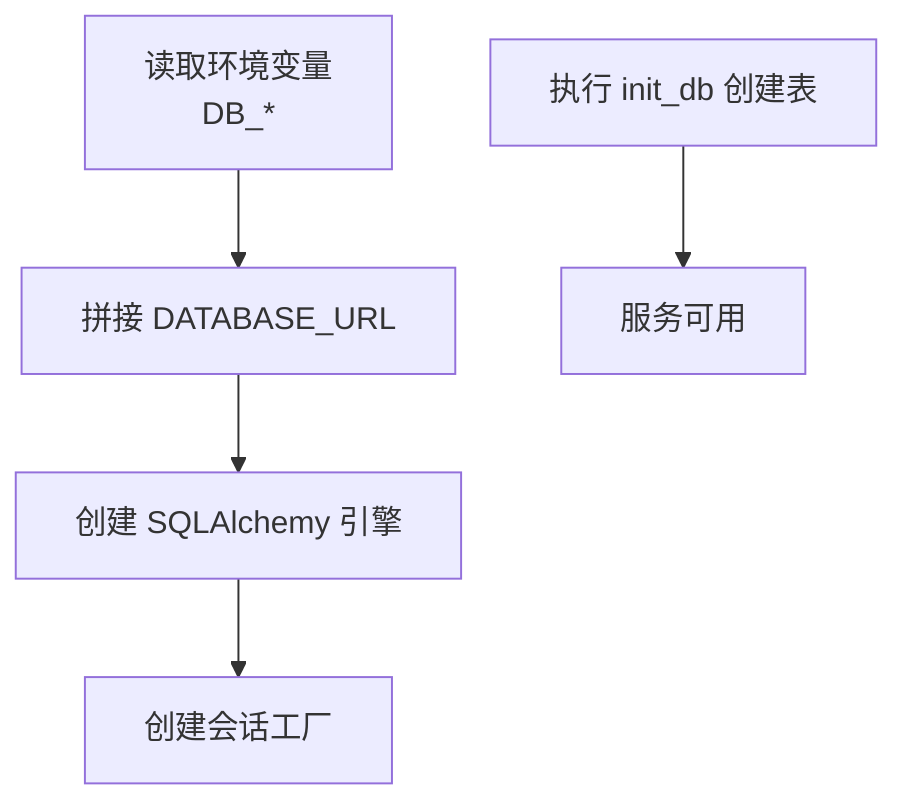
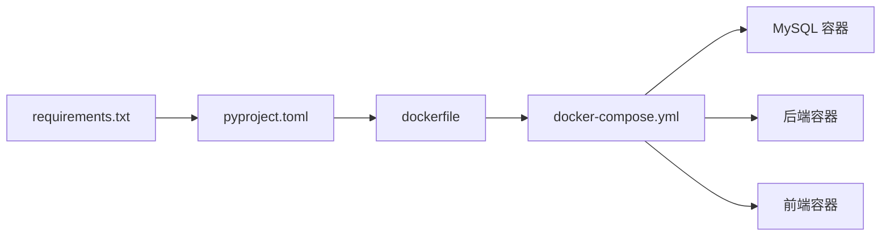

# 开发流程

<cite>
**本文引用的文件**
- [blog_backend/pyproject.toml](file://blog_backend/pyproject.toml)
- [blog_backend/requirements.txt](file://blog_backend/requirements.txt)
- [blog_backend/dockerfile](file://blog_backend/dockerfile)
- [docker-compose.yml](file://docker-compose.yml)
- [blog_backend/main.py](file://blog_backend/main.py)
- [blog_backend/config.py](file://blog_backend/config.py)
- [blog_backend/database.py](file://blog_backend/database.py)
- [blog_backend/init_db.py](file://blog_backend/init_db.py)
- [blog_backend/.gitignore](file://blog_backend/.gitignore)
- [blog_backend/routers/article.py](file://blog_backend/routers/article.py)
- [blog_backend/models/article.py](file://blog_backend/models/article.py)
- [blog_backend/schemas/article.py](file://blog_backend/schemas/article.py)
- [blog_frontend/package.json](file://blog_frontend/package.json)
- [blog_frontend/vite.config.js](file://blog_frontend/vite.config.js)
- [blog_frontend/src/api.js](file://blog_frontend/src/api.js)
</cite>

## 目录
1. [简介](#简介)
2. [项目结构](#项目结构)
3. [核心组件](#核心组件)
4. [架构总览](#架构总览)
5. [详细组件分析](#详细组件分析)
6. [依赖分析](#依赖分析)
7. [性能考虑](#性能考虑)
8. [故障排查指南](#故障排查指南)
9. [结论](#结论)
10. [附录](#附录)

## 简介
本文件面向参与博客项目的开发者，系统化梳理从需求分析到代码提交与发布的全流程规范，覆盖以下主题：
- Git 工作流与分支策略
- 功能开发流程与代码审查
- 本地开发环境配置、数据库初始化与 API 测试
- Pull Request 模板、审查清单与合并策略
- 版本发布、标签与变更日志维护
- 常见开发场景操作指南与最佳实践
- 问题跟踪、任务分配与进度管理建议

## 项目结构
项目采用前后端分离架构，后端基于 FastAPI，前端基于 React/Vite，通过 Docker Compose 统一编排运行。

图表来源
- [blog_backend/main.py:1-13](file://blog_backend/main.py#L1-L13)
- [blog_backend/config.py:1-32](file://blog_backend/config.py#L1-L32)
- [blog_backend/database.py:1-18](file://blog_backend/database.py#L1-L18)
- [blog_backend/routers/article.py:1-85](file://blog_backend/routers/article.py#L1-L85)
- [blog_backend/models/article.py:1-41](file://blog_backend/models/article.py#L1-L41)
- [blog_backend/schemas/article.py:1-10](file://blog_backend/schemas/article.py#L1-L10)
- [blog_backend/dockerfile:1-17](file://blog_backend/dockerfile#L1-L17)
- [blog_backend/requirements.txt:1-14](file://blog_backend/requirements.txt#L1-L14)
- [blog_backend/pyproject.toml:1-22](file://blog_backend/pyproject.toml#L1-L22)
- [blog_frontend/package.json:1-28](file://blog_frontend/package.json#L1-L28)
- [blog_frontend/vite.config.js:1-17](file://blog_frontend/vite.config.js#L1-L17)
- [blog_frontend/src/api.js:1-39](file://blog_frontend/src/api.js#L1-L39)
- [docker-compose.yml:1-41](file://docker-compose.yml#L1-L41)

章节来源
- [blog_backend/main.py:1-13](file://blog_backend/main.py#L1-L13)
- [blog_backend/config.py:1-32](file://blog_backend/config.py#L1-L32)
- [blog_backend/database.py:1-18](file://blog_backend/database.py#L1-L18)
- [blog_backend/routers/article.py:1-85](file://blog_backend/routers/article.py#L1-L85)
- [blog_backend/models/article.py:1-41](file://blog_backend/models/article.py#L1-L41)
- [blog_backend/schemas/article.py:1-10](file://blog_backend/schemas/article.py#L1-L10)
- [blog_backend/dockerfile:1-17](file://blog_backend/dockerfile#L1-L17)
- [blog_backend/requirements.txt:1-14](file://blog_backend/requirements.txt#L1-L14)
- [blog_backend/pyproject.toml:1-22](file://blog_backend/pyproject.toml#L1-L22)
- [blog_frontend/package.json:1-28](file://blog_frontend/package.json#L1-L28)
- [blog_frontend/vite.config.js:1-17](file://blog_frontend/vite.config.js#L1-L17)
- [blog_frontend/src/api.js:1-39](file://blog_frontend/src/api.js#L1-L39)
- [docker-compose.yml:1-41](file://docker-compose.yml#L1-L41)

## 核心组件
- 后端应用入口与路由注册：后端通过入口文件统一注册各模块路由，形成统一的 /api 前缀接口集合。
- 配置与数据库：通过环境变量拼接数据库连接串，支持默认值；数据库会话通过依赖注入提供。
- 文章模块：包含发布、列表、详情、删除、编辑等接口，配合模型与数据校验。
- 前端 API 封装：统一的 axios 实例与拦截器，自动注入鉴权头，集中暴露常用 API 方法。
- 容器化与编排：后端使用多阶段构建，前端通过 Vite 提供开发代理，Compose 统一启动数据库、后端与前端服务。

章节来源
- [blog_backend/main.py:1-13](file://blog_backend/main.py#L1-L13)
- [blog_backend/config.py:1-32](file://blog_backend/config.py#L1-L32)
- [blog_backend/database.py:1-18](file://blog_backend/database.py#L1-L18)
- [blog_backend/routers/article.py:1-85](file://blog_backend/routers/article.py#L1-L85)
- [blog_frontend/src/api.js:1-39](file://blog_frontend/src/api.js#L1-L39)
- [blog_backend/dockerfile:1-17](file://blog_backend/dockerfile#L1-L17)
- [docker-compose.yml:1-41](file://docker-compose.yml#L1-L41)

## 架构总览
下图展示从浏览器到后端接口的典型调用链路，以及数据库层的交互。

图表来源
- [blog_frontend/vite.config.js:1-17](file://blog_frontend/vite.config.js#L1-L17)
- [blog_frontend/src/api.js:1-39](file://blog_frontend/src/api.js#L1-L39)
- [blog_backend/main.py:1-13](file://blog_backend/main.py#L1-L13)
- [blog_backend/routers/article.py:1-85](file://blog_backend/routers/article.py#L1-L85)
- [blog_backend/database.py:1-18](file://blog_backend/database.py#L1-L18)

## 详细组件分析

### 后端应用与路由
- 应用入口负责注册用户、文章、招聘、记账、Boss 等模块路由，统一前缀与标签。
- 文章路由实现发布、列表、详情、删除、编辑等接口，包含鉴权与权限控制。

图表来源
- [blog_backend/main.py:1-13](file://blog_backend/main.py#L1-L13)
- [blog_backend/routers/article.py:1-85](file://blog_backend/routers/article.py#L1-L85)
- [blog_backend/database.py:1-18](file://blog_backend/database.py#L1-L18)

章节来源
- [blog_backend/main.py:1-13](file://blog_backend/main.py#L1-L13)
- [blog_backend/routers/article.py:1-85](file://blog_backend/routers/article.py#L1-L85)

### 数据模型与关系
- 文章与标签为多对多关系，通过中间表维护；文章关联用户，记录创建与更新时间戳。
- 模型定义清晰，便于后续扩展与迁移。

图表来源
- [blog_backend/models/article.py:1-41](file://blog_backend/models/article.py#L1-L41)

章节来源
- [blog_backend/models/article.py:1-41](file://blog_backend/models/article.py#L1-L41)

### 前端 API 与开发代理
- 前端通过 axios 统一封装，自动携带鉴权头；开发服务器通过代理将 /api 请求转发至后端。
- 包管理脚本提供 dev/build/preview 命令，适配本地开发与构建流程。

图表来源
- [blog_frontend/src/api.js:1-39](file://blog_frontend/src/api.js#L1-L39)
- [blog_frontend/vite.config.js:1-17](file://blog_frontend/vite.config.js#L1-L17)

章节来源
- [blog_frontend/src/api.js:1-39](file://blog_frontend/src/api.js#L1-L39)
- [blog_frontend/vite.config.js:1-17](file://blog_frontend/vite.config.js#L1-L17)
- [blog_frontend/package.json:1-28](file://blog_frontend/package.json#L1-L28)

### 数据库初始化与连接
- 通过环境变量拼接数据库 URL，默认值可直接用于本地快速启动。
- 初始化脚本创建所有表，确保首次运行时具备正确 Schema。

图表来源
- [blog_backend/config.py:1-32](file://blog_backend/config.py#L1-L32)
- [blog_backend/database.py:1-18](file://blog_backend/database.py#L1-L18)
- [blog_backend/init_db.py:1-10](file://blog_backend/init_db.py#L1-L10)

章节来源
- [blog_backend/config.py:1-32](file://blog_backend/config.py#L1-L32)
- [blog_backend/database.py:1-18](file://blog_backend/database.py#L1-L18)
- [blog_backend/init_db.py:1-10](file://blog_backend/init_db.py#L1-L10)

## 依赖分析
- 后端依赖通过 requirements.txt 与 pyproject.toml 双重约束，确保一致性与可复现性。
- 容器镜像采用多阶段构建，先安装依赖再复制应用代码，减少镜像体积。
- Compose 将数据库、后端与前端串联，提供一键式本地开发环境。

图表来源
- [blog_backend/requirements.txt:1-14](file://blog_backend/requirements.txt#L1-L14)
- [blog_backend/pyproject.toml:1-22](file://blog_backend/pyproject.toml#L1-L22)
- [blog_backend/dockerfile:1-17](file://blog_backend/dockerfile#L1-L17)
- [docker-compose.yml:1-41](file://docker-compose.yml#L1-L41)

章节来源
- [blog_backend/requirements.txt:1-14](file://blog_backend/requirements.txt#L1-L14)
- [blog_backend/pyproject.toml:1-22](file://blog_backend/pyproject.toml#L1-L22)
- [blog_backend/dockerfile:1-17](file://blog_backend/dockerfile#L1-L17)
- [docker-compose.yml:1-41](file://docker-compose.yml#L1-L41)

## 性能考虑
- 后端接口涉及分页查询，建议在数据库层面建立索引以优化大表查询性能。
- 前端代理仅用于开发环境，生产部署需通过反向代理统一入口与跨域配置。
- 容器镜像构建建议缓存 pip 依赖层，缩短二次构建时间。

## 故障排查指南
- 数据库连接失败：检查环境变量与默认值是否匹配，确认 Compose 中的 DB_* 参数一致。
- CORS 或鉴权问题：确认前端代理目标地址与后端监听地址一致，检查 Authorization 头是否正确注入。
- 接口 403 权限错误：核对当前用户与资源归属关系，确保鉴权流程正常。
- 容器启动异常：查看对应服务日志，确认端口占用与卷挂载路径有效。

章节来源
- [blog_backend/config.py:1-32](file://blog_backend/config.py#L1-L32)
- [blog_frontend/vite.config.js:1-17](file://blog_frontend/vite.config.js#L1-L17)
- [blog_frontend/src/api.js:1-39](file://blog_frontend/src/api.js#L1-L39)
- [docker-compose.yml:1-41](file://docker-compose.yml#L1-L41)

## 结论
本开发流程文档提供了从本地环境搭建、接口开发、测试验证到发布上线的全链路规范。建议团队在实际协作中结合本文档的分支策略、提交规范、审查清单与合并策略，持续完善版本管理与质量保障机制。

## 附录

### Git 工作流与分支策略
- 分支命名规范
  - 功能开发：feature/模块名/简述
  - 修复缺陷：fix/模块名/简述
  - 热修复：hotfix/版本号/简述
  - 文档更新：docs/简述
- 提交信息格式
  - 类型: 模块/简要描述
  - 例如：feat(article): 新增文章分页查询接口
- 合并策略
  - 使用 Squash Merge 合并 PR，保持主干整洁
  - 合并前必须通过 CI 与代码审查

### 功能开发流程（从需求到提交）
- 需求分析：明确接口与数据模型，输出设计说明
- 分支创建：基于 develop 切出功能分支
- 开发与测试：编写路由、模型、Schema，补充单元/集成测试
- 提交与推送：按规范提交，推送远程分支
- 创建 PR：填写模板，触发 CI，等待审查
- 合并与回归：审查通过后合并，进行端到端回归测试

### 代码审查清单
- 代码可读性与注释
- 错误处理与边界条件
- 数据库事务与锁竞争
- 安全性（鉴权、参数校验、敏感信息）
- 性能与可扩展性
- 自动化测试覆盖率

### 本地开发环境配置
- 后端
  - 安装依赖：使用 requirements.txt 或 pyproject.toml
  - 设置环境变量：DB_HOST/DB_PORT/DB_USER/DB_PASSWORD/DB_NAME
  - 初始化数据库：执行初始化脚本创建表
  - 启动服务：Uvicorn 运行入口应用
- 前端
  - 安装依赖：使用 package.json
  - 启动开发服务器：Vite 默认监听 3000（或按配置）
  - 配置代理：将 /api 代理至后端地址

章节来源
- [blog_backend/requirements.txt:1-14](file://blog_backend/requirements.txt#L1-L14)
- [blog_backend/pyproject.toml:1-22](file://blog_backend/pyproject.toml#L1-L22)
- [blog_backend/config.py:1-32](file://blog_backend/config.py#L1-L32)
- [blog_backend/init_db.py:1-10](file://blog_backend/init_db.py#L1-L10)
- [blog_backend/dockerfile:1-17](file://blog_backend/dockerfile#L1-L17)
- [blog_frontend/package.json:1-28](file://blog_frontend/package.json#L1-L28)
- [blog_frontend/vite.config.js:1-17](file://blog_frontend/vite.config.js#L1-L17)

### API 测试方法
- 使用前端页面或 Postman 等工具，调用 /api 下的接口
- 关注鉴权流程与权限控制，确保返回码与数据结构符合预期
- 对分页、搜索、上传等场景进行重点验证

章节来源
- [blog_frontend/src/api.js:1-39](file://blog_frontend/src/api.js#L1-L39)
- [blog_backend/routers/article.py:1-85](file://blog_backend/routers/article.py#L1-L85)

### 版本发布流程、标签与变更日志
- 版本号：遵循语义化版本（主.次.修订），在后端项目元数据中维护
- 标签：发布前在主分支打上 vX.Y.Z 标签
- 变更日志：记录新增、修改、修复与破坏性变更，按模块归类

章节来源
- [blog_backend/pyproject.toml:1-22](file://blog_backend/pyproject.toml#L1-L22)

### 常见开发场景操作指南
- 新增文章接口：在路由层添加新接口，在模型层扩展表结构，补充数据校验
- 修改鉴权逻辑：调整鉴权中间件与依赖注入，确保全局生效
- 数据迁移：通过初始化脚本或迁移工具维护 Schema 变更

章节来源
- [blog_backend/routers/article.py:1-85](file://blog_backend/routers/article.py#L1-L85)
- [blog_backend/models/article.py:1-41](file://blog_backend/models/article.py#L1-L41)
- [blog_backend/schemas/article.py:1-10](file://blog_backend/schemas/article.py#L1-L10)
- [blog_backend/init_db.py:1-10](file://blog_backend/init_db.py#L1-L10)

### 问题跟踪、任务分配与进度管理
- 使用 Issue 模板记录需求与缺陷，明确优先级与截止日期
- 通过分支与 PR 跟踪任务进展，关联相关 Issue
- 团队每日站会同步阻塞点与风险，确保里程碑达成