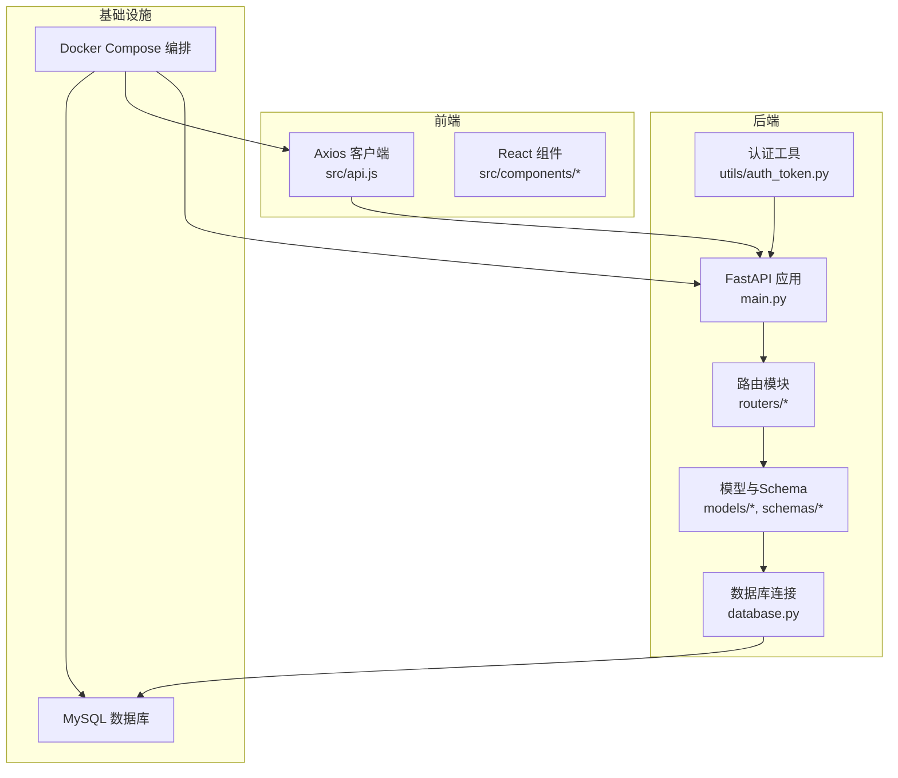
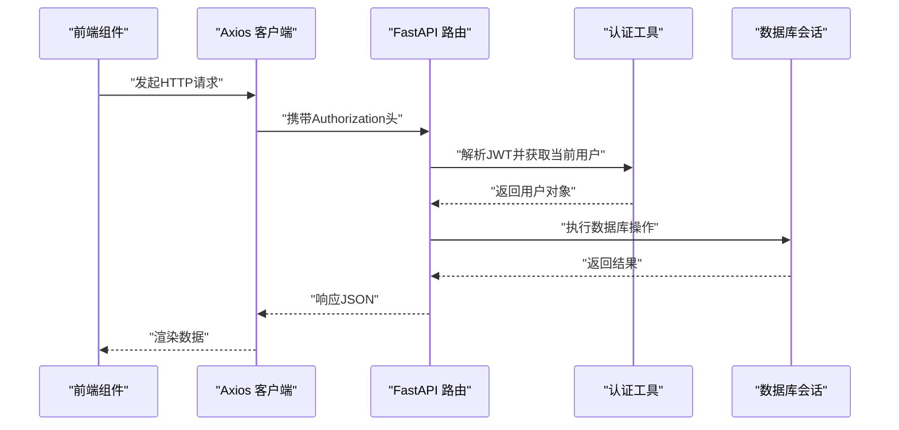
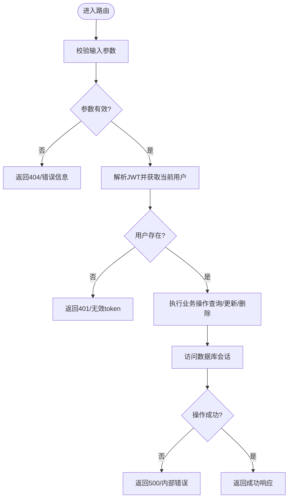
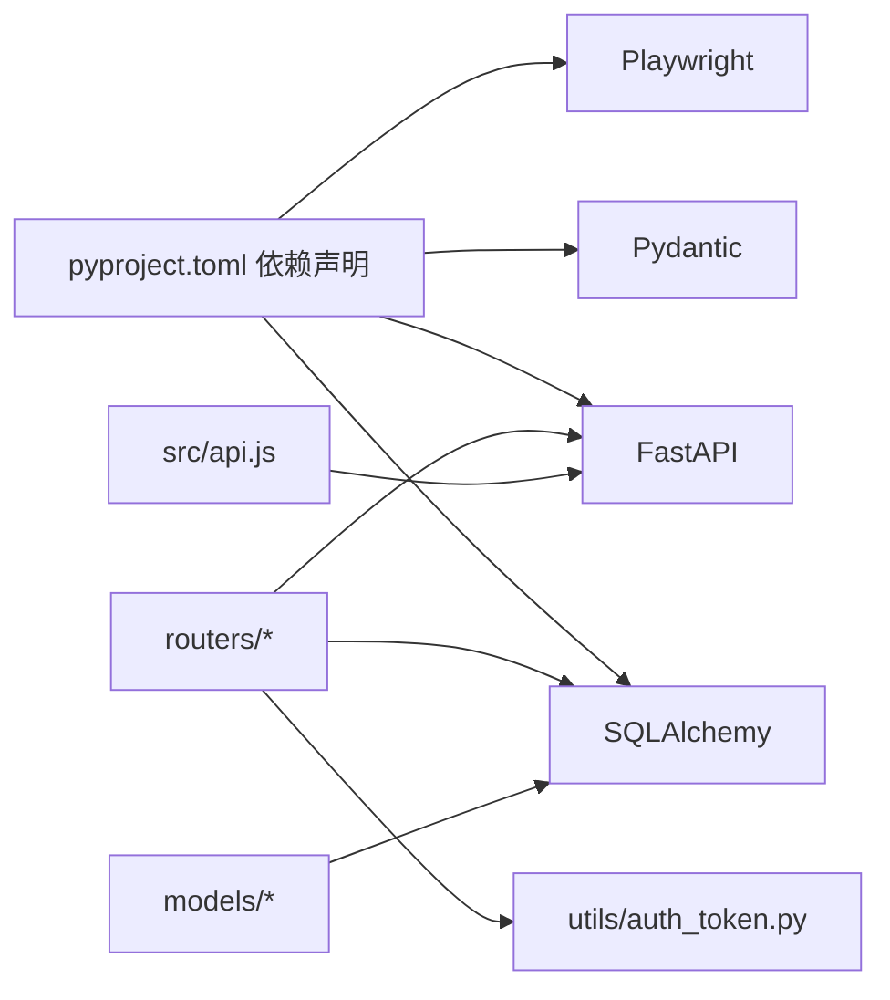

# 测试策略

<cite>
**本文引用的文件**
- [blog_backend/pyproject.toml](file://blog_backend/pyproject.toml)
- [blog_backend/main.py](file://blog_backend/main.py)
- [blog_backend/database.py](file://blog_backend/database.py)
- [blog_backend/models/user.py](file://blog_backend/models/user.py)
- [blog_backend/models/article.py](file://blog_backend/models/article.py)
- [blog_backend/schemas/article.py](file://blog_backend/schemas/article.py)
- [blog_backend/routers/article.py](file://blog_backend/routers/article.py)
- [blog_backend/utils/auth_token.py](file://blog_backend/utils/auth_token.py)
- [blog_backend/utils/test.py](file://blog_backend/utils/test.py)
- [blog_frontend/package.json](file://blog_frontend/package.json)
- [blog_frontend/src/api.js](file://blog_frontend/src/api.js)
- [docker-compose.yml](file://docker-compose.yml)
</cite>

## 目录
1. [引言](#引言)
2. [项目结构](#项目结构)
3. [核心组件](#核心组件)
4. [架构总览](#架构总览)
5. [详细组件分析](#详细组件分析)
6. [依赖分析](#依赖分析)
7. [性能考虑](#性能考虑)
8. [故障排查指南](#故障排查指南)
9. [结论](#结论)
10. [附录](#附录)

## 引言
本测试策略文档面向后端FastAPI服务与前端React应用，系统化阐述单元测试、集成测试与端到端测试的实施方法，覆盖后端API测试、前端组件测试与数据库测试的编写规范；明确测试环境配置、测试数据准备与Mock策略；给出自动化测试流程、持续集成配置建议与测试覆盖率要求；提供测试用例编写指南、断言方法与边界条件处理；并补充性能测试、安全测试与兼容性测试的实施要点，以及测试报告生成与问题追踪流程。

## 项目结构
项目采用前后端分离架构，后端使用FastAPI+SQLAlchemy，前端使用Vite+React，通过Docker Compose编排MySQL、后端与前端服务。测试策略需结合该结构进行分层设计。

图表来源
- [blog_backend/main.py:1-13](file://blog_backend/main.py#L1-L13)
- [blog_backend/routers/article.py:1-85](file://blog_backend/routers/article.py#L1-L85)
- [blog_backend/models/article.py:1-41](file://blog_backend/models/article.py#L1-L41)
- [blog_backend/database.py:1-18](file://blog_backend/database.py#L1-L18)
- [blog_backend/utils/auth_token.py:1-38](file://blog_backend/utils/auth_token.py#L1-L38)
- [blog_frontend/src/api.js:1-39](file://blog_frontend/src/api.js#L1-L39)
- [docker-compose.yml:1-41](file://docker-compose.yml#L1-L41)

章节来源
- [blog_backend/main.py:1-13](file://blog_backend/main.py#L1-L13)
- [docker-compose.yml:1-41](file://docker-compose.yml#L1-L41)

## 核心组件
- 后端应用入口与路由挂载：应用在入口文件中注册用户、文章、招聘、记账、求职等路由，统一前缀为/api，便于集中测试。
- 数据模型与关系：文章与标签多对多关联，用户与文章一对多，便于构造跨表测试场景。
- 认证与授权：基于JWT的OAuth2方案，路由依赖当前用户上下文，测试时需注入有效或无效token以验证鉴权逻辑。
- 前端API封装：统一的Axios实例与拦截器自动注入Authorization头，便于模拟登录态与接口调用。

章节来源
- [blog_backend/main.py:1-13](file://blog_backend/main.py#L1-L13)
- [blog_backend/models/article.py:1-41](file://blog_backend/models/article.py#L1-L41)
- [blog_backend/utils/auth_token.py:1-38](file://blog_backend/utils/auth_token.py#L1-L38)
- [blog_frontend/src/api.js:1-39](file://blog_frontend/src/api.js#L1-L39)

## 架构总览
下图展示测试视角下的关键交互路径：前端通过Axios调用后端API，后端路由处理请求，依赖数据库会话与模型，认证工具解析JWT并注入当前用户。

图表来源
- [blog_frontend/src/api.js:1-39](file://blog_frontend/src/api.js#L1-L39)
- [blog_backend/routers/article.py:1-85](file://blog_backend/routers/article.py#L1-L85)
- [blog_backend/utils/auth_token.py:1-38](file://blog_backend/utils/auth_token.py#L1-L38)
- [blog_backend/database.py:1-18](file://blog_backend/database.py#L1-L18)

## 详细组件分析

### 后端API测试（以文章模块为例）
- 测试目标
  - 验证发布、查询、详情、删除、编辑文章的路由行为与鉴权逻辑。
  - 覆盖分页参数、权限校验、资源不存在等边界条件。
- 测试策略
  - 单元测试：针对路由函数中的业务逻辑（如分页计算、权限判断）进行隔离测试，使用内存数据库或SQLite进行快速验证。
  - 集成测试：通过嵌入式测试客户端调用路由，配合数据库会话依赖，验证端到端流程。
  - Mock策略：对认证工具的JWT解析与用户查询进行Mock，覆盖token无效、用户不存在等异常分支。
- 关键断言点
  - HTTP状态码（如200、404、403）。
  - 响应体字段（如文章列表、总数、总页数、消息提示）。
  - 权限控制（非作者删除/编辑应被拒绝）。
- 边界条件
  - page/size越界、负值、过大值。
  - 用户不存在、文章不存在、token缺失或过期。
- 示例断言路径
  - [文章路由：分页与总数计算:29-43](file://blog_backend/routers/article.py#L29-L43)
  - [文章路由：详情与作者查询:46-53](file://blog_backend/routers/article.py#L46-L53)
  - [文章路由：删除与权限校验:56-68](file://blog_backend/routers/article.py#L56-L68)
  - [文章路由：编辑与权限校验:71-85](file://blog_backend/routers/article.py#L71-L85)

图表来源
- [blog_backend/routers/article.py:1-85](file://blog_backend/routers/article.py#L1-L85)
- [blog_backend/utils/auth_token.py:1-38](file://blog_backend/utils/auth_token.py#L1-L38)
- [blog_backend/database.py:1-18](file://blog_backend/database.py#L1-L18)

章节来源
- [blog_backend/routers/article.py:1-85](file://blog_backend/routers/article.py#L1-L85)
- [blog_backend/utils/auth_token.py:1-38](file://blog_backend/utils/auth_token.py#L1-L38)

### 数据库测试
- 测试目标
  - 验证模型定义、关系映射与CRUD操作。
  - 确保会话生命周期管理正确，避免连接泄漏。
- 测试策略
  - 使用独立测试数据库或内存数据库，确保测试隔离与可重复性。
  - 在每个测试用例前后清理数据，避免副作用。
  - 对多对多关联（文章-标签）进行插入、查询与级联删除测试。
- 关键断言点
  - 主键自增、外键约束、唯一性约束。
  - 关系查询结果数量与字段一致性。
- 示例断言路径
  - [用户模型定义:1-14](file://blog_backend/models/user.py#L1-L14)
  - [文章与标签多对多关系:1-41](file://blog_backend/models/article.py#L1-L41)
  - [数据库会话依赖:1-18](file://blog_backend/database.py#L1-L18)

章节来源
- [blog_backend/models/user.py:1-14](file://blog_backend/models/user.py#L1-L14)
- [blog_backend/models/article.py:1-41](file://blog_backend/models/article.py#L1-L41)
- [blog_backend/database.py:1-18](file://blog_backend/database.py#L1-L18)

### 前端组件测试
- 测试目标
  - 验证组件渲染、用户交互与API调用链路。
  - 确保Axios拦截器正确注入token，接口参数与分页逻辑正确。
- 测试策略
  - 单元测试：对纯函数与无状态组件进行快测，使用Jest与React Testing Library。
  - 集成测试：使用测试客户端模拟后端响应，验证组件在不同数据状态下的表现。
  - Mock策略：对Axios进行Mock，覆盖成功、失败与超时场景。
- 关键断言点
  - 请求头包含Authorization且格式正确。
  - 接口参数（如分页参数）传递正确。
  - 错误提示与加载状态显示。
- 示例断言路径
  - [Axios实例与拦截器:1-39](file://blog_frontend/src/api.js#L1-L39)

章节来源
- [blog_frontend/src/api.js:1-39](file://blog_frontend/src/api.js#L1-L39)

### 认证与授权测试
- 测试目标
  - 验证JWT生成、解析与用户查找逻辑。
  - 覆盖token无效、过期、用户不存在等异常路径。
- 测试策略
  - 生成有效/无效payload，分别验证通过与失败分支。
  - Mock数据库查询，验证用户不存在时的异常抛出。
- 关键断言点
  - 返回用户对象或抛出401异常。
- 示例断言路径
  - [JWT生成与解析:12-17](file://blog_backend/utils/auth_token.py#L12-L17)
  - [当前用户解析:22-37](file://blog_backend/utils/auth_token.py#L22-L37)

章节来源
- [blog_backend/utils/auth_token.py:1-38](file://blog_backend/utils/auth_token.py#L1-L38)

### 端到端测试（Playwright）
- 测试目标
  - 覆盖真实浏览器中的用户旅程（如登录、发布文章、查看列表、删除文章）。
- 测试策略
  - 使用Playwright启动本地服务（或容器），访问前端页面，模拟用户操作。
  - 通过Mock后端或使用测试数据库，确保可重复性与稳定性。
- 关键断言点
  - 页面元素可见性、导航跳转、提交反馈与列表刷新。
- 示例断言路径
  - [Playwright依赖声明](file://blog_backend/pyproject.toml#L13)

章节来源
- [blog_backend/pyproject.toml:13](file://blog_backend/pyproject.toml#L13)

## 依赖分析
- 外部依赖与测试相关的关键包
  - FastAPI：提供路由与依赖注入，便于测试客户端调用。
  - SQLAlchemy：提供ORM与会话管理，测试中需关注连接生命周期。
  - Pydantic：用于Schema校验，测试中需覆盖非法输入。
  - Playwright：用于端到端测试，需配置浏览器与页面交互。
- 内部依赖与测试耦合点
  - 路由依赖数据库会话与认证工具，测试时需替换为可控制的实现。
  - 前端Axios实例依赖后端接口路径与认证头，测试时需Mock网络层。

图表来源
- [blog_backend/pyproject.toml:1-22](file://blog_backend/pyproject.toml#L1-L22)
- [blog_backend/routers/article.py:1-85](file://blog_backend/routers/article.py#L1-L85)
- [blog_backend/utils/auth_token.py:1-38](file://blog_backend/utils/auth_token.py#L1-L38)
- [blog_frontend/src/api.js:1-39](file://blog_frontend/src/api.js#L1-L39)

章节来源
- [blog_backend/pyproject.toml:1-22](file://blog_backend/pyproject.toml#L1-L22)

## 性能考虑
- 单元测试优先：针对热点函数与算法进行基准测试，记录耗时阈值。
- 集成测试限并发：数据库测试避免高并发写入，使用事务回滚或独立测试库。
- 端到端测试降噪：减少页面等待与截图，仅在关键步骤录制视频或截图。
- 资源回收：测试结束后释放数据库连接、关闭浏览器实例。

## 故障排查指南
- 常见问题
  - 认证失败：检查token生成与解析逻辑，确认密钥与算法一致。
  - 数据库连接异常：确认测试数据库可用性与连接字符串。
  - 端到端测试不稳定：检查网络延迟与页面加载时机，增加显式等待。
- 排查步骤
  - 打印请求与响应日志，定位失败环节。
  - 逐步缩小范围：先单测再集成，最后端到端。
  - 使用最小化复现用例，便于回归。

## 结论
本测试策略围绕“分层测试、重点覆盖、可重复执行”的原则，结合项目实际技术栈与架构，构建了从单元到端到端的完整测试体系。建议在CI中强制执行单元与集成测试，并对关键端到端场景进行抽样运行，同时设定覆盖率门槛以保障质量。

## 附录

### 测试环境配置
- 后端
  - 使用独立测试数据库或内存数据库，确保隔离性。
  - 通过环境变量切换数据库URL，便于在CI中注入测试库地址。
- 前端
  - 使用代理将/api转发至本地后端服务，或在测试中Mock所有API。
- 基础设施
  - 使用Docker Compose启动MySQL与后端服务，前端在本地开发模式运行。

章节来源
- [docker-compose.yml:1-41](file://docker-compose.yml#L1-L41)

### 测试数据准备与Mock策略
- 测试数据
  - 使用工厂函数或固定种子数据，确保可预测性。
  - 对多对多关系（文章-标签）构造关联数据集。
- Mock策略
  - 对认证工具：MockJWT解析与用户查询，覆盖无效token与用户不存在。
  - 对Axios：Mock请求返回，覆盖2xx/4xx/5xx与超时场景。
  - 对外部服务：对爬虫与第三方API进行Mock，避免依赖真实网络。

### 自动化测试流程与持续集成
- CI建议
  - 触发条件：push到主分支或合并请求。
  - 步骤：安装依赖、启动测试数据库、运行单元与集成测试、收集覆盖率、运行端到端测试（按需）、生成报告。
  - 覆盖率门槛：语句覆盖率≥80%，分支覆盖率≥70%，函数与行覆盖率≥85%。
- 报告与追踪
  - 生成HTML/Cobertura覆盖率报告，上传至CI制品。
  - 将失败用例与日志归档，建立问题追踪工单并指派责任人。

### 测试用例编写指南
- 断言方法
  - 明确期望状态码与响应体字段。
  - 对时间戳、ID等动态字段使用宽松断言或忽略。
- 边界条件
  - 分页：page=1、page>总页数、size=1、size过大。
  - 权限：非作者本人操作、未登录访问受保护资源。
  - 输入：空值、超长字符串、特殊字符、非法类型。
- Schema校验
  - 使用Pydantic模型进行输入校验，覆盖必填字段与默认值。

### 性能测试、安全测试与兼容性测试
- 性能测试
  - 使用压力测试工具对高频接口（如文章列表）进行QPS与延迟评估。
- 安全测试
  - 验证JWT签名与过期机制，防止重放与越权。
  - 对SQL注入与XSS进行基础扫描与手工验证。
- 兼容性测试
  - 前端在主流浏览器中验证功能与样式一致性。
  - 后端在不同Python版本与依赖版本组合下验证兼容性。