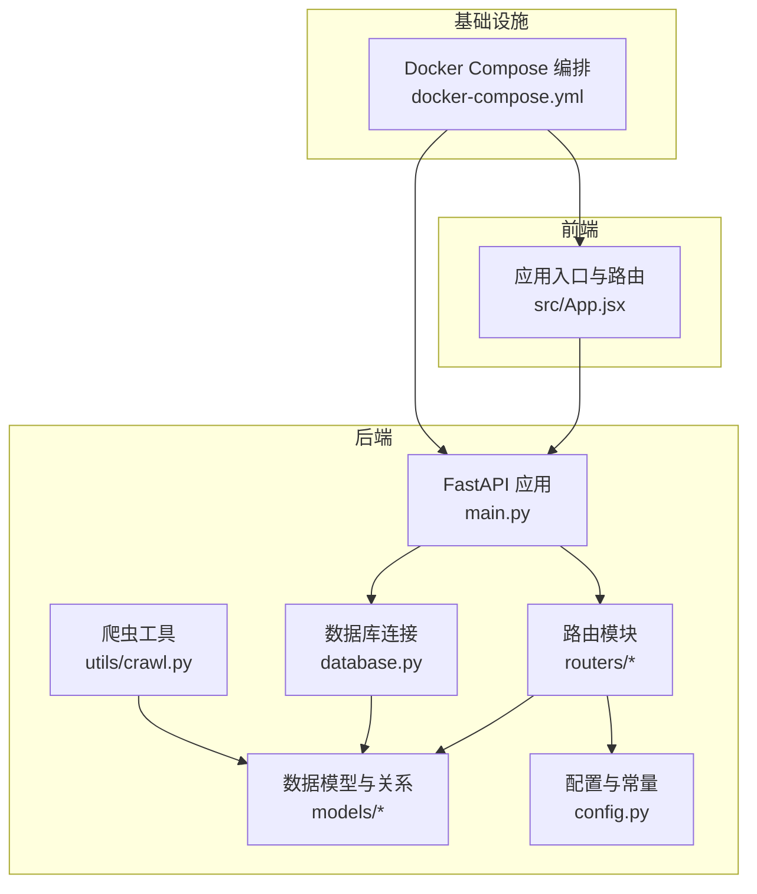
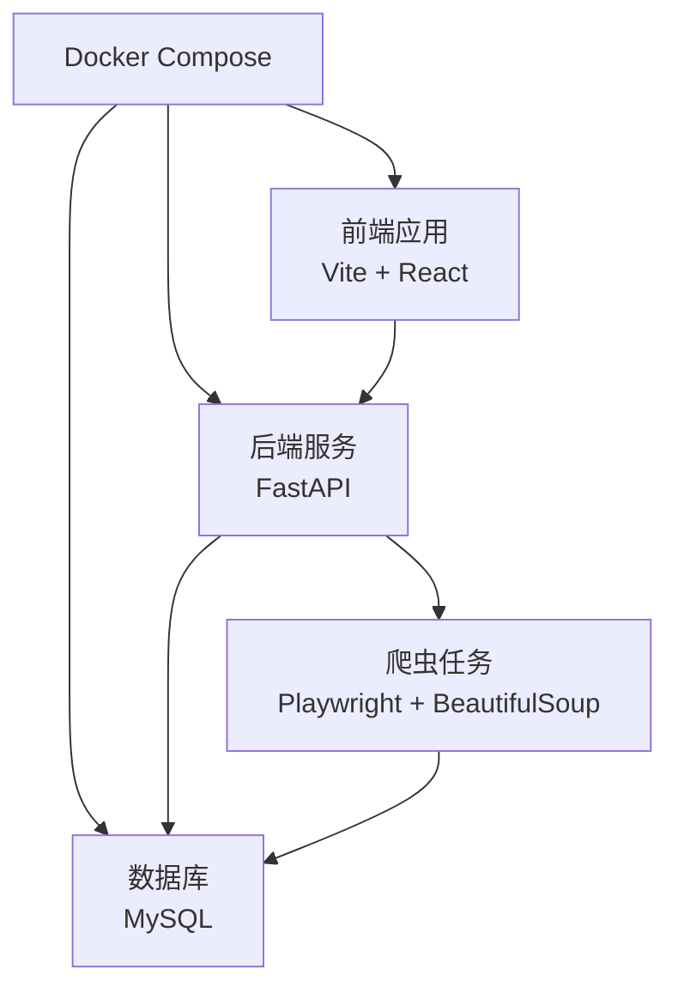
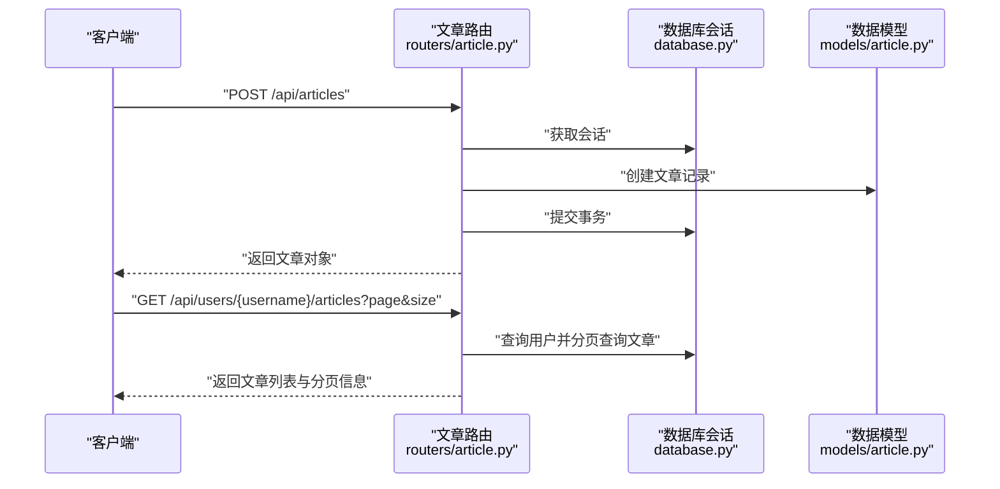
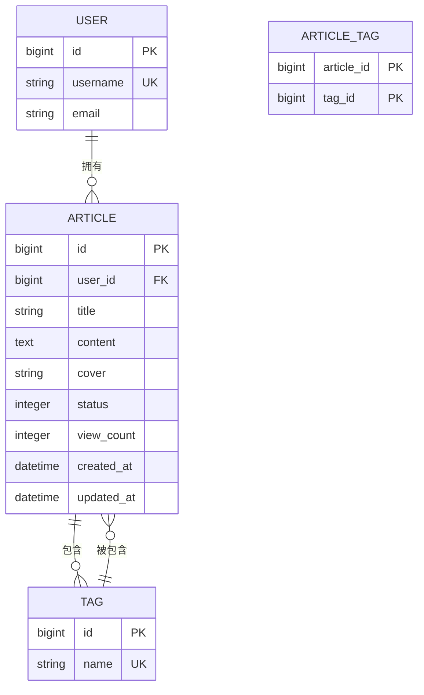
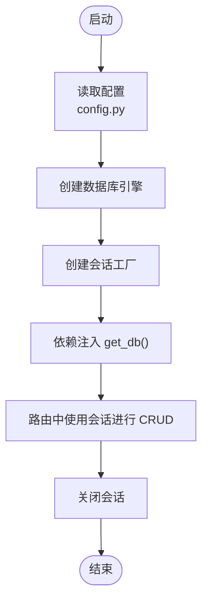
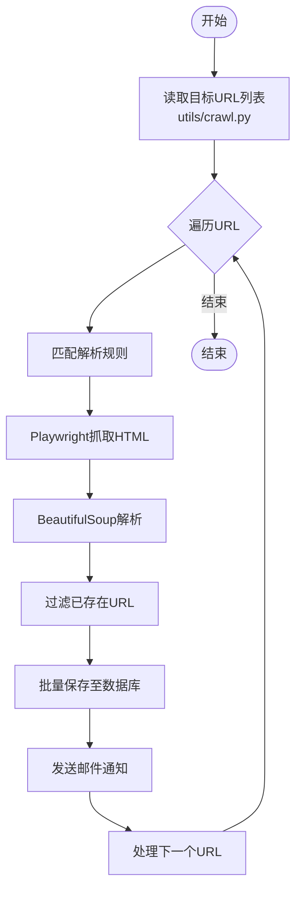
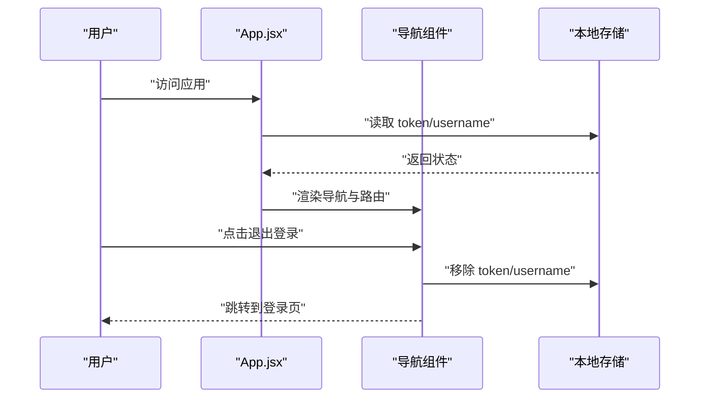
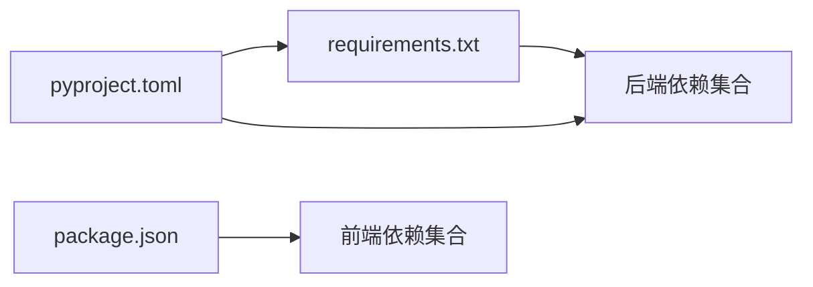

# 贡献指南

<cite>
**本文引用的文件**
- [docker-compose.yml](file://docker-compose.yml)
- [blog_backend/pyproject.toml](file://blog_backend/pyproject.toml)
- [blog_backend/requirements.txt](file://blog_backend/requirements.txt)
- [blog_frontend/package.json](file://blog_frontend/package.json)
- [blog_backend/main.py](file://blog_backend/main.py)
- [blog_backend/config.py](file://blog_backend/config.py)
- [blog_backend/database.py](file://blog_backend/database.py)
- [blog_backend/routers/article.py](file://blog_backend/routers/article.py)
- [blog_backend/schemas/article.py](file://blog_backend/schemas/article.py)
- [blog_backend/models/article.py](file://blog_backend/models/article.py)
- [blog_backend/utils/crawl.py](file://blog_backend/utils/crawl.py)
- [blog_frontend/src/App.jsx](file://blog_frontend/src/App.jsx)
</cite>

## 目录
1. [简介](#简介)
2. [项目结构](#项目结构)
3. [核心组件](#核心组件)
4. [架构总览](#架构总览)
5. [详细组件分析](#详细组件分析)
6. [依赖分析](#依赖分析)
7. [性能与可维护性建议](#性能与可维护性建议)
8. [故障排查指南](#故障排查指南)
9. [贡献流程与模板](#贡献流程与模板)
10. [开发环境搭建与本地测试](#开发环境搭建与本地测试)
11. [代码贡献规范](#代码贡献规范)
12. [文档更新与版本兼容性](#文档更新与版本兼容性)
13. [社区与协作](#社区与协作)
14. [结论](#结论)

## 简介
本指南面向希望参与本项目的外部开发者，提供从环境搭建、开发流程、代码规范到社区协作的完整指引。项目采用前后端分离架构：后端基于 Python 的 FastAPI 框架，前端基于 React/Vite。通过 Docker Compose 可一键拉起数据库、后端服务与前端服务，便于本地快速验证。

## 项目结构
- 后端（Python/FastAPI）：负责 API 路由、数据模型、数据库连接与业务逻辑；包含爬虫工具用于招聘信息采集。
- 前端（React/Vite）：负责用户界面与路由导航，与后端 API 协同工作。
- 共享资源：Docker Compose 统一编排后端、数据库与前端；依赖清单在各自工程内管理。

图表来源
- [blog_backend/main.py:1-13](file://blog_backend/main.py#L1-L13)
- [blog_backend/routers/article.py:1-85](file://blog_backend/routers/article.py#L1-L85)
- [blog_backend/models/article.py:1-41](file://blog_backend/models/article.py#L1-L41)
- [blog_backend/database.py:1-18](file://blog_backend/database.py#L1-L18)
- [blog_backend/config.py:1-32](file://blog_backend/config.py#L1-L32)
- [blog_backend/utils/crawl.py:1-445](file://blog_backend/utils/crawl.py#L1-L445)
- [blog_frontend/src/App.jsx:1-79](file://blog_frontend/src/App.jsx#L1-L79)
- [docker-compose.yml:1-41](file://docker-compose.yml#L1-L41)

章节来源
- [docker-compose.yml:1-41](file://docker-compose.yml#L1-L41)
- [blog_backend/main.py:1-13](file://blog_backend/main.py#L1-L13)
- [blog_frontend/src/App.jsx:1-79](file://blog_frontend/src/App.jsx#L1-L79)

## 核心组件
- 应用入口与路由挂载：后端应用在入口处集中挂载各模块路由，统一前缀与标签，便于 API 聚合与文档生成。
- 数据模型与关系：文章与标签为多对多关联，通过中间表实现；用户与文章为一对多。
- 数据库连接：通过 SQLAlchemy 创建引擎与会话，提供依赖注入以供路由使用。
- 配置中心：集中存放数据库连接串、密钥算法、爬虫基础地址与目标文件等。
- 爬虫工具：基于 Playwright 渲染页面、BeautifulSoup 解析，按规则匹配不同站点板块，过滤重复并入库，支持邮件通知。
- 前端路由：基于 React Router DOM 实现导航与页面切换，本地存储令牌与用户名控制登录态。

章节来源
- [blog_backend/main.py:1-13](file://blog_backend/main.py#L1-L13)
- [blog_backend/models/article.py:1-41](file://blog_backend/models/article.py#L1-L41)
- [blog_backend/database.py:1-18](file://blog_backend/database.py#L1-L18)
- [blog_backend/config.py:1-32](file://blog_backend/config.py#L1-L32)
- [blog_backend/utils/crawl.py:1-445](file://blog_backend/utils/crawl.py#L1-L445)
- [blog_frontend/src/App.jsx:1-79](file://blog_frontend/src/App.jsx#L1-L79)

## 架构总览
下图展示后端服务、数据库与前端之间的交互关系，以及 Docker Compose 的编排顺序与依赖。

图表来源
- [docker-compose.yml:1-41](file://docker-compose.yml#L1-L41)
- [blog_backend/main.py:1-13](file://blog_backend/main.py#L1-L13)
- [blog_backend/database.py:1-18](file://blog_backend/database.py#L1-L18)
- [blog_backend/utils/crawl.py:1-445](file://blog_backend/utils/crawl.py#L1-L445)

## 详细组件分析

### 后端应用与路由
- 应用入口集中挂载用户、文章、招聘、记账、求职相关路由，统一前缀与标签，便于 API 文档聚合。
- 文章路由提供发布、分页查询、详情查看、删除与编辑接口，均通过数据库会话与当前用户鉴权依赖完成。

图表来源
- [blog_backend/routers/article.py:1-85](file://blog_backend/routers/article.py#L1-L85)
- [blog_backend/database.py:1-18](file://blog_backend/database.py#L1-L18)
- [blog_backend/models/article.py:1-41](file://blog_backend/models/article.py#L1-L41)

章节来源
- [blog_backend/main.py:1-13](file://blog_backend/main.py#L1-L13)
- [blog_backend/routers/article.py:1-85](file://blog_backend/routers/article.py#L1-L85)
- [blog_backend/models/article.py:1-41](file://blog_backend/models/article.py#L1-L41)

### 数据模型与关系
- 文章与标签为多对多，通过中间表关联；文章与用户为一对多。
- 模型定义清晰表达字段约束与默认值，便于后续扩展与迁移。

图表来源
- [blog_backend/models/article.py:1-41](file://blog_backend/models/article.py#L1-L41)

章节来源
- [blog_backend/models/article.py:1-41](file://blog_backend/models/article.py#L1-L41)

### 数据库连接与依赖
- 使用 SQLAlchemy 创建引擎与会话工厂，提供依赖注入函数以在路由层获取会话。
- 通过配置读取数据库连接参数，支持环境变量覆盖。

图表来源
- [blog_backend/database.py:1-18](file://blog_backend/database.py#L1-L18)
- [blog_backend/config.py:1-32](file://blog_backend/config.py#L1-L32)

章节来源
- [blog_backend/database.py:1-18](file://blog_backend/database.py#L1-L18)
- [blog_backend/config.py:1-32](file://blog_backend/config.py#L1-L32)

### 爬虫工具与数据采集
- 支持多种站点板块解析，基于 Playwright 渲染页面，BeautifulSoup 提取结构化数据。
- 通过规则映射 URL 与解析器，过滤重复 URL 并入库，支持邮件通知。

图表来源
- [blog_backend/utils/crawl.py:1-445](file://blog_backend/utils/crawl.py#L1-L445)

章节来源
- [blog_backend/utils/crawl.py:1-445](file://blog_backend/utils/crawl.py#L1-L445)

### 前端路由与登录态
- 基于 React Router DOM 实现导航与页面切换，本地存储令牌与用户名控制登录态。
- 登出时清理本地存储并跳转登录页。

图表来源
- [blog_frontend/src/App.jsx:1-79](file://blog_frontend/src/App.jsx#L1-L79)

章节来源
- [blog_frontend/src/App.jsx:1-79](file://blog_frontend/src/App.jsx#L1-L79)

## 依赖分析
- 后端依赖：FastAPI、SQLAlchemy、PyMySQL、Redis、OpenAI、Requests、Uvicorn、BeautifulSoup、Playwright、Passlib、Python-Jose 等。
- 前端依赖：React、React DOM、React Router DOM、Axios、ECharts、React Markdown 等。
- 依赖来源：后端使用 pyproject.toml 与 requirements.txt；前端使用 package.json。

图表来源
- [blog_backend/pyproject.toml:1-22](file://blog_backend/pyproject.toml#L1-L22)
- [blog_backend/requirements.txt:1-14](file://blog_backend/requirements.txt#L1-L14)
- [blog_frontend/package.json:1-28](file://blog_frontend/package.json#L1-L28)

章节来源
- [blog_backend/pyproject.toml:1-22](file://blog_backend/pyproject.toml#L1-L22)
- [blog_backend/requirements.txt:1-14](file://blog_backend/requirements.txt#L1-L14)
- [blog_frontend/package.json:1-28](file://blog_frontend/package.json#L1-L28)

## 性能与可维护性建议
- 数据库连接与事务：确保在路由层正确使用依赖注入的会话，避免长事务与未释放连接。
- 爬虫稳定性：Playwright 渲染与 BeautifulSoup 解析应设置合理超时与异常处理，避免单条 URL 导致整体任务中断。
- 前端路由：保持路由简洁与组件拆分，减少不必要的重渲染。
- 依赖升级：定期检查后端与前端依赖的安全与兼容性，优先使用稳定版本。

[本节为通用建议，不直接分析具体文件]

## 故障排查指南
- 数据库连接失败：检查环境变量与配置文件中的数据库连接串，确认容器网络与端口映射。
- 爬虫无法解析：确认目标 URL 是否匹配规则关键字，检查等待选择器是否正确，必要时调整解析器。
- 前端无法访问后端：确认前端代理或跨域配置，检查后端服务端口与容器暴露端口映射。

章节来源
- [blog_backend/config.py:1-32](file://blog_backend/config.py#L1-L32)
- [blog_backend/utils/crawl.py:1-445](file://blog_backend/utils/crawl.py#L1-L445)
- [docker-compose.yml:1-41](file://docker-compose.yml#L1-L41)

## 贡献流程与模板
以下为建议的贡献流程与模板，便于规范化 Issue 与 PR 的提交与评审。

- 报告 Bug
  - 在提交前先搜索现有 Issue，避免重复。
  - 提供：环境信息（操作系统、Python 版本、浏览器版本）、复现步骤、期望行为与实际行为、日志或截图。
  - 使用模板字段：标题、环境、复现步骤、预期/实际、附加信息。

- 提交功能请求
  - 描述背景与动机、期望功能、收益与影响范围。
  - 如涉及后端 API，提供接口设计草稿（路径、方法、请求/响应结构）。
  - 如涉及前端 UI，提供页面/组件草图与交互说明。

- 提交代码贡献
  - 分支策略：从主分支切出功能分支，命名如 feature/xxx 或 fix/xxx。
  - 提交信息：简要描述 + 详细说明 + 关联 Issue 编号。
  - 代码审查：至少一名维护者同意后合并；确保 CI 通过与文档更新。

- PR 模板要点
  - 摘要、变更点、测试方案、兼容性影响、升级指引（如有）。

- Issue/PR 模板字段建议
  - 标题、类型（Bug/功能/文档/其他）、优先级、影响范围、复现步骤、截图/日志、相关链接。

[本节为流程与模板建议，不直接分析具体文件]

## 开发环境搭建与本地测试
- 环境准备
  - 安装 Docker 与 Docker Compose，确保端口未被占用。
  - 后端：Python 3.9+，安装依赖（推荐使用 requirements.txt 或 pyproject.toml）。
  - 前端：Node.js 与 npm，安装依赖（package.json）。

- 一键启动
  - 使用 Docker Compose 启动数据库、后端与前端服务，确认端口映射与容器健康状态。
  - 默认端口：前端 80、后端 8001、数据库 3306。

- 本地验证
  - 前端：访问 http://localhost，注册/登录后尝试发布文章、查看列表与详情。
  - 后端：访问 http://localhost/api/docs 查看 API 文档，调用文章相关接口。
  - 爬虫：准备 targets.txt，运行爬虫脚本，检查数据库中新增记录与邮件通知（如启用）。

章节来源
- [docker-compose.yml:1-41](file://docker-compose.yml#L1-L41)
- [blog_backend/requirements.txt:1-14](file://blog_backend/requirements.txt#L1-L14)
- [blog_backend/pyproject.toml:1-22](file://blog_backend/pyproject.toml#L1-L22)
- [blog_frontend/package.json:1-28](file://blog_frontend/package.json#L1-L28)

## 代码贡献规范
- 代码风格
  - Python：遵循 PEP 8，使用格式化工具（如 ruff/black）与静态检查（如 ruff/linter）。
  - JavaScript/TypeScript：遵循项目既有风格，使用 ESLint/Prettier。
- 注释与文档
  - 函数/类需有清晰注释；复杂流程补充说明；对外接口完善文档。
- 测试
  - 后端：为新增路由与模型编写单元测试，覆盖关键分支与异常路径。
  - 前端：为关键组件与路由编写单元测试，覆盖主要交互。
- 提交流程
  - 提交前自测，确保通过 Lint 与测试；提交信息清晰；附带变更说明与测试方案。

[本节为通用规范，不直接分析具体文件]

## 文档更新与版本兼容性
- 文档更新
  - 新增/修改接口：同步更新 API 文档与贡献指南。
  - 配置变更：更新环境变量与部署说明。
- 版本兼容性
  - 依赖升级需评估破坏性变更；提供迁移指南与回滚方案。
  - 后端版本与前端版本需保持兼容，避免引入不兼容的依赖。

[本节为通用建议，不直接分析具体文件]

## 社区与协作
- 行为准则
  - 尊重与包容，禁止骚扰与歧视；保持建设性沟通。
- 沟通渠道
  - 使用 GitHub Issues/PR 进行技术讨论；必要时建立即时沟通群组。
- 协作方式
  - 新贡献者：从简单 Issue 入手，逐步承担更复杂任务。
  - 导师制度：为新贡献者指派导师，协助熟悉代码与流程。
- 维护者职责
  - 代码审查、问题分类与优先级管理、发布与版本治理。
- 决策流程
  - 重大变更通过讨论与投票决定；记录决策过程与依据。

[本节为通用建议，不直接分析具体文件]

## 结论
本指南提供了从环境搭建到贡献流程、从代码规范到社区协作的完整路径。建议新贡献者从 Issue 与文档入手，逐步参与测试与小修复，再承担更复杂的功能开发。维护者应持续优化流程与工具，提升协作效率与代码质量。