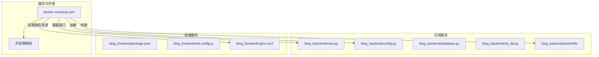
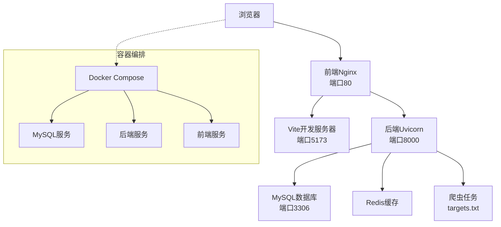
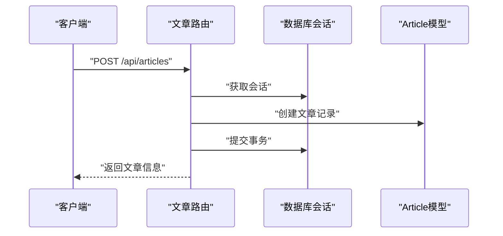
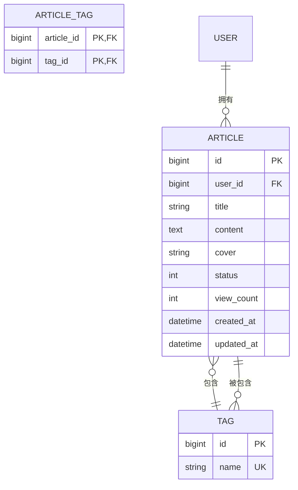
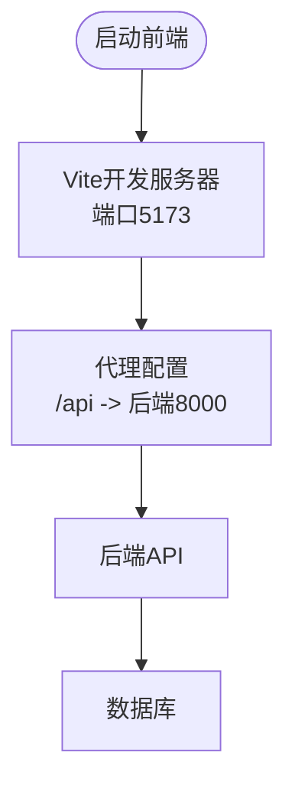
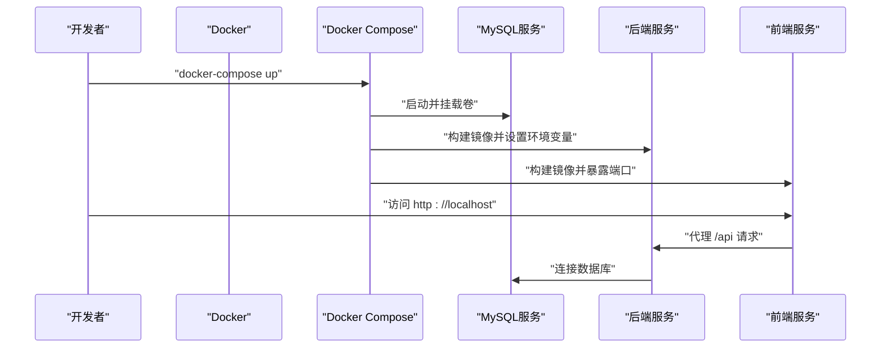
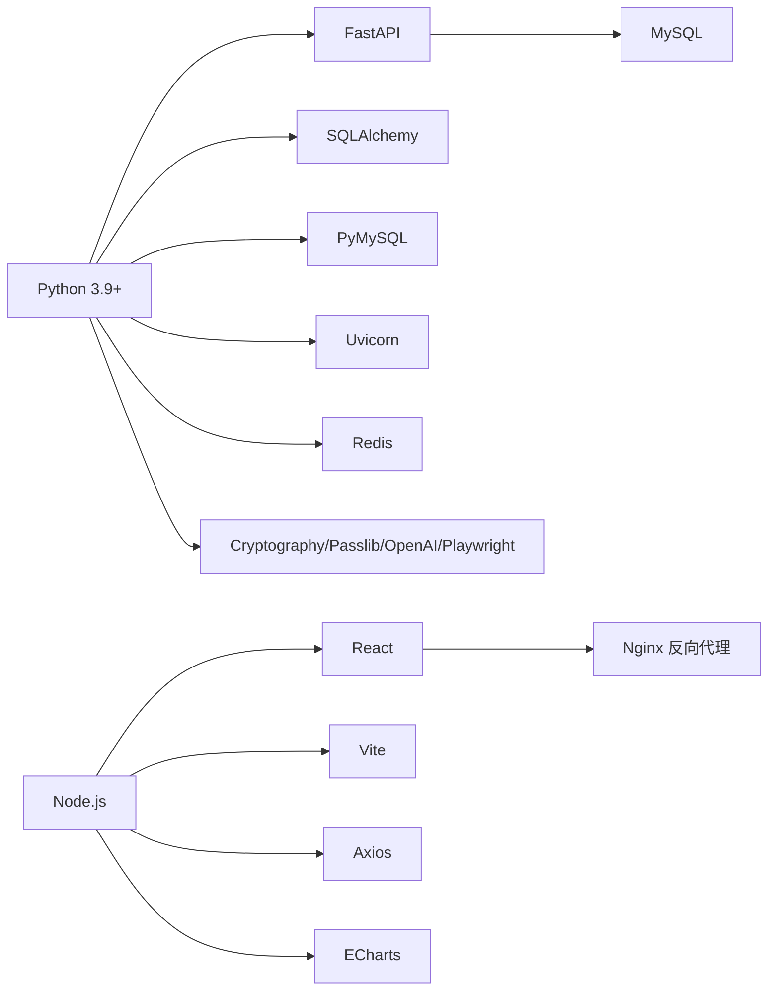

# 快速开始

<cite>
**本文引用的文件**
- [blog_backend/main.py](file://blog_backend/main.py)
- [blog_backend/config.py](file://blog_backend/config.py)
- [blog_backend/database.py](file://blog_backend/database.py)
- [blog_backend/init_db.py](file://blog_backend/init_db.py)
- [blog_backend/dockerfile](file://blog_backend/dockerfile)
- [blog_backend/pyproject.toml](file://blog_backend/pyproject.toml)
- [blog_backend/requirements.txt](file://blog_backend/requirements.txt)
- [blog_backend/default.conf](file://blog_backend/default.conf)
- [blog_backend/models/article.py](file://blog_backend/models/article.py)
- [blog_backend/routers/article.py](file://blog_backend/routers/article.py)
- [blog_backend/targets.txt](file://blog_backend/targets.txt)
- [blog_backend/.claude/settings.local.json](file://blog_backend/.claude/settings.local.json)
- [blog_frontend/package.json](file://blog_frontend/package.json)
- [blog_frontend/vite.config.js](file://blog_frontend/vite.config.js)
- [blog_frontend/nginx.conf](file://blog_frontend/nginx.conf)
- [docker-compose.yml](file://docker-compose.yml)
</cite>

## 目录
1. [简介](#简介)
2. [项目结构](#项目结构)
3. [核心组件](#核心组件)
4. [架构总览](#架构总览)
5. [详细组件分析](#详细组件分析)
6. [依赖分析](#依赖分析)
7. [性能考虑](#性能考虑)
8. [故障排除指南](#故障排除指南)
9. [结论](#结论)
10. [附录](#附录)

## 简介
本指南面向首次接触本博客项目的开发者，目标是在30分钟内完成从环境准备到本地运行再到容器化部署的全流程。内容覆盖：
- 环境要求与工具链（Python 3.9+、Node.js、Docker、Docker Compose）
- 后端与前端依赖安装
- 数据库配置与初始化
- 本地开发运行（后端API、前端Vite、数据库）
- Docker容器化部署（镜像构建与编排）
- 常见问题与故障排除
- 实际命令行示例与配置文件模板路径

## 项目结构
项目采用前后端分离架构，后端基于FastAPI，前端基于React/Vite，数据库为MySQL，通过Docker Compose进行统一编排。

**图表来源**
- [docker-compose.yml:1-41](file://docker-compose.yml#L1-L41)
- [blog_backend/dockerfile:1-17](file://blog_backend/dockerfile#L1-L17)
- [blog_backend/main.py:1-13](file://blog_backend/main.py#L1-L13)
- [blog_backend/config.py:1-32](file://blog_backend/config.py#L1-L32)
- [blog_frontend/nginx.conf:1-26](file://blog_frontend/nginx.conf#L1-L26)

**章节来源**
- [docker-compose.yml:1-41](file://docker-compose.yml#L1-L41)
- [blog_backend/dockerfile:1-17](file://blog_backend/dockerfile#L1-L17)
- [blog_frontend/nginx.conf:1-26](file://blog_frontend/nginx.conf#L1-L26)

## 核心组件
- 后端API入口与路由挂载：在应用入口集中注册用户、文章、招聘、记账、求职等模块路由，统一前缀与标签。
- 配置管理：数据库连接串、密钥算法、爬虫基础地址、邮件配置等。
- 数据库层：SQLAlchemy引擎、会话工厂、基础模型基类与依赖注入。
- 数据库初始化：一键创建所有模型对应的表。
- 前端开发服务器：Vite代理后端API，支持热更新；生产环境由Nginx提供静态资源与反向代理。
- 容器编排：MySQL、后端服务、前端服务三者协同，持久化数据卷。

**章节来源**
- [blog_backend/main.py:1-13](file://blog_backend/main.py#L1-L13)
- [blog_backend/config.py:1-32](file://blog_backend/config.py#L1-L32)
- [blog_backend/database.py:1-18](file://blog_backend/database.py#L1-L18)
- [blog_backend/init_db.py:1-10](file://blog_backend/init_db.py#L1-L10)
- [blog_frontend/vite.config.js:1-17](file://blog_frontend/vite.config.js#L1-L17)
- [blog_frontend/nginx.conf:1-26](file://blog_frontend/nginx.conf#L1-L26)

## 架构总览
下图展示从浏览器到后端API、数据库以及爬虫任务的整体交互路径。

**图表来源**
- [docker-compose.yml:1-41](file://docker-compose.yml#L1-L41)
- [blog_frontend/nginx.conf:1-26](file://blog_frontend/nginx.conf#L1-L26)
- [blog_backend/default.conf:1-27](file://blog_backend/default.conf#L1-L27)
- [blog_backend/targets.txt:1-5](file://blog_backend/targets.txt#L1-L5)

## 详细组件分析

### 后端API服务（FastAPI）
- 应用入口负责注册路由模块，统一前缀“/api”，便于前端统一代理。
- 路由示例：文章发布、列表分页、详情查询、删除与编辑均通过依赖注入的数据库会话完成。
- 数据库连接：通过环境变量拼接连接串，支持主机、端口、用户名、密码、数据库名自定义。
- 初始化脚本：创建所有模型对应的数据表。

**图表来源**
- [blog_backend/routers/article.py:11-25](file://blog_backend/routers/article.py#L11-L25)
- [blog_backend/database.py:12-18](file://blog_backend/database.py#L12-L18)
- [blog_backend/models/article.py:15-31](file://blog_backend/models/article.py#L15-L31)

**章节来源**
- [blog_backend/main.py:1-13](file://blog_backend/main.py#L1-L13)
- [blog_backend/routers/article.py:1-85](file://blog_backend/routers/article.py#L1-L85)
- [blog_backend/config.py:1-32](file://blog_backend/config.py#L1-L32)
- [blog_backend/database.py:1-18](file://blog_backend/database.py#L1-L18)
- [blog_backend/init_db.py:1-10](file://blog_backend/init_db.py#L1-L10)

### 数据库模型与关系
- 使用SQLAlchemy声明式模型，定义文章与标签的多对多关联表。
- 文章模型包含标题、内容、封面、状态、浏览量及时间戳字段。
- 标签模型包含唯一名称字段，并与文章建立双向关系。

**图表来源**
- [blog_backend/models/article.py:7-41](file://blog_backend/models/article.py#L7-L41)

**章节来源**
- [blog_backend/models/article.py:1-41](file://blog_backend/models/article.py#L1-L41)

### 前端开发与代理
- 开发服务器：Vite默认监听可被局域网访问的地址，并通过代理将“/api”请求转发至后端Uvicorn。
- 生产环境：Nginx提供静态资源服务，并将“/api”代理到后端容器地址。
- 包管理：前端依赖React、React Router、Axios、Markdown渲染等。

**图表来源**
- [blog_frontend/vite.config.js:7-15](file://blog_frontend/vite.config.js#L7-L15)
- [blog_frontend/nginx.conf:12-19](file://blog_frontend/nginx.conf#L12-L19)

**章节来源**
- [blog_frontend/package.json:1-28](file://blog_frontend/package.json#L1-L28)
- [blog_frontend/vite.config.js:1-17](file://blog_frontend/vite.config.js#L1-L17)
- [blog_frontend/nginx.conf:1-26](file://blog_frontend/nginx.conf#L1-L26)

### 容器化与编排
- 后端镜像：基于Python 3.11镜像，复制依赖并安装，最终以Uvicorn运行FastAPI应用。
- 编排服务：MySQL、后端、前端三服务，端口映射与环境变量配置明确。
- 外部卷：持久化MySQL数据目录。

**图表来源**
- [blog_backend/dockerfile:1-17](file://blog_backend/dockerfile#L1-L17)
- [docker-compose.yml:1-41](file://docker-compose.yml#L1-L41)

**章节来源**
- [blog_backend/dockerfile:1-17](file://blog_backend/dockerfile#L1-L17)
- [docker-compose.yml:1-41](file://docker-compose.yml#L1-L41)

## 依赖分析
- 后端语言与版本：Python 3.9+，包管理工具与依赖清单并存（pyproject.toml与requirements.txt）。
- 核心依赖：FastAPI、SQLAlchemy、PyMySQL、Uvicorn、Redis、Cryptography、Passlib、OpenAI、Playwright等。
- 前端依赖：React、React Router、Axios、ECharts、Markdown渲染等。
- 运行时依赖：Nginx用于前端静态资源与API代理；MySQL用于持久化存储。

**图表来源**
- [blog_backend/pyproject.toml:6-21](file://blog_backend/pyproject.toml#L6-L21)
- [blog_backend/requirements.txt:1-14](file://blog_backend/requirements.txt#L1-L14)
- [blog_frontend/package.json:11-26](file://blog_frontend/package.json#L11-L26)

**章节来源**
- [blog_backend/pyproject.toml:1-22](file://blog_backend/pyproject.toml#L1-L22)
- [blog_backend/requirements.txt:1-14](file://blog_backend/requirements.txt#L1-L14)
- [blog_frontend/package.json:1-28](file://blog_frontend/package.json#L1-L28)

## 性能考虑
- 数据库连接池与会话管理：通过SQLAlchemy会话工厂统一管理，避免长事务与连接泄漏。
- 缓存策略：后端集成Redis，可用于热点数据与会话缓存，降低数据库压力。
- 爬虫并发控制：Playwright驱动的爬虫需注意并发限制与反爬策略，建议配合队列与限速。
- 前端静态资源：生产环境由Nginx提供Gzip压缩与缓存头，提升加载速度。
- 容器资源：合理设置后端并发与线程数，避免CPU与内存瓶颈。

## 故障排除指南
- 数据库连接失败
  - 检查环境变量是否正确（主机、端口、用户名、密码、数据库名）。
  - 确认MySQL容器已启动且端口映射正常。
  - 参考：[blog_backend/config.py:3-11](file://blog_backend/config.py#L3-L11)、[docker-compose.yml:6-26](file://docker-compose.yml#L6-L26)
- 后端无法访问API
  - 确认Uvicorn已在0.0.0.0:8000监听，检查防火墙与端口占用。
  - 参考：[blog_backend/dockerfile:15-16](file://blog_backend/dockerfile#L15-L16)
- 前端代理无效
  - 确认Vite代理配置指向后端地址，或生产环境Nginx代理正确。
  - 参考：[blog_frontend/vite.config.js:9-14](file://blog_frontend/vite.config.js#L9-L14)、[blog_frontend/nginx.conf:12-19](file://blog_frontend/nginx.conf#L12-L19)
- 数据库表未创建
  - 执行数据库初始化脚本，确保所有模型表存在。
  - 参考：[blog_backend/init_db.py:5-6](file://blog_backend/init_db.py#L5-L6)
- 爬虫任务异常
  - 检查目标URL列表与网络连通性，必要时调整并发与延时。
  - 参考：[blog_backend/targets.txt:1-5](file://blog_backend/targets.txt#L1-L5)
- 容器启动失败
  - 查看容器日志，确认镜像构建与端口冲突问题。
  - 参考：[docker-compose.yml:1-41](file://docker-compose.yml#L1-L41)

**章节来源**
- [blog_backend/config.py:3-11](file://blog_backend/config.py#L3-L11)
- [blog_backend/dockerfile:15-16](file://blog_backend/dockerfile#L15-L16)
- [blog_frontend/vite.config.js:9-14](file://blog_frontend/vite.config.js#L9-L14)
- [blog_frontend/nginx.conf:12-19](file://blog_frontend/nginx.conf#L12-L19)
- [blog_backend/init_db.py:5-6](file://blog_backend/init_db.py#L5-L6)
- [blog_backend/targets.txt:1-5](file://blog_backend/targets.txt#L1-L5)
- [docker-compose.yml:1-41](file://docker-compose.yml#L1-L41)

## 结论
通过本指南，您可以在30分钟内完成环境准备、本地开发与容器化部署。建议优先使用Docker Compose进行端到端验证，再切换到本地开发模式进行迭代。如遇问题，请按“故障排除指南”逐项排查。

## 附录

### 环境要求与工具链
- Python 3.9+
- Node.js（用于前端开发与构建）
- Docker 与 Docker Compose（用于容器化部署）

### 依赖安装步骤
- 后端依赖安装
  - 使用包管理工具安装依赖（pyproject.toml与requirements.txt二选一即可）。
  - 参考：[blog_backend/pyproject.toml:7-21](file://blog_backend/pyproject.toml#L7-L21)、[blog_backend/requirements.txt:1-14](file://blog_backend/requirements.txt#L1-L14)
- 前端依赖安装
  - 使用npm/yarn/pnpm安装依赖。
  - 参考：[blog_frontend/package.json:6-26](file://blog_frontend/package.json#L6-L26)

### 数据库配置
- 连接串格式与默认值参考配置文件。
- 初始化数据库表。
- 参考：[blog_backend/config.py:3-11](file://blog_backend/config.py#L3-L11)、[blog_backend/init_db.py:5-6](file://blog_backend/init_db.py#L5-L6)

### 项目启动流程（本地开发）
- 启动数据库（MySQL）
  - 使用Docker Compose启动MySQL服务。
  - 参考：[docker-compose.yml:2-11](file://docker-compose.yml#L2-L11)
- 启动后端API
  - 在后端目录运行Uvicorn，监听0.0.0.0:8000。
  - 参考：[blog_backend/dockerfile:15-16](file://blog_backend/dockerfile#L15-L16)
- 启动前端开发服务器
  - 在前端目录运行Vite，默认端口5173，代理后端API。
  - 参考：[blog_frontend/vite.config.js:7-14](file://blog_frontend/vite.config.js#L7-L14)
- 初始化数据库
  - 在后端目录执行初始化脚本，创建所有表。
  - 参考：[blog_backend/init_db.py:5-6](file://blog_backend/init_db.py#L5-L6)

### 项目启动流程（容器化部署）
- 构建镜像并启动
  - 使用Docker Compose一次性启动MySQL、后端、前端服务。
  - 参考：[docker-compose.yml:1-41](file://docker-compose.yml#L1-L41)
- 访问应用
  - 前端通过宿主机端口访问，后端API通过Nginx代理。
  - 参考：[blog_frontend/nginx.conf:1-26](file://blog_frontend/nginx.conf#L1-L26)、[blog_backend/default.conf:1-27](file://blog_backend/default.conf#L1-L27)

### 常见问题与解决方案
- 端口冲突：修改docker-compose.yml中的端口映射或停止占用进程。
- 权限不足：确保当前用户对项目目录有读写权限。
- 网络代理：若处于内网或需要代理，请在Vite与Nginx中配置相应代理规则。
- 爬虫被反爬：适当降低并发、增加延时或更换User-Agent。