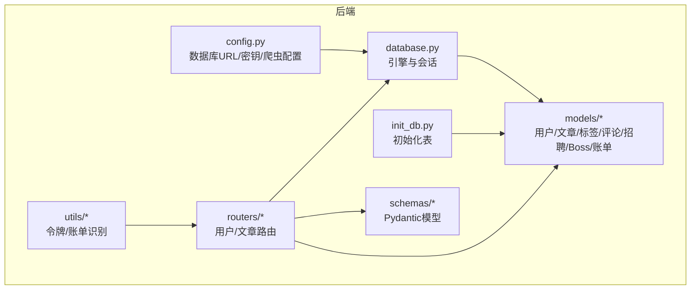
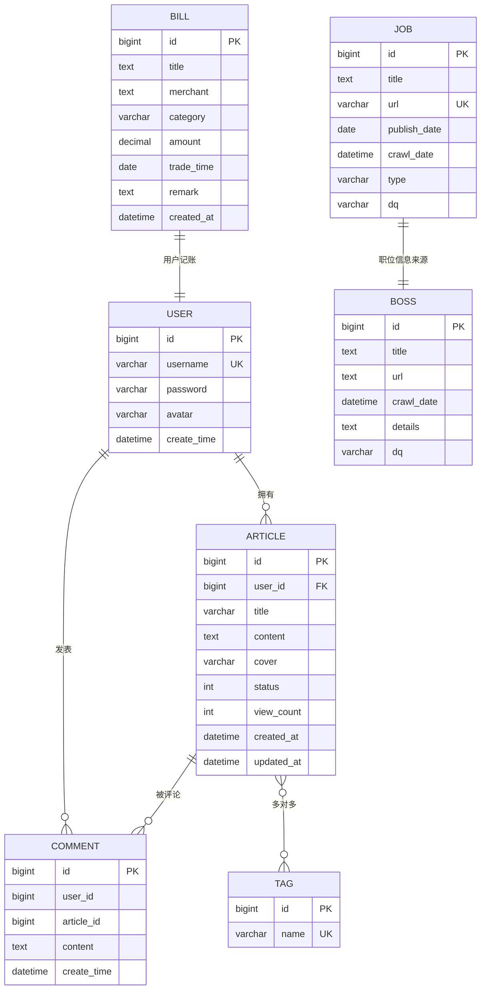
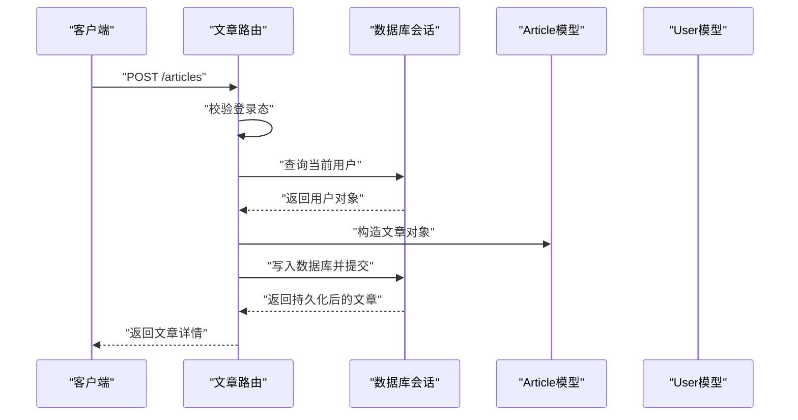
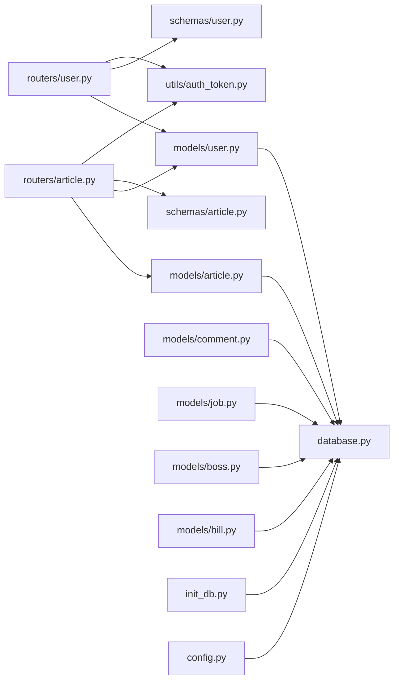
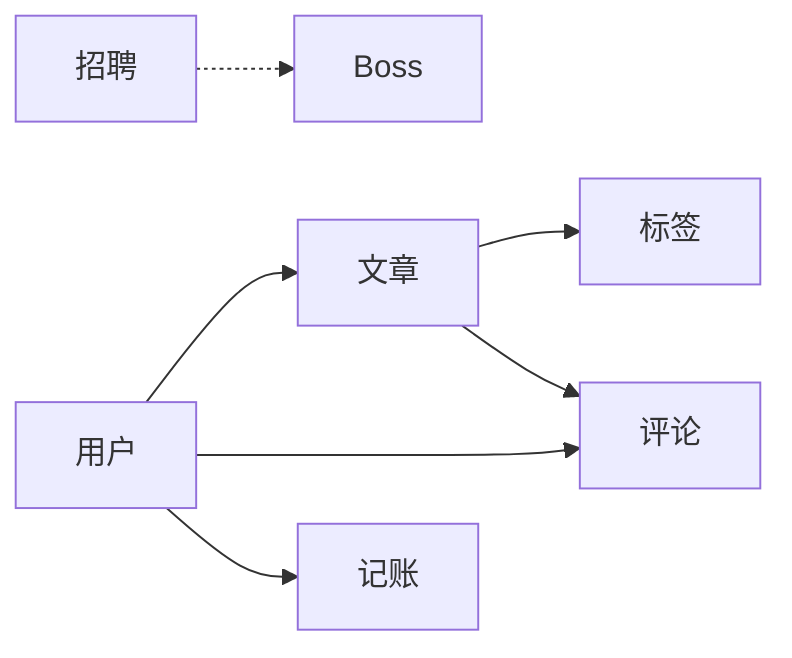

# 数据模型

<cite>
**本文引用的文件**
- [blog_backend/models/user.py](file://blog_backend/models/user.py)
- [blog_backend/models/article.py](file://blog_backend/models/article.py)
- [blog_backend/models/bill.py](file://blog_backend/models/bill.py)
- [blog_backend/models/boss.py](file://blog_backend/models/boss.py)
- [blog_backend/models/job.py](file://blog_backend/models/job.py)
- [blog_backend/models/comment.py](file://blog_backend/models/comment.py)
- [blog_backend/database.py](file://blog_backend/database.py)
- [blog_backend/init_db.py](file://blog_backend/init_db.py)
- [blog_backend/config.py](file://blog_backend/config.py)
- [blog_backend/schemas/user.py](file://blog_backend/schemas/user.py)
- [blog_backend/schemas/article.py](file://blog_backend/schemas/article.py)
- [blog_backend/schemas/boss.py](file://blog_backend/schemas/boss.py)
- [blog_backend/schemas/bill.py](file://blog_backend/schemas/bill.py)
- [blog_backend/routers/user.py](file://blog_backend/routers/user.py)
- [blog_backend/routers/article.py](file://blog_backend/routers/article.py)
- [blog_backend/utils/auth_token.py](file://blog_backend/utils/auth_token.py)
- [blog_backend/utils/bill.py](file://blog_backend/utils/bill.py)
</cite>

## 目录
1. [简介](#简介)
2. [项目结构](#项目结构)
3. [核心组件](#核心组件)
4. [架构总览](#架构总览)
5. [详细组件分析](#详细组件分析)
6. [依赖分析](#依赖分析)
7. [性能考虑](#性能考虑)
8. [故障排查指南](#故障排查指南)
9. [结论](#结论)
10. [附录](#附录)

## 简介
本文件系统性梳理博客系统的数据模型设计，覆盖用户、文章、标签、评论、招聘、Boss职位与记账等模型。文档从表结构、字段定义、约束与索引、实体关系、查询优化、数据验证与完整性、迁移与版本管理、备份策略以及数据安全与访问控制等方面进行说明，并提供ER图、表结构图与关系图，帮助开发者与运维人员快速理解与维护数据库。

## 项目结构
后端采用 SQLAlchemy 声明式 ORM 定义模型，通过统一的 Base 类派生各模型；数据库连接与会话在 database.py 中集中配置；通过 init_db.py 初始化数据库表结构；FastAPI 路由层在 routers 下实现业务接口；schemas 定义请求/响应模型；utils 提供工具函数（如令牌与账单识别）。

图表来源
- [blog_backend/database.py:1-18](file://blog_backend/database.py#L1-L18)
- [blog_backend/init_db.py:1-10](file://blog_backend/init_db.py#L1-L10)
- [blog_backend/config.py:1-32](file://blog_backend/config.py#L1-L32)
- [blog_backend/models/user.py:1-14](file://blog_backend/models/user.py#L1-L14)
- [blog_backend/models/article.py:1-41](file://blog_backend/models/article.py#L1-L41)
- [blog_backend/models/bill.py:1-24](file://blog_backend/models/bill.py#L1-L24)
- [blog_backend/models/boss.py:1-15](file://blog_backend/models/boss.py#L1-L15)
- [blog_backend/models/job.py:1-15](file://blog_backend/models/job.py#L1-L15)
- [blog_backend/models/comment.py:1-12](file://blog_backend/models/comment.py#L1-L12)
- [blog_backend/routers/user.py:1-101](file://blog_backend/routers/user.py#L1-L101)
- [blog_backend/routers/article.py:1-85](file://blog_backend/routers/article.py#L1-L85)
- [blog_backend/schemas/user.py:1-13](file://blog_backend/schemas/user.py#L1-L13)
- [blog_backend/schemas/article.py:1-10](file://blog_backend/schemas/article.py#L1-L10)
- [blog_backend/schemas/boss.py:1-14](file://blog_backend/schemas/boss.py#L1-L14)
- [blog_backend/schemas/bill.py:1-40](file://blog_backend/schemas/bill.py#L1-L40)
- [blog_backend/utils/auth_token.py:1-38](file://blog_backend/utils/auth_token.py#L1-L38)
- [blog_backend/utils/bill.py:1-107](file://blog_backend/utils/bill.py#L1-L107)

章节来源
- [blog_backend/database.py:1-18](file://blog_backend/database.py#L1-L18)
- [blog_backend/init_db.py:1-10](file://blog_backend/init_db.py#L1-L10)
- [blog_backend/config.py:1-32](file://blog_backend/config.py#L1-L32)

## 核心组件
本节概述各数据模型的职责与关键字段，便于快速定位与理解。

- 用户模型（用户注册、登录、分页查询）
- 文章模型（发布、查看、分页、编辑、删除）
- 标签模型（与文章多对多关联）
- 评论模型（文章评论）
- 招聘模型（职位信息）
- Boss职位模型（职位信息）
- 记账模型（账单条目）

章节来源
- [blog_backend/models/user.py:1-14](file://blog_backend/models/user.py#L1-L14)
- [blog_backend/models/article.py:1-41](file://blog_backend/models/article.py#L1-L41)
- [blog_backend/models/comment.py:1-12](file://blog_backend/models/comment.py#L1-L12)
- [blog_backend/models/job.py:1-15](file://blog_backend/models/job.py#L1-L15)
- [blog_backend/models/boss.py:1-15](file://blog_backend/models/boss.py#L1-L15)
- [blog_backend/models/bill.py:1-24](file://blog_backend/models/bill.py#L1-L24)

## 架构总览
下图展示数据模型之间的关系映射，包括一对一、一对多与多对多关系，以及外键约束与索引设计要点。

图表来源
- [blog_backend/models/user.py:1-14](file://blog_backend/models/user.py#L1-L14)
- [blog_backend/models/article.py:1-41](file://blog_backend/models/article.py#L1-L41)
- [blog_backend/models/comment.py:1-12](file://blog_backend/models/comment.py#L1-L12)
- [blog_backend/models/job.py:1-15](file://blog_backend/models/job.py#L1-L15)
- [blog_backend/models/boss.py:1-15](file://blog_backend/models/boss.py#L1-L15)
- [blog_backend/models/bill.py:1-24](file://blog_backend/models/bill.py#L1-L24)

## 详细组件分析

### 用户模型（User）
- 表结构与字段
  - 主键：自增 bigint
  - 唯一索引：username
  - 字段：用户名、密码、头像、创建时间
- 约束与默认值
  - 所有字段非空（除头像可空）
  - 创建时间默认当前时间
- 业务规则
  - 注册时校验用户名唯一
  - 登录时校验用户名存在与密码一致
- 安全与访问控制
  - 路由层使用 JWT 令牌进行鉴权
  - 令牌有效期 24 小时
- 查询优化
  - 按用户名模糊查询时建议在 username 上建立索引（当前为唯一索引，满足去重需求）

章节来源
- [blog_backend/models/user.py:1-14](file://blog_backend/models/user.py#L1-L14)
- [blog_backend/routers/user.py:1-101](file://blog_backend/routers/user.py#L1-L101)
- [blog_backend/utils/auth_token.py:1-38](file://blog_backend/utils/auth_token.py#L1-L38)
- [blog_backend/schemas/user.py:1-13](file://blog_backend/schemas/user.py#L1-L13)

### 文章模型（Article）与标签模型（Tag）
- 表结构与字段
  - 文章表：标题、内容、封面、状态、浏览量、创建/更新时间
  - 标签表：名称唯一
  - 关联表：article_tag（多对多中间表）
- 关系映射
  - 一对一：文章属于用户（外键 user_id）
  - 多对多：文章与标签通过中间表关联
- 约束与默认值
  - 文章状态默认值、浏览量默认值
  - 时间戳默认当前时间，更新时自动更新
- 业务规则
  - 发布文章需登录态
  - 编辑/删除需校验作者身份
- 查询优化
  - user_id 建议建立索引
  - 标签名称唯一索引满足去重
  - 多对多查询建议按标签过滤时在中间表上建立复合索引（article_id, tag_id）

章节来源
- [blog_backend/models/article.py:1-41](file://blog_backend/models/article.py#L1-L41)
- [blog_backend/routers/article.py:1-85](file://blog_backend/routers/article.py#L1-L85)

### 评论模型（Comment）
- 表结构与字段
  - 内容、创建时间
  - 外键 user_id 与 article_id
- 关系映射
  - 一对一：评论属于用户
  - 一对一：评论属于文章
- 约束与默认值
  - 所有字段非空
  - 创建时间默认当前时间
- 业务规则
  - 评论与文章存在性校验
- 查询优化
  - 建议在 user_id 与 article_id 上建立索引

章节来源
- [blog_backend/models/comment.py:1-12](file://blog_backend/models/comment.py#L1-L12)

### 招聘模型（Job）与 Boss职位模型（Boss）
- 表结构与字段
  - 招聘：标题、链接唯一、发布时间、爬取时间、类型、地区
  - Boss：标题、链接、爬取时间、详情、地区
- 关系映射
  - 一对一：两者均为职位信息载体，无显式外键关联
- 约束与默认值
  - 链接唯一（Job）
  - 默认爬取时间为当前时间
- 业务规则
  - 招聘信息存储与去重（基于链接唯一）
- 查询优化
  - 建议在 url、publish_date、crawl_date、dq 上建立索引以支持筛选与排序

章节来源
- [blog_backend/models/job.py:1-15](file://blog_backend/models/job.py#L1-L15)
- [blog_backend/models/boss.py:1-15](file://blog_backend/models/boss.py#L1-L15)

### 记账模型（Bill）
- 表结构与字段
  - 标题、商户、分类、金额（数值型）、交易日期、备注、创建时间
- 约束与默认值
  - 金额为数值型，建议保留两位小数
  - 创建时间为非空默认当前时间
- 业务规则
  - 金额必须大于 0
  - 标题长度限制、备注长度限制
- 查询优化
  - 建议在 category、trade_time、created_at 上建立索引
- 数据验证与完整性
  - Pydantic 校验器确保金额正数与精度
  - 可扩展：金额范围、分类枚举校验

章节来源
- [blog_backend/models/bill.py:1-24](file://blog_backend/models/bill.py#L1-L24)
- [blog_backend/schemas/bill.py:1-40](file://blog_backend/schemas/bill.py#L1-L40)
- [blog_backend/utils/bill.py:1-107](file://blog_backend/utils/bill.py#L1-L107)

### 文章创建流程（序列图）

图表来源
- [blog_backend/routers/article.py:1-85](file://blog_backend/routers/article.py#L1-L85)
- [blog_backend/models/article.py:1-41](file://blog_backend/models/article.py#L1-L41)
- [blog_backend/models/user.py:1-14](file://blog_backend/models/user.py#L1-L14)
- [blog_backend/utils/auth_token.py:1-38](file://blog_backend/utils/auth_token.py#L1-L38)

## 依赖分析
- 组件耦合
  - 路由层依赖模型与会话；模型依赖 Base；Base 依赖数据库引擎
  - 认证工具依赖配置中的密钥与算法
- 外部依赖
  - 数据库驱动与 ORM（SQLAlchemy）
  - FastAPI（路由与依赖注入）
  - Pydantic（请求/响应模型）
  - passlib（密码处理，但当前路由未启用）
- 循环依赖
  - 当前结构未发现循环导入

图表来源
- [blog_backend/routers/user.py:1-101](file://blog_backend/routers/user.py#L1-L101)
- [blog_backend/routers/article.py:1-85](file://blog_backend/routers/article.py#L1-L85)
- [blog_backend/models/user.py:1-14](file://blog_backend/models/user.py#L1-L14)
- [blog_backend/models/article.py:1-41](file://blog_backend/models/article.py#L1-L41)
- [blog_backend/models/comment.py:1-12](file://blog_backend/models/comment.py#L1-L12)
- [blog_backend/models/job.py:1-15](file://blog_backend/models/job.py#L1-L15)
- [blog_backend/models/boss.py:1-15](file://blog_backend/models/boss.py#L1-L15)
- [blog_backend/models/bill.py:1-24](file://blog_backend/models/bill.py#L1-L24)
- [blog_backend/database.py:1-18](file://blog_backend/database.py#L1-L18)
- [blog_backend/init_db.py:1-10](file://blog_backend/init_db.py#L1-L10)
- [blog_backend/config.py:1-32](file://blog_backend/config.py#L1-L32)
- [blog_backend/schemas/user.py:1-13](file://blog_backend/schemas/user.py#L1-L13)
- [blog_backend/schemas/article.py:1-10](file://blog_backend/schemas/article.py#L1-L10)
- [blog_backend/utils/auth_token.py:1-38](file://blog_backend/utils/auth_token.py#L1-L38)

## 性能考虑
- 索引设计
  - 用户：username（唯一索引），建议在 create_time 上建立索引以支持按时间倒序分页
  - 文章：user_id（外键索引），created_at/updated_at 建议索引；标签名称唯一索引
  - 评论：user_id、article_id 建议复合索引
  - 招聘/Boss：url（唯一索引），publish_date/crawl_date/dq 建议索引
  - 记账：category、trade_time、created_at 建议索引
- 查询优化
  - 分页查询使用 LIMIT/OFFSET，注意 OFFSET 大时的性能问题，可考虑基于游标分页
  - 多对多查询尽量通过中间表过滤，避免笛卡尔积
- 存储与类型
  - 金额使用数值类型，避免浮点误差
  - 文本字段根据实际长度设置合理上限，减少碎片与 IO
- 缓存策略
  - 热门文章与用户信息可引入缓存层（Redis），降低数据库压力

## 故障排查指南
- 用户相关
  - 注册失败：检查用户名唯一性与字段非空约束
  - 登录失败：确认用户名存在与密码一致；检查 JWT 密钥与算法配置
- 文章相关
  - 发布失败：确认登录态有效；检查标题/内容非空
  - 编辑/删除失败：确认当前用户为文章作者
- 记账相关
  - 金额校验失败：确保金额大于 0，且保留两位小数
- 数据库初始化
  - 初始化失败：检查 DATABASE_URL 环境变量与数据库连通性
- 爬虫与识别
  - 图片识别异常：检查 API Key 与基础 URL 配置；确认图片编码与提示词格式

章节来源
- [blog_backend/routers/user.py:1-101](file://blog_backend/routers/user.py#L1-L101)
- [blog_backend/routers/article.py:1-85](file://blog_backend/routers/article.py#L1-L85)
- [blog_backend/schemas/bill.py:1-40](file://blog_backend/schemas/bill.py#L1-L40)
- [blog_backend/init_db.py:1-10](file://blog_backend/init_db.py#L1-L10)
- [blog_backend/config.py:1-32](file://blog_backend/config.py#L1-L32)
- [blog_backend/utils/bill.py:1-107](file://blog_backend/utils/bill.py#L1-L107)

## 结论
本数据模型围绕用户、文章、标签、评论、招聘、Boss与记账构建，采用清晰的一对多与多对多关系，结合 SQLAlchemy 的 ORM 设计与 FastAPI 的路由层，实现了良好的可维护性与扩展性。建议在生产环境中进一步完善索引、引入缓存与审计日志，并加强数据安全与访问控制策略。

## 附录

### 表结构与字段定义（汇总）
- 用户表（user）
  - 字段：id（主键）、username（唯一）、password、avatar、create_time（默认当前时间）
- 文章表（article）
  - 字段：id（主键）、user_id（外键）、title、content、cover、status（默认 1）、view_count（默认 0）、created_at、updated_at（自动更新）
- 标签表（tag）
  - 字段：id（主键）、name（唯一）
- 文章-标签中间表（article_tag）
  - 字段：article_id（主键、外键）、tag_id（主键、外键）
- 评论表（comment）
  - 字段：id（主键）、user_id、article_id、content、create_time（默认当前时间）
- 招聘表（job）
  - 字段：id（主键）、title、url（唯一）、publish_date、crawl_date（默认当前时间）、type、dq
- Boss职位表（boss）
  - 字段：id（主键）、title、url、crawl_date（默认当前时间）、details、dq
- 记账表（bill）
  - 字段：id（主键）、title、merchant、category、amount（数值型）、trade_time、remark、created_at（默认当前时间）

章节来源
- [blog_backend/models/user.py:1-14](file://blog_backend/models/user.py#L1-L14)
- [blog_backend/models/article.py:1-41](file://blog_backend/models/article.py#L1-L41)
- [blog_backend/models/comment.py:1-12](file://blog_backend/models/comment.py#L1-L12)
- [blog_backend/models/job.py:1-15](file://blog_backend/models/job.py#L1-L15)
- [blog_backend/models/boss.py:1-15](file://blog_backend/models/boss.py#L1-L15)
- [blog_backend/models/bill.py:1-24](file://blog_backend/models/bill.py#L1-L24)

### 关系图（简化）

图表来源
- [blog_backend/models/user.py:1-14](file://blog_backend/models/user.py#L1-L14)
- [blog_backend/models/article.py:1-41](file://blog_backend/models/article.py#L1-L41)
- [blog_backend/models/comment.py:1-12](file://blog_backend/models/comment.py#L1-L12)
- [blog_backend/models/job.py:1-15](file://blog_backend/models/job.py#L1-L15)
- [blog_backend/models/boss.py:1-15](file://blog_backend/models/boss.py#L1-L15)
- [blog_backend/models/bill.py:1-24](file://blog_backend/models/bill.py#L1-L24)

### 数据迁移与版本管理
- 使用 Alembic 进行迁移（建议）
  - 初始化：alembic init alembic
  - 生成迁移脚本：alembic revision --autogenerate -m "描述"
  - 应用迁移：alembic upgrade head
- 版本策略
  - 开发分支：基于主干的增量迁移
  - 生产回滚：使用 down_revision 与 downgrade
- 自动化
  - 在部署脚本中集成 alembic upgrade head

### 备份策略
- 全量备份
  - 使用数据库自带工具（如 mysqldump）定期导出
  - 压缩与归档，保留多个周期历史
- 增量备份
  - 基于 binlog 或时间点恢复（MySQL）
- 验证与演练
  - 定期抽样恢复测试，验证备份可用性

### 数据安全、隐私保护与访问控制
- 访问控制
  - JWT 令牌：路由层依赖 OAuth2PasswordBearer，解析并校验用户有效性
  - 路由装饰器：仅允许认证用户访问受保护资源
- 数据加密
  - 敏感字段（如密码）建议使用强哈希（passlib 已引入，当前路由未启用）
- 最小权限
  - 数据库用户仅授予必要权限
- 日志与审计
  - 记录敏感操作（登录、修改、删除）与异常事件
- 合规
  - 遵循数据最小化与用户同意原则，提供数据删除与导出能力

章节来源
- [blog_backend/utils/auth_token.py:1-38](file://blog_backend/utils/auth_token.py#L1-L38)
- [blog_backend/routers/user.py:1-101](file://blog_backend/routers/user.py#L1-L101)
- [blog_backend/routers/article.py:1-85](file://blog_backend/routers/article.py#L1-L85)
- [blog_backend/config.py:1-32](file://blog_backend/config.py#L1-L32)