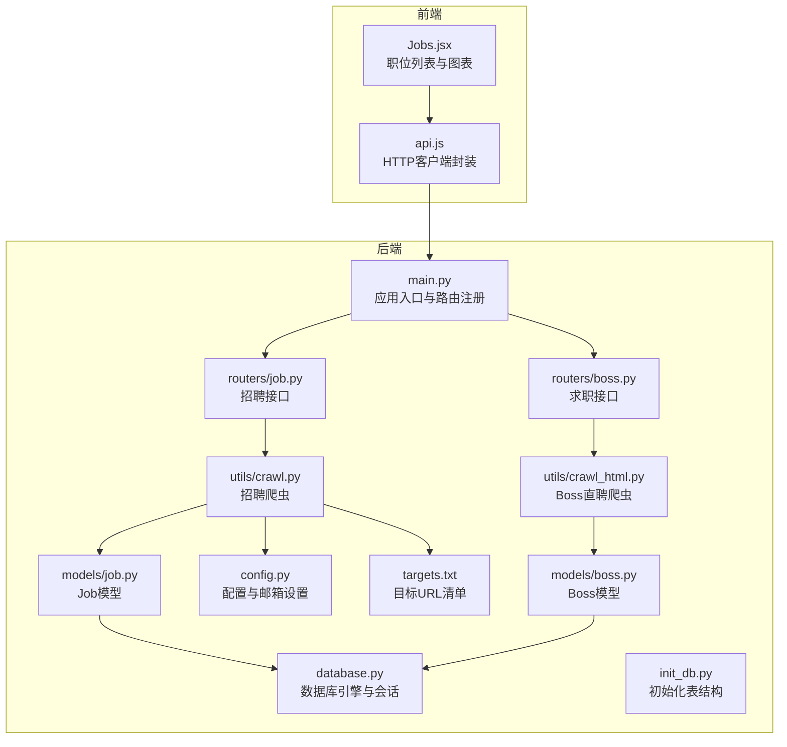
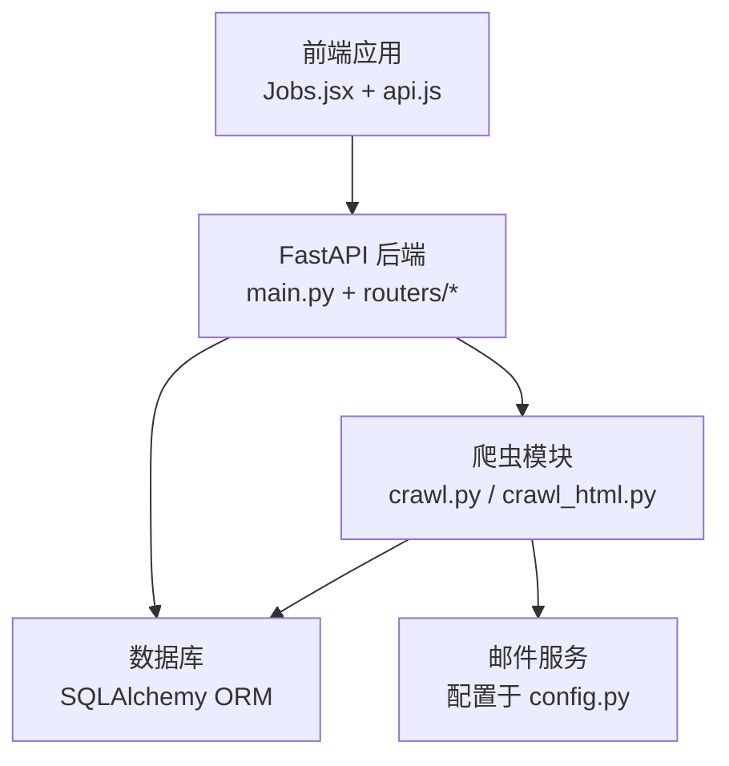
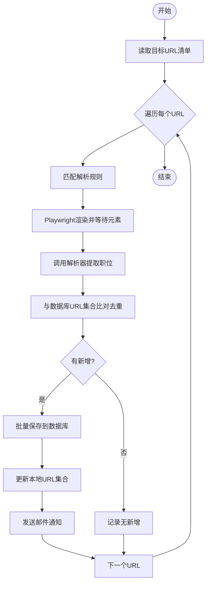
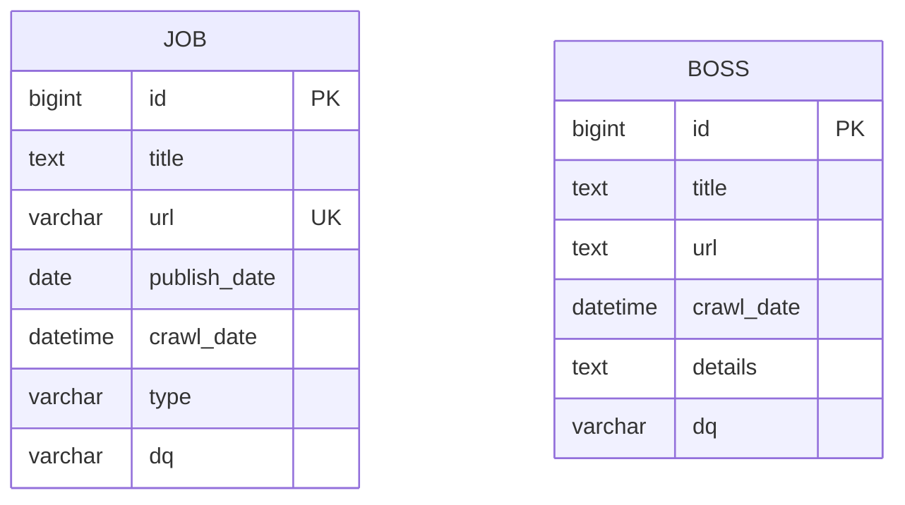
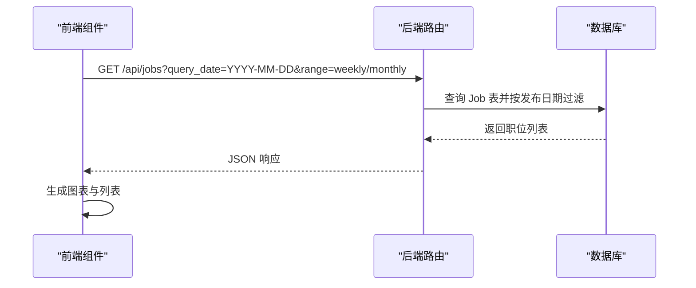
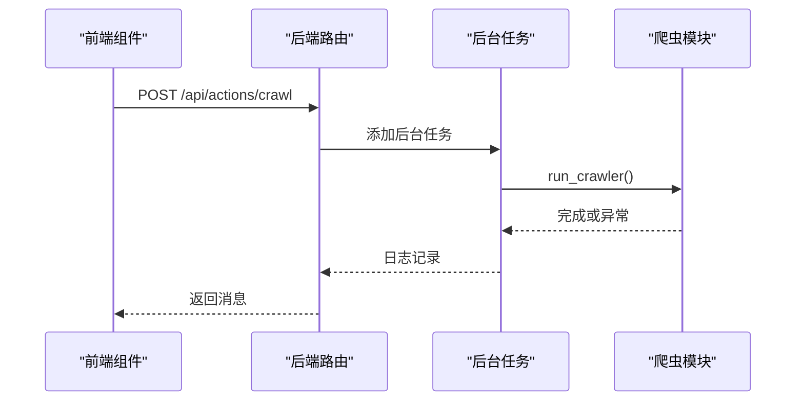
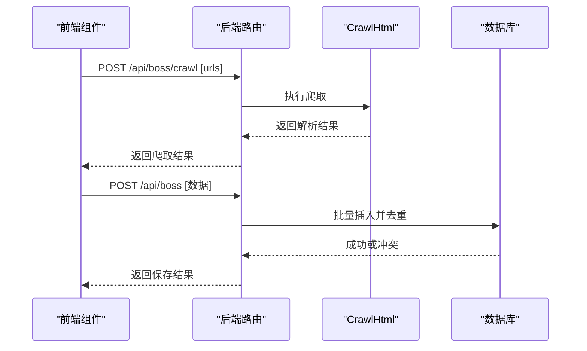
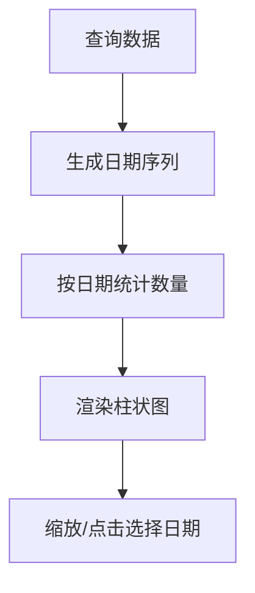
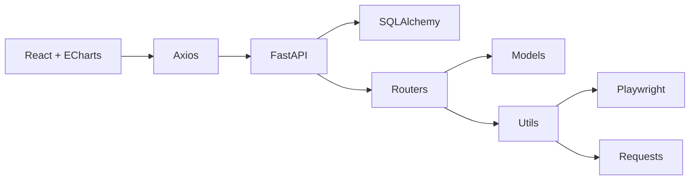

# 招聘信息系统

<cite>
**本文引用的文件**
- [blog_backend/main.py](file://blog_backend/main.py)
- [blog_backend/database.py](file://blog_backend/database.py)
- [blog_backend/config.py](file://blog_backend/config.py)
- [blog_backend/init_db.py](file://blog_backend/init_db.py)
- [blog_backend/models/job.py](file://blog_backend/models/job.py)
- [blog_backend/models/boss.py](file://blog_backend/models/boss.py)
- [blog_backend/routers/job.py](file://blog_backend/routers/job.py)
- [blog_backend/routers/boss.py](file://blog_backend/routers/boss.py)
- [blog_backend/utils/crawl.py](file://blog_backend/utils/crawl.py)
- [blog_backend/utils/crawl_html.py](file://blog_backend/utils/crawl_html.py)
- [blog_backend/targets.txt](file://blog_backend/targets.txt)
- [blog_frontend/src/components/Jobs.jsx](file://blog_frontend/src/components/Jobs.jsx)
- [blog_frontend/src/api.js](file://blog_frontend/src/api.js)
</cite>

## 目录
1. [简介](#简介)
2. [项目结构](#项目结构)
3. [核心组件](#核心组件)
4. [架构总览](#架构总览)
5. [详细组件分析](#详细组件分析)
6. [依赖分析](#依赖分析)
7. [性能考虑](#性能考虑)
8. [故障排除指南](#故障排除指南)
9. [结论](#结论)
10. [附录](#附录)

## 简介
本系统是一个基于 FastAPI 的招聘信息系统，提供以下能力：
- 招聘数据爬取：支持多站点、多类型的招聘信息抓取与解析，具备反爬虫应对策略（等待元素、随机 UA、延时）。
- 数据存储：通过 SQLAlchemy ORM 将招聘信息入库，利用唯一约束与去重逻辑避免重复数据。
- 数据展示：提供职位列表、按周/月筛选、图表统计与按日期过滤。
- 数据分析：前端基于 ECharts 实现职位发布趋势可视化。
- 定时任务调度：通过后台任务触发爬取，支持异常处理与邮件通知。
- API 接口：统一的 /api 前缀路由，包含招聘与求职相关的接口。
- 前端组件：React 组件负责数据获取、筛选、图表渲染与爬取触发。

## 项目结构
后端采用 FastAPI + SQLAlchemy 架构，路由按功能模块划分；前端使用 React + ECharts 展示数据。核心文件组织如下：
- 后端入口与路由注册：blog_backend/main.py
- 数据库与模型：blog_backend/database.py、models/job.py、models/boss.py
- 路由层：blog_backend/routers/job.py、routers/boss.py
- 爬虫工具：blog_backend/utils/crawl.py、utils/crawl_html.py
- 配置与初始化：blog_backend/config.py、init_db.py、targets.txt
- 前端组件与 API：blog_frontend/src/components/Jobs.jsx、src/api.js

**图示来源**
- [blog_backend/main.py:1-13](file://blog_backend/main.py#L1-L13)
- [blog_backend/routers/job.py:1-76](file://blog_backend/routers/job.py#L1-L76)
- [blog_backend/routers/boss.py:1-134](file://blog_backend/routers/boss.py#L1-L134)
- [blog_backend/utils/crawl.py:1-425](file://blog_backend/utils/crawl.py#L1-L425)
- [blog_backend/utils/crawl_html.py:1-72](file://blog_backend/utils/crawl_html.py#L1-L72)
- [blog_backend/models/job.py:1-15](file://blog_backend/models/job.py#L1-L15)
- [blog_backend/models/boss.py:1-15](file://blog_backend/models/boss.py#L1-L15)
- [blog_backend/database.py:1-18](file://blog_backend/database.py#L1-L18)
- [blog_backend/config.py:1-32](file://blog_backend/config.py#L1-L32)
- [blog_backend/init_db.py:1-10](file://blog_backend/init_db.py#L1-L10)
- [blog_backend/targets.txt:1-5](file://blog_backend/targets.txt#L1-L5)
- [blog_frontend/src/components/Jobs.jsx:1-293](file://blog_frontend/src/components/Jobs.jsx#L1-L293)
- [blog_frontend/src/api.js:1-39](file://blog_frontend/src/api.js#L1-L39)

**章节来源**
- [blog_backend/main.py:1-13](file://blog_backend/main.py#L1-L13)
- [blog_backend/database.py:1-18](file://blog_backend/database.py#L1-L18)
- [blog_backend/config.py:1-32](file://blog_backend/config.py#L1-L32)
- [blog_backend/init_db.py:1-10](file://blog_backend/init_db.py#L1-L10)

## 核心组件
- 应用入口与路由注册：在入口文件中注册用户、文章、招聘、记账、求职等路由，统一前缀 /api。
- 数据库与模型：定义 Job（招聘信息）与 Boss（求职投递）模型，含唯一约束与默认时间戳。
- 路由层：提供招聘数据查询与后台爬取触发接口；提供 Boss 爬取与入库接口。
- 爬虫工具：crawl.py 使用 Playwright 渲染页面并解析多类站点；crawl_html.py 提供基于 requests 的简单爬取示例。
- 前端组件：Jobs.jsx 负责数据获取、筛选、图表渲染与触发爬取；api.js 封装 HTTP 请求。

**章节来源**
- [blog_backend/main.py:1-13](file://blog_backend/main.py#L1-L13)
- [blog_backend/models/job.py:1-15](file://blog_backend/models/job.py#L1-L15)
- [blog_backend/models/boss.py:1-15](file://blog_backend/models/boss.py#L1-L15)
- [blog_backend/routers/job.py:1-76](file://blog_backend/routers/job.py#L1-L76)
- [blog_backend/routers/boss.py:1-134](file://blog_backend/routers/boss.py#L1-L134)
- [blog_backend/utils/crawl.py:1-425](file://blog_backend/utils/crawl.py#L1-L425)
- [blog_backend/utils/crawl_html.py:1-72](file://blog_backend/utils/crawl_html.py#L1-L72)
- [blog_frontend/src/components/Jobs.jsx:1-293](file://blog_frontend/src/components/Jobs.jsx#L1-L293)
- [blog_frontend/src/api.js:1-39](file://blog_frontend/src/api.js#L1-L39)

## 架构总览
系统采用前后端分离架构，后端提供 RESTful API，前端通过 Axios 访问。爬虫作为后台任务或手动触发，解析后的数据写入数据库并通过接口返回给前端展示。

**图示来源**
- [blog_backend/main.py:1-13](file://blog_backend/main.py#L1-L13)
- [blog_backend/routers/job.py:1-76](file://blog_backend/routers/job.py#L1-L76)
- [blog_backend/routers/boss.py:1-134](file://blog_backend/routers/boss.py#L1-L134)
- [blog_backend/utils/crawl.py:1-425](file://blog_backend/utils/crawl.py#L1-L425)
- [blog_backend/utils/crawl_html.py:1-72](file://blog_backend/utils/crawl_html.py#L1-L72)
- [blog_backend/database.py:1-18](file://blog_backend/database.py#L1-L18)
- [blog_backend/config.py:1-32](file://blog_backend/config.py#L1-L32)

## 详细组件分析

### 招聘数据爬取与解析
- 多站点适配：通过规则字典匹配不同 URL 关键词，选择对应的解析器，支持公司招聘、考试公告、南昌人才国企/企业/名企等页面。
- 反爬虫策略：使用 Playwright 无头浏览器渲染页面，等待指定选择器出现后再抓取；解析器对日期格式进行容错处理；crawl_html.py 提供随机 UA 与随机延时策略。
- 数据去重：读取数据库现有 URL 集合，仅保存新 URL 的职位条目。
- 存储与通知：批量保存 Job 对象，更新本地集合，必要时发送邮件通知新增条目。

**图示来源**
- [blog_backend/utils/crawl.py:366-425](file://blog_backend/utils/crawl.py#L366-L425)
- [blog_backend/targets.txt:1-5](file://blog_backend/targets.txt#L1-L5)

**章节来源**
- [blog_backend/utils/crawl.py:1-425](file://blog_backend/utils/crawl.py#L1-L425)
- [blog_backend/targets.txt:1-5](file://blog_backend/targets.txt#L1-L5)

### 数据存储机制
- Job 模型：包含标题、URL（唯一）、发布日期、爬取时间、类型、地区等字段，URL 唯一约束防止重复。
- 批量入库：逐条提交并捕获异常，回滚失败条目，保证整体流程稳定。
- 初始化：init_db.py 创建所有表，确保首次运行可用。

**图示来源**
- [blog_backend/models/job.py:1-15](file://blog_backend/models/job.py#L1-L15)
- [blog_backend/models/boss.py:1-15](file://blog_backend/models/boss.py#L1-L15)

**章节来源**
- [blog_backend/models/job.py:1-15](file://blog_backend/models/job.py#L1-L15)
- [blog_backend/models/boss.py:1-15](file://blog_backend/models/boss.py#L1-L15)
- [blog_backend/init_db.py:1-10](file://blog_backend/init_db.py#L1-L10)

### 招聘信息展示与筛选
- 接口设计：/api/jobs 支持按日期与范围（周/月）查询，返回职位列表并按 ID 倒序。
- 前端实现：Jobs.jsx 根据日期范围生成图表数据，支持点击图表切换日期过滤，提供“开始爬取”按钮触发后台任务。
- 图表统计：基于 ECharts 渲染柱状图，支持周/月两种模式与缩放。

**图示来源**
- [blog_backend/routers/job.py:17-60](file://blog_backend/routers/job.py#L17-L60)
- [blog_frontend/src/components/Jobs.jsx:22-44](file://blog_frontend/src/components/Jobs.jsx#L22-L44)

**章节来源**
- [blog_backend/routers/job.py:17-60](file://blog_backend/routers/job.py#L17-L60)
- [blog_frontend/src/components/Jobs.jsx:1-293](file://blog_frontend/src/components/Jobs.jsx#L1-L293)

### 定时任务调度与异常处理
- 后台任务：/api/actions/crawl 触发后台爬取任务，记录日志并在异常时输出错误信息。
- 频率控制：crawl_html.py 中通过随机延时模拟人类行为；crawl.py 使用等待元素减少无效请求。
- 异常处理：爬取循环内捕获异常并打印堆栈，避免单个 URL 导致整个流程中断。

**图示来源**
- [blog_backend/routers/job.py:62-76](file://blog_backend/routers/job.py#L62-L76)
- [blog_backend/utils/crawl.py:366-425](file://blog_backend/utils/crawl.py#L366-L425)

**章节来源**
- [blog_backend/routers/job.py:62-76](file://blog_backend/routers/job.py#L62-L76)
- [blog_backend/utils/crawl.py:1-425](file://blog_backend/utils/crawl.py#L1-L425)

### Boss 直聘爬取与入库
- 爬取接口：POST /api/boss/crawl 接收 URL 列表，使用 CrawlHtml 爬取并返回解析结果。
- 入库接口：POST /api/boss 支持单条或多条记录创建，自动去重并返回结果。
- 查询接口：GET /api/boss 支持按周/月范围查询投递记录。

**图示来源**
- [blog_backend/routers/boss.py:16-85](file://blog_backend/routers/boss.py#L16-L85)
- [blog_backend/utils/crawl_html.py:1-72](file://blog_backend/utils/crawl_html.py#L1-L72)
- [blog_backend/models/boss.py:1-15](file://blog_backend/models/boss.py#L1-L15)

**章节来源**
- [blog_backend/routers/boss.py:16-85](file://blog_backend/routers/boss.py#L16-L85)
- [blog_backend/utils/crawl_html.py:1-72](file://blog_backend/utils/crawl_html.py#L1-L72)
- [blog_backend/models/boss.py:1-15](file://blog_backend/models/boss.py#L1-L15)

### 数据分析与可视化
- 前端统计：Jobs.jsx 基于查询数据生成每日职位数量，支持周/月模式切换与点击选择日期。
- 图表交互：ECharts 提供缩放、标签与点击事件，便于用户探索趋势。

**图示来源**
- [blog_frontend/src/components/Jobs.jsx:46-145](file://blog_frontend/src/components/Jobs.jsx#L46-L145)

**章节来源**
- [blog_frontend/src/components/Jobs.jsx:1-293](file://blog_frontend/src/components/Jobs.jsx#L1-L293)

## 依赖分析
- 后端依赖：FastAPI、SQLAlchemy、Playwright、BeautifulSoup、requests、smtplib 等。
- 前端依赖：React、axios、echarts-for-react。
- 配置依赖：环境变量 DATABASE_URL、邮件配置等。

**图示来源**
- [blog_backend/main.py:1-13](file://blog_backend/main.py#L1-L13)
- [blog_backend/routers/job.py:1-76](file://blog_backend/routers/job.py#L1-L76)
- [blog_backend/routers/boss.py:1-134](file://blog_backend/routers/boss.py#L1-L134)
- [blog_backend/utils/crawl.py:1-425](file://blog_backend/utils/crawl.py#L1-L425)
- [blog_backend/utils/crawl_html.py:1-72](file://blog_backend/utils/crawl_html.py#L1-L72)
- [blog_frontend/src/api.js:1-39](file://blog_frontend/src/api.js#L1-L39)
- [blog_frontend/src/components/Jobs.jsx:1-293](file://blog_frontend/src/components/Jobs.jsx#L1-L293)

**章节来源**
- [blog_backend/config.py:1-32](file://blog_backend/config.py#L1-L32)
- [blog_backend/database.py:1-18](file://blog_backend/database.py#L1-L18)

## 性能考虑
- 爬取性能：Playwright 渲染页面耗时较高，建议合理设置等待时间与并发策略；对同一站点增加延时以降低被封风险。
- 数据库性能：批量插入时逐条提交并回滚失败条目，避免大事务阻塞；索引方面可考虑在 publish_date、crawl_date 上建立索引以优化查询。
- 前端性能：图表数据按需计算，使用 useMemo 缓存计算结果；分页未启用，建议在数据量增大时引入分页与懒加载。
- 网络与稳定性：requests 爬取示例包含随机 UA 与延时，适合轻量场景；生产环境建议结合代理池与更严格的重试策略。

[本节为通用指导，无需特定文件引用]

## 故障排除指南
- 爬取无结果
  - 检查 targets.txt 是否包含有效 URL。
  - 确认规则关键字与目标页面匹配。
  - 查看后台日志，确认异常堆栈。
- 数据库连接失败
  - 检查 DATABASE_URL 环境变量或 config.py 中的默认值。
  - 确认数据库服务正常且账号权限正确。
- 邮件通知未发送
  - 检查 EMAIL_CONFIG.enabled 是否开启。
  - 确认 SMTP 主机、端口、账号密码配置正确。
- 前端无法获取数据
  - 检查 /api 前缀与路由是否正确注册。
  - 确认网络代理与跨域配置。
- Boss 爬取失败
  - 确认传入 URL 列表格式正确。
  - 检查 CrawlHtml 的解析逻辑与目标页面结构变化。

**章节来源**
- [blog_backend/utils/crawl.py:313-366](file://blog_backend/utils/crawl.py#L313-L366)
- [blog_backend/config.py:19-32](file://blog_backend/config.py#L19-L32)
- [blog_backend/routers/boss.py:16-31](file://blog_backend/routers/boss.py#L16-L31)

## 结论
本系统提供了完整的招聘数据采集、存储、展示与分析能力，具备基础的反爬虫策略与异常处理机制。后续可扩展的方向包括：定时任务调度（如 APScheduler 或 Celery）、更完善的去重与校验、分页与搜索、以及更丰富的可视化分析。

[本节为总结性内容，无需特定文件引用]

## 附录

### API 接口一览
- 获取招聘数据
  - 方法：GET
  - 路径：/api/jobs
  - 参数：query_date（日期）、range（weekly/monthly）
  - 返回：职位列表（包含 id、title、url、publish_date、crawl_date、type、dq）
- 触发爬虫
  - 方法：POST
  - 路径：/api/actions/crawl
  - 返回：消息提示
- Boss 爬取
  - 方法：POST
  - 路径：/api/boss/crawl
  - 参数：urls（URL 列表）
  - 返回：爬取结果
- 入库 Boss 记录
  - 方法：POST
  - 路径：/api/boss
  - 参数：单条或多条 BossCreate 数据
  - 返回：保存结果
- 查询 Boss 记录
  - 方法：GET
  - 路径：/api/boss
  - 参数：query_date（日期）、range（weekly/monthly）
  - 返回：投递记录列表

**章节来源**
- [blog_backend/routers/job.py:17-76](file://blog_backend/routers/job.py#L17-L76)
- [blog_backend/routers/boss.py:16-127](file://blog_backend/routers/boss.py#L16-L127)
- [blog_frontend/src/api.js:26-37](file://blog_frontend/src/api.js#L26-L37)

### 配置示例
- 数据库连接
  - 通过环境变量 DATABASE_URL 设置，或使用 config.py 中默认值。
- 爬虫配置
  - BASE_URL：基准站点地址。
  - TARGETS_FILE：目标 URL 文件路径。
- 邮件通知
  - EMAIL_CONFIG.enabled：是否启用邮件通知。
  - SMTP 主机、端口、用户名、密码、发件人、收件人。

**章节来源**
- [blog_backend/config.py:1-32](file://blog_backend/config.py#L1-L32)

### 前端组件说明
- Jobs.jsx
  - 功能：获取招聘数据、按周/月筛选、图表统计、按日期过滤、触发爬取。
  - 依赖：api.js、echarts-for-react。
- api.js
  - 功能：封装 axios，统一 baseURL 与鉴权头，导出 getJobs、triggerCrawl 等方法。

**章节来源**
- [blog_frontend/src/components/Jobs.jsx:1-293](file://blog_frontend/src/components/Jobs.jsx#L1-L293)
- [blog_frontend/src/api.js:1-39](file://blog_frontend/src/api.js#L1-L39)