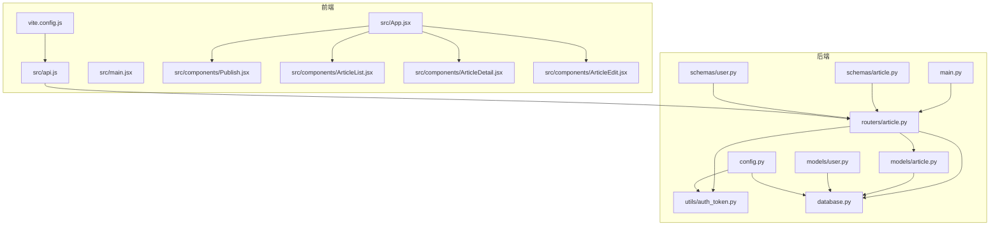
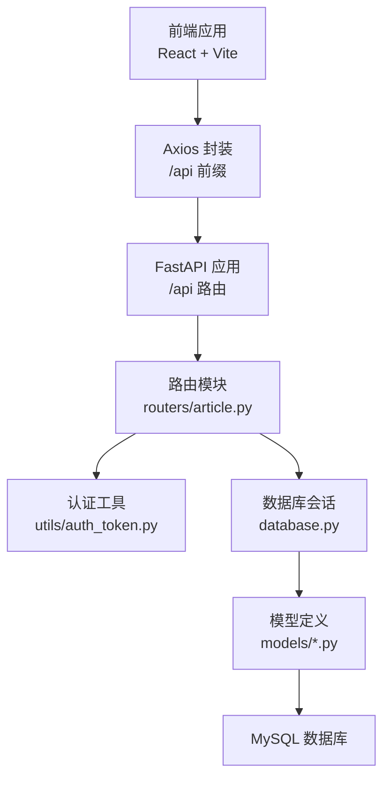
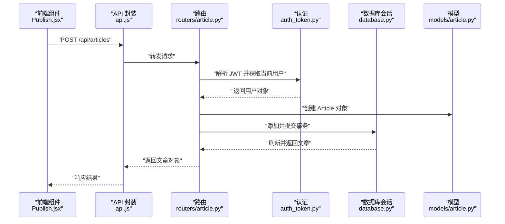
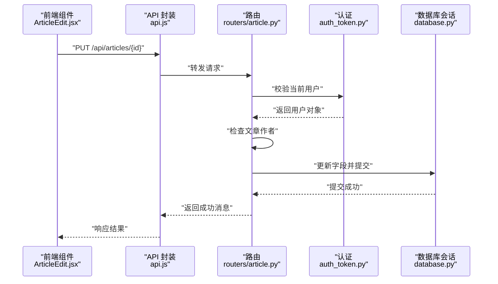
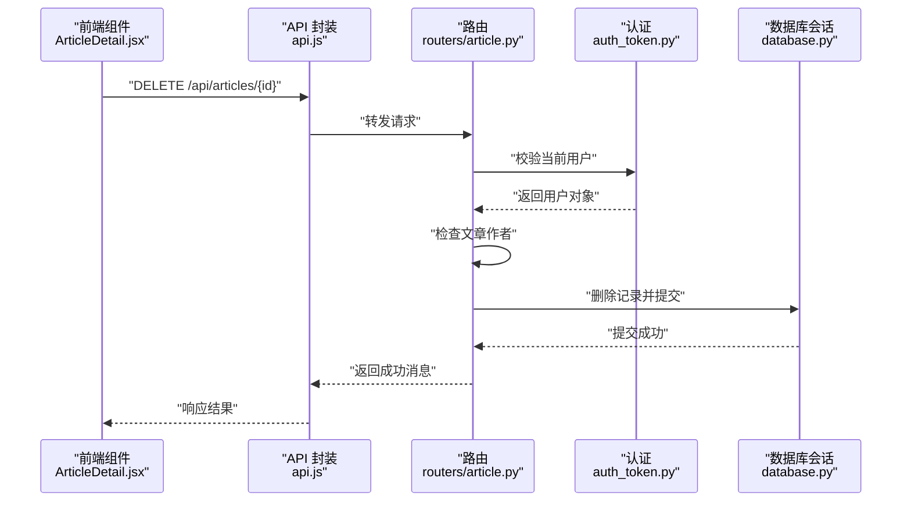
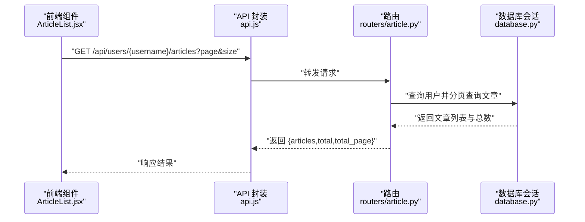
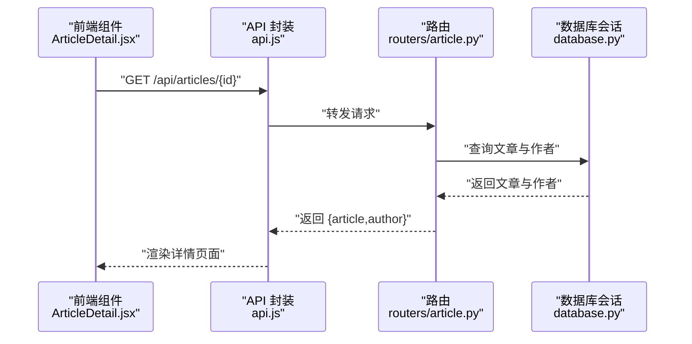
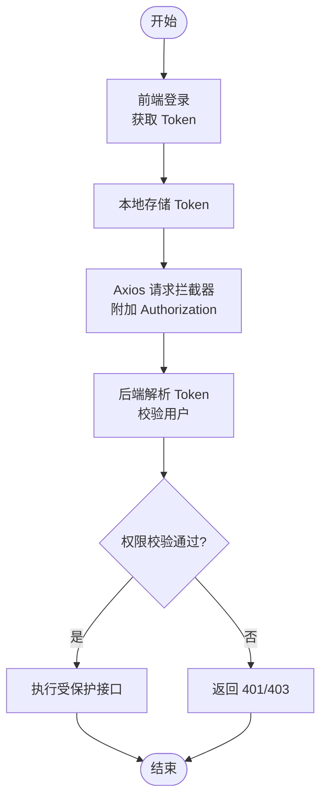
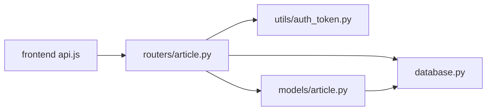

# 文章管理系统

<cite>
**本文引用的文件**
- [blog_backend/main.py](file://blog_backend/main.py)
- [blog_backend/database.py](file://blog_backend/database.py)
- [blog_backend/config.py](file://blog_backend/config.py)
- [blog_backend/models/article.py](file://blog_backend/models/article.py)
- [blog_backend/models/user.py](file://blog_backend/models/user.py)
- [blog_backend/routers/article.py](file://blog_backend/routers/article.py)
- [blog_backend/schemas/article.py](file://blog_backend/schemas/article.py)
- [blog_backend/schemas/user.py](file://blog_backend/schemas/user.py)
- [blog_backend/utils/auth_token.py](file://blog_backend/utils/auth_token.py)
- [blog_frontend/src/api.js](file://blog_frontend/src/api.js)
- [blog_frontend/src/App.jsx](file://blog_frontend/src/App.jsx)
- [blog_frontend/src/main.jsx](file://blog_frontend/src/main.jsx)
- [blog_frontend/src/components/Publish.jsx](file://blog_frontend/src/components/Publish.jsx)
- [blog_frontend/src/components/ArticleList.jsx](file://blog_frontend/src/components/ArticleList.jsx)
- [blog_frontend/src/components/ArticleDetail.jsx](file://blog_frontend/src/components/ArticleDetail.jsx)
- [blog_frontend/src/components/ArticleEdit.jsx](file://blog_frontend/src/components/ArticleEdit.jsx)
- [blog_frontend/vite.config.js](file://blog_frontend/vite.config.js)
</cite>

## 目录
1. [简介](#简介)
2. [项目结构](#项目结构)
3. [核心组件](#核心组件)
4. [架构总览](#架构总览)
5. [详细组件分析](#详细组件分析)
6. [依赖分析](#依赖分析)
7. [性能考虑](#性能考虑)
8. [故障排查指南](#故障排查指南)
9. [结论](#结论)
10. [附录](#附录)

## 简介
本项目是一个基于 FastAPI 后端与 React 前端的文章管理系统，提供文章发布、编辑、删除、浏览与详情展示等核心功能。后端采用 SQLAlchemy 进行 ORM 映射与数据库交互，使用 JWT 实现用户认证；前端通过 Axios 封装 API 调用，结合 React Router 实现路由导航与页面渲染。系统当前实现了基础的 CRUD 操作与分页展示，未包含标签选择、草稿保存、版本管理与评论系统等高级特性。

## 项目结构
后端采用模块化组织方式，按功能划分为模型层、模式层、路由层与工具层；前端采用组件化开发，路由集中在 App 组件中统一管理。

**图表来源**
- [blog_backend/main.py:1-13](file://blog_backend/main.py#L1-L13)
- [blog_backend/routers/article.py:1-85](file://blog_backend/routers/article.py#L1-L85)
- [blog_backend/models/article.py:1-41](file://blog_backend/models/article.py#L1-L41)
- [blog_backend/models/user.py:1-14](file://blog_backend/models/user.py#L1-L14)
- [blog_backend/schemas/article.py:1-10](file://blog_backend/schemas/article.py#L1-L10)
- [blog_backend/schemas/user.py:1-13](file://blog_backend/schemas/user.py#L1-L13)
- [blog_backend/utils/auth_token.py:1-38](file://blog_backend/utils/auth_token.py#L1-L38)
- [blog_backend/database.py:1-18](file://blog_backend/database.py#L1-L18)
- [blog_backend/config.py:1-32](file://blog_backend/config.py#L1-L32)
- [blog_frontend/src/api.js:1-39](file://blog_frontend/src/api.js#L1-L39)
- [blog_frontend/src/App.jsx:1-79](file://blog_frontend/src/App.jsx#L1-L79)
- [blog_frontend/src/main.jsx:1-9](file://blog_frontend/src/main.jsx#L1-L9)
- [blog_frontend/src/components/Publish.jsx:1-53](file://blog_frontend/src/components/Publish.jsx#L1-L53)
- [blog_frontend/src/components/ArticleList.jsx:1-77](file://blog_frontend/src/components/ArticleList.jsx#L1-L77)
- [blog_frontend/src/components/ArticleDetail.jsx:1-60](file://blog_frontend/src/components/ArticleDetail.jsx#L1-L60)
- [blog_frontend/src/components/ArticleEdit.jsx:1-74](file://blog_frontend/src/components/ArticleEdit.jsx#L1-L74)
- [blog_frontend/vite.config.js:1-17](file://blog_frontend/vite.config.js#L1-L17)

**章节来源**
- [blog_backend/main.py:1-13](file://blog_backend/main.py#L1-L13)
- [blog_frontend/src/App.jsx:1-79](file://blog_frontend/src/App.jsx#L1-L79)

## 核心组件
- 后端应用入口与路由挂载：在应用入口中注册用户、文章、招聘、记账、求职等路由模块，统一前缀与标签。
- 数据库与配置：集中配置数据库连接字符串、默认头像地址与 JWT 密钥算法。
- 模型定义：文章与用户模型，以及文章-标签多对多关联表；文章包含标题、内容、封面、状态、浏览量与时间戳字段。
- 路由控制器：提供文章发布、列表查询（分页）、详情获取、删除与编辑接口，并进行权限校验。
- 认证工具：基于 JWT 的 Token 生成与解析，OAuth2 密钥方案，依赖数据库查询当前用户。
- 前端 API 封装：Axios 实例封装，自动注入 Authorization 头，提供文章增删改查与用户相关接口。
- 前端组件：发布、列表、详情、编辑等页面组件，配合路由与导航。

**章节来源**
- [blog_backend/main.py:1-13](file://blog_backend/main.py#L1-L13)
- [blog_backend/config.py:1-32](file://blog_backend/config.py#L1-L32)
- [blog_backend/models/article.py:1-41](file://blog_backend/models/article.py#L1-L41)
- [blog_backend/routers/article.py:1-85](file://blog_backend/routers/article.py#L1-L85)
- [blog_backend/utils/auth_token.py:1-38](file://blog_backend/utils/auth_token.py#L1-L38)
- [blog_frontend/src/api.js:1-39](file://blog_frontend/src/api.js#L1-L39)
- [blog_frontend/src/components/Publish.jsx:1-53](file://blog_frontend/src/components/Publish.jsx#L1-L53)
- [blog_frontend/src/components/ArticleList.jsx:1-77](file://blog_frontend/src/components/ArticleList.jsx#L1-L77)
- [blog_frontend/src/components/ArticleDetail.jsx:1-60](file://blog_frontend/src/components/ArticleDetail.jsx#L1-L60)
- [blog_frontend/src/components/ArticleEdit.jsx:1-74](file://blog_frontend/src/components/ArticleEdit.jsx#L1-L74)

## 架构总览
系统采用前后端分离架构：前端通过 Axios 调用后端 /api 前缀下的 REST 接口；后端使用 FastAPI 提供路由，SQLAlchemy 连接数据库，JWT 实现用户认证与授权。

**图表来源**
- [blog_frontend/src/api.js:1-39](file://blog_frontend/src/api.js#L1-L39)
- [blog_backend/main.py:1-13](file://blog_backend/main.py#L1-L13)
- [blog_backend/routers/article.py:1-85](file://blog_backend/routers/article.py#L1-L85)
- [blog_backend/utils/auth_token.py:1-38](file://blog_backend/utils/auth_token.py#L1-L38)
- [blog_backend/database.py:1-18](file://blog_backend/database.py#L1-L18)
- [blog_backend/models/article.py:1-41](file://blog_backend/models/article.py#L1-L41)

## 详细组件分析

### 文章发布功能
- 功能概述：已实现“发布文章”接口，支持标题、内容与封面字段提交，自动绑定当前登录用户为作者。
- 接口流程：
  - 前端调用发布接口，传入标题、内容与封面。
  - 后端解析 JWT 获取当前用户，构造文章对象并写入数据库。
  - 返回新建文章对象。
- 权限与安全：依赖认证中间件，未登录或 Token 无效将被拒绝。
- 当前限制：未实现标签选择、草稿保存、发布状态管理与版本控制。

**图表来源**
- [blog_frontend/src/components/Publish.jsx:1-53](file://blog_frontend/src/components/Publish.jsx#L1-L53)
- [blog_frontend/src/api.js:1-39](file://blog_frontend/src/api.js#L1-L39)
- [blog_backend/routers/article.py:11-25](file://blog_backend/routers/article.py#L11-L25)
- [blog_backend/utils/auth_token.py:20-37](file://blog_backend/utils/auth_token.py#L20-L37)
- [blog_backend/database.py:12-18](file://blog_backend/database.py#L12-L18)
- [blog_backend/models/article.py:15-31](file://blog_backend/models/article.py#L15-L31)

**章节来源**
- [blog_frontend/src/components/Publish.jsx:1-53](file://blog_frontend/src/components/Publish.jsx#L1-L53)
- [blog_frontend/src/api.js:21](file://blog_frontend/src/api.js#L21)
- [blog_backend/routers/article.py:11-25](file://blog_backend/routers/article.py#L11-L25)
- [blog_backend/utils/auth_token.py:20-37](file://blog_backend/utils/auth_token.py#L20-L37)

### 文章编辑功能
- 功能概述：已实现“编辑文章”接口，支持标题、内容与封面更新；仅文章作者可编辑。
- 接口流程：
  - 前端调用编辑接口，传入文章 ID 与更新数据。
  - 后端校验文章存在性与作者身份，通过后更新字段并提交。
- 当前限制：未实现草稿保存、版本管理与发布状态切换。

**图表来源**
- [blog_frontend/src/components/ArticleEdit.jsx:1-74](file://blog_frontend/src/components/ArticleEdit.jsx#L1-L74)
- [blog_frontend/src/api.js:25](file://blog_frontend/src/api.js#L25)
- [blog_backend/routers/article.py:70-85](file://blog_backend/routers/article.py#L70-L85)
- [blog_backend/utils/auth_token.py:20-37](file://blog_backend/utils/auth_token.py#L20-L37)
- [blog_backend/database.py:12-18](file://blog_backend/database.py#L12-L18)

**章节来源**
- [blog_frontend/src/components/ArticleEdit.jsx:1-74](file://blog_frontend/src/components/ArticleEdit.jsx#L1-L74)
- [blog_frontend/src/api.js:25](file://blog_frontend/src/api.js#L25)
- [blog_backend/routers/article.py:70-85](file://blog_backend/routers/article.py#L70-L85)

### 文章删除功能
- 功能概述：已实现“删除文章”接口，仅作者可删除；删除时进行存在性与权限校验。
- 流程：前端触发删除 → 后端查询文章 → 校验作者身份 → 执行删除并提交事务 → 返回成功消息。
- 当前限制：未实现软删除机制与数据清理策略。

**图表来源**
- [blog_frontend/src/components/ArticleDetail.jsx:1-60](file://blog_frontend/src/components/ArticleDetail.jsx#L1-L60)
- [blog_frontend/src/api.js:24](file://blog_frontend/src/api.js#L24)
- [blog_backend/routers/article.py:55-68](file://blog_backend/routers/article.py#L55-L68)
- [blog_backend/utils/auth_token.py:20-37](file://blog_backend/utils/auth_token.py#L20-L37)
- [blog_backend/database.py:12-18](file://blog_backend/database.py#L12-L18)

**章节来源**
- [blog_frontend/src/components/ArticleDetail.jsx:1-60](file://blog_frontend/src/components/ArticleDetail.jsx#L1-L60)
- [blog_frontend/src/api.js:24](file://blog_frontend/src/api.js#L24)
- [blog_backend/routers/article.py:55-68](file://blog_backend/routers/article.py#L55-L68)

### 文章浏览与分页
- 功能概述：已实现“获取用户文章列表”接口，支持分页参数与总数统计。
- 流程：前端传入用户名、页码与每页数量 → 后端查询用户并分页返回文章列表与总页数。
- 当前限制：未实现搜索过滤与排序功能。

**图表来源**
- [blog_frontend/src/components/ArticleList.jsx:1-77](file://blog_frontend/src/components/ArticleList.jsx#L1-L77)
- [blog_frontend/src/api.js:18-19](file://blog_frontend/src/api.js#L18-L19)
- [blog_backend/routers/article.py:28-44](file://blog_backend/routers/article.py#L28-L44)
- [blog_backend/database.py:12-18](file://blog_backend/database.py#L12-L18)

**章节来源**
- [blog_frontend/src/components/ArticleList.jsx:1-77](file://blog_frontend/src/components/ArticleList.jsx#L1-L77)
- [blog_frontend/src/api.js:18-19](file://blog_frontend/src/api.js#L18-L19)
- [blog_backend/routers/article.py:28-44](file://blog_backend/routers/article.py#L28-L44)

### 文章详情页面
- 功能概述：已实现“获取文章详情”接口，返回文章与作者信息；前端负责渲染 Markdown 内容。
- 流程：前端根据路由参数获取文章 ID → 调用详情接口 → 渲染标题、作者、封面与 Markdown 内容；若为作者则显示编辑与删除按钮。
- 当前限制：未实现评论系统与阅读量自增逻辑。

**图表来源**
- [blog_frontend/src/components/ArticleDetail.jsx:1-60](file://blog_frontend/src/components/ArticleDetail.jsx#L1-L60)
- [blog_frontend/src/api.js:20](file://blog_frontend/src/api.js#L20)
- [blog_backend/routers/article.py:45-54](file://blog_backend/routers/article.py#L45-L54)
- [blog_backend/database.py:12-18](file://blog_backend/database.py#L12-L18)

**章节来源**
- [blog_frontend/src/components/ArticleDetail.jsx:1-60](file://blog_frontend/src/components/ArticleDetail.jsx#L1-L60)
- [blog_frontend/src/api.js:20](file://blog_frontend/src/api.js#L20)
- [blog_backend/routers/article.py:45-54](file://blog_backend/routers/article.py#L45-L54)

### 用户认证与权限
- 功能概述：基于 JWT 的认证流程，使用 OAuth2 密钥方案；Token 中包含用户名与过期时间。
- 流程：前端登录后存储 Token；Axios 请求拦截器自动附加 Authorization 头；后端解析 Token 并查询用户，用于接口权限校验。
- 安全建议：当前密钥与算法配置在配置文件中明文，建议迁移到环境变量并启用 HTTPS。

**图表来源**
- [blog_frontend/src/api.js:7-14](file://blog_frontend/src/api.js#L7-L14)
- [blog_backend/utils/auth_token.py:12-37](file://blog_backend/utils/auth_token.py#L12-L37)
- [blog_backend/config.py:15-17](file://blog_backend/config.py#L15-L17)

**章节来源**
- [blog_frontend/src/api.js:7-14](file://blog_frontend/src/api.js#L7-L14)
- [blog_backend/utils/auth_token.py:12-37](file://blog_backend/utils/auth_token.py#L12-L37)
- [blog_backend/config.py:15-17](file://blog_backend/config.py#L15-L17)

## 依赖分析
- 后端依赖：FastAPI、SQLAlchemy、Pydantic、JWKS、OAuth2PasswordBearer、MySQL 驱动。
- 前端依赖：React、React Router、Axios、Vite、Markdown 渲染插件。
- 路由与模块耦合：路由模块依赖认证工具与数据库会话；模型层独立于路由，通过会话进行持久化。

**图表来源**
- [blog_backend/routers/article.py:1-85](file://blog_backend/routers/article.py#L1-L85)
- [blog_backend/utils/auth_token.py:1-38](file://blog_backend/utils/auth_token.py#L1-L38)
- [blog_backend/database.py:1-18](file://blog_backend/database.py#L1-L18)
- [blog_backend/models/article.py:1-41](file://blog_backend/models/article.py#L1-L41)
- [blog_frontend/src/api.js:1-39](file://blog_frontend/src/api.js#L1-L39)

**章节来源**
- [blog_backend/routers/article.py:1-85](file://blog_backend/routers/article.py#L1-L85)
- [blog_backend/utils/auth_token.py:1-38](file://blog_backend/utils/auth_token.py#L1-L38)
- [blog_backend/database.py:1-18](file://blog_backend/database.py#L1-L18)
- [blog_frontend/src/api.js:1-39](file://blog_frontend/src/api.js#L1-L39)

## 性能考虑
- 数据库查询优化
  - 列表分页：当前实现为每次查询总数与分页数据，建议在高并发场景下对总数查询做缓存或延迟计算。
  - 字段选择：详情接口返回文章与作者信息，建议仅返回必要字段，避免多余列传输。
- 前端渲染优化
  - Markdown 渲染：列表页对内容截断处理，详情页完整渲染；建议对长内容进行懒加载或虚拟滚动。
  - 图片加载：封面图建议使用 CDN 与懒加载策略。
- 网络与缓存
  - Axios 拦截器已自动注入 Token，建议增加请求去重与错误重试策略。
  - Vite 开发服务器已配置代理，生产环境需确保反向代理与跨域配置正确。

[本节为通用指导，无需具体文件来源]

## 故障排查指南
- 认证相关
  - Token 无效或过期：检查前端是否正确存储与发送 Authorization 头；确认后端密钥与算法配置一致。
  - 用户不存在：确认数据库中是否存在对应用户名；检查 Token 中的 sub 字段。
- 接口调用
  - 404 文章不存在：确认文章 ID 是否正确；检查用户与文章的关联关系。
  - 403 权限不足：确认当前用户是否为文章作者；检查路由中的权限判断逻辑。
- 数据库连接
  - 连接失败：检查数据库连接字符串与环境变量；确认数据库服务可用。
- 前端路由
  - 代理不生效：确认 Vite 代理配置与后端监听地址一致；浏览器网络面板查看 /api 请求是否被代理。

**章节来源**
- [blog_backend/utils/auth_token.py:20-37](file://blog_backend/utils/auth_token.py#L20-L37)
- [blog_backend/routers/article.py:33-34](file://blog_backend/routers/article.py#L33-L34)
- [blog_backend/routers/article.py:50-51](file://blog_backend/routers/article.py#L50-L51)
- [blog_backend/routers/article.py:62-64](file://blog_backend/routers/article.py#L62-L64)
- [blog_backend/config.py:3-11](file://blog_backend/config.py#L3-L11)
- [blog_frontend/vite.config.js:7-15](file://blog_frontend/vite.config.js#L7-L15)

## 结论
本系统已完成文章发布、编辑、删除、列表与详情的核心功能，具备基本的用户认证与权限控制。后续可扩展标签选择、草稿保存、版本管理、评论系统与全文检索等功能；同时建议完善数据库索引、缓存策略与前端性能优化，提升整体用户体验与系统稳定性。

[本节为总结性内容，无需具体文件来源]

## 附录

### API 接口清单（后端）
- 发布文章
  - 方法与路径：POST /api/articles
  - 请求体：标题、内容、封面
  - 认证：需要登录
  - 返回：新建文章对象
- 获取文章列表（分页）
  - 方法与路径：GET /api/users/{username}/articles?page&size
  - 参数：用户名、页码、每页数量
  - 返回：文章列表、总数、总页数
- 获取文章详情
  - 方法与路径：GET /api/articles/{article_id}
  - 返回：文章对象与作者名
- 删除文章
  - 方法与路径：DELETE /api/articles/{article_id}
  - 认证：需要登录且为作者
  - 返回：成功消息
- 编辑文章
  - 方法与路径：PUT /api/articles/{article_id}
  - 请求体：标题、内容、封面
  - 认证：需要登录且为作者
  - 返回：成功消息

**章节来源**
- [blog_frontend/src/api.js:16-25](file://blog_frontend/src/api.js#L16-L25)
- [blog_backend/routers/article.py:11-25](file://blog_backend/routers/article.py#L11-L25)
- [blog_backend/routers/article.py:28-44](file://blog_backend/routers/article.py#L28-L44)
- [blog_backend/routers/article.py:45-54](file://blog_backend/routers/article.py#L45-L54)
- [blog_backend/routers/article.py:55-68](file://blog_backend/routers/article.py#L55-L68)
- [blog_backend/routers/article.py:70-85](file://blog_backend/routers/article.py#L70-L85)

### 前端组件与路由
- 组件清单
  - 发布：Publish.jsx
  - 列表：ArticleList.jsx
  - 详情：ArticleDetail.jsx
  - 编辑：ArticleEdit.jsx
- 路由配置
  - 主页：/ → ArticleList
  - 发布：/publish → Publish
  - 详情：/article/:id → ArticleDetail
  - 编辑：/edit/:id → ArticleEdit
  - 登录/注册：/login、/register
  - 搜索用户：/search
  - 招聘/记账/投递：/jobs、/bills、/boss

**章节来源**
- [blog_frontend/src/App.jsx:55-79](file://blog_frontend/src/App.jsx#L55-L79)
- [blog_frontend/src/components/Publish.jsx:1-53](file://blog_frontend/src/components/Publish.jsx#L1-L53)
- [blog_frontend/src/components/ArticleList.jsx:1-77](file://blog_frontend/src/components/ArticleList.jsx#L1-L77)
- [blog_frontend/src/components/ArticleDetail.jsx:1-60](file://blog_frontend/src/components/ArticleDetail.jsx#L1-L60)
- [blog_frontend/src/components/ArticleEdit.jsx:1-74](file://blog_frontend/src/components/ArticleEdit.jsx#L1-L74)