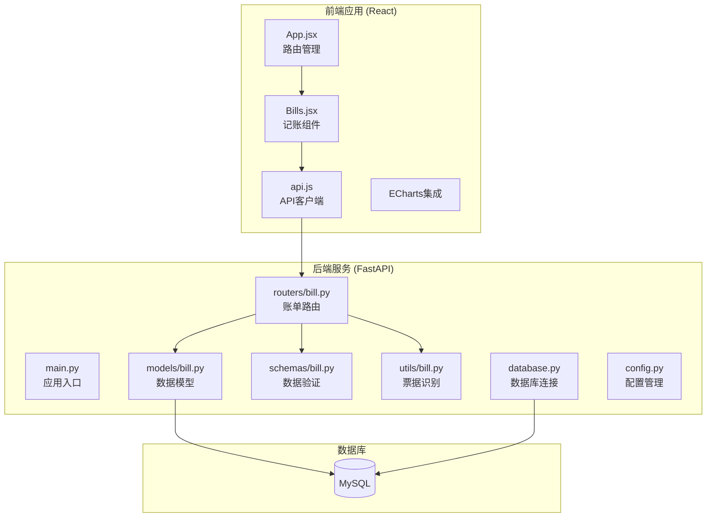
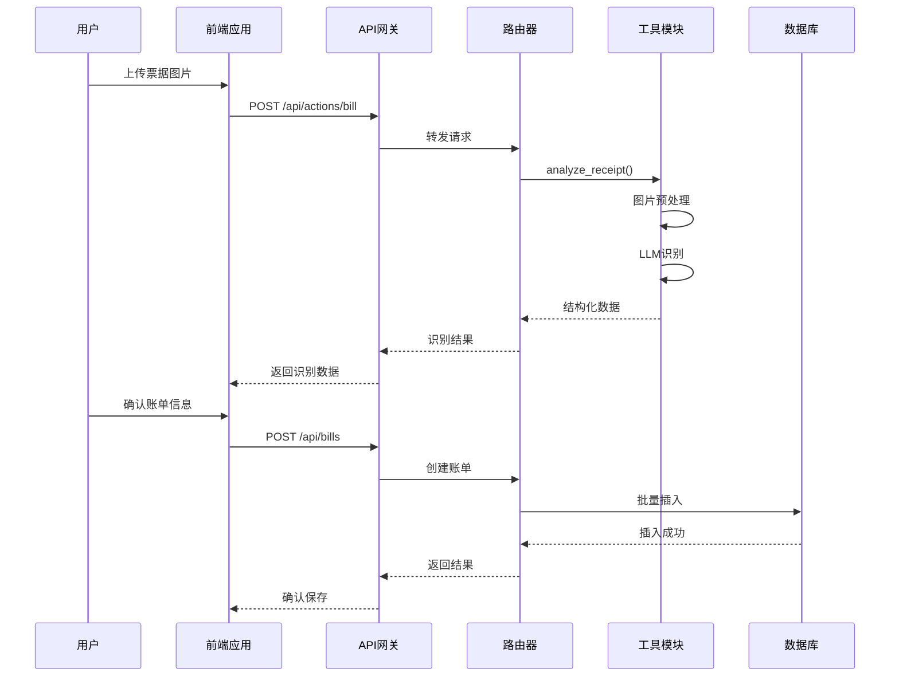
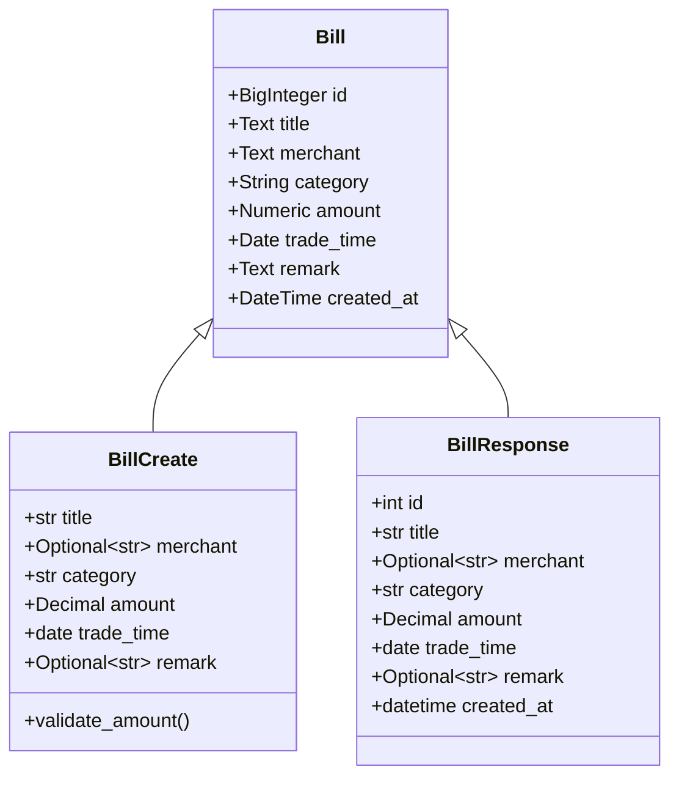
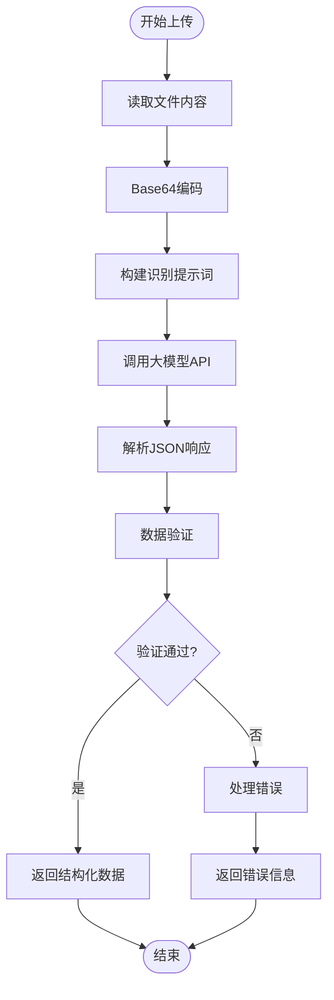
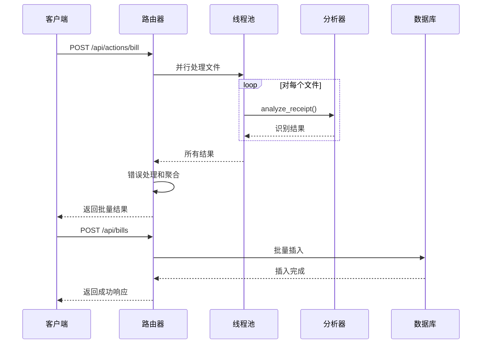
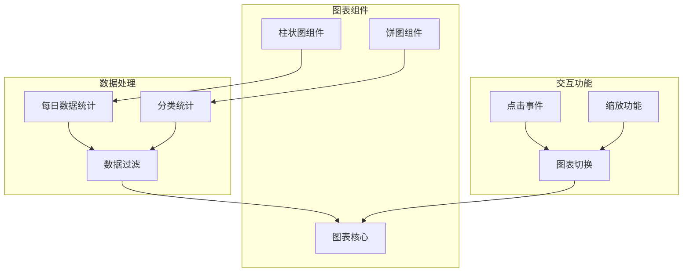
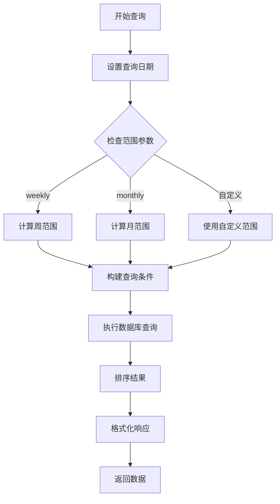
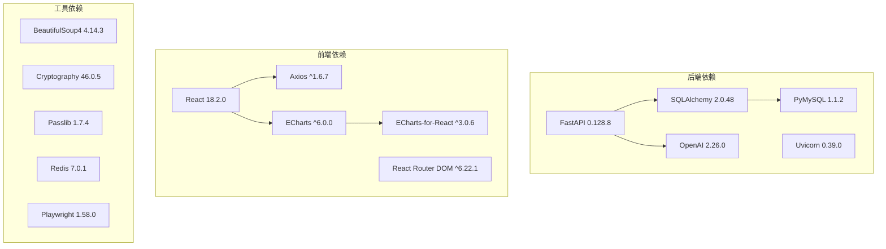

# 智能记账系统

<cite>
**本文档引用的文件**
- [main.py](file://blog_backend/main.py)
- [database.py](file://blog_backend/database.py)
- [models/bill.py](file://blog_backend/models/bill.py)
- [schemas/bill.py](file://blog_backend/schemas/bill.py)
- [routers/bill.py](file://blog_backend/routers/bill.py)
- [utils/bill.py](file://blog_backend/utils/bill.py)
- [config.py](file://blog_backend/config.py)
- [init_db.py](file://blog_backend/init_db.py)
- [pyproject.toml](file://blog_backend/pyproject.toml)
- [Bills.jsx](file://blog_frontend/src/components/Bills.jsx)
- [api.js](file://blog_frontend/src/api.js)
- [App.jsx](file://blog_frontend/src/App.jsx)
- [package.json](file://blog_frontend/package.json)
</cite>

## 目录
1. [简介](#简介)
2. [项目结构](#项目结构)
3. [核心组件](#核心组件)
4. [架构概览](#架构概览)
5. [详细组件分析](#详细组件分析)
6. [依赖分析](#依赖分析)
7. [性能考虑](#性能考虑)
8. [故障排除指南](#故障排除指南)
9. [结论](#结论)
10. [附录](#附录)

## 简介
智能记账系统是一个基于FastAPI后端和React前端的现代化财务管理应用。系统提供完整的账单管理功能，包括智能票据识别、Excel文件解析、数据格式验证和批量导入处理。通过ECharts图表集成，系统实现了收支趋势分析、类别占比统计等数据分析功能，并支持数据导出和备份机制。

## 项目结构
系统采用前后端分离架构，后端使用Python FastAPI框架，前端使用React技术栈，数据库采用MySQL。

**图表来源**
- [main.py:1-13](file://blog_backend/main.py#L1-L13)
- [routers/bill.py:1-173](file://blog_backend/routers/bill.py#L1-L173)
- [models/bill.py:1-24](file://blog_backend/models/bill.py#L1-L24)
- [Bills.jsx:1-539](file://blog_frontend/src/components/Bills.jsx#L1-L539)

**章节来源**
- [main.py:1-13](file://blog_backend/main.py#L1-L13)
- [pyproject.toml:1-22](file://blog_backend/pyproject.toml#L1-L22)
- [package.json:1-28](file://blog_frontend/package.json#L1-L28)

## 核心组件
系统的核心组件包括数据模型层、业务逻辑层、API接口层和前端展示层。

### 数据模型层
账单数据模型定义了完整的财务记录结构，支持多种分类和金额计算。

### 业务逻辑层
包含票据识别算法、数据验证规则和批量处理逻辑。

### API接口层
提供RESTful API接口，支持账单的增删改查和批量操作。

### 前端展示层
集成ECharts图表，提供交互式的可视化界面。

**章节来源**
- [models/bill.py:1-24](file://blog_backend/models/bill.py#L1-L24)
- [schemas/bill.py:1-40](file://blog_backend/schemas/bill.py#L1-L40)
- [routers/bill.py:1-173](file://blog_backend/routers/bill.py#L1-L173)

## 架构概览

**图表来源**
- [routers/bill.py:24-51](file://blog_backend/routers/bill.py#L24-L51)
- [utils/bill.py:17-76](file://blog_backend/utils/bill.py#L17-L76)
- [Bills.jsx:222-284](file://blog_frontend/src/components/Bills.jsx#L222-L284)

系统采用分层架构设计，确保了良好的可维护性和扩展性。

## 详细组件分析

### 账单数据模型设计

**图表来源**
- [models/bill.py:7-17](file://blog_backend/models/bill.py#L7-L17)
- [schemas/bill.py:7-39](file://blog_backend/schemas/bill.py#L7-L39)

系统使用SQLAlchemy ORM定义数据模型，支持完整的数据类型约束和验证规则。

**章节来源**
- [models/bill.py:1-24](file://blog_backend/models/bill.py#L1-L24)
- [schemas/bill.py:1-40](file://blog_backend/schemas/bill.py#L1-L40)

### 票据识别与解析流程

**图表来源**
- [utils/bill.py:17-76](file://blog_backend/utils/bill.py#L17-L76)
- [utils/bill.py:78-107](file://blog_backend/utils/bill.py#L78-L107)

系统集成了阿里云DashScope的大模型服务，通过精心设计的提示词工程实现高精度的票据识别。

**章节来源**
- [utils/bill.py:1-107](file://blog_backend/utils/bill.py#L1-L107)

### 批量导入处理机制

**图表来源**
- [routers/bill.py:24-51](file://blog_backend/routers/bill.py#L24-L51)
- [routers/bill.py:55-116](file://blog_backend/routers/bill.py#L55-L116)

系统采用异步并发处理策略，显著提升了大批量文件处理的效率。

**章节来源**
- [routers/bill.py:1-173](file://blog_backend/routers/bill.py#L1-L173)

### ECharts图表集成

**图表来源**
- [Bills.jsx:52-207](file://blog_frontend/src/components/Bills.jsx#L52-L207)

系统提供了两种主要的可视化图表：每日趋势柱状图和分类占比饼图，支持交互式数据探索。

**章节来源**
- [Bills.jsx:1-539](file://blog_frontend/src/components/Bills.jsx#L1-L539)

### 数据查询与统计功能

**图表来源**
- [routers/bill.py:117-173](file://blog_backend/routers/bill.py#L117-L173)

系统支持灵活的时间维度查询，包括日、周、月等多种统计周期。

**章节来源**
- [routers/bill.py:117-173](file://blog_backend/routers/bill.py#L117-L173)

## 依赖分析

**图表来源**
- [pyproject.toml:7-21](file://blog_backend/pyproject.toml#L7-L21)
- [package.json:11-19](file://blog_frontend/package.json#L11-L19)

系统依赖管理清晰，前后端分离架构确保了技术栈的独立性和可维护性。

**章节来源**
- [pyproject.toml:1-22](file://blog_backend/pyproject.toml#L1-L22)
- [package.json:1-28](file://blog_frontend/package.json#L1-L28)

## 性能考虑
- 异步并发处理：使用线程池处理多个文件识别任务，提升批量处理效率
- 数据库优化：采用批量插入和索引优化，减少数据库操作开销
- 前端缓存：利用React.memo和useMemo优化渲染性能
- 图表优化：ECharts按需渲染，避免不必要的重绘操作

## 故障排除指南

### 常见问题及解决方案

**票据识别失败**
- 检查网络连接和API密钥配置
- 确认图片格式和尺寸要求
- 验证大模型服务可用性

**数据库连接异常**
- 检查数据库URL配置
- 验证数据库服务状态
- 确认用户权限设置

**前端图表显示问题**
- 检查ECharts库版本兼容性
- 验证数据格式正确性
- 确认容器尺寸设置

**章节来源**
- [utils/bill.py:75-76](file://blog_backend/utils/bill.py#L75-L76)
- [config.py:3-11](file://blog_backend/config.py#L3-L11)

## 结论
智能记账系统通过先进的技术架构和完善的业务功能，为用户提供了一站式的财务管理解决方案。系统具备强大的票据识别能力、丰富的数据分析功能和直观的可视化界面，能够满足现代用户的多样化需求。

## 附录

### API接口规范

**账单识别接口**
- 方法：POST `/api/actions/bill`
- 参数：multipart/form-data，支持多文件上传
- 返回：识别后的账单数据数组

**账单创建接口**
- 方法：POST `/api/bills`
- 参数：单个或数组形式的账单数据
- 返回：创建结果和数据详情

**账单查询接口**
- 方法：GET `/api/bills`
- 参数：date_range（weekly/monthly）、query_date、start_date、end_date
- 返回：指定范围内的账单列表

### 数据格式规范

**账单数据结构**
- title：商品名称或交易标题，必填
- merchant：商户名称，可选
- category：消费分类，必填
- amount：金额，必填，最多2位小数
- trade_time：交易时间，必填
- remark：备注，可选

**章节来源**
- [routers/bill.py:24-173](file://blog_backend/routers/bill.py#L24-L173)
- [schemas/bill.py:7-39](file://blog_backend/schemas/bill.py#L7-L39)