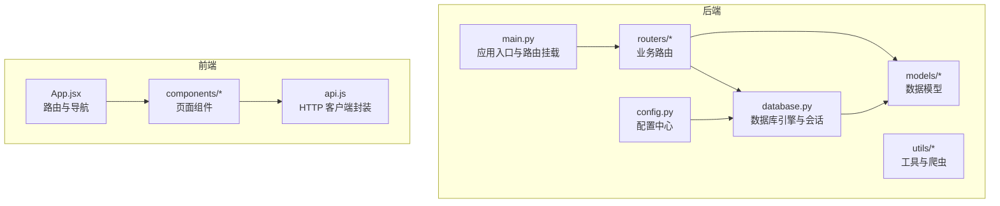
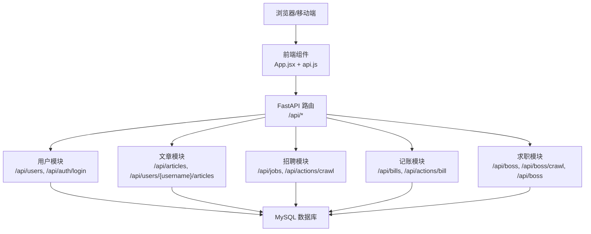
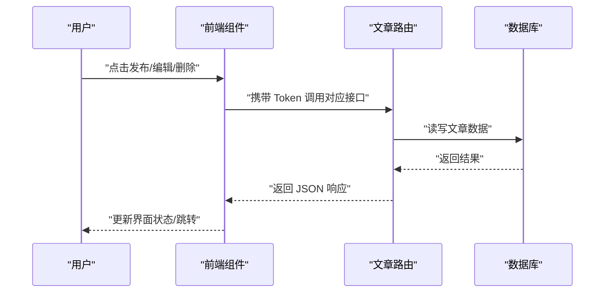
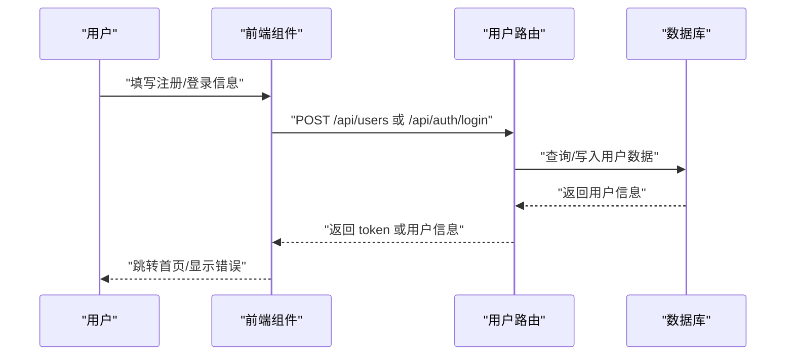
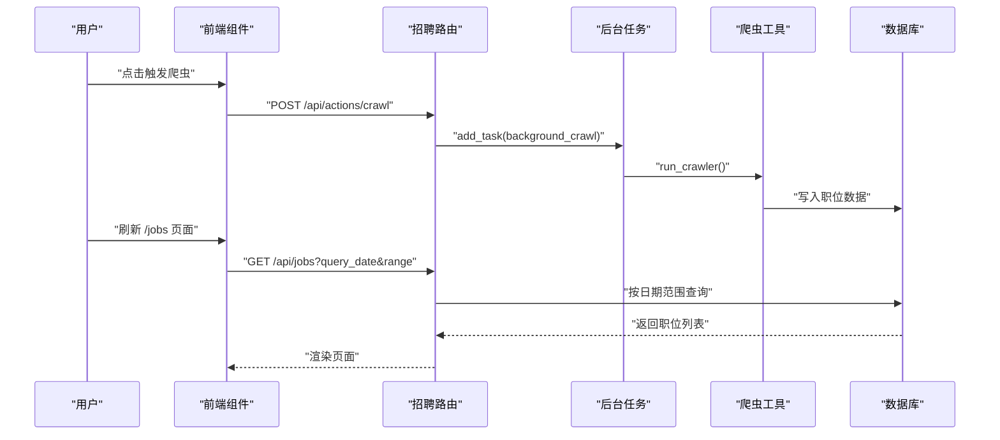
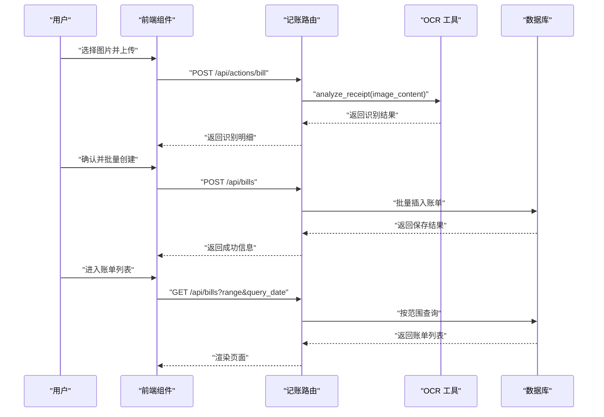
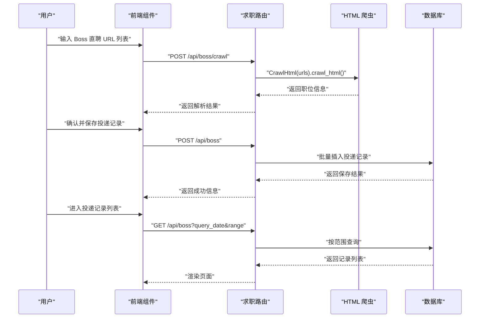
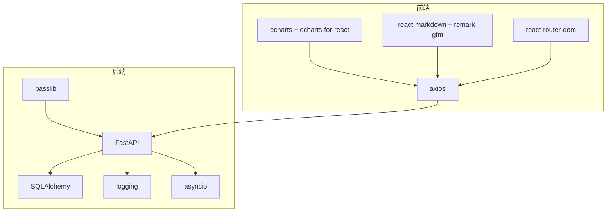

# 核心功能

<cite>
**本文引用的文件**
- [blog_backend/main.py](file://blog_backend/main.py)
- [blog_backend/config.py](file://blog_backend/config.py)
- [blog_backend/database.py](file://blog_backend/database.py)
- [blog_backend/routers/user.py](file://blog_backend/routers/user.py)
- [blog_backend/routers/article.py](file://blog_backend/routers/article.py)
- [blog_backend/routers/job.py](file://blog_backend/routers/job.py)
- [blog_backend/routers/bill.py](file://blog_backend/routers/bill.py)
- [blog_backend/routers/boss.py](file://blog_backend/routers/boss.py)
- [blog_backend/models/user.py](file://blog_backend/models/user.py)
- [blog_backend/models/article.py](file://blog_backend/models/article.py)
- [blog_backend/models/job.py](file://blog_backend/models/job.py)
- [blog_backend/models/bill.py](file://blog_backend/models/bill.py)
- [blog_backend/models/boss.py](file://blog_backend/models/boss.py)
- [blog_backend/utils/auth_token.py](file://blog_backend/utils/auth_token.py)
- [blog_backend/utils/bill.py](file://blog_backend/utils/bill.py)
- [blog_backend/utils/crawl.py](file://blog_backend/utils/crawl.py)
- [blog_backend/utils/crawl_html.py](file://blog_backend/utils/crawl_html.py)
- [blog_frontend/src/App.jsx](file://blog_frontend/src/App.jsx)
- [blog_frontend/package.json](file://blog_frontend/package.json)
- [blog_frontend/src/components/Login.jsx](file://blog_frontend/src/components/Login.jsx)
- [blog_frontend/src/components/Register.jsx](file://blog_frontend/src/components/Register.jsx)
- [blog_frontend/src/components/ArticleList.jsx](file://blog_frontend/src/components/ArticleList.jsx)
- [blog_frontend/src/components/Publish.jsx](file://blog_frontend/src/components/Publish.jsx)
- [blog_frontend/src/components/ArticleDetail.jsx](file://blog_frontend/src/components/ArticleDetail.jsx)
- [blog_frontend/src/components/ArticleEdit.jsx](file://blog_frontend/src/components/ArticleEdit.jsx)
- [blog_frontend/src/components/UserSearch.jsx](file://blog_frontend/src/components/UserSearch.jsx)
- [blog_frontend/src/components/UserHome.jsx](file://blog_frontend/src/components/UserHome.jsx)
- [blog_frontend/src/components/Jobs.jsx](file://blog_frontend/src/components/Jobs.jsx)
- [blog_frontend/src/components/Bills.jsx](file://blog_frontend/src/components/Bills.jsx)
- [blog_frontend/src/components/Boss.jsx](file://blog_frontend/src/components/Boss.jsx)
- [blog_frontend/src/api.js](file://blog_frontend/src/api.js)
</cite>

## 目录
1. [简介](#简介)
2. [项目结构](#项目结构)
3. [核心组件](#核心组件)
4. [架构总览](#架构总览)
5. [详细组件分析](#详细组件分析)
6. [依赖分析](#依赖分析)
7. [性能考虑](#性能考虑)
8. [故障排查指南](#故障排查指南)
9. [结论](#结论)
10. [附录](#附录)

## 简介
本项目是一个前后端分离的综合型应用，包含以下核心功能模块：
- 博客文章管理：支持文章发布、编辑、删除、分页浏览与详情查看。
- 用户管理：支持用户注册、登录认证、用户搜索与个人主页。
- 招聘信息系统：支持招聘信息爬取、数据存储、按日期范围查询与展示。
- 智能记账系统：支持账单图片上传识别、批量创建账单、按时间范围查询与展示。
- 求职投递系统：支持Boss直聘数据爬取、投递记录保存、按日期范围查询与展示。

系统采用 FastAPI 作为后端框架，React + Vite 作为前端框架，数据库通过 SQLAlchemy 进行 ORM 映射，使用 MySQL 作为持久化存储。

## 项目结构
后端采用“路由层-模型层-工具层”分层架构；前端采用组件化路由组织方式，通过 axios 与后端 API 交互。

**图示来源**
- [blog_backend/main.py:1-13](file://blog_backend/main.py#L1-L13)
- [blog_backend/config.py:1-32](file://blog_backend/config.py#L1-L32)
- [blog_backend/database.py:1-18](file://blog_backend/database.py#L1-L18)
- [blog_frontend/src/App.jsx:1-79](file://blog_frontend/src/App.jsx#L1-L79)

**章节来源**
- [blog_backend/main.py:1-13](file://blog_backend/main.py#L1-L13)
- [blog_backend/config.py:1-32](file://blog_backend/config.py#L1-L32)
- [blog_backend/database.py:1-18](file://blog_backend/database.py#L1-L18)
- [blog_frontend/src/App.jsx:1-79](file://blog_frontend/src/App.jsx#L1-L79)

## 核心组件
- 应用入口与路由挂载：在应用启动时挂载用户、文章、招聘、记账、求职五个模块的路由前缀与标签。
- 数据库连接与会话：统一创建数据库引擎、会话工厂与 Base，提供依赖注入 get_db。
- 配置中心：集中管理数据库连接串、默认头像、JWT 密钥算法、爬虫基础地址与目标文件路径、邮件配置开关等。
- 工具与爬虫：提供认证令牌生成、账单识别、招聘信息爬取、Boss直聘 HTML 爬取等能力。

**章节来源**
- [blog_backend/main.py:1-13](file://blog_backend/main.py#L1-L13)
- [blog_backend/config.py:1-32](file://blog_backend/config.py#L1-L32)
- [blog_backend/database.py:1-18](file://blog_backend/database.py#L1-L18)
- [blog_backend/utils/auth_token.py](file://blog_backend/utils/auth_token.py)
- [blog_backend/utils/bill.py](file://blog_backend/utils/bill.py)
- [blog_backend/utils/crawl.py](file://blog_backend/utils/crawl.py)
- [blog_backend/utils/crawl_html.py](file://blog_backend/utils/crawl_html.py)

## 架构总览
后端通过 APIRouter 将各模块路由挂载至 /api 前缀，前端通过 axios 统一封装请求，组件内调用 API 并渲染视图。

**图示来源**
- [blog_backend/main.py:6-10](file://blog_backend/main.py#L6-L10)
- [blog_backend/routers/user.py:15-101](file://blog_backend/routers/user.py#L15-L101)
- [blog_backend/routers/article.py:11-85](file://blog_backend/routers/article.py#L11-L85)
- [blog_backend/routers/job.py:17-76](file://blog_backend/routers/job.py#L17-L76)
- [blog_backend/routers/bill.py:24-173](file://blog_backend/routers/bill.py#L24-L173)
- [blog_backend/routers/boss.py:16-134](file://blog_backend/routers/boss.py#L16-L134)

## 详细组件分析

### 博客文章管理
- 功能概述
  - 发布文章：需要登录态，绑定当前用户 ID。
  - 编辑文章：仅作者可编辑，校验用户身份。
  - 删除文章：仅作者可删除，校验用户身份。
  - 文章列表：按用户分页查询其文章，支持页码与条数。
  - 文章详情：根据文章 ID 查询并返回作者名。
- 关键接口
  - POST /api/articles：发布文章
  - PUT /api/articles/{article_id}：编辑文章
  - DELETE /api/articles/{article_id}：删除文章
  - GET /api/users/{username}/articles：按用户分页查询文章
  - GET /api/articles/{article_id}：获取文章详情
- 前端组件
  - 发布页面：Publish.jsx
  - 编辑页面：ArticleEdit.jsx
  - 列表页面：ArticleList.jsx
  - 详情页面：ArticleDetail.jsx
- 用户体验设计
  - 登录态限制：未登录用户不可访问发布/编辑/删除页面。
  - 权限校验：编辑/删除按钮仅在当前用户为作者时显示。
  - 分页加载：列表支持分页参数，避免一次性加载过多数据。
  - Markdown 渲染：详情页可结合 react-markdown 展示富文本内容。
- 最佳实践
  - 内容安全：对标题、封面、内容进行长度与格式校验。
  - 性能优化：详情页懒加载图片，列表虚拟滚动。
  - 错误处理：捕获 404/403/500 并给出明确提示。

**图示来源**
- [blog_backend/routers/article.py:11-85](file://blog_backend/routers/article.py#L11-L85)
- [blog_frontend/src/components/Publish.jsx](file://blog_frontend/src/components/Publish.jsx)
- [blog_frontend/src/components/ArticleEdit.jsx](file://blog_frontend/src/components/ArticleEdit.jsx)
- [blog_frontend/src/components/ArticleList.jsx](file://blog_frontend/src/components/ArticleList.jsx)
- [blog_frontend/src/components/ArticleDetail.jsx](file://blog_frontend/src/components/ArticleDetail.jsx)

**章节来源**
- [blog_backend/routers/article.py:11-85](file://blog_backend/routers/article.py#L11-L85)
- [blog_frontend/src/components/Publish.jsx](file://blog_frontend/src/components/Publish.jsx)
- [blog_frontend/src/components/ArticleEdit.jsx](file://blog_frontend/src/components/ArticleEdit.jsx)
- [blog_frontend/src/components/ArticleList.jsx](file://blog_frontend/src/components/ArticleList.jsx)
- [blog_frontend/src/components/ArticleDetail.jsx](file://blog_frontend/src/components/ArticleDetail.jsx)

### 用户管理
- 功能概述
  - 注册：用户名唯一性校验，创建用户记录。
  - 登录：用户名存在性与密码匹配校验，签发 JWT。
  - 用户搜索：按用户名模糊查询，支持分页。
  - 个人信息：按用户 ID 查询基本信息。
- 关键接口
  - POST /api/users：用户注册
  - POST /api/auth/login：用户登录
  - GET /api/users?searchname=...&page=&size=：按用户名搜索
  - GET /api/users/{user_id}：获取用户信息
- 前端组件
  - 登录页面：Login.jsx
  - 注册页面：Register.jsx
  - 搜索页面：UserSearch.jsx
  - 个人主页：UserHome.jsx
- 用户体验设计
  - 登录态持久化：本地存储 token 与用户名，刷新后仍保持登录状态。
  - 导航联动：登录后显示发布入口与退出登录按钮。
  - 搜索建议：输入即查询，避免空查询。
- 最佳实践
  - 密码安全：当前实现为明文存储，建议迁移到哈希方案。
  - Token 安全：设置过期策略与刷新机制。
  - 输入校验：前后端共同校验用户名与密码长度与格式。

**图示来源**
- [blog_backend/routers/user.py:15-101](file://blog_backend/routers/user.py#L15-L101)
- [blog_frontend/src/components/Login.jsx](file://blog_frontend/src/components/Login.jsx)
- [blog_frontend/src/components/Register.jsx](file://blog_frontend/src/components/Register.jsx)
- [blog_frontend/src/components/UserSearch.jsx](file://blog_frontend/src/components/UserSearch.jsx)
- [blog_frontend/src/components/UserHome.jsx](file://blog_frontend/src/components/UserHome.jsx)

**章节来源**
- [blog_backend/routers/user.py:15-101](file://blog_backend/routers/user.py#L15-L101)
- [blog_frontend/src/components/Login.jsx](file://blog_frontend/src/components/Login.jsx)
- [blog_frontend/src/components/Register.jsx](file://blog_frontend/src/components/Register.jsx)
- [blog_frontend/src/components/UserSearch.jsx](file://blog_frontend/src/components/UserSearch.jsx)
- [blog_frontend/src/components/UserHome.jsx](file://blog_frontend/src/components/UserHome.jsx)

### 招聘信息系统
- 功能概述
  - 招聘数据爬取：支持触发后台爬虫任务，自动抓取指定站点的招聘信息并入库。
  - 数据存储：将职位标题、URL、发布时间、抓取时间、地区等信息持久化。
  - 数据展示：按日期范围（周/月）查询并返回职位列表。
- 关键接口
  - POST /api/actions/crawl：触发爬虫后台任务
  - GET /api/jobs?query_date=...&range=weekly|monthly：按日期范围查询职位
- 前端组件
  - 招聘信息页面：Jobs.jsx
- 用户体验设计
  - 时间范围切换：支持周/月两种筛选维度。
  - 异步加载：触发爬虫后提示“后台任务已启动”，稍后刷新查看结果。
- 最佳实践
  - 爬虫稳定性：设置超时与重试策略，记录日志便于排障。
  - 数据去重：URL 唯一键约束，避免重复入库。
  - 查询性能：对 publish_date、crawl_date 建立索引。

**图示来源**
- [blog_backend/routers/job.py:62-76](file://blog_backend/routers/job.py#L62-L76)
- [blog_backend/routers/job.py:17-61](file://blog_backend/routers/job.py#L17-L61)
- [blog_backend/utils/crawl.py](file://blog_backend/utils/crawl.py)
- [blog_frontend/src/components/Jobs.jsx](file://blog_frontend/src/components/Jobs.jsx)

**章节来源**
- [blog_backend/routers/job.py:17-76](file://blog_backend/routers/job.py#L17-L76)
- [blog_backend/utils/crawl.py](file://blog_backend/utils/crawl.py)
- [blog_frontend/src/components/Jobs.jsx](file://blog_frontend/src/components/Jobs.jsx)

### 智能记账系统
- 功能概述
  - 账单识别：支持多张图片上传，异步识别并返回账单明细。
  - 账单录入：支持单条或多条账单批量创建，包含标题、商户、分类、金额、交易时间、备注等。
  - 数据查询：支持按日期范围（日/周/月）查询账单并排序展示。
- 关键接口
  - POST /api/actions/bill：上传图片识别账单
  - POST /api/bills：创建账单（单条或批量）
  - GET /api/bills?range=weekly|monthly&query_date=...：按日期范围查询账单
- 前端组件
  - 记账页面：Bills.jsx
- 用户体验设计
  - 图片上传：支持多选图片，逐个识别并汇总结果。
  - 批量创建：识别完成后可批量提交保存。
  - 图表展示：结合 ECharts 展示分类统计与趋势。
- 最佳实践
  - 文件大小与类型限制：在前端与后端均做校验。
  - 事务一致性：批量创建使用 add_all 并统一 commit。
  - 排序规则：按交易时间倒序，必要时叠加主键降序保证稳定顺序。

**图示来源**
- [blog_backend/routers/bill.py:24-173](file://blog_backend/routers/bill.py#L24-L173)
- [blog_backend/utils/bill.py](file://blog_backend/utils/bill.py)
- [blog_frontend/src/components/Bills.jsx](file://blog_frontend/src/components/Bills.jsx)

**章节来源**
- [blog_backend/routers/bill.py:24-173](file://blog_backend/routers/bill.py#L24-L173)
- [blog_backend/utils/bill.py](file://blog_backend/utils/bill.py)
- [blog_frontend/src/components/Bills.jsx](file://blog_frontend/src/components/Bills.jsx)

### 求职投递系统
- 功能概述
  - Boss直聘数据爬取：接收 URL 列表，解析 HTML 提取职位信息并返回。
  - 投递记录保存：支持单条或多条投递记录批量保存，包含标题、URL、详情、地区、抓取时间等。
  - 进度跟踪：按日期范围（周/月）查询投递记录并展示。
- 关键接口
  - POST /api/boss/crawl：解析 URL 列表并返回职位信息
  - POST /api/boss：保存投递记录（单条或批量）
  - GET /api/boss?query_date=...&range=weekly|monthly：按日期范围查询投递记录
- 前端组件
  - 求职页面：Boss.jsx
- 用户体验设计
  - URL 输入：支持粘贴多个 URL，批量解析。
  - 去重保护：对重复 URL 进行冲突提示。
  - 时间筛选：支持周/月维度快速定位投递记录。
- 最佳实践
  - 数据完整性：对必填字段进行校验，异常时回滚事务。
  - 爬虫健壮性：对网络异常与解析异常进行捕获与日志记录。
  - 去重策略：基于 URL 唯一性约束，避免重复投递记录。

**图示来源**
- [blog_backend/routers/boss.py:16-134](file://blog_backend/routers/boss.py#L16-L134)
- [blog_backend/utils/crawl_html.py](file://blog_backend/utils/crawl_html.py)
- [blog_frontend/src/components/Boss.jsx](file://blog_frontend/src/components/Boss.jsx)

**章节来源**
- [blog_backend/routers/boss.py:16-134](file://blog_backend/routers/boss.py#L16-L134)
- [blog_backend/utils/crawl_html.py](file://blog_backend/utils/crawl_html.py)
- [blog_frontend/src/components/Boss.jsx](file://blog_frontend/src/components/Boss.jsx)

## 依赖分析
- 后端依赖
  - FastAPI：提供路由与依赖注入。
  - SQLAlchemy：ORM 映射与数据库会话管理。
  - passlib：密码处理（当前用于用户模块，注意实际实现为明文存储，建议迁移）。
  - 其他：logging、calendar、datetime、asyncio 等。
- 前端依赖
  - axios：HTTP 请求封装。
  - echarts / echarts-for-react：图表展示。
  - react-markdown + remark-gfm：Markdown 渲染。
  - react-router-dom：前端路由与导航。

**图示来源**
- [blog_frontend/package.json:11-26](file://blog_frontend/package.json#L11-L26)
- [blog_backend/routers/user.py:7](file://blog_backend/routers/user.py#L7)

**章节来源**
- [blog_frontend/package.json:11-26](file://blog_frontend/package.json#L11-L26)
- [blog_backend/routers/user.py:7](file://blog_backend/routers/user.py#L7)

## 性能考虑
- 数据库层面
  - 为常用查询字段建立索引：Job.publish_date、Job.crawl_date、Bill.trade_time、Boss.crawl_date。
  - 使用分页查询避免一次性加载大量数据。
  - 批量插入使用 add_all 提升写入效率。
- 爬虫与 OCR
  - 爬虫任务使用后台任务异步执行，避免阻塞主线程。
  - OCR 识别在独立线程池执行，避免阻塞事件循环。
- 前端层面
  - 列表组件使用虚拟滚动与懒加载减少 DOM 压力。
  - 图表组件按需渲染，避免不必要的重绘。
- 安全与稳定性
  - 对外暴露的接口增加速率限制与输入校验。
  - 日志记录爬虫与 OCR 的异常，便于追踪问题。

## 故障排查指南
- 用户相关
  - 注册失败：检查用户名是否唯一，后端会返回“用户名已存在”。
  - 登录失败：检查用户名是否存在与密码是否匹配。
- 文章相关
  - 编辑/删除失败：确认当前用户是否为文章作者，否则返回“没有权限”。
  - 文章不存在：接口返回 404，检查文章 ID。
- 招聘与求职
  - 爬虫任务未执行：确认后台任务是否被触发，查看日志输出。
  - 重复数据：Boss 模块对 URL 唯一性冲突会返回 409。
- 记账
  - OCR 识别失败：检查图片格式与清晰度，查看返回的错误信息。
  - 批量创建失败：查看数据库回滚日志，修正字段后再试。

**章节来源**
- [blog_backend/routers/user.py:19-46](file://blog_backend/routers/user.py#L19-L46)
- [blog_backend/routers/article.py:57-84](file://blog_backend/routers/article.py#L57-L84)
- [blog_backend/routers/job.py:62-76](file://blog_backend/routers/job.py#L62-L76)
- [blog_backend/routers/boss.py:73-84](file://blog_backend/routers/boss.py#L73-L84)
- [blog_backend/routers/bill.py:24-51](file://blog_backend/routers/bill.py#L24-L51)

## 结论
本项目通过清晰的模块划分与前后端分离架构，实现了从内容管理到求职辅助的一体化解决方案。建议后续重点完善：
- 用户密码加密与 Token 安全策略。
- 数据库索引与查询优化。
- 爬虫与 OCR 的稳定性与容错。
- 前端组件的国际化与无障碍支持。

## 附录
- API 使用示例（路径参考）
  - 用户注册：POST /api/users
  - 用户登录：POST /api/auth/login
  - 发布文章：POST /api/articles
  - 编辑文章：PUT /api/articles/{article_id}
  - 删除文章：DELETE /api/articles/{article_id}
  - 查询文章列表：GET /api/users/{username}/articles?page=&size=
  - 查询文章详情：GET /api/articles/{article_id}
  - 触发爬虫：POST /api/actions/crawl
  - 查询招聘：GET /api/jobs?query_date=&range=
  - 账单识别：POST /api/actions/bill
  - 创建账单：POST /api/bills
  - 查询账单：GET /api/bills?range=&query_date=
  - 抓取 Boss 职位：POST /api/boss/crawl
  - 保存投递记录：POST /api/boss
  - 查询投递记录：GET /api/boss?query_date=&range=
- 前端组件与路由
  - 登录/注册：Login.jsx、Register.jsx
  - 文章：ArticleList.jsx、Publish.jsx、ArticleDetail.jsx、ArticleEdit.jsx
  - 用户：UserSearch.jsx、UserHome.jsx
  - 招聘：Jobs.jsx
  - 记账：Bills.jsx
  - 求职：Boss.jsx
  - 路由与导航：App.jsx
  - HTTP 封装：api.js