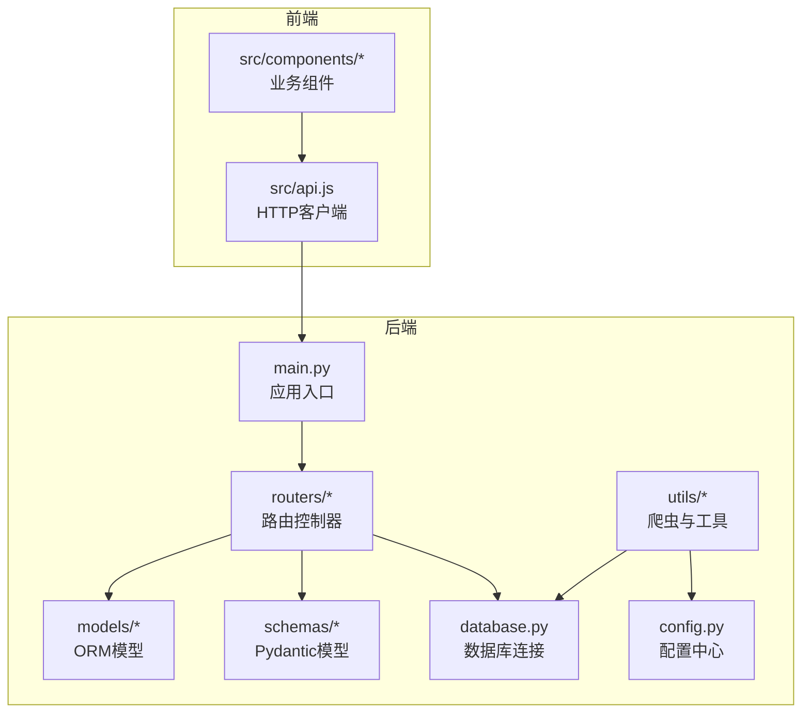
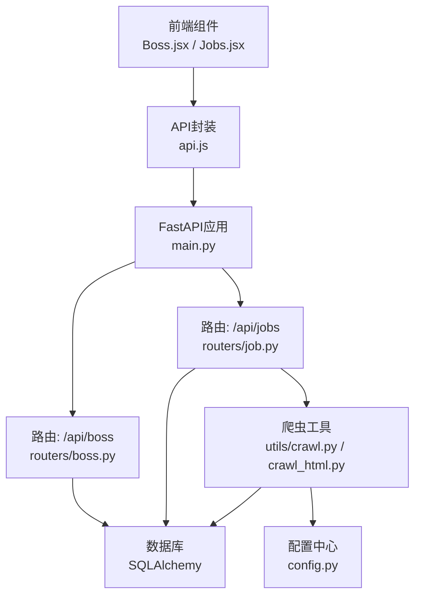
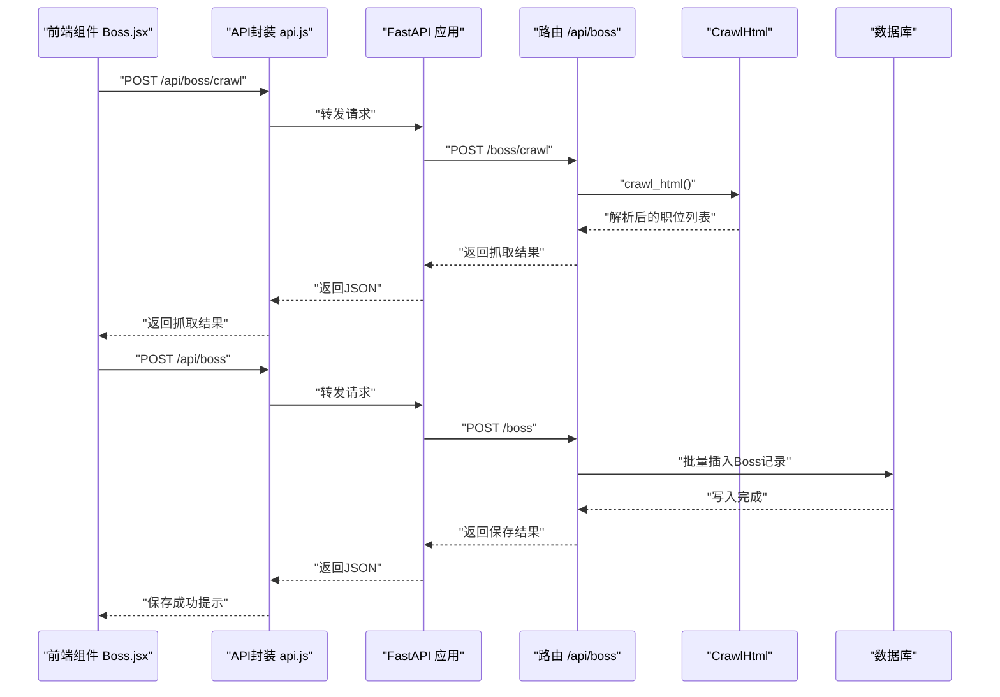
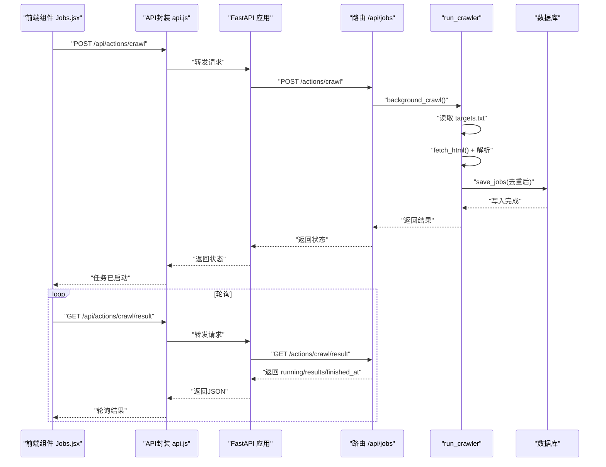
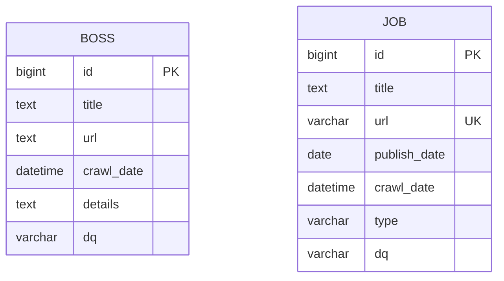
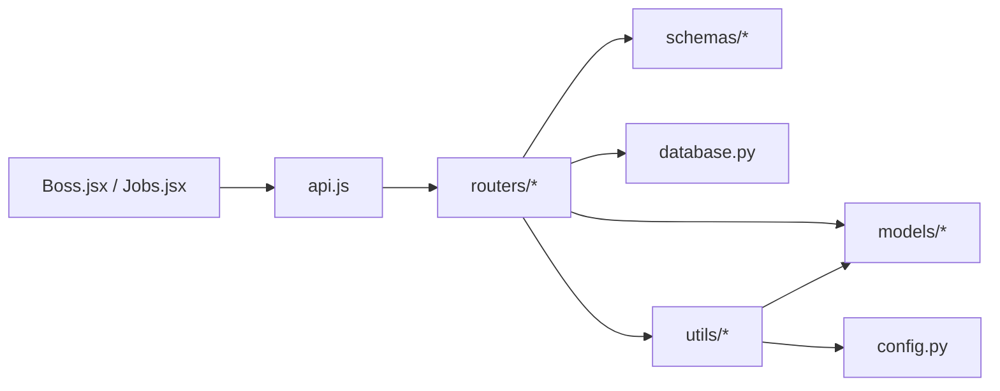

# 求职投递系统

<cite>
**本文引用的文件**
- [blog_backend/main.py](file://blog_backend/main.py)
- [blog_backend/database.py](file://blog_backend/database.py)
- [blog_backend/config.py](file://blog_backend/config.py)
- [blog_backend/models/boss.py](file://blog_backend/models/boss.py)
- [blog_backend/models/job.py](file://blog_backend/models/job.py)
- [blog_backend/schemas/boss.py](file://blog_backend/schemas/boss.py)
- [blog_backend/routers/boss.py](file://blog_backend/routers/boss.py)
- [blog_backend/routers/job.py](file://blog_backend/routers/job.py)
- [blog_backend/utils/crawl.py](file://blog_backend/utils/crawl.py)
- [blog_backend/utils/crawl_html.py](file://blog_backend/utils/crawl_html.py)
- [blog_backend/targets.txt](file://blog_backend/targets.txt)
- [blog_backend/default.conf](file://blog_backend/default.conf)
- [blog_frontend/src/api.js](file://blog_frontend/src/api.js)
- [blog_frontend/src/components/Boss.jsx](file://blog_frontend/src/components/Boss.jsx)
- [blog_frontend/src/components/Jobs.jsx](file://blog_frontend/src/components/Jobs.jsx)
</cite>

## 目录
1. [简介](#简介)
2. [项目结构](#项目结构)
3. [核心组件](#核心组件)
4. [架构总览](#架构总览)
5. [详细组件分析](#详细组件分析)
6. [依赖分析](#依赖分析)
7. [性能考虑](#性能考虑)
8. [故障排查指南](#故障排查指南)
9. [结论](#结论)
10. [附录](#附录)

## 简介
本系统围绕“求职投递”场景构建，提供以下能力：
- Boss直聘数据爬取与投递记录管理：支持多链接批量抓取、数据清洗与入库、投递状态与时间线记录。
- 招聘信息爬取与分析：基于Playwright与BeautifulSoup解析，支持增量爬取、邮件通知、按周/月统计与可视化。
- 求职进度跟踪：通过投递记录与招聘数据联动，形成时间线与统计视图。
- 数据同步机制：定时/手动触发爬取、增量过滤、数据库一致性保障。

系统采用前后端分离架构：后端使用FastAPI + SQLAlchemy，前端使用React + ECharts进行可视化展示。

## 项目结构
后端采用分层组织：入口应用、路由层、模型层、数据访问层、工具层；前端采用组件化组织，通过Axios封装API调用。

**图表来源**
- [blog_backend/main.py:1-13](file://blog_backend/main.py#L1-L13)
- [blog_backend/routers/boss.py:1-134](file://blog_backend/routers/boss.py#L1-L134)
- [blog_backend/routers/job.py:1-97](file://blog_backend/routers/job.py#L1-L97)
- [blog_backend/models/boss.py:1-15](file://blog_backend/models/boss.py#L1-L15)
- [blog_backend/models/job.py:1-15](file://blog_backend/models/job.py#L1-L15)
- [blog_backend/schemas/boss.py:1-14](file://blog_backend/schemas/boss.py#L1-L14)
- [blog_backend/database.py:1-18](file://blog_backend/database.py#L1-L18)
- [blog_backend/config.py:1-32](file://blog_backend/config.py#L1-L32)
- [blog_frontend/src/api.js:1-40](file://blog_frontend/src/api.js#L1-L40)
- [blog_frontend/src/components/Boss.jsx:1-145](file://blog_frontend/src/components/Boss.jsx#L1-L145)
- [blog_frontend/src/components/Jobs.jsx:1-362](file://blog_frontend/src/components/Jobs.jsx#L1-L362)

**章节来源**
- [blog_backend/main.py:1-13](file://blog_backend/main.py#L1-L13)
- [blog_backend/routers/boss.py:1-134](file://blog_backend/routers/boss.py#L1-L134)
- [blog_backend/routers/job.py:1-97](file://blog_backend/routers/job.py#L1-L97)
- [blog_frontend/src/components/Boss.jsx:1-145](file://blog_frontend/src/components/Boss.jsx#L1-L145)
- [blog_frontend/src/components/Jobs.jsx:1-362](file://blog_frontend/src/components/Jobs.jsx#L1-L362)

## 核心组件
- 应用入口与路由注册：在应用入口集中注册用户、文章、招聘、记账、求职相关路由，统一前缀与标签。
- 数据模型：
  - Boss：存储投递记录（标题、链接、详情、地区、抓取时间）。
  - Job：存储招聘职位（标题、链接唯一、发布日期、抓取时间、类型、地区）。
- Pydantic模型：BossCreate用于接口入参校验与默认值处理。
- 路由器：
  - /api/boss：提供Boss直聘抓取与投递记录的增删改查、时间范围查询。
  - /api/jobs：提供招聘职位的按日期范围查询、后台爬取触发与结果轮询。
- 爬虫工具：
  - crawl.py：基于Playwright渲染、BeautifulSoup解析、增量过滤、数据库批量写入、邮件通知。
  - crawl_html.py：针对Boss直聘的简单HTML抓取与清洗。
- 前端组件：
  - Boss.jsx：批量输入链接、抓取、预览、保存为投递记录。
  - Jobs.jsx：触发爬取、轮询结果、按周/月统计、柱状图展示、按日期筛选。

**章节来源**
- [blog_backend/models/boss.py:1-15](file://blog_backend/models/boss.py#L1-L15)
- [blog_backend/models/job.py:1-15](file://blog_backend/models/job.py#L1-L15)
- [blog_backend/schemas/boss.py:1-14](file://blog_backend/schemas/boss.py#L1-L14)
- [blog_backend/routers/boss.py:1-134](file://blog_backend/routers/boss.py#L1-L134)
- [blog_backend/routers/job.py:1-97](file://blog_backend/routers/job.py#L1-L97)
- [blog_backend/utils/crawl.py:1-445](file://blog_backend/utils/crawl.py#L1-L445)
- [blog_backend/utils/crawl_html.py:1-72](file://blog_backend/utils/crawl_html.py#L1-L72)
- [blog_frontend/src/components/Boss.jsx:1-145](file://blog_frontend/src/components/Boss.jsx#L1-L145)
- [blog_frontend/src/components/Jobs.jsx:1-362](file://blog_frontend/src/components/Jobs.jsx#L1-L362)

## 架构总览
系统采用“前端组件 + Axios API封装 + 后端FastAPI路由 + SQLAlchemy ORM + 爬虫工具”的分层架构。前端通过API封装统一访问后端，后端负责业务逻辑、数据持久化与爬虫调度。

**图表来源**
- [blog_backend/main.py:1-13](file://blog_backend/main.py#L1-L13)
- [blog_backend/routers/boss.py:1-134](file://blog_backend/routers/boss.py#L1-L134)
- [blog_backend/routers/job.py:1-97](file://blog_backend/routers/job.py#L1-L97)
- [blog_backend/database.py:1-18](file://blog_backend/database.py#L1-L18)
- [blog_backend/utils/crawl.py:1-445](file://blog_backend/utils/crawl.py#L1-L445)
- [blog_backend/utils/crawl_html.py:1-72](file://blog_backend/utils/crawl_html.py#L1-L72)
- [blog_backend/config.py:1-32](file://blog_backend/config.py#L1-L32)
- [blog_frontend/src/api.js:1-40](file://blog_frontend/src/api.js#L1-L40)

## 详细组件分析

### Boss直聘抓取与投递记录管理
- 功能要点
  - 批量抓取：前端输入多链接，后端使用CrawlHtml对每个链接进行请求、解析、清洗，返回标题、详情、地区、抓取时间。
  - 数据清洗：解析页面特定选择器，过滤空值，标准化输出字段。
  - 入库与去重：后端接收清洗后的数据，映射到Boss模型，批量写入数据库；若链接重复则抛出冲突异常。
  - 时间线与查询：支持按日期范围查询投递记录，按ID倒序展示。
- 关键流程（序列图）

**图表来源**
- [blog_frontend/src/components/Boss.jsx:1-145](file://blog_frontend/src/components/Boss.jsx#L1-L145)
- [blog_frontend/src/api.js:1-40](file://blog_frontend/src/api.js#L1-L40)
- [blog_backend/routers/boss.py:16-84](file://blog_backend/routers/boss.py#L16-L84)
- [blog_backend/utils/crawl_html.py:18-72](file://blog_backend/utils/crawl_html.py#L18-L72)
- [blog_backend/models/boss.py:1-15](file://blog_backend/models/boss.py#L1-L15)

**章节来源**
- [blog_backend/routers/boss.py:16-127](file://blog_backend/routers/boss.py#L16-L127)
- [blog_backend/utils/crawl_html.py:18-72](file://blog_backend/utils/crawl_html.py#L18-L72)
- [blog_frontend/src/components/Boss.jsx:11-56](file://blog_frontend/src/components/Boss.jsx#L11-L56)

### 招聘信息爬取与分析
- 功能要点
  - 规则驱动解析：根据URL关键字匹配解析规则，等待目标选择器加载后提取内容。
  - 增量爬取：读取targets.txt中的目标URL，对比数据库现有URL集合，仅处理新增条目。
  - 可视化统计：前端Jobs.jsx按周/月聚合柱状图，支持点击选中某日查看明细。
  - 结果轮询：后端提供后台任务状态与结果，前端定时轮询直到完成。
- 关键流程（序列图）

**图表来源**
- [blog_frontend/src/components/Jobs.jsx:155-198](file://blog_frontend/src/components/Jobs.jsx#L155-L198)
- [blog_frontend/src/api.js:26-28](file://blog_frontend/src/api.js#L26-L28)
- [blog_backend/routers/job.py:64-96](file://blog_backend/routers/job.py#L64-L96)
- [blog_backend/utils/crawl.py:368-440](file://blog_backend/utils/crawl.py#L368-L440)
- [blog_backend/targets.txt:1-5](file://blog_backend/targets.txt#L1-L5)

**章节来源**
- [blog_backend/routers/job.py:17-96](file://blog_backend/routers/job.py#L17-L96)
- [blog_backend/utils/crawl.py:19-52](file://blog_backend/utils/crawl.py#L19-L52)
- [blog_backend/utils/crawl.py:286-291](file://blog_backend/utils/crawl.py#L286-L291)
- [blog_backend/utils/crawl.py:295-313](file://blog_backend/utils/crawl.py#L295-L313)
- [blog_backend/utils/crawl.py:368-440](file://blog_backend/utils/crawl.py#L368-L440)
- [blog_frontend/src/components/Jobs.jsx:48-147](file://blog_frontend/src/components/Jobs.jsx#L48-L147)

### 数据模型与关系
- 数据模型
  - Boss：id、title、url、crawl_date、details、dq。
  - Job：id、title、url（唯一）、publish_date、crawl_date、type、dq。
- 关系图

**图表来源**
- [blog_backend/models/boss.py:1-15](file://blog_backend/models/boss.py#L1-L15)
- [blog_backend/models/job.py:1-15](file://blog_backend/models/job.py#L1-L15)

**章节来源**
- [blog_backend/models/boss.py:1-15](file://blog_backend/models/boss.py#L1-L15)
- [blog_backend/models/job.py:1-15](file://blog_backend/models/job.py#L1-L15)

### 前端交互与展示
- Boss.jsx
  - 输入多链接，调用后端抓取接口，展示抓取结果，支持删除单条、批量保存。
  - 保存时将crawl_time映射为crawl_date以兼容后端。
- Jobs.jsx
  - 提供“开始爬取”按钮，轮询后台任务结果，展示来源、状态、新增数量与消息。
  - 使用ECharts绘制按周/月的柱状图，支持点击选中某日查看明细。
  - 支持按日期范围切换与分页（当前版本移除分页栏）。

**章节来源**
- [blog_frontend/src/components/Boss.jsx:11-56](file://blog_frontend/src/components/Boss.jsx#L11-L56)
- [blog_frontend/src/components/Jobs.jsx:155-198](file://blog_frontend/src/components/Jobs.jsx#L155-L198)
- [blog_frontend/src/components/Jobs.jsx:48-147](file://blog_frontend/src/components/Jobs.jsx#L48-L147)

## 依赖分析
- 组件耦合
  - 路由器依赖数据库会话与模型；爬虫工具依赖配置与数据库会话。
  - 前端组件依赖API封装，API封装依赖后端路由。
- 外部依赖
  - 后端：FastAPI、SQLAlchemy、Playwright、BeautifulSoup、smtplib。
  - 前端：React、ECharts-for-React、Axios。

**图表来源**
- [blog_frontend/src/api.js:1-40](file://blog_frontend/src/api.js#L1-L40)
- [blog_backend/routers/boss.py:1-134](file://blog_backend/routers/boss.py#L1-L134)
- [blog_backend/routers/job.py:1-97](file://blog_backend/routers/job.py#L1-L97)
- [blog_backend/models/boss.py:1-15](file://blog_backend/models/boss.py#L1-L15)
- [blog_backend/models/job.py:1-15](file://blog_backend/models/job.py#L1-L15)
- [blog_backend/schemas/boss.py:1-14](file://blog_backend/schemas/boss.py#L1-L14)
- [blog_backend/database.py:1-18](file://blog_backend/database.py#L1-L18)
- [blog_backend/config.py:1-32](file://blog_backend/config.py#L1-L32)

**章节来源**
- [blog_backend/routers/boss.py:1-134](file://blog_backend/routers/boss.py#L1-L134)
- [blog_backend/routers/job.py:1-97](file://blog_backend/routers/job.py#L1-L97)
- [blog_frontend/src/api.js:1-40](file://blog_frontend/src/api.js#L1-L40)

## 性能考虑
- 爬取性能
  - Playwright渲染与等待目标选择器加载，建议合理设置超时与等待条件，避免长时间阻塞。
  - 增量过滤在内存中维护现有URL集合，注意URL数量增长带来的内存占用。
- 数据库性能
  - 批量写入与逐条回滚策略降低重复键错误对整体批次的影响。
  - 建议为常用查询字段建立索引（如publish_date、crawl_date）。
- 前端性能
  - 图表渲染与列表渲染在大数据量时需考虑虚拟滚动与懒加载。
  - 轮询频率建议控制在合理区间，避免频繁请求造成压力。

[本节为通用指导，无需具体文件分析]

## 故障排查指南
- 抓取失败
  - 检查目标页面是否可访问、选择器是否正确、等待超时是否合理。
  - 查看后端日志与异常堆栈，定位具体解析或网络问题。
- 重复链接入库
  - 后端对Boss.url做唯一约束，若出现冲突需检查输入链接或清理重复数据。
- 爬虫任务卡住
  - 前端确认轮询是否持续，后端确认background_crawl状态与finished_at是否更新。
- 邮件通知未发送
  - 检查邮箱配置开关与凭据，确认SMTP主机与端口可用。

**章节来源**
- [blog_backend/routers/boss.py:73-84](file://blog_backend/routers/boss.py#L73-L84)
- [blog_backend/routers/job.py:64-96](file://blog_backend/routers/job.py#L64-L96)
- [blog_backend/utils/crawl.py:315-367](file://blog_backend/utils/crawl.py#L315-L367)
- [blog_backend/config.py:23-31](file://blog_backend/config.py#L23-L31)

## 结论
本系统提供了从Boss直聘抓取到投递记录管理、从招聘信息爬取到可视化分析的完整链路。通过规则驱动的解析、增量爬取与邮件通知，提升了求职数据的时效性与可追踪性；通过前端图表与时间线展示，增强了求职进度的可视化与可操作性。后续可在反爬虫策略、任务调度与指标体系方面进一步完善。

[本节为总结性内容，无需具体文件分析]

## 附录

### 数据同步机制
- 定时更新：当前提供手动触发爬取与轮询结果的能力，可扩展为定时任务（如APScheduler）定期执行。
- 增量爬取：通过读取现有URL集合与解析结果比对，仅保存新增条目。
- 一致性保证：数据库事务与逐条回滚策略减少部分失败影响；URL唯一约束避免重复数据。

**章节来源**
- [blog_backend/utils/crawl.py:19-52](file://blog_backend/utils/crawl.py#L19-L52)
- [blog_backend/utils/crawl.py:409-430](file://blog_backend/utils/crawl.py#L409-L430)
- [blog_backend/routers/boss.py:33-84](file://blog_backend/routers/boss.py#L33-L84)

### 配置参数与使用指南
- 数据库连接
  - 通过环境变量拼接DATABASE_URL，支持DB_USER、DB_PASSWORD、DB_HOST、DB_PORT、DB_NAME。
- 爬虫基础配置
  - BASE_URL：基准URL，TARGETS_FILE：目标URL清单文件路径。
  - EMAIL_CONFIG：邮件通知开关与SMTP参数。
- 目标URL清单
  - targets.txt：按行列出待爬取的目标URL。
- Nginx代理配置
  - default.conf：将前端静态资源与后端API代理至宿主机对应端口，支持WebSocket热更新。

**章节来源**
- [blog_backend/config.py:3-11](file://blog_backend/config.py#L3-L11)
- [blog_backend/config.py:20-31](file://blog_backend/config.py#L20-L31)
- [blog_backend/targets.txt:1-5](file://blog_backend/targets.txt#L1-L5)
- [blog_backend/default.conf:1-27](file://blog_backend/default.conf#L1-L27)

### API参考
- 投递记录
  - POST /api/boss/crawl：批量抓取Boss直聘职位信息。
  - POST /api/boss：保存投递记录（支持单条或批量）。
  - GET /api/boss：按日期范围查询投递记录。
- 招聘信息
  - GET /api/jobs：按日期范围查询招聘职位。
  - POST /api/actions/crawl：触发后台爬取任务。
  - GET /api/actions/crawl/result：获取上次爬取结果与状态。

**章节来源**
- [blog_backend/routers/boss.py:16-127](file://blog_backend/routers/boss.py#L16-L127)
- [blog_backend/routers/job.py:17-96](file://blog_backend/routers/job.py#L17-L96)
- [blog_frontend/src/api.js:26-37](file://blog_frontend/src/api.js#L26-L37)