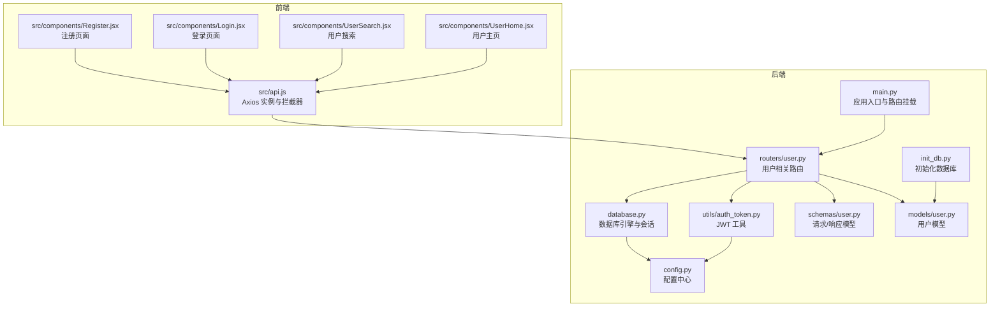
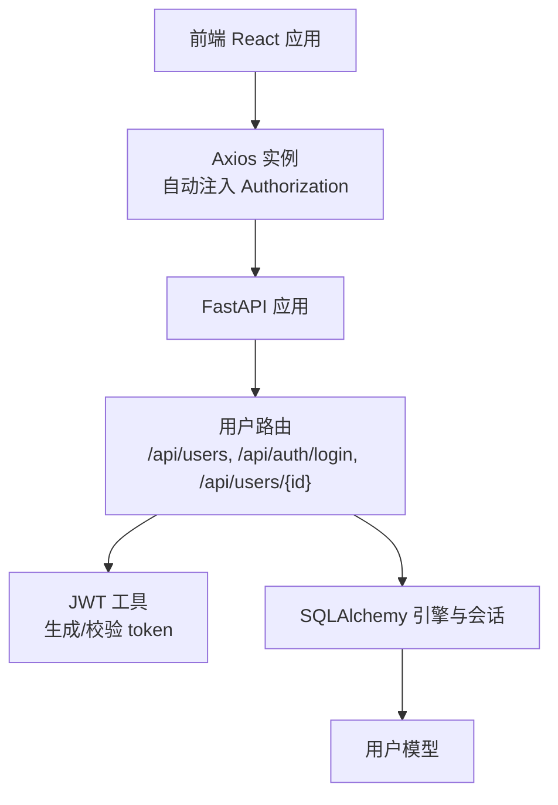
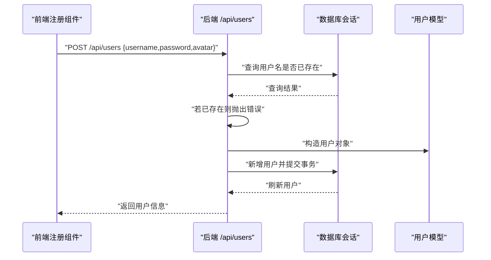
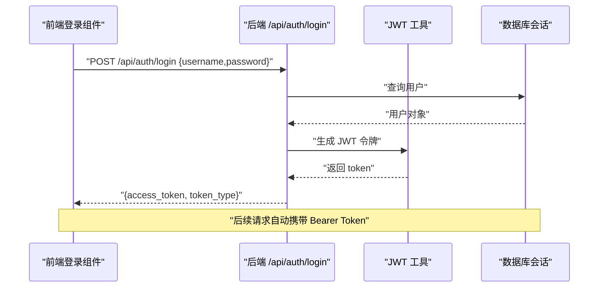
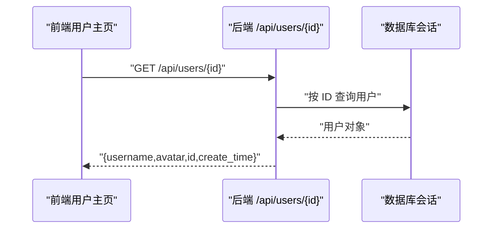
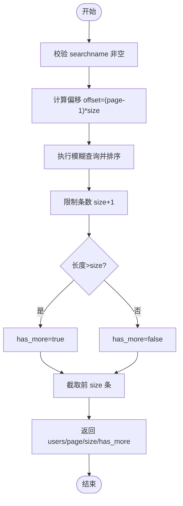
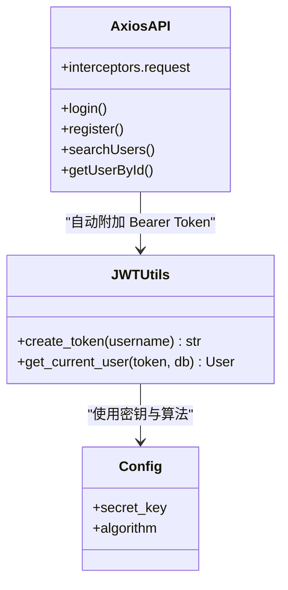
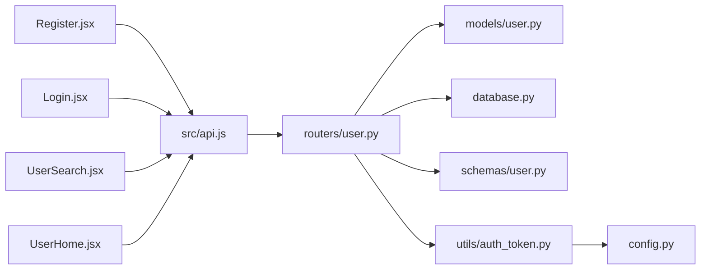

# 用户管理系统

<cite>
**本文引用的文件**
- [blog_backend/main.py](file://blog_backend/main.py)
- [blog_backend/config.py](file://blog_backend/config.py)
- [blog_backend/database.py](file://blog_backend/database.py)
- [blog_backend/models/user.py](file://blog_backend/models/user.py)
- [blog_backend/schemas/user.py](file://blog_backend/schemas/user.py)
- [blog_backend/routers/user.py](file://blog_backend/routers/user.py)
- [blog_backend/utils/auth_token.py](file://blog_backend/utils/auth_token.py)
- [blog_backend/init_db.py](file://blog_backend/init_db.py)
- [blog_frontend/src/api.js](file://blog_frontend/src/api.js)
- [blog_frontend/src/components/Register.jsx](file://blog_frontend/src/components/Register.jsx)
- [blog_frontend/src/components/Login.jsx](file://blog_frontend/src/components/Login.jsx)
- [blog_frontend/src/components/UserSearch.jsx](file://blog_frontend/src/components/UserSearch.jsx)
- [blog_frontend/src/components/UserHome.jsx](file://blog_frontend/src/components/UserHome.jsx)
</cite>

## 目录
1. [简介](#简介)
2. [项目结构](#项目结构)
3. [核心组件](#核心组件)
4. [架构总览](#架构总览)
5. [详细组件分析](#详细组件分析)
6. [依赖分析](#依赖分析)
7. [性能考虑](#性能考虑)
8. [故障排查指南](#故障排查指南)
9. [结论](#结论)
10. [附录](#附录)

## 简介
本文件为用户管理系统的功能文档，覆盖以下方面：
- 用户注册：用户名唯一性检查、密码处理与用户信息存储
- 登录认证：JWT 令牌生成、用户身份验证与会话管理
- 资料管理：用户信息查询、头像设置与个人资料维护
- 用户搜索：按用户名模糊查询、分页显示与结果处理
- 权限控制与安全：密码加密存储与访问令牌管理
- 完整 API 接口说明、前端组件实现与用户交互流程
- 最佳实践与常见问题排查

## 项目结构
后端采用 FastAPI + SQLAlchemy 架构，数据库初始化脚本负责建表；前端使用 React + Axios，通过统一 API 封装与后端交互。

**图表来源**
- [blog_backend/main.py:1-13](file://blog_backend/main.py#L1-L13)
- [blog_backend/routers/user.py:1-101](file://blog_backend/routers/user.py#L1-L101)
- [blog_backend/models/user.py:1-14](file://blog_backend/models/user.py#L1-L14)
- [blog_backend/schemas/user.py:1-13](file://blog_backend/schemas/user.py#L1-L13)
- [blog_backend/utils/auth_token.py:1-38](file://blog_backend/utils/auth_token.py#L1-L38)
- [blog_backend/database.py:1-18](file://blog_backend/database.py#L1-L18)
- [blog_backend/config.py:1-32](file://blog_backend/config.py#L1-L32)
- [blog_backend/init_db.py:1-10](file://blog_backend/init_db.py#L1-L10)
- [blog_frontend/src/api.js:1-39](file://blog_frontend/src/api.js#L1-L39)
- [blog_frontend/src/components/Register.jsx:1-52](file://blog_frontend/src/components/Register.jsx#L1-L52)
- [blog_frontend/src/components/Login.jsx:1-47](file://blog_frontend/src/components/Login.jsx#L1-L47)
- [blog_frontend/src/components/UserSearch.jsx:1-140](file://blog_frontend/src/components/UserSearch.jsx#L1-L140)
- [blog_frontend/src/components/UserHome.jsx:1-129](file://blog_frontend/src/components/UserHome.jsx#L1-L129)

**章节来源**
- [blog_backend/main.py:1-13](file://blog_backend/main.py#L1-L13)
- [blog_backend/routers/user.py:1-101](file://blog_backend/routers/user.py#L1-L101)
- [blog_backend/models/user.py:1-14](file://blog_backend/models/user.py#L1-L14)
- [blog_backend/schemas/user.py:1-13](file://blog_backend/schemas/user.py#L1-L13)
- [blog_backend/utils/auth_token.py:1-38](file://blog_backend/utils/auth_token.py#L1-L38)
- [blog_backend/database.py:1-18](file://blog_backend/database.py#L1-L18)
- [blog_backend/config.py:1-32](file://blog_backend/config.py#L1-L32)
- [blog_backend/init_db.py:1-10](file://blog_backend/init_db.py#L1-L10)
- [blog_frontend/src/api.js:1-39](file://blog_frontend/src/api.js#L1-L39)
- [blog_frontend/src/components/Register.jsx:1-52](file://blog_frontend/src/components/Register.jsx#L1-L52)
- [blog_frontend/src/components/Login.jsx:1-47](file://blog_frontend/src/components/Login.jsx#L1-L47)
- [blog_frontend/src/components/UserSearch.jsx:1-140](file://blog_frontend/src/components/UserSearch.jsx#L1-L140)
- [blog_frontend/src/components/UserHome.jsx:1-129](file://blog_frontend/src/components/UserHome.jsx#L1-L129)

## 核心组件
- 应用入口与路由挂载：在应用启动时注册用户、文章、招聘、记账、求职等模块路由，并统一前缀与标签。
- 数据库层：定义引擎、会话工厂与基础模型类，提供依赖注入的数据库会话。
- 模型层：用户模型包含主键、用户名（唯一）、密码、头像与创建时间字段。
- 路由层：提供注册、登录、用户搜索、按 ID 获取用户等接口。
- 认证工具：封装 JWT 编码与解码、令牌生成、当前用户解析与校验。
- 前端 API：统一 Axios 实例，自动注入 Authorization 头，导出用户相关 API 方法。
- 前端组件：注册、登录、用户搜索、用户主页等页面组件。

**章节来源**
- [blog_backend/main.py:1-13](file://blog_backend/main.py#L1-L13)
- [blog_backend/database.py:1-18](file://blog_backend/database.py#L1-L18)
- [blog_backend/models/user.py:1-14](file://blog_backend/models/user.py#L1-L14)
- [blog_backend/routers/user.py:1-101](file://blog_backend/routers/user.py#L1-L101)
- [blog_backend/utils/auth_token.py:1-38](file://blog_backend/utils/auth_token.py#L1-L38)
- [blog_frontend/src/api.js:1-39](file://blog_frontend/src/api.js#L1-L39)

## 架构总览
后端以 FastAPI 作为 Web 框架，SQLAlchemy 作为 ORM，JWT 用于认证。前端通过 Axios 统一调用后端 /api 前缀下的接口，自动携带 Bearer Token。

**图表来源**
- [blog_backend/main.py:1-13](file://blog_backend/main.py#L1-L13)
- [blog_backend/routers/user.py:1-101](file://blog_backend/routers/user.py#L1-L101)
- [blog_backend/utils/auth_token.py:1-38](file://blog_backend/utils/auth_token.py#L1-L38)
- [blog_frontend/src/api.js:1-39](file://blog_frontend/src/api.js#L1-L39)

## 详细组件分析

### 用户注册功能
- 功能要点
  - 唯一性检查：根据用户名查询数据库，若存在则返回错误。
  - 用户创建：构造用户对象（用户名、密码、头像），写入数据库并提交事务。
  - 返回值：返回新创建的用户记录。
- 前端交互
  - 注册页面收集用户名、密码与头像，提交到 /api/users。
  - 成功后跳转至登录页；失败提示“用户名可能已存在”。

**图表来源**
- [blog_backend/routers/user.py:15-34](file://blog_backend/routers/user.py#L15-L34)
- [blog_frontend/src/components/Register.jsx:12-20](file://blog_frontend/src/components/Register.jsx#L12-L20)

**章节来源**
- [blog_backend/routers/user.py:15-34](file://blog_backend/routers/user.py#L15-L34)
- [blog_frontend/src/components/Register.jsx:12-20](file://blog_frontend/src/components/Register.jsx#L12-L20)

### 用户登录与认证
- 功能要点
  - 登录接口：校验用户名与密码，成功后生成 JWT 令牌并返回。
  - 令牌解析：通过 OAuth2PasswordBearer 从 Authorization 头中提取 token，解码并校验有效性。
  - 当前用户：从 payload 中取出用户名，查询数据库确认用户存在。
- 前端交互
  - 登录页面提交用户名与密码到 /api/auth/login。
  - 成功后将 access_token 写入本地存储，后续请求由 Axios 自动附加 Authorization 头。

**图表来源**
- [blog_backend/routers/user.py:36-51](file://blog_backend/routers/user.py#L36-L51)
- [blog_backend/utils/auth_token.py:12-37](file://blog_backend/utils/auth_token.py#L12-L37)
- [blog_frontend/src/api.js:7-14](file://blog_frontend/src/api.js#L7-L14)
- [blog_frontend/src/components/Login.jsx:11-21](file://blog_frontend/src/components/Login.jsx#L11-L21)

**章节来源**
- [blog_backend/routers/user.py:36-51](file://blog_backend/routers/user.py#L36-L51)
- [blog_backend/utils/auth_token.py:12-37](file://blog_backend/utils/auth_token.py#L12-L37)
- [blog_frontend/src/api.js:7-14](file://blog_frontend/src/api.js#L7-L14)
- [blog_frontend/src/components/Login.jsx:11-21](file://blog_frontend/src/components/Login.jsx#L11-L21)

### 用户资料管理
- 功能要点
  - 按 ID 查询用户：根据用户 ID 查询用户信息，不存在则返回 404。
  - 头像设置：注册时默认头像来自配置，用户主页支持展示头像或首字母占位。
- 前端交互
  - 用户主页根据路由参数加载用户详情与该用户的分页文章列表。

**图表来源**
- [blog_backend/routers/user.py:94-101](file://blog_backend/routers/user.py#L94-L101)
- [blog_frontend/src/components/UserHome.jsx:28-55](file://blog_frontend/src/components/UserHome.jsx#L28-L55)

**章节来源**
- [blog_backend/routers/user.py:94-101](file://blog_backend/routers/user.py#L94-L101)
- [blog_frontend/src/components/UserHome.jsx:28-55](file://blog_frontend/src/components/UserHome.jsx#L28-L55)

### 用户搜索功能
- 功能要点
  - 模糊查询：基于用户名包含条件进行过滤。
  - 分页逻辑：通过 page 与 size 控制偏移与限制，多取一条用于判断是否存在下一页。
  - 结果处理：返回用户列表、当前页、大小与 has_more 标志。
- 前端交互
  - 搜索组件支持输入关键字、分页切换与加载状态反馈。

**图表来源**
- [blog_backend/routers/user.py:54-92](file://blog_backend/routers/user.py#L54-L92)

**章节来源**
- [blog_backend/routers/user.py:54-92](file://blog_backend/routers/user.py#L54-L92)
- [blog_frontend/src/components/UserSearch.jsx:14-38](file://blog_frontend/src/components/UserSearch.jsx#L14-L38)

### 权限控制与安全机制
- 密码存储
  - 后端模型保存明文密码（当前实现），建议在实际生产中使用强哈希（如 bcrypt）进行加密存储。
  - 参考依赖 passlib 的使用方式，可在注册流程中对密码进行哈希后再入库。
- 访问令牌管理
  - 使用 HS256 算法与固定密钥生成 24 小时过期的 JWT。
  - 前端通过 localStorage 存储 token，并在每次请求时由 Axios 拦截器自动附加 Authorization 头。
  - 后端通过 OAuth2PasswordBearer 与自定义解析函数校验 token 有效性与用户存在性。

**图表来源**
- [blog_backend/config.py:15-17](file://blog_backend/config.py#L15-L17)
- [blog_backend/utils/auth_token.py:12-37](file://blog_backend/utils/auth_token.py#L12-L37)
- [blog_frontend/src/api.js:7-14](file://blog_frontend/src/api.js#L7-L14)

**章节来源**
- [blog_backend/config.py:15-17](file://blog_backend/config.py#L15-L17)
- [blog_backend/utils/auth_token.py:12-37](file://blog_backend/utils/auth_token.py#L12-L37)
- [blog_frontend/src/api.js:7-14](file://blog_frontend/src/api.js#L7-L14)

## 依赖分析
- 后端模块耦合
  - 路由依赖模型与数据库会话，认证工具依赖配置与数据库。
  - 应用入口集中挂载各模块路由，保持高内聚低耦合。
- 前后端交互
  - 前端通过统一 API 封装调用后端接口，Axios 拦截器统一处理鉴权头。
- 外部依赖
  - passlib 用于密码哈希（当前未在路由中使用，建议在注册流程中启用）。
  - jose 用于 JWT 编解码。
  - fastapi.security 提供 OAuth2PasswordBearer。

**图表来源**
- [blog_backend/routers/user.py:1-101](file://blog_backend/routers/user.py#L1-L101)
- [blog_backend/models/user.py:1-14](file://blog_backend/models/user.py#L1-L14)
- [blog_backend/schemas/user.py:1-13](file://blog_backend/schemas/user.py#L1-L13)
- [blog_backend/utils/auth_token.py:1-38](file://blog_backend/utils/auth_token.py#L1-L38)
- [blog_backend/database.py:1-18](file://blog_backend/database.py#L1-L18)
- [blog_backend/config.py:1-32](file://blog_backend/config.py#L1-L32)
- [blog_frontend/src/api.js:1-39](file://blog_frontend/src/api.js#L1-L39)

**章节来源**
- [blog_backend/routers/user.py:1-101](file://blog_backend/routers/user.py#L1-L101)
- [blog_frontend/src/api.js:1-39](file://blog_frontend/src/api.js#L1-L39)

## 性能考虑
- 数据库查询
  - 用户名唯一性检查与模糊查询均走索引列，建议在生产环境确保用户名列建立唯一索引。
  - 搜索接口 limit(size+1) 仅用于判断下一页，避免多余数据传输。
- 分页策略
  - 建议对 id 或创建时间建立索引以优化排序与分页性能。
- 令牌与缓存
  - JWT 无服务端状态，适合水平扩展；但需注意密钥安全与过期策略。
- 前端渲染
  - 搜索与分页采用受控组件，避免不必要的重渲染；可结合虚拟列表优化长列表性能。

[本节为通用建议，不直接分析具体文件]

## 故障排查指南
- 注册失败
  - 现象：提示“用户名可能已存在”。
  - 排查：确认用户名是否已被占用；检查后端唯一性校验逻辑。
  - 参考路径：[blog_backend/routers/user.py:18-21](file://blog_backend/routers/user.py#L18-L21)
- 登录失败
  - 现象：提示“用户名不存在”或“密码错误”。
  - 排查：核对用户名与密码；确认后端密码比对逻辑；检查前端是否正确存储 token。
  - 参考路径：[blog_backend/routers/user.py:39-46](file://blog_backend/routers/user.py#L39-L46)，[blog_frontend/src/components/Login.jsx:11-21](file://blog_frontend/src/components/Login.jsx#L11-L21)
- 令牌无效
  - 现象：接口返回 401，提示“token 无效”或“用户不存在”。
  - 排查：确认 token 是否过期、密钥是否一致、Authorization 头是否正确附加。
  - 参考路径：[blog_backend/utils/auth_token.py:22-37](file://blog_backend/utils/auth_token.py#L22-L37)，[blog_frontend/src/api.js:7-14](file://blog_frontend/src/api.js#L7-L14)
- 搜索无结果
  - 现象：输入关键字后无匹配用户。
  - 排查：确认关键字非空；检查数据库中是否存在包含该关键字的用户名。
  - 参考路径：[blog_backend/routers/user.py:62-64](file://blog_backend/routers/user.py#L62-L64)，[blog_frontend/src/components/UserSearch.jsx:14-34](file://blog_frontend/src/components/UserSearch.jsx#L14-L34)

**章节来源**
- [blog_backend/routers/user.py:18-21](file://blog_backend/routers/user.py#L18-L21)
- [blog_backend/routers/user.py:39-46](file://blog_backend/routers/user.py#L39-L46)
- [blog_backend/utils/auth_token.py:22-37](file://blog_backend/utils/auth_token.py#L22-L37)
- [blog_frontend/src/api.js:7-14](file://blog_frontend/src/api.js#L7-L14)
- [blog_frontend/src/components/Login.jsx:11-21](file://blog_frontend/src/components/Login.jsx#L11-L21)
- [blog_frontend/src/components/UserSearch.jsx:14-34](file://blog_frontend/src/components/UserSearch.jsx#L14-L34)

## 结论
本系统提供了用户注册、登录认证、资料查询与用户搜索的核心能力，前后端通过统一 API 协作完成用户生命周期管理。建议在生产环境中增强密码加密与令牌安全策略，并持续优化数据库索引与前端渲染性能。

[本节为总结，不直接分析具体文件]

## 附录

### API 接口说明
- 注册
  - 方法与路径：POST /api/users
  - 请求体：用户名、密码、头像
  - 响应：新用户信息
  - 参考路径：[blog_backend/routers/user.py:15-34](file://blog_backend/routers/user.py#L15-L34)
- 登录
  - 方法与路径：POST /api/auth/login
  - 请求体：用户名、密码
  - 响应：access_token 与 token_type
  - 参考路径：[blog_backend/routers/user.py:36-51](file://blog_backend/routers/user.py#L36-L51)
- 搜索用户（分页）
  - 方法与路径：GET /api/users
  - 查询参数：searchname、page、size
  - 响应：users、page、size、has_more
  - 参考路径：[blog_backend/routers/user.py:54-92](file://blog_backend/routers/user.py#L54-L92)
- 获取用户详情
  - 方法与路径：GET /api/users/{user_id}
  - 响应：用户名、头像、ID、创建时间
  - 参考路径：[blog_backend/routers/user.py:94-101](file://blog_backend/routers/user.py#L94-L101)

**章节来源**
- [blog_backend/routers/user.py:15-34](file://blog_backend/routers/user.py#L15-L34)
- [blog_backend/routers/user.py:36-51](file://blog_backend/routers/user.py#L36-L51)
- [blog_backend/routers/user.py:54-92](file://blog_backend/routers/user.py#L54-L92)
- [blog_backend/routers/user.py:94-101](file://blog_backend/routers/user.py#L94-L101)

### 前端组件与交互流程
- 注册组件
  - 表单提交至 /api/users，成功后跳转登录页。
  - 参考路径：[blog_frontend/src/components/Register.jsx:12-20](file://blog_frontend/src/components/Register.jsx#L12-L20)
- 登录组件
  - 提交凭据至 /api/auth/login，成功后写入 token 并跳转首页。
  - 参考路径：[blog_frontend/src/components/Login.jsx:11-21](file://blog_frontend/src/components/Login.jsx#L11-L21)
- 用户搜索组件
  - 输入关键字触发搜索，支持分页与加载状态。
  - 参考路径：[blog_frontend/src/components/UserSearch.jsx:14-38](file://blog_frontend/src/components/UserSearch.jsx#L14-L38)
- 用户主页组件
  - 根据用户 ID 获取详情与文章列表，支持分页导航。
  - 参考路径：[blog_frontend/src/components/UserHome.jsx:28-55](file://blog_frontend/src/components/UserHome.jsx#L28-L55)

**章节来源**
- [blog_frontend/src/components/Register.jsx:12-20](file://blog_frontend/src/components/Register.jsx#L12-L20)
- [blog_frontend/src/components/Login.jsx:11-21](file://blog_frontend/src/components/Login.jsx#L11-L21)
- [blog_frontend/src/components/UserSearch.jsx:14-38](file://blog_frontend/src/components/UserSearch.jsx#L14-L38)
- [blog_frontend/src/components/UserHome.jsx:28-55](file://blog_frontend/src/components/UserHome.jsx#L28-L55)

### 最佳实践
- 密码安全
  - 在注册流程中使用强哈希算法（如 bcrypt）对密码进行哈希后再存储。
  - 参考依赖：passlib（已在依赖中声明）。
- 令牌安全
  - 使用足够强度的密钥与随机算法，定期轮换密钥；合理设置过期时间。
  - 参考路径：[blog_backend/config.py:15-17](file://blog_backend/config.py#L15-L17)
- 前端存储
  - 优先使用 HttpOnly Cookie 存储敏感令牌，避免 localStorage 易被 XSS 攻击。
- 数据库设计
  - 为用户名添加唯一索引，为常用查询字段建立索引以提升性能。
  - 参考路径：[blog_backend/models/user.py:8-12](file://blog_backend/models/user.py#L8-L12)，[blog_backend/init_db.py:5-6](file://blog_backend/init_db.py#L5-L6)

**章节来源**
- [blog_backend/config.py:15-17](file://blog_backend/config.py#L15-L17)
- [blog_backend/models/user.py:8-12](file://blog_backend/models/user.py#L8-L12)
- [blog_backend/init_db.py:5-6](file://blog_backend/init_db.py#L5-L6)