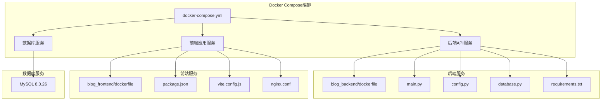
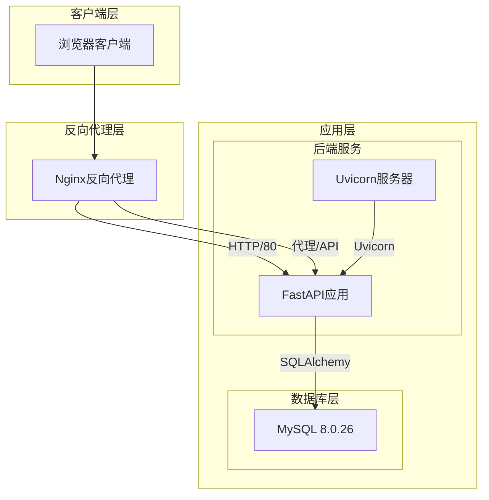
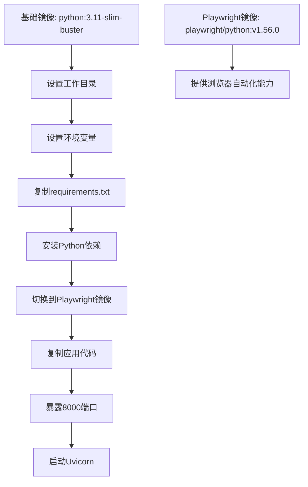
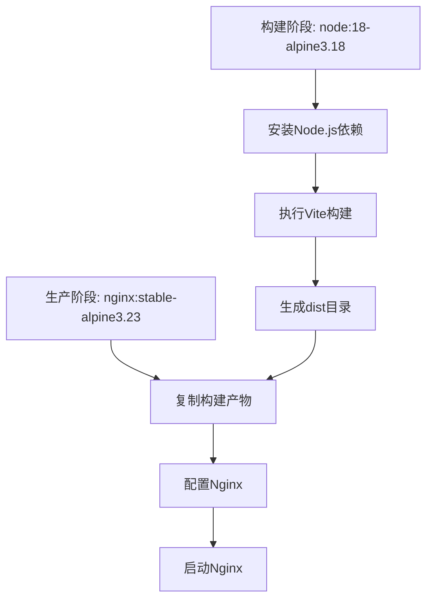
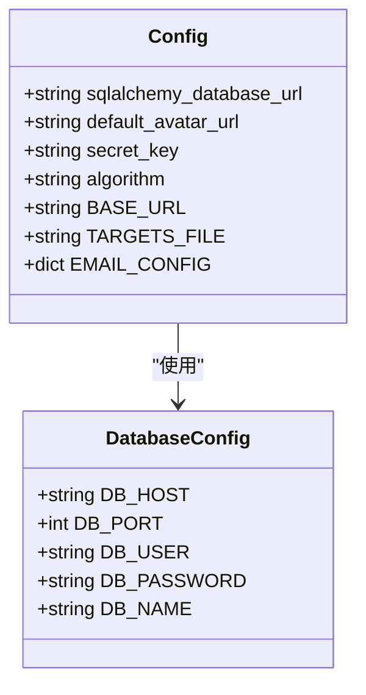
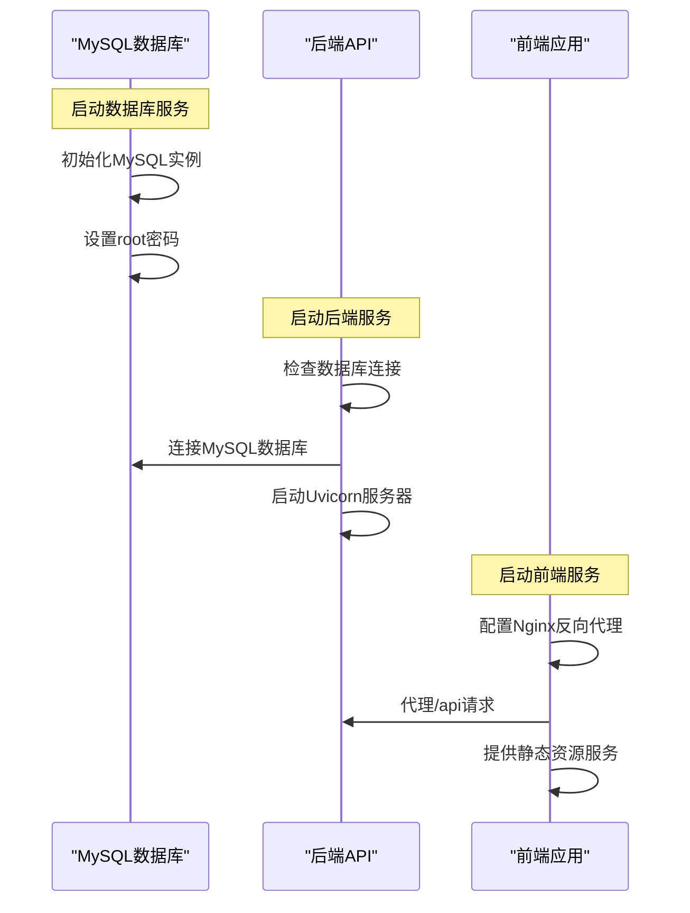

# Docker容器化部署

<cite>
**本文档引用的文件**
- [docker-compose.yml](file://docker-compose.yml)
- [blog_backend/dockerfile](file://blog_backend/dockerfile)
- [blog_frontend/dockerfile](file://blog_frontend/dockerfile)
- [blog_backend/main.py](file://blog_backend/main.py)
- [blog_backend/config.py](file://blog_backend/config.py)
- [blog_backend/database.py](file://blog_backend/database.py)
- [blog_backend/init_db.py](file://blog_backend/init_db.py)
- [blog_backend/requirements.txt](file://blog_backend/requirements.txt)
- [blog_backend/pyproject.toml](file://blog_backend/pyproject.toml)
- [blog_frontend/package.json](file://blog_frontend/package.json)
- [blog_frontend/vite.config.js](file://blog_frontend/vite.config.js)
- [blog_frontend/nginx.conf](file://blog_frontend/nginx.conf)
- [blog_frontend/.dockerignore](file://blog_frontend/.dockerignore)
- [blog_backend/.gitignore](file://blog_backend/.gitignore)
</cite>

## 目录
1. [简介](#简介)
2. [项目结构](#项目结构)
3. [核心组件](#核心组件)
4. [架构概览](#架构概览)
5. [详细组件分析](#详细组件分析)
6. [依赖关系分析](#依赖关系分析)
7. [性能考虑](#性能考虑)
8. [故障排除指南](#故障排除指南)
9. [结论](#结论)
10. [附录](#附录)

## 简介

本项目是一个基于Docker容器化的全栈博客应用，包含MySQL数据库、FastAPI后端服务和React前端应用。该部署方案提供了完整的容器编排配置，支持数据库持久化、服务间通信和反向代理功能。

## 项目结构

该项目采用多服务架构，包含三个主要组件：



**图表来源**
- [docker-compose.yml:1-41](file://docker-compose.yml#L1-L41)
- [blog_backend/dockerfile:1-17](file://blog_backend/dockerfile#L1-L17)
- [blog_frontend/dockerfile:1-25](file://blog_frontend/dockerfile#L1-L25)

**章节来源**
- [docker-compose.yml:1-41](file://docker-compose.yml#L1-L41)
- [blog_backend/dockerfile:1-17](file://blog_backend/dockerfile#L1-L17)
- [blog_frontend/dockerfile:1-25](file://blog_frontend/dockerfile#L1-L25)

## 核心组件

### 数据库服务 (db)

数据库服务使用官方MySQL 8.0.26镜像，配置了以下关键参数：

- **镜像**: `swr.cn-north-4.myhuaweicloud.com/ddn-k8s/gcr.io/ml-pipeline/mysql:8.0.26`
- **容器名称**: `mysql`
- **重启策略**: `always`
- **端口映射**: `3306:3306`
- **环境变量**: `MYSQL_ROOT_PASSWORD: "020110"`
- **数据卷**: 使用外部命名卷进行数据持久化

### 后端API服务 (backend)

后端服务基于Python 3.11 Slim Buster镜像，提供FastAPI RESTful API：

- **构建路径**: `./blog_backend`
- **容器名称**: `blog-backend`
- **重启策略**: `always`
- **端口映射**: `8001:8000`
- **环境变量**:
  - `DB_HOST`: db (指向数据库服务)
  - `DB_PORT`: 3306
  - `DB_USER`: root
  - `DB_PASSWORD`: "020110"
  - `DB_NAME`: myapp

### 前端应用服务 (frontend)

前端服务采用Nginx作为生产服务器，提供静态资源托管：

- **构建路径**: `./blog_frontend`
- **容器名称**: `blog-frontend`
- **重启策略**: `always`
- **端口映射**: `80:80`
- **依赖关系**: 依赖后端服务

**章节来源**
- [docker-compose.yml:2-41](file://docker-compose.yml#L2-L41)

## 架构概览

系统采用三层架构设计，服务间通过Docker网络进行通信：



**图表来源**
- [blog_frontend/nginx.conf:1-26](file://blog_frontend/nginx.conf#L1-L26)
- [blog_backend/main.py:1-13](file://blog_backend/main.py#L1-L13)
- [blog_backend/database.py:1-18](file://blog_backend/database.py#L1-L18)

## 详细组件分析

### Dockerfile构建流程

#### 后端Dockerfile分析

后端服务使用多阶段构建优化镜像大小：



**图表来源**
- [blog_backend/dockerfile:1-17](file://blog_backend/dockerfile#L1-L17)

**构建步骤说明**:
1. **第一阶段**: 使用Python Slim镜像安装依赖
2. **第二阶段**: 切换到Playwright专用镜像，提供浏览器自动化功能
3. **优化**: 避免重复安装Node.js和相关工具

#### 前端Dockerfile分析

前端服务采用Vite构建和Nginx部署的双阶段构建：



**图表来源**
- [blog_frontend/dockerfile:1-25](file://blog_frontend/dockerfile#L1-L25)

**构建流程**:
1. **开发阶段**: 使用Node.js Alpine镜像进行Vite构建
2. **生产阶段**: 使用轻量级Nginx镜像提供静态文件服务
3. **配置**: 自定义Nginx配置实现SPA路由支持

### 环境变量配置

#### 数据库连接配置

后端应用通过环境变量配置数据库连接：

| 环境变量 | 默认值 | 用途 |
|---------|--------|------|
| DATABASE_URL | 动态生成 | 完整数据库连接字符串 |
| DB_HOST | localhost | 数据库主机地址 |
| DB_PORT | 3306 | 数据库端口号 |
| DB_USER | root | 数据库用户名 |
| DB_PASSWORD | 020110 | 数据库密码 |
| DB_NAME | myapp | 数据库名称 |

#### 应用配置



**图表来源**
- [blog_backend/config.py:1-32](file://blog_backend/config.py#L1-L32)

**章节来源**
- [blog_backend/config.py:1-32](file://blog_backend/config.py#L1-L32)
- [blog_backend/database.py:1-18](file://blog_backend/database.py#L1-L18)

### 依赖关系分析

#### 服务启动顺序

Docker Compose确保正确的启动顺序：



**图表来源**
- [docker-compose.yml:25-35](file://docker-compose.yml#L25-L35)

#### 网络配置

服务间网络通信通过Docker内部网络实现：

- **默认网络**: 所有服务都在同一Docker网络中
- **服务发现**: 通过服务名进行DNS解析
- **端口映射**: 外部访问通过端口映射实现

**章节来源**
- [docker-compose.yml:25-35](file://docker-compose.yml#L25-L35)

## 性能考虑

### 镜像优化

1. **多阶段构建**: 减少最终镜像大小，提高部署效率
2. **Alpine Linux**: 使用轻量级基础镜像
3. **依赖缓存**: 利用Docker层缓存机制

### 资源管理

1. **重启策略**: 所有服务都配置为自动重启
2. **内存优化**: Nginx使用稳定版本以保证性能
3. **并发处理**: Uvicorn支持异步请求处理

### 数据持久化

1. **命名卷**: 使用外部命名卷确保数据持久性
2. **数据备份**: 卷可以独立备份和迁移
3. **数据安全**: MySQL配置了root密码保护

## 故障排除指南

### 常见启动问题

#### 数据库连接失败

**症状**: 后端服务启动时报数据库连接错误

**解决方案**:
1. 检查数据库服务是否正常运行
2. 验证环境变量配置
3. 确认数据库端口映射正确

#### 端口冲突

**症状**: 容器启动失败，提示端口已被占用

**解决方案**:
1. 检查宿主机端口占用情况
2. 修改docker-compose.yml中的端口映射
3. 使用`docker ps`查看端口使用情况

#### 权限问题

**症状**: MySQL初始化失败或权限错误

**解决方案**:
1. 检查卷权限设置
2. 验证MySQL root密码配置
3. 确认数据目录权限

### 日志查看

#### 查看容器日志

```bash
# 查看所有容器日志
docker compose logs -f

# 查看特定服务日志
docker compose logs -f backend
docker compose logs -f frontend
docker compose logs -f db

# 查看最近的日志
docker compose logs --tail=100 backend
```

#### 监控容器状态

```bash
# 查看容器运行状态
docker compose ps

# 查看容器资源使用
docker stats

# 进入容器调试
docker compose exec backend bash
docker compose exec frontend bash
docker compose exec db bash
```

### 数据库管理

#### 连接MySQL数据库

```bash
# 进入MySQL容器
docker compose exec db bash

# 登录MySQL
mysql -u root -p

# 查看数据库
SHOW DATABASES;
USE myapp;
SHOW TABLES;
```

#### 数据库初始化

```bash
# 执行数据库初始化脚本
docker compose exec backend python init_db.py
```

**章节来源**
- [blog_backend/init_db.py:1-10](file://blog_backend/init_db.py#L1-L10)

## 结论

本Docker容器化部署方案提供了完整的博客应用解决方案，具有以下优势：

1. **模块化设计**: 清晰的服务分离和职责划分
2. **可扩展性**: 支持水平扩展和负载均衡
3. **可靠性**: 自动重启机制和健康检查
4. **安全性**: 环境变量管理和数据隔离
5. **易维护性**: 标准化的构建流程和配置管理

该方案适用于开发、测试和生产环境，可根据实际需求调整资源配置和服务规模。

## 附录

### 完整部署命令

#### 开发环境部署

```bash
# 启动所有服务
docker compose up -d

# 查看服务状态
docker compose ps

# 查看日志
docker compose logs -f

# 停止服务
docker compose down

# 重新构建镜像
docker compose build --no-cache
```

#### 生产环境部署

```bash
# 启动生产环境
docker compose -f docker-compose.yml up -d

# 监控服务
docker compose ps
docker compose logs --tail=100 -f

# 扩展后端服务
docker compose up -d --scale backend=3
```

### 环境变量参考

| 变量名 | 必需性 | 默认值 | 描述 |
|--------|--------|--------|------|
| DB_HOST | 必需 | localhost | 数据库主机地址 |
| DB_PORT | 必需 | 3306 | 数据库端口号 |
| DB_USER | 必需 | root | 数据库用户名 |
| DB_PASSWORD | 必需 | 020110 | 数据库密码 |
| DB_NAME | 必需 | myapp | 数据库名称 |
| DATABASE_URL | 可选 | 自动生成 | 完整连接字符串 |

### 端口映射说明

| 服务 | 内部端口 | 外部端口 | 用途 |
|------|----------|----------|------|
| 数据库 | 3306 | 3306 | MySQL数据库服务 |
| 后端API | 8000 | 8001 | FastAPI RESTful API |
| 前端应用 | 80 | 80 | React静态资源服务 |

### 健康检查配置

建议在生产环境中添加健康检查：

```yaml
healthcheck:
  test: ["CMD", "curl", "-f", "http://localhost:8000/health"]
  interval: 30s
  timeout: 10s
  retries: 3
  start_period: 40s
```