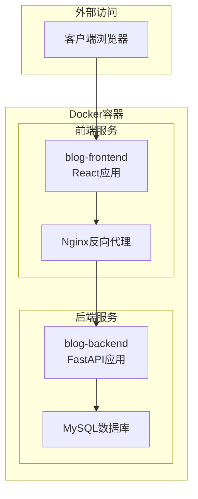
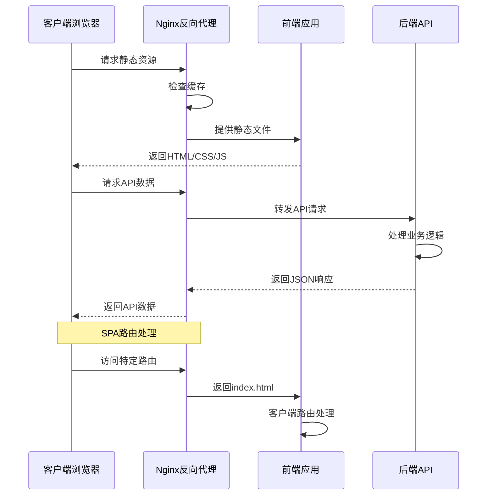
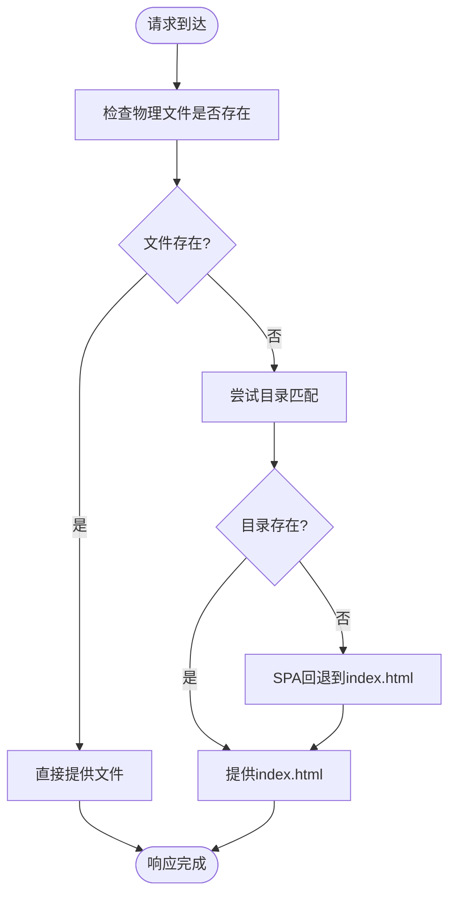
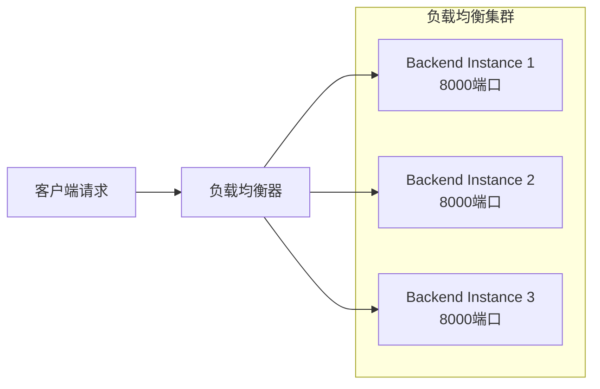
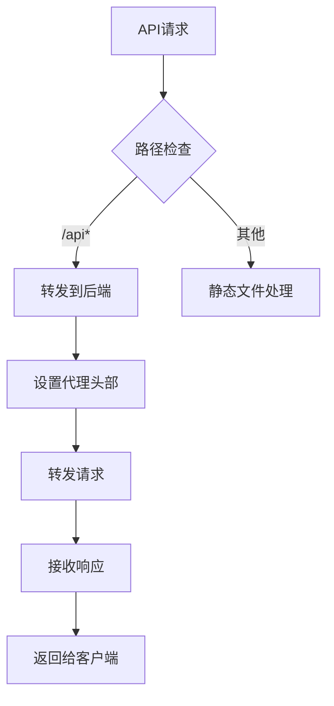
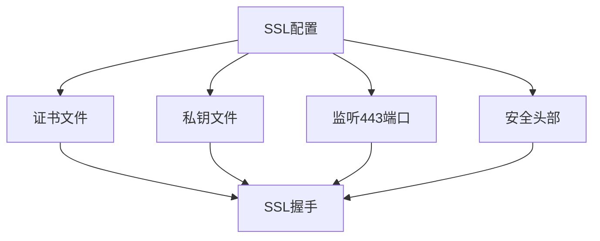
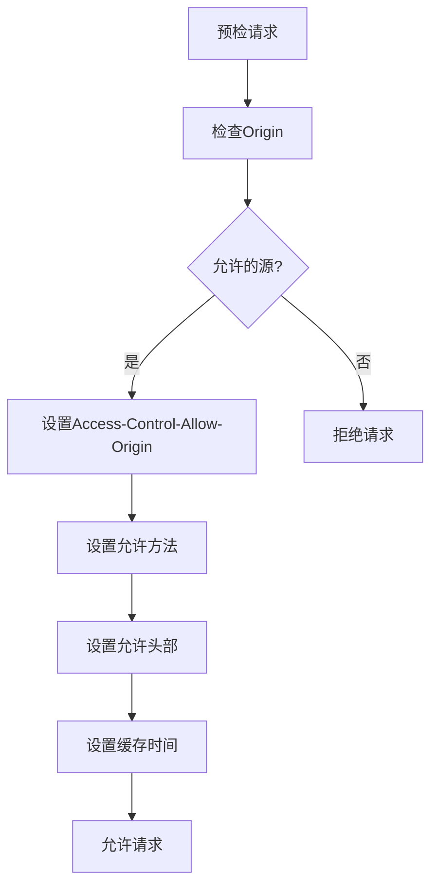
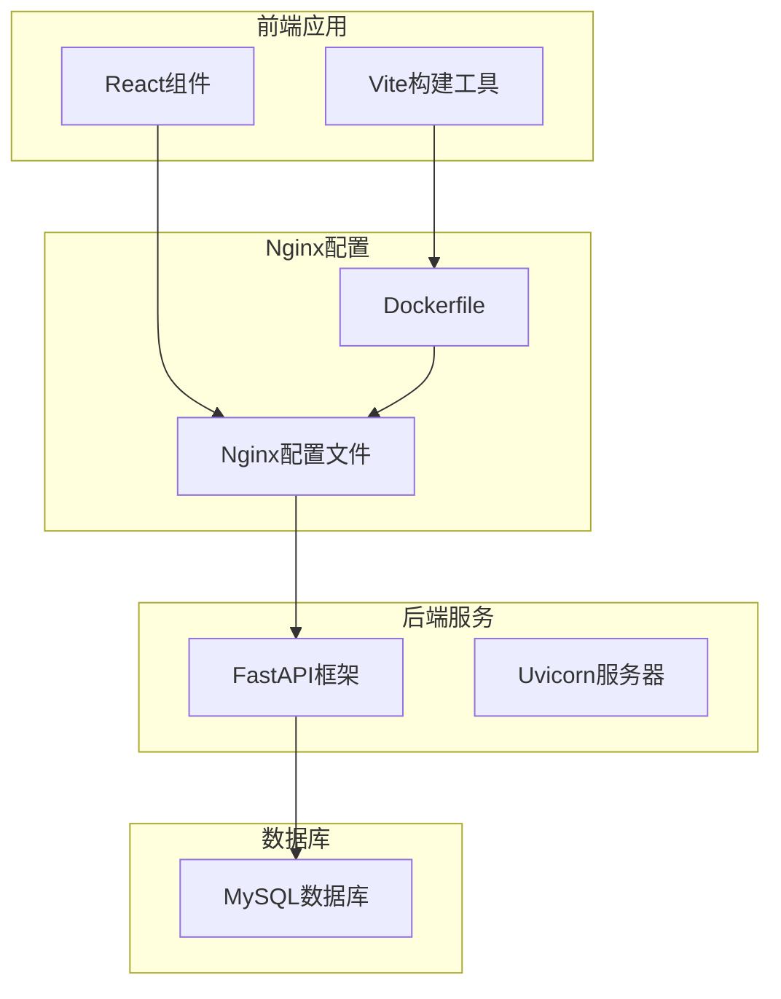
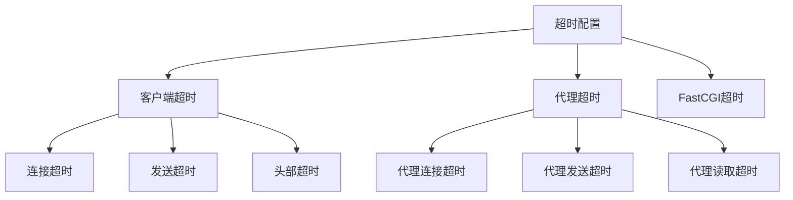
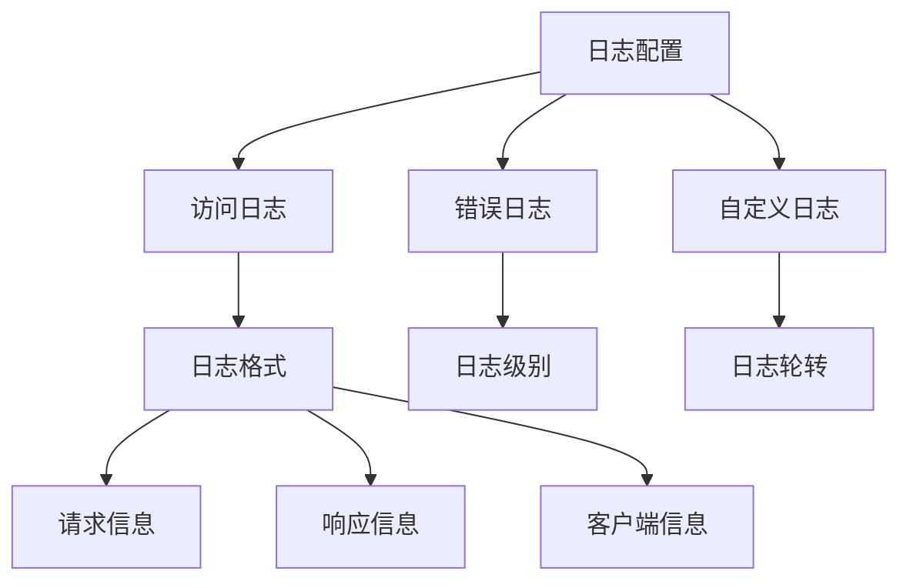

# Nginx反向代理配置

<cite>
**本文档引用的文件**
- [nginx.conf](file://blog_frontend/nginx.conf)
- [dockerfile](file://blog_frontend/dockerfile)
- [docker-compose.yml](file://docker-compose.yml)
- [default.conf](file://blog_backend/default.conf)
- [package.json](file://blog_frontend/package.json)
- [vite.config.js](file://blog_frontend/vite.config.js)
- [main.py](file://blog_backend/main.py)
- [pyproject.toml](file://blog_backend/pyproject.toml)
</cite>

## 目录
1. [简介](#简介)
2. [项目结构](#项目结构)
3. [核心组件](#核心组件)
4. [架构概览](#架构概览)
5. [详细组件分析](#详细组件分析)
6. [依赖关系分析](#依赖关系分析)
7. [性能考虑](#性能考虑)
8. [故障排除指南](#故障排除指南)
9. [结论](#结论)

## 简介

本项目是一个基于React前端和FastAPI后端的博客系统，采用Docker容器化部署。Nginx作为反向代理服务器，负责处理静态资源服务、API代理转发以及负载均衡。本文档详细解析了Nginx配置文件的结构和各个指令的作用，包括server块配置、location规则和代理设置。

## 项目结构

该项目采用前后端分离的架构设计，通过Docker Compose进行编排管理：



**图表来源**
- [docker-compose.yml:1-41](file://docker-compose.yml#L1-L41)
- [nginx.conf:1-26](file://blog_frontend/nginx.conf#L1-L26)

**章节来源**
- [docker-compose.yml:1-41](file://docker-compose.yml#L1-L41)
- [nginx.conf:1-26](file://blog_frontend/nginx.conf#L1-L26)

## 核心组件

### 前端Nginx配置

前端的Nginx配置文件位于`blog_frontend/nginx.conf`，主要包含以下核心组件：

#### Server块配置
- 监听端口：80
- 服务器名称：localhost
- 根目录：/usr/share/nginx/html
- 默认索引文件：index.html

#### 静态资源处理
- 使用try_files指令处理SPA路由
- 支持HTML5 History API模式
- 自动重定向到index.html

#### API代理配置
- 代理路径：/api
- 后端地址：http://backend:8000
- 设置必要的HTTP头信息
- 支持HTTPS协议传递

**章节来源**
- [nginx.conf:1-26](file://blog_frontend/nginx.conf#L1-L26)

### 后端Nginx配置

后端的Nginx配置文件位于`blog_backend/default.conf`，主要用于开发环境：

#### 开发环境代理
- 代理前端页面：http://host.docker.internal:5173
- 支持Vite热更新WebSocket
- 代理后端API：http://host.docker.internal:8000

#### WebSocket支持
- 设置HTTP版本为1.1
- 升级头部支持
- 连接保持

**章节来源**
- [default.conf:1-27](file://blog_backend/default.conf#L1-L27)

### Docker容器编排

Docker Compose配置定义了三个主要服务：

#### 数据库服务
- MySQL 8.0.26
- 持久化存储卷
- 环境变量配置

#### 后端服务
- FastAPI应用
- 端口映射：8001:8000
- 依赖数据库服务

#### 前端服务
- React应用
- 端口映射：80:80
- 依赖后端服务

**章节来源**
- [docker-compose.yml:1-41](file://docker-compose.yml#L1-L41)

## 架构概览



**图表来源**
- [nginx.conf:8-19](file://blog_frontend/nginx.conf#L8-L19)
- [docker-compose.yml:28-36](file://docker-compose.yml#L28-L36)

## 详细组件分析

### 静态资源服务配置

#### 文件托管配置
Nginx被配置为静态文件服务器，根目录指向构建输出：



**图表来源**
- [nginx.conf:8-10](file://blog_frontend/nginx.conf#L8-L10)

#### 缓存策略
虽然当前配置未显式设置缓存头，但可以添加以下策略：
- 静态资源：长期缓存（1年）
- HTML文件：短期缓存（5分钟）
- API响应：禁用缓存

#### 压缩配置
建议添加Gzip压缩以提升传输效率：
- 启用gzip压缩
- 设置压缩级别
- 指定压缩类型

**章节来源**
- [nginx.conf:5-6](file://blog_frontend/nginx.conf#L5-L6)
- [nginx.conf:8-10](file://blog_frontend/nginx.conf#L8-L10)

### API反向代理配置

#### Upstream设置
当前配置使用直接代理方式，可扩展为upstream集群：



#### 负载均衡策略
- 轮询（默认）
- 加权轮询
- IP哈希
- 最少连接

#### 请求转发规则


**图表来源**
- [nginx.conf:13-19](file://blog_frontend/nginx.conf#L13-L19)

**章节来源**
- [nginx.conf:13-19](file://blog_frontend/nginx.conf#L13-L19)
- [main.py:6-10](file://blog_backend/main.py#L6-L10)

### SSL证书配置

#### HTTPS启用
当前配置仅支持HTTP，可通过以下方式启用HTTPS：



#### 证书文件配置
- 证书链文件
- 私钥文件权限
- 证书验证

#### 安全头部设置
- HSTS头
- XSS保护头
- Content-Type选项头
- Referrer-Policy头

**章节来源**
- [nginx.conf:1-26](file://blog_frontend/nginx.conf#L1-L26)

### 访问控制配置

#### CORS配置


#### 安全防护措施
- 请求大小限制
- 速率限制
- IP白名单/黑名单
- SQL注入防护

**章节来源**
- [nginx.conf:15-18](file://blog_frontend/nginx.conf#L15-L18)

## 依赖关系分析



**图表来源**
- [docker-compose.yml:13-26](file://docker-compose.yml#L13-L26)
- [nginx.conf:14](file://blog_frontend/nginx.conf#L14)

**章节来源**
- [docker-compose.yml:13-26](file://docker-compose.yml#L13-L26)
- [pyproject.toml:7-21](file://blog_backend/pyproject.toml#L7-L21)

## 性能考虑

### 连接池设置
- keepalive_timeout：保持连接超时时间
- keepalive_requests：单连接最大请求数
- worker_connections：工作进程连接数

### 超时配置


### 缓冲区优化
- client_body_buffer_size：客户端请求体缓冲区
- client_max_body_size：最大请求体大小
- proxy_buffering：代理缓冲开关
- proxy_buffer_size：代理缓冲区大小

**章节来源**
- [nginx.conf:1-26](file://blog_frontend/nginx.conf#L1-L26)

## 故障排除指南

### 常见问题诊断

#### 代理配置问题
1. **后端服务不可达**
   - 检查容器网络连接
   - 验证端口映射配置
   - 确认服务启动状态

2. **API响应错误**
   - 查看Nginx错误日志
   - 检查后端服务日志
   - 验证路由配置

#### 静态资源问题
1. **404错误**
   - 确认文件路径正确性
   - 检查try_files指令配置
   - 验证构建输出完整性

2. **缓存问题**
   - 清除浏览器缓存
   - 检查缓存头设置
   - 验证文件修改时间

### 日志分析

#### Nginx日志配置


#### 日志分析命令
- 查看实时访问日志：`tail -f /var/log/nginx/access.log`
- 分析错误日志：`grep "error" /var/log/nginx/error.log`
- 统计访问量：`awk '{print $1}' /var/log/nginx/access.log | sort | uniq -c`

### 配置热更新

#### 动态重载配置
```bash
# 检查配置语法
nginx -t

# 优雅重启
nginx -s reload

# 或者发送信号
kill -HUP $(cat /var/run/nginx.pid)
```

#### 配置验证
- 使用`nginx -t`验证语法
- 检查配置文件权限
- 验证模块依赖

**章节来源**
- [docker-compose.yml:28-36](file://docker-compose.yml#L28-L36)
- [nginx.conf:21-24](file://blog_frontend/nginx.conf#L21-L24)

## 结论

本项目的Nginx反向代理配置实现了完整的前后端分离架构，具有以下特点：

1. **简洁高效的配置**：通过单一配置文件实现静态资源服务和API代理
2. **容器化部署**：利用Docker Compose实现服务编排和依赖管理
3. **开发友好**：支持热更新和开发调试功能
4. **可扩展性**：预留了负载均衡和SSL配置的空间

建议在生产环境中进一步完善：
- 添加SSL证书配置
- 实现负载均衡集群
- 优化缓存和压缩策略
- 增强安全防护措施
- 完善监控和日志分析

通过这些改进，可以构建一个更加稳定、高效和安全的反向代理系统。