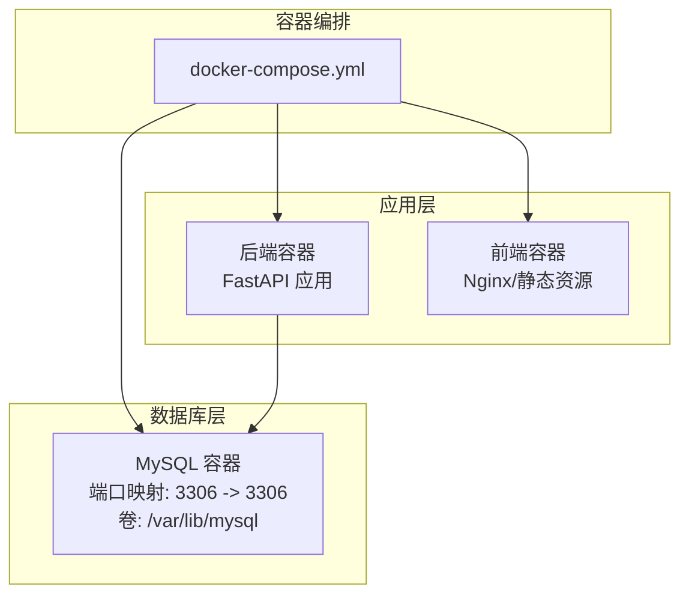
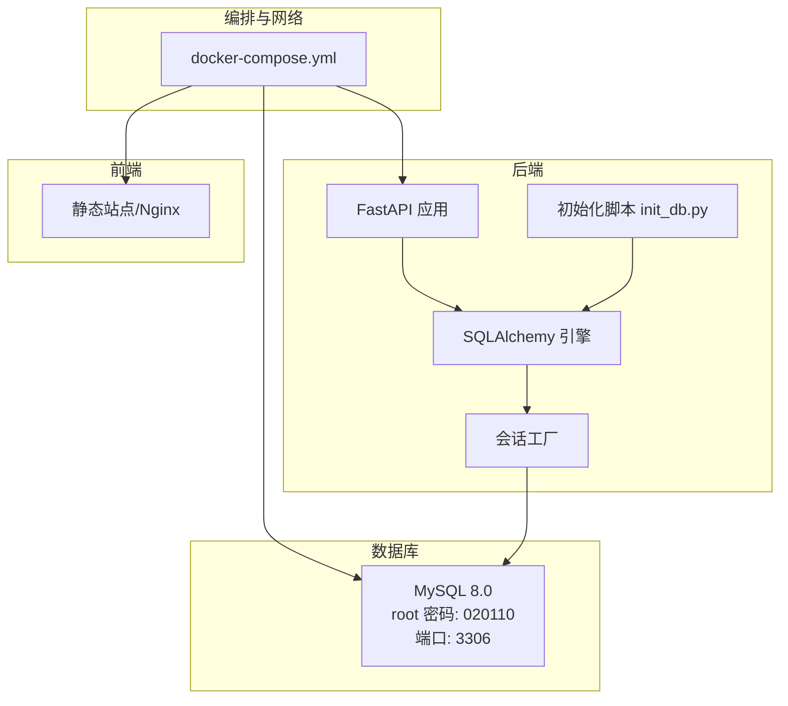
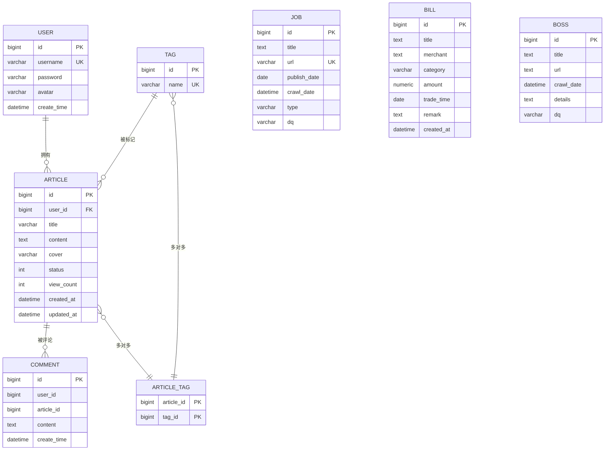
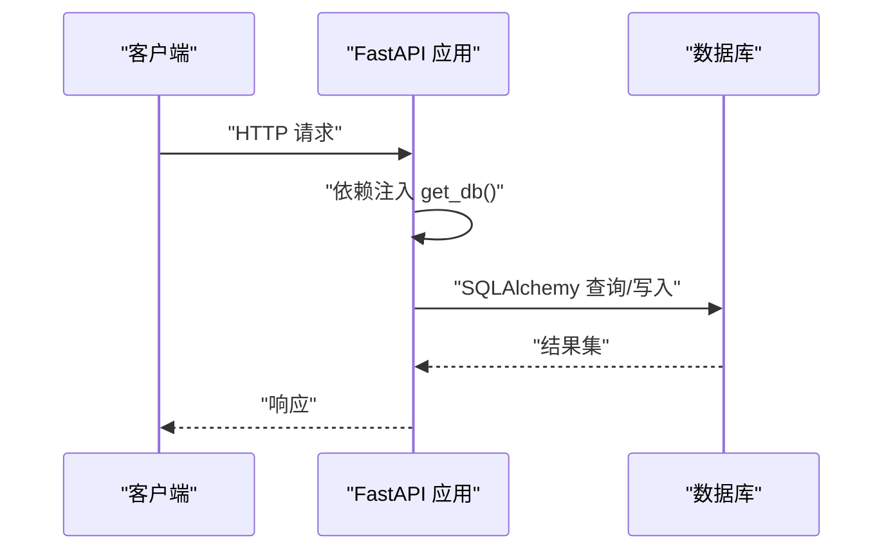
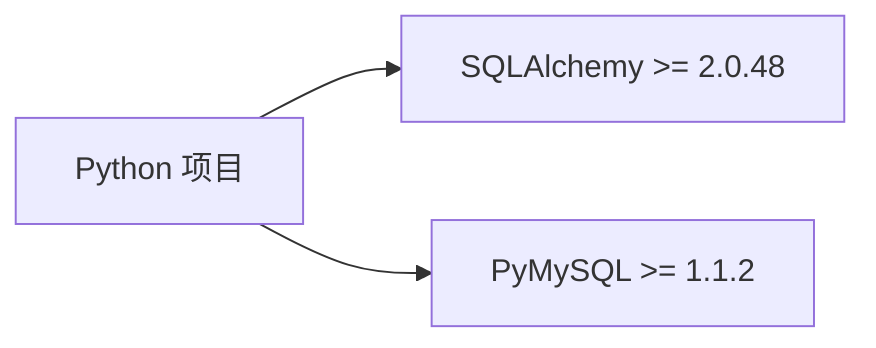

# 数据库运维

<cite>
**本文引用的文件**
- [docker-compose.yml](file://docker-compose.yml)
- [config.py](file://blog_backend/config.py)
- [database.py](file://blog_backend/database.py)
- [init_db.py](file://blog_backend/init_db.py)
- [main.py](file://blog_backend/main.py)
- [models/user.py](file://blog_backend/models/user.py)
- [models/article.py](file://blog_backend/models/article.py)
- [models/comment.py](file://blog_backend/models/comment.py)
- [models/job.py](file://blog_backend/models/job.py)
- [models/bill.py](file://blog_backend/models/bill.py)
- [models/boss.py](file://blog_backend/models/boss.py)
- [pyproject.toml](file://blog_backend/pyproject.toml)
- [requirements.txt](file://blog_backend/requirements.txt)
</cite>

## 目录
1. [简介](#简介)
2. [项目结构](#项目结构)
3. [核心组件](#核心组件)
4. [架构总览](#架构总览)
5. [详细组件分析](#详细组件分析)
6. [依赖分析](#依赖分析)
7. [性能考虑](#性能考虑)
8. [故障排查指南](#故障排查指南)
9. [结论](#结论)
10. [附录](#附录)

## 简介
本文件面向数据库运维场景，围绕 MySQL 数据库在本项目中的部署与配置、初始化脚本执行、连接配置、备份与恢复、监控与优化、安全与故障处理等方面进行系统化梳理。内容基于仓库中实际存在的 Docker 编排、数据库连接配置、ORM 模型定义与初始化脚本等文件，确保可操作性与可追溯性。

## 项目结构
后端服务通过容器编排统一启动，包含数据库、应用后端与前端。数据库使用官方 MySQL 8 镜像，后端通过 SQLAlchemy 连接数据库，初始化脚本负责创建表结构。

**图表来源**
- [docker-compose.yml:1-41](file://docker-compose.yml#L1-L41)

**章节来源**
- [docker-compose.yml:1-41](file://docker-compose.yml#L1-L41)

## 核心组件
- 数据库部署与持久化
  - 使用官方 MySQL 8 镜像，设置 root 密码并通过环境变量注入；通过命名卷实现数据持久化到宿主机路径。
  - 端口映射将容器内 3306 映射至宿主机 3306，便于本地直连与运维工具接入。
- 数据库连接配置
  - 后端通过环境变量组合 DATABASE_URL 或默认参数生成连接串，使用 SQLAlchemy 创建引擎与会话工厂。
- 初始化脚本
  - 基于 ORM 模型元数据创建所有表，作为首次部署或新环境初始化的入口。
- 应用路由与依赖
  - FastAPI 路由注册各模块接口，数据库会话通过依赖注入提供给业务逻辑。

**章节来源**
- [docker-compose.yml:2-12](file://docker-compose.yml#L2-L12)
- [config.py:3-11](file://blog_backend/config.py#L3-L11)
- [database.py:1-18](file://blog_backend/database.py#L1-L18)
- [init_db.py:1-10](file://blog_backend/init_db.py#L1-L10)
- [main.py:1-13](file://blog_backend/main.py#L1-L13)

## 架构总览
下图展示容器编排、数据库与后端应用之间的交互关系，以及初始化流程与运行时连接链路。

**图表来源**
- [docker-compose.yml:1-41](file://docker-compose.yml#L1-L41)
- [init_db.py:1-10](file://blog_backend/init_db.py#L1-L10)
- [database.py:1-18](file://blog_backend/database.py#L1-L18)

## 详细组件分析

### 数据库部署与持久化
- 镜像与重启策略
  - 使用官方 MySQL 8 镜像，设置容器重启策略为始终重启，保证服务高可用。
- 环境变量与 root 密码
  - 通过环境变量设置 root 密码，避免明文硬编码在配置文件中。
- 端口映射
  - 将容器内 3306 暴露至宿主机 3306，支持本地客户端直连与运维工具使用。
- 数据持久化
  - 使用命名卷挂载至 /var/lib/mysql，确保容器重建后数据不丢失。

运维要点
- 生产环境建议：
  - 更改默认 root 密码并限制 root 来源 IP。
  - 使用专用业务账号而非 root，按最小权限原则授权。
  - 对持久化卷进行定期快照与异地备份。

**章节来源**
- [docker-compose.yml:2-12](file://docker-compose.yml#L2-L12)

### 数据库初始化脚本
- 执行入口
  - 脚本导入 ORM 元数据与模型，调用创建所有表的函数。
- 表结构与关系
  - 用户、文章、标签、评论、招聘、记账、Boss 等模型定义了表结构与关联关系。
  - 文章与标签为多对多关系，通过中间表维护。

**图表来源**
- [models/user.py:1-14](file://blog_backend/models/user.py#L1-L14)
- [models/article.py:1-41](file://blog_backend/models/article.py#L1-L41)
- [models/comment.py:1-12](file://blog_backend/models/comment.py#L1-L12)
- [models/job.py:1-15](file://blog_backend/models/job.py#L1-L15)
- [models/bill.py:1-24](file://blog_backend/models/bill.py#L1-L24)
- [models/boss.py:1-15](file://blog_backend/models/boss.py#L1-L15)

**章节来源**
- [init_db.py:1-10](file://blog_backend/init_db.py#L1-L10)
- [models/user.py:1-14](file://blog_backend/models/user.py#L1-L14)
- [models/article.py:1-41](file://blog_backend/models/article.py#L1-L41)
- [models/comment.py:1-12](file://blog_backend/models/comment.py#L1-L12)
- [models/job.py:1-15](file://blog_backend/models/job.py#L1-L15)
- [models/bill.py:1-24](file://blog_backend/models/bill.py#L1-L24)
- [models/boss.py:1-15](file://blog_backend/models/boss.py#L1-L15)

### 数据库连接配置
- 连接串生成
  - 优先读取 DATABASE_URL 环境变量；若未设置，则根据 DB_USER/DB_PASSWORD/DB_HOST/DB_PORT/DB_NAME 组合默认连接串。
- 引擎与会话
  - 使用 SQLAlchemy 创建引擎，并通过会话工厂创建非自动提交、非自动刷新的会话对象。
- 依赖注入
  - 提供 get_db 依赖，用于 FastAPI 路由中按需获取数据库会话。

**图表来源**
- [config.py:3-11](file://blog_backend/config.py#L3-L11)
- [database.py:1-18](file://blog_backend/database.py#L1-L18)
- [main.py:1-13](file://blog_backend/main.py#L1-L13)

**章节来源**
- [config.py:3-11](file://blog_backend/config.py#L3-L11)
- [database.py:1-18](file://blog_backend/database.py#L1-L18)

### 数据库备份策略
- 备份方式
  - 结合容器卷快照与数据库逻辑备份（如 mysqldump）实现全量与增量备份。
- 备份计划
  - 建议每日全量备份 + 每小时增量备份（binlog），保留至少 7 天全量与若干天增量。
- 恢复流程
  - 先恢复最近一次全量备份，再按时间点顺序应用增量备份，验证一致性后上线。

[本节为通用运维实践说明，不直接分析具体文件，故不附加“章节来源”]

### 数据库监控指标
- 连接数
  - 监控活跃连接数、最大连接数、连接等待时间，防止连接池耗尽。
- 查询性能
  - 关注慢查询数量、平均响应时间、锁等待与回滚率。
- 存储空间
  - 监控数据文件大小、日志文件大小、归档空间占用与增长趋势。

[本节为通用运维实践说明，不直接分析具体文件，故不附加“章节来源”]

### 数据库性能优化
- 慢查询分析
  - 开启慢查询日志，识别 TOP SQL 并结合执行计划优化。
- 索引优化
  - 基于查询模式补充必要索引，避免冗余索引导致写入放大。
- 查询调优
  - 使用 EXPLAIN 分析执行计划，减少全表扫描与 N+1 查询。

[本节为通用运维实践说明，不直接分析具体文件，故不附加“章节来源”]

### 数据库安全配置
- 用户权限管理
  - 为不同环境与用途创建专用账号，仅授予最小必要权限。
- 访问控制
  - 限制数据库来源 IP，禁用弱密码，启用强认证。
- 审计日志
  - 启用审计日志记录敏感操作，定期审阅并告警异常行为。

[本节为通用运维实践说明，不直接分析具体文件，故不附加“章节来源”]

## 依赖分析
- 运行时依赖
  - 后端使用 SQLAlchemy 与 PyMySQL，分别负责 ORM 与驱动。
- 版本范围
  - SQLAlchemy 与 PyMySQL 的版本满足项目需求，确保兼容性与稳定性。

**图表来源**
- [pyproject.toml:7-21](file://blog_backend/pyproject.toml#L7-L21)
- [requirements.txt:1-14](file://blog_backend/requirements.txt#L1-L14)

**章节来源**
- [pyproject.toml:7-21](file://blog_backend/pyproject.toml#L7-L21)
- [requirements.txt:1-14](file://blog_backend/requirements.txt#L1-L14)

## 性能考虑
- 连接池与超时
  - 建议在生产环境显式配置连接池大小、空闲回收与连接超时，避免并发高峰下的连接争用。
- 初始化性能
  - 首次初始化创建所有表，建议在低峰期执行，避免影响线上流量。
- 查询优化
  - 对高频查询字段建立合适索引，避免复杂 JOIN 与子查询。

[本节为通用运维实践说明，不直接分析具体文件，故不附加“章节来源”]

## 故障排查指南
- 连接失败
  - 检查容器网络与端口映射是否正确；确认数据库服务状态与 root 密码；核对后端环境变量是否覆盖默认值。
- 数据不一致
  - 核对初始化脚本是否成功执行；检查事务边界与并发写入；比对主从或备份数据一致性。
- 性能下降
  - 查看慢查询日志与执行计划；评估索引命中率与锁竞争；检查存储空间与 IO 压力。

[本节为通用运维实践说明，不直接分析具体文件，故不附加“章节来源”]

## 结论
本项目通过容器编排快速搭建 MySQL 与后端服务，结合 SQLAlchemy 实现数据库连接与 ORM 操作。建议在生产环境中进一步完善安全策略、监控体系与备份恢复方案，并针对业务特点持续优化索引与查询，保障系统的稳定性与可维护性。

## 附录
- 快速检查清单
  - 数据库镜像与 root 密码已更新且来源受限。
  - 端口映射与持久化卷已生效。
  - 初始化脚本成功创建所有表。
  - 连接串与环境变量配置正确。
  - 已制定备份与恢复流程并演练。

[本节为通用运维实践说明，不直接分析具体文件，故不附加“章节来源”]