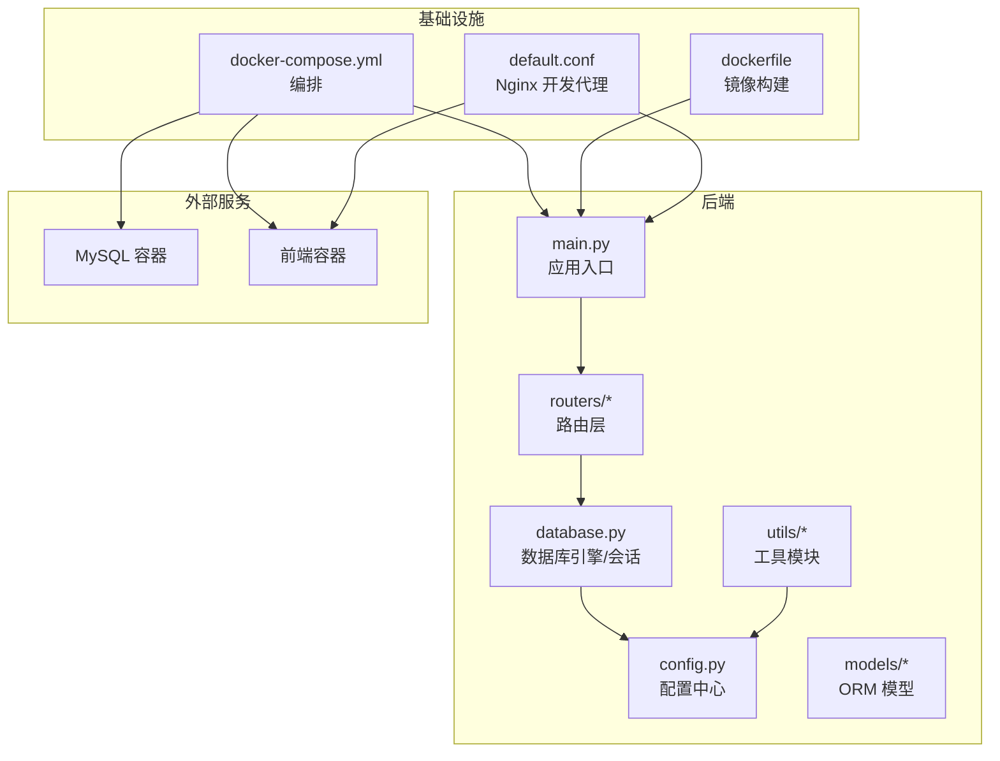
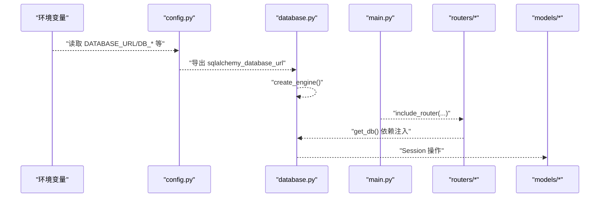
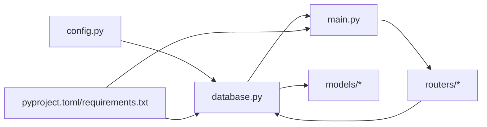

# 环境管理

<cite>
**本文引用的文件**
- [config.py](file://blog_backend/config.py)
- [database.py](file://blog_backend/database.py)
- [main.py](file://blog_backend/main.py)
- [docker-compose.yml](file://docker-compose.yml)
- [dockerfile](file://blog_backend/dockerfile)
- [pyproject.toml](file://blog_backend/pyproject.toml)
- [requirements.txt](file://blog_backend/requirements.txt)
- [default.conf](file://blog_backend/default.conf)
- [init_db.py](file://blog_backend/init_db.py)
- [routers/article.py](file://blog_backend/routers/article.py)
- [models/article.py](file://blog_backend/models/article.py)
- [utils/auth_token.py](file://blog_backend/utils/auth_token.py)
- [utils/crawl.py](file://blog_backend/utils/crawl.py)
</cite>

## 目录
1. [简介](#简介)
2. [项目结构](#项目结构)
3. [核心组件](#核心组件)
4. [架构总览](#架构总览)
5. [详细组件分析](#详细组件分析)
6. [依赖分析](#依赖分析)
7. [性能考虑](#性能考虑)
8. [故障排查指南](#故障排查指南)
9. [结论](#结论)
10. [附录](#附录)

## 简介
本文件聚焦于博客后端的“环境管理与配置管理”，系统性梳理多环境配置策略、环境变量管理、配置文件组织、密钥与敏感信息保护、配置验证与热更新、CI/CD 集成以及变更管理流程，并给出可操作的最佳实践与模板建议。当前仓库已具备基础的环境变量注入与容器化部署能力，但尚未实现严格的多环境隔离与安全加固，后续可在现有基础上进行扩展。

## 项目结构
后端采用 FastAPI + SQLAlchemy 架构，通过环境变量驱动数据库连接与运行参数；使用 Docker Compose 将 MySQL、后端服务与前端服务编排为统一工作负载；Nginx 配置用于本地开发代理前后端请求。

图表来源
- [main.py:1-13](file://blog_backend/main.py#L1-L13)
- [config.py:1-32](file://blog_backend/config.py#L1-L32)
- [database.py:1-18](file://blog_backend/database.py#L1-L18)
- [docker-compose.yml:1-41](file://docker-compose.yml#L1-L41)
- [dockerfile:1-17](file://blog_backend/dockerfile#L1-L17)
- [default.conf:1-27](file://blog_backend/default.conf#L1-L27)

章节来源
- [main.py:1-13](file://blog_backend/main.py#L1-L13)
- [docker-compose.yml:1-41](file://docker-compose.yml#L1-L41)
- [dockerfile:1-17](file://blog_backend/dockerfile#L1-L17)
- [default.conf:1-27](file://blog_backend/default.conf#L1-L27)

## 核心组件
- 配置中心：集中定义数据库连接串、密钥、爬虫与邮件等配置项，支持通过环境变量覆盖默认值。
- 数据库引擎：基于 SQLAlchemy，从配置中心读取连接串，提供会话工厂与依赖注入。
- 应用入口：注册路由，暴露 API。
- 运行时环境：Docker Compose 注入数据库与服务端口映射，Nginx 在本地开发中代理前端与后端。

章节来源
- [config.py:1-32](file://blog_backend/config.py#L1-L32)
- [database.py:1-18](file://blog_backend/database.py#L1-L18)
- [main.py:1-13](file://blog_backend/main.py#L1-L13)

## 架构总览
下图展示从环境变量到应用配置、数据库连接与请求处理的整体链路。

图表来源
- [config.py:1-32](file://blog_backend/config.py#L1-L32)
- [database.py:1-18](file://blog_backend/database.py#L1-L18)
- [main.py:1-13](file://blog_backend/main.py#L1-L13)
- [routers/article.py:1-85](file://blog_backend/routers/article.py#L1-L85)
- [models/article.py:1-41](file://blog_backend/models/article.py#L1-L41)

## 详细组件分析

### 多环境配置策略
- 当前实现：通过环境变量覆盖默认配置，如数据库连接串、爬虫与邮件配置等。Docker Compose 在服务定义中注入 DB_* 变量，形成“容器内环境变量”的最小化多环境形态。
- 建议扩展：
  - 引入环境文件（如 .env.dev/.env.test/.env.prod）与加载库（如 python-dotenv），在不同环境启动时加载对应配置。
  - 使用配置类分层（开发/测试/生产），在运行时选择对应配置类，避免硬编码。
  - 对敏感配置（如密钥、数据库密码）仅在 CI/CD 或密钥管理服务中注入，不进入版本库。

章节来源
- [config.py:1-32](file://blog_backend/config.py#L1-L32)
- [docker-compose.yml:13-26](file://docker-compose.yml#L13-L26)

### 环境变量管理与敏感信息保护
- 已有实践：
  - 数据库连接通过环境变量拼接，未在代码中硬编码明文密码。
  - JWT 密钥与算法在配置中定义，便于替换。
- 风险与改进建议：
  - 敏感信息（如数据库密码、API 密钥、SSL 证书）不应出现在镜像或日志中。
  - 建议使用密钥管理服务（如云厂商 KMS、HashiCorp Vault）或容器平台机密资源，通过只读挂载或环境变量注入。
  - 对配置文件进行加密存储，运行时解密；对日志输出进行脱敏。

章节来源
- [config.py:3-11](file://blog_backend/config.py#L3-L11)
- [config.py:15-17](file://blog_backend/config.py#L15-L17)
- [docker-compose.yml:22-24](file://docker-compose.yml#L22-L24)

### 配置文件组织结构与默认值
- 组织方式：config.py 作为单一配置中心，集中存放数据库连接、密钥、爬虫与邮件配置。
- 默认值策略：对可选或开发用途的配置提供合理默认值，同时允许通过环境变量覆盖。
- 建议优化：
  - 将配置拆分为多个模块（如 db.py、security.py、crawler.py），按功能域划分，提升可维护性。
  - 为每个配置项添加类型注解与校验逻辑，确保启动时即发现错误。

章节来源
- [config.py:1-32](file://blog_backend/config.py#L1-L32)

### 密钥管理策略
- 当前状态：JWT 密钥与算法在配置中定义，便于集中管理。
- 建议措施：
  - 将密钥存储在安全位置（如密钥管理服务），通过环境变量或只读挂载注入。
  - 实施密钥轮换流程：新旧密钥并行期、令牌刷新与回滚策略。
  - 对 SSL 证书与私钥采用只读挂载，避免写入容器层。

章节来源
- [config.py:15-17](file://blog_backend/config.py#L15-L17)
- [utils/auth_token.py:1-200](file://blog_backend/utils/auth_token.py#L1-L200)

### 配置验证机制
- 启动时检查：在应用启动阶段读取关键配置（如 DATABASE_URL、密钥），若缺失或格式异常则拒绝启动。
- 动态配置更新：当前未实现热更新；可通过监听配置文件/密钥服务变更触发重载，或在容器内通过健康检查与滚动重启实现平滑切换。
- 回滚策略：记录最近一次有效配置快照，失败时自动回退；对密钥轮换采用双密钥过渡期。

章节来源
- [config.py:1-32](file://blog_backend/config.py#L1-L32)
- [main.py:1-13](file://blog_backend/main.py#L1-L13)

### CI/CD 环境配置
- 构建与打包：Dockerfile 指定基础镜像、安装依赖、暴露端口并启动服务。
- 编排与注入：docker-compose.yml 将数据库、后端与前端串联，注入 DB_* 环境变量。
- 建议增强：
  - 在 CI 中使用多阶段构建减少镜像体积。
  - 将敏感变量通过 CI 密钥或平台机密注入，避免明文提交。
  - 使用蓝绿/金丝雀发布策略，结合健康检查与回滚脚本。

章节来源
- [dockerfile:1-17](file://blog_backend/dockerfile#L1-L17)
- [docker-compose.yml:1-41](file://docker-compose.yml#L1-L41)
- [pyproject.toml:1-22](file://blog_backend/pyproject.toml#L1-L22)
- [requirements.txt:1-14](file://blog_backend/requirements.txt#L1-L14)

### 配置变更管理流程
- 变更审批：通过分支策略与 PR 审批，限制对 config.py 与 docker-compose.yml 的修改。
- 影响评估：评估数据库迁移、密钥轮换、第三方 API 变更的影响范围。
- 回滚预案：保留上一版配置与镜像标签，失败时快速回滚；对数据库变更使用迁移脚本与备份。

章节来源
- [init_db.py:1-10](file://blog_backend/init_db.py#L1-L10)
- [models/article.py:1-41](file://blog_backend/models/article.py#L1-L41)

### 配置模板与最佳实践
- 配置模板建议：
  - 开发环境：使用本地 Docker Compose，敏感变量在宿主机或 CI 中注入。
  - 测试环境：与生产隔离网络，使用独立密钥与数据库实例。
  - 生产环境：启用只读挂载密钥、最小权限访问、审计日志与告警。
- 最佳实践：
  - 不将任何敏感信息写入镜像或仓库。
  - 所有配置变更必须通过 CI/CD 管道执行。
  - 对关键配置进行参数化与单元化测试。

## 依赖分析
后端依赖主要围绕 Web 框架、数据库 ORM、加密与爬虫工具展开；数据库连接由配置中心统一提供。

图表来源
- [config.py:1-32](file://blog_backend/config.py#L1-L32)
- [database.py:1-18](file://blog_backend/database.py#L1-L18)
- [main.py:1-13](file://blog_backend/main.py#L1-L13)
- [pyproject.toml:1-22](file://blog_backend/pyproject.toml#L1-L22)
- [requirements.txt:1-14](file://blog_backend/requirements.txt#L1-L14)

章节来源
- [pyproject.toml:1-22](file://blog_backend/pyproject.toml#L1-L22)
- [requirements.txt:1-14](file://blog_backend/requirements.txt#L1-L14)

## 性能考虑
- 数据库连接池：在生产环境建议配置连接池大小与超时，避免高并发下的连接争用。
- 启动时间：将配置校验前置，尽早暴露错误，缩短故障定位时间。
- 镜像体积：使用多阶段构建与精简基础镜像，减少启动与拉取时间。
- Nginx 代理：在本地开发中启用压缩与缓存头，提升前端交互体验。

## 故障排查指南
- 数据库连接失败
  - 检查环境变量是否正确注入（DB_HOST/DB_PORT/DB_USER/DB_PASSWORD/DB_NAME）。
  - 确认容器网络连通性与端口映射。
- JWT 签名异常
  - 确认密钥与算法一致，避免跨环境混用。
- 爬虫与邮件功能
  - 若 EMAIL_CONFIG 未启用，相关通知不会发送；检查 enabled 字段与 SMTP 参数。
- 启动失败
  - 查看容器日志，确认配置中心读取与数据库引擎初始化是否报错。

章节来源
- [docker-compose.yml:19-26](file://docker-compose.yml#L19-L26)
- [config.py:23-31](file://blog_backend/config.py#L23-L31)
- [utils/crawl.py:1-400](file://blog_backend/utils/crawl.py#L1-L400)

## 结论
当前项目已具备通过环境变量驱动配置与容器化部署的基础能力。为满足更高标准的环境管理与配置治理，建议引入多环境配置类、密钥管理服务、配置验证与热更新机制，并完善 CI/CD 流水线与变更管理流程。上述改进将显著提升系统的安全性、可维护性与可扩展性。

## 附录
- 开发环境启动步骤（基于现有文件）
  - 使用 docker-compose 启动数据库与后端服务，前端通过 Nginx 代理访问。
  - 确保端口未被占用，且网络连通。
- 配置项清单（来自配置中心）
  - 数据库连接串：通过 DATABASE_URL 或 DB_* 组合生成。
  - JWT 密钥与算法：用于令牌签名与解析。
  - 爬虫与目标文件：用于数据采集任务。
  - 邮件配置：SMTP 主机、端口、账号、密码与收发邮箱。

章节来源
- [docker-compose.yml:1-41](file://docker-compose.yml#L1-L41)
- [default.conf:1-27](file://blog_backend/default.conf#L1-L27)
- [config.py:1-32](file://blog_backend/config.py#L1-L32)